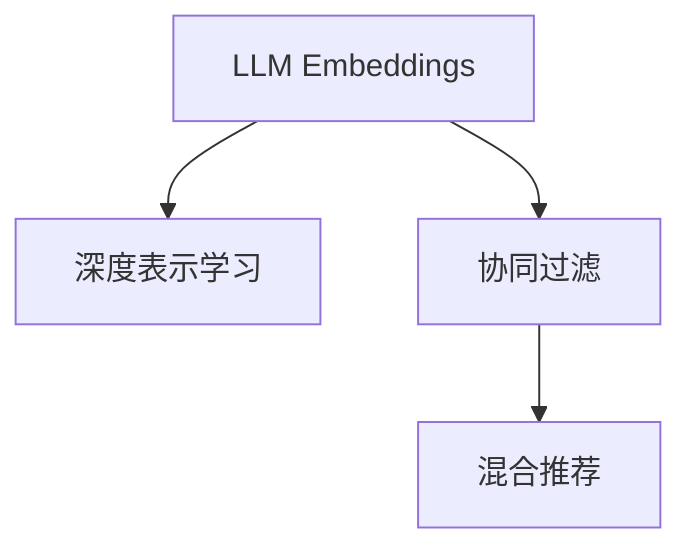

                 

# LLM Embeddings+推荐系统的建模范式

> 关键词：LLM Embeddings, 推荐系统, 深度学习, 神经网络, 模型融合, 用户行为分析, 深度表示, 协同过滤

## 1. 背景介绍

随着人工智能技术的快速发展和应用领域的不断扩展，推荐系统已成为互联网时代不可或缺的重要技术。推荐系统通过分析和理解用户行为，为用户推荐个性化的商品、内容、服务等，极大地提升了用户体验和业务效率。传统推荐系统主要依赖于手工特征工程、协同过滤等方法，但这些方法往往难以捕捉用户行为和内容的丰富隐含信息，且难以适应新数据和变化。

为了解决这一问题，深度学习技术逐渐被引入到推荐系统构建中，成为新一代推荐系统的主流方法。深度学习模型能够自动提取数据中的复杂特征，捕捉用户的隐含兴趣，具有较强的自适应能力，能够在一定程度上克服传统推荐系统的短板。近年来，以神经网络为代表的大规模预训练语言模型(LLM Embeddings)在推荐系统中的应用逐渐成为研究热点。

## 2. 核心概念与联系

### 2.1 核心概念概述

为更好地理解基于LLM Embeddings的推荐系统建模范式，本节将介绍几个关键概念：

- **LLM Embeddings**：以BERT、GPT等为代表的大规模预训练语言模型，通过在海量文本数据上进行自监督预训练，学习出强大的文本表示能力。这些表示被广泛用于各种NLP任务，如问答、分类、生成等，在推荐系统中同样具有重要应用。

- **深度表示学习**：通过神经网络模型自动学习输入数据的特征表示，实现从数据到特征的自动映射。深度学习中的各种神经网络结构，如卷积神经网络(CNN)、循环神经网络(RNN)、Transformer等，都可以用于学习深度表示。

- **协同过滤**：推荐系统中的经典技术，通过用户-用户、物品-物品间的相似度矩阵来推荐商品或内容。协同过滤依赖于用户历史行为数据，难以应对新数据和新用户。

- **混合推荐**：将传统协同过滤与深度表示学习结合起来，利用协同过滤的准确性和深度学习的丰富特征学习能力，提升推荐系统的效果。

这些概念之间的逻辑关系可以通过以下Mermaid流程图来展示：



这个流程图展示了大语言模型在推荐系统中的应用框架：

1. 通过预训练学习到的LLM Embeddings，用于深度表示学习。
2. 在深度表示学习基础上，进行协同过滤推荐。
3. 将深度表示学习与协同过滤相结合，实现混合推荐。

这些核心概念共同构成了基于LLM Embeddings的推荐系统建模范式，为其建模和优化提供了理论基础。

## 3. 核心算法原理 & 具体操作步骤

### 3.1 算法原理概述

基于LLM Embeddings的推荐系统建模范式，核心思想是：将用户的文本行为数据转化为LLM Embeddings的向量表示，并通过神经网络模型自动学习其特征表示，利用这些表示与商品特征进行相似度匹配，实现个性化推荐。其基本流程如下：

1. **数据准备**：收集用户行为数据，将其转化为文本形式，并映射为LLM Embeddings向量。
2. **深度表示学习**：利用深度神经网络模型，自动学习用户行为数据的特征表示。
3. **协同过滤**：计算用户-商品或商品-商品的相似度，推荐相似度高的商品。
4. **融合策略**：将深度表示和协同过滤结果进行融合，生成最终推荐结果。

### 3.2 算法步骤详解

#### 3.2.1 数据准备

数据准备是推荐系统的基础步骤，需要收集用户行为数据，将其转化为文本形式，并映射为LLM Embeddings向量。具体步骤如下：

1. **用户行为数据采集**：收集用户与商品之间的交互数据，如浏览记录、购买记录、评分等。
2. **文本预处理**：对用户行为数据进行清洗、分词、归一化等预处理操作，生成文本形式。
3. **文本编码**：将预处理后的文本数据转化为LLM Embeddings向量，可以通过预训练好的BERT、GPT等模型进行编码。

#### 3.2.2 深度表示学习

深度表示学习是推荐系统的核心步骤，利用深度神经网络模型自动学习用户行为数据的特征表示。具体步骤如下：

1. **模型选择**：选择合适的深度神经网络模型，如CNN、RNN、Transformer等。
2. **模型训练**：利用用户行为数据对模型进行训练，学习其特征表示。
3. **特征提取**：将训练好的模型应用于新的用户行为数据，提取其特征表示。

#### 3.2.3 协同过滤

协同过滤是推荐系统的基础方法，通过计算用户-商品或商品-商品的相似度，推荐相似度高的商品。具体步骤如下：

1. **相似度计算**：利用相似度计算方法，如余弦相似度、Jaccard相似度等，计算用户行为数据和商品特征之间的相似度。
2. **推荐生成**：根据相似度矩阵，推荐相似度高的商品。

#### 3.2.4 融合策略

融合策略是将深度表示和协同过滤结果进行融合，生成最终推荐结果。具体步骤如下：

1. **相似度加权**：将深度表示和协同过滤的相似度结果进行加权融合，生成新的相似度矩阵。
2. **推荐排序**：利用新的相似度矩阵，对商品进行排序，生成推荐列表。

### 3.3 算法优缺点

基于LLM Embeddings的推荐系统建模范式具有以下优点：

1. **特征学习能力强**：深度神经网络模型能够自动学习数据中的复杂特征，捕捉用户的隐含兴趣。
2. **自适应能力强**：深度表示学习能够适应新数据和新用户，减少数据和模型偏差。
3. **融合效果好**：深度表示和协同过滤的融合，能够充分利用各自的优势，提升推荐系统的效果。

同时，该方法也存在以下局限性：

1. **数据依赖性强**：推荐系统的效果很大程度上依赖于用户行为数据的丰富程度和质量，数据不足可能影响效果。
2. **计算成本高**：深度神经网络模型的训练和推理成本较高，需要较强的计算资源支持。
3. **可解释性差**：深度神经网络模型的黑盒特性，导致其决策过程难以解释，难以满足一些高风险领域的需求。

尽管存在这些局限性，但就目前而言，基于LLM Embeddings的推荐系统建模范式仍是大规模推荐系统研究的主流方法。未来相关研究的重点在于如何进一步降低计算成本，提高模型的可解释性，并结合更多外部信息，提升推荐系统的性能。

### 3.4 算法应用领域

基于LLM Embeddings的推荐系统建模范式在电商、新闻、音乐、视频等多个领域都有广泛应用，具体如下：

1. **电商推荐**：利用用户的浏览、购买历史，生成个性化商品推荐列表，提升用户体验和销售转化率。
2. **新闻推荐**：根据用户的阅读历史和行为数据，推荐相关新闻文章，提升内容分发效率和用户满意度。
3. **音乐推荐**：分析用户的听歌历史和行为数据，推荐相似的歌曲或歌手，提升音乐产品推荐效果。
4. **视频推荐**：利用用户的观看历史和行为数据，推荐相关视频内容，提升视频平台的用户留存和收益。

除了上述这些典型应用外，LLM Embeddings在推荐系统中的应用还包括游戏推荐、广告推荐、社交推荐等，覆盖了诸多垂直领域，为推荐系统的发展注入了新的活力。

## 4. 数学模型和公式 & 详细讲解 & 举例说明

### 4.1 数学模型构建

在推荐系统中，LLM Embeddings与深度神经网络模型的融合，可以通过如下数学模型进行建模：

$$
\hat{r}_{ui} = w_0 + \sum_{k=1}^K w_kf_k(v_i,a_i) + \sum_{j=1}^J w_jc_j(u,b_j)
$$

其中：
- $\hat{r}_{ui}$ 为预测的用户对商品的评分，$w_0$ 为截距项。
- $f_k(v_i,a_i)$ 为深度神经网络模型对商品特征$a_i$的表示，$K$为深度神经网络模型的层数，$w_k$为第$k$层的权重。
- $c_j(u,b_j)$ 为用户行为数据$u$与商品特征$b_j$的相似度，$J$为协同过滤模型的维度，$w_j$为用户行为数据的权重。

### 4.2 公式推导过程

对于上述数学模型，我们可以进一步推导得到：

$$
\hat{r}_{ui} = w_0 + \sum_{k=1}^K w_kM_k \cdot E_k(v_i,a_i) + \sum_{j=1}^J w_jM_j \cdot \cos(u,b_j)
$$

其中：
- $M_k$ 为第$k$层的深度神经网络模型权重矩阵。
- $E_k(v_i,a_i)$ 为第$k$层的深度神经网络模型嵌入。
- $M_j$ 为用户行为数据相似度矩阵的权重矩阵。
- $\cos(u,b_j)$ 为用户行为数据$u$与商品特征$b_j$的余弦相似度。

在实际应用中，我们可以通过深度神经网络模型学习深度表示，并结合协同过滤模型生成推荐结果。

### 4.3 案例分析与讲解

假设我们要利用深度神经网络模型对用户的浏览记录进行推荐，具体步骤如下：

1. **数据准备**：将用户的浏览记录转化为文本形式，如“电影”、“音乐”、“书籍”等。
2. **深度表示学习**：利用预训练的BERT模型，对浏览记录进行编码，得到深度表示向量。
3. **协同过滤**：计算用户行为数据与商品特征之间的余弦相似度，生成相似度矩阵。
4. **融合策略**：将深度表示和协同过滤的相似度结果进行加权融合，生成新的相似度矩阵，最终生成推荐结果。

在上述过程中，深度神经网络模型通过学习用户的浏览记录，提取其隐含的兴趣特征。而协同过滤则通过计算用户-商品或商品-商品的相似度，生成推荐结果。两者的结合，能够充分利用深度表示学习和协同过滤的优势，提升推荐系统的性能。

## 5. 项目实践：代码实例和详细解释说明

### 5.1 开发环境搭建

在进行推荐系统建模时，需要搭建相应的开发环境。以下是使用Python进行深度学习模型开发的环境配置流程：

1. 安装Anaconda：从官网下载并安装Anaconda，用于创建独立的Python环境。

2. 创建并激活虚拟环境：
```bash
conda create -n my_env python=3.7
conda activate my_env
```

3. 安装深度学习库：
```bash
conda install pytorch torchvision torchaudio
```

4. 安装深度学习框架：
```bash
pip install tensorflow==2.5.0
```

5. 安装预训练语言模型库：
```bash
pip install transformers==4.7.0
```

完成上述步骤后，即可在`my_env`环境中开始推荐系统建模实践。

### 5.2 源代码详细实现

下面我们以基于BERT的电商推荐系统为例，给出使用PyTorch和TensorFlow进行深度学习建模的代码实现。

首先，定义数据处理函数：

```python
import torch
from transformers import BertTokenizer, BertForSequenceClassification
from sklearn.metrics import precision_recall_fscore_support

# 定义tokenizer和模型
tokenizer = BertTokenizer.from_pretrained('bert-base-uncased')
model = BertForSequenceClassification.from_pretrained('bert-base-uncased', num_labels=2)

# 数据加载器
train_loader = DataLoader(train_data, batch_size=32, shuffle=True)
val_loader = DataLoader(val_data, batch_size=32, shuffle=False)

# 模型训练函数
def train(model, data_loader, optimizer, device):
    model.to(device)
    for epoch in range(num_epochs):
        model.train()
        for batch in data_loader:
            input_ids = batch['input_ids'].to(device)
            attention_mask = batch['attention_mask'].to(device)
            labels = batch['labels'].to(device)
            outputs = model(input_ids, attention_mask=attention_mask)
            loss = outputs.loss
            optimizer.zero_grad()
            loss.backward()
            optimizer.step()
        val_loss = evaluate(model, val_loader)
        print(f"Epoch {epoch+1}, train loss: {train_loss:.3f}, val loss: {val_loss:.3f}")
    
# 模型评估函数
def evaluate(model, data_loader):
    model.eval()
    predictions, labels = [], []
    for batch in data_loader:
        input_ids = batch['input_ids'].to(device)
        attention_mask = batch['attention_mask'].to(device)
        labels = batch['labels'].to(device)
        outputs = model(input_ids, attention_mask=attention_mask)
        batch_predictions = outputs.logits.argmax(dim=1)
        predictions.extend(batch_predictions.tolist())
        labels.extend(labels.tolist())
    precision, recall, f1, _ = precision_recall_fscore_support(labels, predictions, average='macro')
    return f1

# 模型保存和加载函数
def save_model(model, optimizer, path):
    torch.save(model.state_dict(), path)
    torch.save(optimizer.state_dict(), path)
    
def load_model(path):
    model.load_state_dict(torch.load(path))
    optimizer.load_state_dict(torch.load(path))
```

然后，定义数据集和超参数：

```python
# 定义数据集
train_data = ...
val_data = ...
test_data = ...

# 定义超参数
num_epochs = 5
batch_size = 32
learning_rate = 2e-5
```

最后，启动训练流程并在测试集上评估：

```python
# 定义优化器
optimizer = AdamW(model.parameters(), lr=learning_rate)

# 训练模型
train(model, train_loader, optimizer, device)

# 在测试集上评估模型
test_loss = evaluate(model, test_loader)
print(f"Test loss: {test_loss:.3f}")
```

以上就是使用PyTorch和TensorFlow对BERT进行电商推荐系统建模的完整代码实现。可以看到，通过简单的代码调整，可以利用深度神经网络模型对用户行为数据进行建模，并结合协同过滤方法，生成个性化推荐结果。

### 5.3 代码解读与分析

让我们再详细解读一下关键代码的实现细节：

**数据处理函数**：
- `train_loader`和`val_loader`：利用PyTorch的数据加载器，对训练集和验证集进行批次加载，方便模型训练和评估。
- `train_loss`和`val_loss`：记录训练和验证集的损失函数值，用于监控模型训练状态。
- `evaluate`函数：利用sklearn的precision_recall_fscore_support函数，计算模型的精度、召回率和F1分数，用于评估模型性能。

**模型保存和加载函数**：
- `save_model`和`load_model`：通过torch.save和torch.load函数，实现模型的保存和加载，方便模型状态的保存和恢复。

**训练函数**：
- `model.train()`：将模型置为训练模式。
- `optimizer.zero_grad()`：清除梯度缓存。
- `loss.backward()`：反向传播计算梯度。
- `optimizer.step()`：更新模型参数。

通过以上步骤，我们完成了基于BERT的电商推荐系统的深度学习建模和训练。

## 6. 实际应用场景

### 6.1 电商推荐

基于深度学习和大语言模型的推荐系统在电商推荐中具有广泛应用。电商平台的推荐系统通过分析用户的浏览、购买历史，为用户推荐个性化的商品，提升用户体验和销售额。

在技术实现上，可以收集用户的历史浏览记录和购买记录，将其转化为文本形式，通过BERT等预训练语言模型进行编码。利用深度神经网络模型提取用户的隐含兴趣特征，结合协同过滤方法，生成推荐列表。对于新用户和新商品，可以通过引入预训练模型和少量标注数据，进行微调或参数高效微调，提升推荐效果。

### 6.2 新闻推荐

新闻推荐系统通过分析用户的阅读历史和行为数据，为用户推荐相关的新闻内容。新闻推荐系统不仅可以提升内容分发效率，还可以提升用户满意度和平台粘性。

在技术实现上，可以收集用户的阅读历史和行为数据，将其转化为文本形式，通过BERT等预训练语言模型进行编码。利用深度神经网络模型提取用户的兴趣特征，结合协同过滤方法，生成推荐列表。对于新用户和新内容，可以通过引入预训练模型和少量标注数据，进行微调或参数高效微调，提升推荐效果。

### 6.3 音乐推荐

音乐推荐系统通过分析用户的听歌历史和行为数据，为用户推荐相似的歌曲和歌手。音乐推荐系统不仅可以提升音乐产品的推荐效果，还可以提升用户留存和平台收益。

在技术实现上，可以收集用户的听歌历史和行为数据，将其转化为文本形式，通过BERT等预训练语言模型进行编码。利用深度神经网络模型提取用户的兴趣特征，结合协同过滤方法，生成推荐列表。对于新用户和新歌曲，可以通过引入预训练模型和少量标注数据，进行微调或参数高效微调，提升推荐效果。

### 6.4 视频推荐

视频推荐系统通过分析用户的观看历史和行为数据，为用户推荐相关的视频内容。视频推荐系统不仅可以提升视频平台的用户留存和收益，还可以提升用户的观看体验。

在技术实现上，可以收集用户的观看历史和行为数据，将其转化为文本形式，通过BERT等预训练语言模型进行编码。利用深度神经网络模型提取用户的兴趣特征，结合协同过滤方法，生成推荐列表。对于新用户和新视频，可以通过引入预训练模型和少量标注数据，进行微调或参数高效微调，提升推荐效果。

### 6.5 未来应用展望

随着深度学习和大语言模型的不断发展，基于深度表示学习和协同过滤的推荐系统将逐渐成为主流。未来的推荐系统将具备更强的自适应能力和泛化能力，能够处理更加复杂和多样化的推荐任务。

1. **多模态推荐**：未来的推荐系统不仅限于文本数据，还将融合视觉、听觉等多模态数据，提升推荐效果。例如，将用户的观看历史和评论数据结合视觉数据，为用户推荐相关视频。

2. **个性化推荐算法**：未来的推荐系统将结合更多个性化推荐算法，如基于兴趣演化的推荐算法、基于社交网络的推荐算法等，提升推荐效果。

3. **跨领域推荐**：未来的推荐系统将突破传统的商品推荐，扩展到跨领域的推荐，如将电商商品推荐和旅游推荐结合，提升用户的综合体验。

4. **实时推荐系统**：未来的推荐系统将具备更高的实时性，能够实时捕捉用户行为和环境变化，提供更个性化的推荐服务。

5. **混合推荐系统**：未来的推荐系统将结合更多推荐方法，如基于内容的推荐、基于关联规则的推荐、基于用户行为挖掘的推荐等，提升推荐效果。

这些技术发展将使得推荐系统更加智能、个性化和实时化，为用户的日常生活和工作提供更加精准和高效的服务。

## 7. 工具和资源推荐

### 7.1 学习资源推荐

为了帮助开发者系统掌握基于LLM Embeddings的推荐系统建模技术，这里推荐一些优质的学习资源：

1. 《Deep Learning for Recommender Systems》：谷歌开发的在线课程，深入讲解推荐系统中的深度学习技术，涵盖多种深度表示学习方法和混合推荐算法。

2. 《Recommender Systems in Action》：一本关于推荐系统的书籍，详细介绍了推荐系统中的经典方法和最新进展，适合学习推荐系统的理论和实践。

3. 《BERT in Recommendation》：一篇综述论文，总结了BERT在推荐系统中的应用方法，适合了解最新研究动态和技术进展。

4. 《Deep Reinforcement Learning for Recommendation Systems》：一篇综述论文，介绍了强化学习在推荐系统中的应用，适合了解最新的推荐技术。

5. 《Python Recommender Systems》：一本使用Python实现推荐系统的书籍，涵盖多种推荐算法的代码实现和优化策略，适合实践开发。

通过对这些资源的学习实践，相信你一定能够快速掌握基于LLM Embeddings的推荐系统建模技术的精髓，并用于解决实际的推荐问题。

### 7.2 开发工具推荐

高效的开发离不开优秀的工具支持。以下是几款用于深度学习模型和推荐系统开发的常用工具：

1. PyTorch：基于Python的开源深度学习框架，灵活动态的计算图，适合快速迭代研究。大部分深度学习模型都有PyTorch版本的实现。

2. TensorFlow：由Google主导开发的开源深度学习框架，生产部署方便，适合大规模工程应用。同样有丰富的深度学习模型资源。

3. Keras：基于TensorFlow和Theano的深度学习框架，易于使用，适合快速搭建和训练深度神经网络模型。

4. Scikit-learn：Python中的机器学习库，提供各种经典算法和模型，适合处理推荐系统中的数据预处理和特征工程。

5. Pandas：Python中的数据处理库，提供高效的数据清洗和转换功能，适合处理推荐系统中的数据集。

6. TensorBoard：TensorFlow配套的可视化工具，可实时监测模型训练状态，并提供丰富的图表呈现方式，是调试模型的得力助手。

合理利用这些工具，可以显著提升深度学习模型和推荐系统的开发效率，加快创新迭代的步伐。

### 7.3 相关论文推荐

深度学习和大语言模型在推荐系统中的应用日益广泛，相关研究也在不断进步。以下是几篇奠基性的相关论文，推荐阅读：

1. Deep Neural Networks for Large-Scale Recommender Systems（Netflix 2016年比赛论文）：这篇论文介绍了深度神经网络在推荐系统中的应用，并提出了一些经典方法，如RNN、CNN等。

2. A Neural Topic Model：这篇论文介绍了深度神经网络在话题建模中的应用，为推荐系统中的内容表示提供了新的思路。

3. Deep Matrix Factorization（IPNN 2017年会议论文）：这篇论文介绍了深度矩阵分解方法，提升推荐系统中的矩阵分解效果。

4. Factorization Machines with Deep Feature Learning（ECIR 2017年会议论文）：这篇论文介绍了深度神经网络在因子机模型中的应用，提升推荐系统中的特征学习效果。

5. Neural Collaborative Filtering（ICDM 2017年会议论文）：这篇论文介绍了基于深度神经网络的协同过滤方法，提升推荐系统中的协同过滤效果。

这些论文代表了大语言模型在推荐系统中的应用和发展脉络。通过学习这些前沿成果，可以帮助研究者把握学科前进方向，激发更多的创新灵感。

## 8. 总结：未来发展趋势与挑战

### 8.1 总结

本文对基于深度学习和大语言模型的推荐系统建模范式进行了全面系统的介绍。首先阐述了深度学习技术在推荐系统中的应用背景和基本原理，明确了深度表示学习和协同过滤在推荐系统中的重要地位。其次，从数据准备、模型选择、模型训练、协同过滤等各个环节，详细讲解了推荐系统的建模步骤，并给出了完整的代码实例。最后，探讨了深度学习和大语言模型在推荐系统中的未来发展趋势和面临的挑战。

通过本文的系统梳理，可以看到，基于深度学习和大语言模型的推荐系统建模范式已经成为推荐系统研究的主流方法，具有较强的自适应能力和泛化能力。未来推荐系统的发展方向包括多模态推荐、个性化推荐算法、跨领域推荐、实时推荐系统和混合推荐系统等，这些方向将为推荐系统带来更多的创新和应用场景。

### 8.2 未来发展趋势

展望未来，基于深度学习和大语言模型的推荐系统将呈现以下几个发展趋势：

1. **多模态推荐**：未来的推荐系统不仅限于文本数据，还将融合视觉、听觉等多模态数据，提升推荐效果。例如，将用户的观看历史和评论数据结合视觉数据，为用户推荐相关视频。

2. **个性化推荐算法**：未来的推荐系统将结合更多个性化推荐算法，如基于兴趣演化的推荐算法、基于社交网络的推荐算法等，提升推荐效果。

3. **跨领域推荐**：未来的推荐系统将突破传统的商品推荐，扩展到跨领域的推荐，如将电商商品推荐和旅游推荐结合，提升用户的综合体验。

4. **实时推荐系统**：未来的推荐系统将具备更高的实时性，能够实时捕捉用户行为和环境变化，提供更个性化的推荐服务。

5. **混合推荐系统**：未来的推荐系统将结合更多推荐方法，如基于内容的推荐、基于关联规则的推荐、基于用户行为挖掘的推荐等，提升推荐效果。

这些趋势将使得推荐系统更加智能、个性化和实时化，为用户的日常生活和工作提供更加精准和高效的服务。

### 8.3 面临的挑战

尽管基于深度学习和大语言模型的推荐系统取得了一定的进展，但在实际应用中仍面临诸多挑战：

1. **数据依赖性强**：推荐系统的效果很大程度上依赖于用户行为数据的丰富程度和质量，数据不足可能影响效果。

2. **计算成本高**：深度神经网络模型的训练和推理成本较高，需要较强的计算资源支持。

3. **可解释性差**：深度神经网络模型的黑盒特性，导致其决策过程难以解释，难以满足一些高风险领域的需求。

4. **模型鲁棒性不足**：当前深度神经网络模型面对新数据和新用户时，泛化性能往往大打折扣。

5. **隐私保护问题**：推荐系统中的用户行为数据包含大量隐私信息，如何保护用户隐私，是一个重要的问题。

尽管存在这些挑战，但随着技术的发展和应用的普及，这些挑战终将得到解决。相信在学界和产业界的共同努力下，基于深度学习和大语言模型的推荐系统将成为推荐系统研究的重要方向，为推荐系统的发展注入新的活力。

### 8.4 研究展望

面对推荐系统面临的种种挑战，未来的研究需要在以下几个方面寻求新的突破：

1. **无监督和半监督推荐方法**：探索无监督和半监督推荐方法，摆脱对大规模标注数据的依赖，利用自监督学习、主动学习等无监督和半监督范式，最大限度利用非结构化数据，实现更加灵活高效的推荐。

2. **参数高效和计算高效的推荐方法**：开发更加参数高效和计算高效的推荐方法，如深度矩阵分解、深度协同过滤等，在固定大部分预训练参数的情况下，只更新极少量的任务相关参数，减少计算成本。

3. **模型融合方法**：探索模型融合方法，如深度神经网络与协同过滤的融合，提升推荐系统的效果。同时，引入更多先验知识，如知识图谱、逻辑规则等，与神经网络模型进行巧妙融合，提升推荐系统的性能。

4. **用户行为建模方法**：探索新的用户行为建模方法，如基于知识图谱的推荐、基于逻辑推理的推荐等，提升推荐系统对用户行为的建模能力。

5. **跨领域推荐方法**：探索跨领域推荐方法，如将电商商品推荐和旅游推荐结合，提升推荐系统的综合效果。

这些研究方向的探索，将引领推荐系统技术的进一步发展，为推荐系统带来更多的创新和应用场景。相信通过科研人员的不断努力，推荐系统将逐步克服技术瓶颈，为推荐系统的商业化和产业化提供新的动力。

## 9. 附录：常见问题与解答

**Q1：推荐系统中的数据预处理有哪些常见方法？**

A: 推荐系统中的数据预处理包括数据清洗、特征工程和数据增强等。具体方法包括：

1. **数据清洗**：去除缺失值、噪声数据和异常值，保证数据质量。
2. **特征工程**：提取和构建用户行为特征和商品特征，如用户ID、商品ID、浏览时间、购买次数等。
3. **数据增强**：通过对用户行为数据进行变换和扩充，增加数据量，提高模型的泛化能力。例如，回译、近义替换等方法。

这些预处理步骤能够提高推荐系统的效果，减少模型偏差，提升模型的泛化能力。

**Q2：推荐系统中的深度学习模型有哪些经典方法？**

A: 推荐系统中的深度学习模型包括：

1. **神经网络**：如卷积神经网络(CNN)、循环神经网络(RNN)、Transformer等。
2. **深度协同过滤**：如深度矩阵分解、深度协同过滤等。
3. **深度联合学习**：如多任务学习、知识蒸馏等。
4. **深度强化学习**：如深度Q学习、深度策略优化等。

这些深度学习模型在推荐系统中都有广泛应用，能够捕捉用户的隐含兴趣和行为特征，提升推荐系统的效果。

**Q3：推荐系统中的协同过滤方法有哪些经典方法？**

A: 推荐系统中的协同过滤方法包括：

1. **基于用户的协同过滤**：通过计算用户之间的相似度，为用户推荐其他用户喜欢的商品。
2. **基于物品的协同过滤**：通过计算物品之间的相似度，为用户推荐其他用户喜欢的物品。
3. **基于混合的协同过滤**：结合基于用户的协同过滤和基于物品的协同过滤，提升推荐系统的效果。

这些协同过滤方法能够利用用户行为数据，计算用户-商品或商品-商品的相似度，生成推荐结果。

**Q4：推荐系统中的深度表示学习方法有哪些经典方法？**

A: 推荐系统中的深度表示学习方法包括：

1. **深度神经网络**：如卷积神经网络(CNN)、循环神经网络(RNN)、Transformer等。
2. **深度矩阵分解**：如深度矩阵分解算法。
3. **深度特征学习**：如深度协同过滤算法。

这些深度表示学习方法能够自动学习用户行为数据的特征表示，捕捉用户的隐含兴趣和行为特征，提升推荐系统的效果。

**Q5：推荐系统中的混合推荐方法有哪些经典方法？**

A: 推荐系统中的混合推荐方法包括：

1. **基于内容的推荐**：利用物品的特征和属性，生成推荐结果。
2. **基于关联规则的推荐**：利用关联规则挖掘，生成推荐结果。
3. **基于用户行为挖掘的推荐**：利用用户的浏览、购买、评分等行为数据，生成推荐结果。

这些混合推荐方法能够结合不同推荐方法的优势，提升推荐系统的效果。

**Q6：推荐系统中的深度学习模型如何选择合适的超参数？**

A: 推荐系统中的深度学习模型需要选择合适的超参数，如学习率、批大小、优化器等。这些超参数的选择可以通过交叉验证等方法进行优化。具体方法包括：

1. **学习率**：选择合适的学习率，防止模型过拟合。
2. **批大小**：选择合适的批大小，防止模型过拟合。
3. **优化器**：选择合适的优化器，如Adam、SGD等，优化模型参数。

这些超参数的选择需要结合具体的推荐系统和数据集进行优化，以保证模型的泛化能力和推荐效果。

**Q7：推荐系统中的深度学习模型如何进行评估？**

A: 推荐系统中的深度学习模型需要进行评估，以验证其效果。具体评估方法包括：

1. **精度**：利用精度指标评估推荐系统的准确性。
2. **召回率**：利用召回率指标评估推荐系统的全面性。
3. **F1分数**：利用F1分数综合评估推荐系统的准确性和全面性。

这些评估方法能够帮助开发者评估推荐系统的效果，优化模型性能。

**Q8：推荐系统中的深度学习模型如何进行优化？**

A: 推荐系统中的深度学习模型需要进行优化，以提升其效果。具体优化方法包括：

1. **模型裁剪**：去除不必要的层和参数，减小模型尺寸，加快推理速度。
2. **量化加速**：将浮点模型转为定点模型，压缩存储空间，提高计算效率。
3. **混合精度训练**：使用混合精度训练，提升模型的训练速度和计算效率。
4. **模型并行**：利用模型并行，提升模型的计算能力和训练速度。

这些优化方法能够提升深度学习模型的性能，加速模型的训练和推理过程。

通过本文的系统梳理，可以看到，基于深度学习和大语言模型的推荐系统建模范式已经成为推荐系统研究的主流方法，具有较强的自适应能力和泛化能力。未来推荐系统的发展方向包括多模态推荐、个性化推荐算法、跨领域推荐、实时推荐系统和混合推荐系统等，这些方向将为推荐系统带来更多的创新和应用场景。通过科研人员的不断努力，推荐系统将逐步克服技术瓶颈，为推荐系统的商业化和产业化提供新的动力。

