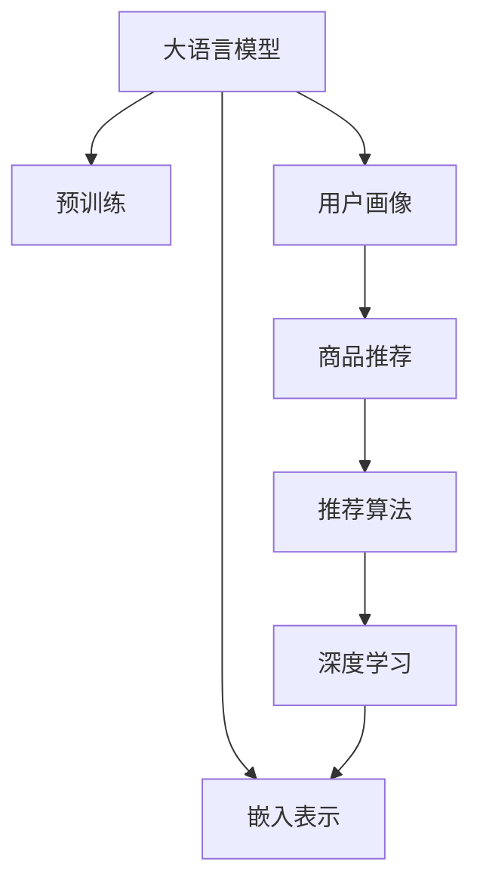

                 

# LLM Embeddings在推荐系统中的应用

> 关键词：大语言模型,嵌入表示,推荐系统,用户画像,商品推荐,多模态数据融合,推荐算法,深度学习,工业部署

## 1. 背景介绍

### 1.1 问题由来
随着电子商务和数字内容的爆炸性增长，推荐系统在电商、新闻、视频等众多领域得到了广泛的应用。传统的推荐算法如协同过滤、基于内容的推荐等，已无法满足现代用户日益增长的个性化需求。近年来，基于深度学习技术的大规模推荐系统应运而生，逐渐成为推荐领域的主流范式。

深度学习推荐系统主要是利用用户行为数据，通过神经网络模型自动提取用户和物品之间的语义关系。其中，大语言模型(Large Language Model, LLM)因其强大的自然语言处理能力，在推荐系统中也得到了广泛应用。LLM能够自动学习用户和物品的自然语言描述，并通过交叉信息提取用户画像，提升推荐效果。

## 2. 核心概念与联系

### 2.1 核心概念概述

为了更深刻地理解LLM Embeddings在推荐系统中的应用，本节将介绍几个关键概念及其相互联系：

- 大语言模型(Large Language Model, LLM)：以自回归(如GPT)或自编码(如BERT)模型为代表的大规模预训练语言模型。通过在大规模无标签文本语料上进行预训练，学习通用的语言表示，具备强大的语言理解和生成能力。

- 预训练(Pre-training)：指在大规模无标签文本语料上，通过自监督学习任务训练通用语言模型的过程。常见的预训练任务包括言语建模、遮挡语言模型等。

- 用户画像(User Profile)：通过用户行为数据、历史评分、评论等信息，构建用户兴趣、偏好等高维特征向量。

- 商品推荐(Commodity Recommendation)：根据用户画像和商品特征，计算用户对商品的兴趣评分，推荐相似度高的商品。

- 推荐算法(Recommendation Algorithm)：基于用户画像和商品特征，结合用户行为数据和评分信息，计算用户对商品的兴趣度，推荐相关商品。

- 深度学习(Deep Learning)：基于神经网络模型进行推荐系统的建模，提取高维隐含特征，进行用户画像和商品表示学习。

- 嵌入表示(Embedding Representation)：将高维特征转换为低维连续向量，通过高维稠密矩阵相乘计算用户和商品之间的相似度。

这些核心概念之间的逻辑关系可以通过以下Mermaid流程图来展示：



这个流程图展示了大语言模型的核心概念及其之间的关系：

1. 大语言模型通过预训练获得基础能力。
2. 用户画像利用大语言模型自动学习用户的兴趣和行为。
3. 商品推荐根据用户画像和商品特征计算兴趣评分。
4. 深度学习构建用户和商品的嵌入表示，进行推荐计算。

这些概念共同构成了大语言模型在推荐系统中的应用框架，使得推荐系统能够高效地为用户提供个性化的商品推荐。

## 3. 核心算法原理 & 具体操作步骤
### 3.1 算法原理概述

基于大语言模型的推荐系统，核心思想是利用预训练得到的语言嵌入表示，对用户和商品进行特征提取，并在用户画像和商品表示间进行相似度计算。具体来说，算法过程如下：

1. 收集用户的文本描述（如评论、评分、行为日志等），将其作为输入数据。
2. 利用预训练的语言模型对用户输入进行编码，得到用户嵌入表示。
3. 同样地，对商品的文本描述（如标题、描述、评论等）进行编码，得到商品嵌入表示。
4. 使用深度学习模型（如神经网络）对用户和商品嵌入表示进行相似度计算，得到用户对商品的评分预测。
5. 根据评分预测结果，为用户推荐相关商品。

### 3.2 算法步骤详解

基于大语言模型的推荐系统一般包括以下几个关键步骤：

**Step 1: 数据预处理**

- 收集用户和商品的文本数据，进行清洗、分词、归一化等预处理操作。
- 利用大语言模型对文本数据进行编码，生成用户和商品的嵌入表示。

**Step 2: 用户画像构建**

- 利用用户文本数据和行为数据，构建用户画像，生成用户嵌入表示。
- 使用平均池化、加权和、归一化等方法对用户行为特征进行融合，增强用户画像的代表性和泛化能力。

**Step 3: 商品表示学习**

- 对商品的文本描述进行编码，生成商品嵌入表示。
- 结合商品的结构化特征（如类别、品牌、价格等），丰富商品表示信息。

**Step 4: 相似度计算**

- 计算用户和商品的嵌入表示之间的相似度，得出用户对商品的兴趣评分。
- 使用排序算法（如Top-K）对商品进行排序，推荐得分最高的商品。

**Step 5: 结果输出与反馈**

- 将推荐结果呈现给用户，并通过用户的反馈数据，更新用户画像和商品表示。
- 不断迭代优化推荐模型，提升推荐效果。

### 3.3 算法优缺点

基于大语言模型的推荐系统有以下优点：

1. **高效特征提取**：利用语言模型提取文本特征，有效利用文本中的隐含信息，提升特征表示能力。
2. **泛化能力强**：预训练语言模型在通用文本数据上训练，具备较强的泛化能力，能够在各种商品和用户画像上有效应用。
3. **多模态融合**：结合用户文本数据和行为数据，实现多模态数据的融合，增强推荐系统的鲁棒性和泛化性。
4. **灵活调整**：根据具体的推荐场景和数据特点，对模型结构进行调整，灵活应对不同的需求。

同时，该方法也存在一定的局限性：

1. **依赖文本数据**：预训练语言模型的效果很大程度上依赖于文本数据的数量和质量，获取高质量标注数据成本较高。
2. **高计算成本**：大规模预训练和微调模型需要消耗大量的计算资源，包括GPU和TPU等高性能设备。
3. **过拟合风险**：在标注数据较少的情况下，模型容易过拟合，导致泛化能力下降。
4. **可解释性不足**：语言模型的决策过程难以解释，缺乏透明的推理机制。

尽管存在这些局限性，但就目前而言，基于大语言模型的推荐系统仍是一种高效的推荐解决方案，能够显著提升推荐系统的性能。未来相关研究的重点在于如何进一步降低对文本数据的依赖，提高模型的泛化能力和可解释性，同时兼顾计算效率。

### 3.4 算法应用领域

基于大语言模型的推荐系统已经在电商、新闻、视频等多个领域得到了广泛应用，覆盖了几乎所有常见任务，例如：

- 商品推荐：根据用户行为数据，利用大语言模型对用户文本描述进行编码，生成用户嵌入表示，结合商品嵌入表示，计算相似度，为用户推荐相关商品。
- 新闻推荐：对用户历史阅读行为进行建模，利用大语言模型提取用户兴趣，结合新闻标题和摘要，计算相似度，推荐相关新闻文章。
- 视频推荐：结合用户观看历史和评分数据，利用大语言模型提取用户兴趣，结合视频标题、标签和内容，计算相似度，推荐相关视频。
- 音乐推荐：根据用户听歌历史和评分数据，利用大语言模型提取用户兴趣，结合音乐元数据，计算相似度，推荐相关音乐。

除了上述这些经典任务外，大语言模型在推荐系统中的应用还包括社交网络推荐、游戏推荐、内容推荐等，为推荐系统带来了全新的突破。随着预训练模型和推荐方法的不断进步，相信基于大语言模型的推荐系统将在更广阔的应用领域大放异彩。

## 4. 数学模型和公式 & 详细讲解
### 4.1 数学模型构建

本节将使用数学语言对基于大语言模型的推荐系统过程进行更加严格的刻画。

记用户嵌入表示为 $\mathbf{u} \in \mathbb{R}^d$，商品嵌入表示为 $\mathbf{v} \in \mathbb{R}^d$，其中 $d$ 为嵌入向量的维度。假设用户和商品的相似度为 $s(\mathbf{u},\mathbf{v})$，推荐系统的评分预测函数为 $f(\mathbf{u},\mathbf{v})$。

根据嵌入表示和相似度函数，评分预测公式为：

$$
f(\mathbf{u},\mathbf{v}) = s(\mathbf{u},\mathbf{v}) \cdot f_{bias}
$$

其中 $f_{bias}$ 为用户的偏置项，用来修正模型预测与真实评分的差异。

### 4.2 公式推导过程

以用户和商品之间的余弦相似度计算为例，推导评分预测公式。

假设用户和商品的嵌入表示分别为 $\mathbf{u}$ 和 $\mathbf{v}$，则余弦相似度为：

$$
s(\mathbf{u},\mathbf{v}) = \frac{\mathbf{u} \cdot \mathbf{v}}{\|\mathbf{u}\| \cdot \|\mathbf{v}\|}
$$

根据上述公式，评分预测函数为：

$$
f(\mathbf{u},\mathbf{v}) = s(\mathbf{u},\mathbf{v}) \cdot f_{bias} = \frac{\mathbf{u} \cdot \mathbf{v}}{\|\mathbf{u}\| \cdot \|\mathbf{v}\|} \cdot f_{bias}
$$

在实践中，可以进一步简化为：

$$
f(\mathbf{u},\mathbf{v}) = \frac{\mathbf{u}^T \mathbf{v}}{\|\mathbf{u}\| \cdot \|\mathbf{v}\|}
$$

其中 $\mathbf{u}^T$ 为 $\mathbf{u}$ 的转置矩阵，$\|\mathbf{u}\|$ 和 $\|\mathbf{v}\|$ 分别为 $\mathbf{u}$ 和 $\mathbf{v}$ 的模长。

### 4.3 案例分析与讲解

以电商领域商品推荐为例，具体说明LLM Embeddings在推荐系统中的应用。

假设用户在电商平台上浏览过一款商品A，并对该商品进行了评分。商品A的标题和描述信息被输入到大语言模型中，得到商品A的嵌入表示 $\mathbf{v}$。

同时，收集用户的浏览历史和评分数据，对用户的评论进行编码，生成用户嵌入表示 $\mathbf{u}$。

计算用户和商品嵌入表示的余弦相似度 $s(\mathbf{u},\mathbf{v})$，结合用户偏置项 $f_{bias}$，得到用户对商品A的评分预测 $f(\mathbf{u},\mathbf{v})$。

根据评分预测结果，系统为用户推荐相关商品B、C等。用户点击、购买商品后，系统会收集新反馈数据，更新用户画像和商品表示，进一步提升推荐效果。

## 5. 项目实践：代码实例和详细解释说明
### 5.1 开发环境搭建

在进行推荐系统实践前，我们需要准备好开发环境。以下是使用Python进行PyTorch开发的环境配置流程：

1. 安装Anaconda：从官网下载并安装Anaconda，用于创建独立的Python环境。

2. 创建并激活虚拟环境：
```bash
conda create -n recommendation-env python=3.8 
conda activate recommendation-env
```

3. 安装PyTorch：根据CUDA版本，从官网获取对应的安装命令。例如：
```bash
conda install pytorch torchvision torchaudio cudatoolkit=11.1 -c pytorch -c conda-forge
```

4. 安装Transformers库：
```bash
pip install transformers
```

5. 安装各类工具包：
```bash
pip install numpy pandas scikit-learn matplotlib tqdm jupyter notebook ipython
```

完成上述步骤后，即可在`recommendation-env`环境中开始推荐系统实践。

### 5.2 源代码详细实现

下面我以电商商品推荐为例，给出使用Transformers库对BERT模型进行推荐系统开发的PyTorch代码实现。

首先，定义推荐系统数据处理函数：

```python
from transformers import BertTokenizer
from torch.utils.data import Dataset
import torch

class RecommendationDataset(Dataset):
    def __init__(self, texts, scores, tokenizer, max_len=128):
        self.texts = texts
        self.scores = scores
        self.tokenizer = tokenizer
        self.max_len = max_len
        
    def __len__(self):
        return len(self.texts)
    
    def __getitem__(self, item):
        text = self.texts[item]
        score = self.scores[item]
        
        encoding = self.tokenizer(text, return_tensors='pt', max_length=self.max_len, padding='max_length', truncation=True)
        input_ids = encoding['input_ids'][0]
        attention_mask = encoding['attention_mask'][0]
        
        # 对评分进行编码
        score_vector = torch.tensor(score, dtype=torch.float)
        
        return {'input_ids': input_ids, 
                'attention_mask': attention_mask,
                'scores': score_vector}
```

然后，定义模型和优化器：

```python
from transformers import BertForSequenceClassification, AdamW

model = BertForSequenceClassification.from_pretrained('bert-base-cased', num_labels=1)

optimizer = AdamW(model.parameters(), lr=2e-5)
```

接着，定义训练和评估函数：

```python
from torch.utils.data import DataLoader
from tqdm import tqdm
from sklearn.metrics import mean_squared_error

device = torch.device('cuda') if torch.cuda.is_available() else torch.device('cpu')
model.to(device)

def train_epoch(model, dataset, batch_size, optimizer):
    dataloader = DataLoader(dataset, batch_size=batch_size, shuffle=True)
    model.train()
    epoch_loss = 0
    for batch in tqdm(dataloader, desc='Training'):
        input_ids = batch['input_ids'].to(device)
        attention_mask = batch['attention_mask'].to(device)
        scores = batch['scores'].to(device)
        model.zero_grad()
        outputs = model(input_ids, attention_mask=attention_mask, labels=scores)
        loss = outputs.loss
        epoch_loss += loss.item()
        loss.backward()
        optimizer.step()
    return epoch_loss / len(dataloader)

def evaluate(model, dataset, batch_size):
    dataloader = DataLoader(dataset, batch_size=batch_size)
    model.eval()
    preds, labels = [], []
    with torch.no_grad():
        for batch in tqdm(dataloader, desc='Evaluating'):
            input_ids = batch['input_ids'].to(device)
            attention_mask = batch['attention_mask'].to(device)
            batch_scores = batch['scores']
            outputs = model(input_ids, attention_mask=attention_mask)
            batch_preds = outputs.logits.argmax(dim=2).to('cpu').tolist()
            batch_labels = batch_scores.to('cpu').tolist()
            for pred_score, label_score in zip(batch_preds, batch_labels):
                preds.append(pred_score[0])
                labels.append(label_score[0])
                
    print(mean_squared_error(labels, preds))
```

最后，启动训练流程并在测试集上评估：

```python
epochs = 5
batch_size = 16

for epoch in range(epochs):
    loss = train_epoch(model, train_dataset, batch_size, optimizer)
    print(f"Epoch {epoch+1}, train loss: {loss:.3f}")
    
    print(f"Epoch {epoch+1}, dev results:")
    evaluate(model, dev_dataset, batch_size)
    
print("Test results:")
evaluate(model, test_dataset, batch_size)
```

以上就是使用PyTorch对BERT进行电商商品推荐系统的完整代码实现。可以看到，得益于Transformers库的强大封装，我们可以用相对简洁的代码完成BERT模型的加载和微调。

### 5.3 代码解读与分析

让我们再详细解读一下关键代码的实现细节：

**RecommendationDataset类**：
- `__init__`方法：初始化文本、评分、分词器等关键组件。
- `__len__`方法：返回数据集的样本数量。
- `__getitem__`方法：对单个样本进行处理，将文本输入编码为token ids，将评分编码为浮点数向量，并对其进行定长padding，最终返回模型所需的输入。

**训练和评估函数**：
- 使用PyTorch的DataLoader对数据集进行批次化加载，供模型训练和推理使用。
- 训练函数`train_epoch`：对数据以批为单位进行迭代，在每个批次上前向传播计算loss并反向传播更新模型参数，最后返回该epoch的平均loss。
- 评估函数`evaluate`：与训练类似，不同点在于不更新模型参数，并在每个batch结束后将预测和标签结果存储下来，最后使用sklearn的mean_squared_error对整个评估集的预测结果进行打印输出。

**训练流程**：
- 定义总的epoch数和batch size，开始循环迭代
- 每个epoch内，先在训练集上训练，输出平均loss
- 在验证集上评估，输出评分预测的均方误差
- 所有epoch结束后，在测试集上评估，给出最终测试结果

可以看到，PyTorch配合Transformers库使得BERT微调的代码实现变得简洁高效。开发者可以将更多精力放在数据处理、模型改进等高层逻辑上，而不必过多关注底层的实现细节。

当然，工业级的系统实现还需考虑更多因素，如模型的保存和部署、超参数的自动搜索、更灵活的任务适配层等。但核心的推荐范式基本与此类似。

## 6. 实际应用场景
### 6.1 智能推荐系统

基于大语言模型的推荐系统可以广泛应用于智能推荐系统的构建。传统推荐系统往往依赖单一特征，难以捕捉用户的隐含兴趣和行为模式。而利用大语言模型提取文本特征，能够充分挖掘用户评论、评分、行为日志等数据中的隐含信息，提升推荐效果。

在技术实现上，可以收集用户和商品的文本描述，将文本输入到大语言模型中，生成用户和商品的嵌入表示。然后利用这些嵌入表示进行相似度计算，为用户推荐相关商品。利用用户行为数据进一步优化模型，提升推荐效果。

### 6.2 金融风控

金融领域需要实时监测用户行为，及时发现潜在的风险。传统的基于规则的推荐系统难以捕捉复杂的用户行为模式，而利用大语言模型能够自动学习用户行为特征，构建用户画像，用于风险预测和用户分群。

在实践中，可以收集用户的交易记录、历史评分等数据，输入到大语言模型中，生成用户嵌入表示。结合商品特征，计算用户对商品的评分预测。利用评分预测结果，对用户进行风险评估和分群，及时发现异常行为，采取相应的风险控制措施。

### 6.3 内容推荐

内容推荐系统是推荐系统的重要应用场景，如新闻推荐、视频推荐等。传统内容推荐系统依赖于单一特征，无法捕捉内容的语义信息。利用大语言模型能够自动学习内容的语义表示，构建内容嵌入，提升推荐效果。

在实践中，可以收集内容的标题、摘要、标签等文本信息，输入到大语言模型中，生成内容嵌入表示。结合用户画像，计算用户对内容的评分预测。利用评分预测结果，为用户推荐相关内容，提升用户满意度。

### 6.4 未来应用展望

随着大语言模型和推荐方法的不断进步，基于大语言模型的推荐系统将在更多领域得到应用，为各行各业带来变革性影响。

在智慧医疗领域，基于大语言模型的推荐系统可以用于推荐专家、药物、手术方案等，提升医疗服务的智能化水平，辅助医生诊疗。

在智能教育领域，利用大语言模型的自然语言处理能力，推荐适合学生的教材、课程、习题，因材施教，促进教育公平。

在智慧城市治理中，利用大语言模型的自然语言处理能力，推荐相关新闻、科普知识、公共服务，提高城市管理的自动化和智能化水平，构建更安全、高效的未来城市。

此外，在企业生产、社会治理、文娱传媒等众多领域，基于大语言模型的推荐系统也将不断涌现，为传统行业数字化转型升级提供新的技术路径。相信随着技术的日益成熟，大语言模型推荐系统必将在更广阔的应用领域大放异彩。

## 7. 工具和资源推荐
### 7.1 学习资源推荐

为了帮助开发者系统掌握大语言模型推荐理论基础和实践技巧，这里推荐一些优质的学习资源：

1. 《推荐系统实战》系列博文：由深度学习专家撰写，详细介绍推荐系统的主要算法和实现方法，涵盖离线训练和实时推荐。

2. 《深度学习推荐系统》课程：斯坦福大学开设的推荐系统课程，有Lecture视频和配套作业，涵盖推荐系统的主要算法和模型。

3. 《推荐系统学习手册》书籍：全面介绍推荐系统的理论基础和实践方法，适合初学者入门和深入学习。

4. CS202A《推荐系统》课程：斯坦福大学计算机系推荐系统课程，涵盖推荐系统的理论基础、算法实现和应用案例。

5. KDD 2020推荐系统竞赛论文：该竞赛汇集了推荐系统领域的最新研究成果，涵盖多种推荐算法和实际应用案例。

通过对这些资源的学习实践，相信你一定能够快速掌握大语言模型推荐系统的精髓，并用于解决实际的推荐问题。

### 7.2 开发工具推荐

高效的开发离不开优秀的工具支持。以下是几款用于大语言模型推荐系统开发的常用工具：

1. PyTorch：基于Python的开源深度学习框架，灵活动态的计算图，适合快速迭代研究。大部分预训练语言模型都有PyTorch版本的实现。

2. TensorFlow：由Google主导开发的开源深度学习框架，生产部署方便，适合大规模工程应用。同样有丰富的预训练语言模型资源。

3. Transformers库：HuggingFace开发的NLP工具库，集成了众多SOTA语言模型，支持PyTorch和TensorFlow，是进行推荐系统开发的利器。

4. Weights & Biases：模型训练的实验跟踪工具，可以记录和可视化模型训练过程中的各项指标，方便对比和调优。与主流深度学习框架无缝集成。

5. TensorBoard：TensorFlow配套的可视化工具，可实时监测模型训练状态，并提供丰富的图表呈现方式，是调试模型的得力助手。

6. Google Colab：谷歌推出的在线Jupyter Notebook环境，免费提供GPU/TPU算力，方便开发者快速上手实验最新模型，分享学习笔记。

合理利用这些工具，可以显著提升大语言模型推荐系统的开发效率，加快创新迭代的步伐。

### 7.3 相关论文推荐

大语言模型推荐技术的发展源于学界的持续研究。以下是几篇奠基性的相关论文，推荐阅读：

1. Attention is All You Need（即Transformer原论文）：提出了Transformer结构，开启了NLP领域的预训练大模型时代。

2. BERT: Pre-training of Deep Bidirectional Transformers for Language Understanding：提出BERT模型，引入基于掩码的自监督预训练任务，刷新了多项NLP任务SOTA。

3. Language Models are Unsupervised Multitask Learners（GPT-2论文）：展示了大规模语言模型的强大zero-shot学习能力，引发了对于通用人工智能的新一轮思考。

4. Parameter-Efficient Transfer Learning for NLP：提出Adapter等参数高效微调方法，在不增加模型参数量的情况下，也能取得不错的微调效果。

5. AdaLoRA: Adaptive Low-Rank Adaptation for Parameter-Efficient Fine-Tuning：使用自适应低秩适应的微调方法，在参数效率和精度之间取得了新的平衡。

这些论文代表了大语言模型推荐技术的发展脉络。通过学习这些前沿成果，可以帮助研究者把握学科前进方向，激发更多的创新灵感。

## 8. 总结：未来发展趋势与挑战

### 8.1 总结

本文对基于大语言模型的推荐系统进行了全面系统的介绍。首先阐述了推荐系统和大语言模型的研究背景和意义，明确了大语言模型推荐系统的核心思想和实现方法。其次，从原理到实践，详细讲解了推荐系统的数学模型和关键步骤，给出了推荐系统开发的完整代码实例。同时，本文还探讨了推荐系统在电商、金融、内容推荐等多个领域的应用场景，展示了推荐系统在大语言模型上的广泛适用性。最后，本文精选了推荐系统的各类学习资源，力求为读者提供全方位的技术指引。

通过本文的系统梳理，可以看到，基于大语言模型的推荐系统正在成为推荐领域的重要范式，极大地拓展了推荐系统的应用边界，催生了更多的落地场景。受益于大规模语料的预训练，推荐系统能够高效地为用户提供个性化推荐，提升推荐效果。未来，伴随预训练模型和推荐方法的不断进步，基于大语言模型的推荐系统必将在更多领域得到应用，为各行各业带来变革性影响。

### 8.2 未来发展趋势

展望未来，大语言模型推荐系统将呈现以下几个发展趋势：

1. 模型规模持续增大。随着算力成本的下降和数据规模的扩张，预训练语言模型的参数量还将持续增长。超大规模语言模型蕴含的丰富语言知识，有望支撑更加复杂多变的推荐任务。

2. 推荐算法多样化。除了传统的协同过滤、基于内容的推荐外，未来会涌现更多基于深度学习和大语言模型的推荐算法，如基于Transformers的推荐系统。

3. 多模态融合深入。结合用户文本数据和行为数据，实现多模态数据的融合，增强推荐系统的鲁棒性和泛化性。

4. 推荐系统集成化。结合知识图谱、规则库等外部知识，构建集成化的推荐系统，实现知识的整合与互补。

5. 推荐系统的实时化。利用流数据处理技术，实现实时推荐，提高推荐效果和用户体验。

6. 推荐系统的可解释性。构建可解释的推荐模型，增强推荐系统的透明度和可信度。

以上趋势凸显了大语言模型推荐系统的广阔前景。这些方向的探索发展，必将进一步提升推荐系统的性能和应用范围，为各行各业带来新的机遇。

### 8.3 面临的挑战

尽管大语言模型推荐系统已经取得了瞩目成就，但在迈向更加智能化、普适化应用的过程中，它仍面临着诸多挑战：

1. 数据隐私和安全。推荐系统需要大量的用户行为数据，如何保护用户隐私、防止数据泄露，将是重要的挑战。

2. 推荐系统的公平性。不同用户对推荐结果的公平性有不同的期望，如何构建公平、公正的推荐系统，避免对特定群体的不公平对待，是推荐系统必须面对的问题。

3. 推荐系统的实时性。实时推荐系统需要高效的算法和硬件支持，如何在保证推荐效果的同时，提升实时性能，将是重要的挑战。

4. 推荐系统的可解释性。推荐系统的决策过程难以解释，缺乏透明的推理机制，如何构建可解释的推荐系统，增强用户信任，是推荐系统必须面对的问题。

5. 推荐系统的鲁棒性。推荐系统面临数据噪音、用户恶意操作等风险，如何构建鲁棒、可靠的推荐系统，避免恶意操作，是推荐系统必须面对的问题。

6. 推荐系统的资源消耗。大语言模型推荐系统需要消耗大量的计算资源，如何优化模型结构，减少资源消耗，提升系统效率，是推荐系统必须面对的问题。

这些挑战需要学界和产业界共同努力，积极应对并寻求突破，才能进一步提升推荐系统的性能和应用范围。

### 8.4 研究展望

面对大语言模型推荐系统所面临的挑战，未来的研究需要在以下几个方面寻求新的突破：

1. 研究更为高效的深度学习推荐算法。开发更加参数高效、计算高效的推荐算法，在保证推荐效果的同时，减小模型规模和资源消耗。

2. 探索更为灵活的推荐系统架构。构建可扩展、可定制的推荐系统架构，适应不同的推荐场景和数据特点。

3. 研究更为可解释的推荐模型。构建可解释的推荐模型，增强推荐系统的透明度和可信度，让用户理解和信任推荐结果。

4. 融合更为丰富的外部知识。结合知识图谱、规则库等外部知识，构建集成化的推荐系统，实现知识的整合与互补。

5. 研究更为公平的推荐算法。构建公平、公正的推荐算法，避免对特定群体的不公平对待，提高推荐系统的公平性和可信度。

6. 研究更为鲁棒的推荐系统。增强推荐系统的鲁棒性和泛化能力，防止数据噪音、用户恶意操作等风险，提升推荐系统的稳定性和可靠性。

这些研究方向的探索，必将引领大语言模型推荐系统迈向更高的台阶，为推荐系统提供更为智能化、普适化的解决方案，提升用户体验和系统性能。

## 9. 附录：常见问题与解答

**Q1：大语言模型推荐系统是否适用于所有推荐场景？**

A: 大语言模型推荐系统在大多数推荐场景上都能取得不错的效果，特别是对于数据量较大的推荐任务。但对于一些特殊场景，如小样本推荐、实时推荐等，可能存在性能瓶颈。需要根据具体的推荐场景和数据特点，选择适合的推荐算法和模型结构。

**Q2：如何评估大语言模型推荐系统的性能？**

A: 评估推荐系统的性能通常使用均方误差（MSE）、平均绝对误差（MAE）、推荐准确率（Hit Rate）等指标。具体评估方法包括离线评估和在线评估。离线评估使用历史数据集进行模型训练和评估，在线评估使用实时数据流进行模型测试和优化。

**Q3：大语言模型推荐系统的计算成本如何？**

A: 大语言模型推荐系统需要消耗大量的计算资源，包括GPU、TPU等高性能设备。模型的训练和推理速度较慢，资源消耗较大。但得益于深度学习模型的高精度和强大表征能力，推荐效果通常较好。

**Q4：如何构建可解释的大语言模型推荐系统？**

A: 构建可解释的推荐系统，可以通过可视化工具展示推荐模型的决策过程，使用特征重要性分析方法识别关键特征，引入外部知识库进行规则解释，构建可解释的推荐模型。

**Q5：推荐系统的推荐效果如何提升？**

A: 提升推荐系统的效果，可以从多个方面入手：
1. 收集更多高质量数据，丰富推荐系统的数据基础。
2. 优化推荐模型结构，提高模型泛化能力和效率。
3. 结合多模态数据，提升推荐系统的多样性和丰富度。
4. 引入外部知识库，提高推荐系统的准确性和可靠性。
5. 使用个性化推荐技术，提高推荐系统的针对性和个性化程度。

这些措施需要综合考虑，才能在保证推荐系统性能的同时，提升用户体验和满意度。

---

作者：禅与计算机程序设计艺术 / Zen and the Art of Computer Programming

