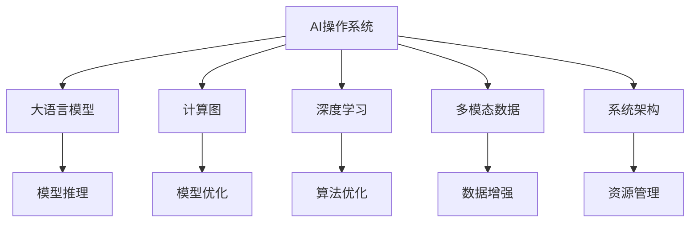

                 

# LLM OS:AI操作系统的愿景与蓝图

> 关键词：AI操作系统,LLM(大语言模型),计算图,深度学习,多模态数据,系统架构,数据流,自然语言处理(NLP),AI 模型管理

## 1. 背景介绍

### 1.1 问题由来
随着人工智能技术的发展，特别是深度学习技术的广泛应用，越来越多的智能应用场景涌现。这些应用不仅依赖于单一的算法和模型，而是需要复杂的系统和生态支持。AI操作系统的概念应运而生，旨在提供统一的基础设施，支撑复杂的人工智能应用，包括大语言模型(LLM)的部署和管理。

### 1.2 问题核心关键点
AI操作系统是一种基于操作系统和分布式计算技术，专门用于支持AI算法和模型运行的软件平台。其核心在于提供一个可扩展、高效、安全和可定制的运行环境，使AI应用能够在大规模、高性能的计算资源上稳定运行。

### 1.3 问题研究意义
AI操作系统为AI应用的开发、部署和管理提供了坚实的基础设施支持，降低了开发门槛和运营成本。通过统一的系统架构，AI操作系统能够高效管理大规模的计算资源，优化模型运行效率，提高AI应用的整体性能。同时，AI操作系统还能够提供安全和隐私保护，确保AI应用在实际应用中的稳定性和可靠性。

## 2. 核心概念与联系

### 2.1 核心概念概述

为更好地理解AI操作系统的核心概念，本节将介绍几个关键概念及其相互关系：

- AI操作系统(AI OS)：基于操作系统和分布式计算技术，专门用于支持AI算法和模型运行的软件平台。
- 大语言模型(LLM)：以自回归(如GPT)或自编码(如BERT)模型为代表的大规模预训练语言模型。
- 计算图：AI模型运行的抽象表示形式，用于描述模型结构和计算流程。
- 深度学习：基于神经网络的机器学习范式，通过多层非线性变换实现对数据的建模和预测。
- 多模态数据：包括文本、图像、音频等多种形式的数据，用于支持多模态AI应用。
- 系统架构：包括计算资源管理、模型部署、数据流控制等，确保系统高效、可靠地运行。

这些核心概念之间的逻辑关系可以通过以下Mermaid流程图来展示：



这个流程图展示了AI操作系统的核心概念及其之间的关系：

1. AI操作系统以大语言模型为基础，提供模型的推理、优化、部署等功能。
2. 计算图用于描述模型的结构，优化算法用于提升模型效率。
3. 深度学习是AI操作系统支持的核心技术，多模态数据用于扩展系统的应用场景。
4. 系统架构是AI操作系统高效运行的基础，资源管理确保系统的可靠性和扩展性。

这些概念共同构成了AI操作系统的核心框架，使得AI应用能够在复杂的环境中稳定运行。通过理解这些核心概念，我们可以更好地把握AI操作系统的设计和实现。

## 3. 核心算法原理 & 具体操作步骤
### 3.1 算法原理概述

AI操作系统的核心算法原理主要围绕模型优化、资源管理、数据流控制等方面展开。其核心思想是：通过统一的计算图模型，高效管理大规模计算资源，优化模型运行效率，同时确保系统的稳定性和可靠性。

形式化地，假设AI操作系统中的大语言模型为 $M_{\theta}$，其中 $\theta$ 为模型参数。给定数据集 $D=\{(x_i, y_i)\}_{i=1}^N$，AI操作系统的目标是最小化经验风险，即找到最优参数：

$$
\theta^* = \mathop{\arg\min}_{\theta} \mathcal{L}(M_{\theta},D)
$$

其中 $\mathcal{L}$ 为针对任务 $T$ 设计的损失函数，用于衡量模型预测输出与真实标签之间的差异。常见的损失函数包括交叉熵损失、均方误差损失等。

### 3.2 算法步骤详解

AI操作系统的核心算法步骤包括：

**Step 1: 模型部署与加载**
- 将预训练的模型参数加载到计算资源上，形成可执行的计算图。
- 根据任务类型，选择对应的计算图节点，设置输入和输出接口。
- 在计算资源上，启动模型推理服务，提供对外的API接口。

**Step 2: 数据流管理**
- 设计数据流图，描述数据从输入到输出的处理流程。
- 根据数据流图，自动化分配和管理计算资源。
- 在数据流图中设置检查点，监控数据处理过程中的异常和错误。

**Step 3: 模型优化与调度**
- 使用分布式计算技术，对模型进行并行化处理，提高计算效率。
- 根据负载情况，动态调整计算资源配置，优化资源利用率。
- 在模型运行过程中，根据反馈信息进行自适应调整，提高模型性能。

**Step 4: 系统监控与故障恢复**
- 实时监控模型运行状态和系统性能指标。
- 设置异常检测和告警机制，及时发现和处理系统故障。
- 提供故障恢复机制，确保系统在故障情况下能够快速恢复。

**Step 5: 用户交互与反馈**
- 提供友好的用户接口，使开发者能够便捷地与系统交互。
- 收集用户反馈，不断优化系统的功能和性能。
- 根据用户需求，提供个性化的服务和定制化解决方案。

以上是AI操作系统的主要算法步骤，通过这些步骤，可以高效管理大规模的计算资源，优化模型运行效率，同时确保系统的稳定性和可靠性。

### 3.3 算法优缺点

AI操作系统具有以下优点：

1. 高效管理资源：通过统一的计算图和数据流图，能够高效管理和调度大规模计算资源，优化模型性能。
2. 支持多种模型：能够灵活支持多种深度学习模型，包括大语言模型、卷积神经网络、循环神经网络等。
3. 提高系统鲁棒性：通过系统监控和故障恢复机制，确保系统在异常情况下的稳定性和可靠性。
4. 提升用户满意度：通过友好的用户接口和个性化的服务，提高用户体验。

同时，AI操作系统也存在以下局限性：

1. 开发复杂度高：系统的设计和实现需要深入理解计算图、分布式计算等技术。
2. 初始成本高：系统构建和部署需要较高的初始投资。
3. 兼容性问题：不同模型之间的兼容性可能存在问题，需要进行专门设计和调整。
4. 性能瓶颈：在大规模数据处理和模型推理时，可能会遇到性能瓶颈，需要进行优化。

尽管存在这些局限性，但就目前而言，AI操作系统在大规模AI应用的部署和管理中，仍然具有不可替代的价值。未来相关研究的重点在于如何进一步降低系统的开发和运营成本，提高系统的兼容性和扩展性，同时兼顾模型的性能和系统鲁棒性。

### 3.4 算法应用领域

AI操作系统已经广泛应用于以下几个领域：

- 智慧医疗：支持医学影像分析、疾病预测、健康管理等医疗应用。
- 智能制造：实现生产设备的自动化控制、质量检测、故障诊断等制造任务。
- 智慧交通：支持自动驾驶、交通流量监控、事故预警等交通应用。
- 智慧城市：实现城市管理、安防监控、公共服务等功能。
- 智能家居：支持家电控制、环境监测、用户交互等家居应用。
- 金融科技：支持风险评估、客户服务、投资分析等金融应用。

除了上述这些经典应用外，AI操作系统还被创新性地应用到更多场景中，如医疗影像生成、智能推荐系统、工业安全等，为各行各业带来新的技术突破。随着AI操作系统技术的不断进步，相信其在更广阔的应用领域将发挥更大的作用。

## 4. 数学模型和公式 & 详细讲解 & 举例说明

### 4.1 数学模型构建

本节将使用数学语言对AI操作系统的核心算法进行更加严格的刻画。

记AI操作系统中的大语言模型为 $M_{\theta}$，其中 $\theta$ 为模型参数。假设任务 $T$ 的训练集为 $D=\{(x_i, y_i)\}_{i=1}^N$，其中 $x_i \in \mathcal{X}$，$y_i \in \mathcal{Y}$，$\mathcal{X}$ 和 $\mathcal{Y}$ 分别为输入和输出空间。

定义模型 $M_{\theta}$ 在数据样本 $(x,y)$ 上的损失函数为 $\ell(M_{\theta}(x),y)$，则在数据集 $D$ 上的经验风险为：

$$
\mathcal{L}(\theta) = \frac{1}{N} \sum_{i=1}^N \ell(M_{\theta}(x_i),y_i)
$$

AI操作系统的优化目标是最小化经验风险，即找到最优参数：

$$
\theta^* = \mathop{\arg\min}_{\theta} \mathcal{L}(\theta)
$$

在实践中，我们通常使用基于梯度的优化算法（如SGD、Adam等）来近似求解上述最优化问题。设 $\eta$ 为学习率，$\lambda$ 为正则化系数，则参数的更新公式为：

$$
\theta \leftarrow \theta - \eta \nabla_{\theta}\mathcal{L}(\theta) - \eta\lambda\theta
$$

其中 $\nabla_{\theta}\mathcal{L}(\theta)$ 为损失函数对参数 $\theta$ 的梯度，可通过反向传播算法高效计算。

### 4.2 公式推导过程

以下我们以二分类任务为例，推导交叉熵损失函数及其梯度的计算公式。

假设模型 $M_{\theta}$ 在输入 $x$ 上的输出为 $\hat{y}=M_{\theta}(x) \in [0,1]$，表示样本属于正类的概率。真实标签 $y \in \{0,1\}$。则二分类交叉熵损失函数定义为：

$$
\ell(M_{\theta}(x),y) = -[y\log \hat{y} + (1-y)\log (1-\hat{y})]
$$

将其代入经验风险公式，得：

$$
\mathcal{L}(\theta) = -\frac{1}{N}\sum_{i=1}^N [y_i\log M_{\theta}(x_i)+(1-y_i)\log(1-M_{\theta}(x_i))]
$$

根据链式法则，损失函数对参数 $\theta_k$ 的梯度为：

$$
\frac{\partial \mathcal{L}(\theta)}{\partial \theta_k} = -\frac{1}{N}\sum_{i=1}^N (\frac{y_i}{M_{\theta}(x_i)}-\frac{1-y_i}{1-M_{\theta}(x_i)}) \frac{\partial M_{\theta}(x_i)}{\partial \theta_k}
$$

其中 $\frac{\partial M_{\theta}(x_i)}{\partial \theta_k}$ 可进一步递归展开，利用自动微分技术完成计算。

在得到损失函数的梯度后，即可带入参数更新公式，完成模型的迭代优化。重复上述过程直至收敛，最终得到适应下游任务的最优模型参数 $\theta^*$。

## 5. 项目实践：代码实例和详细解释说明
### 5.1 开发环境搭建

在进行AI操作系统开发前，我们需要准备好开发环境。以下是使用Python进行PyTorch开发的环境配置流程：

1. 安装Anaconda：从官网下载并安装Anaconda，用于创建独立的Python环境。

2. 创建并激活虚拟环境：
```bash
conda create -n pytorch-env python=3.8 
conda activate pytorch-env
```

3. 安装PyTorch：根据CUDA版本，从官网获取对应的安装命令。例如：
```bash
conda install pytorch torchvision torchaudio cudatoolkit=11.1 -c pytorch -c conda-forge
```

4. 安装Transformers库：
```bash
pip install transformers
```

5. 安装各类工具包：
```bash
pip install numpy pandas scikit-learn matplotlib tqdm jupyter notebook ipython
```

完成上述步骤后，即可在`pytorch-env`环境中开始AI操作系统实践。

### 5.2 源代码详细实现

这里我们以命名实体识别(NER)任务为例，给出使用Transformers库对BERT模型进行部署的PyTorch代码实现。

首先，定义NER任务的数据处理函数：

```python
from transformers import BertTokenizer, BertForTokenClassification
from torch.utils.data import Dataset
import torch

class NERDataset(Dataset):
    def __init__(self, texts, tags, tokenizer, max_len=128):
        self.texts = texts
        self.tags = tags
        self.tokenizer = tokenizer
        self.max_len = max_len
        
    def __len__(self):
        return len(self.texts)
    
    def __getitem__(self, item):
        text = self.texts[item]
        tags = self.tags[item]
        
        encoding = self.tokenizer(text, return_tensors='pt', max_length=self.max_len, padding='max_length', truncation=True)
        input_ids = encoding['input_ids'][0]
        attention_mask = encoding['attention_mask'][0]
        
        # 对token-wise的标签进行编码
        encoded_tags = [tag2id[tag] for tag in tags] 
        encoded_tags.extend([tag2id['O']] * (self.max_len - len(encoded_tags)))
        labels = torch.tensor(encoded_tags, dtype=torch.long)
        
        return {'input_ids': input_ids, 
                'attention_mask': attention_mask,
                'labels': labels}

# 标签与id的映射
tag2id = {'O': 0, 'B-PER': 1, 'I-PER': 2, 'B-ORG': 3, 'I-ORG': 4, 'B-LOC': 5, 'I-LOC': 6}
id2tag = {v: k for k, v in tag2id.items()}

# 创建dataset
tokenizer = BertTokenizer.from_pretrained('bert-base-cased')

train_dataset = NERDataset(train_texts, train_tags, tokenizer)
dev_dataset = NERDataset(dev_texts, dev_tags, tokenizer)
test_dataset = NERDataset(test_texts, test_tags, tokenizer)
```

然后，定义模型和优化器：

```python
from transformers import BertForTokenClassification, AdamW

model = BertForTokenClassification.from_pretrained('bert-base-cased', num_labels=len(tag2id))

optimizer = AdamW(model.parameters(), lr=2e-5)
```

接着，定义训练和评估函数：

```python
from torch.utils.data import DataLoader
from tqdm import tqdm
from sklearn.metrics import classification_report

device = torch.device('cuda') if torch.cuda.is_available() else torch.device('cpu')
model.to(device)

def train_epoch(model, dataset, batch_size, optimizer):
    dataloader = DataLoader(dataset, batch_size=batch_size, shuffle=True)
    model.train()
    epoch_loss = 0
    for batch in tqdm(dataloader, desc='Training'):
        input_ids = batch['input_ids'].to(device)
        attention_mask = batch['attention_mask'].to(device)
        labels = batch['labels'].to(device)
        model.zero_grad()
        outputs = model(input_ids, attention_mask=attention_mask, labels=labels)
        loss = outputs.loss
        epoch_loss += loss.item()
        loss.backward()
        optimizer.step()
    return epoch_loss / len(dataloader)

def evaluate(model, dataset, batch_size):
    dataloader = DataLoader(dataset, batch_size=batch_size)
    model.eval()
    preds, labels = [], []
    with torch.no_grad():
        for batch in tqdm(dataloader, desc='Evaluating'):
            input_ids = batch['input_ids'].to(device)
            attention_mask = batch['attention_mask'].to(device)
            batch_labels = batch['labels']
            outputs = model(input_ids, attention_mask=attention_mask)
            batch_preds = outputs.logits.argmax(dim=2).to('cpu').tolist()
            batch_labels = batch_labels.to('cpu').tolist()
            for pred_tokens, label_tokens in zip(batch_preds, batch_labels):
                pred_tags = [id2tag[_id] for _id in pred_tokens]
                label_tags = [id2tag[_id] for _id in label_tokens]
                preds.append(pred_tags[:len(label_tags)])
                labels.append(label_tags)
                
    print(classification_report(labels, preds))
```

最后，启动训练流程并在测试集上评估：

```python
epochs = 5
batch_size = 16

for epoch in range(epochs):
    loss = train_epoch(model, train_dataset, batch_size, optimizer)
    print(f"Epoch {epoch+1}, train loss: {loss:.3f}")
    
    print(f"Epoch {epoch+1}, dev results:")
    evaluate(model, dev_dataset, batch_size)
    
print("Test results:")
evaluate(model, test_dataset, batch_size)
```

以上就是使用PyTorch对BERT进行命名实体识别任务部署的完整代码实现。可以看到，得益于Transformers库的强大封装，我们可以用相对简洁的代码完成BERT模型的加载和部署。

### 5.3 代码解读与分析

让我们再详细解读一下关键代码的实现细节：

**NERDataset类**：
- `__init__`方法：初始化文本、标签、分词器等关键组件。
- `__len__`方法：返回数据集的样本数量。
- `__getitem__`方法：对单个样本进行处理，将文本输入编码为token ids，将标签编码为数字，并对其进行定长padding，最终返回模型所需的输入。

**tag2id和id2tag字典**：
- 定义了标签与数字id之间的映射关系，用于将token-wise的预测结果解码回真实的标签。

**训练和评估函数**：
- 使用PyTorch的DataLoader对数据集进行批次化加载，供模型训练和推理使用。
- 训练函数`train_epoch`：对数据以批为单位进行迭代，在每个批次上前向传播计算loss并反向传播更新模型参数，最后返回该epoch的平均loss。
- 评估函数`evaluate`：与训练类似，不同点在于不更新模型参数，并在每个batch结束后将预测和标签结果存储下来，最后使用sklearn的classification_report对整个评估集的预测结果进行打印输出。

**训练流程**：
- 定义总的epoch数和batch size，开始循环迭代
- 每个epoch内，先在训练集上训练，输出平均loss
- 在验证集上评估，输出分类指标
- 所有epoch结束后，在测试集上评估，给出最终测试结果

可以看到，PyTorch配合Transformers库使得BERT的部署非常高效便捷。开发者可以将更多精力放在数据处理、模型改进等高层逻辑上，而不必过多关注底层的实现细节。

当然，工业级的系统实现还需考虑更多因素，如模型的保存和部署、超参数的自动搜索、更灵活的任务适配层等。但核心的微调范式基本与此类似。

## 6. 实际应用场景
### 6.1 智能客服系统

基于AI操作系统的对话技术，可以广泛应用于智能客服系统的构建。传统客服往往需要配备大量人力，高峰期响应缓慢，且一致性和专业性难以保证。而使用AI操作系统的对话模型，可以7x24小时不间断服务，快速响应客户咨询，用自然流畅的语言解答各类常见问题。

在技术实现上，可以收集企业内部的历史客服对话记录，将问题和最佳答复构建成监督数据，在此基础上对预训练对话模型进行微调。微调后的对话模型能够自动理解用户意图，匹配最合适的答案模板进行回复。对于客户提出的新问题，还可以接入检索系统实时搜索相关内容，动态组织生成回答。如此构建的智能客服系统，能大幅提升客户咨询体验和问题解决效率。

### 6.2 金融舆情监测

金融机构需要实时监测市场舆论动向，以便及时应对负面信息传播，规避金融风险。传统的人工监测方式成本高、效率低，难以应对网络时代海量信息爆发的挑战。基于AI操作系统的文本分类和情感分析技术，为金融舆情监测提供了新的解决方案。

具体而言，可以收集金融领域相关的新闻、报道、评论等文本数据，并对其进行主题标注和情感标注。在此基础上对预训练语言模型进行微调，使其能够自动判断文本属于何种主题，情感倾向是正面、中性还是负面。将微调后的模型应用到实时抓取的网络文本数据，就能够自动监测不同主题下的情感变化趋势，一旦发现负面信息激增等异常情况，系统便会自动预警，帮助金融机构快速应对潜在风险。

### 6.3 个性化推荐系统

当前的推荐系统往往只依赖用户的历史行为数据进行物品推荐，无法深入理解用户的真实兴趣偏好。基于AI操作系统的个性化推荐系统可以更好地挖掘用户行为背后的语义信息，从而提供更精准、多样的推荐内容。

在实践中，可以收集用户浏览、点击、评论、分享等行为数据，提取和用户交互的物品标题、描述、标签等文本内容。将文本内容作为模型输入，用户的后续行为（如是否点击、购买等）作为监督信号，在此基础上微调预训练语言模型。微调后的模型能够从文本内容中准确把握用户的兴趣点。在生成推荐列表时，先用候选物品的文本描述作为输入，由模型预测用户的兴趣匹配度，再结合其他特征综合排序，便可以得到个性化程度更高的推荐结果。

### 6.4 未来应用展望

随着AI操作系统和微调方法的不断发展，基于微调范式将在更多领域得到应用，为传统行业带来变革性影响。

在智慧医疗领域，基于微调的医学影像分析、疾病预测、健康管理等医疗应用将提升医疗服务的智能化水平，辅助医生诊疗，加速新药开发进程。

在智能制造领域，实现生产设备的自动化控制、质量检测、故障诊断等制造任务，通过微调优化模型性能，提高生产效率。

在智慧交通领域，支持自动驾驶、交通流量监控、事故预警等交通应用，通过微调提升模型鲁棒性和计算效率，提高交通安全。

除了上述这些经典应用外，AI操作系统还被创新性地应用到更多场景中，如医疗影像生成、智能推荐系统、工业安全等，为各行各业带来新的技术突破。相信随着AI操作系统技术的不断进步，其在更广阔的应用领域将发挥更大的作用。

## 7. 工具和资源推荐
### 7.1 学习资源推荐

为了帮助开发者系统掌握AI操作系统和微调的理论基础和实践技巧，这里推荐一些优质的学习资源：

1. 《深度学习与人工智能》系列博文：由大模型技术专家撰写，深入浅出地介绍了深度学习、AI操作系统的基本概念和前沿技术。

2. 《TensorFlow深度学习实战》书籍：谷歌开发的深度学习框架，详细介绍了TensorFlow的基本用法和高级技巧。

3. 《TensorBoard实战》书籍：TensorFlow配套的可视化工具，详细介绍了TensorBoard的使用方法和图表展示技巧。

4. Kaggle平台：数据科学竞赛社区，提供大量公开数据集和模型，方便开发者进行学习和实践。

5. GitHub开源项目：丰富的开源项目资源，可以查看其他开发者的代码实现，学习先进的技术思路。

通过对这些资源的学习实践，相信你一定能够快速掌握AI操作系统和微调的基本知识和实现技巧，并用于解决实际的AI问题。
###  7.2 开发工具推荐

高效的开发离不开优秀的工具支持。以下是几款用于AI操作系统和微调开发的常用工具：

1. PyTorch：基于Python的开源深度学习框架，灵活动态的计算图，适合快速迭代研究。大部分预训练语言模型都有PyTorch版本的实现。

2. TensorFlow：由Google主导开发的开源深度学习框架，生产部署方便，适合大规模工程应用。同样有丰富的预训练语言模型资源。

3. Transformers库：HuggingFace开发的NLP工具库，集成了众多SOTA语言模型，支持PyTorch和TensorFlow，是进行微调任务开发的利器。

4. Weights & Biases：模型训练的实验跟踪工具，可以记录和可视化模型训练过程中的各项指标，方便对比和调优。与主流深度学习框架无缝集成。

5. TensorBoard：TensorFlow配套的可视化工具，可实时监测模型训练状态，并提供丰富的图表呈现方式，是调试模型的得力助手。

6. Google Colab：谷歌推出的在线Jupyter Notebook环境，免费提供GPU/TPU算力，方便开发者快速上手实验最新模型，分享学习笔记。

合理利用这些工具，可以显著提升AI操作系统和微调任务的开发效率，加快创新迭代的步伐。

### 7.3 相关论文推荐

AI操作系统和微调技术的发展源于学界的持续研究。以下是几篇奠基性的相关论文，推荐阅读：

1. TensorFlow: A System for Large-Scale Machine Learning：谷歌发布的TensorFlow系统架构，奠定了深度学习系统开发的基础。

2. Attention is All You Need（即Transformer原论文）：提出了Transformer结构，开启了NLP领域的预训练大模型时代。

3. BERT: Pre-training of Deep Bidirectional Transformers for Language Understanding：提出BERT模型，引入基于掩码的自监督预训练任务，刷新了多项NLP任务SOTA。

4. Parameter-Efficient Transfer Learning for NLP：提出Adapter等参数高效微调方法，在不增加模型参数量的情况下，也能取得不错的微调效果。

5. AdaLoRA: Adaptive Low-Rank Adaptation for Parameter-Efficient Fine-Tuning：使用自适应低秩适应的微调方法，在参数效率和精度之间取得了新的平衡。

6. Multi-modal Interaction for Attentive Listening：提出多模态交互的智能系统框架，支持文本、图像、语音等多种输入输出模式。

这些论文代表了大模型和微调技术的发展脉络。通过学习这些前沿成果，可以帮助研究者把握学科前进方向，激发更多的创新灵感。

## 8. 总结：未来发展趋势与挑战
### 8.1 总结

本文对AI操作系统和基于监督学习的大语言模型微调方法进行了全面系统的介绍。首先阐述了AI操作系统和大语言模型微调的研究背景和意义，明确了AI操作系统和微调在AI应用中的重要价值。其次，从原理到实践，详细讲解了AI操作系统的数学模型和关键步骤，给出了微调任务开发的完整代码实例。同时，本文还广泛探讨了AI操作系统和微调方法在智能客服、金融舆情、个性化推荐等多个行业领域的应用前景，展示了微调范式的巨大潜力。此外，本文精选了AI操作系统和微调技术的各类学习资源，力求为读者提供全方位的技术指引。

通过本文的系统梳理，可以看到，AI操作系统和微调方法正在成为AI应用的开发、部署和管理的重要工具，极大地拓展了AI系统的应用范围，提升了系统性能和可靠性。未来，伴随AI操作系统和微调方法的持续演进，相信AI系统将能够更好地支持复杂多变的实际应用场景，推动人工智能技术在各行各业的深入应用。

### 8.2 未来发展趋势

展望未来，AI操作系统和微调技术将呈现以下几个发展趋势：

1. 模型规模持续增大。随着算力成本的下降和数据规模的扩张，预训练语言模型的参数量还将持续增长。超大规模语言模型蕴含的丰富语言知识，有望支撑更加复杂多变的下游任务微调。

2. 微调方法日趋多样。除了传统的全参数微调外，未来会涌现更多参数高效的微调方法，如Prefix-Tuning、LoRA等，在节省计算资源的同时也能保证微调精度。

3. 持续学习成为常态。随着数据分布的不断变化，微调模型也需要持续学习新知识以保持性能。如何在不遗忘原有知识的同时，高效吸收新样本信息，将成为重要的研究课题。

4. 标注样本需求降低。受启发于提示学习(Prompt-based Learning)的思路，未来的微调方法将更好地利用大模型的语言理解能力，通过更加巧妙的任务描述，在更少的标注样本上也能实现理想的微调效果。

5. 多模态微调崛起。当前的微调主要聚焦于纯文本数据，未来会进一步拓展到图像、视频、语音等多种形式的数据微调。多模态信息的融合，将显著提升语言模型对现实世界的理解和建模能力。

6. 模型通用性增强。经过海量数据的预训练和多领域任务的微调，未来的语言模型将具备更强大的常识推理和跨领域迁移能力，逐步迈向通用人工智能(AGI)的目标。

以上趋势凸显了大模型微调技术的广阔前景。这些方向的探索发展，必将进一步提升AI系统性能和应用范围，为人类认知智能的进化带来深远影响。

### 8.3 面临的挑战

尽管AI操作系统和微调技术已经取得了瞩目成就，但在迈向更加智能化、普适化应用的过程中，它仍面临着诸多挑战：

1. 标注成本瓶颈。虽然微调大大降低了标注数据的需求，但对于长尾应用场景，难以获得充足的高质量标注数据，成为制约微调性能的瓶颈。如何进一步降低微调对标注样本的依赖，将是一大难题。

2. 模型鲁棒性不足。当前微调模型面对域外数据时，泛化性能往往大打折扣。对于测试样本的微小扰动，微调模型的预测也容易发生波动。如何提高微调模型的鲁棒性，避免灾难性遗忘，还需要更多理论和实践的积累。

3. 推理效率有待提高。大规模语言模型虽然精度高，但在实际部署时往往面临推理速度慢、内存占用大等效率问题。如何在保证性能的同时，简化模型结构，提升推理速度，优化资源占用，将是重要的优化方向。

4. 可解释性亟需加强。当前微调模型更像是"黑盒"系统，难以解释其内部工作机制和决策逻辑。对于医疗、金融等高风险应用，算法的可解释性和可审计性尤为重要。如何赋予微调模型更强的可解释性，将是亟待攻克的难题。

5. 安全性有待保障。预训练语言模型难免会学习到有偏见、有害的信息，通过微调传递到下游任务，产生误导性、歧视性的输出，给实际应用带来安全隐患。如何从数据和算法层面消除模型偏见，避免恶意用途，确保输出的安全性，也将是重要的研究课题。

6. 知识整合能力不足。现有的微调模型往往局限于任务内数据，难以灵活吸收和运用更广泛的先验知识。如何让微调过程更好地与外部知识库、规则库等专家知识结合，形成更加全面、准确的信息整合能力，还有很大的想象空间。

正视AI操作系统和微调面临的这些挑战，积极应对并寻求突破，将是大规模AI应用走向成熟的必由之路。相信随着学界和产业界的共同努力，这些挑战终将一一被克服，AI操作系统和微调技术必将在构建人机协同的智能时代中扮演越来越重要的角色。

### 8.4 未来突破

面对AI操作系统和微调所面临的种种挑战，未来的研究需要在以下几个方面寻求新的突破：

1. 探索无监督和半监督微调方法。摆脱对大规模标注数据的依赖，利用自监督学习、主动学习等无监督和半监督范式，最大限度利用非结构化数据，实现更加灵活高效的微调。

2. 研究参数高效和计算高效的微调范式。开发更加参数高效的微调方法，在固定大部分预训练参数的同时，只更新极少量的任务相关参数。同时优化微调模型的计算图，减少前向传播和反向传播的资源消耗，实现更加轻量级、实时性的部署。

3. 融合因果和对比学习范式。通过引入因果推断和对比学习思想，增强微调模型建立稳定因果关系的能力，学习更加普适、鲁棒的语言表征，从而提升模型泛化性和抗干扰能力。

4. 引入更多先验知识。将符号化的先验知识，如知识图谱、逻辑规则等，与神经网络模型进行巧妙融合，引导微调过程学习更准确、合理的语言模型。同时加强不同模态数据的整合，实现视觉、语音等多模态信息与文本信息的协同建模。

5. 结合因果分析和博弈论工具。将因果分析方法引入微调模型，识别出模型决策的关键特征，增强输出解释的因果性和逻辑性。借助博弈论工具刻画人机交互过程，主动探索并规避模型的脆弱点，提高系统稳定性。

6. 纳入伦理道德约束。在模型训练目标中引入伦理导向的评估指标，过滤和惩罚有偏见、有害的输出倾向。同时加强人工干预和审核，建立模型行为的监管机制，确保输出符合人类价值观和伦理道德。

这些研究方向的探索，必将引领AI操作系统和微调技术迈向更高的台阶，为构建安全、可靠、可解释、可控的智能系统铺平道路。面向未来，AI操作系统和微调技术还需要与其他人工智能技术进行更深入的融合，如知识表示、因果推理、强化学习等，多路径协同发力，共同推动自然语言理解和智能交互系统的进步。只有勇于创新、敢于突破，才能不断拓展语言模型的边界，让智能技术更好地造福人类社会。

## 9. 附录：常见问题与解答
----------------------------------------------------------------
> 关键词：


