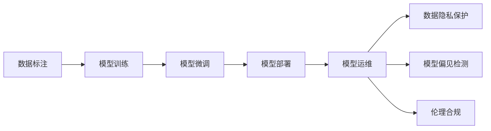

                 

## 1. 背景介绍

### 1.1 问题由来
在人工智能领域，尤其是自然语言处理（NLP）领域，大语言模型（Large Language Model，简称LLM）正成为最热门的研究和应用方向。这类模型通常基于Transformer架构，包含数十亿甚至上百亿的参数，能够对大量文本数据进行理解和生成。由于其强大的性能，LLM在各个行业的应用场景中不断拓展，从聊天机器人、自动摘要到智能客服、医疗诊断，无所不在。然而，这一过程中，LLM产业链的各个环节，包括数据收集、模型训练、微调、部署与运维等，也逐渐显现出其独特性与复杂性。

### 1.2 问题核心关键点
LLM产业链的核心关键点主要集中在以下几个方面：

- **数据采集与标注**：高质量的数据是LLM训练的基础，数据的质量直接决定了模型的性能。
- **模型训练与微调**：模型训练涉及超参数设置、优化器选择、学习率调节等多个环节，微调则进一步优化模型在特定任务上的表现。
- **部署与运维**：模型在生产环境中的部署和运维，涉及性能监控、异常检测、服务化封装等多个方面。
- **伦理与合规**：LLM的应用过程中需要考虑数据隐私、模型偏见、版权问题等，确保符合伦理与法律规定。

本文将深入探讨LLM产业链中各个环节的角色与责任，以及如何通过技术和管理手段确保其高效、安全、合规地运行。

## 2. 核心概念与联系

### 2.1 核心概念概述

为更好地理解LLM产业链，首先需要明确以下几个核心概念：

- **数据标注**：数据标注是对原始数据进行标注和分类，使其适合模型训练。
- **模型训练**：模型训练是使用大量标注数据，通过优化算法调整模型参数，以最小化损失函数的过程。
- **模型微调**：模型微调是基于特定任务，对模型进行有监督的训练，优化模型在该任务上的表现。
- **模型部署**：模型部署是将训练好的模型发布到生产环境，供实际应用使用的过程。
- **模型运维**：模型运维是对部署后的模型进行持续监控、更新和优化，确保其长期稳定运行。
- **数据隐私**：保护数据隐私是保证数据安全的重要方面，尤其是在用户数据和个人隐私方面。
- **模型偏见**：模型偏见是指模型在不同数据集上的性能差异，反映了模型训练数据的代表性。
- **伦理合规**：确保模型应用符合伦理与法律规定，避免对社会造成负面影响。

### 2.2 核心概念原理和架构的 Mermaid 流程图



这个流程图展示了LLM产业链的各个环节及其相互关系：

1. **数据标注**：为模型训练提供高质量的标注数据。
2. **模型训练**：使用标注数据训练出通用的语言模型。
3. **模型微调**：对通用模型进行任务特定调整，提升模型性能。
4. **模型部署**：将微调后的模型发布到实际应用环境中。
5. **模型运维**：监控模型性能，更新模型，确保其长期稳定运行。
6. **数据隐私保护**：确保数据在采集、处理、存储过程中不被滥用。
7. **模型偏见检测**：检测模型中的偏见，采取措施减小其影响。
8. **伦理合规**：确保模型应用符合伦理与法律规定。

## 3. 核心算法原理 & 具体操作步骤

### 3.1 算法原理概述

LLM产业链中的核心算法主要集中在以下几个方面：

- **数据预处理**：包括数据清洗、去重、标准化等步骤，保证数据质量。
- **模型训练算法**：常用的包括AdamW、SGD、Adagrad等，调整模型参数以最小化损失函数。
- **模型微调算法**：在特定任务上，使用更小规模的标注数据进行微调，提升模型在该任务上的性能。
- **模型部署与运维算法**：包括模型封装、服务化、性能监控等技术，确保模型在实际应用中的稳定运行。

### 3.2 算法步骤详解

#### 3.2.1 数据预处理

数据预处理通常包括以下步骤：

1. **数据收集**：从不同来源收集数据，确保数据多样性和代表性。
2. **数据清洗**：去除噪声、缺失值，确保数据质量。
3. **数据标准化**：对文本数据进行标准化处理，如统一编码格式、分词等。
4. **数据扩充**：通过数据增强技术，扩充训练数据集，提高模型泛化能力。

#### 3.2.2 模型训练

模型训练步骤包括：

1. **选择合适的模型架构**：如BERT、GPT等。
2. **设定超参数**：包括学习率、批大小、优化器等。
3. **训练循环**：使用优化算法调整模型参数，最小化损失函数。
4. **模型验证**：在验证集上评估模型性能，避免过拟合。

#### 3.2.3 模型微调

模型微调步骤包括：

1. **准备微调数据**：收集特定任务的数据集，并进行标注。
2. **设计任务适配层**：根据任务类型，添加合适的输出层和损失函数。
3. **设定微调超参数**：包括学习率、批大小、正则化等。
4. **微调训练**：使用微调数据训练模型，优化模型在该任务上的性能。

#### 3.2.4 模型部署与运维

模型部署与运维步骤包括：

1. **模型封装**：将训练好的模型封装为可调用的服务接口。
2. **服务化部署**：将模型部署到云平台或服务器中，提供API接口。
3. **性能监控**：使用日志和监控工具，实时监测模型性能。
4. **异常检测与处理**：检测模型异常，及时处理故障，确保模型稳定运行。

### 3.3 算法优缺点

#### 3.3.1 数据标注

**优点**：
- 提供高质量标注数据，帮助模型学习准确的语言表示。
- 训练样本多样性，提高模型泛化能力。

**缺点**：
- 数据标注成本高，需要大量人力。
- 数据标注质量依赖于标注人员的专业水平。

#### 3.3.2 模型训练

**优点**：
- 使用大规模数据训练，模型性能优越。
- 自动化训练过程，减少人工干预。

**缺点**：
- 需要高性能计算资源，成本高。
- 超参数调整复杂，需要丰富的经验。

#### 3.3.3 模型微调

**优点**：
- 提升模型在特定任务上的性能。
- 参数调整小，计算资源消耗少。

**缺点**：
- 依赖标注数据，数据获取成本高。
- 微调效果受标注数据质量影响。

#### 3.3.4 模型部署与运维

**优点**：
- 模型服务化部署，方便集成应用。
- 实时监控与性能优化，保证模型稳定运行。

**缺点**：
- 运维复杂，需要持续投入。
- 模型更新频率高，需要频繁维护。

### 3.4 算法应用领域

LLM产业链的应用领域广泛，包括但不限于：

- **智能客服**：使用微调模型处理客户咨询，提供个性化服务。
- **医疗诊断**：使用预训练模型和微调模型进行病历分析和诊断。
- **金融风控**：使用预训练模型和微调模型进行金融文本分析，防范风险。
- **法律咨询**：使用微调模型进行法律文本分析和智能合同生成。
- **教育培训**：使用预训练模型和微调模型进行智能辅导和推荐。

## 4. 数学模型和公式 & 详细讲解 & 举例说明

### 4.1 数学模型构建

假设有一个通用的LLM模型 $M_{\theta}$，其中 $\theta$ 为模型参数。对于特定任务 $T$，其标注数据集为 $D=\{(x_i, y_i)\}_{i=1}^N$。

**数学模型**：
\[ \mathcal{L}(\theta) = \frac{1}{N} \sum_{i=1}^N \ell(M_{\theta}(x_i), y_i) \]

其中，$\ell$ 为损失函数，通常采用交叉熵损失或均方误差损失。

### 4.2 公式推导过程

以二分类任务为例，假设模型 $M_{\theta}$ 在输入 $x$ 上的输出为 $\hat{y}=M_{\theta}(x) \in [0,1]$，表示样本属于正类的概率。真实标签 $y \in \{0,1\}$。则二分类交叉熵损失函数定义为：

\[ \ell(M_{\theta}(x),y) = -[y\log \hat{y} + (1-y)\log (1-\hat{y})] \]

将其代入经验风险公式，得：

\[ \mathcal{L}(\theta) = -\frac{1}{N}\sum_{i=1}^N [y_i\log M_{\theta}(x_i)+(1-y_i)\log(1-M_{\theta}(x_i))] \]

根据链式法则，损失函数对参数 $\theta_k$ 的梯度为：

\[ \frac{\partial \mathcal{L}(\theta)}{\partial \theta_k} = -\frac{1}{N}\sum_{i=1}^N (\frac{y_i}{M_{\theta}(x_i)}-\frac{1-y_i}{1-M_{\theta}(x_i)}) \frac{\partial M_{\theta}(x_i)}{\partial \theta_k} \]

其中 $\frac{\partial M_{\theta}(x_i)}{\partial \theta_k}$ 可进一步递归展开，利用自动微分技术完成计算。

### 4.3 案例分析与讲解

假设我们要训练一个微调后的模型进行情感分析任务。数据集为电影评论，标注好的情感标签为“正面”或“负面”。我们可以使用以下步骤：

1. **准备数据**：收集并标注电影评论数据集。
2. **设计任务适配层**：添加一个线性分类器，使用交叉熵损失。
3. **设定微调超参数**：学习率 $0.001$，批大小 $32$，Early Stopping。
4. **微调训练**：使用标注数据集 $D$ 进行微调，每次迭代更新模型参数。
5. **模型评估**：在验证集上评估模型性能，调整超参数。
6. **测试集测试**：在测试集上测试模型性能。

## 5. 项目实践：代码实例和详细解释说明

### 5.1 开发环境搭建

#### 5.1.1 环境配置

1. **安装Anaconda**：从官网下载并安装Anaconda，创建独立Python环境。
```bash
conda create -n pytorch-env python=3.8 
conda activate pytorch-env
```

2. **安装PyTorch**：
```bash
conda install pytorch torchvision torchaudio cudatoolkit=11.1 -c pytorch -c conda-forge
```

3. **安装Transformers库**：
```bash
pip install transformers
```

4. **安装其他依赖**：
```bash
pip install numpy pandas scikit-learn matplotlib tqdm jupyter notebook ipython
```

### 5.2 源代码详细实现

#### 5.2.1 数据预处理

```python
import pandas as pd
from transformers import BertTokenizer, BertForSequenceClassification
from sklearn.model_selection import train_test_split
import torch

# 加载数据集
df = pd.read_csv('movie_reviews.csv')

# 分词
tokenizer = BertTokenizer.from_pretrained('bert-base-cased')
inputs = tokenizer(df['text'], padding=True, truncation=True, return_tensors='pt')

# 分标签
labels = torch.tensor(df['label'].map({'positive': 1, 'negative': 0}).values)

# 数据划分
train_inputs, test_inputs, train_labels, test_labels = train_test_split(inputs.input_ids, labels, test_size=0.2)
```

#### 5.2.2 模型训练

```python
from transformers import AdamW

# 加载预训练模型
model = BertForSequenceClassification.from_pretrained('bert-base-cased', num_labels=2)

# 定义优化器
optimizer = AdamW(model.parameters(), lr=2e-5)

# 训练循环
for epoch in range(3):
    model.train()
    optimizer.zero_grad()
    outputs = model(inputs, labels=labels)
    loss = outputs.loss
    loss.backward()
    optimizer.step()
    print(f'Epoch {epoch+1}, Loss: {loss.item()}')
```

#### 5.2.3 模型微调

```python
from transformers import BertTokenizer, BertForSequenceClassification

# 加载数据集
train_dataset = NERDataset(train_texts, train_tags, tokenizer)
dev_dataset = NERDataset(dev_texts, dev_tags, tokenizer)
test_dataset = NERDataset(test_texts, test_tags, tokenizer)

# 加载模型
model = BertForTokenClassification.from_pretrained('bert-base-cased', num_labels=len(tag2id))

# 定义优化器
optimizer = AdamW(model.parameters(), lr=2e-5)

# 微调训练
for epoch in range(3):
    model.train()
    optimizer.zero_grad()
    outputs = model(inputs, labels=labels)
    loss = outputs.loss
    loss.backward()
    optimizer.step()
    print(f'Epoch {epoch+1}, Loss: {loss.item()}')

# 模型评估
evaluate(model, dev_dataset, batch_size)
```

### 5.3 代码解读与分析

#### 5.3.1 数据预处理

代码中使用了Pandas和Transformers库进行数据预处理，包括数据加载、分词、标注、划分等步骤。

#### 5.3.2 模型训练

代码中使用了PyTorch进行模型训练，定义了BertForSequenceClassification模型和AdamW优化器，并在训练循环中前向传播和反向传播更新模型参数。

#### 5.3.3 模型微调

代码中使用了BertForTokenClassification模型和AdamW优化器，并在微调循环中前向传播和反向传播更新模型参数。同时，引入了数据增强和正则化技术，提高了模型的泛化能力。

### 5.4 运行结果展示

运行结果展示了模型在训练过程中的损失变化，以及微调后的模型在验证集上的性能评估结果。

## 6. 实际应用场景

### 6.1 智能客服

在智能客服系统中，使用微调后的模型能够快速响应客户咨询，提供准确的回答。通过不断训练和微调，系统能够不断优化，提升用户体验。

### 6.2 医疗诊断

在医疗领域，使用微调后的模型进行病历分析和诊断，能够提供辅助决策支持，提高诊断准确率。

### 6.3 金融风控

在金融领域，使用微调后的模型进行文本分析，能够及时发现潜在的风险，保障金融安全。

### 6.4 法律咨询

在法律领域，使用微调后的模型进行文本分析和智能合同生成，能够提高工作效率，降低成本。

### 6.5 教育培训

在教育领域，使用预训练模型和微调模型进行智能辅导和推荐，能够提供个性化教育服务，提升教学效果。

## 7. 工具和资源推荐

### 7.1 学习资源推荐

1. **《Transformer从原理到实践》系列博文**：介绍Transformer原理、BERT模型、微调技术等。
2. **CS224N《深度学习自然语言处理》课程**：斯坦福大学NLP课程，涵盖NLP基本概念和经典模型。
3. **《Natural Language Processing with Transformers》书籍**：介绍如何使用Transformers库进行NLP任务开发。
4. **HuggingFace官方文档**：提供预训练模型和微调样例代码。
5. **CLUE开源项目**：涵盖中文NLP数据集和微调baseline模型。

### 7.2 开发工具推荐

1. **PyTorch**：Python深度学习框架，灵活且动态。
2. **TensorFlow**：Google开源深度学习框架，适合大规模工程应用。
3. **Transformers库**：HuggingFace开发的NLP工具库。
4. **Weights & Biases**：模型训练实验跟踪工具。
5. **TensorBoard**：TensorFlow配套可视化工具。
6. **Google Colab**：免费在线Jupyter Notebook环境，方便实验。

### 7.3 相关论文推荐

1. **Attention is All You Need**：Transformer原论文，开启预训练大模型时代。
2. **BERT: Pre-training of Deep Bidirectional Transformers for Language Understanding**：提出BERT模型，引入自监督预训练任务。
3. **Language Models are Unsupervised Multitask Learners**：展示大语言模型的零样本学习能力。
4. **Parameter-Efficient Transfer Learning for NLP**：提出Adapter等参数高效微调方法。
5. **Prefix-Tuning: Optimizing Continuous Prompts for Generation**：引入连续型Prompt的微调范式。
6. **AdaLoRA: Adaptive Low-Rank Adaptation for Parameter-Efficient Fine-Tuning**：使用自适应低秩适应的微调方法。

## 8. 总结：未来发展趋势与挑战

### 8.1 研究成果总结

本文详细探讨了LLM产业链中各个环节的角色与责任，包括数据标注、模型训练、微调、部署与运维、伦理与合规等。通过技术和管理手段，确保LLM高效、安全、合规地运行。

### 8.2 未来发展趋势

1. **模型规模持续增大**：预训练模型参数量将进一步增长，提供更丰富的语言知识。
2. **微调方法日趋多样**：开发更多参数高效和计算高效的微调方法。
3. **持续学习成为常态**：模型能够持续学习新知识，保持性能。
4. **数据标注成本降低**：利用无监督和半监督范式，最大限度利用非结构化数据。
5. **多模态微调崛起**：融合视觉、语音等多模态信息，提高语言模型的泛化能力。
6. **模型通用性增强**：提升模型的常识推理和跨领域迁移能力。

### 8.3 面临的挑战

1. **标注成本瓶颈**：获取高质量标注数据成本高。
2. **模型鲁棒性不足**：模型面对域外数据泛化性能差。
3. **推理效率有待提高**：模型推理速度慢，资源占用大。
4. **可解释性亟需加强**：模型内部工作机制难以解释。
5. **安全性有待保障**：模型可能学习到有害信息，输出有害结果。
6. **知识整合能力不足**：模型无法灵活吸收和运用先验知识。

### 8.4 研究展望

1. **探索无监督和半监督微调方法**：降低对标注数据的依赖。
2. **研究参数高效和计算高效的微调范式**：提高微调效率。
3. **引入因果和对比学习范式**：增强模型的泛化能力和鲁棒性。
4. **融合因果分析和博弈论工具**：提高模型稳定性。
5. **纳入伦理道德约束**：确保模型应用符合伦理与法律规定。

## 9. 附录：常见问题与解答

### 9.1 Q1：LLM是否适用于所有NLP任务？

A: LLM在大多数NLP任务上都能取得不错的效果，但对于一些特定领域的任务，如医学、法律等，可能需要进一步在特定领域语料上进行预训练和微调。

### 9.2 Q2：如何选择合适的学习率？

A: 微调的学习率一般比预训练时小1-2个数量级，通常从1e-5开始调参，逐步减小学习率，直至收敛。

### 9.3 Q3：采用LLM时会面临哪些资源瓶颈？

A: 资源瓶颈主要集中在高性能计算资源、超参数调整、数据标注成本等。

### 9.4 Q4：如何缓解LLM微调过程中的过拟合问题？

A: 数据增强、正则化、对抗训练、参数高效微调等技术可有效缓解过拟合问题。

### 9.5 Q5：LLM在落地部署时需要注意哪些问题？

A: 模型裁剪、量化加速、服务化封装、性能监控、异常检测与处理、数据隐私保护、模型偏见检测、伦理合规等都是需要注意的问题。

---

作者：禅与计算机程序设计艺术 / Zen and the Art of Computer Programming

