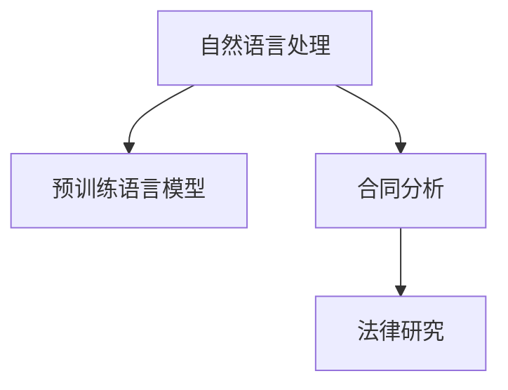
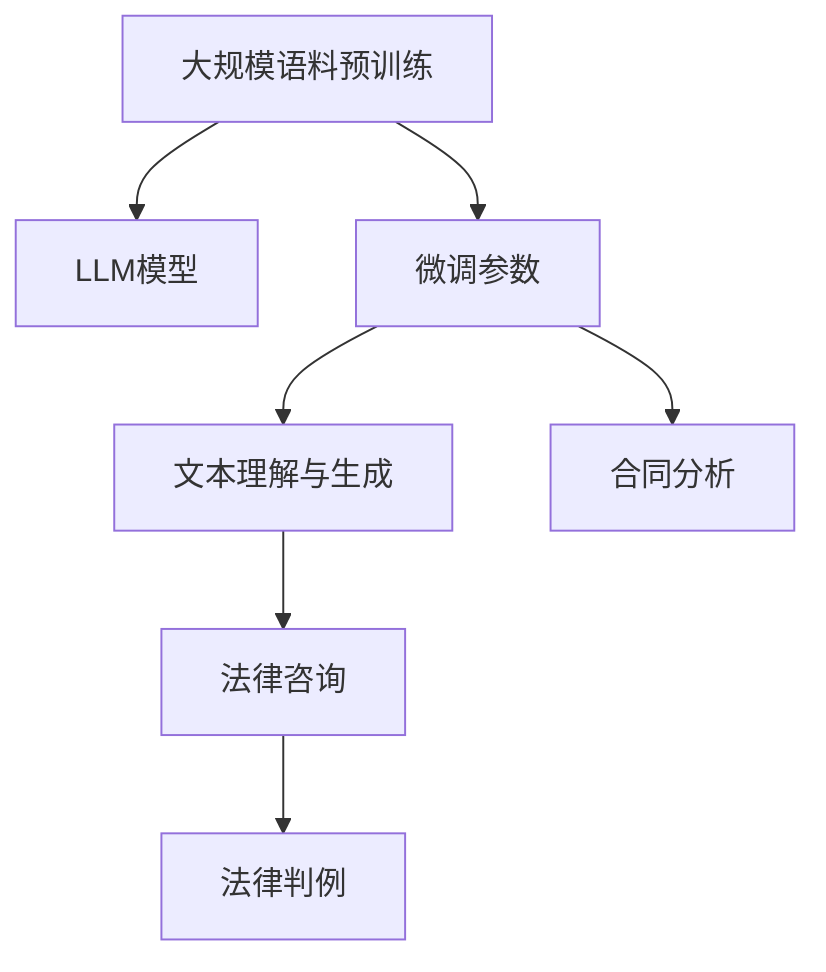

                 

# LLM 在法律行业中的应用：合同分析和法律研究

> 关键词：自然语言处理,法律分析,合同管理,法律研究,人工智能

## 1. 背景介绍

法律行业一直面临着文档处理量大、文本信息复杂、法律文书格式规范严格等挑战。传统法律行业主要依赖人工进行文书审核、法律咨询、合同分析等任务，工作量大、效率低、准确性难以保障。近年来，随着人工智能技术的发展，尤其是自然语言处理(NLP)领域的突破，预训练语言模型(LLM)逐渐被应用于法律领域，提升了法律行业的工作效率和准确性。

本文聚焦于LLM在法律领域的应用，特别是在合同分析和法律研究两个关键场景中的实践。通过介绍LLM的核心概念、算法原理及应用流程，希望能为法律行业提供新的思路和方法，加速法律技术的发展和应用。

## 2. 核心概念与联系

### 2.1 核心概念概述

为更好地理解LLM在法律行业中的应用，本节将介绍几个密切相关的核心概念：

- 自然语言处理（Natural Language Processing, NLP）：涉及计算机对人类语言的理解、分析与生成。是使计算机能够“读懂”和“理解”人类语言的技术。
- 预训练语言模型（Pre-trained Language Model, LLM）：指通过大规模无监督学习获得的语言模型，如GPT、BERT等。这些模型在大量文本数据上进行预训练，学习到通用语言知识，具备很强的语言理解和生成能力。
- 合同分析（Contract Analysis）：通过分析合同文本，了解合同条款内容、权利义务、风险点等关键信息，帮助企业快速识别合同风险和合规问题。
- 法律研究（Legal Research）：利用法律知识库、案例库、法规数据库等，结合自然语言处理技术，进行法律问题的求解和知识发现，提升法律工作的效率和质量。

这些核心概念之间存在紧密的联系，主要体现在：

- 自然语言处理技术是大规模语言模型预训练的基础，也是LLM应用到法律领域的重要手段。
- 预训练语言模型在NLP任务中取得了显著的性能，应用于法律领域时同样展现出强大的潜力。
- 合同分析和法律研究都是基于NLP技术的应用场景，需要利用LLM进行文本处理、理解与推理。

以下Mermaid流程图展示了这些概念之间的联系：



### 2.2 核心概念原理和架构的 Mermaid 流程图



## 3. 核心算法原理 & 具体操作步骤

### 3.1 算法原理概述

基于预训练语言模型的合同分析和法律研究方法，主要分为以下几个步骤：

1. 预训练语言模型在大规模语料上进行无监督学习，学习通用语言知识。
2. 在合同分析任务中，通过有监督学习微调LLM，使其理解合同文本中的关键要素和条款。
3. 在法律研究任务中，利用微调的LLM进行法律问题的求解和知识发现。

### 3.2 算法步骤详解

#### 预训练步骤

预训练步骤主要包括以下几个关键点：

1. 收集大规模语料：法律领域的预训练语料一般包括法律法规、司法判决、法律文档等。
2. 设计预训练任务：常用的预训练任务有掩码语言模型、下一句预测、文本相似度等。
3. 训练预训练模型：使用Transformer等架构，在大规模语料上进行预训练，学习通用语言知识。

#### 微调步骤

微调步骤主要分为数据准备、模型选择和参数调整等几个阶段：

1. 数据准备：收集合同文本和对应的法律问题作为训练数据，并将其划分为训练集、验证集和测试集。
2. 模型选择：选择合适的预训练语言模型作为初始化参数。
3. 参数调整：选择合适的优化器、学习率、批大小等，通过有监督学习微调模型，使其适应特定任务。

#### 合同分析

合同分析主要涉及合同文本的解析和条款的提取。具体步骤包括：

1. 收集合同文本：收集企业内部或外部合同文本，作为训练数据。
2. 文本预处理：对合同文本进行分词、去除停用词等预处理。
3. 模型微调：使用合同文本和对应的法律问题进行有监督学习，微调LLM模型，使其能够理解合同文本中的关键要素和条款。
4. 结果分析：对微调后的LLM模型输出进行分析，提取关键条款和风险点，生成合同摘要或合规报告。

#### 法律研究

法律研究主要涉及法律问题的求解和知识发现。具体步骤包括：

1. 法律知识库构建：构建包含法律法规、司法判决、案例库的法律知识库。
2. 模型微调：利用微调的LLM模型，在法律知识库上进行有监督学习，学习法律问题的求解方法。
3. 法律问题求解：输入法律问题，微调后的LLM模型通过知识库检索和推理，输出法律问题的解答。
4. 知识发现：利用微调后的LLM模型，从法律知识库中发现新的法律关系或规则。

### 3.3 算法优缺点

#### 算法优点

1. 自动化处理大量文本：LLM能够自动理解合同文本和法律问题，减少人工干预，提高处理效率。
2. 提升准确性和一致性：通过微调，LLM能够学习到特定的法律知识和规则，提升法律分析的准确性和一致性。
3. 跨领域知识迁移：LLM具备通用语言知识，能够应用到不同的法律领域，如商法、刑法、民法等。
4. 扩展性强：LLM能够不断通过新的数据进行微调，适应法律领域的快速变化。

#### 算法缺点

1. 数据质量依赖度高：微调效果很大程度上依赖于数据的质量和数量，获取高质量法律数据成本较高。
2. 规则复杂度高：法律领域规则复杂、变化快，微调模型可能难以全面覆盖所有法律条文和规则。
3. 法律解释存在偏差：LLM可能学习到有偏见、有害的信息，对法律问题的解释存在偏差。
4. 结果解释性不足：LLM的决策过程缺乏可解释性，难以对其推理逻辑进行分析和调试。

### 3.4 算法应用领域

LLM在法律领域的应用非常广泛，主要涵盖以下几个方面：

1. 合同分析：通过LLM对合同文本进行解析，提取关键条款和风险点，帮助企业快速识别合同风险和合规问题。
2. 法律咨询：利用LLM对法律问题进行求解，提供法律咨询和建议。
3. 法律研究：利用LLM进行法律问题的知识发现，构建法律知识库。
4. 法律判例：利用LLM对司法判决进行自然语言处理，提取关键信息。
5. 合规审核：利用LLM对企业合规文档进行审核，确保合规性。
6. 法律教育：利用LLM进行法律知识的教学和测试，提升法律教育的效果。

## 4. 数学模型和公式 & 详细讲解 & 举例说明

### 4.1 数学模型构建

假设我们有一份合同文本 $D=\{x_1, x_2, \dots, x_n\}$，需要分析其中是否包含特定的法律条款。这里，$x_i$ 表示第 $i$ 份合同文本，$x_i$ 可以被表示为一个由单词构成的序列。我们希望利用预训练语言模型 $M_\theta$ 对合同文本进行分类，判断其是否包含特定的法律条款。假设 $y_i \in \{0, 1\}$ 表示第 $i$ 份合同文本是否包含特定的法律条款，则我们希望最大化目标函数：

$$
L = -\frac{1}{N}\sum_{i=1}^N(y_i\log P(y_i|x_i) + (1-y_i)\log(1-P(y_i|x_i)))
$$

其中 $P(y_i|x_i)$ 表示在合同文本 $x_i$ 中，包含特定法律条款的概率，可以通过微调后的LLM计算得到。

### 4.2 公式推导过程

对于文本分类任务，常用的模型架构包括Transformer等。假设我们使用Transformer作为预训练模型 $M_\theta$，其中 $\theta$ 表示模型参数。对于输入的合同文本 $x_i$，我们首先通过预训练模型得到其嵌入表示 $E(x_i)$，然后通过一层全连接神经网络得到合同文本中是否包含特定法律条款的分类结果 $P(y_i|x_i)$。

具体公式如下：

$$
E(x_i) = M_\theta(x_i) \in \mathbb{R}^d
$$

$$
P(y_i|x_i) = \sigma(W_y E(x_i) + b_y)
$$

其中 $W_y$ 和 $b_y$ 是分类器的参数。$\sigma$ 表示softmax激活函数。

### 4.3 案例分析与讲解

假设我们有一份合同文本，需要判断其是否包含租赁条款。我们可以使用以下步骤进行分析：

1. 收集包含租赁条款的合同文本和不含租赁条款的合同文本作为训练数据，用于微调LLM。
2. 使用微调后的LLM模型对输入的合同文本进行分类，输出是否包含租赁条款的概率。
3. 如果概率超过预设阈值，则认为合同文本中包含租赁条款；否则认为合同文本中不包含租赁条款。

通过这种方式，LLM可以快速、准确地进行合同文本的分类，帮助企业快速识别合同风险和合规问题。

## 5. 项目实践：代码实例和详细解释说明

### 5.1 开发环境搭建

在进行项目实践前，我们需要准备好开发环境。以下是使用Python进行PyTorch开发的环境配置流程：

1. 安装Anaconda：从官网下载并安装Anaconda，用于创建独立的Python环境。

2. 创建并激活虚拟环境：
```bash
conda create -n llm-law-env python=3.8 
conda activate llm-law-env
```

3. 安装PyTorch：根据CUDA版本，从官网获取对应的安装命令。例如：
```bash
conda install pytorch torchvision torchaudio cudatoolkit=11.1 -c pytorch -c conda-forge
```

4. 安装HuggingFace Transformers库：
```bash
pip install transformers
```

5. 安装各类工具包：
```bash
pip install numpy pandas scikit-learn matplotlib tqdm jupyter notebook ipython
```

完成上述步骤后，即可在`llm-law-env`环境中开始项目实践。

### 5.2 源代码详细实现

下面我们以合同文本分类为例，给出使用Transformers库对BERT模型进行微调的PyTorch代码实现。

首先，定义合同分类任务的数据处理函数：

```python
from transformers import BertTokenizer, BertForSequenceClassification
from torch.utils.data import Dataset
import torch

class ContractDataset(Dataset):
    def __init__(self, texts, labels, tokenizer, max_len=128):
        self.texts = texts
        self.labels = labels
        self.tokenizer = tokenizer
        self.max_len = max_len
        
    def __len__(self):
        return len(self.texts)
    
    def __getitem__(self, item):
        text = self.texts[item]
        label = self.labels[item]
        
        encoding = self.tokenizer(text, return_tensors='pt', max_length=self.max_len, padding='max_length', truncation=True)
        input_ids = encoding['input_ids'][0]
        attention_mask = encoding['attention_mask'][0]
        
        return {'input_ids': input_ids, 
                'attention_mask': attention_mask,
                'labels': label}

# 定义标签与id的映射
label2id = {'LEASE': 0, 'RENT': 1, 'BUY': 2, 'SALE': 3}
id2label = {v: k for k, v in label2id.items()}

# 创建dataset
tokenizer = BertTokenizer.from_pretrained('bert-base-cased')

train_dataset = ContractDataset(train_texts, train_labels, tokenizer)
dev_dataset = ContractDataset(dev_texts, dev_labels, tokenizer)
test_dataset = ContractDataset(test_texts, test_labels, tokenizer)
```

然后，定义模型和优化器：

```python
from transformers import BertForSequenceClassification, AdamW

model = BertForSequenceClassification.from_pretrained('bert-base-cased', num_labels=len(label2id))

optimizer = AdamW(model.parameters(), lr=2e-5)
```

接着，定义训练和评估函数：

```python
from torch.utils.data import DataLoader
from tqdm import tqdm
from sklearn.metrics import accuracy_score, precision_score, recall_score, f1_score

device = torch.device('cuda') if torch.cuda.is_available() else torch.device('cpu')
model.to(device)

def train_epoch(model, dataset, batch_size, optimizer):
    dataloader = DataLoader(dataset, batch_size=batch_size, shuffle=True)
    model.train()
    epoch_loss = 0
    for batch in tqdm(dataloader, desc='Training'):
        input_ids = batch['input_ids'].to(device)
        attention_mask = batch['attention_mask'].to(device)
        labels = batch['labels'].to(device)
        model.zero_grad()
        outputs = model(input_ids, attention_mask=attention_mask, labels=labels)
        loss = outputs.loss
        epoch_loss += loss.item()
        loss.backward()
        optimizer.step()
    return epoch_loss / len(dataloader)

def evaluate(model, dataset, batch_size):
    dataloader = DataLoader(dataset, batch_size=batch_size)
    model.eval()
    preds, labels = [], []
    with torch.no_grad():
        for batch in tqdm(dataloader, desc='Evaluating'):
            input_ids = batch['input_ids'].to(device)
            attention_mask = batch['attention_mask'].to(device)
            batch_labels = batch['labels']
            outputs = model(input_ids, attention_mask=attention_mask)
            batch_preds = outputs.logits.argmax(dim=1).to('cpu').tolist()
            batch_labels = batch_labels.to('cpu').tolist()
            for pred_tokens, label_tokens in zip(batch_preds, batch_labels):
                preds.append(pred_tokens)
                labels.append(label_tokens)
                
    print('Accuracy: %.4f' % accuracy_score(labels, preds))
    print('Precision: %.4f' % precision_score(labels, preds))
    print('Recall: %.4f' % recall_score(labels, preds))
    print('F1-Score: %.4f' % f1_score(labels, preds))
```

最后，启动训练流程并在测试集上评估：

```python
epochs = 5
batch_size = 16

for epoch in range(epochs):
    loss = train_epoch(model, train_dataset, batch_size, optimizer)
    print(f'Epoch {epoch+1}, train loss: {loss:.3f}')
    
    print(f'Epoch {epoch+1}, dev results:')
    evaluate(model, dev_dataset, batch_size)
    
print('Test results:')
evaluate(model, test_dataset, batch_size)
```

以上就是使用PyTorch对BERT进行合同文本分类的完整代码实现。可以看到，得益于Transformers库的强大封装，我们可以用相对简洁的代码完成BERT模型的加载和微调。

### 5.3 代码解读与分析

让我们再详细解读一下关键代码的实现细节：

**ContractDataset类**：
- `__init__`方法：初始化文本、标签、分词器等关键组件。
- `__len__`方法：返回数据集的样本数量。
- `__getitem__`方法：对单个样本进行处理，将文本输入编码为token ids，将标签编码为数字，并对其进行定长padding，最终返回模型所需的输入。

**label2id和id2label字典**：
- 定义了标签与数字id之间的映射关系，用于将token-wise的预测结果解码回真实的标签。

**训练和评估函数**：
- 使用PyTorch的DataLoader对数据集进行批次化加载，供模型训练和推理使用。
- 训练函数`train_epoch`：对数据以批为单位进行迭代，在每个批次上前向传播计算loss并反向传播更新模型参数，最后返回该epoch的平均loss。
- 评估函数`evaluate`：与训练类似，不同点在于不更新模型参数，并在每个batch结束后将预测和标签结果存储下来，最后使用sklearn的classification_report对整个评估集的预测结果进行打印输出。

**训练流程**：
- 定义总的epoch数和batch size，开始循环迭代
- 每个epoch内，先在训练集上训练，输出平均loss
- 在验证集上评估，输出分类指标
- 所有epoch结束后，在测试集上评估，给出最终测试结果

可以看到，PyTorch配合Transformers库使得BERT微调的代码实现变得简洁高效。开发者可以将更多精力放在数据处理、模型改进等高层逻辑上，而不必过多关注底层的实现细节。

当然，工业级的系统实现还需考虑更多因素，如模型的保存和部署、超参数的自动搜索、更灵活的任务适配层等。但核心的微调范式基本与此类似。

## 6. 实际应用场景

### 6.1 智能合同管理系统

基于大语言模型微调技术，可以构建智能合同管理系统，提高合同管理效率和合同风险识别能力。具体实现步骤如下：

1. 收集企业内部或外部合同文本，构建合同文本库。
2. 利用微调后的LLM模型，对合同文本进行解析，提取关键条款和风险点。
3. 生成合同摘要和合规报告，供企业快速审核和分析。
4. 建立合同文本分类模型，对合同文本进行分类，帮助企业快速识别合同类型。

通过智能合同管理系统，企业能够快速、准确地管理合同文本，识别合同风险和合规问题，减少人工审核成本，提高合同管理效率。

### 6.2 法律知识库构建

利用微调后的LLM模型，可以构建包含法律法规、司法判决、案例库的法律知识库，提升法律研究的效率和质量。具体实现步骤如下：

1. 收集法律法规、司法判决、案例库等法律文本。
2. 对法律文本进行预处理，提取关键信息，构建法律知识库。
3. 利用微调后的LLM模型，在法律知识库上进行有监督学习，学习法律问题的求解方法。
4. 建立法律问题求解模型，输入法律问题，输出法律问题的解答。

通过法律知识库，法律工作者能够快速获取法律知识，提高法律工作的效率和质量。同时，法律知识库还能够进行知识发现，帮助法律工作者发现新的法律关系或规则。

### 6.3 法律咨询和判例分析

利用微调后的LLM模型，可以提供法律咨询和判例分析服务。具体实现步骤如下：

1. 收集法律咨询和判例文本。
2. 对法律咨询和判例文本进行预处理，提取关键信息。
3. 利用微调后的LLM模型，在法律知识库上进行有监督学习，学习法律问题的求解方法。
4. 建立法律咨询和判例分析模型，输入法律咨询和判例文本，输出法律问题的解答。

通过法律咨询和判例分析服务，法律工作者能够快速获取法律咨询和判例分析结果，提高法律工作的效率和质量。同时，法律咨询和判例分析服务还能够提供新的法律关系或规则，帮助法律工作者发现新的法律问题。

## 7. 工具和资源推荐

### 7.1 学习资源推荐

为了帮助开发者系统掌握大语言模型微调的理论基础和实践技巧，这里推荐一些优质的学习资源：

1. 《Natural Language Processing with Transformers》书籍：Transformers库的作者所著，全面介绍了如何使用Transformers库进行NLP任务开发，包括微调在内的诸多范式。

2. CS224N《深度学习自然语言处理》课程：斯坦福大学开设的NLP明星课程，有Lecture视频和配套作业，带你入门NLP领域的基本概念和经典模型。

3. 《Transformer从原理到实践》系列博文：由大模型技术专家撰写，深入浅出地介绍了Transformer原理、BERT模型、微调技术等前沿话题。

4. 《深度学习入门之自然语言处理》书籍：详细介绍了自然语言处理的基本概念和经典模型，适合初学者入门。

5. 《Deep Learning for NLP》课程：由Udacity推出的NLP深度学习课程，涵盖NLP领域的主要模型和技术。

通过对这些资源的学习实践，相信你一定能够快速掌握大语言模型微调的精髓，并用于解决实际的NLP问题。

### 7.2 开发工具推荐

高效的开发离不开优秀的工具支持。以下是几款用于大语言模型微调开发的常用工具：

1. PyTorch：基于Python的开源深度学习框架，灵活动态的计算图，适合快速迭代研究。大部分预训练语言模型都有PyTorch版本的实现。

2. TensorFlow：由Google主导开发的开源深度学习框架，生产部署方便，适合大规模工程应用。同样有丰富的预训练语言模型资源。

3. Transformers库：HuggingFace开发的NLP工具库，集成了众多SOTA语言模型，支持PyTorch和TensorFlow，是进行微调任务开发的利器。

4. Weights & Biases：模型训练的实验跟踪工具，可以记录和可视化模型训练过程中的各项指标，方便对比和调优。与主流深度学习框架无缝集成。

5. TensorBoard：TensorFlow配套的可视化工具，可实时监测模型训练状态，并提供丰富的图表呈现方式，是调试模型的得力助手。

6. Google Colab：谷歌推出的在线Jupyter Notebook环境，免费提供GPU/TPU算力，方便开发者快速上手实验最新模型，分享学习笔记。

合理利用这些工具，可以显著提升大语言模型微调任务的开发效率，加快创新迭代的步伐。

### 7.3 相关论文推荐

大语言模型和微调技术的发展源于学界的持续研究。以下是几篇奠基性的相关论文，推荐阅读：

1. Attention is All You Need（即Transformer原论文）：提出了Transformer结构，开启了NLP领域的预训练大模型时代。

2. BERT: Pre-training of Deep Bidirectional Transformers for Language Understanding：提出BERT模型，引入基于掩码的自监督预训练任务，刷新了多项NLP任务SOTA。

3. Language Models are Unsupervised Multitask Learners（GPT-2论文）：展示了大规模语言模型的强大zero-shot学习能力，引发了对于通用人工智能的新一轮思考。

4. Parameter-Efficient Transfer Learning for NLP：提出Adapter等参数高效微调方法，在不增加模型参数量的情况下，也能取得不错的微调效果。

5. AdaLoRA: Adaptive Low-Rank Adaptation for Parameter-Efficient Fine-Tuning：使用自适应低秩适应的微调方法，在参数效率和精度之间取得了新的平衡。

6. Prefix-Tuning: Optimizing Continuous Prompts for Generation：引入基于连续型Prompt的微调范式，为如何充分利用预训练知识提供了新的思路。

这些论文代表了大语言模型微调技术的发展脉络。通过学习这些前沿成果，可以帮助研究者把握学科前进方向，激发更多的创新灵感。

## 8. 总结：未来发展趋势与挑战

### 8.1 总结

本文对基于预训练语言模型的合同分析和法律研究方法进行了全面系统的介绍。首先阐述了LLM在大语言模型微调中的核心概念、算法原理及应用流程，明确了微调在法律领域的重要作用。其次，通过详细的代码实例，展示了LLM在合同分析和法律研究中的实践应用。最后，本文还探讨了LLM在法律行业中的实际应用场景，强调了其潜力与挑战。

通过本文的系统梳理，可以看到，基于预训练语言模型的微调方法正在成为法律领域的重要范式，极大地提升了法律行业的工作效率和准确性。未来，伴随预训练语言模型和微调方法的持续演进，相信LLM在法律行业的应用前景更加广阔，能够为法律工作者带来更多的便利和效率提升。

### 8.2 未来发展趋势

展望未来，LLM在法律领域的应用将呈现以下几个发展趋势：

1. 自动化程度提升：随着模型的不断优化和微调技术的进步，LLM将更加自动化，能够自动完成法律问题的求解和知识发现。
2. 多领域知识融合：LLM能够更好地融合法律领域的规则和常识，提升其法律知识迁移能力，应用到更多法律领域。
3. 持续学习与更新：LLM能够不断从新的数据中学习，适应法律领域的快速变化，提升其知识的时效性和准确性。
4. 知识库与模型结合：LLM能够与法律知识库进行深度结合，提升其知识发现和推理能力，辅助法律工作者进行法律研究。
5. 多模态数据融合：LLM能够融合法律文本、图像、视频等多模态数据，提升其法律问题的求解能力。

这些趋势凸显了LLM在法律领域应用的广阔前景，预示着法律行业的智能化转型即将到来。

### 8.3 面临的挑战

尽管LLM在法律领域的应用取得了显著进展，但在迈向更加智能化、普适化应用的过程中，它仍面临着诸多挑战：

1. 数据质量和数量瓶颈：法律领域的标注数据获取成本高，数据质量和数量对模型的性能有重要影响。如何获取高质量的法律数据，降低标注成本，将是重要挑战。
2. 法律规则复杂性：法律领域规则复杂、变化快，LLM可能难以全面覆盖所有法律条文和规则，存在一定的误差。
3. 法律解释的合理性：LLM的输出可能存在一定的偏差，如何保证其法律解释的合理性和公正性，还需要进一步研究。
4. 可解释性和可控性：LLM的决策过程缺乏可解释性，难以对其推理逻辑进行分析和调试。如何保证法律推理的透明度和可控性，提升法律工作的信任度，是需要解决的问题。
5. 安全性与伦理问题：LLM可能学习到有害信息，如何避免其有害应用，确保法律工作的安全性和伦理性，还需要进一步研究。

### 8.4 研究展望

面对LLM在法律领域应用所面临的挑战，未来的研究需要在以下几个方面寻求新的突破：

1. 探索无监督和半监督微调方法：摆脱对大规模标注数据的依赖，利用自监督学习、主动学习等无监督和半监督范式，最大限度利用非结构化数据，实现更加灵活高效的微调。
2. 研究参数高效和计算高效的微调范式：开发更加参数高效的微调方法，在固定大部分预训练参数的同时，只更新极少量的任务相关参数。同时优化微调模型的计算图，减少前向传播和反向传播的资源消耗，实现更加轻量级、实时性的部署。
3. 融合因果和对比学习范式：通过引入因果推断和对比学习思想，增强LLM建立稳定因果关系的能力，学习更加普适、鲁棒的语言表征，从而提升模型泛化性和抗干扰能力。
4. 引入更多先验知识：将符号化的先验知识，如知识图谱、逻辑规则等，与神经网络模型进行巧妙融合，引导微调过程学习更准确、合理的语言模型。同时加强不同模态数据的整合，实现视觉、语音等多模态信息与文本信息的协同建模。
5. 结合因果分析和博弈论工具：将因果分析方法引入LLM，识别出模型决策的关键特征，增强输出解释的因果性和逻辑性。借助博弈论工具刻画人机交互过程，主动探索并规避模型的脆弱点，提高系统稳定性。
6. 纳入伦理道德约束：在模型训练目标中引入伦理导向的评估指标，过滤和惩罚有偏见、有害的输出倾向。同时加强人工干预和审核，建立模型行为的监管机制，确保输出符合人类价值观和伦理道德。

这些研究方向的探索，必将引领LLM在法律领域微调技术迈向更高的台阶，为法律工作者带来更多的便利和效率提升。

## 9. 附录：常见问题与解答

**Q1：大语言模型微调是否适用于所有法律任务？**

A: 大语言模型微调在大多数法律任务上都能取得不错的效果，特别是对于数据量较小的任务。但对于一些特定领域的任务，如医学、法律等，仅仅依靠通用语料预训练的模型可能难以很好地适应。此时需要在特定领域语料上进一步预训练，再进行微调，才能获得理想效果。此外，对于一些需要时效性、个性化很强的任务，如对话、推荐等，微调方法也需要针对性的改进优化。

**Q2：微调过程中如何选择合适的学习率？**

A: 微调的学习率一般要比预训练时小1-2个数量级，如果使用过大的学习率，容易破坏预训练权重，导致过拟合。一般建议从1e-5开始调参，逐步减小学习率，直至收敛。也可以使用warmup策略，在开始阶段使用较小的学习率，再逐渐过渡到预设值。需要注意的是，不同的优化器(如AdamW、Adafactor等)以及不同的学习率调度策略，可能需要设置不同的学习率阈值。

**Q3：采用大模型微调时会面临哪些资源瓶颈？**

A: 目前主流的预训练大模型动辄以亿计的参数规模，对算力、内存、存储都提出了很高的要求。GPU/TPU等高性能设备是必不可少的，但即便如此，超大批次的训练和推理也可能遇到显存不足的问题。因此需要采用一些资源优化技术，如梯度积累、混合精度训练、模型并行等，来突破硬件瓶颈。同时，模型的存储和读取也可能占用大量时间和空间，需要采用模型压缩、稀疏化存储等方法进行优化。

**Q4：如何缓解微调过程中的过拟合问题？**

A: 过拟合是微调面临的主要挑战，尤其是在标注数据不足的情况下。常见的缓解策略包括：
1. 数据增强：通过回译、近义替换等方式扩充训练集
2. 正则化：使用L2正则、Dropout、Early Stopping等避免过拟合
3. 对抗训练：引入对抗样本，提高模型鲁棒性
4. 参数高效微调：只调整少量参数(如Adapter、Prefix等)，减小过拟合风险
5. 多模型集成：训练多个微调模型，取平均输出，抑制过拟合

这些策略往往需要根据具体任务和数据特点进行灵活组合。只有在数据、模型、训练、推理等各环节进行全面优化，才能最大限度地发挥大模型微调的威力。

**Q5：微调模型在落地部署时需要注意哪些问题？**

A: 将微调模型转化为实际应用，还需要考虑以下因素：
1. 模型裁剪：去除不必要的层和参数，减小模型尺寸，加快推理速度
2. 量化加速：将浮点模型转为定点模型，压缩存储空间，提高计算效率
3. 服务化封装：将模型封装为标准化服务接口，便于集成调用
4. 弹性伸缩：根据请求流量动态调整资源配置，平衡服务质量和成本
5. 监控告警：实时采集系统指标，设置异常告警阈值，确保服务稳定性
6. 安全防护：采用访问鉴权、数据脱敏等措施，保障数据和模型安全

大语言模型微调为法律行业提供了新的思路和方法，但如何将强大的性能转化为稳定、高效、安全的业务价值，还需要工程实践的不断打磨。唯有从数据、算法、工程、业务等多个维度协同发力，才能真正实现人工智能技术在法律行业的落地。总之，微调需要开发者根据具体任务，不断迭代和优化模型、数据和算法，方能得到理想的效果。

---

作者：禅与计算机程序设计艺术 / Zen and the Art of Computer Programming

