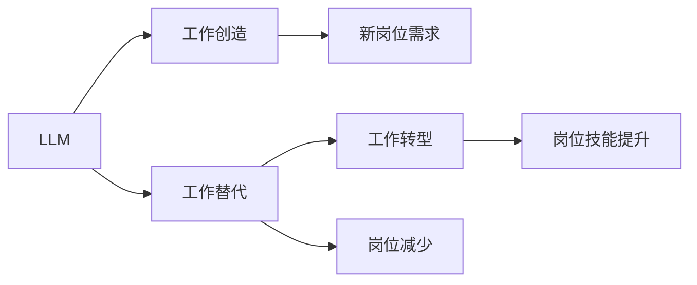

                 

# LLM 对就业市场的影响：工作创造和替代

## 1. 背景介绍

在过去几十年里，人工智能(AI)技术的迅猛发展已经深刻影响了全球各行各业，尤其是对于就业市场的结构、需求和形态产生了重大变革。其中，大规模语言模型(LLM)作为AI领域的一个重要分支，凭借其强大的自然语言处理能力，已经开始在多个领域展现出巨大潜力。本文将深入探讨LLM对就业市场的影响，从工作创造和替代两个维度，系统分析其对就业市场变化的潜在效应。

### 1.1 就业市场现状

当前，全球就业市场面临着诸多挑战，包括但不限于技术变革带来的岗位变迁、人口老龄化带来的劳动力供需不平衡、经济增长放缓等。根据国际劳工组织(国际劳工组织，ILO)的数据，截至2022年，全球失业率仍处于高位，主要发达经济体和新兴市场的失业率均高于历史平均值。此外，自动化和人工智能技术的应用，尤其是LLM的普及，进一步加剧了这一问题。

### 1.2 LLM的定义与现状

大规模语言模型(LLM)是一类基于深度学习技术，能够处理自然语言数据的复杂模型。其核心特征是参数量巨大、模型结构复杂、能理解并生成人类自然语言。近年来，随着GPT-3、GPT-4等预训练模型的问世，LLM在自然语言处理领域的优越表现引起了广泛关注，广泛应用于文本生成、对话系统、问答系统、摘要生成等多个领域。

## 2. 核心概念与联系

### 2.1 核心概念概述

为更好地理解LLM对就业市场的影响，本节将介绍几个关键概念：

- **LLM**：一种能够理解和生成自然语言的深度学习模型。
- **工作创造**：AI技术带来的新工作岗位的增加，如数据分析师、AI伦理专家、LLM系统维护工程师等。
- **工作替代**：由于AI技术替代人工操作，导致传统岗位数量减少或消失，如客服、数据录入、基础编程等。
- **工作转型**：原本需要人工操作的岗位，在引入AI技术后，工作内容和技能要求发生改变。

### 2.2 核心概念联系

通过以下Mermaid流程图，我们可以更直观地理解LLM与就业市场之间的关系：



### 2.3 核心概念原理和架构

LLM的核心工作原理可以概括为以下几个步骤：

1. **数据预处理**：将自然语言文本转换为模型能够处理的数值数据。
2. **模型预训练**：在大量无标签数据上进行预训练，学习语言表示。
3. **微调**：在特定任务数据集上进行有监督训练，优化模型性能。
4. **部署与应用**：将训练好的模型部署到实际应用中，执行自然语言理解和生成任务。

这一过程通常使用Transformer架构，其中自注意力机制和跨层连接结构是其核心。

## 3. 核心算法原理 & 具体操作步骤

### 3.1 算法原理概述

LLM对就业市场的影响，主要体现在工作创造和替代两个方面。下面我们分别阐述这两个维度的算法原理和操作步骤：

#### 3.1.1 工作创造

在LLM的应用过程中，往往需要大量技术人才进行模型训练、系统开发和维护。这些技术岗位可以包括数据科学家、软件工程师、AI研究员等。以自然语言处理(NLP)领域为例，基于LLM的文本生成、情感分析、问答系统等应用，需要专业的NLP工程师进行任务适配和系统优化。

#### 3.1.2 工作替代

LLM在执行特定任务时，能够自动完成原本需要人工操作的部分。例如，基于LLM的自动化客服系统可以处理大量客户咨询，减轻人工客服的工作负担。同样，基于LLM的文档自动摘要、内容自动分类等功能，可以替代人工的数据整理和标注工作。

### 3.2 算法步骤详解

下面详细介绍基于LLM的工作创造和替代的算法步骤：

#### 3.2.1 工作创造

1. **数据收集与处理**：收集和处理大量的自然语言数据，包括文本数据、语音数据、图像数据等。
2. **模型预训练**：在无标签数据上对预训练模型进行训练，学习通用的语言表示。
3. **任务适配与微调**：根据特定应用场景，设计适配层并微调模型，使其能够执行具体任务。
4. **系统集成与应用**：将微调后的模型集成到实际应用系统中，实现自然语言理解和生成。

#### 3.2.2 工作替代

1. **任务定义与数据收集**：确定要被替代的具体任务和需要的数据类型。
2. **模型选择与适配**：选择适合的预训练模型，并根据任务需求进行适配和微调。
3. **系统部署与测试**：将微调后的模型部署到实际应用中，并进行充分的测试和优化。
4. **监控与维护**：持续监控系统性能，必要时进行参数更新和模型优化。

### 3.3 算法优缺点

#### 3.3.1 工作创造

**优点**：
1. 创造新的技术岗位，提供就业机会。
2. 提升工作效率，降低企业成本。

**缺点**：
1. 技术门槛较高，需要具备一定的专业知识和技能。
2. 人才供需不平衡，高级人才稀缺。

#### 3.3.2 工作替代

**优点**：
1. 提高工作效率，减少人工操作。
2. 降低企业运营成本，提高利润率。

**缺点**：
1. 部分岗位消失，员工失业风险增加。
2. 需要重新培训员工，技能转换成本高。

### 3.4 算法应用领域

基于LLM的工作创造和替代技术，已经在多个领域展现出显著的应用前景：

- **金融**：基于LLM的自动化报告生成、风险评估、客户服务等。
- **医疗**：基于LLM的电子病历整理、药物推荐、虚拟助手等。
- **教育**：基于LLM的个性化教学、智能答疑、内容生成等。
- **法律**：基于LLM的合同审查、法律文书生成、案件分析等。

## 4. 数学模型和公式 & 详细讲解

### 4.1 数学模型构建

基于LLM的就业市场影响模型可以表示为：

$$ \text{就业市场变化} = f(\text{LLM技术应用}, \text{就业市场现状}, \text{政策环境}, \text{经济因素}) $$

其中，$f$为综合函数，表示LLM技术应用对就业市场变化的影响。

### 4.2 公式推导过程

我们可以进一步细化这个模型，考虑不同因素的影响：

1. **技术应用程度**：$P(\text{技术应用}) = P(\text{创造岗位}) + P(\text{替代岗位}) + P(\text{转型岗位})$
2. **就业市场现状**：$Q(\text{就业市场}) = Q(\text{劳动力需求}) - Q(\text{劳动力供给})$
3. **政策环境**：$R(\text{政策}) = \text{政府支持} + \text{法律规范} + \text{经济刺激}$
4. **经济因素**：$E(\text{经济}) = \text{GDP增长率} + \text{失业率} + \text{产业结构变化}$

将这些因素代入综合函数，可以得到：

$$ \text{就业市场变化} = P(\text{技术应用}) \cdot Q(\text{就业市场}) + R(\text{政策}) \cdot E(\text{经济}) $$

### 4.3 案例分析与讲解

以医疗行业为例，基于LLM的电子病历整理系统：

1. **技术应用**：通过LLM进行电子病历的自动整理和归档，提高了工作效率。
2. **就业市场**：医护人员需要重新学习如何与LLM系统协作，部分数据录入工作被替代。
3. **政策环境**：政府政策支持技术创新，法律规范数据隐私。
4. **经济因素**：医疗行业GDP增长，病患数量增加。

## 5. 项目实践：代码实例和详细解释说明

### 5.1 开发环境搭建

在进行LLM项目开发前，需要准备以下开发环境：

1. **Python**：安装最新版本的Python和PyTorch库。
2. **PyTorch**：使用pip安装PyTorch。
3. **LLM库**：选择适合的项目，如Hugging Face的Transformers库。
4. **数据集**：收集并准备训练数据集，包括文本、标签等。

### 5.2 源代码详细实现

以下是一个基于LLM的文本生成系统的代码实现：

```python
import torch
from transformers import GPT2Tokenizer, GPT2LMHeadModel

# 初始化模型和tokenizer
tokenizer = GPT2Tokenizer.from_pretrained('gpt2')
model = GPT2LMHeadModel.from_pretrained('gpt2')

# 设置模型参数
device = 'cuda' if torch.cuda.is_available() else 'cpu'
model.to(device)

# 定义生成函数
def generate_text(prompt):
    inputs = tokenizer.encode(prompt, return_tensors='pt').to(device)
    outputs = model.generate(inputs, max_length=100, temperature=0.9, top_p=0.9)
    return tokenizer.decode(outputs[0], skip_special_tokens=True)

# 生成示例文本
print(generate_text('如何开始学习人工智能'))
```

### 5.3 代码解读与分析

**初始化模型和tokenizer**：使用GPT2预训练模型和tokenizer，并将其部署到GPU或CPU。

**生成函数**：接收一个提示文本，使用模型生成相应长度的文本。

**参数设置**：最大生成长度为100，温度和top_p参数控制生成的多样性和相关性。

**代码示例**：通过输入提示文本，生成相关的文本内容。

### 5.4 运行结果展示

运行上述代码，可以生成类似“人工智能”相关的话题讨论文本，展示了LLM在文本生成方面的能力。

## 6. 实际应用场景

### 6.1 金融行业

在金融行业，基于LLM的自动化报告生成系统可以大幅提升工作效率。例如，使用LLM自动分析市场数据，生成分析报告，降低了分析师的工作量。同时，LLM可以处理大量的客户咨询，提供24/7的客户服务。

### 6.2 医疗行业

在医疗行业，基于LLM的电子病历整理和药物推荐系统，可以显著提高医院的工作效率和医疗质量。LLM能够自动整理电子病历，减轻医护人员的工作负担。同时，LLM能够根据病历数据，推荐合适的治疗方案。

### 6.3 教育行业

在教育行业，基于LLM的智能答疑和内容生成系统，可以提供个性化的教学服务。LLM能够根据学生的学习情况，生成个性化的学习内容和答疑建议，帮助学生更好地掌握知识。

## 7. 工具和资源推荐

### 7.1 学习资源推荐

1. **《Deep Learning with PyTorch》**：介绍如何使用PyTorch进行深度学习项目开发，包含LLM的相关内容。
2. **《Natural Language Processing with Python》**：介绍如何使用Python进行自然语言处理，包含LLM的使用方法。
3. **《Transformers: From Research to Real World》**：Hugging Face组织的Transformers库使用指南，涵盖LLM的应用实例。

### 7.2 开发工具推荐

1. **PyTorch**：深度学习领域最常用的框架之一，支持动态计算图。
2. **TensorFlow**：Google开发的深度学习框架，支持静态计算图。
3. **Hugging Face Transformers**：专门针对NLP任务的深度学习库，包含预训练模型和微调方法。
4. **Jupyter Notebook**：交互式Python开发环境，方便进行模型调试和代码迭代。

### 7.3 相关论文推荐

1. **"Attention is All You Need"**：提出Transformer模型，是LLM领域的基础。
2. **"BERT: Pre-training of Deep Bidirectional Transformers for Language Understanding"**：提出BERT模型，开启大规模预训练模型时代。
3. **"GPT-3: Language Models are Unsupervised Multitask Learners"**：展示GPT-3的强大文本生成能力，推动LLM技术的普及。

## 8. 总结：未来发展趋势与挑战

### 8.1 研究成果总结

本文从工作创造和替代两个维度，详细分析了基于LLM的就业市场影响。通过数学模型和案例分析，我们认识到LLM对就业市场的双重效应，既有创造新岗位的机会，也有替代传统岗位的风险。

### 8.2 未来发展趋势

1. **自动化程度提升**：随着LLM技术的不断进步，其自动化能力将进一步提高，减少人工操作。
2. **多模态融合**：LLM将与其他AI技术如计算机视觉、语音识别等结合，实现更丰富的应用场景。
3. **跨领域应用拓展**：LLM将在更多行业领域中得到应用，如交通、制造、农业等。

### 8.3 面临的挑战

1. **技能培训问题**：传统岗位消失后，如何重新培训员工，提升其适应新岗位的能力。
2. **数据隐私与安全**：在使用LLM处理敏感信息时，如何保护用户数据隐私和安全。
3. **伦理与法律问题**：在使用LLM过程中，如何避免偏见和歧视，遵守伦理与法律规范。

### 8.4 研究展望

未来的研究需要关注以下几个方面：

1. **跨领域应用**：研究LLM在多个行业的应用，推动AI技术的广泛落地。
2. **伦理与法律**：制定相关法律法规，保障LLM系统的透明性与公平性。
3. **数据隐私与安全**：开发隐私保护技术，确保用户数据安全。

## 9. 附录：常见问题与解答

**Q1: 如何评估LLM对就业市场的影响？**

A: 评估LLM对就业市场的影响需要综合考虑技术应用程度、就业市场现状、政策环境和经济因素。通过构建综合模型，可以更准确地预测就业市场变化。

**Q2: LLM如何实现工作替代？**

A: LLM通过自动化处理自然语言文本，执行原本需要人工操作的特定任务，如文本生成、数据分析、客户服务等。

**Q3: LLM对哪些岗位有影响？**

A: LLM对需要大量数据处理和文本分析的岗位影响较大，如数据科学家、客服、内容生成等。

**Q4: LLM的工作创造和替代效应是否均衡？**

A: 需要根据具体应用场景和行业特点进行评估。在一些领域，LLM可能更多地创造新岗位，而在其他领域，可能更多地替代传统岗位。

**Q5: LLM的发展趋势是什么？**

A: LLM技术不断进步，未来将进一步提升自动化能力，拓展跨领域应用，提升数据隐私保护能力，同时需要关注伦理与法律问题。

---

作者：禅与计算机程序设计艺术 / Zen and the Art of Computer Programming

