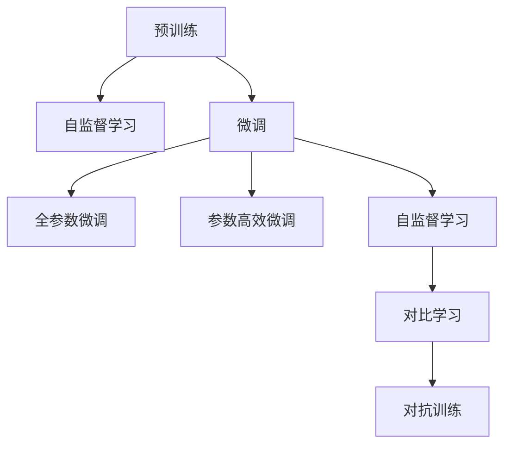

                 

# LLM 的训练：大规模数据和先进算法

## 1. 背景介绍

随着人工智能技术的迅猛发展，大规模语言模型(LLM)已经成为了NLP领域的重要里程碑。LLM通过在大规模语料上进行预训练，学习到丰富的语言知识和语义理解能力，并能够在小样本数据上进行微调，以适应特定的应用场景。

## 2. 核心概念与联系

### 2.1 核心概念概述

为了更好地理解LLM的训练过程，我们将介绍几个关键概念及其相互关系：

- **预训练(Pre-training)**：指在大规模无标签文本数据上，通过自监督学习任务对通用语言模型进行训练。预训练使得模型学习到通用的语言表示，具有泛化能力。

- **微调(Fine-tuning)**：指在预训练模型的基础上，使用下游任务的少量标注数据，通过有监督学习优化模型在该任务上的性能。通常只调整顶层或部分参数，以避免过拟合。

- **自监督学习(Self-supervised Learning)**：指在无标签数据上，通过设计一些与真实标签相关的预训练任务，如掩码语言模型(Masked Language Modeling, MLM)、语言模型(Language Modeling)等，训练通用语言模型。

- **迁移学习(Transfer Learning)**：指在预训练模型的基础上，利用其学习到的知识，通过微调等方式，提升模型在特定任务上的表现。

- **对比学习(Contrastive Learning)**：通过构建正负样本对，最大化样本之间的差异性，最小化样本内部的相似性，提高模型的泛化能力。

- **对抗训练(Adversarial Training)**：指在训练过程中，引入对抗样本，提高模型的鲁棒性。

### 2.2 核心概念原理和架构的 Mermaid 流程图



以上流程图展示了预训练、微调等核心概念之间的相互关系。预训练提供了通用的语言表示，微调则是通过有监督的方式，在特定任务上进行适配。自监督学习、对比学习和对抗训练都是预训练的重要手段，提高了模型的泛化能力和鲁棒性。

## 3. 核心算法原理 & 具体操作步骤

### 3.1 算法原理概述

LLM的训练可以分为预训练和微调两个阶段：

- **预训练阶段**：在大规模无标签文本数据上，通过自监督学习任务训练通用语言模型。
- **微调阶段**：在预训练模型的基础上，使用下游任务的少量标注数据，通过有监督学习优化模型在该任务上的性能。

### 3.2 算法步骤详解

#### 3.2.1 预训练

1. **数据准备**：收集大规模无标签文本数据，如维基百科、新闻、论文等。

2. **任务设计**：设计一些与真实标签相关的自监督学习任务，如掩码语言模型、语言模型等。

3. **模型训练**：使用Transformer等模型架构，在大规模数据上进行训练。通常采用分布式训练，加速模型收敛。

4. **模型评估**：在验证集上评估模型性能，如BLEU、ROUGE等指标。

#### 3.2.2 微调

1. **任务适配**：根据下游任务类型，设计合适的输出层和损失函数。

2. **数据准备**：准备下游任务的少量标注数据，划分训练集、验证集和测试集。

3. **模型微调**：在预训练模型的基础上，使用下游任务的标注数据进行微调。通常只调整顶层或部分参数。

4. **模型评估**：在测试集上评估微调后模型的性能，如准确率、F1分数等指标。

### 3.3 算法优缺点

#### 3.3.1 优点

- **泛化能力强**：通过在大规模无标签数据上进行预训练，LLM具备较强的泛化能力，能够适应多种下游任务。
- **训练效率高**：预训练和微调可以并行进行，加速模型训练。
- **参数高效**：可以通过参数高效微调技术，在固定大部分预训练参数的情况下，进行微调，提高效率。

#### 3.3.2 缺点

- **依赖大量数据**：预训练和微调都需要大量的数据支持，数据获取成本高。
- **模型复杂度高**：模型参数量庞大，训练和推理资源消耗大。
- **难以解释**：黑盒模型，难以解释其内部决策过程。

### 3.4 算法应用领域

LLM的训练方法已经广泛应用于以下领域：

- **自然语言理解(NLU)**：如文本分类、情感分析、问答系统等。
- **自然语言生成(NLG)**：如文本生成、机器翻译、对话系统等。
- **语音处理**：如语音识别、语音合成等。
- **视觉语言理解**：如图像描述、视觉问答等。

## 4. 数学模型和公式 & 详细讲解

### 4.1 数学模型构建

在LLM的训练过程中，我们通常使用Transformer模型进行预训练和微调。

设预训练模型为 $M_{\theta}$，其中 $\theta$ 为模型参数。假设微调任务的训练集为 $D=\{(x_i, y_i)\}_{i=1}^N$，其中 $x_i$ 为输入，$y_i$ 为输出标签。

微调的优化目标为最小化损失函数 $\mathcal{L}(\theta)$，即：

$$
\mathcal{L}(\theta) = \frac{1}{N} \sum_{i=1}^N \ell(M_{\theta}(x_i), y_i)
$$

其中 $\ell$ 为损失函数，如交叉熵损失。

### 4.2 公式推导过程

以二分类任务为例，假设模型的输出为 $y \in \{0, 1\}$，真实标签为 $y_i \in \{0, 1\}$，模型的输出概率为 $p(y_i = 1 | x_i)$，则二分类交叉熵损失函数为：

$$
\ell(M_{\theta}(x_i), y_i) = -y_i\log p(y_i = 1 | x_i) - (1-y_i)\log p(y_i = 0 | x_i)
$$

将上述损失函数代入经验风险公式，得：

$$
\mathcal{L}(\theta) = -\frac{1}{N}\sum_{i=1}^N [y_i\log p(y_i = 1 | x_i)+(1-y_i)\log p(y_i = 0 | x_i)]
$$

损失函数对模型参数 $\theta$ 的梯度为：

$$
\frac{\partial \mathcal{L}(\theta)}{\partial \theta_k} = -\frac{1}{N}\sum_{i=1}^N [y_i\frac{\partial \log p(y_i = 1 | x_i)}{\partial \theta_k}+(1-y_i)\frac{\partial \log p(y_i = 0 | x_i)}{\partial \theta_k}]
$$

利用自动微分技术，可以高效计算上述梯度，进行模型参数更新。

### 4.3 案例分析与讲解

假设我们有一个简单的二分类任务，输入文本为 "I love cats"，输出标签为 "1"。使用预训练的BERT模型进行微调。

1. **任务适配**：在BERT模型的顶层添加一个线性分类器，输出层为 [0, 1]。

2. **数据准备**：准备标注数据集，如 [("I love cats", 1), ("I hate dogs", 0)]。

3. **模型微调**：使用微调数据集训练模型，学习输出标签与文本表示之间的映射关系。

4. **模型评估**：在测试集上评估微调后模型的性能，如准确率。

## 5. 项目实践：代码实例和详细解释说明

### 5.1 开发环境搭建

为了进行LLM的训练和微调，我们需要准备好以下开发环境：

1. **安装Python**：从官网下载并安装Python，如Anaconda或Miniconda。

2. **安装PyTorch**：使用pip或conda安装PyTorch，如：

```bash
pip install torch torchvision torchaudio
```

3. **安装Hugging Face Transformers**：使用pip或conda安装Transformers库，如：

```bash
pip install transformers
```

4. **安装其他依赖**：安装其他必要的Python库，如numpy、pandas、scikit-learn等。

### 5.2 源代码详细实现

下面以BERT模型进行二分类任务微调为例，给出完整的代码实现：

```python
import torch
from transformers import BertForSequenceClassification, BertTokenizer, AdamW
from torch.utils.data import DataLoader, Dataset

class MyDataset(Dataset):
    def __init__(self, texts, labels):
        self.texts = texts
        self.labels = labels
        self.tokenizer = BertTokenizer.from_pretrained('bert-base-uncased')
        
    def __len__(self):
        return len(self.texts)
    
    def __getitem__(self, idx):
        text = self.texts[idx]
        label = self.labels[idx]
        
        encoding = self.tokenizer(text, return_tensors='pt', truncation=True, padding='max_length')
        input_ids = encoding['input_ids']
        attention_mask = encoding['attention_mask']
        
        return {'input_ids': input_ids, 'attention_mask': attention_mask, 'labels': torch.tensor(label, dtype=torch.long)}

# 加载数据
train_data = MyDataset(train_texts, train_labels)
val_data = MyDataset(val_texts, val_labels)
test_data = MyDataset(test_texts, test_labels)

# 设置超参数
model = BertForSequenceClassification.from_pretrained('bert-base-uncased', num_labels=2)
optimizer = AdamW(model.parameters(), lr=2e-5)
device = torch.device('cuda' if torch.cuda.is_available() else 'cpu')

# 训练模型
def train_epoch(model, data_loader, optimizer):
    model.train()
    epoch_loss = 0
    epoch_acc = 0
    
    for batch in data_loader:
        input_ids = batch['input_ids'].to(device)
        attention_mask = batch['attention_mask'].to(device)
        labels = batch['labels'].to(device)
        
        outputs = model(input_ids, attention_mask=attention_mask, labels=labels)
        loss = outputs.loss
        logits = outputs.logits
        
        epoch_loss += loss.item()
        epoch_acc += (logits.argmax(dim=1) == labels).sum().item()
        
    return epoch_loss / len(data_loader), epoch_acc / len(data_loader)

def evaluate(model, data_loader):
    model.eval()
    total_loss = 0
    total_acc = 0
    
    with torch.no_grad():
        for batch in data_loader:
            input_ids = batch['input_ids'].to(device)
            attention_mask = batch['attention_mask'].to(device)
            labels = batch['labels'].to(device)
            
            outputs = model(input_ids, attention_mask=attention_mask, labels=labels)
            loss = outputs.loss
            logits = outputs.logits
            
            total_loss += loss.item()
            total_acc += (logits.argmax(dim=1) == labels).sum().item()
            
    return total_loss / len(data_loader), total_acc / len(data_loader)

# 训练模型
epochs = 5
batch_size = 16

for epoch in range(epochs):
    train_loss, train_acc = train_epoch(model, train_data, optimizer)
    val_loss, val_acc = evaluate(model, val_data)
    
    print(f"Epoch {epoch+1}, Train Loss: {train_loss:.4f}, Train Acc: {train_acc:.4f}, Val Loss: {val_loss:.4f}, Val Acc: {val_acc:.4f}")
    
print(f"Test Acc: {evaluate(model, test_data)[1]:.4f}")
```

### 5.3 代码解读与分析

上述代码实现了一个简单的二分类任务，使用BERT模型进行微调。以下是关键代码的解读：

- **数据准备**：通过继承 `Dataset` 类，自定义数据集，并加载训练、验证、测试数据。
- **模型初始化**：使用 `BertForSequenceClassification` 类初始化模型，并设置超参数。
- **训练和评估**：使用 `train_epoch` 和 `evaluate` 函数进行模型训练和评估。

## 6. 实际应用场景

### 6.1 智能客服系统

智能客服系统可以应用大语言模型微调技术，通过对话数据进行训练，实现对客户咨询的快速响应和准确答复。

### 6.2 金融舆情监测

金融机构可以利用大语言模型进行舆情监测，通过情感分析技术识别和监测市场情绪变化，及时采取应对措施。

### 6.3 个性化推荐系统

个性化推荐系统可以利用大语言模型微调技术，通过用户行为数据进行训练，生成更符合用户偏好的推荐内容。

### 6.4 未来应用展望

未来，大语言模型微调技术将广泛应用于更多领域，如医疗、教育、智慧城市等。随着技术的不断进步，微调方法的效率和性能将进一步提升，实现更加高效和智能的解决方案。

## 7. 工具和资源推荐

### 7.1 学习资源推荐

1. **《自然语言处理综论》(Stuart Russell & Peter Norvig)**：经典教材，涵盖NLP的各个方面，适合入门和深入学习。

2. **《深度学习》(Ian Goodfellow, Yoshua Bengio & Aaron Courville)**：深度学习领域的经典教材，详细介绍了神经网络和微调技术。

3. **《Transformers: A Survey》**：综述性论文，介绍了Transformer的原理、应用和改进方法。

4. **《Hugging Face官方文档》**：提供了丰富的预训练模型和微调样例，适合学习和实践。

5. **Kaggle比赛和数据集**：通过参与Kaggle比赛和下载数据集，可以获取最新的NLP应用案例和实战经验。

### 7.2 开发工具推荐

1. **PyTorch**：深度学习框架，提供了灵活的计算图和丰富的预训练模型库。

2. **TensorFlow**：由Google开发，支持大规模分布式训练和推理。

3. **Transformers**：Hugging Face开发的NLP库，支持多种预训练模型和微调技术。

4. **TensorBoard**：可视化工具，可实时监控训练过程和模型性能。

5. **Weights & Biases**：模型实验跟踪工具，记录和分析模型训练过程。

### 7.3 相关论文推荐

1. **《Attention is All You Need》(Vaswani et al., 2017)**：Transformer模型的原始论文，提出了自注意力机制，改变了NLP领域的游戏规则。

2. **《BERT: Pre-training of Deep Bidirectional Transformers for Language Understanding》(Devlin et al., 2018)**：BERT模型的原始论文，通过掩码语言模型和下一句预测任务，提升语言表示能力。

3. **《Universal Language Model Fine-tuning for Text Classification》(Zhang et al., 2019)**：提出了参数高效微调技术，在固定大部分预训练参数的情况下，进行微调。

4. **《Contrastive Learning》(Hadsell et al., 2006)**：对比学习技术的原始论文，通过正负样本对，提高模型的泛化能力。

5. **《Adversarial Examples for Natural Language Processing》(Kurz et al., 2016)**：对抗训练技术的原始论文，通过引入对抗样本，提高模型的鲁棒性。

## 8. 总结：未来发展趋势与挑战

### 8.1 研究成果总结

大语言模型微调技术已经取得了显著的进展，并在NLP领域获得了广泛应用。通过预训练和微调，模型在特定任务上具备了强大的泛化能力和适应性。

### 8.2 未来发展趋势

1. **模型规模不断增大**：预训练模型的参数量将进一步增长，通过更大规模的数据和更复杂的任务进行预训练，提高模型的表现。

2. **微调方法的优化**：如参数高效微调、少样本学习和多任务学习等，提高微调的效率和效果。

3. **跨领域迁移能力的提升**：通过多任务学习和迁移学习，使模型具备更强的跨领域适应能力。

4. **模型的可解释性和鲁棒性**：开发更好的模型解释工具，提高模型的可解释性。引入对抗训练和对比学习，提高模型的鲁棒性。

5. **模型的高效性和可扩展性**：优化模型的计算图，提高推理速度和资源利用效率。

### 8.3 面临的挑战

1. **数据获取和标注成本**：大规模无标签数据的获取和标注成本较高，如何利用更少的数据进行有效的微调，是亟待解决的问题。

2. **模型过拟合和泛化能力**：在微调过程中，模型容易过拟合标注数据，泛化能力受到限制。如何缓解过拟合，提高泛化能力，是重要的研究方向。

3. **模型的可解释性和鲁棒性**：大语言模型通常被视为黑盒，难以解释其内部决策过程。如何在保证性能的同时，提高模型的可解释性和鲁棒性，是重要的挑战。

4. **模型的存储和推理效率**：大语言模型通常包含大量的参数，如何高效存储和推理，是实际应用中的关键问题。

### 8.4 研究展望

未来，大语言模型微调技术将继续在多个领域取得突破：

1. **大规模数据预训练**：通过更大规模的数据和更复杂的任务进行预训练，提高模型的表现。

2. **多任务学习和迁移学习**：通过多任务学习和迁移学习，使模型具备更强的跨领域适应能力。

3. **模型的可解释性和鲁棒性**：开发更好的模型解释工具，提高模型的可解释性和鲁棒性。

4. **模型的推理效率和可扩展性**：优化模型的计算图，提高推理速度和资源利用效率。

5. **模型的安全性**：引入伦理道德约束，确保模型输出的安全性。

总之，大语言模型微调技术正处于快速发展阶段，未来将在更多领域展现其强大的潜力。通过持续的研究和优化，我们将能够更好地构建高效、智能、安全的智能系统。

## 9. 附录：常见问题与解答

**Q1: 大语言模型微调是否适用于所有NLP任务？**

A: 大语言模型微调在大多数NLP任务上都能取得不错的效果，特别是对于数据量较小的任务。但对于一些特定领域的任务，如医学、法律等，仅仅依靠通用语料预训练的模型可能难以很好地适应。此时需要在特定领域语料上进一步预训练，再进行微调，才能获得理想效果。此外，对于一些需要时效性、个性化很强的任务，如对话、推荐等，微调方法也需要针对性的改进优化。

**Q2: 微调过程中如何选择合适的学习率？**

A: 微调的学习率一般要比预训练时小1-2个数量级，如果使用过大的学习率，容易破坏预训练权重，导致过拟合。一般建议从1e-5开始调参，逐步减小学习率，直至收敛。也可以使用warmup策略，在开始阶段使用较小的学习率，再逐渐过渡到预设值。需要注意的是，不同的优化器(如AdamW、Adafactor等)以及不同的学习率调度策略，可能需要设置不同的学习率阈值。

**Q3: 采用大模型微调时会面临哪些资源瓶颈？**

A: 目前主流的预训练大模型动辄以亿计的参数规模，对算力、内存、存储都提出了很高的要求。GPU/TPU等高性能设备是必不可少的，但即便如此，超大批次的训练和推理也可能遇到显存不足的问题。因此需要采用一些资源优化技术，如梯度积累、混合精度训练、模型并行等，来突破硬件瓶颈。同时，模型的存储和读取也可能占用大量时间和空间，需要采用模型压缩、稀疏化存储等方法进行优化。

**Q4: 如何缓解微调过程中的过拟合问题？**

A: 过拟合是微调面临的主要挑战，尤其是在标注数据不足的情况下。常见的缓解策略包括：
1. 数据增强：通过回译、近义替换等方式扩充训练集
2. 正则化：使用L2正则、Dropout、Early Stopping等避免过拟合
3. 对抗训练：引入对抗样本，提高模型的鲁棒性
4. 参数高效微调：只调整少量参数(如Adapter、Prefix等)，减小过拟合风险
5. 多模型集成：训练多个微调模型，取平均输出，抑制过拟合

这些策略往往需要根据具体任务和数据特点进行灵活组合。只有在数据、模型、训练、推理等各环节进行全面优化，才能最大限度地发挥大模型微调的威力。

**Q5: 微调模型在落地部署时需要注意哪些问题？**

A: 将微调模型转化为实际应用，还需要考虑以下因素：
1. 模型裁剪：去除不必要的层和参数，减小模型尺寸，加快推理速度
2. 量化加速：将浮点模型转为定点模型，压缩存储空间，提高计算效率
3. 服务化封装：将模型封装为标准化服务接口，便于集成调用
4. 弹性伸缩：根据请求流量动态调整资源配置，平衡服务质量和成本
5. 监控告警：实时采集系统指标，设置异常告警阈值，确保服务稳定性
6. 安全防护：采用访问鉴权、数据脱敏等措施，保障数据和模型安全

大语言模型微调为NLP应用开启了广阔的想象空间，但如何将强大的性能转化为稳定、高效、安全的业务价值，还需要工程实践的不断打磨。唯有从数据、算法、工程、业务等多个维度协同发力，才能真正实现人工智能技术在垂直行业的规模化落地。总之，微调需要开发者根据具体任务，不断迭代和优化模型、数据和算法，方能得到理想的效果。

---

作者：禅与计算机程序设计艺术 / Zen and the Art of Computer Programming

