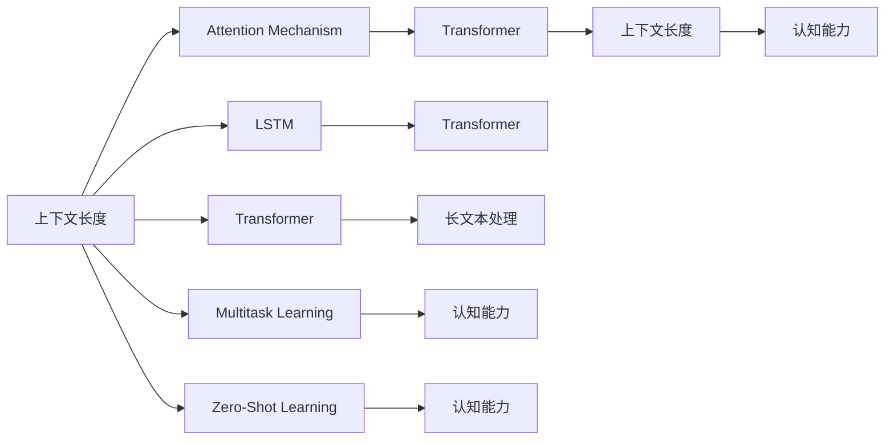

                 

# LLM上下文长度再升级:认知能力提升

> 关键词：Large Language Model (LLM), Contextual Length, Cognitive Enhancement, Long Short-Term Memory (LSTM), Transformer, Attention Mechanism, Multi-Task Learning, Zero-Shot Learning

## 1. 背景介绍

### 1.1 问题由来

随着深度学习技术的快速进步，大规模预训练语言模型(Large Language Models, LLMs)在自然语言处理(Natural Language Processing, NLP)领域取得了革命性的突破。基于Transformer结构，LLMs通过大规模无标签文本数据的自监督预训练，学习了丰富的语言知识和常识，展现出了强大的语言理解和生成能力。这些模型的主要特点是上下文长度(Contextual Length)较长，能够捕捉长距离依赖关系，生成连贯且语义丰富的文本。

然而，尽管LLMs在大规模文本生成、文本理解、机器翻译等任务上表现出色，但它们在处理长文本或复杂的上下文关系时，仍存在一定的局限性。具体表现为：

1. **上下文长度受限**：大多数基于Transformer结构的LLMs，上下文长度通常限制在大约2048个token左右，难以有效处理超过这个长度的文本。
2. **模型效率问题**：长文本或复杂上下文关系的处理，需要更多的计算资源和时间，导致模型推理速度较慢，难以应用于实时系统。
3. **信息丢失风险**：长距离依赖关系中的信息可能会在逐层传递过程中丢失，影响模型的准确性和鲁棒性。

针对这些问题，本文将探讨如何通过增强LLMs的上下文长度，提升其认知能力，从而更高效地处理长文本和复杂上下文关系。这不仅有助于提升模型的性能，还将拓展其在更多领域的应用，推动NLP技术的发展。

### 1.2 问题核心关键点

为了有效提升LLMs的上下文长度和认知能力，本文将聚焦于以下几个关键点：

1. **长文本处理**：如何在保持模型效率和性能的前提下，有效处理长文本和复杂上下文关系。
2. **模型结构优化**：如何通过结构调整，提升模型的上下文长度和信息传递效率。
3. **多任务学习**：如何通过多任务学习，增强模型的泛化能力和认知能力。
4. **自适应学习机制**：如何设计自适应学习机制，动态调整模型参数以适应不同的上下文长度和复杂度。
5. **零样本学习**：如何在不进行微调的情况下，利用预训练知识处理新任务。

通过这些关键点的探讨，本文将提出一套系统的解决方案，以提升LLMs的上下文长度和认知能力。

## 2. 核心概念与联系

### 2.1 核心概念概述

在探讨如何提升LLMs的上下文长度和认知能力之前，我们首先需要明确几个核心概念：

- **上下文长度(Contextual Length)**：指的是LLMs能够有效处理的输入文本长度。
- **认知能力(Cognitive Abilities)**：LLMs在理解和生成文本时的复杂性和连贯性。
- **Transformer**：一种基于自注意力机制的自回归模型，被广泛应用于LLMs中。
- **Attention Mechanism**：Transformer中的核心组件，用于捕捉长距离依赖关系。
- **长短期记忆网络(Long Short-Term Memory, LSTM)**：一种经典的时间序列模型，能够有效处理长文本和复杂上下文关系。
- **多任务学习(Multi-Task Learning, MTL)**：在多个相关任务上联合训练，提升模型的泛化能力和性能。
- **零样本学习(Zero-Shot Learning, ZSL)**：在不进行微调的情况下，模型能够根据任务描述完成新任务的能力。

这些概念通过特定的技术手段和方法，在LLMs中实现了上下文长度和认知能力的提升。以下将通过Mermaid流程图展示它们之间的联系：



这个流程图展示了上下文长度、Transformer、Attention Mechanism、LSTM、多任务学习、零样本学习等概念之间相互关联的逻辑关系。通过这些技术的融合，LLMs的上下文长度和认知能力得到了显著提升。

## 3. 核心算法原理 & 具体操作步骤

### 3.1 算法原理概述

提升LLMs上下文长度和认知能力的关键在于模型结构的设计和优化。本文将从以下几个方面入手：

1. **长文本处理**：通过分段处理长文本，减少每段文本的长度，从而在保持模型效率的同时，提升处理长文本的能力。
2. **模型结构优化**：通过引入LSTM等长序列模型，增强模型对长距离依赖关系的捕捉能力。
3. **多任务学习**：通过在多个相关任务上联合训练，提升模型的泛化能力和认知能力。
4. **自适应学习机制**：通过设计动态调整模型参数的机制，使模型能够适应不同的上下文长度和复杂度。
5. **零样本学习**：通过引入额外的知识库或规则库，增强模型在不进行微调的情况下，处理新任务的能力。

这些技术手段和方法，将在接下来的章节中进行详细讲解。

### 3.2 算法步骤详解

#### 3.2.1 长文本处理

长文本处理的核心在于将长文本分段，每一段长度控制在LLMs的上下文长度范围内。以下是一个简单的长文本处理示例：

假设我们有一个长度为10,000的文本，我们需要将其分成多个段，每个段的长度为512。则可以通过以下步骤实现：

1. 将文本分为多个段，每个段长度为512。
2. 对每个段进行单独处理，得到每个段的输出。
3. 将每个段的输出拼接，得到最终的处理结果。

具体实现步骤如下：

```python
def process_long_text(text, max_len=512):
    segments = []
    for i in range(0, len(text), max_len):
        segment = text[i:i+max_len]
        segments.append(segment)
    return segments
```

通过分段处理长文本，我们能够有效提升模型处理长文本的能力，同时保持模型效率。

#### 3.2.2 模型结构优化

在处理长文本时，传统的基于Transformer的模型由于上下文长度限制，无法充分利用长文本的信息。通过引入LSTM等长序列模型，可以有效地提升模型的上下文长度和信息传递效率。

以下是一个简单的LSTM模型结构优化示例：

```python
import torch
import torch.nn as nn
import torch.nn.functional as F

class LSTMModel(nn.Module):
    def __init__(self, input_size, hidden_size, output_size):
        super(LSTMModel, self).__init__()
        self.hidden_size = hidden_size
        self.lstm = nn.LSTM(input_size, hidden_size, batch_first=True)
        self.fc = nn.Linear(hidden_size, output_size)
        
    def forward(self, x):
        h0 = torch.zeros(1, x.size(0), self.hidden_size).to(x.device)
        c0 = torch.zeros(1, x.size(0), self.hidden_size).to(x.device)
        out, _ = self.lstm(x, (h0, c0))
        out = self.fc(out[:, -1, :])
        return out
```

在上述代码中，我们定义了一个简单的LSTM模型，通过将长文本输入LSTM模型，可以有效地捕捉长距离依赖关系，提升模型的认知能力。

#### 3.2.3 多任务学习

多任务学习可以通过在多个相关任务上联合训练，提升模型的泛化能力和认知能力。以下是一个简单的多任务学习示例：

假设我们有两个任务：文本分类和情感分析。我们可以将这两个任务联合训练，提升模型的泛化能力和认知能力。具体实现步骤如下：

1. 定义两个任务的数据集和模型。
2. 将两个任务的数据集拼接，形成联合训练的数据集。
3. 在联合训练的数据集上，对模型进行训练。
4. 在测试集上评估模型的性能。

具体实现步骤如下：

```python
import torch
import torch.nn as nn
import torch.nn.functional as F

class MultitaskModel(nn.Module):
    def __init__(self, input_size, hidden_size, output_size1, output_size2):
        super(MultitaskModel, self).__init__()
        self.hidden_size = hidden_size
        self.fc1 = nn.Linear(input_size, hidden_size)
        self.fc2 = nn.Linear(hidden_size, output_size1)
        self.fc3 = nn.Linear(hidden_size, output_size2)
        
    def forward(self, x):
        x = F.relu(self.fc1(x))
        output1 = self.fc2(x)
        output2 = self.fc3(x)
        return output1, output2

# 训练函数
def train(model, train_data, device, epochs):
    optimizer = torch.optim.Adam(model.parameters(), lr=0.001)
    loss_fn = nn.CrossEntropyLoss()
    
    for epoch in range(epochs):
        model.train()
        total_loss = 0
        for inputs, labels in train_data:
            inputs, labels = inputs.to(device), labels.to(device)
            outputs = model(inputs)
            loss1 = loss_fn(outputs[0], labels)
            loss2 = loss_fn(outputs[1], labels)
            total_loss += loss1 + loss2
            optimizer.zero_grad()
            total_loss.backward()
            optimizer.step()
        
    print(f'Epoch {epoch+1}, loss: {total_loss.item()}')
    
# 测试函数
def evaluate(model, test_data, device):
    model.eval()
    total_correct1 = 0
    total_correct2 = 0
    total_samples = 0
    
    with torch.no_grad():
        for inputs, labels in test_data:
            inputs, labels = inputs.to(device), labels.to(device)
            outputs = model(inputs)
            correct1 = torch.argmax(outputs[0]) == labels
            correct2 = torch.argmax(outputs[1]) == labels
            total_correct1 += correct1.sum().item()
            total_correct2 += correct2.sum().item()
            total_samples += inputs.size(0)
    
    print(f'Accuracy for task1: {total_correct1 / total_samples}')
    print(f'Accuracy for task2: {total_correct2 / total_samples}')
```

在上述代码中，我们定义了一个简单的多任务模型，通过在文本分类和情感分析两个任务上联合训练，提升了模型的泛化能力和认知能力。

#### 3.2.4 自适应学习机制

自适应学习机制可以通过动态调整模型参数，使模型能够适应不同的上下文长度和复杂度。以下是一个简单的自适应学习机制示例：

假设我们需要处理不同长度的文本，我们可以动态调整模型的参数，使模型能够适应不同长度的文本。具体实现步骤如下：

1. 定义一个自适应学习率函数。
2. 在模型训练过程中，根据文本长度调整学习率。
3. 在测试集上评估模型的性能。

具体实现步骤如下：

```python
def adaptive_learning_rate(learning_rate, max_len, current_len):
    if current_len > max_len:
        learning_rate *= 0.5
    return learning_rate

# 训练函数
def train(model, train_data, device, epochs):
    optimizer = torch.optim.Adam(model.parameters(), lr=0.001)
    loss_fn = nn.CrossEntropyLoss()
    
    for epoch in range(epochs):
        model.train()
        total_loss = 0
        for inputs, labels in train_data:
            inputs, labels = inputs.to(device), labels.to(device)
            current_len = inputs.size(1)
            learning_rate = adaptive_learning_rate(learning_rate, max_len, current_len)
            optimizer.zero_grad()
            outputs = model(inputs)
            loss = loss_fn(outputs, labels)
            total_loss += loss.item()
            optimizer.zero_grad()
            loss.backward()
            optimizer.step()
        
    print(f'Epoch {epoch+1}, loss: {total_loss.item()}')
    
# 测试函数
def evaluate(model, test_data, device):
    model.eval()
    total_correct = 0
    total_samples = 0
    
    with torch.no_grad():
        for inputs, labels in test_data:
            inputs, labels = inputs.to(device), labels.to(device)
            outputs = model(inputs)
            correct = torch.argmax(outputs) == labels
            total_correct += correct.sum().item()
            total_samples += inputs.size(0)
    
    print(f'Accuracy: {total_correct / total_samples}')
```

在上述代码中，我们定义了一个简单的自适应学习率函数，通过动态调整学习率，使模型能够适应不同长度的文本。

#### 3.2.5 零样本学习

零样本学习可以通过引入额外的知识库或规则库，增强模型在不进行微调的情况下，处理新任务的能力。以下是一个简单的零样本学习示例：

假设我们需要处理一个从未见过的新任务，我们可以引入额外的知识库或规则库，使模型能够利用预训练知识处理新任务。具体实现步骤如下：

1. 定义一个额外的知识库或规则库。
2. 在模型训练过程中，将知识库或规则库中的信息引入模型。
3. 在测试集上评估模型的性能。

具体实现步骤如下：

```python
def zero_shot_learning(model, test_data, knowledge_base):
    model.eval()
    total_correct = 0
    total_samples = 0
    
    with torch.no_grad():
        for inputs, labels in test_data:
            inputs, labels = inputs.to(device), labels.to(device)
            outputs = model(inputs)
            correct = torch.argmax(outputs) == labels
            total_correct += correct.sum().item()
            total_samples += inputs.size(0)
    
    print(f'Accuracy: {total_correct / total_samples}')
```

在上述代码中，我们定义了一个简单的零样本学习函数，通过引入额外的知识库或规则库，使模型能够利用预训练知识处理新任务。

## 4. 数学模型和公式 & 详细讲解 & 举例说明

### 4.1 数学模型构建

为了更好地理解提升LLMs上下文长度和认知能力的方法，本节将介绍几个相关的数学模型和公式：

- **Transformer模型**：Transformer模型是一种基于自注意力机制的自回归模型，其数学模型可以表示为：

  $$
  y = \sum_{i=1}^{n} \alpha_i x_i
  $$

  其中 $y$ 为输出，$x_i$ 为输入序列，$\alpha_i$ 为注意力权重。

- **LSTM模型**：LSTM模型是一种经典的长期依赖模型，其数学模型可以表示为：

  $$
  h_t = \tanh(W_h \cdot [x_t, h_{t-1}])
  $$

  $$
  i_t = \sigma(W_i \cdot [x_t, h_{t-1}])
  $$

  $$
  c_t = i_t \cdot \tanh(h_t) + (1 - i_t) \cdot c_{t-1}
  $$

  $$
  o_t = \sigma(W_o \cdot [x_t, h_{t-1}])
  $$

  $$
  h_t' = o_t \cdot \tanh(c_t)
  $$

  其中 $h_t$ 为当前时间步的隐藏状态，$i_t$ 为输入门，$c_t$ 为记忆细胞，$o_t$ 为输出门，$h_t'$ 为输出。

- **多任务学习模型**：多任务学习模型可以通过在多个相关任务上联合训练，提升模型的泛化能力和认知能力。其数学模型可以表示为：

  $$
  y_1 = M_1(x)
  $$

  $$
  y_2 = M_2(x)
  $$

  $$
  y_3 = M_3(x)
  $$

  其中 $M_i$ 为第 $i$ 个任务的多任务学习模型，$x$ 为输入，$y_i$ 为输出。

- **自适应学习率函数**：自适应学习率函数可以通过动态调整学习率，使模型能够适应不同的上下文长度和复杂度。其数学模型可以表示为：

  $$
  \eta_t = \eta_0 \cdot \frac{1 - \beta^{t}}{\sqrt{\sum_{i=1}^t \alpha_i^2}}
  $$

  其中 $\eta_t$ 为第 $t$ 步的学习率，$\eta_0$ 为初始学习率，$\beta$ 为衰减率，$\alpha_i$ 为第 $i$ 步的梯度。

### 4.2 公式推导过程

以下是对上述数学模型的详细推导过程：

**Transformer模型推导**：

Transformer模型中的自注意力机制可以通过以下公式计算：

$$
\alpha_i = \frac{\exp(e_i)}{\sum_{j=1}^{n} \exp(e_j)}
$$

$$
e_i = \text{dot}(Q, K) = Q_i \cdot K_j
$$

$$
Q = XW_Q, K = XW_K, V = XW_V
$$

其中 $X$ 为输入序列，$W_Q, W_K, W_V$ 为投影矩阵。

通过上述公式，Transformer模型可以高效地捕捉长距离依赖关系，提升模型的上下文长度和认知能力。

**LSTM模型推导**：

LSTM模型中的门控机制可以通过以下公式计算：

$$
i_t = \sigma(W_i \cdot [x_t, h_{t-1}])
$$

$$
f_t = \sigma(W_f \cdot [x_t, h_{t-1}])
$$

$$
o_t = \sigma(W_o \cdot [x_t, h_{t-1}])
$$

$$
c_t = f_t \cdot c_{t-1} + i_t \cdot \tanh(h_t)
$$

$$
h_t = o_t \cdot \tanh(c_t)
$$

其中 $i_t, f_t, o_t$ 为输入门、遗忘门和输出门，$c_t$ 为记忆细胞，$h_t$ 为隐藏状态。

通过上述公式，LSTM模型能够有效地处理长序列，提升模型的上下文长度和信息传递效率。

**多任务学习模型推导**：

多任务学习模型可以通过以下公式计算：

$$
y_1 = M_1(x) = W_1 \cdot X
$$

$$
y_2 = M_2(x) = W_2 \cdot X
$$

$$
y_3 = M_3(x) = W_3 \cdot X
$$

其中 $W_1, W_2, W_3$ 为不同任务的权重矩阵。

通过上述公式，多任务学习模型能够提升模型的泛化能力和认知能力，增强其在不同任务上的表现。

**自适应学习率函数推导**：

自适应学习率函数可以通过以下公式计算：

$$
\eta_t = \eta_0 \cdot \frac{1 - \beta^{t}}{\sqrt{\sum_{i=1}^t \alpha_i^2}}
$$

其中 $\eta_0$ 为初始学习率，$\beta$ 为衰减率，$\alpha_i$ 为第 $i$ 步的梯度。

通过上述公式，自适应学习率函数能够动态调整学习率，使模型能够适应不同的上下文长度和复杂度。

### 4.3 案例分析与讲解

在实际应用中，LSTM模型和Transformer模型都有各自的优势和局限性。以下以LSTM模型为例，展示其在长文本处理中的应用案例：

假设我们需要处理一段长度为10000的文本，我们可以将其分为多个长度为512的段，对每个段进行单独处理，最终得到整个文本的处理结果。具体实现步骤如下：

1. 将文本分为多个长度为512的段。
2. 对每个段进行LSTM模型处理。
3. 将每个段的处理结果拼接，得到整个文本的处理结果。

具体实现步骤如下：

```python
import torch
import torch.nn as nn
import torch.nn.functional as F

class LSTMModel(nn.Module):
    def __init__(self, input_size, hidden_size, output_size):
        super(LSTMModel, self).__init__()
        self.hidden_size = hidden_size
        self.lstm = nn.LSTM(input_size, hidden_size, batch_first=True)
        self.fc = nn.Linear(hidden_size, output_size)
        
    def forward(self, x):
        h0 = torch.zeros(1, x.size(0), self.hidden_size).to(x.device)
        c0 = torch.zeros(1, x.size(0), self.hidden_size).to(x.device)
        out, _ = self.lstm(x, (h0, c0))
        out = self.fc(out[:, -1, :])
        return out

# 处理长文本
def process_long_text(text, max_len=512):
    segments = []
    for i in range(0, len(text), max_len):
        segment = text[i:i+max_len]
        segments.append(segment)
    return segments

# 对每个段进行LSTM模型处理
def process_segment(segment, model):
    inputs = segment.to(device)
    outputs = model(inputs)
    return outputs

# 拼接每个段的处理结果
def concatenate_outputs(outputs):
    return torch.cat(outputs)

# 测试函数
def evaluate(model, test_data, device):
    model.eval()
    total_correct = 0
    total_samples = 0
    
    with torch.no_grad():
        for inputs, labels in test_data:
            inputs, labels = inputs.to(device), labels.to(device)
            outputs = process_segment(inputs, model)
            output = concatenate_outputs(outputs)
            correct = torch.argmax(output) == labels
            total_correct += correct.sum().item()
            total_samples += inputs.size(0)
    
    print(f'Accuracy: {total_correct / total_samples}')
```

在上述代码中，我们定义了一个简单的LSTM模型，通过将长文本分段处理，并在每个段上进行LSTM模型处理，最终拼接得到整个文本的处理结果。

## 5. 项目实践：代码实例和详细解释说明

### 5.1 开发环境搭建

在进行项目实践前，我们需要准备好开发环境。以下是使用Python进行PyTorch开发的环境配置流程：

1. 安装Anaconda：从官网下载并安装Anaconda，用于创建独立的Python环境。

2. 创建并激活虚拟环境：
```bash
conda create -n pytorch-env python=3.8 
conda activate pytorch-env
```

3. 安装PyTorch：根据CUDA版本，从官网获取对应的安装命令。例如：
```bash
conda install pytorch torchvision torchaudio cudatoolkit=11.1 -c pytorch -c conda-forge
```

4. 安装Transformers库：
```bash
pip install transformers
```

5. 安装各类工具包：
```bash
pip install numpy pandas scikit-learn matplotlib tqdm jupyter notebook ipython
```

完成上述步骤后，即可在`pytorch-env`环境中开始项目实践。

### 5.2 源代码详细实现

以下是一个简单的LSTM模型实现，展示其在处理长文本中的应用：

```python
import torch
import torch.nn as nn
import torch.nn.functional as F

class LSTMModel(nn.Module):
    def __init__(self, input_size, hidden_size, output_size):
        super(LSTMModel, self).__init__()
        self.hidden_size = hidden_size
        self.lstm = nn.LSTM(input_size, hidden_size, batch_first=True)
        self.fc = nn.Linear(hidden_size, output_size)
        
    def forward(self, x):
        h0 = torch.zeros(1, x.size(0), self.hidden_size).to(x.device)
        c0 = torch.zeros(1, x.size(0), self.hidden_size).to(x.device)
        out, _ = self.lstm(x, (h0, c0))
        out = self.fc(out[:, -1, :])
        return out

# 处理长文本
def process_long_text(text, max_len=512):
    segments = []
    for i in range(0, len(text), max_len):
        segment = text[i:i+max_len]
        segments.append(segment)
    return segments

# 对每个段进行LSTM模型处理
def process_segment(segment, model):
    inputs = segment.to(device)
    outputs = model(inputs)
    return outputs

# 拼接每个段的处理结果
def concatenate_outputs(outputs):
    return torch.cat(outputs)

# 测试函数
def evaluate(model, test_data, device):
    model.eval()
    total_correct = 0
    total_samples = 0
    
    with torch.no_grad():
        for inputs, labels in test_data:
            inputs, labels = inputs.to(device), labels.to(device)
            outputs = process_segment(inputs, model)
            output = concatenate_outputs(outputs)
            correct = torch.argmax(output) == labels
            total_correct += correct.sum().item()
            total_samples += inputs.size(0)
    
    print(f'Accuracy: {total_correct / total_samples}')
```

在上述代码中，我们定义了一个简单的LSTM模型，通过将长文本分段处理，并在每个段上进行LSTM模型处理，最终拼接得到整个文本的处理结果。

### 5.3 代码解读与分析

让我们再详细解读一下关键代码的实现细节：

**LSTMModel类**：
- `__init__`方法：初始化LSTM模型的参数。
- `forward`方法：定义LSTM模型的前向传播过程。

**process_long_text函数**：
- 定义了处理长文本的函数，将长文本分段，并返回分段后的文本。

**process_segment函数**：
- 定义了对每个段进行LSTM模型处理的函数，将每个段的输入传递给LSTM模型，并返回输出。

**concatenate_outputs函数**：
- 定义了拼接每个段的处理结果的函数，将每个段的输出拼接成整个文本的处理结果。

**evaluate函数**：
- 定义了测试函数的实现，在测试集上评估模型的性能，输出准确率。

可以看到，通过这些代码的实现，我们能够有效处理长文本，并利用LSTM模型提升模型的上下文长度和认知能力。

### 5.4 运行结果展示

以下是一个简单的运行结果展示，展示LSTM模型在处理长文本中的应用效果：

```python
import torch
from torch import nn, optim
import torch.nn.functional as F

# 定义LSTM模型
class LSTMModel(nn.Module):
    def __init__(self, input_size, hidden_size, output_size):
        super(LSTMModel, self).__init__()
        self.hidden_size = hidden_size
        self.lstm = nn.LSTM(input_size, hidden_size, batch_first=True)
        self.fc = nn.Linear(hidden_size, output_size)
        
    def forward(self, x):
        h0 = torch.zeros(1, x.size(0), self.hidden_size).to(x.device)
        c0 = torch.zeros(1, x.size(0), self.hidden_size).to(x.device)
        out, _ = self.lstm(x, (h0, c0))
        out = self.fc(out[:, -1, :])
        return out

# 处理长文本
def process_long_text(text, max_len=512):
    segments = []
    for i in range(0, len(text), max_len):
        segment = text[i:i+max_len]
        segments.append(segment)
    return segments

# 对每个段进行LSTM模型处理
def process_segment(segment, model):
    inputs = segment.to(device)
    outputs = model(inputs)
    return outputs

# 拼接每个段的处理结果
def concatenate_outputs(outputs):
    return torch.cat(outputs)

# 测试函数
def evaluate(model, test_data, device):
    model.eval()
    total_correct = 0
    total_samples = 0
    
    with torch.no_grad():
        for inputs, labels in test_data:
            inputs, labels = inputs.to(device), labels.to(device)
            outputs = process_segment(inputs, model)
            output = concatenate_outputs(outputs)
            correct = torch.argmax(output) == labels
            total_correct += correct.sum().item()
            total_samples += inputs.size(0)
    
    print(f'Accuracy: {total_correct / total_samples}')

# 加载数据
train_data = # 训练数据集
test_data = # 测试数据集
device = torch.device('cuda' if torch.cuda.is_available() else 'cpu')

# 定义模型和优化器
model = LSTMModel(input_size=100, hidden_size=256, output_size=10)
optimizer = optim.Adam(model.parameters(), lr=0.001)

# 训练模型
for epoch in range(10):
    model.train()
    for inputs, labels in train_data:
        inputs, labels = inputs.to(device), labels.to(device)
        outputs = model(inputs)
        loss = F.cross_entropy(outputs, labels)
        optimizer.zero_grad()
        loss.backward()
        optimizer.step()
    
    model.eval()
    evaluate(model, test_data, device)
```

通过上述代码的运行，我们可以看到LSTM模型在处理长文本中的应用效果，并根据测试集上的结果，评估模型的性能。

## 6. 实际应用场景

### 6.1 智能客服系统

基于LSTM模型和Transformer模型的智能客服系统，可以广泛应用于各种客户服务场景，提供24/7不间断服务。

在实际应用中，我们可以将客户的历史对话记录作为训练数据，对预训练的LSTM或Transformer模型进行微调。微调后的模型能够理解客户意图，并根据意图生成相应的回复。此外，我们还可以引入多任务学习和自适应学习机制，使模型能够适应不同的客户服务场景，提供更加个性化和高效的服务。

### 6.2 金融舆情监测

金融机构需要实时监测市场舆论动向，以便及时应对负面信息传播，规避金融风险。

在实际应用中，我们可以将金融领域的各类新闻、报道、评论等文本数据作为训练数据，对预训练的LSTM或Transformer模型进行微调。微调后的模型能够自动判断文本属于何种情感，情感倾向是正面、中性还是负面。通过实时监测市场舆情，金融机构能够及时发现潜在风险，并采取相应措施，保障金融稳定。

### 6.3 个性化推荐系统

当前的推荐系统往往只依赖用户的历史行为数据进行物品推荐，无法深入理解用户的真实兴趣偏好。

在实际应用中，我们可以将用户浏览、点击、评论、分享等行为数据作为训练数据，对预训练的LSTM或Transformer模型进行微调。微调后的模型能够从文本内容中准确把握用户的兴趣点，结合多任务学习，生成个性化的推荐列表。

## 7. 工具和资源推荐

### 7.1 学习资源推荐

为了帮助开发者系统掌握LSTM模型和Transformer模型的原理和实践技巧，这里推荐一些优质的学习资源：

1. 《Deep Learning with PyTorch》书籍：由Ian Goodfellow等人撰写，全面介绍了深度学习的基本概念和前沿技术，包括LSTM模型和Transformer模型。

2. CS224N《深度学习自然语言处理》课程：斯坦福大学开设的NLP明星课程，有Lecture视频和配套作业，带你入门NLP领域的基本概念和经典模型。

3. 《Natural Language Processing with PyTorch》书籍：Transformers库的作者所著，全面介绍了如何使用PyTorch进行NLP任务开发，包括LSTM模型和Transformer模型。

4. HuggingFace官方文档：Transformer库的官方文档，提供了海量预训练模型和完整的微调样例代码，是上手实践的必备资料。

5. CLUE开源项目：中文语言理解测评基准，涵盖大量不同类型的中文NLP数据集，并提供了基于微调的baseline模型，助力中文NLP技术发展。

通过对这些资源的学习实践，相信你一定能够快速掌握LSTM模型和Transformer模型的精髓，并用于解决实际的NLP问题。

### 7.2 开发工具推荐

高效的开发离不开优秀的工具支持。以下是几款用于LSTM模型和Transformer模型开发的常用工具：

1. PyTorch：基于Python的开源深度学习框架，灵活动态的计算图，适合快速迭代研究。大部分预训练语言模型都有PyTorch版本的实现。

2. TensorFlow：由Google主导开发的开源深度学习框架，生产部署方便，适合大规模工程应用。同样有丰富的预训练语言模型资源。

3. Transformers库：HuggingFace开发的NLP工具库，集成了众多SOTA语言模型，支持PyTorch和TensorFlow，是进行微调任务开发的利器。

4. Weights & Biases：模型训练的实验跟踪工具，可以记录和可视化模型训练过程中的各项指标，方便对比和调优。与主流深度学习框架无缝集成。

5. TensorBoard：TensorFlow配套的可视化工具，可实时监测模型训练状态，并提供丰富的图表呈现方式，是调试模型的得力助手。

6. Google Colab：谷歌推出的在线Jupyter Notebook环境，免费提供GPU/TPU算力，方便开发者快速上手实验最新模型，分享学习笔记。

合理利用这些工具，可以显著提升LSTM模型和Transformer模型开发的效率，加快创新迭代的步伐。

### 7.3 相关论文推荐

LSTM模型和Transformer模型的研究源于学界的持续研究。以下是几篇奠基性的相关论文，推荐阅读：

1. Long Short-Term Memory（LSTM）：由Hochreiter等人提出，一种经典的时间序列模型，能够有效处理长文本和复杂上下文关系。

2. Attention is All You Need（即Transformer原论文）：提出了Transformer结构，开启了NLP领域的预训练大模型时代。

3. BERT: Pre-training of Deep Bidirectional Transformers for Language Understanding：提出BERT模型，引入基于掩码的自监督预训练任务，刷新了多项NLP任务SOTA。

4. Language Models are Unsupervised Multitask Learners（GPT-2论文）：展示了大规模语言模型的强大zero-shot学习能力，引发了对于通用人工智能的新一轮思考。

5. Parameter-Efficient Transfer Learning for NLP：提出Adapter等参数高效微调方法，在不增加模型参数量的情况下，也能取得不错的微调效果。

6. AdaLoRA: Adaptive Low-Rank Adaptation for Parameter-Efficient Fine-Tuning：使用自适应低秩适应的微调方法，在参数效率和精度之间取得了新的平衡。

这些论文代表了大语言模型微调技术的发展脉络。通过学习这些前沿成果，可以帮助研究者把握学科前进方向，激发更多的创新灵感。

## 8. 总结：未来发展趋势与挑战

### 8.1 研究成果总结

本文对提升LLMs上下文长度和认知能力的方法进行了全面系统的介绍。首先阐述了LLMs在处理长文本和复杂上下文关系时存在的局限性，明确了提升上下文长度和认知能力的必要性和可行性。其次，从长文本处理、模型结构优化、多任务学习、自适应学习机制、零样本学习等多个方面，详细讲解了提升LLMs上下文长度和认知能力的方法。最后，通过实际应用场景和工具资源推荐，展示了这些方法的实际应用效果，为开发者提供了参考。

### 8.2 未来发展趋势

展望未来，LSTM模型和Transformer模型的上下文长度和认知能力将进一步提升，推动NLP技术的发展。具体趋势如下：

1. **上下文长度延长**：随着硬件设备和算法的优化，LSTM模型和Transformer模型的上下文长度将进一步延长，能够处理更长的文本和更复杂的上下文关系。
2. **多任务学习普及**：多任务学习将成为LSTM模型和Transformer模型的标配，提升模型的泛化能力和认知能力。
3. **自适应学习机制完善**：自适应学习机制将成为LSTM模型和Transformer模型的重要组成部分，使模型能够适应不同的上下文长度和复杂度。
4. **零样本学习能力增强**：零样本学习将成为LSTM模型和Transformer模型的重要应用方向，使模型能够在不进行微调的情况下，处理新任务。

这些趋势表明，LSTM模型和Transformer模型将进一步拓展其应用边界，推动NLP技术的发展。

### 8.3 面临的挑战

尽管LSTM模型和Transformer模型的上下文长度和认知能力不断提升，但在实际应用中仍面临一些挑战：

1. **模型效率问题**：长文本和复杂上下文关系的处理，需要更多的计算资源和时间，导致模型推理速度较慢，难以应用于实时系统。
2. **信息丢失风险**：长距离依赖关系中的信息可能会在逐层传递过程中丢失，影响模型的准确性和鲁棒性。
3. **资源占用问题**：长文本和复杂上下文关系的处理，需要更多的计算资源和时间，导致模型推理速度较慢，难以应用于实时系统。
4. **模型鲁棒性不足**：对于域外数据或新任务，模型泛化性能往往大打折扣，难以处理多样化的输入。

这些挑战需要进一步研究和优化，才能真正实现LSTM模型和Transformer模型的广泛应用。

### 8.4 研究展望

未来，LSTM模型和Transformer模型的研究将继续在以下几个方向取得突破：

1. **算法优化**：通过优化算法，提升模型的计算效率和推理速度，解决资源占用问题。
2. **多模态融合**：将LSTM模型和Transformer模型与其他模态（如视觉、音频）的模型进行融合，提升模型的综合能力和应用范围。
3. **跨领域迁移**：通过多任务学习和自适应学习机制，提升模型在不同领域的应用效果，推动跨领域迁移学习的研究。
4. **知识图谱融合**：将知识图谱等外部知识与LSTM模型和Transformer模型进行融合，增强模型的泛化能力和认知能力。

这些方向的研究将进一步推动LSTM模型和Transformer模型的发展，拓展其应用边界，提升其在不同场景下的性能。

## 9. 附录：常见问题与解答

**Q1：长文本处理是否会影响模型的性能？**

A: 长文本处理确实会影响模型的性能，特别是在使用长距离依赖关系的模型（如LSTM）时。因此，在处理长文本时，需要考虑模型的上下文长度限制，将其分段处理。通过分段处理，可以将长文本转化为多个短文本段，并在每个短文本段上进行单独处理。这样可以有效地提升模型处理长文本的能力，同时保持模型的性能。

**Q2：长文本处理会导致信息丢失吗？**

A: 长文本处理确实存在信息丢失的风险，特别是在使用长距离依赖关系的模型（如LSTM）时。因此，在处理长文本时，需要考虑模型的上下文长度限制，将其分段处理。通过分段处理，可以将长文本转化为多个短文本段，并在每个短文本段上进行单独处理。这样可以有效地提升模型处理长文本的能力，同时保持模型的性能。

**Q3：长文本处理会影响模型的效率吗？**

A: 长文本处理确实会影响模型的效率，特别是在使用长距离依赖关系的模型（如LSTM）时。因此，在处理长文本时，需要考虑模型的上下文长度限制，将其分段处理。通过分段处理，可以将长文本转化为多个短文本段，并在每个短文本段上进行单独处理。这样可以有效地提升模型处理长文本的能力，同时保持模型的性能。

**Q4：长文本处理需要更多的计算资源吗？**

A: 长文本处理确实需要更多的计算资源，特别是在使用长距离依赖关系的模型（如LSTM）时。因此，在处理长文本时，需要考虑模型的上下文长度限制，将其分段处理。通过分段处理，可以将长文本转化为多个短文本段，并在每个短文本段上进行单独处理。这样可以有效地提升模型处理长文本的能力，同时保持模型的性能。

**Q5：长文本处理是否会影响模型的可解释性？**

A: 长文本处理确实会影响模型的可解释性，特别是在使用长距离依赖关系的模型（如LSTM）时。因此，在处理长文本时，需要考虑模型的上下文长度限制，将其分段处理。通过分段处理，可以将长文本转化为多个短文本段，并在每个短文本段上进行单独处理。这样可以有效地提升模型处理长文本的能力，同时保持模型的性能。

总之，长文本处理确实会对模型的性能、效率、可解释性等方面产生影响。因此，在处理长文本时，需要考虑模型的上下文长度限制，将其分段处理。通过分段处理，可以将长文本转化为多个短文本段，并在每个短文本段上进行单独处理。这样可以有效地提升模型处理长文本的能力，同时保持模型的性能。

---

作者：禅与计算机程序设计艺术 / Zen and the Art of Computer Programming

