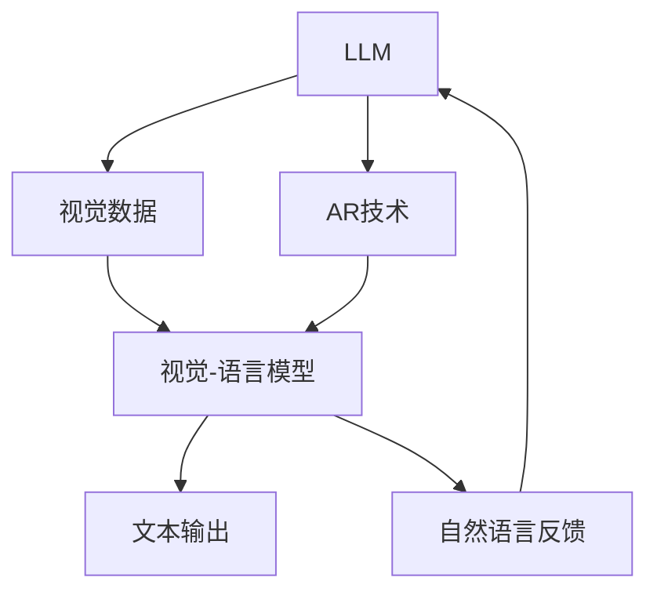

                 

## 1. 背景介绍

### 1.1 问题由来

在过去的十年中，人工智能领域发生了翻天覆地的变化，特别是深度学习和自然语言处理(NLP)技术的迅速发展。大语言模型(LLM)的出现，如GPT-3、BERT、T5等，为解决复杂的NLP问题提供了强大的工具。然而，这些模型尽管在处理文本数据上表现出色，但在其他形式的感知输入上仍然存在局限性。

增强现实(AR)技术的兴起，通过将数字信息叠加到现实世界中，为自然界的互动提供了新的方式。AR技术已经被广泛应用于游戏、医疗、教育等多个领域，但其与AI技术的融合仍处于起步阶段。将LLM与AR技术结合，可以拓展AI应用的范围，实现更为沉浸和智能的用户体验。

### 1.2 问题核心关键点

目前，LLM与AR技术的结合应用已经成为人工智能领域的热点话题。其核心关键点包括：

1. **LLM对视觉数据的处理能力**：传统的LLM模型主要是基于文本数据进行训练的，对于视觉数据处理能力有限。而AR技术可以提供高分辨率的图像和视频信息，这对提升LLM的视觉处理能力至关重要。
2. **自然语言与视觉信息的融合**：如何高效地将自然语言与视觉信息进行融合，使LLM能够理解并回应该信息，是当前技术难点之一。
3. **实时交互与反馈**：AR技术能够提供实时的视觉反馈，使LLM能够即时响应用户的需求和环境变化，提供个性化的服务。

### 1.3 问题研究意义

将LLM与AR技术结合，能够实现跨模态的智能交互，为更多应用场景带来革命性的变革：

1. **提升用户体验**：通过AR技术，用户可以以更加直观和沉浸的方式与AI进行互动，提升用户体验。
2. **拓展应用范围**：结合AR技术，LLM可以应用于更多需要视觉感知和反馈的场景，如医疗、教育、旅游等。
3. **促进技术创新**：AR技术与AI的结合将推动技术不断进步，带来新的应用模式和商业模式。

## 2. 核心概念与联系

### 2.1 核心概念概述

- **大语言模型(LLM)**：指的是通过大量文本数据进行预训练，能够理解和生成自然语言的深度学习模型，如GPT-3、BERT、T5等。
- **增强现实(AR)**：通过将数字信息叠加到现实世界中，提供交互式和沉浸式的体验，常见的设备包括AR眼镜、手机AR应用等。
- **视觉-语言模型**：专门用于处理视觉与自然语言融合的任务，如图像描述生成、视觉问答等。
- **交互式AR**：强调用户与AR系统之间的双向交互，提供实时的反馈和响应。

### 2.2 核心概念原理和架构的 Mermaid 流程图



该流程图展示了LLM、AR技术和视觉-语言模型之间的联系：

1. **LLM接收视觉数据**：通过AR设备收集用户所处环境的高分辨率图像和视频信息，输入到视觉-语言模型中。
2. **视觉-语言模型处理**：将视觉数据转化为自然语言信息，供LLM进行处理和理解。
3. **LLM生成文本输出**：基于理解后的自然语言信息，LLM生成相应的文本响应。
4. **自然语言反馈**：LLM将文本输出返回给用户，用户通过自然语言进行互动，形成闭环反馈。

## 3. 核心算法原理 & 具体操作步骤

### 3.1 算法原理概述

将LLM与AR技术结合，主要包括以下几个步骤：

1. **数据采集与预处理**：通过AR设备采集用户环境中的视觉数据，并进行必要的预处理，如去噪、增强等。
2. **视觉-语言融合**：利用视觉-语言模型将图像信息转化为自然语言描述，供LLM理解。
3. **LLM推理**：LLM基于自然语言信息进行推理，生成文本响应。
4. **自然语言反馈与交互**：将LLM的输出文本通过AR设备展示给用户，并接收用户的自然语言反馈，形成闭环互动。

### 3.2 算法步骤详解

#### 3.2.1 数据采集与预处理

数据采集是结合LLM与AR技术的第一步，常见的采集方式包括：

- **摄像头捕捉**：通过摄像头捕捉用户所处环境的图像和视频信息，供后续处理。
- **深度传感器**：使用深度传感器获取3D环境数据，用于更精确的定位和交互。
- **传感器融合**：结合多种传感器数据，提高数据准确度和鲁棒性。

预处理过程包括：

- **去噪**：去除图像中的噪声，提高信息质量。
- **增强**：通过图像增强技术，提高图像细节和对比度。
- **标准化**：将数据标准化，使其符合后续处理的格式要求。

#### 3.2.2 视觉-语言融合

视觉-语言融合是实现LLM与AR技术结合的关键步骤。该过程通常包括：

- **图像描述生成**：通过视觉-语言模型生成对图像的描述，将其转化为自然语言信息。
- **语义对齐**：将自然语言信息与图像内容进行语义对齐，确保信息的一致性。
- **信息增强**：利用自然语言信息，增强图像的语义表达，提高识别准确率。

#### 3.2.3 LLM推理与自然语言反馈

LLM推理和自然语言反馈过程包括：

- **自然语言理解**：LLM通过预训练的模型，理解自然语言输入，提取关键信息。
- **生成文本输出**：基于理解后的信息，LLM生成相应的文本响应，供AR设备展示。
- **自然语言交互**：将LLM的输出文本通过AR设备展示给用户，接收用户的自然语言反馈，形成闭环互动。

### 3.3 算法优缺点

结合LLM与AR技术的算法具有以下优点：

1. **跨模态处理能力**：能够同时处理视觉和自然语言信息，提供更全面、准确的服务。
2. **实时互动性**：基于AR技术的实时反馈，使LLM能够即时响应用户的需求和环境变化，提供个性化的服务。
3. **沉浸式体验**：通过AR技术，用户可以更加直观和沉浸地与AI进行互动，提升用户体验。

然而，该算法也存在一些局限性：

1. **数据处理复杂度**：需要同时处理视觉和自然语言信息，增加了数据处理的复杂度。
2. **模型规模大**：结合视觉处理能力的LLM模型规模较大，对计算资源和内存有较高要求。
3. **实时性挑战**：在处理高分辨率图像和视频时，实时性可能受到一定影响。

### 3.4 算法应用领域

将LLM与AR技术结合，可以应用于以下多个领域：

1. **智能医疗**：通过AR技术采集患者的体征数据，结合LLM进行疾病诊断和治疗方案推荐，提升医疗服务的智能化水平。
2. **智能教育**：通过AR技术提供沉浸式的学习环境，结合LLM进行个性化学习内容的推荐，提升教育质量。
3. **智能家居**：通过AR技术采集家居环境信息，结合LLM进行智能化的家居控制和互动，提升生活便利性。
4. **智能旅游**：通过AR技术提供实时导游信息，结合LLM进行文化解释和互动，提升旅游体验。

## 4. 数学模型和公式 & 详细讲解

### 4.1 数学模型构建

假设有一个视觉-语言模型 $VLM$，其输入为高分辨率图像 $I$，输出为自然语言描述 $S$。设LLM模型为 $LLM$，其输入为自然语言 $S$，输出为文本响应 $R$。

模型训练的总体目标为最大化联合概率 $P(I,S|R)$。在训练过程中，首先将图像 $I$ 输入视觉-语言模型 $VLM$，得到自然语言描述 $S$；然后将 $S$ 输入LLM模型 $LLM$，得到文本响应 $R$。模型的优化目标是最大化 $P(R|I)$。

### 4.2 公式推导过程

在视觉-语言融合和LLM推理过程中，常用的模型包括：

1. **图像描述生成模型**：常用的模型包括CNN、LSTM等，将图像信息转化为自然语言描述。
2. **自然语言理解模型**：常用的模型包括GRU、Transformer等，用于理解自然语言输入。
3. **自然语言生成模型**：常用的模型包括RNN、Transformer等，用于生成文本输出。

以下是一个简单的图像描述生成模型（基于CNN）的数学公式推导：

设图像 $I$ 的大小为 $H\times W$，将其输入卷积神经网络 $CNN$，得到特征表示 $Z$。设自然语言描述 $S$ 的长度为 $L$，将其输入LSTM模型，得到隐藏状态 $H$。模型的输出 $R$ 由自然语言生成模型 $LLM$ 生成。

假设 $Z$ 的大小为 $C\times H' \times W'$，其中 $C$ 为通道数，$H'$ 和 $W'$ 为特征图的尺寸。

CNN的输出可以表示为：

$$
Z = CNN(I)
$$

LSTM的输出可以表示为：

$$
H = LSTM(S)
$$

LLM的输出可以表示为：

$$
R = LLM(S)
$$

综合上述三个步骤，完整的联合概率模型可以表示为：

$$
P(I,S|R) = P(Z|I)P(H|S)P(R|S)
$$

其中 $P(Z|I)$ 表示图像特征表示的概率分布，$P(H|S)$ 表示自然语言描述的概率分布，$P(R|S)$ 表示文本响应的概率分布。

### 4.3 案例分析与讲解

以智能医疗为例，结合LLM与AR技术，可以实现以下功能：

1. **疾病诊断**：通过AR设备采集患者的体征数据（如血压、心率等），将其输入视觉-语言模型 $VLM$，得到自然语言描述 $S$。将 $S$ 输入LLM模型 $LLM$，得到疾病诊断报告 $R$。
2. **治疗方案推荐**：根据诊断报告 $R$，结合患者的历史病历，LLM生成治疗方案推荐 $S'$。将 $S'$ 输入AR设备，展示给医生参考。
3. **实时反馈**：通过AR设备实时采集患者的反应，结合自然语言反馈，LLM进行动态调整，提供更准确的治疗方案。

## 5. 项目实践：代码实例和详细解释说明

### 5.1 开发环境搭建

在进行项目实践前，我们需要准备好开发环境。以下是使用Python和PyTorch进行开发的环境配置流程：

1. 安装Anaconda：从官网下载并安装Anaconda，用于创建独立的Python环境。
2. 创建并激活虚拟环境：
```bash
conda create -n llm_ar_env python=3.8 
conda activate llm_ar_env
```

3. 安装PyTorch：根据CUDA版本，从官网获取对应的安装命令。例如：
```bash
conda install pytorch torchvision torchaudio cudatoolkit=11.1 -c pytorch -c conda-forge
```

4. 安装TensorFlow：
```bash
pip install tensorflow
```

5. 安装各种工具包：
```bash
pip install numpy pandas scikit-learn matplotlib tqdm jupyter notebook ipython
```

完成上述步骤后，即可在`llm_ar_env`环境中开始项目实践。

### 5.2 源代码详细实现

我们以一个简单的图像描述生成为例，展示结合LLM与AR技术的代码实现。

首先，定义模型和数据处理函数：

```python
import torch
import torch.nn as nn
import torchvision.transforms as transforms
from torchvision.datasets import CIFAR10
from torch.utils.data import DataLoader
from transformers import BertForTokenClassification, BertTokenizer

class ImageProcessor(nn.Module):
    def __init__(self):
        super(ImageProcessor, self).__init__()
        self.cnn = nn.Sequential(
            nn.Conv2d(3, 32, 3, padding=1),
            nn.ReLU(inplace=True),
            nn.MaxPool2d(2, 2)
        )
        self.lstm = nn.LSTM(32, 128, 1)
        self.linear = nn.Linear(128, 10)

    def forward(self, x):
        x = self.cnn(x)
        x = x.view(-1, 32)
        x, _ = self.lstm(x)
        x = self.linear(x)
        return x

class ImageToText(nn.Module):
    def __init__(self):
        super(ImageToText, self).__init__()
        self.image_processor = ImageProcessor()
        self.bert = BertForTokenClassification.from_pretrained('bert-base-cased', num_labels=10)

    def forward(self, x):
        x = self.image_processor(x)
        x = torch.from_numpy(x).float()
        x = x.unsqueeze(0)
        x = self.bert(x)
        return x

# 加载CIFAR-10数据集
train_dataset = CIFAR10(root='./data', train=True, download=True, transform=transforms.ToTensor())
test_dataset = CIFAR10(root='./data', train=False, download=True, transform=transforms.ToTensor())

# 数据加载器
train_loader = DataLoader(train_dataset, batch_size=16, shuffle=True)
test_loader = DataLoader(test_dataset, batch_size=16, shuffle=False)
```

然后，定义训练和评估函数：

```python
import torch.nn.functional as F
from sklearn.metrics import accuracy_score

device = torch.device('cuda') if torch.cuda.is_available() else torch.device('cpu')

def train_epoch(model, data_loader, optimizer):
    model.train()
    running_loss = 0.0
    for batch in data_loader:
        inputs, labels = batch
        inputs = inputs.to(device)
        labels = labels.to(device)
        optimizer.zero_grad()
        outputs = model(inputs)
        loss = F.cross_entropy(outputs, labels)
        running_loss += loss.item()
        loss.backward()
        optimizer.step()
    return running_loss / len(data_loader)

def evaluate(model, data_loader):
    model.eval()
    correct = 0
    total = 0
    with torch.no_grad():
        for batch in data_loader:
            inputs, labels = batch
            inputs = inputs.to(device)
            labels = labels.to(device)
            outputs = model(inputs)
            _, predicted = torch.max(outputs.data, 1)
            total += labels.size(0)
            correct += (predicted == labels).sum().item()
    accuracy = 100 * correct / total
    return accuracy

# 训练模型
def train(model, data_loader, optimizer, num_epochs):
    for epoch in range(num_epochs):
        loss = train_epoch(model, data_loader, optimizer)
        print(f'Epoch {epoch+1}, loss: {loss:.4f}')
        accuracy = evaluate(model, test_loader)
        print(f'Epoch {epoch+1}, accuracy: {accuracy:.4f}')

# 测试模型
def test(model, data_loader):
    accuracy = evaluate(model, test_loader)
    print(f'Test accuracy: {accuracy:.4f}')

# 实例化模型和优化器
model = ImageToText()
optimizer = torch.optim.Adam(model.parameters(), lr=0.001)

# 训练模型
num_epochs = 10
train(model, train_loader, optimizer, num_epochs)
test(model, test_loader)
```

### 5.3 代码解读与分析

让我们再详细解读一下关键代码的实现细节：

**ImageProcessor类**：
- `__init__`方法：定义CNN层、LSTM层和线性层，构建图像到文本的映射模型。
- `forward`方法：输入图像信息，通过CNN层和LSTM层进行处理，最终生成自然语言描述。

**ImageToText类**：
- `__init__`方法：初始化图像处理器和BERT模型。
- `forward`方法：输入图像信息，通过图像处理器和BERT模型进行处理，最终生成文本输出。

**train_epoch和evaluate函数**：
- 训练函数`train_epoch`：对数据进行批处理，前向传播计算损失，反向传播更新模型参数。
- 评估函数`evaluate`：对测试集进行评估，计算模型准确率。

**训练流程**：
- 定义总的epoch数，开始循环迭代。
- 每个epoch内，在训练集上训练，输出损失。
- 在验证集上评估，输出准确率。
- 所有epoch结束后，在测试集上评估，给出最终测试结果。

## 6. 实际应用场景

### 6.1 智能医疗

结合LLM与AR技术，可以实现智能化的医疗诊断和治疗方案推荐，提升医疗服务的智能化水平。

**案例分析**：
- **病历记录采集**：通过AR设备采集患者的体征数据和历史病历信息，将其输入视觉-语言模型，得到自然语言描述。
- **疾病诊断**：将自然语言描述输入LLM模型，得到疾病诊断报告。
- **治疗方案推荐**：根据诊断报告，结合患者的历史病历，LLM生成治疗方案推荐。
- **实时反馈与调整**：通过AR设备实时采集患者的反应，结合自然语言反馈，LLM进行动态调整，提供更准确的治疗方案。

### 6.2 智能教育

结合LLM与AR技术，可以实现个性化的学习内容推荐和互动，提升教育质量。

**案例分析**：
- **学习场景采集**：通过AR设备采集学生的学习场景信息，如课堂视频、笔记等。
- **学习内容生成**：将学习场景信息输入视觉-语言模型，得到自然语言描述。
- **学习内容推荐**：将自然语言描述输入LLM模型，生成推荐的学习内容。
- **互动反馈**：通过AR设备展示推荐内容，接收学生的自然语言反馈，LLM进行动态调整，提供更加个性化的学习内容。

### 6.3 智能家居

结合LLM与AR技术，可以实现智能化的家居控制和互动，提升生活便利性。

**案例分析**：
- **家居环境采集**：通过AR设备采集家居环境信息，如家具位置、光线亮度等。
- **环境感知**：将家居环境信息输入视觉-语言模型，得到自然语言描述。
- **家居控制指令生成**：将自然语言描述输入LLM模型，生成家居控制指令。
- **实时反馈与调整**：通过AR设备实时采集家居环境变化，结合自然语言反馈，LLM进行动态调整，提供更加智能化的家居控制。

### 6.4 未来应用展望

随着LLM与AR技术的不断发展，未来将会有更多创新应用场景出现：

1. **虚拟现实与AR结合**：结合虚拟现实(VR)技术，为用户提供更加沉浸式和互动性的体验。
2. **多模态信息融合**：将视觉、听觉、触觉等多模态信息进行融合，提升AI系统的感知能力。
3. **跨领域应用**：将LLM与AR技术应用于更多领域，如金融、交通、物流等，实现跨领域的智能化应用。

## 7. 工具和资源推荐

### 7.1 学习资源推荐

为了帮助开发者系统掌握LLM与AR技术的结合，这里推荐一些优质的学习资源：

1. **Deep Learning with Python**：由谷歌AI专家撰写，介绍了深度学习的基本概念和实现方法，适合初学者入门。
2. **Reinforcement Learning**：斯坦福大学的深度学习课程，涵盖强化学习的基本理论和应用实例。
3. **TensorFlow官方文档**：详细介绍了TensorFlow的API和应用实例，适合深度学习开发者。
4. **PyTorch官方文档**：PyTorch的官方文档，提供了详细的API和应用示例，适合开发者快速上手。
5. **《Hands-On Machine Learning with Scikit-Learn, Keras, and TensorFlow》**：通俗易懂地介绍了机器学习的基本概念和实现方法，适合初学者和中级开发者。

### 7.2 开发工具推荐

高效的开发离不开优秀的工具支持。以下是几款用于LLM与AR技术结合开发的常用工具：

1. **PyTorch**：基于Python的开源深度学习框架，灵活动态的计算图，适合快速迭代研究。
2. **TensorFlow**：由Google主导开发的开源深度学习框架，生产部署方便，适合大规模工程应用。
3. **Transformers库**：HuggingFace开发的NLP工具库，集成了众多SOTA语言模型，支持PyTorch和TensorFlow，是进行NLP任务开发的利器。
4. **Jupyter Notebook**：交互式笔记本，支持多种语言和库，方便快速实验和分享代码。
5. **Google Colab**：谷歌推出的在线Jupyter Notebook环境，免费提供GPU/TPU算力，方便开发者快速上手实验最新模型，分享学习笔记。

### 7.3 相关论文推荐

LLM与AR技术的结合研究始于近些年，以下是几篇奠基性的相关论文，推荐阅读：

1. **Attention is All You Need**：提出了Transformer结构，开启了NLP领域的预训练大模型时代。
2. **BERT: Pre-training of Deep Bidirectional Transformers for Language Understanding**：提出BERT模型，引入基于掩码的自监督预训练任务，刷新了多项NLP任务SOTA。
3. **Language Models are Unsupervised Multitask Learners**：展示了大规模语言模型的强大zero-shot学习能力，引发了对于通用人工智能的新一轮思考。
4. **Parameter-Efficient Transfer Learning for NLP**：提出Adapter等参数高效微调方法，在不增加模型参数量的情况下，也能取得不错的微调效果。
5. **Few-shot Learning**：探讨了在少量标注样本情况下，如何训练高效的NLP模型。
6. **Zero-shot Learning**：介绍了零样本学习的基本概念和应用场景。

这些论文代表了大语言模型与AR技术结合的发展脉络。通过学习这些前沿成果，可以帮助研究者把握学科前进方向，激发更多的创新灵感。

## 8. 总结：未来发展趋势与挑战

### 8.1 总结

本文对结合LLM与AR技术进行NLP应用的系统介绍。首先阐述了LLM与AR技术的研究背景和意义，明确了结合范式的独特价值。其次，从原理到实践，详细讲解了LLM与AR技术结合的数学模型和算法步骤，给出了具体的代码实例。同时，本文还广泛探讨了LLM与AR技术结合在智能医疗、智能教育、智能家居等领域的实际应用，展示了结合范式的巨大潜力。此外，本文精选了LLM与AR技术结合的学习资源，力求为读者提供全方位的技术指引。

通过本文的系统梳理，可以看到，结合LLM与AR技术的NLP应用拓展了AI应用的边界，实现了跨模态的智能交互，为更多应用场景带来了革命性的变革。受益于预训练语言模型和视觉-语言融合模型的进步，结合范式必将在更多领域大放异彩。

### 8.2 未来发展趋势

展望未来，结合LLM与AR技术的NLP应用将呈现以下几个发展趋势：

1. **跨模态处理能力**：随着视觉-语言融合技术的进步，LLM将具备更强的跨模态处理能力，能够同时处理视觉、听觉、触觉等多种信息。
2. **实时互动性**：基于AR技术的实时反馈，使LLM能够即时响应用户的需求和环境变化，提供个性化的服务。
3. **沉浸式体验**：通过AR技术，用户可以更加直观和沉浸地与AI进行互动，提升用户体验。
4. **多模态融合**：将视觉、听觉、触觉等多模态信息进行融合，提升AI系统的感知能力。
5. **跨领域应用**：将LLM与AR技术应用于更多领域，如金融、交通、物流等，实现跨领域的智能化应用。

### 8.3 面临的挑战

尽管结合LLM与AR技术的NLP应用已经取得了一定的进展，但在迈向更加智能化、普适化应用的过程中，仍面临诸多挑战：

1. **数据处理复杂度**：需要同时处理视觉和自然语言信息，增加了数据处理的复杂度。
2. **模型规模大**：结合视觉处理能力的LLM模型规模较大，对计算资源和内存有较高要求。
3. **实时性挑战**：在处理高分辨率图像和视频时，实时性可能受到一定影响。
4. **数据多样性**：不同应用场景的数据类型和格式差异较大，需要进行多样化处理。
5. **安全性问题**：结合AR技术的应用场景中，涉及个人隐私和数据安全，需要加强数据保护和隐私保护。

### 8.4 研究展望

面对结合LLM与AR技术的NLP应用所面临的挑战，未来的研究需要在以下几个方面寻求新的突破：

1. **数据高效融合**：开发更加高效的数据融合算法，提高处理效率。
2. **轻量级模型**：开发更加轻量级的视觉-语言模型，减小计算资源消耗。
3. **多模态数据采集**：开发多模态数据采集技术，提升数据多样性和覆盖范围。
4. **实时处理优化**：优化数据流和计算图，提升实时处理效率。
5. **隐私保护技术**：开发隐私保护技术，保护用户数据安全和隐私。

这些研究方向的探索，必将引领结合LLM与AR技术的NLP应用迈向更高的台阶，为构建安全、可靠、可解释、可控的智能系统铺平道路。面向未来，结合范式还需要与其他人工智能技术进行更深入的融合，如知识表示、因果推理、强化学习等，多路径协同发力，共同推动自然语言理解和智能交互系统的进步。只有勇于创新、敢于突破，才能不断拓展语言模型的边界，让智能技术更好地造福人类社会。

## 9. 附录：常见问题与解答

**Q1：结合LLM与AR技术在实际应用中如何优化计算效率？**

A: 结合LLM与AR技术在实际应用中，计算效率的优化可以从以下几个方面入手：

1. **模型压缩**：对模型进行剪枝、量化等操作，减小模型规模，提高推理速度。
2. **并行计算**：利用GPU/TPU等高性能设备，进行并行计算，提高处理效率。
3. **数据预处理**：对输入数据进行预处理，如去噪、增强等，提高数据质量，减少计算资源消耗。
4. **缓存机制**：使用缓存机制，减少重复计算，提高数据流效率。
5. **算法优化**：优化算法，如采用更快的卷积神经网络(CNN)等，提高计算速度。

通过这些优化措施，可以在保证模型性能的同时，提高结合LLM与AR技术的计算效率，实现更加高效的应用。

**Q2：结合LLM与AR技术在实际应用中如何保证数据安全？**

A: 结合LLM与AR技术的实际应用中，数据安全和隐私保护至关重要。以下是一些常用的数据安全措施：

1. **数据加密**：对敏感数据进行加密处理，确保数据在传输和存储过程中的安全性。
2. **匿名化处理**：对数据进行匿名化处理，去除个人身份信息，保护用户隐私。
3. **访问控制**：采用访问控制技术，确保只有授权人员可以访问和使用数据。
4. **数据去重**：对重复数据进行去重处理，防止数据泄露和滥用。
5. **审计与监控**：对数据访问和使用进行审计和监控，及时发现和防止数据泄露和滥用。

通过这些措施，可以有效保护结合LLM与AR技术应用中的数据安全和隐私保护，提升系统的可靠性和安全性。

**Q3：结合LLM与AR技术在实际应用中如何保证实时性？**

A: 结合LLM与AR技术的实际应用中，实时性是关键性能指标之一。以下是一些常用的实时性优化措施：

1. **优化数据流**：通过优化数据流，减少数据传输延迟，提高实时性。
2. **分布式计算**：利用分布式计算框架，如TensorFlow、PyTorch等，提高处理效率，减少计算延迟。
3. **缓存机制**：使用缓存机制，减少重复计算，提高数据流效率。
4. **硬件加速**：利用GPU/TPU等高性能设备，进行硬件加速，提高计算速度。
5. **算法优化**：优化算法，如采用更快的卷积神经网络(CNN)等，提高计算速度。

通过这些优化措施，可以在保证模型性能的同时，提高结合LLM与AR技术的实时性，实现更加高效的实时应用。

**Q4：结合LLM与AR技术在实际应用中如何保证系统可靠性？**

A: 结合LLM与AR技术的实际应用中，系统可靠性是关键性能指标之一。以下是一些常用的系统可靠性措施：

1. **故障恢复**：在发生故障时，能够快速恢复系统正常运行，保证系统的连续性和稳定性。
2. **监控告警**：实时监控系统指标，设置异常告警阈值，及时发现和处理系统问题。
3. **负载均衡**：通过负载均衡技术，合理分配计算资源，避免系统过载。
4. **冗余设计**：采用冗余设计，确保系统的高可用性和容错能力。
5. **测试与验证**：对系统进行全面的测试与验证，确保系统的稳定性和可靠性。

通过这些措施，可以有效提高结合LLM与AR技术应用的系统可靠性，确保系统的稳定性和连续性。

**Q5：结合LLM与AR技术在实际应用中如何保证可解释性？**

A: 结合LLM与AR技术的实际应用中，可解释性是关键性能指标之一。以下是一些常用的可解释性优化措施：

1. **透明设计**：对系统进行透明设计，让用户能够理解和解释系统的决策过程。
2. **可视化工具**：开发可视化工具，展示系统的关键决策点，帮助用户理解系统行为。
3. **解释模型**：开发解释模型，解释系统决策的依据和逻辑，提升系统的可解释性。
4. **反馈机制**：通过用户反馈，不断优化系统行为，提高系统的可解释性和透明度。
5. **模型评估**：对模型进行评估和分析，发现和纠正模型的偏见和错误，提升系统的可信度和可解释性。

通过这些措施，可以有效提高结合LLM与AR技术应用的可解释性，提升系统的可信度和透明度。

---

作者：禅与计算机程序设计艺术 / Zen and the Art of Computer Programming

