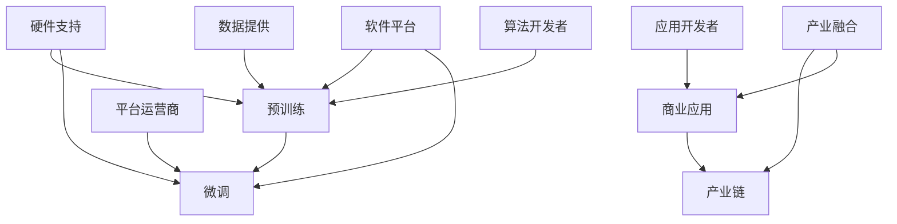

                 

# LLM产业链：AI领域新兴经济体系的形成

> 关键词：
大语言模型 (Large Language Model, LLM), 产业链, 人工智能 (AI), 产业融合, 深度学习, 预训练, 微调, 生态系统, 商业应用

## 1. 背景介绍

### 1.1 问题由来

人工智能（AI）领域正经历着前所未有的发展浪潮。从深度学习的兴起，到GPT-3等大语言模型（Large Language Models, LLMs）的出现，AI技术在自然语言处理（Natural Language Processing, NLP）、计算机视觉、语音识别等众多领域取得了突破性进展。这一系列技术的突破，不仅提升了人类生产力和创新能力，也为经济社会带来了深刻的变革。

LLMs作为当前AI领域的核心技术之一，以其强大的语言理解和生成能力，被广泛应用于智能客服、金融舆情、智能推荐等多个场景，极大地提高了各行各业的生产效率和服务质量。然而，LLMs技术的广泛应用背后，也形成了一个庞大的产业链。这个产业链不仅涵盖了数据采集、模型训练、微调、部署等多个环节，还涵盖了硬件、软件、平台等多方面技术，涉及众多企业和机构。本文将系统梳理LLMs产业链的形成背景及其各个环节的运作机制，为理解AI领域新兴经济体系提供参考。

### 1.2 问题核心关键点

大语言模型产业链的形成，得益于其在NLP领域的卓越表现。LLMs通过在大规模无标签文本语料上进行预训练，学习通用的语言表示，具备强大的语言理解和生成能力。预训练使得模型学习到了语言的基础知识，如语法规则、语义关系等，而在微调阶段，通过在特定任务上的少量标注数据进行有监督训练，使得模型能够进一步适应特定应用场景，优化输出结果。

产业链的形成，使得LLMs技术能够更加高效地转化为生产力。在产业链中，数据提供者、算法开发者、平台运营商、应用开发者、硬件制造商等各个环节，通过协同工作，将LLMs的潜力转化为实际应用，推动了AI技术在各行各业的深度渗透。

## 2. 核心概念与联系

### 2.1 核心概念概述

为了更好地理解LLMs产业链的形成背景，本节将介绍几个密切相关的核心概念：

- **大语言模型 (LLM)**：指通过在大规模无标签文本数据上进行预训练，学习通用的语言表示的模型。常见的LLM包括GPT系列、BERT、T5等。

- **预训练 (Pre-training)**：指在大规模无标签文本数据上，通过自监督学习任务训练通用语言模型的过程。预训练使得模型学习到了语言的基础知识和统计规律。

- **微调 (Fine-tuning)**：指在预训练模型的基础上，使用下游任务的少量标注数据，通过有监督学习优化模型在特定任务上的性能。微调使得通用模型更好地适应特定任务。

- **产业链 (Industrial Chain)**：指围绕LLMs技术的开发、应用和生态建设，形成的包括数据、算法、平台、应用等多个环节的企业和机构网络。

- **产业融合 (Industrial Integration)**：指AI技术与其他行业深度融合，推动产业升级和创新的过程。

- **深度学习 (Deep Learning)**：指使用深度神经网络进行数据特征提取和建模的技术。深度学习是LLMs技术的基础。

- **商业应用 (Commercial Application)**：指LLMs技术在各行各业的具体应用场景，如智能客服、金融舆情、智能推荐等。

- **硬件支持 (Hardware Support)**：指LLMs训练和应用所依赖的GPU、TPU等高性能计算设备。

- **软件平台 (Software Platform)**：指支持LLMs技术开发的编程语言、框架、工具等。

这些核心概念之间的逻辑关系可以通过以下Mermaid流程图来展示：



这个流程图展示了LLMs技术的各个环节及其之间的关系：

1. **预训练和微调**：LLMs技术的核心环节，通过预训练学习基础知识，通过微调适应特定任务。
2. **硬件支持**：高性能计算设备支持预训练和微调过程。
3. **软件平台**：提供编程语言、框架、工具等，支持LLMs技术的开发和应用。
4. **数据提供**：高质量的训练数据是预训练和微调的基础。
5. **算法开发者**：设计和实现LLMs的深度学习模型和优化算法。
6. **平台运营商**：提供平台和基础设施，支持LLMs技术的应用和运营。
7. **应用开发者**：将LLMs技术应用于具体业务场景，实现商业价值。
8. **商业应用**：LLMs技术在各行各业的实际应用，推动产业升级。
9. **产业融合**：AI技术与其他行业深度融合，带来新的经济增长点。
10. **产业链**：围绕LLMs技术形成的企业和机构网络。

## 3. 核心算法原理 & 具体操作步骤

### 3.1 算法原理概述

LLMs产业链的形成，依赖于其核心算法原理：预训练和微调。预训练使得模型学习到通用的语言知识，微调则使其能够适应特定任务。这一过程可以通过以下步骤实现：

1. **数据准备**：收集大规模无标签文本数据，如维基百科、新闻报道等。
2. **预训练**：在预训练阶段，使用自监督学习任务（如语言模型预测、掩码语言模型等）训练模型，使其学习到通用的语言知识。
3. **微调**：在微调阶段，使用下游任务的少量标注数据进行有监督学习，优化模型在特定任务上的性能。
4. **部署和应用**：将微调后的模型部署到实际应用中，提供服务或进行推理。

### 3.2 算法步骤详解

1. **数据准备**：
   - 收集大规模无标签文本数据，如维基百科、新闻报道、社交媒体等。
   - 使用数据清洗和预处理技术，如去除噪声、标准化文本格式等。
   - 将数据划分为训练集、验证集和测试集。

2. **预训练**：
   - 选择适合的深度学习框架，如TensorFlow、PyTorch等。
   - 定义预训练任务，如语言模型预测、掩码语言模型等。
   - 使用大规模分布式计算资源，进行预训练任务的训练。
   - 定期在验证集上评估模型性能，避免过拟合。
   - 保存预训练模型参数，作为微调的基础。

3. **微调**：
   - 根据具体任务需求，定义损失函数、优化器等。
   - 使用下游任务的少量标注数据进行有监督学习，优化模型参数。
   - 定期在验证集上评估模型性能，防止过拟合。
   - 保存微调后的模型参数，作为应用的基础。

4. **部署和应用**：
   - 将微调后的模型部署到实际应用中，提供服务或进行推理。
   - 定期收集新的数据，对模型进行重新微调，以适应数据分布的变化。

### 3.3 算法优缺点

**优点**：
- **高效性**：预训练和微调过程可以在大规模数据上高效训练，获得丰富的语言知识。
- **灵活性**：微调过程能够适应各种下游任务，提升模型在特定任务上的性能。
- **可解释性**：预训练和微调过程可解释性强，便于理解和调试。

**缺点**：
- **数据需求高**：预训练和微调需要大量数据，数据采集和预处理成本较高。
- **计算资源消耗大**：预训练和微调过程需要高性能计算资源，如GPU、TPU等。
- **过拟合风险**：微调过程中，如果数据量不足或标注质量低，容易发生过拟合。

### 3.4 算法应用领域

LLMs技术在NLP、语音识别、计算机视觉等多个领域得到了广泛应用。以下是几个典型应用领域：

- **NLP领域**：智能客服、金融舆情、智能推荐、问答系统等。
- **语音识别**：智能语音助手、自动语音识别等。
- **计算机视觉**：图像描述生成、视频内容理解、智能安防等。
- **多模态任务**：跨模态语义理解、视频语音同步等。

这些领域的应用，推动了LLMs技术的广泛部署和产业化进程，为经济社会带来了深刻的变革。

## 4. 数学模型和公式 & 详细讲解 & 举例说明

### 4.1 数学模型构建

为了更好地理解LLMs预训练和微调的过程，本节将从数学角度进行详细讲解。

假设预训练语言模型为 $M_{\theta}$，其中 $\theta$ 为模型参数。预训练任务为掩码语言模型，目标是在输入 $x$ 的某些位置随机插入特殊标记 $[M]$，然后预测这些标记位置应填充的词汇。在微调任务中，假设任务为分类任务，目标是从输入 $x$ 中提取特征 $h(x)$，并将其映射到类别 $y$。

数学模型构建如下：

1. **预训练模型**：
   - 输入 $x$ 经过嵌入层，得到嵌入表示 $x_e$。
   - 嵌入表示 $x_e$ 通过多层自注意力机制和前馈神经网络，得到隐藏表示 $h(x)$。
   - 隐藏表示 $h(x)$ 经过全连接层，输出掩码语言模型的预测结果。

   $$
   h(x) = M_{\theta}(x_e)
   $$

2. **微调模型**：
   - 输入 $x$ 经过嵌入层，得到嵌入表示 $x_e$。
   - 嵌入表示 $x_e$ 通过多层自注意力机制和前馈神经网络，得到隐藏表示 $h(x)$。
   - 隐藏表示 $h(x)$ 经过线性层和激活函数，得到分类结果 $y$。

   $$
   y = M_{\theta}(x_e) \cdot W_1 + b_1
   $$

其中 $W_1$ 和 $b_1$ 为线性层和激活函数的参数。

### 4.2 公式推导过程

**预训练任务**：
- 对于掩码语言模型，假设在输入 $x$ 的某个位置随机插入特殊标记 $[M]$，目标是在掩码位置预测应填充的词汇。
- 在预测时，模型需要先识别掩码位置，再预测应填充的词汇。

   $$
   \max_{m \in [1, n]} P(y|M_{\theta}(x))
   $$

其中 $y$ 为应填充的词汇，$n$ 为输入长度。

**微调任务**：
- 对于分类任务，目标是从输入 $x$ 中提取特征 $h(x)$，并将其映射到类别 $y$。
- 在训练时，使用交叉熵损失函数，最小化预测结果和真实标签的差异。

   $$
   L(y, M_{\theta}(x)) = -\sum_{i=1}^N y_i \log M_{\theta}(x)_i
   $$

其中 $y_i$ 为真实标签，$N$ 为样本数量。

### 4.3 案例分析与讲解

以BERT模型为例，分析其在新闻分类任务上的微调过程：

1. **数据准备**：
   - 收集新闻数据集，将其分为训练集、验证集和测试集。
   - 对数据进行文本清洗和预处理，如去除噪声、标准化文本格式等。

2. **预训练模型**：
   - 使用BERT模型在预训练数据上进行预训练，学习通用的语言表示。
   - 定期在验证集上评估模型性能，避免过拟合。
   - 保存预训练模型参数，作为微调的基础。

3. **微调模型**：
   - 定义新闻分类任务，使用分类损失函数，最小化预测结果和真实标签的差异。
   - 使用训练集数据进行微调，优化模型在新闻分类任务上的性能。
   - 定期在验证集上评估模型性能，防止过拟合。
   - 保存微调后的模型参数，作为应用的基础。

4. **部署和应用**：
   - 将微调后的BERT模型部署到实际应用中，提供新闻分类的服务。
   - 定期收集新的新闻数据，对模型进行重新微调，以适应数据分布的变化。

## 5. 项目实践：代码实例和详细解释说明

### 5.1 开发环境搭建

在进行LLMs微调实践前，我们需要准备好开发环境。以下是使用Python进行PyTorch开发的环境配置流程：

1. 安装Anaconda：从官网下载并安装Anaconda，用于创建独立的Python环境。

   ```bash
   conda create -n pytorch-env python=3.8 
   conda activate pytorch-env
   ```

2. 安装PyTorch：根据CUDA版本，从官网获取对应的安装命令。例如：

   ```bash
   conda install pytorch torchvision torchaudio cudatoolkit=11.1 -c pytorch -c conda-forge
   ```

3. 安装Transformers库：

   ```bash
   pip install transformers
   ```

4. 安装各类工具包：

   ```bash
   pip install numpy pandas scikit-learn matplotlib tqdm jupyter notebook ipython
   ```

完成上述步骤后，即可在`pytorch-env`环境中开始微调实践。

### 5.2 源代码详细实现

下面我们以BERT模型进行新闻分类任务为例，给出使用Transformers库进行微调的PyTorch代码实现。

首先，定义新闻分类任务的数据处理函数：

```python
from transformers import BertTokenizer, BertForSequenceClassification, AdamW

tokenizer = BertTokenizer.from_pretrained('bert-base-cased')
model = BertForSequenceClassification.from_pretrained('bert-base-cased', num_labels=2)

def convert_to_ids(text):
    return tokenizer.encode(text, add_special_tokens=True, max_length=128, padding='max_length', truncation=True)

def process_data(text, label):
    input_ids = convert_to_ids(text)
    attention_mask = [1] * len(input_ids)
    return {'input_ids': input_ids, 'attention_mask': attention_mask, 'labels': [label]}

# 加载数据集
train_data = [process_data(text, label) for text, label in train_data]
dev_data = [process_data(text, label) for text, label in dev_data]
test_data = [process_data(text, label) for text, label in test_data]
```

然后，定义训练和评估函数：

```python
from torch.utils.data import DataLoader
from tqdm import tqdm
from sklearn.metrics import accuracy_score

device = torch.device('cuda') if torch.cuda.is_available() else torch.device('cpu')
model.to(device)

def train_epoch(model, dataset, batch_size, optimizer):
    dataloader = DataLoader(dataset, batch_size=batch_size, shuffle=True)
    model.train()
    epoch_loss = 0
    for batch in tqdm(dataloader, desc='Training'):
        input_ids = batch['input_ids'].to(device)
        attention_mask = batch['attention_mask'].to(device)
        labels = batch['labels'].to(device)
        model.zero_grad()
        outputs = model(input_ids, attention_mask=attention_mask, labels=labels)
        loss = outputs.loss
        epoch_loss += loss.item()
        loss.backward()
        optimizer.step()
    return epoch_loss / len(dataloader)

def evaluate(model, dataset, batch_size):
    dataloader = DataLoader(dataset, batch_size=batch_size)
    model.eval()
    preds, labels = [], []
    with torch.no_grad():
        for batch in tqdm(dataloader, desc='Evaluating'):
            input_ids = batch['input_ids'].to(device)
            attention_mask = batch['attention_mask'].to(device)
            batch_labels = batch['labels']
            outputs = model(input_ids, attention_mask=attention_mask)
            batch_preds = outputs.predictions.argmax(dim=1).to('cpu').tolist()
            batch_labels = batch_labels.to('cpu').tolist()
            for pred, label in zip(batch_preds, batch_labels):
                preds.append(pred)
                labels.append(label)
    return accuracy_score(labels, preds)

# 训练和评估模型
epochs = 5
batch_size = 16
learning_rate = 2e-5

optimizer = AdamW(model.parameters(), lr=learning_rate)
for epoch in range(epochs):
    loss = train_epoch(model, train_data, batch_size, optimizer)
    print(f'Epoch {epoch+1}, train loss: {loss:.3f}')
    
    print(f'Epoch {epoch+1}, dev accuracy: {evaluate(model, dev_data, batch_size)}')
    
print(f'Test accuracy: {evaluate(model, test_data, batch_size)}')
```

以上就是使用PyTorch对BERT进行新闻分类任务微调的完整代码实现。可以看到，得益于Transformers库的强大封装，我们可以用相对简洁的代码完成BERT模型的加载和微调。

### 5.3 代码解读与分析

让我们再详细解读一下关键代码的实现细节：

**convert_to_ids函数**：
- 将文本输入转换为BERT模型所需的token ids，并做定长padding。

**process_data函数**：
- 将文本和标签转换为模型所需的输入格式。

**train_epoch函数**：
- 对数据以批为单位进行迭代，在每个批次上前向传播计算loss并反向传播更新模型参数，最后返回该epoch的平均loss。

**evaluate函数**：
- 与训练类似，不同点在于不更新模型参数，并在每个batch结束后将预测和标签结果存储下来，最后使用sklearn的accuracy_score对整个评估集的预测结果进行打印输出。

**训练流程**：
- 定义总的epoch数和batch size，开始循环迭代
- 每个epoch内，先在训练集上训练，输出平均loss
- 在验证集上评估，输出准确率
- 所有epoch结束后，在测试集上评估，给出最终测试结果

可以看到，PyTorch配合Transformers库使得BERT微调的代码实现变得简洁高效。开发者可以将更多精力放在数据处理、模型改进等高层逻辑上，而不必过多关注底层的实现细节。

当然，工业级的系统实现还需考虑更多因素，如模型的保存和部署、超参数的自动搜索、更灵活的任务适配层等。但核心的微调范式基本与此类似。

## 6. 实际应用场景

### 6.1 智能客服系统

基于大语言模型微调的对话技术，可以广泛应用于智能客服系统的构建。传统客服往往需要配备大量人力，高峰期响应缓慢，且一致性和专业性难以保证。而使用微调后的对话模型，可以7x24小时不间断服务，快速响应客户咨询，用自然流畅的语言解答各类常见问题。

在技术实现上，可以收集企业内部的历史客服对话记录，将问题和最佳答复构建成监督数据，在此基础上对预训练对话模型进行微调。微调后的对话模型能够自动理解用户意图，匹配最合适的答案模板进行回复。对于客户提出的新问题，还可以接入检索系统实时搜索相关内容，动态组织生成回答。如此构建的智能客服系统，能大幅提升客户咨询体验和问题解决效率。

### 6.2 金融舆情监测

金融机构需要实时监测市场舆论动向，以便及时应对负面信息传播，规避金融风险。传统的人工监测方式成本高、效率低，难以应对网络时代海量信息爆发的挑战。基于大语言模型微调的文本分类和情感分析技术，为金融舆情监测提供了新的解决方案。

具体而言，可以收集金融领域相关的新闻、报道、评论等文本数据，并对其进行主题标注和情感标注。在此基础上对预训练语言模型进行微调，使其能够自动判断文本属于何种主题，情感倾向是正面、中性还是负面。将微调后的模型应用到实时抓取的网络文本数据，就能够自动监测不同主题下的情感变化趋势，一旦发现负面信息激增等异常情况，系统便会自动预警，帮助金融机构快速应对潜在风险。

### 6.3 个性化推荐系统

当前的推荐系统往往只依赖用户的历史行为数据进行物品推荐，无法深入理解用户的真实兴趣偏好。基于大语言模型微调技术，个性化推荐系统可以更好地挖掘用户行为背后的语义信息，从而提供更精准、多样的推荐内容。

在实践中，可以收集用户浏览、点击、评论、分享等行为数据，提取和用户交互的物品标题、描述、标签等文本内容。将文本内容作为模型输入，用户的后续行为（如是否点击、购买等）作为监督信号，在此基础上微调预训练语言模型。微调后的模型能够从文本内容中准确把握用户的兴趣点。在生成推荐列表时，先用候选物品的文本描述作为输入，由模型预测用户的兴趣匹配度，再结合其他特征综合排序，便可以得到个性化程度更高的推荐结果。

### 6.4 未来应用展望

随着大语言模型微调技术的发展，其在更多领域的应用前景值得期待：

- **医疗领域**：基于大语言模型的医疗问答、病历分析、药物研发等应用，将提升医疗服务的智能化水平，辅助医生诊疗，加速新药开发进程。
- **教育领域**：微调技术可应用于作业批改、学情分析、知识推荐等方面，因材施教，促进教育公平，提高教学质量。
- **城市治理**：微调模型可应用于城市事件监测、舆情分析、应急指挥等环节，提高城市管理的自动化和智能化水平，构建更安全、高效的未来城市。
- **智慧农业**：微调模型可应用于智能灌溉、病虫害预测、农作物生长监测等，提升农业生产效率和质量。

以上应用场景展示了LLMs技术的广阔前景，未来随着技术进步，更多垂直行业的智能化解决方案将得以实现。

## 7. 工具和资源推荐

### 7.1 学习资源推荐

为了帮助开发者系统掌握LLMs技术的理论基础和实践技巧，这里推荐一些优质的学习资源：

1. **《深度学习》课程**：斯坦福大学开设的NLP明星课程，有Lecture视频和配套作业，带你入门NLP领域的基本概念和经典模型。
2. **Transformers官方文档**：提供海量预训练模型和完整的微调样例代码，是上手实践的必备资料。
3. **《自然语言处理》书籍**：涵盖NLP领域的经典算法、技术，适合系统学习NLP基础知识。
4. **Kaggle竞赛**：通过实际项目训练，提升解决NLP问题的能力。
5. **GitHub开源项目**：参与开源项目，学习和贡献LLMs技术的实践经验。

通过对这些资源的学习实践，相信你一定能够快速掌握LLMs技术的精髓，并用于解决实际的NLP问题。

### 7.2 开发工具推荐

高效的开发离不开优秀的工具支持。以下是几款用于LLMs微调开发的常用工具：

1. **PyTorch**：基于Python的开源深度学习框架，灵活动态的计算图，适合快速迭代研究。大部分预训练语言模型都有PyTorch版本的实现。
2. **TensorFlow**：由Google主导开发的开源深度学习框架，生产部署方便，适合大规模工程应用。同样有丰富的预训练语言模型资源。
3. **Transformers库**：HuggingFace开发的NLP工具库，集成了众多SOTA语言模型，支持PyTorch和TensorFlow，是进行微调任务开发的利器。
4. **Weights & Biases**：模型训练的实验跟踪工具，可以记录和可视化模型训练过程中的各项指标，方便对比和调优。与主流深度学习框架无缝集成。
5. **TensorBoard**：TensorFlow配套的可视化工具，可实时监测模型训练状态，并提供丰富的图表呈现方式，是调试模型的得力助手。
6. **Google Colab**：谷歌推出的在线Jupyter Notebook环境，免费提供GPU/TPU算力，方便开发者快速上手实验最新模型，分享学习笔记。

合理利用这些工具，可以显著提升LLMs微调任务的开发效率，加快创新迭代的步伐。

### 7.3 相关论文推荐

大语言模型和微调技术的发展源于学界的持续研究。以下是几篇奠基性的相关论文，推荐阅读：

1. **Attention is All You Need**：提出了Transformer结构，开启了NLP领域的预训练大模型时代。
2. **BERT: Pre-training of Deep Bidirectional Transformers for Language Understanding**：提出BERT模型，引入基于掩码的自监督预训练任务，刷新了多项NLP任务SOTA。
3. **GPT-3**：展示了大规模语言模型的强大zero-shot学习能力，引发了对于通用人工智能的新一轮思考。
4. **Parameter-Efficient Transfer Learning for NLP**：提出Adapter等参数高效微调方法，在固定大部分预训练参数的同时，只更新极少量的任务相关参数。
5. **LoRA: Low-Rank Adaptation of Transformers**：提出LoRA方法，将预训练权重映射到低秩矩阵中，实现了参数高效的微调。
6. **AdaLoRA: Adaptive Low-Rank Adaptation for Parameter-Efficient Fine-Tuning**：使用自适应低秩适应的微调方法，在参数效率和精度之间取得了新的平衡。

这些论文代表了大语言模型微调技术的发展脉络。通过学习这些前沿成果，可以帮助研究者把握学科前进方向，激发更多的创新灵感。

## 8. 总结：未来发展趋势与挑战

### 8.1 研究成果总结

本文对基于大语言模型的LLMs产业链进行了系统梳理，明确了产业链各环节的运作机制，展示了LLMs技术在多个领域的实际应用。通过梳理，可以看到LLMs技术通过预训练和微调过程，逐步从研究走向产业化，并广泛应用于各行各业，带来了显著的经济和社会效益。

### 8.2 未来发展趋势

未来，LLMs产业链将呈现以下几个发展趋势：

1. **技术进步**：预训练和微调算法不断改进，模型参数量不断增大，性能逐步提升。
2. **产业融合**：LLMs技术与其他行业深度融合，推动产业升级和创新。
3. **数据质量**：数据采集和处理技术不断提升，数据质量逐步改善。
4. **算法优化**：预训练和微调算法进一步优化，效率和性能提升。
5. **应用扩展**：LLMs技术在更多垂直领域得到应用，推动行业变革。
6. **伦理和规范**：LLMs技术应用过程中，需要考虑伦理和规范问题，确保技术的正向价值。

### 8.3 面临的挑战

尽管LLMs技术已经取得了瞩目成就，但在迈向更加智能化、普适化应用的过程中，仍面临诸多挑战：

1. **数据需求**：预训练和微调需要大量高质量数据，数据采集和处理成本较高。
2. **计算资源**：预训练和微调过程需要高性能计算资源，如GPU、TPU等。
3. **过拟合风险**：微调过程中，如果数据量不足或标注质量低，容易发生过拟合。
4. **模型复杂性**：超大模型带来的复杂性，需要更有效的算法和工具进行优化。
5. **应用落地**：将LLMs技术转化为实际应用，仍需考虑模型的裁剪、部署、优化等问题。

### 8.4 研究展望

面对LLMs技术面临的挑战，未来的研究需要在以下几个方面寻求新的突破：

1. **数据增强**：利用数据增强技术，提升数据质量和多样性。
2. **算法优化**：开发更高效的预训练和微调算法，提升模型性能和效率。
3. **硬件优化**：研究高效的硬件架构，提升模型训练和推理的性能和能效。
4. **模型压缩**：研究模型压缩技术，提升模型压缩率和推理效率。
5. **应用拓展**：将LLMs技术应用于更多垂直领域，推动产业升级。
6. **伦理和规范**：研究和制定LLMs技术的伦理和规范标准，确保技术的正向价值。

总之，LLMs技术需要在数据、算法、硬件、伦理等多个方面进行深入研究，才能更好地服务于社会和产业的发展。面向未来，LLMs技术必将不断进步，带来更多创新和价值。

## 9. 附录：常见问题与解答

**Q1：大语言模型微调是否适用于所有NLP任务？**

A: 大语言模型微调在大多数NLP任务上都能取得不错的效果，特别是对于数据量较小的任务。但对于一些特定领域的任务，如医学、法律等，仅仅依靠通用语料预训练的模型可能难以很好地适应。此时需要在特定领域语料上进一步预训练，再进行微调，才能获得理想效果。此外，对于一些需要时效性、个性化很强的任务，如对话、推荐等，微调方法也需要针对性的改进优化。

**Q2：微调过程中如何选择合适的学习率？**

A: 微调的学习率一般要比预训练时小1-2个数量级，如果使用过大的学习率，容易破坏预训练权重，导致过拟合。一般建议从1e-5开始调参，逐步减小学习率，直至收敛。也可以使用warmup策略，在开始阶段使用较小的学习率，再逐渐过渡到预设值。需要注意的是，不同的优化器(如AdamW、Adafactor等)以及不同的学习率调度策略，可能需要设置不同的学习率阈值。

**Q3：采用大模型微调时会面临哪些资源瓶颈？**

A: 目前主流的预训练大模型动辄以亿计的参数规模，对算力、内存、存储都提出了很高的要求。GPU/TPU等高性能设备是必不可少的，但即便如此，超大批次的训练和推理也可能遇到显存不足的问题。因此需要采用一些资源优化技术，如梯度积累、混合精度训练、模型并行等，来突破硬件瓶颈。同时，模型的存储和读取也可能占用大量时间和空间，需要采用模型压缩、稀疏化存储等方法进行优化。

**Q4：如何缓解微调过程中的过拟合问题？**

A: 过拟合是微调面临的主要挑战，尤其是在标注数据不足的情况下。常见的缓解策略包括：

- 数据增强：通过回译、近义替换等方式扩充训练集。
- 正则化：使用L2正则、Dropout、Early Stopping等避免过拟合。
- 对抗训练：引入对抗样本，提高模型鲁棒性。
- 参数高效微调：只调整少量参数(如Adapter、Prefix等)，减小过拟合风险。
- 多模型集成：训练多个微调模型，取平均输出，抑制过拟合。

这些策略往往需要根据具体任务和数据特点进行灵活组合。只有在数据、模型、训练、推理等各环节进行全面优化，才能最大限度地发挥大模型微调的威力。

**Q5：微调模型在落地部署时需要注意哪些问题？**

A: 将微调模型转化为实际应用，还需要考虑以下因素：

- 模型裁剪：去除不必要的层和参数，减小模型尺寸，加快推理速度。
- 量化加速：将浮点模型转为定点模型，压缩存储空间，提高计算效率。
- 服务化封装：将模型封装为标准化服务接口，便于集成调用。
- 弹性伸缩：根据请求流量动态调整资源配置，平衡服务质量和成本。
- 监控告警：实时采集系统指标，设置异常告警阈值，确保服务稳定性。
- 安全防护：采用访问鉴权、数据脱敏等措施，保障数据和模型安全。

总之，微调模型需要从数据、算法、工程、业务等多个维度进行深入研究，才能真正实现人工智能技术在垂直行业的规模化落地。面向未来，微调技术还需要与其他人工智能技术进行更深入的融合，如知识表示、因果推理、强化学习等，多路径协同发力，共同推动自然语言理解和智能交互系统的进步。只有勇于创新、敢于突破，才能不断拓展语言模型的边界，让智能技术更好地造福人类社会。

---

作者：禅与计算机程序设计艺术 / Zen and the Art of Computer Programming

