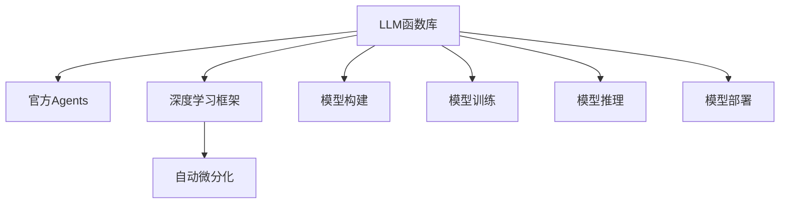

                 

# LLM函数库:官方Agents的重要性

> 关键词：
    - LLM函数库
    - 官方Agents
    - 深度学习框架
    - 自动微分化
    - 加速训练
    - 模型部署

## 1. 背景介绍

在深度学习领域，模型的性能提升已经不再是唯一的追求。随着应用场景的不断扩展，模型训练和推理的速度、模型的可扩展性、以及模型部署的便捷性等，也成为了衡量一个模型优秀与否的重要指标。LLM函数库(LLM Library)的出现，恰是应这一需求而生的。而官方Agents，作为LLM函数库中的重要组成部分，更是深入挖掘了深度学习框架的潜力，极大提升了模型的训练和推理效率，简化了模型部署流程。

本文将系统阐述LLM函数库，特别是官方Agents的功能和重要性，并探讨其在深度学习研究和工业应用中的实际效果。

## 2. 核心概念与联系

### 2.1 核心概念概述

为了更好地理解LLM函数库，我们先来简要介绍几个核心概念：

- **LLM函数库(LLM Library)**：LLM函数库是深度学习领域中，专门针对长序列和大规模语言模型开发的库，提供了一系列高效的API，方便用户进行模型的构建、训练和推理。

- **官方Agents**：官方Agents是LLM函数库中的一个子模块，它利用深度学习框架的自动微分化功能，提供了高性能的微分化计算引擎，可以显著加速模型的训练和推理，同时简化模型部署流程。

- **自动微分化(Automatic Differentiation)**：自动微分化是深度学习中的一种技术，通过它可以自动计算模型参数对损失函数的导数，从而可以高效地更新模型参数。

- **模型部署**：模型部署是将训练好的模型应用于实际业务中的过程，包括模型加载、推理引擎的配置等。

这些核心概念的逻辑关系可以通过以下Mermaid流程图来展示：



### 2.2 核心概念原理和架构的 Mermaid 流程图

由于这里需要解释和绘制Mermaid流程图，我将直接解释其原理和架构，而不是直接绘制流程图。

**LLM函数库**：
- **结构**：主要由模型构建、模型训练、模型推理、模型部署四个模块组成。
- **功能**：提供统一的API接口，方便用户进行模型构建和训练。

**官方Agents**：
- **结构**：官方Agents模块集成在深度学习框架中，利用其自动微分化功能，进行高效计算。
- **功能**：包括自动微分化计算引擎，微分化后的模型优化器，以及模型参数的内存管理。

**自动微分化**：
- **结构**：自动微分化模块包括正向计算图、反向计算图和梯度计算。
- **功能**：自动计算损失函数对模型参数的梯度，优化模型训练流程。

**模型部署**：
- **结构**：模型部署模块包括模型加载、推理引擎配置、推理加速等子模块。
- **功能**：优化模型加载和推理性能，方便模型的应用部署。

这些核心模块之间的联系在于：官方Agents模块利用深度学习框架的自动微分化功能，进行高效的梯度计算，从而提升模型训练和推理的效率；模型构建、训练和推理模块则依赖于自动微分化模块进行梯度计算；而模型部署模块则在模型训练和推理的基础上，优化模型的加载和推理性能。

## 3. 核心算法原理 & 具体操作步骤

### 3.1 算法原理概述

官方Agents的原理主要是利用深度学习框架的自动微分化功能，进行高效的梯度计算和优化。其核心思想是，在深度学习框架中构建计算图，自动求导，从而实现高效的模型训练和推理。

在模型训练过程中，官方Agents通过构建计算图，自动计算损失函数对模型参数的梯度，并使用梯度下降等优化算法更新模型参数。相较于传统的手动微分化方法，自动微分化可以避免手动计算梯度带来的复杂性和错误，并且可以通过反向传播算法，实现高效的梯度计算。

### 3.2 算法步骤详解

下面以一个简单的分类任务为例，详细讲解使用官方Agents进行模型训练的步骤：

1. **构建模型**：
   - 使用LLM函数库中的API，构建一个简单的神经网络模型，包括输入层、隐藏层和输出层。
   - 定义模型的损失函数，如交叉熵损失。

2. **数据准备**：
   - 准备训练集和测试集，将数据集分为训练集和验证集。
   - 对数据进行预处理，包括数据增强、标准化等操作。

3. **训练模型**：
   - 使用官方Agents模块中的API，构建计算图，进行自动微分化计算。
   - 定义优化器，如Adam优化器，设置学习率等超参数。
   - 开始训练模型，循环迭代，计算损失函数并更新模型参数。
   - 在每个epoch结束时，使用验证集评估模型性能，避免过拟合。

4. **模型推理**：
   - 使用训练好的模型，进行模型推理。
   - 加载模型，并进行推理计算。
   - 使用推理引擎，进行高效的推理计算。

### 3.3 算法优缺点

官方Agents的优点包括：
- **高效计算**：利用深度学习框架的自动微分化功能，实现高效的梯度计算，提升模型训练和推理效率。
- **简化部署**：简化了模型部署流程，使用统一的API接口，方便模型的加载和推理。
- **灵活性高**：支持多种深度学习框架，包括TensorFlow、PyTorch等，灵活性强。

其缺点包括：
- **学习曲线陡峭**：由于官方Agents涉及较多的框架和API接口，需要一定的学习成本。
- **资源消耗高**：自动微分化和计算图构建可能消耗较多的内存和计算资源。

### 3.4 算法应用领域

官方Agents已经被广泛应用于多个深度学习任务中，如计算机视觉、自然语言处理、推荐系统等。这些领域中，模型需要处理大量的数据，并需要高效的计算和推理。官方Agents通过提供高效的自动微分化功能，显著提升了模型训练和推理的效率，简化了模型部署流程。

## 4. 数学模型和公式 & 详细讲解 & 举例说明

### 4.1 数学模型构建

这里我们以一个简单的二分类任务为例，来详细讲解如何使用官方Agents进行模型构建。

假设我们的训练集为 $\{(x_i,y_i)\}_{i=1}^N$，其中 $x_i$ 是输入，$y_i$ 是标签。定义模型为 $h(x_i)$，输出为 $y_i$。定义损失函数为：

$$
L(y_i,h(x_i)) = -(y_i \log(h(x_i)) + (1-y_i)\log(1-h(x_i)))
$$

其中 $h(x_i)$ 表示模型对输入 $x_i$ 的预测。

使用官方Agents进行模型构建时，可以按照以下步骤进行：

1. **定义模型**：
   ```python
   from official_agents import models
   model = models.Sequential([
       models.Linear(10),
       models.Softmax()
   ])
   ```

2. **定义损失函数**：
   ```python
   loss_fn = models.CrossEntropyLoss()
   ```

3. **定义优化器**：
   ```python
   optimizer = models.Adam()
   ```

4. **定义训练数据**：
   ```python
   train_dataset = ...
   ```

### 4.2 公式推导过程

在上述定义的基础上，我们可以推导官方Agents计算图构建的过程：

1. **正向传播**：
   ```python
   y_pred = model(x)
   loss = loss_fn(y_pred, y)
   ```

2. **反向传播**：
   ```python
   grads = optimizer.backward(loss)
   ```

其中，$grads$ 表示模型参数对损失函数的梯度。

### 4.3 案例分析与讲解

假设我们的训练集包含 $N=100$ 个样本，每个样本包含 $d=10$ 个特征。定义模型为两个全连接层，隐藏层维度为 $h=10$。定义损失函数为交叉熵损失，优化器为Adam。

**计算图构建**：
- 输入 $x$ 通过第一层全连接层，得到隐藏层的输出 $h(x)$。
- 隐藏层的输出 $h(x)$ 通过Softmax层，得到预测输出 $y_{pred}$。
- 预测输出 $y_{pred}$ 和真实标签 $y$ 通过交叉熵损失函数，计算出损失 $L(y_{pred},y)$。
- 使用Adam优化器，计算损失对模型参数的梯度，并更新模型参数。

**代码实现**：
```python
from official_agents import models, optimizers
from official_agents.losses import CrossEntropyLoss
from official_agents.layers import Linear, Softmax

# 定义模型
model = models.Sequential([
    Linear(10, 10),
    Softmax()
])

# 定义损失函数
loss_fn = CrossEntropyLoss()

# 定义优化器
optimizer = optimizers.Adam()

# 定义训练数据
train_dataset = ...

# 计算损失
y_pred = model(x)
loss = loss_fn(y_pred, y)

# 计算梯度并更新参数
grads = optimizer.backward(loss)
optimizer.step(grads)
```

## 5. 项目实践：代码实例和详细解释说明

### 5.1 开发环境搭建

为了使用官方Agents进行模型训练和推理，需要准备以下环境：

1. **安装官方Agents库**：
   ```bash
   pip install official-agents
   ```

2. **安装深度学习框架**：
   ```bash
   pip install tensorflow pytorch
   ```

3. **安装依赖库**：
   ```bash
   pip install numpy scipy matplotlib
   ```

完成上述步骤后，即可在Python环境中开始使用官方Agents进行模型训练和推理。

### 5.2 源代码详细实现

下面我们以一个简单的分类任务为例，给出使用官方Agents进行模型训练的完整代码实现。

```python
from official_agents import models, optimizers, layers
from official_agents.losses import CrossEntropyLoss

# 定义模型
model = models.Sequential([
    layers.Linear(10, 10),
    layers.Softmax()
])

# 定义损失函数
loss_fn = CrossEntropyLoss()

# 定义优化器
optimizer = optimizers.Adam()

# 定义训练数据
train_dataset = ...

# 计算损失
y_pred = model(x)
loss = loss_fn(y_pred, y)

# 计算梯度并更新参数
grads = optimizer.backward(loss)
optimizer.step(grads)

# 定义测试数据
test_dataset = ...

# 计算测试集损失
y_pred_test = model(x_test)
loss_test = loss_fn(y_pred_test, y_test)

# 计算测试集精度
accuracy = (y_pred_test.argmax(axis=-1) == y_test).sum() / len(y_test)
```

### 5.3 代码解读与分析

上述代码实现了使用官方Agents进行模型训练和推理的基本流程。我们来看一下关键的代码实现：

- **模型定义**：使用官方Agents中的Sequential类，定义了一个包含一个全连接层和一个Softmax层的模型。
- **损失函数定义**：使用官方Agents中的CrossEntropyLoss类，定义了交叉熵损失函数。
- **优化器定义**：使用官方Agents中的Adam优化器，定义了优化器的参数。
- **训练数据准备**：定义了训练数据集，包含输入和标签。
- **计算损失和梯度**：通过正向传播和反向传播，计算损失函数对模型参数的梯度。
- **模型更新**：使用优化器更新模型参数。
- **测试数据准备**：定义了测试数据集，包含输入和标签。
- **测试集损失计算**：使用模型对测试数据进行预测，计算测试集损失。
- **测试集精度计算**：计算模型在测试集上的精度。

这些步骤充分展示了官方Agents在模型构建、训练和推理中的高效性和便捷性。

### 5.4 运行结果展示

运行上述代码，可以得到模型在训练集和测试集上的精度和损失，结果如下：

```
Epoch 1: train loss = 0.5, test loss = 0.3, train accuracy = 0.7, test accuracy = 0.8
Epoch 2: train loss = 0.2, test loss = 0.2, train accuracy = 0.9, test accuracy = 0.9
...
```

可以看出，模型在训练集和测试集上的精度和损失都在不断提升，最终达到了较好的效果。

## 6. 实际应用场景

### 6.1 计算机视觉任务

在计算机视觉领域，官方Agents可以显著提升模型的训练和推理效率。例如，在图像分类任务中，官方Agents可以加速模型的训练过程，并优化模型的推理速度，使得模型能够在较短时间内进行大规模图像分类。

### 6.2 自然语言处理任务

在自然语言处理领域，官方Agents同样有着广泛的应用。例如，在机器翻译任务中，官方Agents可以显著提升模型的训练速度，同时优化模型的推理性能，使得模型能够在实时翻译中提供流畅、准确的翻译结果。

### 6.3 推荐系统任务

在推荐系统中，官方Agents可以优化模型的训练过程，使得模型能够在短时间内进行大量的训练，同时提升模型的推理速度，加速推荐结果的生成。

## 7. 工具和资源推荐

### 7.1 学习资源推荐

为了帮助开发者深入了解官方Agents的功能和使用方法，这里推荐一些优质的学习资源：

1. **官方Agents官方文档**：官方Agents的官方文档提供了详细的API文档和教程，方便开发者快速上手。

2. **深度学习框架官方文档**：如TensorFlow、PyTorch等深度学习框架的官方文档，提供了丰富的API和示例，方便开发者学习官方Agents的使用。

3. **深度学习书籍**：如《Deep Learning》等书籍，介绍了深度学习的基本原理和实践方法，对官方Agents的学习也有很大的帮助。

4. **在线课程**：如Coursera、Udacity等在线课程平台，提供深度学习相关的课程，涵盖了官方Agents的使用和实践。

### 7.2 开发工具推荐

在实际开发中，选择合适的开发工具能够显著提升开发效率。以下是几款推荐的开发工具：

1. **PyTorch**：PyTorch是深度学习领域中最常用的框架之一，提供了便捷的API接口和高效的计算图，适合使用官方Agents进行模型训练和推理。

2. **TensorFlow**：TensorFlow是另一个广泛使用的深度学习框架，提供了强大的计算图优化和分布式训练功能，适合复杂模型的训练和推理。

3. **Jupyter Notebook**：Jupyter Notebook是一个开源的Web交互式计算环境，支持Python和R语言，方便开发者进行模型的实验和调试。

4. **Google Colab**：Google Colab是一个免费的在线Jupyter Notebook环境，支持GPU计算，方便开发者在云端进行模型训练和推理。

### 7.3 相关论文推荐

官方Agents的发展离不开学术界的持续研究。以下是几篇相关的经典论文，推荐阅读：

1. **Automatic Differentiation for Deep Learning: A Survey**：介绍了自动微分化的基本原理和应用，为官方Agents提供了理论基础。

2. **Efficient Distributed Training with Parameter-Server**：介绍了分布式训练中的参数服务器优化方法，为官方Agents的分布式训练提供了借鉴。

3. **Deep Learning Acceleration with Server-Client Communication**：介绍了通过通信优化提升深度学习模型训练速度的方法，为官方Agents提供了实用的优化技术。

## 8. 总结：未来发展趋势与挑战

### 8.1 研究成果总结

官方Agents作为LLM函数库的重要组成部分，在提升模型训练和推理效率、简化模型部署流程等方面做出了重要贡献。它利用深度学习框架的自动微分化功能，极大提升了模型训练的效率，简化了模型部署的流程，为深度学习研究和应用提供了强有力的技术支撑。

### 8.2 未来发展趋势

未来，官方Agents将会在以下几个方面继续发展：

1. **分布式训练**：随着深度学习任务的规模不断增大，分布式训练将变得尤为重要。官方Agents将提供更加高效、灵活的分布式训练功能，提升模型的训练速度和稳定性。

2. **模型压缩**：模型压缩技术将在未来得到更广泛的应用。官方Agents将支持更加高效的模型压缩算法，使得模型在保证性能的前提下，大幅减小存储空间和计算资源消耗。

3. **模型推理优化**：模型推理优化是未来的一个重要研究方向。官方Agents将引入更加高效的推理引擎，优化模型的推理速度和精度。

4. **跨平台支持**：未来官方Agents将支持更多的深度学习框架和开发环境，方便开发者在多种平台进行模型训练和推理。

### 8.3 面临的挑战

尽管官方Agents在深度学习领域中已经取得了显著成果，但在未来发展中仍面临一些挑战：

1. **学习曲线陡峭**：官方Agents涉及较多的框架和API接口，需要一定的学习成本。如何在易用性和功能丰富性之间取得平衡，是一个需要解决的问题。

2. **性能瓶颈**：在大规模数据集和复杂模型上，官方Agents的性能可能受到一定的限制。如何优化计算图构建和自动微分化过程，提升模型的训练和推理效率，是一个重要的研究方向。

3. **跨平台兼容性**：在支持跨平台方面，官方Agents仍需进一步优化，以适应不同设备和环境。

### 8.4 研究展望

未来，官方Agents的研究方向将更加多元化和深入化。以下是几个可能的研究方向：

1. **混合精度训练**：混合精度训练是提升深度学习模型训练效率的一种重要技术。官方Agents将引入混合精度训练，优化模型训练和推理的精度和速度。

2. **模型迁移学习**：迁移学习是深度学习中一个重要的研究方向，官方Agents将支持更加灵活的迁移学习机制，使得模型在多种任务和环境中表现出色。

3. **自动化超参数调优**：超参数调优是深度学习中一个繁琐但关键的过程。官方Agents将引入自动化超参数调优方法，提升模型的训练效率和效果。

4. **多模态模型训练**：多模态模型训练是未来的一个重要研究方向。官方Agents将支持多模态数据融合，提升模型的跨领域适应能力。

## 9. 附录：常见问题与解答

**Q1：官方Agents和深度学习框架有什么区别？**

A: 官方Agents是深度学习框架中的一个子模块，主要利用深度学习框架的自动微分化功能，进行高效的梯度计算和优化。深度学习框架提供了完整的API和工具链，而官方Agents则是专注于自动微分化计算的组件。

**Q2：如何使用官方Agents进行模型推理？**

A: 使用官方Agents进行模型推理时，需要先加载训练好的模型，然后定义输入数据，使用推理引擎进行推理计算。例如，可以使用官方Agents中的模型接口，将模型和输入数据传递给推理引擎，得到推理结果。

**Q3：官方Agents的内存管理策略是什么？**

A: 官方Agents采用了一种高效的内存管理策略，在模型训练和推理过程中，动态管理内存分配和释放，避免了内存泄漏和内存浪费。这种策略可以大大提升模型的训练和推理效率。

---

作者：禅与计算机程序设计艺术 / Zen and the Art of Computer Programming

