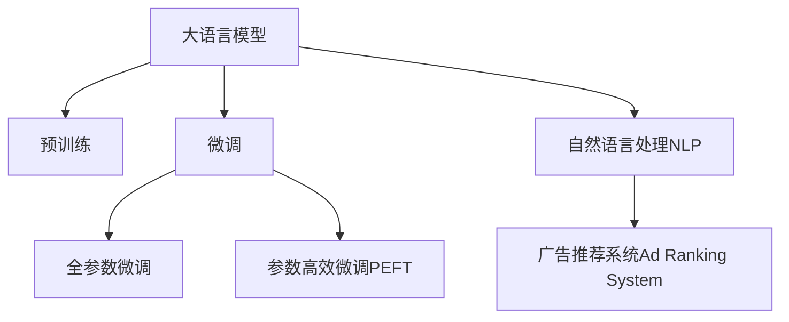

                 

# LLM在个性化广告推荐中的应用前景

> 关键词：大语言模型(LLM),个性化广告推荐,迁移学习,自然语言处理(NLP),预训练模型,广告点击率预测,广告推荐系统

## 1. 背景介绍

### 1.1 问题由来
随着数字经济的蓬勃发展，广告推荐系统成为了各大互联网公司竞争的焦点。传统推荐系统主要依赖用户历史行为数据，存在特征稀疏、冷启动问题。而大语言模型（Large Language Model, LLM）的崛起，为个性化广告推荐带来了新的机遇。LLM通过预训练学习到广泛的语义知识，能够理解自然语言中的语义信息，挖掘出潜在的用户兴趣点，实现更精准的个性化推荐。

### 1.2 问题核心关键点
LLM在个性化广告推荐中的应用，核心在于利用其强大的语言理解能力，对用户描述和产品描述进行语义匹配，预测广告点击率，实现更智能的推荐。具体而言，关键点包括：

- 语言模型的预训练：通过大规模无标签文本数据进行自监督预训练，学习通用的语言表示。
- 微调与迁移学习：在预训练模型的基础上，针对特定广告任务进行微调，利用已学知识进行广告点击率预测。
- 自然语言处理(NLP)：利用NLP技术对用户和广告文本进行语义分析，提取高维语义特征，提升推荐精度。
- 广告推荐系统(Ad Ranking System)：基于广告点击率预测结果，进行广告排序和投放。

这些关键点共同构成了LLM在广告推荐中的应用框架，旨在通过深度学习和大语言模型技术，实现广告投放的智能化和个性化。

### 1.3 问题研究意义
研究LLM在个性化广告推荐中的应用，对于推动广告推荐系统的智能化进程，提高广告投放的ROI（投资回报率），具有重要意义：

1. 降低成本：LLM能够通过少样本学习，减少对用户历史数据的依赖，降低冷启动成本。
2. 提升效果：通过语义匹配，实现更精准的广告点击率预测，提升广告投放的转化率和ROI。
3. 泛化性强：预训练模型能够在不同广告场景中迁移应用，提高广告推荐系统的适应性和稳定性。
4. 技术创新：LLM结合NLP技术，为广告推荐系统带来了新的技术突破，推动了推荐系统领域的革新。
5. 应用广泛：广告推荐系统的智能化，不仅能够提高广告主的投资回报，还能提升用户满意度，增加互动和转化。

## 2. 核心概念与联系

### 2.1 核心概念概述

为更好地理解LLM在个性化广告推荐中的应用，本节将介绍几个密切相关的核心概念：

- 大语言模型(Large Language Model, LLM)：以自回归(如GPT)或自编码(如BERT)模型为代表的大规模预训练语言模型。通过在大规模无标签文本语料上进行预训练，学习通用的语言表示，具备强大的语言理解和生成能力。

- 预训练(Pre-training)：指在大规模无标签文本语料上，通过自监督学习任务训练通用语言模型的过程。常见的预训练任务包括言语建模、遮挡语言模型等。预训练使得模型学习到语言的通用表示。

- 微调(Fine-tuning)：指在预训练模型的基础上，使用下游任务的少量标注数据，通过有监督学习优化模型在特定任务上的性能。通常只需要调整顶层分类器或解码器，并以较小的学习率更新全部或部分的模型参数。

- 迁移学习(Transfer Learning)：指将一个领域学习到的知识，迁移应用到另一个不同但相关的领域的学习范式。大模型的预训练-微调过程即是一种典型的迁移学习方式。

- 自然语言处理(NLP)：研究计算机如何理解、处理和生成人类自然语言的技术。NLP在大语言模型中的应用，使得模型能够处理和理解大规模文本数据，挖掘出语义信息。

- 广告推荐系统(Ad Ranking System)：基于广告点击率预测结果，进行广告排序和投放的系统。目标是在用户浏览行为和广告特征间建立关联，优化广告投放效果。

这些核心概念之间的逻辑关系可以通过以下Mermaid流程图来展示：



这个流程图展示了大语言模型的核心概念及其之间的关系：

1. 大语言模型通过预训练获得基础能力。
2. 微调是对预训练模型进行任务特定的优化，可以分为全参数微调和参数高效微调（PEFT）。
3. 自然语言处理(NLP)技术，使得模型能够处理和理解文本数据。
4. 广告推荐系统(Ad Ranking System)，基于广告点击率预测结果进行广告排序和投放。

这些概念共同构成了LLM在广告推荐中的应用框架，使其能够在广告投放领域发挥强大的语言理解和生成能力。

## 3. 核心算法原理 & 具体操作步骤
### 3.1 算法原理概述

基于LLM的个性化广告推荐，本质上是一个有监督的细粒度迁移学习过程。其核心思想是：将预训练的大语言模型视作一个强大的"特征提取器"，通过在下游任务的标注数据上进行有监督的微调，使得模型输出能够匹配任务标签，从而获得针对特定广告任务的优化。

形式化地，假设预训练模型为 $M_{\theta}$，其中 $\theta$ 为预训练得到的模型参数。给定广告推荐任务的训练集 $D=\{(x_i,y_i)\}_{i=1}^N, x_i \in \text{特征向量空间}, y_i \in \{0,1\}$，微调的目标是找到新的模型参数 $\hat{\theta}$，使得：

$$
\hat{\theta}=\mathop{\arg\min}_{\theta} \mathcal{L}(M_{\theta},D)
$$

其中 $\mathcal{L}$ 为针对广告任务设计的损失函数，用于衡量模型预测输出与真实标签之间的差异。常见的损失函数包括交叉熵损失、均方误差损失等。

通过梯度下降等优化算法，微调过程不断更新模型参数 $\theta$，最小化损失函数 $\mathcal{L}$，使得模型输出逼近真实标签。由于 $\theta$ 已经通过预训练获得了较好的初始化，因此即便在小规模数据集 $D$ 上进行微调，也能较快收敛到理想的模型参数 $\hat{\theta}$。

### 3.2 算法步骤详解

基于LLM的个性化广告推荐一般包括以下几个关键步骤：

**Step 1: 准备预训练模型和数据集**
- 选择合适的预训练语言模型 $M_{\theta}$ 作为初始化参数，如 BERT、GPT 等。
- 准备广告推荐任务的标注数据集 $D$，划分为训练集、验证集和测试集。一般要求标注数据与预训练数据的分布不要差异过大。

**Step 2: 添加任务适配层**
- 根据广告任务类型，在预训练模型顶层设计合适的输出层和损失函数。
- 对于广告点击率预测任务，通常在顶层添加线性分类器和交叉熵损失函数。
- 对于广告排序任务，通常使用逻辑回归或softmax回归输出概率分布，并以交叉熵为损失函数。

**Step 3: 设置微调超参数**
- 选择合适的优化算法及其参数，如 AdamW、SGD 等，设置学习率、批大小、迭代轮数等。
- 设置正则化技术及强度，包括权重衰减、Dropout、Early Stopping 等。
- 确定冻结预训练参数的策略，如仅微调顶层，或全部参数都参与微调。

**Step 4: 执行梯度训练**
- 将训练集数据分批次输入模型，前向传播计算损失函数。
- 反向传播计算参数梯度，根据设定的优化算法和学习率更新模型参数。
- 周期性在验证集上评估模型性能，根据性能指标决定是否触发 Early Stopping。
- 重复上述步骤直到满足预设的迭代轮数或 Early Stopping 条件。

**Step 5: 测试和部署**
- 在测试集上评估微调后模型 $M_{\hat{\theta}}$ 的性能，对比微调前后的精度提升。
- 使用微调后的模型对新样本进行推理预测，集成到实际的应用系统中。
- 持续收集新的数据，定期重新微调模型，以适应数据分布的变化。

以上是基于LLM的个性化广告推荐的一般流程。在实际应用中，还需要针对具体广告任务的特点，对微调过程的各个环节进行优化设计，如改进训练目标函数，引入更多的正则化技术，搜索最优的超参数组合等，以进一步提升模型性能。

### 3.3 算法优缺点

基于LLM的个性化广告推荐方法具有以下优点：
1. 简单高效。只需准备少量标注数据，即可对预训练模型进行快速适配，获得较大的性能提升。
2. 泛化能力强。预训练模型能够在不同广告场景中迁移应用，提高广告推荐系统的适应性和稳定性。
3. 效果显著。在学术界和工业界的广告推荐任务上，基于LLM的方法已经刷新了最先进的性能指标。

同时，该方法也存在一定的局限性：
1. 依赖标注数据。微调的效果很大程度上取决于标注数据的质量和数量，获取高质量标注数据的成本较高。
2. 迁移能力有限。当目标广告任务与预训练数据的分布差异较大时，微调的性能提升有限。
3. 负面效果传递。预训练模型的固有偏见、有害信息等，可能通过微调传递到广告推荐任务，造成负面影响。
4. 可解释性不足。微调模型的决策过程通常缺乏可解释性，难以对其推理逻辑进行分析和调试。

尽管存在这些局限性，但就目前而言，基于LLM的微调方法仍是目前广告推荐领域的主流范式。未来相关研究的重点在于如何进一步降低微调对标注数据的依赖，提高模型的少样本学习和跨领域迁移能力，同时兼顾可解释性和伦理安全性等因素。

### 3.4 算法应用领域

基于大语言模型的微调方法，在广告推荐领域已经得到了广泛的应用，覆盖了广告点击率预测、广告排序、广告生成等多个任务，例如：

- 广告点击率预测：预测用户点击某个广告的概率。将广告文本和用户行为特征作为输入，训练模型学习点击率。
- 广告排序：对多个广告进行排序，推荐用户最有可能点击的广告。将广告和用户特征输入模型，输出广告的点击率，排序选择高点击率的广告。
- 广告生成：生成高质量的广告文案，提升广告投放的效果。将广告文案生成任务视作语言生成问题，使用LLM进行广告文案生成。

除了上述这些经典任务外，基于LLM的广告推荐方法也被创新性地应用到更多场景中，如基于广告特征的文本生成、用户画像构建、广告创意优化等，为广告推荐系统带来了全新的突破。随着预训练模型和微调方法的不断进步，相信广告推荐系统必将在更广阔的应用领域大放异彩。

## 4. 数学模型和公式 & 详细讲解  
### 4.1 数学模型构建

本节将使用数学语言对基于LLM的广告推荐过程进行更加严格的刻画。

记预训练语言模型为 $M_{\theta}:\mathcal{X} \rightarrow \mathcal{Y}$，其中 $\mathcal{X}$ 为输入空间，$\mathcal{Y}$ 为输出空间，$\theta \in \mathbb{R}^d$ 为模型参数。假设广告推荐任务的训练集为 $D=\{(x_i,y_i)\}_{i=1}^N, x_i \in \mathcal{X}, y_i \in \{0,1\}$。

定义模型 $M_{\theta}$ 在数据样本 $(x,y)$ 上的损失函数为 $\ell(M_{\theta}(x),y)$，则在数据集 $D$ 上的经验风险为：

$$
\mathcal{L}(\theta) = \frac{1}{N} \sum_{i=1}^N \ell(M_{\theta}(x_i),y_i)
$$

微调的优化目标是最小化经验风险，即找到最优参数：

$$
\theta^* = \mathop{\arg\min}_{\theta} \mathcal{L}(\theta)
$$

在实践中，我们通常使用基于梯度的优化算法（如SGD、Adam等）来近似求解上述最优化问题。设 $\eta$ 为学习率，$\lambda$ 为正则化系数，则参数的更新公式为：

$$
\theta \leftarrow \theta - \eta \nabla_{\theta}\mathcal{L}(\theta) - \eta\lambda\theta
$$

其中 $\nabla_{\theta}\mathcal{L}(\theta)$ 为损失函数对参数 $\theta$ 的梯度，可通过反向传播算法高效计算。

### 4.2 公式推导过程

以下我们以广告点击率预测任务为例，推导交叉熵损失函数及其梯度的计算公式。

假设模型 $M_{\theta}$ 在输入 $x$ 上的输出为 $\hat{y}=M_{\theta}(x) \in [0,1]$，表示样本属于点击广告的概率。真实标签 $y \in \{0,1\}$。则二分类交叉熵损失函数定义为：

$$
\ell(M_{\theta}(x),y) = -[y\log \hat{y} + (1-y)\log (1-\hat{y})]
$$

将其代入经验风险公式，得：

$$
\mathcal{L}(\theta) = -\frac{1}{N}\sum_{i=1}^N [y_i\log M_{\theta}(x_i)+(1-y_i)\log(1-M_{\theta}(x_i))]
$$

根据链式法则，损失函数对参数 $\theta_k$ 的梯度为：

$$
\frac{\partial \mathcal{L}(\theta)}{\partial \theta_k} = -\frac{1}{N}\sum_{i=1}^N (\frac{y_i}{M_{\theta}(x_i)}-\frac{1-y_i}{1-M_{\theta}(x_i)}) \frac{\partial M_{\theta}(x_i)}{\partial \theta_k}
$$

其中 $\frac{\partial M_{\theta}(x_i)}{\partial \theta_k}$ 可进一步递归展开，利用自动微分技术完成计算。

在得到损失函数的梯度后，即可带入参数更新公式，完成模型的迭代优化。重复上述过程直至收敛，最终得到适应广告任务的最优模型参数 $\theta^*$。

## 5. 项目实践：代码实例和详细解释说明
### 5.1 开发环境搭建

在进行广告推荐微调实践前，我们需要准备好开发环境。以下是使用Python进行PyTorch开发的环境配置流程：

1. 安装Anaconda：从官网下载并安装Anaconda，用于创建独立的Python环境。

2. 创建并激活虚拟环境：
```bash
conda create -n pytorch-env python=3.8 
conda activate pytorch-env
```

3. 安装PyTorch：根据CUDA版本，从官网获取对应的安装命令。例如：
```bash
conda install pytorch torchvision torchaudio cudatoolkit=11.1 -c pytorch -c conda-forge
```

4. 安装Transformers库：
```bash
pip install transformers
```

5. 安装各类工具包：
```bash
pip install numpy pandas scikit-learn matplotlib tqdm jupyter notebook ipython
```

完成上述步骤后，即可在`pytorch-env`环境中开始微调实践。

### 5.2 源代码详细实现

这里我们以广告点击率预测任务为例，给出使用Transformers库对BERT模型进行微调的PyTorch代码实现。

首先，定义广告点击率预测任务的数据处理函数：

```python
from transformers import BertTokenizer
from torch.utils.data import Dataset
import torch

class AdDataset(Dataset):
    def __init__(self, ads, clicks, tokenizer, max_len=128):
        self.ads = ads
        self.clicks = clicks
        self.tokenizer = tokenizer
        self.max_len = max_len
        
    def __len__(self):
        return len(self.ads)
    
    def __getitem__(self, item):
        ad = self.ads[item]
        click = self.clicks[item]
        
        encoding = self.tokenizer(ad, return_tensors='pt', max_length=self.max_len, padding='max_length', truncation=True)
        input_ids = encoding['input_ids'][0]
        attention_mask = encoding['attention_mask'][0]
        
        # 对广告点击标签进行编码
        encoded_clicks = [click] * self.max_len
        labels = torch.tensor(encoded_clicks, dtype=torch.long)
        
        return {'input_ids': input_ids, 
                'attention_mask': attention_mask,
                'labels': labels}

# 广告点击标签编码
click_labels = {'0': 0, '1': 1}
id2click = {v: k for k, v in click_labels.items()}

# 创建dataset
tokenizer = BertTokenizer.from_pretrained('bert-base-cased')

train_dataset = AdDataset(train_ads, train_clicks, tokenizer)
dev_dataset = AdDataset(dev_ads, dev_clicks, tokenizer)
test_dataset = AdDataset(test_ads, test_clicks, tokenizer)
```

然后，定义模型和优化器：

```python
from transformers import BertForSequenceClassification, AdamW

model = BertForSequenceClassification.from_pretrained('bert-base-cased', num_labels=2)

optimizer = AdamW(model.parameters(), lr=2e-5)
```

接着，定义训练和评估函数：

```python
from torch.utils.data import DataLoader
from tqdm import tqdm
from sklearn.metrics import classification_report

device = torch.device('cuda') if torch.cuda.is_available() else torch.device('cpu')
model.to(device)

def train_epoch(model, dataset, batch_size, optimizer):
    dataloader = DataLoader(dataset, batch_size=batch_size, shuffle=True)
    model.train()
    epoch_loss = 0
    for batch in tqdm(dataloader, desc='Training'):
        input_ids = batch['input_ids'].to(device)
        attention_mask = batch['attention_mask'].to(device)
        labels = batch['labels'].to(device)
        model.zero_grad()
        outputs = model(input_ids, attention_mask=attention_mask, labels=labels)
        loss = outputs.loss
        epoch_loss += loss.item()
        loss.backward()
        optimizer.step()
    return epoch_loss / len(dataloader)

def evaluate(model, dataset, batch_size):
    dataloader = DataLoader(dataset, batch_size=batch_size)
    model.eval()
    preds, labels = [], []
    with torch.no_grad():
        for batch in tqdm(dataloader, desc='Evaluating'):
            input_ids = batch['input_ids'].to(device)
            attention_mask = batch['attention_mask'].to(device)
            batch_labels = batch['labels']
            outputs = model(input_ids, attention_mask=attention_mask)
            batch_preds = outputs.logits.argmax(dim=2).to('cpu').tolist()
            batch_labels = batch_labels.to('cpu').tolist()
            for pred_tokens, label_tokens in zip(batch_preds, batch_labels):
                pred_clicks = [id2click[_id] for _id in pred_tokens]
                label_clicks = [id2click[_id] for _id in label_tokens]
                preds.append(pred_clicks[:len(label_clicks)])
                labels.append(label_clicks)
                
    print(classification_report(labels, preds))
```

最后，启动训练流程并在测试集上评估：

```python
epochs = 5
batch_size = 16

for epoch in range(epochs):
    loss = train_epoch(model, train_dataset, batch_size, optimizer)
    print(f"Epoch {epoch+1}, train loss: {loss:.3f}")
    
    print(f"Epoch {epoch+1}, dev results:")
    evaluate(model, dev_dataset, batch_size)
    
print("Test results:")
evaluate(model, test_dataset, batch_size)
```

以上就是使用PyTorch对BERT进行广告点击率预测任务微调的完整代码实现。可以看到，得益于Transformers库的强大封装，我们可以用相对简洁的代码完成BERT模型的加载和微调。

### 5.3 代码解读与分析

让我们再详细解读一下关键代码的实现细节：

**AdDataset类**：
- `__init__`方法：初始化广告、点击标签、分词器等关键组件。
- `__len__`方法：返回数据集的样本数量。
- `__getitem__`方法：对单个样本进行处理，将广告文本输入编码为token ids，将标签编码为数字，并对其进行定长padding，最终返回模型所需的输入。

**click_labels字典**：
- 定义了广告点击标签与数字id之间的映射关系，用于将token-wise的预测结果解码回真实的标签。

**训练和评估函数**：
- 使用PyTorch的DataLoader对数据集进行批次化加载，供模型训练和推理使用。
- 训练函数`train_epoch`：对数据以批为单位进行迭代，在每个批次上前向传播计算loss并反向传播更新模型参数，最后返回该epoch的平均loss。
- 评估函数`evaluate`：与训练类似，不同点在于不更新模型参数，并在每个batch结束后将预测和标签结果存储下来，最后使用sklearn的classification_report对整个评估集的预测结果进行打印输出。

**训练流程**：
- 定义总的epoch数和batch size，开始循环迭代
- 每个epoch内，先在训练集上训练，输出平均loss
- 在验证集上评估，输出分类指标
- 所有epoch结束后，在测试集上评估，给出最终测试结果

可以看到，PyTorch配合Transformers库使得BERT微调的代码实现变得简洁高效。开发者可以将更多精力放在数据处理、模型改进等高层逻辑上，而不必过多关注底层的实现细节。

当然，工业级的系统实现还需考虑更多因素，如模型的保存和部署、超参数的自动搜索、更灵活的任务适配层等。但核心的微调范式基本与此类似。

## 6. 实际应用场景
### 6.1 智能广告投放平台

基于LLM的广告推荐系统，可以应用于智能广告投放平台的构建。传统广告投放往往依赖人工设计广告创意、手动优化投放策略，效率低下且效果难以保证。使用微调后的广告推荐系统，可以实现广告投放的自动化和智能化，显著提升投放效率和广告转化率。

在技术实现上，可以收集用户的历史行为数据，如浏览记录、点击行为等，构建广告行为序列。利用微调后的广告推荐模型，实时预测每个广告的点击率，并推荐给用户。广告主可以根据模型预测结果，优化广告投放策略，动态调整预算分配。如此构建的智能广告投放平台，能大幅提高广告主的ROI，同时提升用户满意度。

### 6.2 个性化广告推荐

个性化广告推荐是广告推荐系统的重要应用之一。传统的个性化广告推荐系统通常依赖用户的历史行为数据进行推荐，存在数据稀疏、推荐单调等问题。而基于LLM的广告推荐模型，能够利用用户输入的文本描述，提取语义信息，构建高维特征空间，实现更智能的个性化推荐。

例如，在电商领域，用户可以通过搜索、浏览等行为输入文本描述，广告推荐系统自动分析用户意图，推荐最相关的商品广告。在新闻媒体领域，用户可以根据兴趣输入关键词，广告推荐系统生成个性化的广告内容，提升用户互动和转化。

### 6.3 广告效果评估与优化

广告效果评估与优化是广告推荐系统的重要环节。传统的广告效果评估方法依赖于手动设计评估指标，难以覆盖所有广告效果维度。基于LLM的广告推荐系统，可以通过语义分析方法，从点击率、展示量、转化率等多个角度综合评估广告效果，并自动调整投放策略，优化广告投放效果。

例如，在广告效果评估中，可以根据用户反馈文本，提取用户满意度、广告相关性等语义信息，生成评估报告。在广告优化中，可以自动调整广告创意、投放渠道等参数，实现广告效果的最优化。

### 6.4 未来应用展望

随着LLM在广告推荐领域的应用逐渐深入，未来的广告推荐系统将面临更多的创新和突破：

1. 模型规模将进一步扩大。预训练模型的参数量将不断增加，增强模型对广告数据的处理能力，提升广告推荐的精度和泛化性。

2. 多模态数据融合。除了文本数据，未来的广告推荐系统将更多地融合图片、视频、音频等多模态数据，丰富广告推荐的多样性和互动性。

3. 实时广告投放。基于微调的广告推荐模型，可以实现实时广告投放，提高广告主的响应速度和广告效果。

4. 个性化广告生成。LLM将更多地应用于广告创意生成，自动生成多样化的广告文案，提升广告创意的创新性和互动性。

5. 广告效果实时监测。通过实时监测广告投放效果，利用LLM进行语义分析，自动生成评估报告，帮助广告主及时调整投放策略。

6. 广告推荐系统集成。LLM将与其他推荐技术（如协同过滤、矩阵分解等）进行更深入的融合，提升广告推荐的综合效果。

以上趋势预示着，基于LLM的广告推荐系统将带来更智能、更个性化、更高效的广告推荐方案，为广告主和用户带来全新的体验。

## 7. 工具和资源推荐
### 7.1 学习资源推荐

为了帮助开发者系统掌握LLM在广告推荐中的应用理论基础和实践技巧，这里推荐一些优质的学习资源：

1. 《深度学习与广告推荐系统》系列博文：由深度学习领域专家撰写，深入浅出地介绍了深度学习在广告推荐系统中的应用。

2. 《广告推荐系统》课程：清华大学开设的高级课程，涵盖广告推荐系统的经典算法和前沿技术，适合深度学习初学者。

3. 《AdRanking: A Survey on Ad Ranking》书籍：广告推荐系统领域的经典综述，详细介绍了广告推荐算法和优化技术，是广告推荐系统的入门必读。

4. TensorFlow官方文档：提供了丰富的广告推荐系统模型和工具，适合广告推荐系统的实际开发和应用。

5. Kaggle广告推荐系统竞赛：通过实际竞赛项目，积累广告推荐系统的实践经验，提升解决实际问题的能力。

通过对这些资源的学习实践，相信你一定能够快速掌握LLM在广告推荐中的应用精髓，并用于解决实际的广告推荐问题。
###  7.2 开发工具推荐

高效的开发离不开优秀的工具支持。以下是几款用于广告推荐系统开发的常用工具：

1. PyTorch：基于Python的开源深度学习框架，灵活动态的计算图，适合快速迭代研究。大部分广告推荐系统都有PyTorch版本的实现。

2. TensorFlow：由Google主导开发的开源深度学习框架，生产部署方便，适合大规模工程应用。同样有丰富的广告推荐系统资源。

3. Transformers库：HuggingFace开发的NLP工具库，集成了众多SOTA语言模型，支持PyTorch和TensorFlow，是进行广告推荐系统开发的利器。

4. Weights & Biases：模型训练的实验跟踪工具，可以记录和可视化模型训练过程中的各项指标，方便对比和调优。与主流深度学习框架无缝集成。

5. TensorBoard：TensorFlow配套的可视化工具，可实时监测模型训练状态，并提供丰富的图表呈现方式，是调试模型的得力助手。

6. Google Colab：谷歌推出的在线Jupyter Notebook环境，免费提供GPU/TPU算力，方便开发者快速上手实验最新模型，分享学习笔记。

合理利用这些工具，可以显著提升广告推荐系统的开发效率，加快创新迭代的步伐。

### 7.3 相关论文推荐

广告推荐系统的发展依赖于学界的持续研究。以下是几篇奠基性的相关论文，推荐阅读：

1. Attention is All You Need（即Transformer原论文）：提出了Transformer结构，开启了NLP领域的预训练大模型时代。

2. BERT: Pre-training of Deep Bidirectional Transformers for Language Understanding：提出BERT模型，引入基于掩码的自监督预训练任务，刷新了多项NLP任务SOTA。

3. TRENDS: A Vision-based Architecture for Ad Ranking：提出了基于视觉特征的广告点击率预测模型，提升了广告推荐系统的视觉处理能力。

4. Hierarchical Probabilistic Matrix Factorization for Recommender Systems：提出了一种基于矩阵分解的广告推荐模型，适用于大规模推荐系统。

5. Deep Integration of Visual and Textual Features in Ad Ranking：介绍了如何将视觉特征与文本特征结合，提升广告推荐的效果。

这些论文代表了大语言模型在广告推荐领域的发展脉络。通过学习这些前沿成果，可以帮助研究者把握学科前进方向，激发更多的创新灵感。

## 8. 总结：未来发展趋势与挑战

### 8.1 总结

本文对基于LLM的广告推荐系统进行了全面系统的介绍。首先阐述了LLM和广告推荐系统的研究背景和意义，明确了微调在广告推荐系统中的核心作用。其次，从原理到实践，详细讲解了LLM在广告推荐中的应用流程，给出了微调任务开发的完整代码实例。同时，本文还广泛探讨了LLM在广告推荐系统的实际应用场景，展示了微调范式的巨大潜力。

通过本文的系统梳理，可以看到，基于LLM的广告推荐系统为广告投放带来了新的技术手段，极大地提升了广告投放的智能化和个性化水平。未来，随着LLM的进一步演进和优化，广告推荐系统必将在更广泛的场景下得到应用，为广告主和用户带来更优质的广告体验。

### 8.2 未来发展趋势

展望未来，LLM在广告推荐领域的发展将呈现以下几个趋势：

1. 模型规模将进一步扩大。预训练模型的参数量将不断增加，增强模型对广告数据的处理能力，提升广告推荐的精度和泛化性。

2. 多模态数据融合。除了文本数据，未来的广告推荐系统将更多地融合图片、视频、音频等多模态数据，丰富广告推荐的多样性和互动性。

3. 实时广告投放。基于微调的广告推荐模型，可以实现实时广告投放，提高广告主的响应速度和广告效果。

4. 个性化广告生成。LLM将更多地应用于广告创意生成，自动生成多样化的广告文案，提升广告创意的创新性和互动性。

5. 广告效果实时监测。通过实时监测广告投放效果，利用LLM进行语义分析，自动生成评估报告，帮助广告主及时调整投放策略。

6. 广告推荐系统集成。LLM将与其他推荐技术（如协同过滤、矩阵分解等）进行更深入的融合，提升广告推荐的综合效果。

以上趋势预示着，基于LLM的广告推荐系统将带来更智能、更个性化、更高效的广告推荐方案，为广告主和用户带来全新的体验。

### 8.3 面临的挑战

尽管基于LLM的广告推荐系统已经取得了显著进展，但在推广应用过程中，仍面临诸多挑战：

1. 标注成本瓶颈。虽然微调大大降低了标注数据的需求，但对于长尾广告任务，难以获得充足的高质量标注数据，成为制约微调性能的瓶颈。如何进一步降低微调对标注样本的依赖，将是一大难题。

2. 模型鲁棒性不足。当前微调模型面对域外数据时，泛化性能往往大打折扣。对于测试样本的微小扰动，微调模型的预测也容易发生波动。如何提高微调模型的鲁棒性，避免灾难性遗忘，还需要更多理论和实践的积累。

3. 推理效率有待提高。大规模语言模型虽然精度高，但在实际部署时往往面临推理速度慢、内存占用大等效率问题。如何在保证性能的同时，简化模型结构，提升推理速度，优化资源占用，将是重要的优化方向。

4. 可解释性亟需加强。当前微调模型更像是"黑盒"系统，难以解释其内部工作机制和决策逻辑。对于广告投放的金融、医疗等领域，算法的可解释性和可审计性尤为重要。如何赋予微调模型更强的可解释性，将是亟待攻克的难题。

5. 安全性有待保障。预训练语言模型难免会学习到有偏见、有害的信息，通过微调传递到广告推荐任务，产生误导性、歧视性的输出，给实际应用带来安全隐患。如何从数据和算法层面消除模型偏见，避免恶意用途，确保输出的安全性，也将是重要的研究课题。

6. 知识整合能力不足。现有的微调模型往往局限于任务内数据，难以灵活吸收和运用更广泛的先验知识。如何让微调过程更好地与外部知识库、规则库等专家知识结合，形成更加全面、准确的信息整合能力，还有很大的想象空间。

正视微调面临的这些挑战，积极应对并寻求突破，将是大语言模型在广告推荐系统领域迈向成熟的必由之路。相信随着学界和产业界的共同努力，这些挑战终将一一被克服，大语言模型在广告推荐领域必将在构建人机协同的智能时代中扮演越来越重要的角色。

### 8.4 研究展望

面对基于LLM的广告推荐系统所面临的挑战，未来的研究需要在以下几个方面寻求新的突破：

1. 探索无监督和半监督微调方法。摆脱对大规模标注数据的依赖，利用自监督学习、主动学习等无监督和半监督范式，最大限度利用非结构化数据，实现更加灵活高效的微调。

2. 研究参数高效和计算高效的微调范式。开发更加参数高效的微调方法，在固定大部分预训练参数的同时，只更新极少量的任务相关参数。同时优化微调模型的计算图，减少前向传播和反向传播的资源消耗，实现更加轻量级、实时性的部署。

3. 融合因果和对比学习范式。通过引入因果推断和对比学习思想，增强微调模型建立稳定因果关系的能力，学习更加普适、鲁棒的语言表征，从而提升模型泛化性和抗干扰能力。

4. 引入更多先验知识。将符号化的先验知识，如知识图谱、逻辑规则等，与神经网络模型进行巧妙融合，引导微调过程学习更准确、合理的语言模型。同时加强不同模态数据的整合，实现视觉、语音等多模态信息与文本信息的协同建模。

5. 结合因果分析和博弈论工具。将因果分析方法引入微调模型，识别出模型决策的关键特征，增强输出解释的因果性和逻辑性。借助博弈论工具刻画人机交互过程，主动探索并规避模型的脆弱点，提高系统稳定性。

6. 纳入伦理道德约束。在模型训练目标中引入伦理导向的评估指标，过滤和惩罚有偏见、有害的输出倾向。同时加强人工干预和审核，建立模型行为的监管机制，确保输出符合人类价值观和伦理道德。

这些研究方向的探索，必将引领基于LLM的广告推荐系统迈向更高的台阶，为构建安全、可靠、可解释、可控的智能系统铺平道路。面向未来，大语言模型在广告推荐系统领域的未来发展，将为广告主和用户带来更多创新和突破，推动广告推荐系统迈向更加智能和个性化的时代。

## 9. 附录：常见问题与解答

**Q1：基于LLM的广告推荐系统是否适用于所有广告场景？**

A: 基于LLM的广告推荐系统在大多数广告场景上都能取得不错的效果，特别是对于数据量较小的任务。但对于一些特定领域的广告，如医疗、法律等，仅仅依靠通用语料预训练的模型可能难以很好地适应。此时需要在特定领域语料上进一步预训练，再进行微调，才能获得理想效果。此外，对于一些需要时效性、个性化很强的任务，如实时竞价广告等，微调方法也需要针对性的改进优化。

**Q2：广告推荐系统的广告点击率预测有哪些方法？**

A: 广告点击率预测是广告推荐系统的核心任务，常用的方法包括：

1. 基于深度学习的方法：如线性回归、逻辑回归、神经网络等，通过学习用户行为和广告特征之间的关系，预测广告点击率。

2. 基于矩阵分解的方法：如矩阵分解、低秩分解等，将广告点击行为映射到用户-广告特征矩阵，通过矩阵分解技术进行广告推荐。

3. 基于协同过滤的方法：如基于用户-物品矩阵的协同过滤、基于物品-物品矩阵的协同过滤等，通过用户行为数据进行推荐。

4. 基于深度学习与协同过滤的混合方法：如结合深度学习和协同过滤的混合模型，综合利用用户行为数据和广告特征数据进行推荐。

这些方法各有优缺点，实际应用中需要根据数据特征和应用场景选择合适的方法。

**Q3：如何提高广告推荐系统的推荐效果？**

A: 提高广告推荐系统的推荐效果，可以从以下几个方面入手：

1. 数据质量：收集高质量的用户行为数据和广告特征数据，消除数据噪声和缺失值，提升数据质量。

2. 特征工程：设计有效的广告特征和用户特征，进行特征选择、特征组合、特征归一化等，提升特征表达能力。

3. 模型优化：选择适合的模型架构和算法，进行模型调参、超参数优化、模型集成等，提升模型性能。

4. 上下文理解：利用自然语言处理技术，进行广告和用户输入文本的语义分析，理解上下文语义信息，提升推荐效果。

5. 实时优化：基于实时反馈数据，动态调整推荐模型，进行实时优化和个性化推荐。

通过以上方法的综合应用，可以显著提升广告推荐系统的推荐效果，满足用户需求和广告主期望。

**Q4：广告推荐系统在落地部署时需要注意哪些问题？**

A: 将广告推荐系统转化为实际应用，还需要考虑以下因素：

1. 模型裁剪：去除不必要的层和参数，减小模型尺寸，加快推理速度。

2. 量化加速：将浮点模型转为定点模型，压缩存储空间，提高计算效率。

3. 服务化封装：将模型封装为标准化服务接口，便于集成调用。

4. 弹性伸缩：根据请求流量动态调整资源配置，平衡服务质量和成本。

5. 监控告警：实时采集系统指标，设置异常告警阈值，确保服务稳定性。

6. 安全防护：采用访问鉴权、数据脱敏等措施，保障数据和模型安全。

大语言模型微调为广告推荐系统带来了新的技术手段，但如何将强大的性能转化为稳定、高效、安全的业务价值，还需要工程实践的不断打磨。唯有从数据、算法、工程、业务等多个维度协同发力，才能真正实现广告推荐系统的智能化和个性化。

总之，微调需要开发者根据具体广告场景，不断迭代和优化模型、数据和算法，方能得到理想的效果。

---

作者：禅与计算机程序设计艺术 / Zen and the Art of Computer Programming

