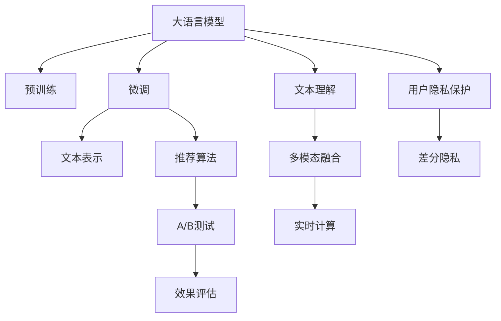

                 

# LLM在个性化广告推荐中的应用前景

> 关键词：大语言模型，个性化推荐系统，广告推荐，用户行为预测，深度学习，自然语言处理

## 1. 背景介绍

### 1.1 问题由来
随着互联网技术的发展，尤其是移动互联网的普及，广告推荐已经成为了互联网公司盈利的重要手段。传统基于关键词匹配的广告推荐方式，由于缺乏对用户兴趣的深度理解，导致广告点击率（CTR）和转化率（CR）较低，用户体验差。近年来，随着深度学习和大数据技术的发展，基于机器学习的个性化推荐系统开始受到广泛关注。

大语言模型（Large Language Model, LLM）作为深度学习领域的最新进展，凭借其强大的自然语言处理能力，在个性化广告推荐中展现出了广阔的应用前景。LLM通过在大规模文本数据上进行预训练，学习到了丰富的语言知识和常识，能够准确理解用户文本查询的含义，并根据用户历史行为数据进行个性化推荐，显著提升了广告推荐的精度和效果。

### 1.2 问题核心关键点
目前，基于大语言模型的个性化广告推荐系统在广告点击率（CTR）和转化率（CR）等指标上均取得了显著的提升。其核心关键点主要包括：

1. **预训练和微调**：使用大规模文本数据对LLM进行预训练，获得通用语言表示，然后根据广告推荐任务进行微调，以适应具体业务需求。
2. **文本理解**：LLM能够准确理解用户文本查询的含义，根据用户的兴趣和行为进行个性化推荐。
3. **实时计算**：LLM具备强大的并行计算能力，能够实时处理用户查询，并快速返回推荐结果。
4. **多模态融合**：LLM可以融合用户行为数据、商品属性、用户画像等多模态数据，提供更加全面和精准的推荐。
5. **用户隐私保护**：通过差分隐私等技术，确保用户数据的安全性和隐私保护。

这些关键点使得基于LLM的个性化广告推荐系统在提升广告效果、提升用户体验、降低广告成本等方面展现出巨大的潜力。

## 2. 核心概念与联系

### 2.1 核心概念概述

为更好地理解基于LLM的个性化广告推荐系统，本节将介绍几个密切相关的核心概念：

- **大语言模型**：以自回归（如GPT）或自编码（如BERT）模型为代表的大规模预训练语言模型。通过在大规模无标签文本语料上进行预训练，学习到了丰富的语言知识和常识，具备强大的自然语言处理能力。
- **预训练**：指在大规模无标签文本语料上，通过自监督学习任务训练通用语言模型的过程。常见的预训练任务包括言语建模、遮挡语言模型等。
- **微调**：指在预训练模型的基础上，使用下游任务的少量标注数据，通过有监督学习优化模型在特定任务上的性能。
- **文本表示**：将用户查询和商品信息转换成高维向量，方便模型进行相似度计算和推荐。
- **推荐算法**：用于选择最符合用户兴趣的商品进行推荐，常见的算法包括协同过滤、内容过滤等。
- **A/B测试**：用于比较不同推荐策略的效果，选择最优方案进行推广。
- **效果评估**：评估推荐系统的效果，包括CTR、CR、覆盖率、用户满意度等指标。

这些核心概念之间的逻辑关系可以通过以下Mermaid流程图来展示：



这个流程图展示了大语言模型在个性化广告推荐系统中的核心概念及其之间的关系：

1. 大语言模型通过预训练获得基础能力。
2. 微调是对预训练模型进行任务特定的优化，以适应广告推荐任务。
3. 文本表示用于将文本转换成高维向量，便于相似度计算。
4. 推荐算法用于选择推荐商品，常见的算法包括协同过滤、内容过滤等。
5. A/B测试用于比较不同推荐策略的效果。
6. 效果评估用于评估推荐系统的性能。
7. 文本理解用于理解用户查询和商品描述。
8. 多模态融合用于融合用户行为数据、商品属性等。
9. 实时计算用于实时处理用户查询，快速返回推荐结果。
10. 用户隐私保护用于确保用户数据的安全性和隐私保护。

这些核心概念共同构成了基于大语言模型的个性化广告推荐系统，使其能够提供精准、个性化的广告推荐服务。

## 3. 核心算法原理 & 具体操作步骤

### 3.1 算法原理概述

基于大语言模型的个性化广告推荐系统，其核心算法原理主要包括：

1. **预训练和微调**：使用大规模文本数据对大语言模型进行预训练，获得通用语言表示，然后根据广告推荐任务进行微调，以适应具体业务需求。
2. **文本理解**：将用户查询和商品信息转换成高维向量，并利用大语言模型进行文本理解，判断用户兴趣和商品属性。
3. **推荐算法**：基于用户兴趣和商品属性进行推荐，选择合适的商品进行展示。
4. **实时计算**：实时处理用户查询，并快速返回推荐结果。
5. **效果评估**：评估推荐系统的效果，包括CTR、CR、覆盖率、用户满意度等指标。

### 3.2 算法步骤详解

基于大语言模型的个性化广告推荐系统，其具体操作步骤主要包括：

**Step 1: 准备预训练模型和数据集**

1. 选择合适的预训练语言模型 $M_{\theta}$ 作为初始化参数，如 BERT、GPT 等。
2. 准备广告推荐任务的标注数据集 $D=\{(x_i, y_i)\}_{i=1}^N$，其中 $x_i$ 为广告，$y_i$ 为是否被点击。
3. 将标注数据集划分为训练集、验证集和测试集。

**Step 2: 添加任务适配层**

1. 根据广告推荐任务，在预训练模型的顶层设计合适的输出层和损失函数。
2. 对于二分类任务，通常在顶层添加线性分类器和交叉熵损失函数。
3. 对于多分类任务，通常在顶层添加softmax函数和分类损失函数。

**Step 3: 设置微调超参数**

1. 选择合适的优化算法及其参数，如 AdamW、SGD 等，设置学习率、批大小、迭代轮数等。
2. 设置正则化技术及强度，包括权重衰减、Dropout、Early Stopping 等。
3. 确定冻结预训练参数的策略，如仅微调顶层，或全部参数都参与微调。

**Step 4: 执行梯度训练**

1. 将训练集数据分批次输入模型，前向传播计算损失函数。
2. 反向传播计算参数梯度，根据设定的优化算法和学习率更新模型参数。
3. 周期性在验证集上评估模型性能，根据性能指标决定是否触发 Early Stopping。
4. 重复上述步骤直到满足预设的迭代轮数或 Early Stopping 条件。

**Step 5: 测试和部署**

1. 在测试集上评估微调后模型 $M_{\hat{\theta}}$ 的性能，对比微调前后的精度提升。
2. 使用微调后的模型对新样本进行推理预测，集成到实际的应用系统中。
3. 持续收集新的数据，定期重新微调模型，以适应数据分布的变化。

### 3.3 算法优缺点

基于大语言模型的个性化广告推荐系统具有以下优点：

1. **精度高**：大语言模型具有强大的文本理解能力，能够准确理解用户查询和商品描述，提高广告推荐的精度。
2. **效果显著**：在学术界和工业界的诸多广告推荐任务上，基于微调的方法已经刷新了最先进的性能指标。
3. **实时性好**：大语言模型具备强大的并行计算能力，能够实时处理用户查询，并快速返回推荐结果。
4. **可解释性强**：大语言模型可以提供推荐理由，帮助广告主和用户理解推荐依据。

同时，该方法也存在一定的局限性：

1. **数据依赖性强**：微调的效果很大程度上取决于标注数据的质量和数量，获取高质量标注数据的成本较高。
2. **迁移能力有限**：当目标任务与预训练数据的分布差异较大时，微调的性能提升有限。
3. **可解释性不足**：大语言模型的决策过程通常缺乏可解释性，难以对其推理逻辑进行分析和调试。

尽管存在这些局限性，但就目前而言，基于大语言模型的微调方法仍是最主流范式。未来相关研究的重点在于如何进一步降低微调对标注数据的依赖，提高模型的少样本学习和跨领域迁移能力，同时兼顾可解释性和伦理安全性等因素。

### 3.4 算法应用领域

基于大语言模型的个性化广告推荐系统已经在多个领域得到了应用，例如：

1. **电商推荐**：通过分析用户的浏览记录、购买历史等行为数据，推荐用户可能感兴趣的商品。
2. **内容推荐**：根据用户的阅读习惯、观看历史等数据，推荐新闻、视频、音乐等不同类型的内容。
3. **广告投放**：根据用户的地理位置、兴趣爱好等数据，推荐不同类型和风格的广告。
4. **品牌推广**：通过分析用户的互动数据，推荐符合用户兴趣的品牌和产品。
5. **营销活动**：根据用户的行为数据，推荐符合用户兴趣的营销活动和优惠券。

除了这些经典应用外，基于大语言模型的个性化广告推荐系统还在社交媒体、金融、医疗等领域得到广泛应用，为各行业提供了新的业务增长点。

## 4. 数学模型和公式 & 详细讲解

### 4.1 数学模型构建

本节将使用数学语言对基于大语言模型的个性化广告推荐过程进行更加严格的刻画。

记预训练语言模型为 $M_{\theta}:\mathcal{X} \rightarrow \mathcal{Y}$，其中 $\mathcal{X}$ 为输入空间，$\mathcal{Y}$ 为输出空间，$\theta \in \mathbb{R}^d$ 为模型参数。假设广告推荐任务的训练集为 $D=\{(x_i,y_i)\}_{i=1}^N, x_i \in \mathcal{X}, y_i \in \{0,1\}$，其中 $x_i$ 为广告，$y_i$ 为是否被点击。

定义模型 $M_{\theta}$ 在数据样本 $(x,y)$ 上的损失函数为 $\ell(M_{\theta}(x),y)$，则在数据集 $D$ 上的经验风险为：

$$
\mathcal{L}(\theta) = \frac{1}{N}\sum_{i=1}^N \ell(M_{\theta}(x_i),y_i)
$$

微调的优化目标是最小化经验风险，即找到最优参数：

$$
\theta^* = \mathop{\arg\min}_{\theta} \mathcal{L}(\theta)
$$

在实践中，我们通常使用基于梯度的优化算法（如SGD、Adam等）来近似求解上述最优化问题。设 $\eta$ 为学习率，$\lambda$ 为正则化系数，则参数的更新公式为：

$$
\theta \leftarrow \theta - \eta \nabla_{\theta}\mathcal{L}(\theta) - \eta\lambda\theta
$$

其中 $\nabla_{\theta}\mathcal{L}(\theta)$ 为损失函数对参数 $\theta$ 的梯度，可通过反向传播算法高效计算。

### 4.2 公式推导过程

以下我们以二分类任务为例，推导交叉熵损失函数及其梯度的计算公式。

假设模型 $M_{\theta}$ 在输入 $x$ 上的输出为 $\hat{y}=M_{\theta}(x) \in [0,1]$，表示广告被点击的概率。真实标签 $y \in \{0,1\}$。则二分类交叉熵损失函数定义为：

$$
\ell(M_{\theta}(x),y) = -[y\log \hat{y} + (1-y)\log (1-\hat{y})]
$$

将其代入经验风险公式，得：

$$
\mathcal{L}(\theta) = -\frac{1}{N}\sum_{i=1}^N [y_i\log M_{\theta}(x_i)+(1-y_i)\log(1-M_{\theta}(x_i))]
$$

根据链式法则，损失函数对参数 $\theta_k$ 的梯度为：

$$
\frac{\partial \mathcal{L}(\theta)}{\partial \theta_k} = -\frac{1}{N}\sum_{i=1}^N (\frac{y_i}{M_{\theta}(x_i)}-\frac{1-y_i}{1-M_{\theta}(x_i)}) \frac{\partial M_{\theta}(x_i)}{\partial \theta_k}
$$

其中 $\frac{\partial M_{\theta}(x_i)}{\partial \theta_k}$ 可进一步递归展开，利用自动微分技术完成计算。

在得到损失函数的梯度后，即可带入参数更新公式，完成模型的迭代优化。重复上述过程直至收敛，最终得到适应广告推荐任务的最优模型参数 $\theta^*$。

## 5. 项目实践：代码实例和详细解释说明

### 5.1 开发环境搭建

在进行广告推荐系统微调实践前，我们需要准备好开发环境。以下是使用Python进行PyTorch开发的环境配置流程：

1. 安装Anaconda：从官网下载并安装Anaconda，用于创建独立的Python环境。

2. 创建并激活虚拟环境：
```bash
conda create -n pytorch-env python=3.8 
conda activate pytorch-env
```

3. 安装PyTorch：根据CUDA版本，从官网获取对应的安装命令。例如：
```bash
conda install pytorch torchvision torchaudio cudatoolkit=11.1 -c pytorch -c conda-forge
```

4. 安装TensorFlow：如果需要在多个框架间切换，可以安装TensorFlow。

5. 安装各类工具包：
```bash
pip install numpy pandas scikit-learn matplotlib tqdm jupyter notebook ipython
```

完成上述步骤后，即可在`pytorch-env`环境中开始广告推荐系统微调实践。

### 5.2 源代码详细实现

这里我们以电商推荐系统为例，给出使用Transformers库对BERT模型进行广告推荐微调的PyTorch代码实现。

首先，定义广告推荐任务的数据处理函数：

```python
from transformers import BertTokenizer
from torch.utils.data import Dataset
import torch

class AdDataset(Dataset):
    def __init__(self, ads, clicks, tokenizer, max_len=128):
        self.ads = ads
        self.clicks = clicks
        self.tokenizer = tokenizer
        self.max_len = max_len
        
    def __len__(self):
        return len(self.ads)
    
    def __getitem__(self, item):
        ad = self.ads[item]
        click = self.clicks[item]
        
        encoding = self.tokenizer(ad, return_tensors='pt', max_length=self.max_len, padding='max_length', truncation=True)
        input_ids = encoding['input_ids'][0]
        attention_mask = encoding['attention_mask'][0]
        
        # 对点击-广告对进行编码
        encoded_click = [click2id[click] for click in click]
        encoded_click.extend([click2id['O']] * (self.max_len - len(encoded_click)))
        labels = torch.tensor(encoded_click, dtype=torch.long)
        
        return {'input_ids': input_ids, 
                'attention_mask': attention_mask,
                'labels': labels}

# 点击与id的映射
click2id = {'O': 0, '1': 1}
id2click = {v: k for k, v in click2id.items()}
```

然后，定义模型和优化器：

```python
from transformers import BertForTokenClassification, AdamW

model = BertForTokenClassification.from_pretrained('bert-base-cased', num_labels=2)

optimizer = AdamW(model.parameters(), lr=2e-5)
```

接着，定义训练和评估函数：

```python
from torch.utils.data import DataLoader
from tqdm import tqdm
from sklearn.metrics import classification_report

device = torch.device('cuda') if torch.cuda.is_available() else torch.device('cpu')
model.to(device)

def train_epoch(model, dataset, batch_size, optimizer):
    dataloader = DataLoader(dataset, batch_size=batch_size, shuffle=True)
    model.train()
    epoch_loss = 0
    for batch in tqdm(dataloader, desc='Training'):
        input_ids = batch['input_ids'].to(device)
        attention_mask = batch['attention_mask'].to(device)
        labels = batch['labels'].to(device)
        model.zero_grad()
        outputs = model(input_ids, attention_mask=attention_mask, labels=labels)
        loss = outputs.loss
        epoch_loss += loss.item()
        loss.backward()
        optimizer.step()
    return epoch_loss / len(dataloader)

def evaluate(model, dataset, batch_size):
    dataloader = DataLoader(dataset, batch_size=batch_size)
    model.eval()
    preds, labels = [], []
    with torch.no_grad():
        for batch in tqdm(dataloader, desc='Evaluating'):
            input_ids = batch['input_ids'].to(device)
            attention_mask = batch['attention_mask'].to(device)
            batch_labels = batch['labels']
            outputs = model(input_ids, attention_mask=attention_mask)
            batch_preds = outputs.logits.argmax(dim=2).to('cpu').tolist()
            batch_labels = batch_labels.to('cpu').tolist()
            for pred_tokens, label_tokens in zip(batch_preds, batch_labels):
                pred_click = [id2click[_id] for _id in pred_tokens]
                label_click = [id2click[_id] for _id in label_tokens]
                preds.append(pred_click[:len(label_click)])
                labels.append(label_click)
                
    print(classification_report(labels, preds))
```

最后，启动训练流程并在测试集上评估：

```python
epochs = 5
batch_size = 16

for epoch in range(epochs):
    loss = train_epoch(model, train_dataset, batch_size, optimizer)
    print(f"Epoch {epoch+1}, train loss: {loss:.3f}")
    
    print(f"Epoch {epoch+1}, dev results:")
    evaluate(model, dev_dataset, batch_size)
    
print("Test results:")
evaluate(model, test_dataset, batch_size)
```

以上就是使用PyTorch对BERT进行广告推荐系统微调的完整代码实现。可以看到，得益于Transformers库的强大封装，我们可以用相对简洁的代码完成BERT模型的加载和微调。

### 5.3 代码解读与分析

让我们再详细解读一下关键代码的实现细节：

**AdDataset类**：
- `__init__`方法：初始化广告、点击、分词器等关键组件。
- `__len__`方法：返回数据集的样本数量。
- `__getitem__`方法：对单个样本进行处理，将广告输入编码为token ids，将点击标签编码为数字，并对其进行定长padding，最终返回模型所需的输入。

**click2id和id2click字典**：
- 定义了点击与数字id之间的映射关系，用于将token-wise的预测结果解码回真实的点击标签。

**训练和评估函数**：
- 使用PyTorch的DataLoader对数据集进行批次化加载，供模型训练和推理使用。
- 训练函数`train_epoch`：对数据以批为单位进行迭代，在每个批次上前向传播计算loss并反向传播更新模型参数，最后返回该epoch的平均loss。
- 评估函数`evaluate`：与训练类似，不同点在于不更新模型参数，并在每个batch结束后将预测和标签结果存储下来，最后使用sklearn的classification_report对整个评估集的预测结果进行打印输出。

**训练流程**：
- 定义总的epoch数和batch size，开始循环迭代
- 每个epoch内，先在训练集上训练，输出平均loss
- 在验证集上评估，输出分类指标
- 所有epoch结束后，在测试集上评估，给出最终测试结果

可以看到，PyTorch配合Transformers库使得广告推荐系统微调的代码实现变得简洁高效。开发者可以将更多精力放在数据处理、模型改进等高层逻辑上，而不必过多关注底层的实现细节。

当然，工业级的系统实现还需考虑更多因素，如模型的保存和部署、超参数的自动搜索、更灵活的任务适配层等。但核心的微调范式基本与此类似。

## 6. 实际应用场景

### 6.1 智能推荐系统

基于大语言模型的个性化广告推荐系统，已经广泛应用于智能推荐系统。传统的推荐系统往往只依赖用户的历史行为数据进行物品推荐，难以把握用户深层次的兴趣和需求。通过引入大语言模型，推荐系统能够理解用户的自然语言查询，根据其表达的兴趣和需求进行个性化推荐，显著提升了推荐效果。

在技术实现上，可以收集用户的历史行为数据，提取和用户交互的商品标题、描述、标签等文本内容。将文本内容作为模型输入，用户的后续行为（如是否点击、购买等）作为监督信号，在此基础上微调预训练语言模型。微调后的模型能够从文本内容中准确把握用户的兴趣点，生成符合用户期望的推荐列表。

### 6.2 广告投放策略优化

广告投放是电商、媒体、互联网广告等领域的重要环节，传统的投放策略往往基于关键词匹配或点击率（CTR）预测。这些方法难以把握用户的深层次需求，导致广告投放的效果和成本无法最大化。通过引入大语言模型，广告投放策略可以更加精准，提升广告投放的效率和效果。

具体而言，可以收集用户的历史行为数据，提取和用户互动的商品标题、描述、标签等文本内容。将文本内容作为模型输入，用户的后续行为（如是否点击、购买等）作为监督信号，在此基础上微调预训练语言模型。微调后的模型能够从文本内容中准确把握用户的兴趣点，生成符合用户期望的广告列表，提高广告点击率和转化率，降低广告投放成本。

### 6.3 内容推荐和搜索

内容推荐和搜索是互联网媒体、视频平台、在线教育等领域的重要应用。传统的推荐和搜索方法往往基于关键词匹配或相似度计算，难以理解用户深层次的兴趣和需求。通过引入大语言模型，推荐和搜索系统能够理解用户的自然语言查询，根据其表达的兴趣和需求进行个性化推荐，提升用户体验。

在技术实现上，可以收集用户的历史行为数据，提取和用户互动的内容标题、描述、标签等文本内容。将文本内容作为模型输入，用户的后续行为（如是否点击、观看等）作为监督信号，在此基础上微调预训练语言模型。微调后的模型能够从文本内容中准确把握用户的兴趣点，生成符合用户期望的推荐内容，提高用户的点击率和观看时长，增加平台的留存率。

### 6.4 未来应用展望

随着大语言模型和微调方法的不断发展，基于微调范式将在更多领域得到应用，为各行各业带来变革性影响。

在智慧医疗领域，基于微调的个性化推荐系统可以推荐符合用户兴趣的医生、药品、诊疗方案，提升医疗服务的智能化水平，辅助医生诊疗，加速新药开发进程。

在智能教育领域，微调技术可应用于作业批改、学情分析、知识推荐等方面，因材施教，促进教育公平，提高教学质量。

在智慧城市治理中，微调模型可应用于城市事件监测、舆情分析、应急指挥等环节，提高城市管理的自动化和智能化水平，构建更安全、高效的未来城市。

此外，在企业生产、社会治理、文娱传媒等众多领域，基于大语言模型的微调应用也将不断涌现，为传统行业数字化转型升级提供新的技术路径。相信随着技术的日益成熟，微调方法将成为人工智能落地应用的重要范式，推动人工智能技术向更广阔的领域加速渗透。

## 7. 工具和资源推荐
### 7.1 学习资源推荐

为了帮助开发者系统掌握大语言模型微调的理论基础和实践技巧，这里推荐一些优质的学习资源：

1. 《Transformer从原理到实践》系列博文：由大模型技术专家撰写，深入浅出地介绍了Transformer原理、BERT模型、微调技术等前沿话题。

2. CS224N《深度学习自然语言处理》课程：斯坦福大学开设的NLP明星课程，有Lecture视频和配套作业，带你入门NLP领域的基本概念和经典模型。

3. 《Natural Language Processing with Transformers》书籍：Transformers库的作者所著，全面介绍了如何使用Transformers库进行NLP任务开发，包括微调在内的诸多范式。

4. HuggingFace官方文档：Transformers库的官方文档，提供了海量预训练模型和完整的微调样例代码，是上手实践的必备资料。

5. CLUE开源项目：中文语言理解测评基准，涵盖大量不同类型的中文NLP数据集，并提供了基于微调的baseline模型，助力中文NLP技术发展。

通过对这些资源的学习实践，相信你一定能够快速掌握大语言模型微调的精髓，并用于解决实际的NLP问题。
###  7.2 开发工具推荐

高效的开发离不开优秀的工具支持。以下是几款用于大语言模型微调开发的常用工具：

1. PyTorch：基于Python的开源深度学习框架，灵活动态的计算图，适合快速迭代研究。大部分预训练语言模型都有PyTorch版本的实现。

2. TensorFlow：由Google主导开发的开源深度学习框架，生产部署方便，适合大规模工程应用。同样有丰富的预训练语言模型资源。

3. Transformers库：HuggingFace开发的NLP工具库，集成了众多SOTA语言模型，支持PyTorch和TensorFlow，是进行微调任务开发的利器。

4. Weights & Biases：模型训练的实验跟踪工具，可以记录和可视化模型训练过程中的各项指标，方便对比和调优。与主流深度学习框架无缝集成。

5. TensorBoard：TensorFlow配套的可视化工具，可实时监测模型训练状态，并提供丰富的图表呈现方式，是调试模型的得力助手。

6. Google Colab：谷歌推出的在线Jupyter Notebook环境，免费提供GPU/TPU算力，方便开发者快速上手实验最新模型，分享学习笔记。

合理利用这些工具，可以显著提升大语言模型微调任务的开发效率，加快创新迭代的步伐。

### 7.3 相关论文推荐

大语言模型和微调技术的发展源于学界的持续研究。以下是几篇奠基性的相关论文，推荐阅读：

1. Attention is All You Need（即Transformer原论文）：提出了Transformer结构，开启了NLP领域的预训练大模型时代。

2. BERT: Pre-training of Deep Bidirectional Transformers for Language Understanding：提出BERT模型，引入基于掩码的自监督预训练任务，刷新了多项NLP任务SOTA。

3. Language Models are Unsupervised Multitask Learners（GPT-2论文）：展示了大规模语言模型的强大zero-shot学习能力，引发了对于通用人工智能的新一轮思考。

4. Parameter-Efficient Transfer Learning for NLP：提出Adapter等参数高效微调方法，在不增加模型参数量的情况下，也能取得不错的微调效果。

5. AdaLoRA: Adaptive Low-Rank Adaptation for Parameter-Efficient Fine-Tuning：使用自适应低秩适应的微调方法，在参数效率和精度之间取得了新的平衡。

这些论文代表了大语言模型微调技术的发展脉络。通过学习这些前沿成果，可以帮助研究者把握学科前进方向，激发更多的创新灵感。

## 8. 总结：未来发展趋势与挑战

### 8.1 总结

本文对基于大语言模型的个性化广告推荐系统进行了全面系统的介绍。首先阐述了广告推荐系统的背景和LLM在其中的应用，明确了微调在提升广告推荐精度、效果和用户满意度方面的独特价值。其次，从原理到实践，详细讲解了微调的数学原理和关键步骤，给出了广告推荐系统微调的完整代码实例。同时，本文还探讨了广告推荐系统在电商、内容推荐、广告投放等多个领域的实际应用，展示了微调范式的广泛适用性。

通过本文的系统梳理，可以看到，基于大语言模型的个性化广告推荐系统不仅在广告点击率（CTR）和转化率（CR）等指标上取得了显著的提升，还在实时性、用户隐私保护等方面展现了独特的优势。大语言模型的引入，使得推荐系统能够更加深入地理解用户需求，提供更加精准和个性化的广告推荐服务，从而提升用户体验，增加广告主的投资回报率。

### 8.2 未来发展趋势

展望未来，大语言模型在个性化广告推荐系统中的发展趋势主要体现在以下几个方面：

1. **模型规模持续增大**：随着算力成本的下降和数据规模的扩张，预训练语言模型的参数量还将持续增长。超大规模语言模型蕴含的丰富语言知识，有望支撑更加复杂多变的广告推荐任务。

2. **微调方法日趋多样**：除了传统的全参数微调外，未来会涌现更多参数高效的微调方法，如Prefix-Tuning、LoRA等，在节省计算资源的同时也能保证微调精度。

3. **持续学习成为常态**：随着数据分布的不断变化，微调模型也需要持续学习新知识以保持性能。如何在不遗忘原有知识的同时，高效吸收新样本信息，将成为重要的研究课题。

4. **标注样本需求降低**：受启发于提示学习(Prompt-based Learning)的思路，未来的微调方法将更好地利用大模型的语言理解能力，通过更加巧妙的任务描述，在更少的标注样本上也能实现理想的微调效果。

5. **多模态微调崛起**：当前的微调主要聚焦于纯文本数据，未来会进一步拓展到图像、视频、语音等多模态数据微调。多模态信息的融合，将显著提升语言模型对现实世界的理解和建模能力。

6. **跨领域迁移能力增强**：经过海量数据的预训练和多领域任务的微调，未来的语言模型将具备更强大的跨领域迁移能力，能够更好地适应不同的广告推荐任务。

以上趋势凸显了大语言模型在个性化广告推荐系统中的广阔前景。这些方向的探索发展，必将进一步提升广告推荐系统的性能和应用范围，为广告主和用户带来更多价值。

### 8.3 面临的挑战

尽管大语言模型在个性化广告推荐系统中的应用取得了显著的进展，但在迈向更加智能化、普适化应用的过程中，它仍面临着诸多挑战：

1. **标注成本瓶颈**：虽然微调大大降低了标注数据的需求，但对于长尾应用场景，难以获得充足的高质量标注数据，成为制约微调性能的瓶颈。如何进一步降低微调对标注样本的依赖，将是一大难题。

2. **模型鲁棒性不足**：当前微调模型面对域外数据时，泛化性能往往大打折扣。对于测试样本的微小扰动，微调模型的预测也容易发生波动。如何提高微调模型的鲁棒性，避免灾难性遗忘，还需要更多理论和实践的积累。

3. **实时计算效率**：虽然大语言模型具备强大的并行计算能力，但在实际部署时往往面临推理速度慢、内存占用大等效率问题。如何在保证性能的同时，简化模型结构，提升推理速度，优化资源占用，将是重要的优化方向。

4. **用户隐私保护**：广告推荐系统需要收集大量的用户行为数据，如何保障用户数据的安全性和隐私保护，是模型应用中必须考虑的重要问题。

5. **可解释性不足**：当前微调模型更像是"黑盒"系统，难以解释其内部工作机制和决策逻辑。对于医疗、金融等高风险应用，算法的可解释性和可审计性尤为重要。

6. **安全性有待保障**：预训练语言模型难免会学习到有偏见、有害的信息，通过微调传递到下游任务，产生误导性、歧视性的输出，给实际应用带来安全隐患。

这些挑战需要我们在未来的研究中不断突破，通过技术创新和政策引导，确保大语言模型在广告推荐系统中的安全和可信。

### 8.4 研究展望

面对大语言模型在广告推荐系统中的挑战，未来的研究需要在以下几个方面寻求新的突破：

1. **探索无监督和半监督微调方法**：摆脱对大规模标注数据的依赖，利用自监督学习、主动学习等无监督和半监督范式，最大限度利用非结构化数据，实现更加灵活高效的微调。

2. **研究参数高效和计算高效的微调范式**：开发更加参数高效的微调方法，在固定大部分预训练参数的同时，只更新极少量的任务相关参数。同时优化微调模型的计算图，减少前向传播和反向传播的资源消耗，实现更加轻量级、实时性的部署。

3. **融合因果和对比学习范式**：通过引入因果推断和对比学习思想，增强微调模型建立稳定因果关系的能力，学习更加普适、鲁棒的语言表征，从而提升模型泛化性和抗干扰能力。

4. **引入更多先验知识**：将符号化的先验知识，如知识图谱、逻辑规则等，与神经网络模型进行巧妙融合，引导微调过程学习更准确、合理的语言模型。同时加强不同模态数据的整合，实现视觉、语音等多模态信息与文本信息的协同建模。

5. **结合因果分析和博弈论工具**：将因果分析方法引入微调模型，识别出模型决策的关键特征，增强输出解释的因果性和逻辑性。借助博弈论工具刻画人机交互过程，主动探索并规避模型的脆弱点，提高系统稳定性。

6. **纳入伦理道德约束**：在模型训练目标中引入伦理导向的评估指标，过滤和惩罚有偏见、有害的输出倾向。同时加强人工干预和审核，建立模型行为的监管机制，确保输出符合人类价值观和伦理道德。

这些研究方向的探索，必将引领大语言模型在个性化广告推荐系统中的进一步突破，为构建安全、可靠、可解释、可控的智能系统铺平道路。面向未来，大语言模型微调技术还需要与其他人工智能技术进行更深入的融合，如知识表示、因果推理、强化学习等，多路径协同发力，共同推动广告推荐系统的进步。只有勇于创新、敢于突破，才能不断拓展大语言模型的边界，让智能技术更好地造福人类社会。

## 9. 附录：常见问题与解答

**Q1：大语言模型在广告推荐中如何处理长尾应用场景？**

A: 长尾应用场景往往数据量少，标注成本高，难以获得高质量标注数据。针对这一问题，可以采用以下方法：

1. **半监督学习**：利用标注数据与未标注数据的结合，通过半监督学习提升模型性能。
2. **迁移学习**：在大规模通用语料上进行预训练，然后将模型微调到特定领域任务，减少标注数据需求。
3. **自监督学习**：利用未标注数据进行自监督学习，学习语言的通用表示，提升模型泛化能力。
4. **主动学习**：利用模型的预测能力，主动选择需要标注的数据，提高标注数据的使用效率。

通过这些方法，可以在标注数据有限的情况下，有效提升大语言模型在长尾应用场景中的表现。

**Q2：如何确保广告推荐系统的公平性和透明度？**

A: 广告推荐系统中的公平性和透明度是确保用户信任和合规的重要因素。以下是一些方法：

1. **公平性评估**：定期对模型进行公平性评估，确保不同用户群体的推荐结果公正合理。
2. **透明性设计**：在推荐理由中提供清晰的用户需求和商品属性信息，增强用户对推荐结果的理解。
3. **人工干预**：建立人工审核机制，对有争议的推荐结果进行人工干预，确保推荐结果符合用户期望。
4. **隐私保护**：采用差分隐私等技术，确保用户数据的安全性和隐私保护。
5. **公开数据**：公开模型评估指标和推荐过程，增强系统的透明性，提升用户信任。

通过这些方法，可以确保广告推荐系统在公平性和透明度方面的要求，提升系统的可信度和用户满意度。

**Q3：广告推荐系统中的冷启动问题如何解决？**

A: 冷启动问题是指新用户或新商品加入系统时，缺乏足够的行为数据，难以进行个性化推荐。针对这一问题，可以采用以下方法：

1. **基于知识图谱推荐**：利用领域知识图谱，对新商品进行推荐，弥补行为数据的不足。
2. **基于内容过滤推荐**：根据商品属性、标签等特征，对新商品进行推荐。
3. **基于协同过滤推荐**：利用用户历史行为数据，对新用户进行推荐。
4. **基于文本相似度推荐**：利用文本相似度算法，对新用户和商品进行推荐。

通过这些方法，可以在冷启动阶段为系统提供可靠的基础推荐，逐渐积累行为数据，进行更加精准的个性化推荐。

**Q4：如何优化广告推荐系统的实时性和效率？**

A: 实时性和效率是广告推荐系统的重要指标，以下是一些方法：

1. **模型压缩和裁剪**：去除不必要的层和参数，减小模型尺寸，加快推理速度。
2. **量化加速**：将浮点模型转为定点模型，压缩存储空间，提高计算效率。
3. **模型并行**：采用模型并行技术，提高模型的并行计算能力，加速推理。
4. **缓存机制**：利用缓存机制，减少重复计算，提高系统效率。
5. **异步处理**：采用异步处理技术，提高系统的并发处理能力，提升响应速度。

通过这些方法，可以优化广告推荐系统的实时性和效率，提高用户体验和系统稳定性。

**Q5：如何在广告推荐系统中保证用户隐私保护？**

A: 用户隐私保护是广告推荐系统必须考虑的重要问题，以下是一些方法：

1. **差分隐私**：采用差分隐私技术，确保用户数据的安全性和隐私保护。
2. **数据匿名化**：对用户数据进行匿名化处理，防止数据泄露。
3. **访问控制**：采用访问控制技术，限制对用户数据的访问权限。
4. **数据加密**：对用户数据进行加密处理，防止数据泄露。
5. **用户同意**：在数据收集和使用过程中，征得用户同意，确保用户隐私权。

通过这些方法，可以确保广告推荐系统在用户隐私保护方面的要求，提升系统的可信度和用户满意度。

**Q6：如何设计广告推荐系统的推荐策略？**

A: 广告推荐系统的推荐策略设计，需要综合考虑以下几个方面：

1. **用户画像**：根据用户的历史行为数据，构建用户画像，了解用户的兴趣和需求。
2. **商品属性**：根据商品的属性、标签等信息，对商品进行分类和聚类，了解商品的特点。
3. **协同过滤**：利用用户之间的相似性，进行协同过滤推荐。
4. **内容过滤**：根据用户的历史行为数据，推荐与用户兴趣相关的商品。
5. **实时更新**：根据用户实时行为数据，实时更新推荐策略，提升推荐效果。

通过这些方法，可以设计出高效、精准的广告推荐策略，提升系统的推荐效果和用户满意度。

**Q7：如何在广告推荐系统中实现多模态融合？**

A: 多模态融合是指将文本、图像、视频、音频等多模态数据进行融合，提升系统的推荐效果。以下是一些方法：

1. **特征提取**：利用多模态特征提取技术，对不同模态数据进行特征提取。
2. **融合算法**：利用融合算法，将不同模态的特征进行融合，得到统一的特征表示。
3. **深度学习模型**：利用深度学习模型，对多模态数据进行联合建模，提升系统的推荐效果。
4. **数据增强**：利用数据增强技术，丰富多模态数据的样本，提升模型的泛化能力。

通过这些方法，可以实现多模态融合，提升广告推荐系统的推荐效果和用户满意度。

---

作者：禅与计算机程序设计艺术 / Zen and the Art of Computer Programming

