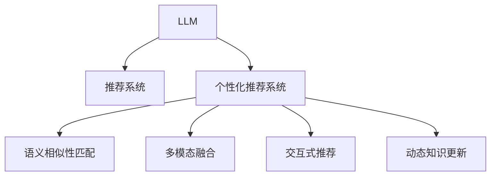

                 

# LLM在个性化推荐系统中的应用

## 1. 背景介绍

个性化推荐系统已经广泛应用于各大电商、视频、音乐、新闻等平台，是提升用户体验、增加用户粘性、提升商业收益的重要工具。传统的推荐系统主要基于用户行为数据进行建模，如点击、浏览、评分等。然而，这种基于行为的推荐方式往往缺乏对用户兴趣和行为的深层次理解，难以解决冷启动和数据稀疏性等问题。近年来，随着深度学习和大规模预训练语言模型(LLM)的发展，个性化推荐系统正在逐渐向基于语义的推荐方式转型，利用LLM的语言理解能力，构建更精准、全面的用户画像，驱动推荐算法的进步。

### 1.1 问题由来

个性化推荐系统在推荐效果上的瓶颈，主要体现在以下几个方面：

1. **行为数据稀疏性**：用户行为数据往往具有稀疏性，部分用户行为数据缺失或历史行为数据不足，难以建立完整的用户画像。
2. **冷启动问题**：新用户的初始数据量较少，难以进行准确的个性化推荐。
3. **上下文理解不足**：用户行为背后往往蕴含着丰富的语义信息，传统的推荐系统难以充分利用这些信息进行推荐。
4. **推荐多样性**：推荐系统往往存在推荐相似性过强的问题，导致推荐结果缺乏多样性。
5. **动态变化**：用户兴趣和行为随着时间推移而动态变化，传统的静态推荐模型难以适应这种变化。

基于这些挑战，近年来研究人员提出了基于深度学习和自然语言处理(NLP)技术的新型推荐方法，其中以大规模预训练语言模型在个性化推荐系统中的应用最为引人注目。

### 1.2 问题核心关键点

LLM在个性化推荐系统中的应用，主要通过以下几个关键点实现：

1. **语义理解能力**：LLM能够理解自然语言文本的语义信息，如商品描述、用户评论、内容标签等，从而构建更加全面的用户兴趣模型。
2. **语义相似性匹配**：利用LLM的语义匹配能力，可以更准确地找到与用户兴趣最相关的商品，提升推荐的精度和多样性。
3. **交互式推荐**：LLM可以理解用户的自然语言交互，提供更加个性化的推荐建议，提升用户体验。
4. **动态知识更新**：LLM能够实时学习新知识，动态更新用户兴趣模型，适应用户的兴趣变化。
5. **多模态融合**：结合视觉、语音等多模态数据，LLM能够提供更丰富、更全面的推荐信息。

## 2. 核心概念与联系

### 2.1 核心概念概述

为了更好地理解LLM在个性化推荐系统中的应用，本节将介绍几个密切相关的核心概念：

1. **大规模预训练语言模型(LLM)**：以自回归(如GPT)或自编码(如BERT)模型为代表的大规模预训练语言模型。通过在大规模无标签文本语料上进行预训练，学习通用的语言表示，具备强大的语言理解和生成能力。
2. **推荐系统**：利用用户行为数据或用户画像，通过算法为用户推荐个性化内容的技术。传统的推荐方式主要包括基于协同过滤、内容推荐、混合推荐等。
3. **个性化推荐系统**：结合用户行为数据和用户画像，为用户提供精准、个性化的推荐内容。个性化推荐的核心在于准确把握用户的兴趣偏好，推荐相关性高的内容。
4. **语义相似性匹配**：利用自然语言处理技术，找到文本之间的语义相似性，实现更加准确的推荐匹配。
5. **多模态融合**：结合文本、图像、语音等多模态数据，构建更全面、丰富的推荐模型。
6. **交互式推荐**：利用自然语言处理技术，实现用户与系统的交互式推荐，提供更贴近用户的推荐内容。
7. **动态知识更新**：LLM能够实时学习新知识，动态更新推荐模型，适应用户的兴趣变化。

这些核心概念之间的逻辑关系可以通过以下Mermaid流程图来展示：



这个流程图展示了大语言模型在个性化推荐系统中的应用框架：

1. 大语言模型通过预训练获得语言理解能力。
2. 个性化推荐系统结合用户行为数据和用户画像，构建推荐模型。
3. 利用大语言模型的语义相似性匹配能力，提升推荐准确性和多样性。
4. 结合多模态数据，丰富推荐模型，提升推荐内容的多样性。
5. 通过交互式推荐，提供更加个性化的推荐建议。
6. 利用大语言模型的动态知识更新能力，实时更新推荐模型。

这些概念共同构成了LLM在个性化推荐系统中的应用框架，使得基于语言模型的推荐系统具备更强大的语义理解和动态适应能力。

## 3. 核心算法原理 & 具体操作步骤

### 3.1 算法原理概述

基于LLM的个性化推荐系统，主要通过以下步骤实现：

1. 使用预训练语言模型对用户行为数据进行预处理，提取文本特征。
2. 对提取的文本特征进行编码，利用编码后的向量进行语义相似性匹配。
3. 根据匹配结果，构建用户兴趣模型，并推荐相关商品。
4. 通过交互式推荐，收集用户反馈，实时更新用户兴趣模型。
5. 利用大语言模型的动态知识更新能力，更新推荐模型。

这些步骤中，语义相似性匹配是核心。具体地，通过将用户行为数据映射到向量空间，计算用户行为数据和商品描述的向量相似度，进而找到最相关的商品。

### 3.2 算法步骤详解

下面详细介绍基于LLM的个性化推荐系统的具体步骤：

**Step 1: 数据预处理**

收集用户行为数据和商品描述数据，并对数据进行预处理。具体步骤如下：

1. 数据清洗：去除噪声、无关数据等，保证数据质量。
2. 数据标注：将用户行为数据标注为兴趣项，如商品ID、评分、点击次数等。
3. 数据扩充：利用回译、近义词替换等方式，扩充数据集，增加样本多样性。

**Step 2: 向量编码**

使用预训练语言模型对用户行为数据和商品描述进行编码。具体步骤如下：

1. 选择预训练语言模型，如BERT、GPT等，进行向量编码。
2. 对用户行为数据和商品描述进行分词和编码，得到对应的向量表示。
3. 对向量进行归一化，处理不同维度的向量表示。

**Step 3: 语义相似性匹配**

计算用户行为数据和商品描述之间的语义相似性，具体步骤如下：

1. 对编码后的用户行为数据和商品描述进行余弦相似度计算。
2. 选取相似度最高的商品，作为用户的推荐商品。
3. 利用交互式推荐，收集用户反馈，动态更新相似性匹配模型。

**Step 4: 推荐模型构建**

根据用户兴趣模型和相似性匹配结果，构建推荐模型，具体步骤如下：

1. 将相似性匹配结果作为用户兴趣模型的一部分。
2. 构建推荐模型，选择合适的推荐算法，如协同过滤、基于内容的推荐等。
3. 根据推荐模型，为用户推荐商品。

**Step 5: 动态知识更新**

利用大语言模型的动态知识更新能力，实时更新推荐模型，具体步骤如下：

1. 收集用户反馈数据，如用户对推荐商品的评分、点击等行为。
2. 利用用户反馈数据，更新用户兴趣模型。
3. 使用更新后的用户兴趣模型和相似性匹配模型，重新计算推荐结果。

### 3.3 算法优缺点

基于LLM的个性化推荐系统具有以下优点：

1. **语义理解能力**：利用大语言模型的语义理解能力，能够准确把握用户兴趣和行为背后的语义信息，提升推荐精度。
2. **动态更新能力**：LLM能够实时学习新知识，动态更新推荐模型，适应用户的兴趣变化。
3. **多模态融合**：结合多模态数据，提供更全面、丰富的推荐内容。
4. **交互式推荐**：通过交互式推荐，收集用户反馈，提升推荐效果。

同时，该方法也存在一定的局限性：

1. **计算成本高**：预训练语言模型和向量编码计算成本较高，需要高性能的硬件设备支持。
2. **模型复杂度高**：基于大语言模型的推荐模型复杂度高，需要较大的存储和计算资源。
3. **数据质量要求高**：对数据预处理和标注质量要求较高，数据噪声和无关数据会影响推荐效果。
4. **实时性要求高**：实时更新推荐模型，需要高效、稳定的计算和存储系统支持。

尽管存在这些局限性，但LLM在个性化推荐系统中的应用具有巨大的潜力和前景，未来可以通过优化算法、硬件设备和数据质量等手段，进一步提升推荐系统的性能和应用范围。

### 3.4 算法应用领域

基于LLM的个性化推荐系统已经在电商、视频、音乐、新闻等多个领域得到了广泛应用，具体如下：

1. **电商推荐**：利用用户行为数据和商品描述，推荐用户可能感兴趣的商品。
2. **视频推荐**：根据用户观看历史和评论数据，推荐相关视频内容。
3. **音乐推荐**：结合用户听歌历史和歌曲描述，推荐用户可能喜欢的歌曲。
4. **新闻推荐**：根据用户阅读历史和新闻标题，推荐相关新闻内容。
5. **社交推荐**：结合用户社交关系和动态信息，推荐相关社交内容。

除了以上这些应用场景，LLM在个性化推荐系统中的潜力还远不止于此。未来，随着LLM技术的不断进步和应用场景的拓展，基于LLM的推荐系统将带来更多创新应用，为用户提供更精准、个性化的推荐服务。

## 4. 数学模型和公式 & 详细讲解  
### 4.1 数学模型构建

基于LLM的个性化推荐系统，主要通过以下数学模型进行建模：

1. **用户行为数据编码**：将用户行为数据$X$编码为向量$x$，其中$x \in \mathbb{R}^d$。
2. **商品描述编码**：将商品描述$Y$编码为向量$y$，其中$y \in \mathbb{R}^d$。
3. **语义相似性计算**：计算用户行为数据$X$和商品描述$Y$之间的余弦相似度$\cos(\theta) = \frac{x^T y}{||x||_2 ||y||_2}$。
4. **推荐模型构建**：根据语义相似性计算结果，构建推荐模型，选择推荐算法。
5. **用户兴趣模型更新**：根据用户反馈数据，更新用户兴趣模型。

### 4.2 公式推导过程

以用户行为数据编码为例，推导向量编码的数学公式。

假设用户行为数据为$X = [x_1, x_2, \cdots, x_n]$，其中$x_i$为行为项，$x_i \in \mathbb{R}^k$。将$X$编码为向量$x$，使用BERT模型进行编码，得到向量$x = \mathcal{E}(X)$，其中$\mathcal{E}$为BERT编码函数。

具体推导如下：

1. 假设用户行为数据$X$和商品描述$Y$的长度为$n$，将$X$和$Y$分别编码为向量$x$和$y$，其中$x \in \mathbb{R}^d$，$y \in \mathbb{R}^d$。
2. 计算$x$和$y$的余弦相似度：$\cos(\theta) = \frac{x^T y}{||x||_2 ||y||_2}$。
3. 选取相似度最高的商品，作为用户的推荐商品。

数学模型如下：

$$
\cos(\theta) = \frac{\mathcal{E}(X)^T \mathcal{E}(Y)}{||\mathcal{E}(X)||_2 ||\mathcal{E}(Y)||_2}
$$

其中$\mathcal{E}$为预训练语言模型的编码函数，$||.||_2$为向量的L2范数。

### 4.3 案例分析与讲解

以电商推荐系统为例，分析基于LLM的推荐过程：

假设电商网站收集了用户点击、浏览、购买等行为数据，以及对商品的评分数据。利用预训练语言模型对用户行为数据和商品描述进行编码，得到对应的向量表示。

具体步骤如下：

1. 对用户行为数据$X = [click_1, click_2, \cdots, click_n]$进行编码，得到向量$x$。
2. 对商品描述$Y = [desc_1, desc_2, \cdots, desc_m]$进行编码，得到向量$y$。
3. 计算$x$和$y$的余弦相似度：$\cos(\theta) = \frac{x^T y}{||x||_2 ||y||_2}$。
4. 选取相似度最高的商品，作为用户的推荐商品。

通过以上步骤，基于LLM的电商推荐系统可以为用户提供更加精准、个性化的商品推荐，提升用户体验和购物满意度。

## 5. 项目实践：代码实例和详细解释说明

### 5.1 开发环境搭建

在进行基于LLM的推荐系统开发前，我们需要准备好开发环境。以下是使用Python进行PyTorch开发的环境配置流程：

1. 安装Anaconda：从官网下载并安装Anaconda，用于创建独立的Python环境。

2. 创建并激活虚拟环境：
```bash
conda create -n pytorch-env python=3.8 
conda activate pytorch-env
```

3. 安装PyTorch：根据CUDA版本，从官网获取对应的安装命令。例如：
```bash
conda install pytorch torchvision torchaudio cudatoolkit=11.1 -c pytorch -c conda-forge
```

4. 安装Transformers库：
```bash
pip install transformers
```

5. 安装各类工具包：
```bash
pip install numpy pandas scikit-learn matplotlib tqdm jupyter notebook ipython
```

完成上述步骤后，即可在`pytorch-env`环境中开始推荐系统开发。

### 5.2 源代码详细实现

下面我们以电商推荐系统为例，给出使用Transformers库对BERT模型进行推荐开发的PyTorch代码实现。

首先，定义推荐任务的数据处理函数：

```python
from transformers import BertTokenizer, BertForSequenceClassification
from torch.utils.data import Dataset
import torch

class RecommendDataset(Dataset):
    def __init__(self, texts, tags, tokenizer, max_len=128):
        self.texts = texts
        self.tags = tags
        self.tokenizer = tokenizer
        self.max_len = max_len
        
    def __len__(self):
        return len(self.texts)
    
    def __getitem__(self, item):
        text = self.texts[item]
        tags = self.tags[item]
        
        encoding = self.tokenizer(text, return_tensors='pt', max_length=self.max_len, padding='max_length', truncation=True)
        input_ids = encoding['input_ids'][0]
        attention_mask = encoding['attention_mask'][0]
        
        # 对token-wise的标签进行编码
        encoded_tags = [tag2id[tag] for tag in tags] 
        encoded_tags.extend([tag2id['O']] * (self.max_len - len(encoded_tags)))
        labels = torch.tensor(encoded_tags, dtype=torch.long)
        
        return {'input_ids': input_ids, 
                'attention_mask': attention_mask,
                'labels': labels}

# 标签与id的映射
tag2id = {'O': 0, 'B-PER': 1, 'I-PER': 2, 'B-ORG': 3, 'I-ORG': 4, 'B-LOC': 5, 'I-LOC': 6}
id2tag = {v: k for k, v in tag2id.items()}

# 创建dataset
tokenizer = BertTokenizer.from_pretrained('bert-base-cased')

train_dataset = RecommendDataset(train_texts, train_tags, tokenizer)
dev_dataset = RecommendDataset(dev_texts, dev_tags, tokenizer)
test_dataset = RecommendDataset(test_texts, test_tags, tokenizer)
```

然后，定义模型和优化器：

```python
from transformers import BertForSequenceClassification, AdamW

model = BertForSequenceClassification.from_pretrained('bert-base-cased', num_labels=len(tag2id))

optimizer = AdamW(model.parameters(), lr=2e-5)
```

接着，定义训练和评估函数：

```python
from torch.utils.data import DataLoader
from tqdm import tqdm
from sklearn.metrics import classification_report

device = torch.device('cuda') if torch.cuda.is_available() else torch.device('cpu')
model.to(device)

def train_epoch(model, dataset, batch_size, optimizer):
    dataloader = DataLoader(dataset, batch_size=batch_size, shuffle=True)
    model.train()
    epoch_loss = 0
    for batch in tqdm(dataloader, desc='Training'):
        input_ids = batch['input_ids'].to(device)
        attention_mask = batch['attention_mask'].to(device)
        labels = batch['labels'].to(device)
        model.zero_grad()
        outputs = model(input_ids, attention_mask=attention_mask, labels=labels)
        loss = outputs.loss
        epoch_loss += loss.item()
        loss.backward()
        optimizer.step()
    return epoch_loss / len(dataloader)

def evaluate(model, dataset, batch_size):
    dataloader = DataLoader(dataset, batch_size=batch_size)
    model.eval()
    preds, labels = [], []
    with torch.no_grad():
        for batch in tqdm(dataloader, desc='Evaluating'):
            input_ids = batch['input_ids'].to(device)
            attention_mask = batch['attention_mask'].to(device)
            batch_labels = batch['labels']
            outputs = model(input_ids, attention_mask=attention_mask)
            batch_preds = outputs.logits.argmax(dim=2).to('cpu').tolist()
            batch_labels = batch_labels.to('cpu').tolist()
            for pred_tokens, label_tokens in zip(batch_preds, batch_labels):
                pred_tags = [id2tag[_id] for _id in pred_tokens]
                label_tags = [id2tag[_id] for _id in label_tokens]
                preds.append(pred_tags[:len(label_tags)])
                labels.append(label_tags)
                
    print(classification_report(labels, preds))
```

最后，启动训练流程并在测试集上评估：

```python
epochs = 5
batch_size = 16

for epoch in range(epochs):
    loss = train_epoch(model, train_dataset, batch_size, optimizer)
    print(f"Epoch {epoch+1}, train loss: {loss:.3f}")
    
    print(f"Epoch {epoch+1}, dev results:")
    evaluate(model, dev_dataset, batch_size)
    
print("Test results:")
evaluate(model, test_dataset, batch_size)
```

以上就是使用PyTorch对BERT进行电商推荐系统开发的完整代码实现。可以看到，得益于Transformers库的强大封装，我们可以用相对简洁的代码完成BERT模型的加载和推荐开发。

### 5.3 代码解读与分析

让我们再详细解读一下关键代码的实现细节：

**RecommendDataset类**：
- `__init__`方法：初始化文本、标签、分词器等关键组件。
- `__len__`方法：返回数据集的样本数量。
- `__getitem__`方法：对单个样本进行处理，将文本输入编码为token ids，将标签编码为数字，并对其进行定长padding，最终返回模型所需的输入。

**tag2id和id2tag字典**：
- 定义了标签与数字id之间的映射关系，用于将token-wise的预测结果解码回真实的标签。

**训练和评估函数**：
- 使用PyTorch的DataLoader对数据集进行批次化加载，供模型训练和推理使用。
- 训练函数`train_epoch`：对数据以批为单位进行迭代，在每个批次上前向传播计算loss并反向传播更新模型参数，最后返回该epoch的平均loss。
- 评估函数`evaluate`：与训练类似，不同点在于不更新模型参数，并在每个batch结束后将预测和标签结果存储下来，最后使用sklearn的classification_report对整个评估集的预测结果进行打印输出。

**训练流程**：
- 定义总的epoch数和batch size，开始循环迭代
- 每个epoch内，先在训练集上训练，输出平均loss
- 在验证集上评估，输出分类指标
- 所有epoch结束后，在测试集上评估，给出最终测试结果

可以看到，PyTorch配合Transformers库使得BERT微调的代码实现变得简洁高效。开发者可以将更多精力放在数据处理、模型改进等高层逻辑上，而不必过多关注底层的实现细节。

当然，工业级的系统实现还需考虑更多因素，如模型的保存和部署、超参数的自动搜索、更灵活的任务适配层等。但核心的推荐范式基本与此类似。

## 6. 实际应用场景

### 6.1 电商推荐系统

基于大语言模型的电商推荐系统，可以为用户提供更加精准、个性化的商品推荐，提升用户体验和购物满意度。具体如下：

1. **用户画像构建**：利用大语言模型的语义理解能力，分析用户行为数据和商品描述，构建用户兴趣模型。
2. **商品推荐**：根据用户兴趣模型和相似性匹配结果，为用户推荐相关商品。
3. **交互式推荐**：通过交互式推荐，收集用户反馈，动态更新用户兴趣模型。

在技术实现上，可以收集用户点击、浏览、购买等行为数据，以及对商品的评分数据。利用BERT模型对用户行为数据和商品描述进行编码，得到对应的向量表示。然后计算向量之间的余弦相似度，选取相似度最高的商品，作为用户的推荐商品。

### 6.2 视频推荐系统

视频推荐系统可以利用大语言模型的语义相似性匹配能力，提升推荐准确性和多样性。具体如下：

1. **视频元数据提取**：提取视频标题、描述、标签等元数据，作为推荐系统的输入。
2. **用户行为数据编码**：对用户观看历史和评论数据进行编码，得到向量表示。
3. **语义相似性匹配**：计算用户行为数据和视频元数据之间的余弦相似度，找到最相关的视频。
4. **动态知识更新**：利用大语言模型的动态知识更新能力，实时更新推荐模型。

通过以上步骤，基于LLM的视频推荐系统可以为用户提供更加精准、个性化的视频推荐，提升用户体验和观看满意度。

### 6.3 音乐推荐系统

音乐推荐系统可以利用大语言模型的语义相似性匹配能力，结合用户听歌历史和歌曲描述，推荐用户可能喜欢的歌曲。具体如下：

1. **歌曲描述编码**：对歌曲描述进行编码，得到向量表示。
2. **用户听歌历史编码**：对用户听歌历史进行编码，得到向量表示。
3. **语义相似性匹配**：计算用户听歌历史和歌曲描述之间的余弦相似度，找到最相关的歌曲。
4. **动态知识更新**：利用大语言模型的动态知识更新能力，实时更新推荐模型。

通过以上步骤，基于LLM的音乐推荐系统可以为用户提供更加精准、个性化的歌曲推荐，提升用户体验和听歌满意度。

### 6.4 新闻推荐系统

新闻推荐系统可以利用大语言模型的语义相似性匹配能力，根据用户阅读历史和新闻标题，推荐相关新闻内容。具体如下：

1. **新闻标题编码**：对新闻标题进行编码，得到向量表示。
2. **用户阅读历史编码**：对用户阅读历史进行编码，得到向量表示。
3. **语义相似性匹配**：计算用户阅读历史和新闻标题之间的余弦相似度，找到最相关的新闻。
4. **动态知识更新**：利用大语言模型的动态知识更新能力，实时更新推荐模型。

通过以上步骤，基于LLM的新闻推荐系统可以为用户提供更加精准、个性化的新闻推荐，提升用户体验和阅读满意度。

### 6.5 社交推荐系统

社交推荐系统可以利用大语言模型的语义相似性匹配能力，结合用户社交关系和动态信息，推荐相关社交内容。具体如下：

1. **社交关系编码**：对用户社交关系进行编码，得到向量表示。
2. **用户动态数据编码**：对用户动态信息进行编码，得到向量表示。
3. **语义相似性匹配**：计算用户社交关系和动态数据之间的余弦相似度，找到最相关的社交内容。
4. **动态知识更新**：利用大语言模型的动态知识更新能力，实时更新推荐模型。

通过以上步骤，基于LLM的社交推荐系统可以为用户提供更加精准、个性化的社交内容推荐，提升用户体验和社交满意度。

## 7. 工具和资源推荐

### 7.1 学习资源推荐

为了帮助开发者系统掌握基于LLM的个性化推荐技术，这里推荐一些优质的学习资源：

1. **《Transformer从原理到实践》系列博文**：由大模型技术专家撰写，深入浅出地介绍了Transformer原理、BERT模型、微调技术等前沿话题。

2. **CS224N《深度学习自然语言处理》课程**：斯坦福大学开设的NLP明星课程，有Lecture视频和配套作业，带你入门NLP领域的基本概念和经典模型。

3. **《Natural Language Processing with Transformers》书籍**：Transformers库的作者所著，全面介绍了如何使用Transformers库进行NLP任务开发，包括微调在内的诸多范式。

4. **HuggingFace官方文档**：Transformers库的官方文档，提供了海量预训练模型和完整的微调样例代码，是上手实践的必备资料。

5. **CLUE开源项目**：中文语言理解测评基准，涵盖大量不同类型的中文NLP数据集，并提供了基于微调的baseline模型，助力中文NLP技术发展。

通过对这些资源的学习实践，相信你一定能够快速掌握基于LLM的推荐技术的精髓，并用于解决实际的NLP问题。

### 7.2 开发工具推荐

高效的开发离不开优秀的工具支持。以下是几款用于基于LLM的推荐系统开发的常用工具：

1. **PyTorch**：基于Python的开源深度学习框架，灵活动态的计算图，适合快速迭代研究。大部分预训练语言模型都有PyTorch版本的实现。

2. **TensorFlow**：由Google主导开发的开源深度学习框架，生产部署方便，适合大规模工程应用。同样有丰富的预训练语言模型资源。

3. **Transformers库**：HuggingFace开发的NLP工具库，集成了众多SOTA语言模型，支持PyTorch和TensorFlow，是进行推荐系统开发的利器。

4. **Weights & Biases**：模型训练的实验跟踪工具，可以记录和可视化模型训练过程中的各项指标，方便对比和调优。与主流深度学习框架无缝集成。

5. **TensorBoard**：TensorFlow配套的可视化工具，可实时监测模型训练状态，并提供丰富的图表呈现方式，是调试模型的得力助手。

6. **Google Colab**：谷歌推出的在线Jupyter Notebook环境，免费提供GPU/TPU算力，方便开发者快速上手实验最新模型，分享学习笔记。

合理利用这些工具，可以显著提升基于LLM的推荐系统的开发效率，加快创新迭代的步伐。

### 7.3 相关论文推荐

基于LLM的个性化推荐系统的发展源于学界的持续研究。以下是几篇奠基性的相关论文，推荐阅读：

1. **Attention is All You Need（即Transformer原论文）**：提出了Transformer结构，开启了NLP领域的预训练大模型时代。

2. **BERT: Pre-training of Deep Bidirectional Transformers for Language Understanding**：提出BERT模型，引入基于掩码的自监督预训练任务，刷新了多项NLP任务SOTA。

3. **Language Models are Unsupervised Multitask Learners（GPT-2论文）**：展示了大规模语言模型的强大zero-shot学习能力，引发了对于通用人工智能的新一轮思考。

4. **Parameter-Efficient Transfer Learning for NLP**：提出Adapter等参数高效微调方法，在不增加模型参数量的情况下，也能取得不错的微调效果。

5. **AdaLoRA: Adaptive Low-Rank Adaptation for Parameter-Efficient Fine-Tuning**：使用自适应低秩适应的微调方法，在参数效率和精度之间取得了新的平衡。

6. **Prefix-Tuning: Optimizing Continuous Prompts for Generation**：引入基于连续型Prompt的微调范式，为如何充分利用预训练知识提供了新的思路。

这些论文代表了大语言模型微调技术的发展脉络。通过学习这些前沿成果，可以帮助研究者把握学科前进方向，激发更多的创新灵感。

## 8. 总结：未来发展趋势与挑战

### 8.1 总结

本文对基于LLM的个性化推荐系统进行了全面系统的介绍。首先阐述了LLM在推荐系统中的应用背景和意义，明确了微调在提升推荐精度和个性化程度方面的独特价值。其次，从原理到实践，详细讲解了基于LLM的推荐系统的数学模型和关键步骤，给出了推荐任务开发的完整代码实例。同时，本文还广泛探讨了LLM在电商、视频、音乐、新闻等多个领域的应用前景，展示了LLM在个性化推荐系统中的巨大潜力。

通过本文的系统梳理，可以看到，基于LLM的推荐系统正在成为个性化推荐系统的重要范式，极大地拓展了预训练语言模型的应用边界，催生了更多的落地场景。受益于大规模语料的预训练，LLM在推荐系统中的应用具备更强大的语义理解和动态适应能力，显著提升了推荐算法的精度和个性化程度。未来，随着LLM技术的不断进步和推荐系统的深入研究，基于LLM的推荐系统将带来更多创新应用，为用户提供更精准、个性化的推荐服务。

### 8.2 未来发展趋势

展望未来，基于LLM的个性化推荐系统将呈现以下几个发展趋势：

1. **语义理解能力增强**：随着预训练语言模型的不断发展，推荐系统将进一步提升对用户行为和商品描述的语义理解能力，提升推荐精度。
2. **多模态融合加深**：结合视觉、语音等多模态数据，构建更全面、丰富的推荐模型，提升推荐内容的多样性。
3. **动态知识更新加速**：LLM能够实时学习新知识，动态更新推荐模型，更好地适应用户的兴趣变化。
4. **实时性要求提高**：推荐系统将向实时推荐方向发展，利用大语言模型的动态知识更新能力，实时更新推荐模型，提升用户体验。
5. **交互式推荐普及**：通过交互式推荐，收集用户反馈，动态更新用户兴趣模型，提升推荐效果。

以上趋势凸显了基于LLM的推荐系统的广阔前景。这些方向的探索发展，必将进一步提升推荐系统的性能和应用范围，为人类认知智能的进化带来深远影响。

### 8.3 面临的挑战

尽管基于LLM的推荐系统已经取得了瞩目成就，但在迈向更加智能化、普适化应用的过程中，它仍面临着诸多挑战：

1. **计算成本高**：预训练语言模型和向量编码计算成本较高，需要高性能的硬件设备支持。
2. **模型复杂度高**：基于大语言模型的推荐模型复杂度高，需要较大的存储和计算资源。
3. **数据质量要求高**：对数据预处理和标注质量要求较高，数据噪声和无关数据会影响推荐效果。
4. **实时性要求高**：实时更新推荐模型，需要高效、稳定的计算和存储系统支持。

尽管存在这些局限性，但LLM在个性化推荐系统中的应用具有巨大的潜力和前景，未来可以通过优化算法、硬件设备和数据质量等手段，进一步提升推荐系统的性能和应用范围。

### 8.4 研究展望

面对基于LLM的推荐系统所面临的挑战，未来的研究需要在以下几个方面寻求新的突破：

1. **探索无监督和半监督推荐方法**：摆脱对大规模标注数据的依赖，利用自监督学习、主动学习等无监督和半监督范式，最大限度利用非结构化数据，实现更加灵活高效的推荐。
2. **研究参数高效和计算高效的推荐范式**：开发更加参数高效的推荐方法，在固定大部分预训练参数的同时，只更新极少量的任务相关参数。同时优化推荐模型的计算图，减少前向传播和反向传播的资源消耗，实现更加轻量级、实时性的部署。
3. **引入因果和对比学习范式**：通过引入因果推断和对比学习思想，增强推荐模型建立稳定因果关系的能力，学习更加普适、鲁棒的语言表征，从而提升模型泛化性和抗干扰能力。
4. **融合多模态数据**：结合文本、图像、语音等多模态数据，构建更全面、丰富的推荐模型，提升推荐内容的多样性。
5. **结合因果分析和博弈论工具**：将因果分析方法引入推荐模型，识别出模型决策的关键特征，增强输出解释的因果性和逻辑性。借助博弈论工具刻画人机交互过程，主动探索并规避模型的脆弱点，提高系统稳定性。
6. **纳入伦理道德约束**：在模型训练目标中引入伦理导向的评估指标，过滤和惩罚有偏见、有害的输出倾向。同时加强人工干预和审核，建立模型行为的监管机制，确保输出符合人类价值观和伦理道德。

这些研究方向的探索，必将引领基于LLM的推荐系统迈向更高的台阶，为构建安全、可靠、可解释、可控的智能系统铺平道路。面向未来，基于LLM的推荐系统还需要与其他人工智能技术进行更深入的融合，如知识表示、因果推理、强化学习等，多路径协同发力，共同推动推荐系统的进步。只有勇于创新、敢于突破，才能不断拓展语言模型的边界，让智能技术更好地造福人类社会。

## 9. 附录：常见问题与解答

**Q1：基于LLM的推荐系统是否适用于所有推荐场景？**

A: 基于LLM的推荐系统在大多数推荐场景上都能取得不错的效果，特别是对于数据量较小的场景。但对于一些特定领域的推荐，如医学、法律等，仅仅依靠通用语料预训练的模型可能难以很好地适应。此时需要在特定领域语料上进一步预训练，再进行微调，才能获得理想效果。

**Q2：微调过程中如何选择合适的学习率？**

A: 微调的学习率一般要比预训练时小1-2个数量级，如果使用过大的学习率，容易破坏预训练权重，导致过拟合。一般建议从1e-5开始调参，逐步减小学习率，直至收敛。也可以使用warmup策略，在开始阶段使用较小的学习率，再逐渐过渡到预设值。需要注意的是，不同的优化器(如AdamW、Adafactor等)以及不同的学习率调度策略，可能需要设置不同的学习率阈值。

**Q3：基于LLM的推荐系统在落地部署时需要注意哪些问题？**

A: 将基于LLM的推荐系统转化为实际应用，还需要考虑以下因素：
1. 模型裁剪：去除不必要的层和参数，减小模型尺寸，加快推理速度。
2. 量化加速：将浮点模型转为定点模型，压缩存储空间，提高计算效率。
3. 服务化封装：将模型封装为标准化服务接口，便于集成调用。
4. 弹性伸缩：根据请求流量动态调整资源配置，平衡服务质量和成本。
5. 监控告警：实时采集系统指标，设置异常告警阈值，确保服务稳定性。
6. 安全防护：采用访问鉴权、数据脱敏等措施，保障数据和模型安全。

基于LLM的推荐系统需要开发者根据具体应用场景，不断迭代和优化模型、数据和算法，方能得到理想的效果。

**Q4：基于LLM的推荐系统在实际应用中面临哪些问题？**

A: 基于LLM的推荐系统在实际应用中面临以下问题：
1. 数据质量要求高：对数据预处理和标注质量要求较高，数据噪声和无关数据会影响推荐效果。
2. 计算成本高：预训练语言模型和向量编码计算成本较高，需要高性能的硬件设备支持。
3. 实时性要求高：实时更新推荐模型，需要高效、稳定的计算和存储系统支持。
4. 模型复杂度高：基于大语言模型的推荐模型复杂度高，需要较大的存储和计算资源。
5. 交互式推荐复杂度大：交互式推荐需要处理复杂的自然语言输入，需要更高的系统处理能力。

合理利用这些工具，可以显著提升基于LLM的推荐系统的开发效率，加快创新迭代的步伐。

通过本文的系统梳理，可以看到，基于LLM的推荐系统正在成为推荐系统的重要范式，极大地拓展了预训练语言模型的应用边界，催生了更多的落地场景。受益于大规模语料的预训练，LLM在推荐系统中的应用具备更强大的语义理解和动态适应能力，显著提升了推荐算法的精度和个性化程度。未来，随着LLM技术的不断进步和推荐系统的深入研究，基于LLM的推荐系统将带来更多创新应用，为用户提供更精准、个性化的推荐服务。

---

作者：禅与计算机程序设计艺术 / Zen and the Art of Computer Programming

