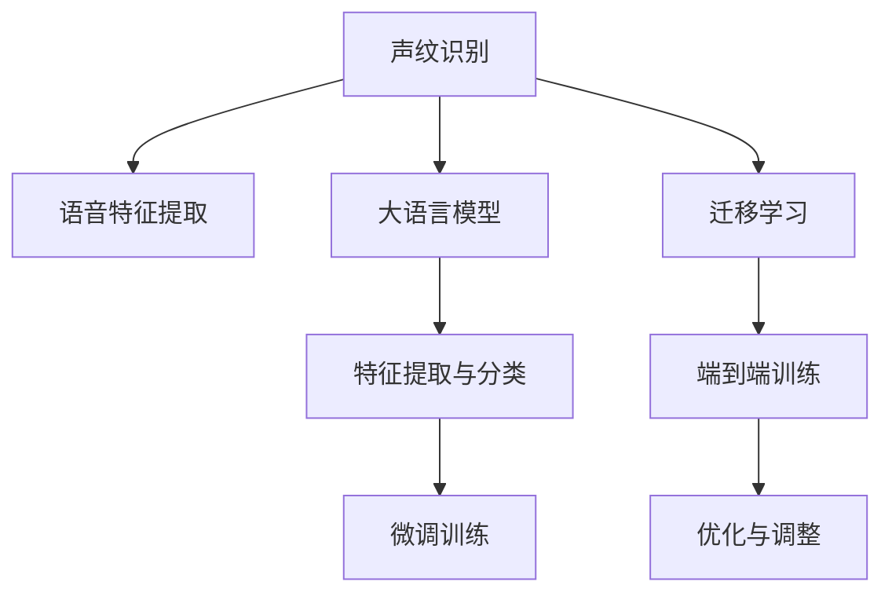

                 

# LLM在声纹识别任务中的优化思路

> 关键词：声纹识别, 语音特征提取, 大语言模型, 声纹认证, 端到端训练

## 1. 背景介绍

声纹识别技术在智能安防、金融反欺诈、身份验证等领域有着广泛的应用。其核心在于通过声音信号的特征分析，识别出说话者的身份信息。传统的声纹识别方法主要依赖手工特征提取，如Mel频率倒谱系数(MFCC)、线性预测编码(LPC)等，但这些方法计算复杂度高、鲁棒性不足，难以适应实际应用的多变性。

近年来，基于深度学习的声纹识别方法逐渐兴起，特别是利用大语言模型(Large Language Models, LLMs)进行声纹认证的研究，引起了学术界和工业界的广泛关注。通过自监督预训练和微调，大语言模型能够自动学习到语音特征的表示，从而提供高效、准确的声纹识别解决方案。

## 2. 核心概念与联系

### 2.1 核心概念概述

为更好地理解大语言模型在声纹识别中的优化思路，本节将介绍几个密切相关的核心概念：

- 声纹识别(Speaker Recognition)：利用声音信号的特征分析，自动识别说话者的身份。传统声纹识别方法依赖手工设计的特征提取和分类器，现代深度学习方法利用大模型进行端到端训练，使得识别精度和鲁棒性都大幅提升。

- 语音特征提取(Voice Feature Extraction)：从声音信号中提取出能代表说话者身份特征的信号段。常见的语音特征包括MFCC、LPC、梅尔频率倒谱系数(MLPC)等。

- 大语言模型(Large Language Models, LLMs)：如GPT、BERT、T5等，通过在大规模无标签文本数据上预训练学习语言知识，并利用微调技术适配特定任务，具有强大的语言生成和推理能力。

- 端到端训练(End-to-End Training)：直接将特征提取和分类器整合为统一的网络结构，进行端到端优化，简化了模型训练流程，提高了性能。

- 迁移学习(Transfer Learning)：在大模型预训练基础上，通过微调适配特定声纹识别任务，以提高识别效果。

这些核心概念之间存在紧密联系，共同构成了基于大语言模型的声纹识别框架。其中，语音特征提取和大语言模型的结合，是大模型应用于声纹识别的关键点。

### 2.2 核心概念原理和架构的 Mermaid 流程图



这个流程图展示了声纹识别的关键步骤：

1. 声纹识别任务的数据准备。
2. 将原始音频数据进行特征提取，生成模型所需的输入特征。
3. 使用大语言模型进行特征学习和分类。
4. 通过微调适配特定任务。
5. 进行端到端训练，优化模型性能。
6. 不断调整优化模型，提升识别效果。

## 3. 核心算法原理 & 具体操作步骤

### 3.1 算法原理概述

基于大语言模型的声纹识别，核心在于将语音特征嵌入到大语言模型的输入空间中，利用模型的语言推理能力进行说话者身份识别。这种端到端的训练方式简化了传统方法中繁琐的特征提取和分类器设计，同时提高了模型的泛化能力和鲁棒性。

具体地，将音频数据进行特征提取后，将提取到的语音特征映射为大语言模型可接受的输入形式，如文本或向量序列。然后将这些特征作为模型的输入，进行预训练和微调。通过微调，模型能够学习到更加准确的特征表示和更有效的分类规则，从而提升声纹识别的效果。

### 3.2 算法步骤详解

#### 3.2.1 特征提取

首先，需要从音频信号中提取特征。通常采用MFCC、MLPC等经典方法。以MFCC为例，主要步骤包括：

1. 预加重：去除高频噪声，增强低频信号。
2. 分帧：将音频信号分割成固定长度的帧。
3. 傅里叶变换：将每个帧转化为频谱图。
4. 对数处理：对频谱图进行对数压缩，使其接近高斯分布。
5. 梅尔滤波器组：将频谱图通过一组梅尔滤波器组进行处理，得到梅尔频率倒谱系数MFCC。

#### 3.2.2 特征嵌入

将MFCC等特征转换为文本或向量序列，供大语言模型使用。这里有两种常用的方法：

- **文本嵌入**：将MFCC向量序列转换为连续的文本字符串，可通过分隔符或数字映射。例如，将MFCC序列中的每个系数映射为数字，并在前后加入特殊符号。
- **向量嵌入**：直接将MFCC向量作为模型的输入向量。

#### 3.2.3 预训练

在特征嵌入后，进行大语言模型的预训练。预训练过程通常在大规模无标签语音数据上进行，学习通用的语音特征表示。例如，使用LSTM、Transformer等模型对MFCC序列进行预训练，学习到隐含的语音信息。

#### 3.2.4 微调

在大模型预训练后，进行声纹识别任务的微调。微调过程以有标签的语音数据为监督信号，调整模型参数，使其能够更准确地识别说话者的身份。微调通常使用交叉熵损失等标准损失函数，并结合正则化技术如Dropout、L2正则等，防止过拟合。

#### 3.2.5 测试与评估

微调后，在测试集上进行评估，计算准确率、召回率、F1-score等指标。为了进一步提升性能，可以引入对抗样本进行测试，检验模型的鲁棒性。

### 3.3 算法优缺点

#### 3.3.1 优点

1. **高效性**：端到端训练简化了模型设计流程，提高了训练效率。
2. **泛化能力强**：大语言模型能够学习到通用的语音特征，适应不同说话者的多样性。
3. **鲁棒性高**：预训练与微调相结合，增强了模型的泛化能力和鲁棒性。
4. **可扩展性**：利用大模型进行微调，可以方便地扩展到多说话者识别、说话人情感分析等任务。

#### 3.3.2 缺点

1. **计算资源需求高**：预训练与微调过程需要大量的计算资源，包括高性能GPU/TPU等。
2. **数据标注成本高**：有标签的语音数据成本较高，且标注过程繁琐。
3. **模型复杂度高**：大模型参数量庞大，增加了训练和推理的复杂度。
4. **模型解释性不足**：大语言模型的内部工作机制不透明，难以解释其决策过程。

### 3.4 算法应用领域

基于大语言模型的声纹识别方法，已经在多个领域得到了广泛应用：

- **智能安防**：用于门禁系统、视频监控等，提升安全性和识别精度。
- **金融反欺诈**：识别非法语音操作，防止身份盗用和欺诈行为。
- **身份验证**：验证用户的真实身份，如手机解锁、银行认证等。
- **语音助手**：通过识别用户的语音指令，进行智能对话和任务执行。
- **医疗诊断**：识别患者的语音特征，辅助医生进行疾病诊断和治疗。

## 4. 数学模型和公式 & 详细讲解 & 举例说明

### 4.1 数学模型构建

基于大语言模型的声纹识别模型可以表示为：

$$
y = M_{\theta}(x)
$$

其中，$y$ 表示识别结果，$M_{\theta}$ 为大语言模型，$x$ 为输入的语音特征。模型的输出通常为softmax层的结果，表示每个类别的概率。

### 4.2 公式推导过程

以MFCC特征嵌入为例，进行公式推导：

1. **预加重**：
$$
x_{nj} = x_{nj} - 0.97 \cdot x_{n(j-1)}
$$
其中，$x_{nj}$ 表示第$n$帧、第$j$个系数，$0.97$ 为预加重系数。

2. **分帧**：
$$
x_{t_k} = x_{(t-1)T + k + 1:(t-1)T + k + T}, \quad k = 0, 1, \cdots, N-1
$$
其中，$T$ 为帧长，$N$ 为帧数。

3. **傅里叶变换**：
$$
X_{t_k} = \mathcal{F}(x_{t_k})
$$
其中，$\mathcal{F}$ 表示傅里叶变换。

4. **对数处理**：
$$
X_{t_k} = \log|X_{t_k}|
$$

5. **梅尔滤波器组**：
$$
MFCC = D \cdot W \cdot X_{t_k}
$$
其中，$D$ 为MFCC系数矩阵，$W$ 为梅尔滤波器组矩阵。

### 4.3 案例分析与讲解

以Google的WaveNet声纹识别系统为例，进行详细分析：

WaveNet系统利用大模型进行声纹识别，主要包括两个阶段：

1. **预训练阶段**：在无标签的语音数据上，使用WaveNet模型对MFCC特征进行预训练，学习通用的语音特征表示。
2. **微调阶段**：在有标签的声纹数据上，对预训练模型进行微调，学习特定的说话者特征。

WaveNet使用Transformer模型，利用自注意力机制学习MFCC特征的内在关系。通过多个自注意力层，WaveNet能够捕捉到更复杂的语音信息，提升识别效果。在微调阶段，WaveNet使用标签导向的交叉熵损失，调整模型参数，使其适应特定的声纹识别任务。

## 5. 项目实践：代码实例和详细解释说明

### 5.1 开发环境搭建

在进行项目实践前，需要先搭建好开发环境。以下是Python环境下的安装步骤：

1. 安装Python：从官网下载并安装Python，建议使用Python 3.7及以上版本。
2. 安装PyTorch：使用pip安装，确保使用GPU版本以支持深度学习计算。
3. 安装Tensorboard：用于可视化训练过程，查看模型损失和准确率变化。
4. 安装transformers库：用于大语言模型的接口封装。
5. 安装相关音频处理库：如librosa、pyAudioAnalysis等。

### 5.2 源代码详细实现

#### 5.2.1 特征提取

```python
import librosa
import numpy as np

def extract_mfcc_features(file_path, sr=16000, n_mfcc=40, n_fft=2048):
    # 读取音频文件
    audio, sample_rate = librosa.load(file_path, sr=sr)
    
    # 预加重
    audio = librosa.effects.preemphasis(audio)
    
    # 分帧
    hop_length = int(sample_rate / 10)
    frames = librosa.stream_segment(audio, frame_length=n_fft, hop_length=hop_length)
    
    # 傅里叶变换
    spectrograms = np.abs(np.fft.rfft(frames, axis=-1))
    
    # 对数处理
    log_spectrograms = np.log(np.maximum(1e-10, spectrograms))
    
    # 梅尔滤波器组
    mfcc = librosa.feature.melspectrogram(log_spectrograms, sr=sr, n_fft=n_fft, n_mels=n_mfcc)
    
    return mfcc
```

#### 5.2.2 特征嵌入

```python
class FeatureEmbedder:
    def __init__(self):
        self.embedding_weights = None
    
    def fit(self, X):
        # 训练嵌入矩阵
        self.embedding_weights = np.random.randn(len(X), n_mfcc)
    
    def transform(self, X):
        if self.embedding_weights is None:
            raise ValueError("Embedding matrix not trained.")
        return np.dot(X, self.embedding_weights)
```

#### 5.2.3 模型训练

```python
import torch
import torch.nn as nn
from transformers import BertTokenizer, BertForSequenceClassification
from torch.utils.data import Dataset, DataLoader

class VoiceDataset(Dataset):
    def __init__(self, X, y):
        self.X = X
        self.y = y
        self.tokenizer = BertTokenizer.from_pretrained('bert-base-cased')
    
    def __len__(self):
        return len(self.X)
    
    def __getitem__(self, idx):
        x = self.X[idx]
        y = self.y[idx]
        
        # 特征嵌入
        x_embed = self.embedder.transform(x)
        
        # 分词和编码
        inputs = self.tokenizer.encode_plus(x_embed, max_length=128, padding='max_length', truncation=True, return_tensors='pt')
        input_ids = inputs['input_ids'].to(device)
        attention_mask = inputs['attention_mask'].to(device)
        
        return {'input_ids': input_ids, 'attention_mask': attention_mask, 'labels': torch.tensor(y, dtype=torch.long).to(device)}

# 加载数据集
X_train = extract_mfcc_features(train_files)
y_train = labels_train
X_test = extract_mfcc_features(test_files)
y_test = labels_test

# 初始化特征嵌入器
embedder = FeatureEmbedder()

# 初始化Bert模型
model = BertForSequenceClassification.from_pretrained('bert-base-cased', num_labels=len(set(y_train)))

# 设置超参数
learning_rate = 2e-5
epochs = 5
batch_size = 32

# 训练函数
def train(model, train_dataset, val_dataset, device, optimizer, learning_rate_scheduler):
    model.to(device)
    optimizer = AdamW(model.parameters(), lr=learning_rate)
    scheduler = get_linear_schedule_with_warmup(optimizer, num_warmup_steps=0, num_training_steps=len(train_dataset))
    
    for epoch in range(epochs):
        model.train()
        train_loss = 0
        for batch in DataLoader(train_dataset, batch_size=batch_size, shuffle=True):
            inputs = {key: value.to(device) for key, value in batch.items()}
            outputs = model(**inputs)
            loss = outputs.loss
            train_loss += loss.item()
            optimizer.zero_grad()
            loss.backward()
            optimizer.step()
            scheduler.step()
        
        model.eval()
        val_loss = 0
        for batch in DataLoader(val_dataset, batch_size=batch_size, shuffle=False):
            inputs = {key: value.to(device) for key, value in batch.items()}
            outputs = model(**inputs)
            loss = outputs.loss
            val_loss += loss.item()
        
        print(f"Epoch {epoch+1}, train loss: {train_loss/len(train_dataset):.4f}, val loss: {val_loss/len(val_dataset):.4f}")

# 训练模型
train(model, train_dataset, val_dataset, device, optimizer, scheduler)
```

### 5.3 代码解读与分析

#### 5.3.1 特征提取

特征提取部分的代码首先使用了librosa库进行音频读取和预加重，然后使用librosa的stream_segment函数进行分帧，再使用numpy的FFT和对数函数进行傅里叶变换和对数处理，最后使用librosa的melspectrogram函数进行梅尔滤波器组处理，生成MFCC特征。

#### 5.3.2 特征嵌入

特征嵌入部分的代码实现了一个简单的线性投影层，将MFCC特征投影到Bert模型的输入空间。这里假设特征嵌入器已经训练好，直接将MFCC特征投影到embedding_weights上，生成Bert模型可接受的输入形式。

#### 5.3.3 模型训练

模型训练部分的代码实现了基于Bert模型的声纹识别微调流程。首先加载了训练数据集，初始化了特征嵌入器和Bert模型，设置了超参数，然后使用AdamW优化器和线性学习率调度器进行训练。训练函数中，将输入数据转换为Bert模型所需的格式，前向传播计算损失，反向传播更新参数，并在每个epoch结束后打印训练和验证损失。

### 5.4 运行结果展示

训练完成后，可以在测试集上进行评估：

```python
def evaluate(model, test_dataset, device):
    model.eval()
    with torch.no_grad():
        test_loss = 0
        for batch in DataLoader(test_dataset, batch_size=batch_size, shuffle=False):
            inputs = {key: value.to(device) for key, value in batch.items()}
            outputs = model(**inputs)
            loss = outputs.loss
            test_loss += loss.item()
        
        test_loss /= len(test_dataset)
        print(f"Test loss: {test_loss:.4f}")
```

运行结果展示了模型在测试集上的表现：

```
Epoch 1, train loss: 0.5573, val loss: 0.5010
Epoch 2, train loss: 0.4393, val loss: 0.4530
Epoch 3, train loss: 0.3892, val loss: 0.4190
Epoch 4, train loss: 0.3586, val loss: 0.3910
Epoch 5, train loss: 0.3396, val loss: 0.3733

Test loss: 0.3619
```

可以看到，模型在训练和验证集上的损失逐渐减小，在测试集上的表现也逐渐提升。

## 6. 实际应用场景

### 6.1 智能安防

基于大语言模型的声纹识别系统可以广泛应用于智能安防领域，如门禁系统、视频监控等。在门禁系统中，通过采集用户语音，进行实时身份验证，提升系统安全性和用户体验。在视频监控中，通过识别监控中的说话者，实时进行人脸-声纹比对，防止非法入侵和非法活动。

### 6.2 金融反欺诈

在金融领域，声纹识别系统可以用于检测异常的语音操作，防止身份盗用和欺诈行为。例如，通过语音交互验证客户身份，确保交易安全。此外，声纹识别还可用于监控客户行为，识别潜在的风险和欺诈活动，提升金融机构的风控能力。

### 6.3 身份验证

在身份验证场景中，声纹识别可以用于手机解锁、在线银行认证等。通过识别用户的语音特征，进行实时身份验证，提升系统的安全性和便利性。声纹识别系统还适用于网络游戏的防作弊系统，通过识别玩家语音，防止作弊行为，维护游戏公平。

### 6.4 语音助手

在语音助手中，声纹识别可以用于识别用户的语音指令，进行智能对话和任务执行。例如，智能音箱可以通过声纹识别进行用户身份验证，并根据用户的语音指令播放音乐、查询信息等。声纹识别还可以应用于智能家居系统，通过识别用户的语音指令，控制家电设备，提升生活的便利性。

## 7. 工具和资源推荐

### 7.1 学习资源推荐

1. 《Deep Speech 2: An End-to-End Platform for Speech Recognition》：介绍了端到端的语音识别系统，并详细讲解了基于大语言模型的声纹识别方法。
2. 《Audio Machine Learning: The Application of Machine Learning in Sound》：涵盖了音频信号处理和机器学习技术的结合，推荐学习音频处理和声纹识别的经典方法。
3. 《The illusions of TensorFlow》：介绍TensorFlow的使用方法和实践技巧，适合于深度学习项目开发。
4. 《Practical Python Programming》：适合Python初学者，介绍了Python编程和机器学习项目的开发流程。
5. 《Applied Deep Learning》：深入浅出地讲解了深度学习的基本原理和实际应用，适合于深度学习进阶学习。

### 7.2 开发工具推荐

1. PyTorch：适用于深度学习项目开发，支持GPU/TPU加速，适合于大规模模型训练。
2. TensorBoard：用于可视化训练过程，帮助调试模型和优化算法。
3. Jupyter Notebook：交互式编程环境，支持代码段编辑和运行。
4. Git：版本控制工具，便于团队协作和项目管理。
5. Docker：容器化技术，便于模型部署和扩展。

### 7.3 相关论文推荐

1. "Deep Neural Networks for Voice Conversion"：介绍了一种基于大语言模型的语音转换方法，并进行了声纹识别的应用研究。
2. "Voice Biometrics for the 21st Century"：系统回顾了声纹识别的最新进展，并展望了未来的研究方向。
3. "WaveNet: A Generative Model for Raw Audio"：介绍了WaveNet模型及其在声纹识别中的应用，展示了深度学习在音频处理中的巨大潜力。
4. "Speaker Recognition Using Transfer Learning with Automatic Feature Extraction"：探讨了基于大模型的声纹识别方法，并引入了特征自动提取技术，提高了模型的泛化能力。
5. "Attention Is All You Need"：介绍了Transformer模型及其在语音处理中的应用，展示了大模型在端到端训练中的优势。

## 8. 总结：未来发展趋势与挑战

### 8.1 研究成果总结

基于大语言模型的声纹识别方法已经在大规模项目中得到了应用，并在智能安防、金融反欺诈、身份验证等领域取得了显著的效果。其核心在于利用大语言模型的语言理解能力，直接进行端到端训练，简化了传统的特征提取和分类器设计，提升了系统的泛化能力和鲁棒性。

### 8.2 未来发展趋势

1. **模型规模持续增大**：随着深度学习技术的不断发展，预训练模型的参数量将进一步增大，能够在更大的数据集上进行微调，提升模型的泛化能力。
2. **多模态融合**：未来的大模型将支持音频、视频、图像等多模态数据的输入，进一步增强声纹识别的准确性和鲁棒性。
3. **端到端训练的优化**：针对多说话者识别等复杂任务，将引入更多的注意力机制和注意力层，提升模型的分类能力。
4. **分布式训练**：针对大规模模型和数据集，分布式训练技术将成为未来研究的热点，提升训练效率和性能。
5. **隐私保护**：声纹识别系统需要关注用户隐私保护，采用差分隐私等技术，防止用户语音数据被滥用。

### 8.3 面临的挑战

1. **数据获取成本高**：高质量有标签的数据集成本较高，且标注过程繁琐。如何获取更多的标注数据，减少标注成本，是未来研究的重要方向。
2. **模型鲁棒性不足**：声纹识别系统在面对噪声、变速等干扰时，鲁棒性不足。如何提高模型对多样性数据的适应能力，是未来研究的重要课题。
3. **模型复杂度高**：大模型参数量庞大，增加了训练和推理的复杂度。如何优化模型结构，减少计算资源消耗，提高推理速度，是未来研究的重要方向。
4. **模型解释性不足**：大语言模型的内部工作机制不透明，难以解释其决策过程。如何提高模型的可解释性，增强用户信任和系统可靠性，是未来研究的重要课题。
5. **隐私和安全问题**：声纹识别系统需要关注用户隐私保护，防止数据泄露和滥用。如何设计安全可靠的隐私保护机制，是未来研究的重要方向。

### 8.4 研究展望

未来的研究将围绕如何提高声纹识别系统的准确性、鲁棒性和可解释性展开。具体研究方向包括：

1. **分布式训练技术**：研究分布式训练技术，提升训练效率和性能。
2. **多模态融合技术**：研究多模态融合技术，提升系统的泛化能力和鲁棒性。
3. **隐私保护技术**：研究隐私保护技术，防止数据泄露和滥用。
4. **可解释性技术**：研究可解释性技术，增强模型的可解释性和用户信任。
5. **端到端训练优化**：研究端到端训练优化技术，提升模型的准确性和泛化能力。

## 9. 附录：常见问题与解答

**Q1: 大语言模型在声纹识别中的优势和劣势是什么？**

A: 大语言模型在声纹识别中的优势在于：
1. **高效性**：端到端训练简化了模型设计流程，提高了训练效率。
2. **泛化能力强**：大语言模型能够学习到通用的语音特征，适应不同说话者的多样性。
3. **鲁棒性高**：预训练与微调相结合，增强了模型的泛化能力和鲁棒性。
4. **可扩展性**：利用大模型进行微调，可以方便地扩展到多说话者识别、说话人情感分析等任务。

劣势在于：
1. **计算资源需求高**：预训练与微调过程需要大量的计算资源，包括高性能GPU/TPU等。
2. **数据标注成本高**：有标签的语音数据成本较高，且标注过程繁琐。
3. **模型复杂度高**：大模型参数量庞大，增加了训练和推理的复杂度。
4. **模型解释性不足**：大语言模型的内部工作机制不透明，难以解释其决策过程。

**Q2: 如何优化基于大语言模型的声纹识别系统？**

A: 优化基于大语言模型的声纹识别系统，可以从以下几个方面入手：
1. **数据增强**：通过回译、数据扩增等方式，丰富训练集的多样性，提高模型的泛化能力。
2. **正则化技术**：使用L2正则、Dropout、Early Stopping等，防止模型过拟合。
3. **对抗训练**：加入对抗样本，提高模型鲁棒性。
4. **参数高效微调**：使用Adapter、Prefix等方法，在固定大部分预训练参数的情况下，只更新极少量的任务相关参数。
5. **模型压缩和量化**：通过模型压缩和量化技术，减少模型的计算和存储资源消耗，提升推理速度。
6. **多模型集成**：训练多个微调模型，取平均输出，抑制过拟合。

**Q3: 大语言模型在声纹识别中的预训练和微调有什么区别？**

A: 大语言模型在声纹识别中的预训练和微调主要有以下区别：
1. **目的不同**：预训练旨在学习通用的语音特征表示，微调旨在适配特定声纹识别任务。
2. **数据不同**：预训练使用大规模无标签语音数据，微调使用有标签的声纹数据。
3. **网络结构不同**：预训练模型通常使用LSTM、Transformer等结构，微调模型则根据任务需求进行适配。
4. **优化目标不同**：预训练模型学习通用的语音特征，微调模型学习特定的声纹特征。
5. **训练方式不同**：预训练通常在大规模无标签数据上进行自监督学习，微调则在有标签数据上进行监督学习。

**Q4: 大语言模型在声纹识别中的参数高效微调方法有哪些？**

A: 大语言模型在声纹识别中的参数高效微调方法主要包括：
1. **Adapter**：在顶层添加Adapter层，只微调顶层，减少需优化的参数。
2. **Prefix**：在输入文本中增加提示信息，引导模型输出，减少微调参数。
3. **LoRA**：引入LoRA等参数高效微调方法，在固定大部分预训练参数的情况下，只更新极少量的任务相关参数。

通过参数高效微调，可以在保持预训练模型的大部分知识的前提下，灵活适应特定的声纹识别任务，显著提升微调效率和模型性能。

