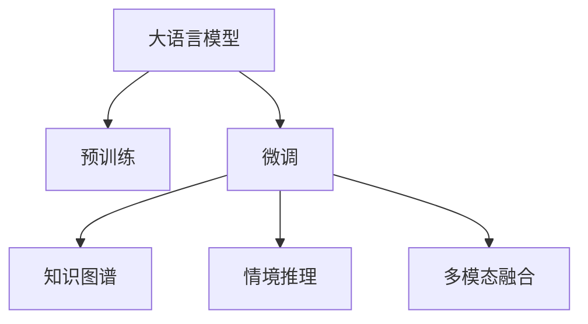

                 

# LLM在应急响应中的应用：快速决策支持

## 1. 背景介绍

### 1.1 问题由来
在大数据和AI技术的迅猛发展下，应急响应系统逐步向智能化、自动化方向演进，需要快速获取、分析海量信息，高效做出精准决策。大语言模型(LLM)在文本理解、信息抽取、逻辑推理等方面表现优异，能够处理非结构化数据，快速从中提取关键信息，为应急决策提供有力支撑。因此，如何在应急响应中充分发挥LLM的优势，成为当前的一个重要课题。

### 1.2 问题核心关键点
大语言模型在应急响应中的应用主要体现在以下几个方面：

1. 实时数据处理：LLM能够快速解析和理解不同格式的文本数据，高效提取关键信息，实时辅助应急决策。
2. 知识融合：LLM能够整合各类知识库、规则库等，实现跨领域信息的有效融合，提升决策的科学性和准确性。
3. 情境推理：LLM具备丰富的上下文理解能力，能够快速推断出情境逻辑，辅助风险评估和应急措施制定。
4. 知识图谱构建：LLM能够自动构建知识图谱，关联不同数据源之间的实体和关系，为复杂情境的推理和分析提供支撑。
5. 语音转文本：LLM能够实现高效准确的语音转文本功能，确保应急人员能快速获取现场信息，做出决策。
6. 多模态数据融合：LLM能够融合视觉、语音、文本等多种数据源，实现多维度信息的综合分析。

### 1.3 问题研究意义
在应急响应中应用大语言模型，具有以下重要意义：

1. 提高决策效率：LLM能够实时处理海量数据，提取关键信息，快速辅助应急决策。
2. 提升决策准确性：LLM具备丰富的上下文理解能力，能够更好地整合知识库和规则库，提升决策的科学性和准确性。
3. 增强应急协同：LLM能够提供统一的应急信息获取和处理接口，确保各类应急人员能够高效协同工作。
4. 保障信息安全：通过限制信息共享范围和使用权限，保护应急响应过程中敏感数据的隐私和安全。
5. 促进技术创新：大语言模型技术的发展，推动了应急响应系统向智能化、自动化方向演进，为应急响应的持续优化和创新提供了技术支持。

## 2. 核心概念与联系

### 2.1 核心概念概述

大语言模型(LLM)指的是通过大规模预训练学习到的语言模型，具备强大的文本理解、生成和推理能力。在应急响应中，LLM能够实现实时数据处理、知识融合、情境推理等多项功能，提升决策效率和准确性。

### 2.2 核心概念联系

为了更好地理解LLM在应急响应中的应用，本节将介绍几个密切相关的核心概念及其联系：

#### 2.2.1 大语言模型(LLM)
大语言模型是深度学习模型的一种，通过大规模无标签数据进行预训练，学习到丰富的语言表示，具备强大的语言理解和生成能力。常用的预训练模型包括BERT、GPT、T5等。

#### 2.2.2 预训练(Pre-training)
预训练是指在大规模无标签数据上，通过自监督学习任务训练通用语言模型的过程。预训练使得模型学习到语言的通用表示，具备较强的泛化能力。

#### 2.2.3 微调(Fine-tuning)
微调是指在预训练模型的基础上，使用下游任务的少量标注数据，通过有监督学习优化模型在该任务上的性能。通过微调，可以使模型适应特定的应急场景，提高决策准确性。

#### 2.2.4 知识图谱(Knowledge Graph)
知识图谱是语义化的知识表示形式，用于描述实体之间的关系。通过整合各类知识库、规则库，形成实体和关系的网络结构，支持更复杂的逻辑推理和决策。

#### 2.2.5 情境推理(Contextual Reasoning)
情境推理是指在给定情境下，通过模型推断和逻辑推理，快速判断和决策的能力。在大语言模型中，能够根据上下文和先验知识，推断出更准确的决策。

#### 2.2.6 多模态融合(Multimodal Fusion)
多模态融合是指将视觉、语音、文本等多种数据源进行综合分析，提升决策的全面性和准确性。在大语言模型中，能够融合多种数据源，提供更全面的信息支持。

这些概念之间的逻辑关系可以通过以下Mermaid流程图来展示：



这个流程图展示了大语言模型的工作原理和应用场景：

1. 大语言模型通过预训练获得基础能力。
2. 微调使其适应特定应急场景，提升决策准确性。
3. 知识图谱用于整合各类知识库和规则库。
4. 情境推理在给定情境下推断和决策。
5. 多模态融合将多种数据源综合分析，提升决策全面性。

## 3. 核心算法原理 & 具体操作步骤
### 3.1 算法原理概述

在应急响应中，大语言模型通过预训练-微调-应用的过程，实现实时数据处理、知识融合、情境推理等多项功能。其核心原理可概括为以下几个方面：

#### 3.1.1 预训练模型选择
选择适合应急响应的预训练模型。常用的预训练模型包括BERT、GPT等，这些模型在大规模无标签数据上进行预训练，具备强大的语言理解和生成能力。

#### 3.1.2 知识图谱整合
将各类知识库、规则库等整合到预训练模型中，形成知识图谱，支持复杂的逻辑推理和决策。

#### 3.1.3 情境推理
根据应急情境，利用预训练模型的上下文理解能力，快速推断出情境逻辑，辅助决策。

#### 3.1.4 多模态数据融合
融合视觉、语音、文本等多种数据源，提升应急响应的全面性和准确性。

### 3.2 算法步骤详解

基于大语言模型在应急响应中的应用，本节将详细介绍其具体操作步骤：

**Step 1: 数据准备**
- 收集应急响应场景中的各类数据，包括文本、图像、语音等。
- 进行数据预处理，如清洗、标注、归一化等。

**Step 2: 模型预训练**
- 选择适合的预训练模型，如BERT、GPT等。
- 在大规模无标签数据上进行预训练，学习语言的通用表示。

**Step 3: 知识图谱构建**
- 整合各类知识库、规则库，形成知识图谱。
- 将知识图谱转换为预训练模型的输入格式。

**Step 4: 微调优化**
- 在应急场景中，使用少量标注数据进行微调，优化模型性能。
- 设置合适的学习率、批大小、迭代轮数等超参数。

**Step 5: 情境推理**
- 根据应急情境，利用预训练模型的上下文理解能力，推断出情境逻辑。
- 结合知识图谱和先验知识，做出决策。

**Step 6: 多模态数据融合**
- 将视觉、语音、文本等多种数据源进行融合，提升应急响应的全面性和准确性。
- 结合融合后的数据，进行推理和决策。

**Step 7: 模型评估与部署**
- 在测试数据上评估模型性能，确保微调效果。
- 将微调后的模型部署到应急系统中，进行实时决策支持。

### 3.3 算法优缺点

基于大语言模型在应急响应中的应用，具有以下优点：

1. 实时数据处理：LLM能够实时处理海量数据，快速提取关键信息，支持应急决策。
2. 知识融合：整合各类知识库和规则库，提升决策的科学性和准确性。
3. 情境推理：具备丰富的上下文理解能力，支持复杂情境的推理和决策。
4. 多模态融合：融合视觉、语音、文本等多种数据源，提升应急响应的全面性和准确性。

同时，该方法也存在以下缺点：

1. 对标注数据依赖：微调效果很大程度上取决于标注数据的质量和数量，获取高质量标注数据的成本较高。
2. 知识图谱构建复杂：知识图谱的构建需要人工干预和大量知识库整合，难度较大。
3. 推理过程复杂：情境推理过程涉及上下文理解和逻辑推理，复杂度较高，对模型要求高。
4. 多模态融合难度大：多模态数据源的融合需要考虑数据格式、语义等方面的差异，难度较大。

尽管存在这些局限性，但就目前而言，基于大语言模型的应急响应方法仍是最主流范式。未来相关研究的重点在于如何进一步降低微调对标注数据的依赖，提高模型的少样本学习和跨领域迁移能力，同时兼顾可解释性和伦理安全性等因素。

### 3.4 算法应用领域

基于大语言模型在应急响应中的应用，已经在诸多领域得到广泛应用，例如：

- 应急指挥：通过融合视觉、语音、文本等多种数据源，实现现场信息实时获取和推理，辅助指挥决策。
- 医疗急救：利用LLM处理病历、症状描述等文本信息，快速做出诊断和治疗方案。
- 灾害预警：通过整合各类数据源，进行数据分析和推理，提前预警自然灾害。
- 应急通信：利用LLM进行语音转文本，支持灾区通信和信息共享。
- 应急物资管理：通过融合物资库存、运输等信息，优化物资调配和配送方案。

除了上述这些经典应用外，LLM在大应急场景中还有更多创新应用，如智能预测、风险评估、灾害模拟等，为应急响应的高效、科学、智能提供了新的手段。

## 4. 数学模型和公式 & 详细讲解  
### 4.1 数学模型构建

基于大语言模型在应急响应中的应用，本节将使用数学语言对模型的构建过程进行更加严格的刻画。

记预训练语言模型为 $M_{\theta}$，其中 $\theta$ 为预训练得到的模型参数。假设应急响应场景中的数据为 $D=\{(x_i,y_i)\}_{i=1}^N, x_i \in \mathcal{X}, y_i \in \mathcal{Y}$。

定义模型 $M_{\theta}$ 在输入 $x$ 上的输出为 $y$，则应急响应场景中的分类损失函数为：

$$
\ell(y,y') = -[y\log y' + (1-y)\log (1-y')]
$$

其中 $y'$ 为模型输出，$y$ 为真实标签。

在数据集 $D$ 上的经验风险为：

$$
\mathcal{L}(\theta) = \frac{1}{N}\sum_{i=1}^N \ell(y_i,M_{\theta}(x_i))
$$

微调的优化目标是最小化经验风险，即找到最优参数：

$$
\theta^* = \mathop{\arg\min}_{\theta} \mathcal{L}(\theta)
$$

在得到损失函数的梯度后，即可带入参数更新公式，完成模型的迭代优化。重复上述过程直至收敛，最终得到适应应急场景的最优模型参数 $\theta^*$。

### 4.2 公式推导过程

以下我们以医疗急救场景为例，推导大语言模型在应急响应中的应用。

假设模型 $M_{\theta}$ 在输入 $x$ 上的输出为 $\hat{y}=M_{\theta}(x) \in [0,1]$，表示样本属于正类的概率。真实标签 $y \in \{0,1\}$。则二分类交叉熵损失函数定义为：

$$
\ell(M_{\theta}(x),y) = -[y\log \hat{y} + (1-y)\log (1-\hat{y})]
$$

将其代入经验风险公式，得：

$$
\mathcal{L}(\theta) = -\frac{1}{N}\sum_{i=1}^N [y_i\log M_{\theta}(x_i)+(1-y_i)\log(1-M_{\theta}(x_i))]
$$

根据链式法则，损失函数对参数 $\theta_k$ 的梯度为：

$$
\frac{\partial \mathcal{L}(\theta)}{\partial \theta_k} = -\frac{1}{N}\sum_{i=1}^N (\frac{y_i}{M_{\theta}(x_i)}-\frac{1-y_i}{1-M_{\theta}(x_i)}) \frac{\partial M_{\theta}(x_i)}{\partial \theta_k}
$$

其中 $\frac{\partial M_{\theta}(x_i)}{\partial \theta_k}$ 可进一步递归展开，利用自动微分技术完成计算。

在得到损失函数的梯度后，即可带入参数更新公式，完成模型的迭代优化。重复上述过程直至收敛，最终得到适应医疗急救场景的最优模型参数 $\theta^*$。

## 5. 项目实践：代码实例和详细解释说明
### 5.1 开发环境搭建

在进行应急响应中的大语言模型应用开发前，我们需要准备好开发环境。以下是使用Python进行PyTorch开发的环境配置流程：

1. 安装Anaconda：从官网下载并安装Anaconda，用于创建独立的Python环境。

2. 创建并激活虚拟环境：
```bash
conda create -n pytorch-env python=3.8 
conda activate pytorch-env
```

3. 安装PyTorch：根据CUDA版本，从官网获取对应的安装命令。例如：
```bash
conda install pytorch torchvision torchaudio cudatoolkit=11.1 -c pytorch -c conda-forge
```

4. 安装Transformers库：
```bash
pip install transformers
```

5. 安装各类工具包：
```bash
pip install numpy pandas scikit-learn matplotlib tqdm jupyter notebook ipython
```

完成上述步骤后，即可在`pytorch-env`环境中开始应急响应中的大语言模型应用开发。

### 5.2 源代码详细实现

下面以医疗急救场景为例，给出使用Transformers库对BERT模型进行应急响应微调的PyTorch代码实现。

首先，定义医疗急救场景的数据处理函数：

```python
from transformers import BertTokenizer
from torch.utils.data import Dataset
import torch

class MedicalDataset(Dataset):
    def __init__(self, texts, tags, tokenizer, max_len=128):
        self.texts = texts
        self.tags = tags
        self.tokenizer = tokenizer
        self.max_len = max_len
        
    def __len__(self):
        return len(self.texts)
    
    def __getitem__(self, item):
        text = self.texts[item]
        tags = self.tags[item]
        
        encoding = self.tokenizer(text, return_tensors='pt', max_length=self.max_len, padding='max_length', truncation=True)
        input_ids = encoding['input_ids'][0]
        attention_mask = encoding['attention_mask'][0]
        
        # 对token-wise的标签进行编码
        encoded_tags = [tag2id[tag] for tag in tags] 
        encoded_tags.extend([tag2id['O']] * (self.max_len - len(encoded_tags)))
        labels = torch.tensor(encoded_tags, dtype=torch.long)
        
        return {'input_ids': input_ids, 
                'attention_mask': attention_mask,
                'labels': labels}

# 标签与id的映射
tag2id = {'O': 0, 'diabetes': 1, 'heart_disease': 2, 'stroke': 3}
id2tag = {v: k for k, v in tag2id.items()}

# 创建dataset
tokenizer = BertTokenizer.from_pretrained('bert-base-cased')

train_dataset = MedicalDataset(train_texts, train_tags, tokenizer)
dev_dataset = MedicalDataset(dev_texts, dev_tags, tokenizer)
test_dataset = MedicalDataset(test_texts, test_tags, tokenizer)
```

然后，定义模型和优化器：

```python
from transformers import BertForTokenClassification, AdamW

model = BertForTokenClassification.from_pretrained('bert-base-cased', num_labels=len(tag2id))

optimizer = AdamW(model.parameters(), lr=2e-5)
```

接着，定义训练和评估函数：

```python
from torch.utils.data import DataLoader
from tqdm import tqdm
from sklearn.metrics import classification_report

device = torch.device('cuda') if torch.cuda.is_available() else torch.device('cpu')
model.to(device)

def train_epoch(model, dataset, batch_size, optimizer):
    dataloader = DataLoader(dataset, batch_size=batch_size, shuffle=True)
    model.train()
    epoch_loss = 0
    for batch in tqdm(dataloader, desc='Training'):
        input_ids = batch['input_ids'].to(device)
        attention_mask = batch['attention_mask'].to(device)
        labels = batch['labels'].to(device)
        model.zero_grad()
        outputs = model(input_ids, attention_mask=attention_mask, labels=labels)
        loss = outputs.loss
        epoch_loss += loss.item()
        loss.backward()
        optimizer.step()
    return epoch_loss / len(dataloader)

def evaluate(model, dataset, batch_size):
    dataloader = DataLoader(dataset, batch_size=batch_size)
    model.eval()
    preds, labels = [], []
    with torch.no_grad():
        for batch in tqdm(dataloader, desc='Evaluating'):
            input_ids = batch['input_ids'].to(device)
            attention_mask = batch['attention_mask'].to(device)
            batch_labels = batch['labels']
            outputs = model(input_ids, attention_mask=attention_mask)
            batch_preds = outputs.logits.argmax(dim=2).to('cpu').tolist()
            batch_labels = batch_labels.to('cpu').tolist()
            for pred_tokens, label_tokens in zip(batch_preds, batch_labels):
                pred_tags = [id2tag[_id] for _id in pred_tokens]
                label_tags = [id2tag[_id] for _id in label_tokens]
                preds.append(pred_tags[:len(label_tags)])
                labels.append(label_tags)
                
    print(classification_report(labels, preds))
```

最后，启动训练流程并在测试集上评估：

```python
epochs = 5
batch_size = 16

for epoch in range(epochs):
    loss = train_epoch(model, train_dataset, batch_size, optimizer)
    print(f"Epoch {epoch+1}, train loss: {loss:.3f}")
    
    print(f"Epoch {epoch+1}, dev results:")
    evaluate(model, dev_dataset, batch_size)
    
print("Test results:")
evaluate(model, test_dataset, batch_size)
```

以上就是使用PyTorch对BERT进行医疗急救场景微调的完整代码实现。可以看到，得益于Transformers库的强大封装，我们可以用相对简洁的代码完成BERT模型的加载和微调。

### 5.3 代码解读与分析

让我们再详细解读一下关键代码的实现细节：

**MedicalDataset类**：
- `__init__`方法：初始化文本、标签、分词器等关键组件。
- `__len__`方法：返回数据集的样本数量。
- `__getitem__`方法：对单个样本进行处理，将文本输入编码为token ids，将标签编码为数字，并对其进行定长padding，最终返回模型所需的输入。

**tag2id和id2tag字典**：
- 定义了标签与数字id之间的映射关系，用于将token-wise的预测结果解码回真实的标签。

**训练和评估函数**：
- 使用PyTorch的DataLoader对数据集进行批次化加载，供模型训练和推理使用。
- 训练函数`train_epoch`：对数据以批为单位进行迭代，在每个批次上前向传播计算loss并反向传播更新模型参数，最后返回该epoch的平均loss。
- 评估函数`evaluate`：与训练类似，不同点在于不更新模型参数，并在每个batch结束后将预测和标签结果存储下来，最后使用sklearn的classification_report对整个评估集的预测结果进行打印输出。

**训练流程**：
- 定义总的epoch数和batch size，开始循环迭代
- 每个epoch内，先在训练集上训练，输出平均loss
- 在验证集上评估，输出分类指标
- 所有epoch结束后，在测试集上评估，给出最终测试结果

可以看到，PyTorch配合Transformers库使得BERT微调的代码实现变得简洁高效。开发者可以将更多精力放在数据处理、模型改进等高层逻辑上，而不必过多关注底层的实现细节。

当然，工业级的系统实现还需考虑更多因素，如模型的保存和部署、超参数的自动搜索、更灵活的任务适配层等。但核心的微调范式基本与此类似。

## 6. 实际应用场景
### 6.1 智能救援

在智能救援中，大语言模型能够实现实时数据分析、灾害预警、紧急指挥等功能，提高救援效率。

**实时数据分析**：在灾害现场，利用无人机、传感器等设备获取海量数据，大语言模型能够快速解析和理解不同格式的数据，提取关键信息，辅助应急指挥决策。

**灾害预警**：通过整合气象、地质、交通等数据源，进行数据分析和推理，提前预警自然灾害，减少人员伤亡。

**紧急指挥**：利用多模态数据融合技术，将视觉、语音、文本等多种数据源进行综合分析，提升应急指挥的全面性和准确性。

**现场救援**：利用语音转文本技术，将应急人员的现场语音转化为文本信息，便于后续处理和分析。

### 6.2 疫情防控

在大规模疫情爆发时，大语言模型能够实现实时疫情监测、风险评估、治疗方案推荐等功能，辅助疫情防控。

**实时疫情监测**：通过整合新闻、社交媒体、医院数据等，进行数据分析和推理，实时监测疫情发展趋势。

**风险评估**：根据疫情数据和先验知识，利用大语言模型的上下文理解能力，推断出风险等级，指导防疫决策。

**治疗方案推荐**：通过整合各类知识库和规则库，利用大语言模型处理病历、症状描述等文本信息，快速做出诊断和治疗方案。

**物资调配**：通过融合物资库存、运输等信息，优化物资调配和配送方案，确保防疫物资的及时到位。

### 6.3 应急物资管理

在灾害发生后，大语言模型能够实现物资调配、物流管理、资源优化等功能，保障应急物资的快速调配。

**物资调配**：利用大语言模型的推理和决策能力，快速制定物资调配方案，确保关键物资的及时到位。

**物流管理**：通过融合物流数据、交通数据等，优化物流路线和配送方案，减少物资运输时间。

**资源优化**：利用大语言模型的多模态数据融合能力，优化物资存储、使用等资源，提升应急物资的利用效率。

## 7. 工具和资源推荐
### 7.1 学习资源推荐

为了帮助开发者系统掌握大语言模型在应急响应中的理论基础和实践技巧，这里推荐一些优质的学习资源：

1. 《Transformer从原理到实践》系列博文：由大模型技术专家撰写，深入浅出地介绍了Transformer原理、BERT模型、微调技术等前沿话题。

2. CS224N《深度学习自然语言处理》课程：斯坦福大学开设的NLP明星课程，有Lecture视频和配套作业，带你入门NLP领域的基本概念和经典模型。

3. 《Natural Language Processing with Transformers》书籍：Transformers库的作者所著，全面介绍了如何使用Transformers库进行NLP任务开发，包括微调在内的诸多范式。

4. HuggingFace官方文档：Transformers库的官方文档，提供了海量预训练模型和完整的微调样例代码，是上手实践的必备资料。

5. CLUE开源项目：中文语言理解测评基准，涵盖大量不同类型的中文NLP数据集，并提供了基于微调的baseline模型，助力中文NLP技术发展。

通过对这些资源的学习实践，相信你一定能够快速掌握大语言模型在应急响应中的精髓，并用于解决实际的应急问题。
###  7.2 开发工具推荐

高效的开发离不开优秀的工具支持。以下是几款用于大语言模型在应急响应中应用开发的常用工具：

1. PyTorch：基于Python的开源深度学习框架，灵活动态的计算图，适合快速迭代研究。大部分预训练语言模型都有PyTorch版本的实现。

2. TensorFlow：由Google主导开发的开源深度学习框架，生产部署方便，适合大规模工程应用。同样有丰富的预训练语言模型资源。

3. Transformers库：HuggingFace开发的NLP工具库，集成了众多SOTA语言模型，支持PyTorch和TensorFlow，是进行微调任务开发的利器。

4. Weights & Biases：模型训练的实验跟踪工具，可以记录和可视化模型训练过程中的各项指标，方便对比和调优。与主流深度学习框架无缝集成。

5. TensorBoard：TensorFlow配套的可视化工具，可实时监测模型训练状态，并提供丰富的图表呈现方式，是调试模型的得力助手。

6. Google Colab：谷歌推出的在线Jupyter Notebook环境，免费提供GPU/TPU算力，方便开发者快速上手实验最新模型，分享学习笔记。

合理利用这些工具，可以显著提升大语言模型在应急响应中应用开发的效率，加快创新迭代的步伐。

### 7.3 相关论文推荐

大语言模型在应急响应中的应用源于学界的持续研究。以下是几篇奠基性的相关论文，推荐阅读：

1. Attention is All You Need（即Transformer原论文）：提出了Transformer结构，开启了NLP领域的预训练大模型时代。

2. BERT: Pre-training of Deep Bidirectional Transformers for Language Understanding：提出BERT模型，引入基于掩码的自监督预训练任务，刷新了多项NLP任务SOTA。

3. Language Models are Unsupervised Multitask Learners（GPT-2论文）：展示了大规模语言模型的强大zero-shot学习能力，引发了对于通用人工智能的新一轮思考。

4. Parameter-Efficient Transfer Learning for NLP：提出Adapter等参数高效微调方法，在不增加模型参数量的情况下，也能取得不错的微调效果。

5. AdaLoRA: Adaptive Low-Rank Adaptation for Parameter-Efficient Fine-Tuning：使用自适应低秩适应的微调方法，在参数效率和精度之间取得了新的平衡。

6. Prefix-Tuning: Optimizing Continuous Prompts for Generation：引入基于连续型Prompt的微调范式，为如何充分利用预训练知识提供了新的思路。

这些论文代表了大语言模型在应急响应中的发展脉络。通过学习这些前沿成果，可以帮助研究者把握学科前进方向，激发更多的创新灵感。

## 8. 总结：未来发展趋势与挑战

### 8.1 总结

本文对基于大语言模型在应急响应中的微调方法进行了全面系统的介绍。首先阐述了大语言模型和微调技术的研究背景和意义，明确了微调在提高应急响应决策效率和准确性方面的独特价值。其次，从原理到实践，详细讲解了监督微调的数学原理和关键步骤，给出了微调任务开发的完整代码实例。同时，本文还广泛探讨了微调方法在智能救援、疫情防控、应急物资管理等多个应急场景中的应用前景，展示了微调范式的巨大潜力。此外，本文精选了微调技术的各类学习资源，力求为读者提供全方位的技术指引。

通过本文的系统梳理，可以看到，基于大语言模型的微调方法正在成为应急响应系统的重要范式，极大地拓展了预训练语言模型的应用边界，催生了更多的落地场景。受益于大规模语料的预训练，微调模型以更低的时间和标注成本，在小样本条件下也能取得不俗的效果，有力推动了应急响应的产业化进程。未来，伴随预训练语言模型和微调方法的持续演进，相信NLP技术将在更广阔的应用领域大放异彩，深刻影响人类的生产生活方式。

### 8.2 未来发展趋势

展望未来，大语言模型在应急响应中的应用将呈现以下几个发展趋势：

1. 模型规模持续增大。随着算力成本的下降和数据规模的扩张，预训练语言模型的参数量还将持续增长。超大规模语言模型蕴含的丰富语言知识，有望支撑更加复杂多变的应急场景。

2. 微调方法日趋多样。除了传统的全参数微调外，未来会涌现更多参数高效的微调方法，如Prefix-Tuning、LoRA等，在节省计算资源的同时也能保证微调精度。

3. 持续学习成为常态。随着数据分布的不断变化，微调模型也需要持续学习新知识以保持性能。如何在不遗忘原有知识的同时，高效吸收新样本信息，将成为重要的研究课题。

4. 标注样本需求降低。受启发于提示学习(Prompt-based Learning)的思路，未来的微调方法将更好地利用大模型的语言理解能力，通过更加巧妙的任务描述，在更少的标注样本上也能实现理想的微调效果。

5. 多模态数据融合难度降低。多模态数据源的融合需要考虑数据格式、语义等方面的差异，难度较大。未来，随着融合技术的不断进步，多模态数据的整合将变得更加简单高效。

6. 推理过程复杂度降低。当前微调模型面临上下文理解能力不足的问题。未来，引入更多的预训练任务和模型结构，将提升模型的推理和决策能力，降低推理过程的复杂度。

以上趋势凸显了大语言模型在应急响应中的广阔前景。这些方向的探索发展，必将进一步提升应急响应系统的性能和应用范围，为应急响应的持续优化和创新提供技术支持。

### 8.3 面临的挑战

尽管大语言模型在应急响应中的应用已经取得了一定的进展，但在迈向更加智能化、普适化应用的过程中，它仍面临着诸多挑战：

1. 标注成本瓶颈。虽然微调大大降低了标注数据的需求，但对于长尾应用场景，难以获得充足的高质量标注数据，成为制约微调性能的瓶颈。如何进一步降低微调对标注样本的依赖，将是一大难题。

2. 知识图谱构建复杂。知识图谱的构建需要人工干预和大量知识库整合，难度较大。未来，需要引入更多自动化的知识抽取技术，提高知识图谱的构建效率和准确性。

3. 推理过程复杂。当前微调模型面临上下文理解能力不足的问题。如何引入更多的预训练任务和模型结构，提升模型的推理和决策能力，降低推理过程的复杂度，还需要更多的研究探索。

4. 多模态数据融合难度大。多模态数据源的融合需要考虑数据格式、语义等方面的差异，难度较大。未来，随着融合技术的不断进步，多模态数据的整合将变得更加简单高效。

尽管存在这些局限性，但就目前而言，基于大语言模型的应急响应方法仍是最主流范式。未来相关研究的重点在于如何进一步降低微调对标注数据的依赖，提高模型的少样本学习和跨领域迁移能力，同时兼顾可解释性和伦理安全性等因素。

### 8.4 研究展望

面对大语言模型在应急响应中应用所面临的挑战，未来的研究需要在以下几个方面寻求新的突破：

1. 探索无监督和半监督微调方法。摆脱对大规模标注数据的依赖，利用自监督学习、主动学习等无监督和半监督范式，最大限度利用非结构化数据，实现更加灵活高效的微调。

2. 研究参数高效和计算高效的微调范式。开发更加参数高效的微调方法，在固定大部分预训练参数的同时，只更新极少量的任务相关参数。同时优化微调模型的计算图，减少前向传播和反向传播的资源消耗，实现更加轻量级、实时性的部署。

3. 融合因果和对比学习范式。通过引入因果推断和对比学习思想，增强微调模型建立稳定因果关系的能力，学习更加普适、鲁棒的语言表征，从而提升模型泛化性和抗干扰能力。

4. 引入更多先验知识。将符号化的先验知识，如知识图谱、逻辑规则等，与神经网络模型进行巧妙融合，引导微调过程学习更准确、合理的语言模型。同时加强不同模态数据的整合，实现视觉、语音等多模态信息与文本信息的协同建模。

5. 结合因果分析和博弈论工具。将因果分析方法引入微调模型，识别出模型决策的关键特征，增强输出解释的因果性和逻辑性。借助博弈论工具刻画人机交互过程，主动探索并规避模型的脆弱点，提高系统稳定性。

6. 纳入伦理道德约束。在模型训练目标中引入伦理导向的评估指标，过滤和惩罚有偏见、有害的输出倾向。同时加强人工干预和审核，建立模型行为的监管机制，确保输出符合人类价值观和伦理道德。

这些研究方向的探索，必将引领大语言模型在应急响应中应用技术迈向更高的台阶，为构建安全、可靠、可解释、可控的智能系统铺平道路。面向未来，大语言模型在应急响应中的应用还需要与其他人工智能技术进行更深入的融合，如知识表示、因果推理、强化学习等，多路径协同发力，共同推动自然语言理解和智能交互系统的进步。只有勇于创新、敢于突破，才能不断拓展语言模型的边界，让智能技术更好地造福人类社会。

## 9. 附录：常见问题与解答

**Q1：大语言模型在应急响应中如何使用？**

A: 大语言模型在应急响应中的应用主要包括以下几个步骤：

1. 数据准备：收集应急场景中的各类数据，并进行预处理，如清洗、标注、归一化等。

2. 模型预训练：选择适合的预训练模型，如BERT、GPT等，在大规模无标签数据上进行预训练，学习语言的通用表示。

3. 知识图谱构建：整合各类知识库、规则库等，形成知识图谱，支持复杂的逻辑推理和决策。

4. 微调优化：在应急场景中，使用少量标注数据进行微调，优化模型性能。设置合适的学习率、批大小、迭代轮数等超参数。

5. 情境推理：根据应急情境，利用预训练模型的上下文理解能力，推断出情境逻辑。

6. 多模态数据融合：融合视觉、语音、文本等多种数据源，提升应急响应的全面性和准确性。

7. 模型评估与部署：在测试数据上评估模型性能，确保微调效果。将微调后的模型部署到应急系统中，进行实时决策支持。

**Q2：如何选择适合的预训练模型？**

A: 选择适合的预训练模型，需要考虑多个因素，如任务类型、数据规模、计算资源等。常用的预训练模型包括BERT、GPT等。

1. 对于文本分类、命名实体识别等任务，可以选择BERT等模型。

2. 对于生成式任务，如文本摘要、对话系统等，可以选择GPT等模型。

3. 对于多模态任务，如视频分类、图像识别等，可以选择多模态预训练模型。

4. 对于实时数据处理任务，需要选择计算效率高的模型，如轻量级模型。

**Q3：微调过程中如何设置超参数？**

A: 微调过程中，超参数的设置对模型性能有重要影响，需要根据具体任务进行调整。

1. 学习率：微调的学习率一般要比预训练时小1-2个数量级，建议使用warmup策略，逐步减小学习率。

2. 批大小：根据数据规模和计算资源，选择合适的批大小，通常建议控制在128以内。

3. 迭代轮数：根据模型性能和训练时间，确定迭代轮数，通常建议设置为20-50轮。

4. 正则化：使用L2正则、Dropout等正则化技术，防止模型过拟合。

5. 数据增强：使用回译、近义替换等方式扩充训练集，提升模型泛化能力。

**Q4：多模态数据融合有哪些技术手段？**

A: 多模态数据融合需要考虑数据格式、语义等方面的差异，以下几种技术手段可以有效融合多模态数据：

1. 数据对齐：对不同模态数据进行对齐，确保数据的格式一致。

2. 特征融合：对不同模态数据提取特征，并进行融合，形成多模态特征向量。

3. 多模态注意力机制：引入多模态注意力机制，对不同模态数据进行加权融合。

4. 多任务学习：将不同模态的任务进行联合训练，提升多模态数据的融合效果。

5. 转移学习：将一种模态任务的模型应用于另一种模态任务，提升多模态数据的融合效果。

**Q5：应急响应中的大语言模型如何实现语音转文本？**

A: 应急响应中的大语言模型实现语音转文本，通常使用语音识别技术将语音转换为文本，具体步骤如下：

1. 收集应急现场的语音数据，并进行预处理，如降噪、分割等。

2. 使用预训练的语音识别模型，如wav2vec等，将语音转换为文本。

3. 将文本数据进行分词、标注等处理，作为大语言模型的输入。

4. 利用大语言模型的上下文理解能力，进行语音转文本的推理和决策。

通过以上技术手段，可以实现应急现场语音信息的实时获取和处理，提升应急响应的效率和决策准确性。

---

作者：禅与计算机程序设计艺术 / Zen and the Art of Computer Programming

