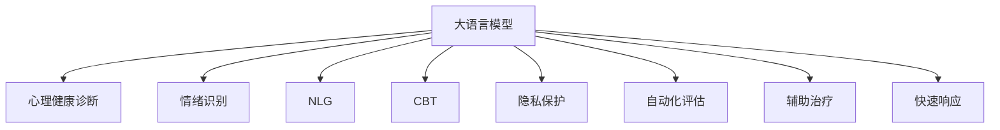

                 

# LLM在心理健康领域的潜在应用

> 关键词：
- 大语言模型(LLM)
- 心理健康诊断
- 情绪识别
- 自然语言生成(NLG)
- 认知行为疗法(CBT)
- 隐私保护
- 自动化评估
- 辅助治疗
- 快速响应

## 1. 背景介绍

### 1.1 问题由来
近年来，随着人工智能技术的迅猛发展，大语言模型(LLM)在自然语言处理(NLP)领域取得了显著进展。LLM能够处理大量的文本数据，通过预训练获得通用的语言知识，进而进行微调应用于各种任务。在心理健康领域，LLM展现出广泛的应用前景，可以辅助医生进行疾病诊断、情绪识别、自然语言生成等多种工作，提高心理健康服务的效率和质量。

### 1.2 问题核心关键点
LLM在心理健康领域的应用，关键在于其强大的语言理解能力和知识表示能力。利用这些能力，LLM可以处理用户的自然语言输入，进行疾病筛查、情绪分析、智能推荐，甚至辅助进行认知行为疗法(CBT)等治疗。LLM能够实时响应用户需求，提供个性化、精准的心理健康服务。

## 2. 核心概念与联系

### 2.1 核心概念概述

为更好地理解LLM在心理健康领域的应用，本节将介绍几个密切相关的核心概念：

- 大语言模型(LLM)：以自回归或自编码模型为代表的大规模预训练语言模型。通过在大规模无标签文本语料上进行预训练，学习通用的语言知识，具备强大的语言理解和生成能力。

- 心理健康诊断：通过对患者的语言输入进行分析，辅助医生进行心理疾病的初步筛查和诊断。

- 情绪识别：分析用户的语言内容，识别其情绪状态，为心理干预提供依据。

- 自然语言生成(NLG)：生成符合语法规则和情感倾向的文本内容，如回答情感问题、提供心理建议等。

- 认知行为疗法(CBT)：一种以认知理论和行为理论为基础的心理治疗方法，旨在通过改变患者的思维方式和行为习惯来治疗心理疾病。

- 隐私保护：在心理健康应用中，如何保护用户的隐私和数据安全是一个重要问题。

- 自动化评估：利用LLM进行心理评估，减少人工评估的时间和成本。

- 辅助治疗：通过自然语言交互，提供心理支持和引导，辅助医生进行心理治疗。

- 快速响应：LLM能够快速响应用户的请求，提供即时的心理健康服务。

这些核心概念之间的逻辑关系可以通过以下Mermaid流程图来展示：



这个流程图展示了大语言模型的核心概念及其在心理健康领域的应用：

1. 大语言模型通过预训练获得基础能力。
2. 在心理健康诊断、情绪识别、自然语言生成、CBT辅助、隐私保护等多个方面，对大语言模型进行微调，实现各类应用。
3. 通过与用户的自然语言交互，快速响应和提供心理支持。

## 3. 核心算法原理 & 具体操作步骤
### 3.1 算法原理概述

基于大语言模型的心理健康应用，本质上是一种有监督学习的过程。其核心思想是：将大语言模型作为语言理解和生成工具，通过处理用户输入的自然语言，辅助医生进行疾病筛查、情绪分析、智能推荐，甚至辅助进行认知行为疗法。

形式化地，假设用户输入的自然语言序列为 $x = (x_1, x_2, \ldots, x_n)$，其中 $x_i$ 为第 $i$ 个词汇。心理健康应用的目标是，根据 $x$，预测出用户的心理健康状态 $y$。常见的方法包括：

1. **疾病诊断**：判断用户是否患有某种心理疾病。
2. **情绪识别**：分析用户的情绪状态，如焦虑、抑郁等。
3. **自然语言生成(NLG)**：生成符合语法规则和情感倾向的文本内容，如回答情感问题、提供心理建议等。
4. **辅助治疗**：提供心理支持和引导，辅助医生进行认知行为疗法。

这些任务通常采用监督学习的范式，通过收集标注数据，训练大语言模型进行预测。以情绪识别为例，假设标注数据集为 $D = \{(x_i, y_i)\}_{i=1}^N$，其中 $y_i$ 为用户的情绪标签，$y_i \in \{正面, 负面, 中性\}$。

模型的训练目标为：

$$
\theta = \arg\min_{\theta} \sum_{i=1}^N \ell(x_i, y_i, \theta)
$$

其中 $\theta$ 为模型的参数，$\ell$ 为损失函数，用于衡量模型预测输出与真实标签之间的差异。常见的损失函数包括交叉熵损失、均方误差损失等。

### 3.2 算法步骤详解

基于大语言模型的心理健康应用，一般包括以下几个关键步骤：

**Step 1: 准备预训练模型和数据集**
- 选择合适的预训练语言模型 $M_{\theta}$ 作为初始化参数，如 GPT-3、BERT 等。
- 准备心理健康相关的标注数据集 $D$，划分为训练集、验证集和测试集。标注数据需要涵盖多种疾病、情绪和治疗方法，以提高模型的泛化能力。

**Step 2: 添加任务适配层**
- 根据任务类型，在预训练模型顶层设计合适的输出层和损失函数。
- 对于疾病诊断，通常使用分类器输出疾病概率，并以交叉熵损失函数进行优化。
- 对于情绪识别，可以使用回归模型预测情绪得分，并以均方误差损失函数进行优化。
- 对于自然语言生成，通常使用解码器输出文本，并以负对数似然损失函数进行优化。
- 对于辅助治疗，可以使用自然语言推理模型判断治疗建议的有效性，并以自定义损失函数进行优化。

**Step 3: 设置微调超参数**
- 选择合适的优化算法及其参数，如 AdamW、SGD 等，设置学习率、批大小、迭代轮数等。
- 设置正则化技术及强度，包括权重衰减、Dropout、Early Stopping等。
- 确定冻结预训练参数的策略，如仅微调顶层，或全部参数都参与微调。

**Step 4: 执行梯度训练**
- 将训练集数据分批次输入模型，前向传播计算损失函数。
- 反向传播计算参数梯度，根据设定的优化算法和学习率更新模型参数。
- 周期性在验证集上评估模型性能，根据性能指标决定是否触发 Early Stopping。
- 重复上述步骤直到满足预设的迭代轮数或 Early Stopping 条件。

**Step 5: 测试和部署**
- 在测试集上评估微调后模型 $M_{\hat{\theta}}$ 的性能，对比微调前后的精度提升。
- 使用微调后的模型对新用户进行推理预测，集成到实际的心理健康服务系统中。
- 持续收集用户的反馈，定期重新微调模型，以适应数据分布的变化。

### 3.3 算法优缺点

基于大语言模型的心理健康应用方法具有以下优点：
1. **高效性**：相比于传统的心理评估方法，LLM能够快速处理大量用户输入，提供实时响应。
2. **精准性**：LLM通过深度学习模型进行训练，可以捕捉到复杂的语言特征，提高诊断和评估的准确性。
3. **可扩展性**：LLM可以通过微调扩展到多种心理健康任务，提升系统的灵活性和通用性。

同时，该方法也存在一些局限性：
1. **依赖标注数据**：心理健康应用的准确性很大程度上取决于标注数据的质量和数量，获取高质量标注数据的成本较高。
2. **隐私风险**：心理健康应用需要处理敏感的用户信息，如何保护用户的隐私和数据安全是一个重要问题。
3. **模型鲁棒性**：LLM在面对异常数据或复杂情感表达时，容易出现误判，影响诊断和治疗效果。
4. **可解释性不足**：心理健康应用的复杂性使得模型的决策过程难以解释，给诊断和治疗过程带来不透明性。

尽管存在这些局限性，但就目前而言，基于大语言模型的心理健康应用仍是一种高效、精准的方法，有望在未来的应用中发挥重要作用。

### 3.4 算法应用领域

基于大语言模型的心理健康应用，已经在多个领域得到实际应用，例如：

1. **心理健康筛查**：利用自然语言处理技术，对用户输入的文字进行情感分析、情绪识别，初步筛查心理疾病。
2. **心理治疗辅助**：通过与用户的自然语言交互，提供心理支持和引导，辅助医生进行认知行为疗法。
3. **情绪监测与干预**：对用户的日常交流内容进行分析，识别其情绪变化，及时提供情绪调节建议。
4. **自杀风险评估**：利用自然语言生成技术，生成符合语法规则和情感倾向的文本内容，引导用户表达情感，评估其自杀风险。
5. **心理危机干预**：在紧急情况下，通过与用户的自然语言交互，提供即时的心理支持。

除了上述这些经典应用外，大语言模型在心理健康领域还有更多创新的应用场景，如可控文本生成、认知重构等，为心理健康技术带来新的突破。

## 4. 数学模型和公式 & 详细讲解  
### 4.1 数学模型构建

本节将使用数学语言对基于大语言模型的心理健康应用进行更加严格的刻画。

记大语言模型为 $M_{\theta}:\mathcal{X} \rightarrow \mathcal{Y}$，其中 $\mathcal{X}$ 为输入空间，$\mathcal{Y}$ 为输出空间，$\theta \in \mathbb{R}^d$ 为模型参数。假设心理健康应用的任务为 $T$，其中 $T$ 包括疾病诊断、情绪识别、自然语言生成等。

定义模型 $M_{\theta}$ 在输入 $x$ 上的输出为 $\hat{y}=M_{\theta}(x) \in \mathcal{Y}$，其中 $\mathcal{Y}$ 为输出空间。心理健康应用的目标是，根据 $x$，预测出心理健康状态 $y$，即：

$$
y = \arg\min_{y} \ell(\hat{y}, y)
$$

其中 $\ell$ 为损失函数，用于衡量模型预测输出与真实标签之间的差异。常见的损失函数包括交叉熵损失、均方误差损失等。

### 4.2 公式推导过程

以下我们以情绪识别为例，推导交叉熵损失函数及其梯度的计算公式。

假设模型 $M_{\theta}$ 在输入 $x$ 上的输出为 $\hat{y}=M_{\theta}(x) \in [0,1]$，表示用户情绪处于某种状态的概率。真实标签 $y \in \{正面, 负面, 中性\}$。则情绪识别的交叉熵损失函数定义为：

$$
\ell(M_{\theta}(x),y) = -[y\log \hat{y} + (1-y)\log(1-\hat{y})]
$$

将其代入心理健康应用的损失函数公式，得：

$$
\mathcal{L}(\theta) = -\frac{1}{N}\sum_{i=1}^N [y_i\log M_{\theta}(x_i)+(1-y_i)\log(1-M_{\theta}(x_i))]
$$

根据链式法则，损失函数对参数 $\theta$ 的梯度为：

$$
\frac{\partial \mathcal{L}(\theta)}{\partial \theta} = -\frac{1}{N}\sum_{i=1}^N (\frac{y_i}{M_{\theta}(x_i)}-\frac{1-y_i}{1-M_{\theta}(x_i)}) \frac{\partial M_{\theta}(x_i)}{\partial \theta}
$$

其中 $\frac{\partial M_{\theta}(x_i)}{\partial \theta}$ 可进一步递归展开，利用自动微分技术完成计算。

在得到损失函数的梯度后，即可带入参数更新公式，完成模型的迭代优化。重复上述过程直至收敛，最终得到适应心理健康任务的最优模型参数 $\theta^*$。

## 5. 项目实践：代码实例和详细解释说明
### 5.1 开发环境搭建

在进行心理健康应用开发前，我们需要准备好开发环境。以下是使用Python进行PyTorch开发的环境配置流程：

1. 安装Anaconda：从官网下载并安装Anaconda，用于创建独立的Python环境。

2. 创建并激活虚拟环境：
```bash
conda create -n pytorch-env python=3.8 
conda activate pytorch-env
```

3. 安装PyTorch：根据CUDA版本，从官网获取对应的安装命令。例如：
```bash
conda install pytorch torchvision torchaudio cudatoolkit=11.1 -c pytorch -c conda-forge
```

4. 安装Transformers库：
```bash
pip install transformers
```

5. 安装各类工具包：
```bash
pip install numpy pandas scikit-learn matplotlib tqdm jupyter notebook ipython
```

完成上述步骤后，即可在`pytorch-env`环境中开始心理健康应用的开发。

### 5.2 源代码详细实现

这里我们以情绪识别任务为例，给出使用Transformers库对BERT模型进行心理健康应用微调的PyTorch代码实现。

首先，定义情绪识别任务的数据处理函数：

```python
from transformers import BertTokenizer
from torch.utils.data import Dataset
import torch

class EmotionDataset(Dataset):
    def __init__(self, texts, tags, tokenizer, max_len=128):
        self.texts = texts
        self.tags = tags
        self.tokenizer = tokenizer
        self.max_len = max_len
        
    def __len__(self):
        return len(self.texts)
    
    def __getitem__(self, item):
        text = self.texts[item]
        tags = self.tags[item]
        
        encoding = self.tokenizer(text, return_tensors='pt', max_length=self.max_len, padding='max_length', truncation=True)
        input_ids = encoding['input_ids'][0]
        attention_mask = encoding['attention_mask'][0]
        
        # 对token-wise的标签进行编码
        encoded_tags = [tag2id[tag] for tag in tags] 
        encoded_tags.extend([tag2id['O']] * (self.max_len - len(encoded_tags)))
        labels = torch.tensor(encoded_tags, dtype=torch.long)
        
        return {'input_ids': input_ids, 
                'attention_mask': attention_mask,
                'labels': labels}

# 标签与id的映射
tag2id = {'O': 0, '正面': 1, '负面': 2, '中性': 3}
id2tag = {v: k for k, v in tag2id.items()}

# 创建dataset
tokenizer = BertTokenizer.from_pretrained('bert-base-cased')

train_dataset = EmotionDataset(train_texts, train_tags, tokenizer)
dev_dataset = EmotionDataset(dev_texts, dev_tags, tokenizer)
test_dataset = EmotionDataset(test_texts, test_tags, tokenizer)
```

然后，定义模型和优化器：

```python
from transformers import BertForTokenClassification, AdamW

model = BertForTokenClassification.from_pretrained('bert-base-cased', num_labels=len(tag2id))

optimizer = AdamW(model.parameters(), lr=2e-5)
```

接着，定义训练和评估函数：

```python
from torch.utils.data import DataLoader
from tqdm import tqdm
from sklearn.metrics import classification_report

device = torch.device('cuda') if torch.cuda.is_available() else torch.device('cpu')
model.to(device)

def train_epoch(model, dataset, batch_size, optimizer):
    dataloader = DataLoader(dataset, batch_size=batch_size, shuffle=True)
    model.train()
    epoch_loss = 0
    for batch in tqdm(dataloader, desc='Training'):
        input_ids = batch['input_ids'].to(device)
        attention_mask = batch['attention_mask'].to(device)
        labels = batch['labels'].to(device)
        model.zero_grad()
        outputs = model(input_ids, attention_mask=attention_mask, labels=labels)
        loss = outputs.loss
        epoch_loss += loss.item()
        loss.backward()
        optimizer.step()
    return epoch_loss / len(dataloader)

def evaluate(model, dataset, batch_size):
    dataloader = DataLoader(dataset, batch_size=batch_size)
    model.eval()
    preds, labels = [], []
    with torch.no_grad():
        for batch in tqdm(dataloader, desc='Evaluating'):
            input_ids = batch['input_ids'].to(device)
            attention_mask = batch['attention_mask'].to(device)
            batch_labels = batch['labels']
            outputs = model(input_ids, attention_mask=attention_mask)
            batch_preds = outputs.logits.argmax(dim=2).to('cpu').tolist()
            batch_labels = batch_labels.to('cpu').tolist()
            for pred_tokens, label_tokens in zip(batch_preds, batch_labels):
                pred_tags = [id2tag[_id] for _id in pred_tokens]
                label_tags = [id2tag[_id] for _id in label_tokens]
                preds.append(pred_tags[:len(label_tags)])
                labels.append(label_tags)
                
    print(classification_report(labels, preds))
```

最后，启动训练流程并在测试集上评估：

```python
epochs = 5
batch_size = 16

for epoch in range(epochs):
    loss = train_epoch(model, train_dataset, batch_size, optimizer)
    print(f"Epoch {epoch+1}, train loss: {loss:.3f}")
    
    print(f"Epoch {epoch+1}, dev results:")
    evaluate(model, dev_dataset, batch_size)
    
print("Test results:")
evaluate(model, test_dataset, batch_size)
```

以上就是使用PyTorch对BERT进行情绪识别任务微调的完整代码实现。可以看到，得益于Transformers库的强大封装，我们可以用相对简洁的代码完成BERT模型的加载和微调。

### 5.3 代码解读与分析

让我们再详细解读一下关键代码的实现细节：

**EmotionDataset类**：
- `__init__`方法：初始化文本、标签、分词器等关键组件。
- `__len__`方法：返回数据集的样本数量。
- `__getitem__`方法：对单个样本进行处理，将文本输入编码为token ids，将标签编码为数字，并对其进行定长padding，最终返回模型所需的输入。

**tag2id和id2tag字典**：
- 定义了标签与数字id之间的映射关系，用于将token-wise的预测结果解码回真实的标签。

**训练和评估函数**：
- 使用PyTorch的DataLoader对数据集进行批次化加载，供模型训练和推理使用。
- 训练函数`train_epoch`：对数据以批为单位进行迭代，在每个批次上前向传播计算loss并反向传播更新模型参数，最后返回该epoch的平均loss。
- 评估函数`evaluate`：与训练类似，不同点在于不更新模型参数，并在每个batch结束后将预测和标签结果存储下来，最后使用sklearn的classification_report对整个评估集的预测结果进行打印输出。

**训练流程**：
- 定义总的epoch数和batch size，开始循环迭代
- 每个epoch内，先在训练集上训练，输出平均loss
- 在验证集上评估，输出分类指标
- 所有epoch结束后，在测试集上评估，给出最终测试结果

可以看到，PyTorch配合Transformers库使得BERT微调的代码实现变得简洁高效。开发者可以将更多精力放在数据处理、模型改进等高层逻辑上，而不必过多关注底层的实现细节。

当然，工业级的系统实现还需考虑更多因素，如模型的保存和部署、超参数的自动搜索、更灵活的任务适配层等。但核心的微调范式基本与此类似。

## 6. 实际应用场景
### 6.1 心理健康筛查

基于大语言模型的心理健康应用，可以应用于心理健康筛查，帮助人们早期识别心理问题。传统心理健康筛查通常需要专业心理医生进行面对面评估，耗时长且成本高。通过大语言模型，用户可以自行输入情绪和情感描述，模型能够自动进行初步筛查，并给出相应的建议。

在技术实现上，可以收集大量心理健康相关文本数据，并对其进行情感分析标注。在此基础上对BERT模型进行微调，使其能够识别不同情绪和情感描述。用户输入情绪描述后，模型能够实时生成情感分析结果，并提供相应的心理健康建议，如建议咨询心理医生、进行自我调节等。

### 6.2 心理治疗辅助

大语言模型可以辅助医生进行心理治疗，提高治疗效果。通过与用户的自然语言交互，模型能够实时理解用户的情绪状态和需求，提供个性化的心理支持和治疗建议。

在技术实现上，可以将用户的治疗过程记录输入到模型中，模型通过自然语言推理技术，识别出用户情绪状态和心理需求，并结合专家知识库，提供相应的心理建议和治疗方案。例如，对于焦虑用户，模型可以建议进行深呼吸、放松练习等；对于抑郁用户，模型可以建议进行认知重构、自我激励等。

### 6.3 情绪监测与干预

大语言模型可以用于情绪监测与干预，帮助用户及时发现情绪波动并采取相应的调节措施。通过实时分析用户的日常交流内容，模型能够识别出其情绪变化，并及时提供情绪调节建议。

在技术实现上，可以将用户的日常交流内容输入到模型中，模型通过情绪识别技术，识别出用户的情绪状态，并结合心理干预知识库，提供相应的情绪调节建议。例如，对于情绪波动较大的用户，模型可以建议进行心理调节练习，如冥想、运动等。

### 6.4 自杀风险评估

大语言模型可以用于自杀风险评估，及时识别和干预自杀风险。通过自然语言生成技术，模型可以引导用户表达情感，评估其自杀风险。

在技术实现上，可以设计一组引导性问题，通过自然语言生成技术生成符合语法规则和情感倾向的文本内容，引导用户表达情感。模型通过情感分析技术，识别出用户的情绪状态，并结合自杀风险评估知识库，评估其自杀风险。如果模型识别出用户有自杀倾向，可以及时提供自杀干预建议，如联系心理医生、报警等。

### 6.5 心理危机干预

大语言模型可以用于心理危机干预，提供即时的心理支持。在紧急情况下，通过与用户的自然语言交互，模型能够快速响应用户需求，提供心理支持和治疗建议。

在技术实现上，可以设计一组引导性问题，通过自然语言生成技术生成符合语法规则和情感倾向的文本内容，引导用户表达情感。模型通过情感分析技术，识别出用户的情绪状态，并结合心理危机干预知识库，提供相应的心理支持和治疗建议。例如，对于情绪波动较大的用户，模型可以建议进行心理调节练习，如冥想、运动等。

## 7. 工具和资源推荐
### 7.1 学习资源推荐

为了帮助开发者系统掌握大语言模型在心理健康领域的应用，这里推荐一些优质的学习资源：

1. 《Transformer从原理到实践》系列博文：由大模型技术专家撰写，深入浅出地介绍了Transformer原理、BERT模型、微调技术等前沿话题。

2. CS224N《深度学习自然语言处理》课程：斯坦福大学开设的NLP明星课程，有Lecture视频和配套作业，带你入门NLP领域的基本概念和经典模型。

3. 《Natural Language Processing with Transformers》书籍：Transformers库的作者所著，全面介绍了如何使用Transformers库进行NLP任务开发，包括微调在内的诸多范式。

4. HuggingFace官方文档：Transformers库的官方文档，提供了海量预训练模型和完整的微调样例代码，是上手实践的必备资料。

5. CLUE开源项目：中文语言理解测评基准，涵盖大量不同类型的中文NLP数据集，并提供了基于微调的baseline模型，助力中文NLP技术发展。

通过对这些资源的学习实践，相信你一定能够快速掌握大语言模型在心理健康领域的应用精髓，并用于解决实际的心理健康问题。
###  7.2 开发工具推荐

高效的开发离不开优秀的工具支持。以下是几款用于大语言模型在心理健康领域应用开发的常用工具：

1. PyTorch：基于Python的开源深度学习框架，灵活动态的计算图，适合快速迭代研究。大部分预训练语言模型都有PyTorch版本的实现。

2. TensorFlow：由Google主导开发的开源深度学习框架，生产部署方便，适合大规模工程应用。同样有丰富的预训练语言模型资源。

3. Transformers库：HuggingFace开发的NLP工具库，集成了众多SOTA语言模型，支持PyTorch和TensorFlow，是进行心理健康应用开发的利器。

4. Weights & Biases：模型训练的实验跟踪工具，可以记录和可视化模型训练过程中的各项指标，方便对比和调优。与主流深度学习框架无缝集成。

5. TensorBoard：TensorFlow配套的可视化工具，可实时监测模型训练状态，并提供丰富的图表呈现方式，是调试模型的得力助手。

6. Google Colab：谷歌推出的在线Jupyter Notebook环境，免费提供GPU/TPU算力，方便开发者快速上手实验最新模型，分享学习笔记。

合理利用这些工具，可以显著提升大语言模型在心理健康应用中的开发效率，加快创新迭代的步伐。

### 7.3 相关论文推荐

大语言模型在心理健康领域的应用源于学界的持续研究。以下是几篇奠基性的相关论文，推荐阅读：

1. Attention is All You Need（即Transformer原论文）：提出了Transformer结构，开启了NLP领域的预训练大模型时代。

2. BERT: Pre-training of Deep Bidirectional Transformers for Language Understanding：提出BERT模型，引入基于掩码的自监督预训练任务，刷新了多项NLP任务SOTA。

3. Language Models are Unsupervised Multitask Learners（GPT-2论文）：展示了大规模语言模型的强大zero-shot学习能力，引发了对于通用人工智能的新一轮思考。

4. Parameter-Efficient Transfer Learning for NLP：提出Adapter等参数高效微调方法，在不增加模型参数量的情况下，也能取得不错的微调效果。

5. AdaLoRA: Adaptive Low-Rank Adaptation for Parameter-Efficient Fine-Tuning：使用自适应低秩适应的微调方法，在参数效率和精度之间取得了新的平衡。

6. Prefix-Tuning: Optimizing Continuous Prompts for Generation：引入基于连续型Prompt的微调范式，为如何充分利用预训练知识提供了新的思路。

这些论文代表了大语言模型在心理健康领域应用的发展脉络。通过学习这些前沿成果，可以帮助研究者把握学科前进方向，激发更多的创新灵感。

## 8. 总结：未来发展趋势与挑战

### 8.1 总结

本文对基于大语言模型的心理健康应用进行了全面系统的介绍。首先阐述了大语言模型和微调技术的研究背景和意义，明确了心理健康应用在疾病诊断、情绪识别、自然语言生成等多个方面的应用价值。其次，从原理到实践，详细讲解了基于大语言模型的心理健康应用的数学原理和关键步骤，给出了心理健康应用开发的完整代码实例。同时，本文还广泛探讨了心理健康应用在心理健康筛查、心理治疗辅助、情绪监测与干预、自杀风险评估、心理危机干预等多个场景的应用前景，展示了心理健康应用的广泛应用潜力。此外，本文精选了心理健康应用的各类学习资源，力求为读者提供全方位的技术指引。

通过本文的系统梳理，可以看到，基于大语言模型的心理健康应用正在成为心理健康领域的重要范式，极大地提升了心理健康服务的效率和质量。未来，伴随大语言模型和微调方法的持续演进，相信心理健康技术必将迎来新的发展，为人们的心理健康提供更科学、更高效的服务。

### 8.2 未来发展趋势

展望未来，大语言模型在心理健康领域的应用将呈现以下几个发展趋势：

1. **多模态融合**：结合图像、语音、生理信号等多种数据模态，进行全面心理健康评估和治疗。例如，结合患者的心电图、脑电图等生理信号，进行综合评估和治疗。

2. **个性化定制**：根据患者的个性化需求，定制个性化的心理健康应用。例如，根据用户的情感状态和心理需求，动态调整心理支持和干预策略。

3. **情感驱动**：利用情感识别技术，实时监测和调节用户的情绪状态，提供个性化的情绪支持和治疗。例如，通过情感识别技术，实时监测用户的情绪变化，及时提供情绪调节建议和支持。

4. **社区化支持**：利用社区化互动，提供心理支持和干预。例如，构建心理支持社区，让用户之间进行情感交流和互助，缓解孤独感和压力。

5. **虚拟现实应用**：利用虚拟现实技术，提供沉浸式的心理健康应用。例如，通过虚拟现实技术，模拟各种心理压力场景，帮助用户进行情绪调节和心理训练。

6. **自动化干预**：利用自动化技术，进行心理危机干预和自杀风险评估。例如，通过自然语言处理技术，实时监测用户的情感状态和行为，及时进行心理危机干预和自杀风险评估。

以上趋势凸显了大语言模型在心理健康领域应用的广阔前景。这些方向的探索发展，必将进一步提升心理健康服务的效率和质量，为人们的心理健康提供更科学、更高效的服务。

### 8.3 面临的挑战

尽管大语言模型在心理健康领域的应用已经取得了显著进展，但在迈向更加智能化、普适化应用的过程中，仍面临诸多挑战：

1. **数据隐私保护**：心理健康应用需要处理大量的个人隐私数据，如何在保障数据隐私和安全的同时，有效利用数据进行模型训练，是一个重要问题。

2. **模型鲁棒性**：心理健康应用中的噪声数据、异常数据和复杂情感表达，容易影响模型的准确性和鲁棒性，如何提升模型的泛化能力和鲁棒性，是一个重要挑战。

3. **可解释性**：心理健康应用中的复杂性使得模型的决策过程难以解释，如何提高模型的可解释性，增强用户的信任和接受度，是一个重要问题。

4. **跨领域适应性**：心理健康应用需要适应不同年龄段、不同文化背景的用户，如何在不同领域、不同背景中保持应用的普适性和适应性，是一个重要挑战。

5. **多模态融合**：多模态数据融合涉及到不同数据类型的匹配、转换和融合，如何实现不同模态数据的有效整合，是一个重要问题。

6. **个性化定制**：如何在保证模型泛化性的同时，实现个性化的心理健康应用，是一个重要挑战。

这些挑战的解决，需要跨学科、跨领域的合作，同时也需要技术创新的不断突破。相信随着技术的进步和研究的深入，大语言模型在心理健康领域的应用将迎来新的发展，为人们的心理健康提供更科学、更高效的服务。

### 8.4 研究展望

面对大语言模型在心理健康领域应用所面临的挑战，未来的研究需要在以下几个方面寻求新的突破：

1. **隐私保护技术**：研究基于差分隐私、联邦学习等隐私保护技术，保护用户数据隐私，同时实现有效的模型训练。

2. **鲁棒性增强**：研究模型鲁棒性增强方法，提高模型对噪声数据、异常数据的鲁棒性和泛化能力。

3. **可解释性提升**：研究可解释性增强方法，提高模型的决策可解释性和透明度，增强用户的信任和接受度。

4. **跨领域适应性**：研究跨领域适应性方法，提高模型在不同领域、不同文化背景中的普适性和适应性。

5. **多模态融合**：研究多模态数据融合技术，实现不同数据类型的匹配、转换和融合，提高模型的综合评估和治疗能力。

6. **个性化定制**：研究个性化定制方法，实现个性化心理健康应用，提高用户的个性化需求满足度。

这些研究方向的探索，必将引领大语言模型在心理健康领域应用迈向更高的台阶，为人们的心理健康提供更科学、更高效的服务。面向未来，大语言模型在心理健康领域的应用还需要与其他人工智能技术进行更深入的融合，如知识表示、因果推理、强化学习等，多路径协同发力，共同推动心理健康服务的进步。只有勇于创新、敢于突破，才能不断拓展心理健康服务的应用范围，为人们的心理健康提供更科学、更高效的服务。

## 9. 附录：常见问题与解答

**Q1：大语言模型在心理健康领域应用有哪些潜在风险？**

A: 大语言模型在心理健康领域应用，潜在风险主要包括：
1. **数据隐私保护**：心理健康应用需要处理大量的个人隐私数据，如何保护用户数据隐私和安全，是一个重要问题。
2. **模型鲁棒性**：心理健康应用中的噪声数据、异常数据和复杂情感表达，容易影响模型的准确性和鲁棒性。
3. **可解释性不足**：心理健康应用中的复杂性使得模型的决策过程难以解释，如何提高模型的可解释性，增强用户的信任和接受度，是一个重要问题。
4. **跨领域适应性**：心理健康应用需要适应不同年龄段、不同文化背景的用户，如何在不同领域、不同背景中保持应用的普适性和适应性，是一个重要挑战。
5. **多模态融合**：多模态数据融合涉及到不同数据类型的匹配、转换和融合，如何实现不同模态数据的有效整合，是一个重要问题。
6. **个性化定制**：如何在保证模型泛化性的同时，实现个性化的心理健康应用，是一个重要挑战。

**Q2：如何进行大语言模型在心理健康领域应用的隐私保护？**

A: 大语言模型在心理健康领域应用的隐私保护，主要可以从以下几个方面进行：
1. **差分隐私**：通过添加噪声，使得模型在处理用户数据时，无法还原原始数据，保护用户隐私。
2. **联邦学习**：将模型训练分布在多个本地设备上，不集中存储数据，保护用户数据隐私。
3. **数据脱敏**：对敏感数据进行去标识化处理，保护用户隐私。
4. **访问控制**：限制对数据的访问权限，只有经过授权的用户才能访问数据。
5. **加密技术**：对数据进行加密存储和传输，保护数据隐私。

**Q3：如何进行大语言模型在心理健康领域应用的鲁棒性增强？**

A: 大语言模型在心理健康领域应用的鲁棒性增强，主要可以从以下几个方面进行：
1. **数据清洗**：去除噪声数据和异常数据，提高训练数据的纯净度。
2. **数据增强**：通过对训练数据进行扩充和增强，提高模型的泛化能力。
3. **正则化技术**：使用L2正则、Dropout等正则化技术，防止模型过拟合。
4. **对抗训练**：引入对抗样本，提高模型的鲁棒性。
5. **多任务学习**：将多个任务共同训练，提高模型的泛化能力。

**Q4：如何进行大语言模型在心理健康领域应用的可解释性提升？**

A: 大语言模型在心理健康领域应用的可解释性提升，主要可以从以下几个方面进行：
1. **模型解释技术**：利用模型解释技术，解释模型的决策过程和推理逻辑，增强模型的可解释性。
2. **因果推断**：利用因果推断方法，分析模型的因果关系，增强模型的可解释性。
3. **知识库集成**：将专家知识和规则库集成到模型中，提高模型的可解释性。
4. **用户反馈**：利用用户反馈，不断改进模型，增强模型的可解释性。

**Q5：如何进行大语言模型在心理健康领域应用的跨领域适应性增强？**

A: 大语言模型在心理健康领域应用的跨领域适应性增强，主要可以从以下几个方面进行：
1. **跨文化训练**：利用跨文化数据进行模型训练，提高模型在不同文化背景下的适应性。
2. **多语言支持**：支持多语言训练和推理，提高模型在不同语言环境下的适应性。
3. **领域适配**：针对不同领域的数据，进行领域适配训练，提高模型在不同领域中的普适性。
4. **多模态融合**：将多模态数据进行融合，提高模型在不同数据模态下的适应性。

**Q6：如何进行大语言模型在心理健康领域应用的多模态融合？**

A: 大语言模型在心理健康领域应用的多模态融合，主要可以从以下几个方面进行：
1. **数据对齐**：对不同数据模态进行对齐和融合，提高数据的一致性。
2. **特征提取**：对不同数据模态进行特征提取，提高特征的兼容性。
3. **模型融合**：将不同模态的模型进行融合，提高模型的综合评估和治疗能力。
4. **注意力机制**：利用注意力机制，对不同数据模态进行加权融合，提高模型的综合评估和治疗能力。

---

作者：禅与计算机程序设计艺术 / Zen and the Art of Computer Programming

