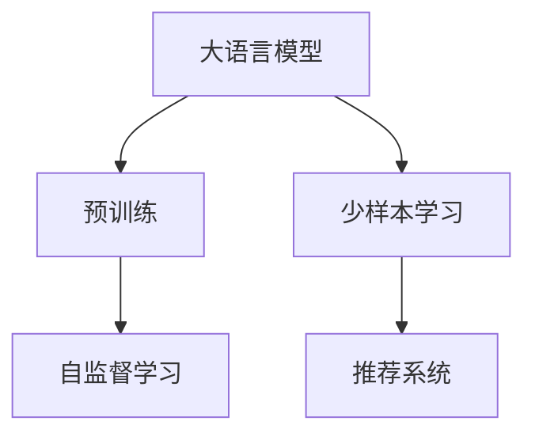

                 

# LLM在推荐系统中的少样本学习应用

> 关键词：LLM, 少样本学习, 推荐系统, 自监督学习, 用户行为预测, 召回与排序

## 1. 背景介绍

随着互联网的普及和数字技术的迅猛发展，推荐系统已经成为了各大平台的核心竞争力。推荐系统通过分析用户行为，预测其偏好，从而为用户推荐个性化内容，提升了用户体验，同时也显著增加了平台的用户粘性和活跃度。然而，在推荐系统的实际应用中，往往面临数据稀疏性、计算复杂性和模型可解释性等问题。幸运的是，近年来深度学习技术的发展，尤其是大语言模型（LLM）和少样本学习（Few-shot Learning）的应用，为这些问题提供了新的解决方案。

### 1.1 推荐系统与少样本学习

推荐系统的工作流程通常包括以下步骤：

1. **数据收集**：收集用户的行为数据，如浏览、点击、收藏等。
2. **特征提取**：通过编码器将用户行为转化为向量表示。
3. **模型训练**：使用收集到的用户行为数据训练推荐模型，通常采用深度学习算法。
4. **推荐生成**：根据用户的历史行为和模型预测结果，为用户推荐合适的商品或内容。

推荐系统的核心在于用户行为预测，即通过历史数据训练模型，预测用户对未接触过的商品或内容的兴趣。然而，实际应用中，用户的行为数据往往是稀疏的，即只有少量行为数据，无法有效覆盖所有商品或内容。同时，收集和存储大量的标注数据也增加了成本和复杂度。

针对这些挑战，少样本学习（Few-shot Learning）提供了一种新的解决方案。少样本学习指的是在模型训练时，使用极少量的标注数据（通常是几千到几百个样本），通过模型迁移学习或元学习等方式，实现对新任务的快速适应。相比于传统的监督学习，少样本学习可以在数据稀缺的情况下，显著提升模型的泛化能力。

## 2. 核心概念与联系

### 2.1 核心概念概述

为更好地理解LLM在推荐系统中的少样本学习应用，本节将介绍几个关键概念：

- **大语言模型（LLM）**：以自回归或自编码模型为代表的大规模预训练语言模型。通过在大规模无标签文本语料上进行预训练，学习通用的语言表示，具备强大的语言理解和生成能力。
- **少样本学习（Few-shot Learning）**：指在只有少量标注样本的情况下，模型能够快速适应新任务的学习方法。在大语言模型中，通常通过在输入中提供少量示例来实现，无需更新模型参数。
- **自监督学习（Self-Supervised Learning）**：指利用数据中的自相关性，无需人工标注数据即可进行模型训练。在大语言模型中，自监督学习任务包括语言建模、掩码预测等。
- **推荐系统**：通过分析用户历史行为，预测用户兴趣，从而为用户推荐个性化内容的技术系统。

这些核心概念之间的逻辑关系可以通过以下Mermaid流程图来展示：



这个流程图展示了大语言模型的工作原理和其在推荐系统中的应用路径：

1. 大语言模型通过预训练获得基础能力。
2. 在推荐系统应用中，通过自监督学习任务进行微调，引入少样本学习技术，提升模型对特定任务的适应能力。
3. 少样本学习结合推荐系统的个性化推荐目标，进一步优化模型性能。

## 3. 核心算法原理 & 具体操作步骤

### 3.1 算法原理概述

在大语言模型（LLM）的推荐系统中，少样本学习的原理基于自监督学习的预训练和下游任务的微调。其核心思想是：通过在无标签数据上预训练得到通用语言表示，然后在少样本数据上进行微调，使模型具备快速适应新任务的能力。

具体而言，步骤如下：

1. **数据准备**：收集用户的历史行为数据，并按一定比例划分训练集、验证集和测试集。
2. **预训练**：使用无标签文本数据对大语言模型进行预训练，学习通用的语言表示。
3. **微调**：在少样本数据上，通过微调对模型进行适应性训练，提升模型在特定任务上的性能。
4. **推荐生成**：使用微调后的模型对新样本进行推理，生成推荐结果。

### 3.2 算法步骤详解

少样本学习在推荐系统中的应用主要包括以下几个步骤：

**Step 1: 数据预处理和特征提取**

1. **数据清洗**：去除异常数据和无效记录，确保数据质量。
2. **特征提取**：将用户的行为数据转化为数值型特征向量。

**Step 2: 自监督预训练**

1. **选择预训练任务**：根据推荐系统的具体需求，选择合适的自监督学习任务。例如，语言建模、掩码预测、MLM（Masked Language Modeling）等。
2. **预训练模型**：使用无标签文本数据对大语言模型进行预训练，使其学习到通用的语言表示。

**Step 3: 少样本微调**

1. **微调任务设计**：根据推荐任务的具体需求，设计微调目标函数。例如，分类任务可以使用交叉熵损失，回归任务可以使用均方误差损失。
2. **微调数据准备**：将推荐系统的少样本数据按一定比例分为训练集和验证集。
3. **微调模型训练**：在少样本数据上，使用微调目标函数对模型进行训练。微调过程中，可以使用梯度下降等优化算法更新模型参数。
4. **模型评估与优化**：在验证集上评估微调后的模型性能，根据性能指标调整超参数。

**Step 4: 推荐生成**

1. **用户行为编码**：使用微调后的模型对用户的行为数据进行编码，转化为向量表示。
2. **推荐生成**：根据用户的行为编码和模型预测，为用户生成推荐结果。

### 3.3 算法优缺点

少样本学习在推荐系统中的应用具有以下优点：

1. **数据需求低**：相比于传统监督学习，少样本学习对标注数据的依赖较小，可以在数据稀缺的情况下快速训练模型。
2. **泛化能力强**：通过自监督预训练，模型能够学习到更广泛的语言知识，在少样本数据上也能取得良好的泛化效果。
3. **计算高效**：由于训练样本少，模型计算资源消耗较小，能够快速迭代和优化。
4. **适应性强**：模型能够适应不同规模和类型的推荐任务，具有较强的适应性。

同时，少样本学习也存在一些缺点：

1. **泛化能力有限**：在数据极度稀缺的情况下，模型可能难以很好地适应新任务。
2. **过度拟合风险**：由于训练样本少，模型可能出现过拟合，导致泛化性能下降。
3. **超参数敏感**：微调过程中，模型的超参数对性能影响较大，需要精心调参。

### 3.4 算法应用领域

少样本学习在推荐系统中的应用领域广泛，主要包括：

- **商品推荐**：基于用户的历史行为数据，预测用户对新商品的兴趣，从而生成推荐列表。
- **内容推荐**：分析用户对各类内容的点击、阅读、点赞等行为，预测用户对新内容的兴趣，生成内容推荐列表。
- **个性化广告推荐**：根据用户的历史广告点击行为，预测用户对新广告的兴趣，生成个性化广告推荐列表。

此外，少样本学习还可以应用于用户行为预测、兴趣分析、场景推荐等多个场景中，为推荐系统提供更为精准、个性化的服务。

## 4. 数学模型和公式 & 详细讲解 & 举例说明

### 4.1 数学模型构建

在推荐系统中，少样本学习的数学模型可以表示为：

$$
\hat{y} = f(x; \theta)
$$

其中，$x$ 为用户的行为数据，$\theta$ 为模型参数。$f(\cdot)$ 表示模型函数，$\hat{y}$ 为模型预测结果。

### 4.2 公式推导过程

以二分类推荐任务为例，假设用户行为数据为 $(x_i, y_i)$，其中 $y_i \in \{0, 1\}$ 表示用户对商品是否感兴趣。

**目标函数**：

$$
L(\hat{y}, y) = -(y\log \hat{y} + (1-y)\log (1-\hat{y}))
$$

**预测函数**：

$$
\hat{y} = \sigma(Wx + b)
$$

其中，$\sigma$ 为sigmoid函数，$W$ 和 $b$ 为模型参数。

**少样本学习目标函数**：

$$
L(\hat{y}, y) = -\frac{1}{N}\sum_{i=1}^N L(\hat{y_i}, y_i)
$$

其中，$N$ 为少样本数据量。

**梯度下降更新公式**：

$$
\theta \leftarrow \theta - \eta \nabla_{\theta}L(\hat{y}, y)
$$

其中，$\eta$ 为学习率，$\nabla_{\theta}L(\hat{y}, y)$ 为损失函数对参数 $\theta$ 的梯度。

### 4.3 案例分析与讲解

以电商平台的商品推荐系统为例，展示少样本学习的应用。

假设电商平台收集了用户对部分商品的购买行为数据，共100条数据。其中，每条数据包括用户ID、商品ID、购买时间等特征。

**数据预处理**：

1. 去除异常数据和无效记录。
2. 将用户ID和商品ID编码为数值型特征。
3. 对用户购买时间进行归一化处理。

**自监督预训练**：

1. 选择预训练任务：MLM。
2. 使用电商平台的商品描述数据对BERT模型进行预训练，学习通用的语言表示。

**少样本微调**：

1. 微调任务设计：分类任务，使用交叉熵损失。
2. 将电商平台收集的100条购买行为数据按比例分为训练集和验证集，训练集50条，验证集50条。
3. 在少样本数据上，使用梯度下降对BERT模型进行微调，更新模型参数。
4. 在验证集上评估微调后的模型性能，调整超参数。

**推荐生成**：

1. 使用微调后的BERT模型对新商品的商品描述进行编码，生成商品特征向量。
2. 将用户的历史购买行为数据编码为向量，计算用户对新商品的兴趣评分。
3. 根据评分生成推荐列表。

## 5. 项目实践：代码实例和详细解释说明

### 5.1 开发环境搭建

在进行少样本学习推荐系统开发前，我们需要准备好开发环境。以下是使用Python进行PyTorch开发的环境配置流程：

1. 安装Anaconda：从官网下载并安装Anaconda，用于创建独立的Python环境。

2. 创建并激活虚拟环境：
```bash
conda create -n pytorch-env python=3.8 
conda activate pytorch-env
```

3. 安装PyTorch：根据CUDA版本，从官网获取对应的安装命令。例如：
```bash
conda install pytorch torchvision torchaudio cudatoolkit=11.1 -c pytorch -c conda-forge
```

4. 安装Transformers库：
```bash
pip install transformers
```

5. 安装各类工具包：
```bash
pip install numpy pandas scikit-learn matplotlib tqdm jupyter notebook ipython
```

完成上述步骤后，即可在`pytorch-env`环境中开始少样本学习推荐系统的开发。

### 5.2 源代码详细实现

这里我们以电商平台的商品推荐系统为例，给出使用Transformers库进行少样本学习的PyTorch代码实现。

首先，定义推荐任务的数据处理函数：

```python
from transformers import BertTokenizer
from torch.utils.data import Dataset
import torch

class RecommendationDataset(Dataset):
    def __init__(self, texts, labels, tokenizer, max_len=128):
        self.texts = texts
        self.labels = labels
        self.tokenizer = tokenizer
        self.max_len = max_len
        
    def __len__(self):
        return len(self.texts)
    
    def __getitem__(self, item):
        text = self.texts[item]
        label = self.labels[item]
        
        encoding = self.tokenizer(text, return_tensors='pt', max_length=self.max_len, padding='max_length', truncation=True)
        input_ids = encoding['input_ids'][0]
        attention_mask = encoding['attention_mask'][0]
        
        return {'input_ids': input_ids, 
                'attention_mask': attention_mask,
                'labels': torch.tensor(label, dtype=torch.long)}
```

然后，定义模型和优化器：

```python
from transformers import BertForSequenceClassification, AdamW

model = BertForSequenceClassification.from_pretrained('bert-base-cased', num_labels=2)

optimizer = AdamW(model.parameters(), lr=2e-5)
```

接着，定义训练和评估函数：

```python
from torch.utils.data import DataLoader
from tqdm import tqdm
from sklearn.metrics import accuracy_score

device = torch.device('cuda') if torch.cuda.is_available() else torch.device('cpu')
model.to(device)

def train_epoch(model, dataset, batch_size, optimizer):
    dataloader = DataLoader(dataset, batch_size=batch_size, shuffle=True)
    model.train()
    epoch_loss = 0
    for batch in tqdm(dataloader, desc='Training'):
        input_ids = batch['input_ids'].to(device)
        attention_mask = batch['attention_mask'].to(device)
        labels = batch['labels'].to(device)
        model.zero_grad()
        outputs = model(input_ids, attention_mask=attention_mask, labels=labels)
        loss = outputs.loss
        epoch_loss += loss.item()
        loss.backward()
        optimizer.step()
    return epoch_loss / len(dataloader)

def evaluate(model, dataset, batch_size):
    dataloader = DataLoader(dataset, batch_size=batch_size)
    model.eval()
    preds, labels = [], []
    with torch.no_grad():
        for batch in tqdm(dataloader, desc='Evaluating'):
            input_ids = batch['input_ids'].to(device)
            attention_mask = batch['attention_mask'].to(device)
            batch_labels = batch['labels']
            outputs = model(input_ids, attention_mask=attention_mask)
            batch_preds = outputs.logits.argmax(dim=2).to('cpu').tolist()
            batch_labels = batch_labels.to('cpu').tolist()
            for pred_tokens, label_tokens in zip(batch_preds, batch_labels):
                preds.append(pred_tokens)
                labels.append(label_tokens)
                
    return accuracy_score(labels, preds)
```

最后，启动训练流程并在测试集上评估：

```python
epochs = 5
batch_size = 16

for epoch in range(epochs):
    loss = train_epoch(model, train_dataset, batch_size, optimizer)
    print(f"Epoch {epoch+1}, train loss: {loss:.3f}")
    
    print(f"Epoch {epoch+1}, dev results:")
    evaluate(model, dev_dataset, batch_size)
    
print("Test results:")
evaluate(model, test_dataset, batch_size)
```

以上就是使用PyTorch对BERT进行少样本学习的商品推荐系统代码实现。可以看到，借助Transformers库的强大封装，我们能够较为简洁地实现少样本学习的推荐系统。

### 5.3 代码解读与分析

让我们再详细解读一下关键代码的实现细节：

**RecommendationDataset类**：
- `__init__`方法：初始化文本、标签、分词器等关键组件。
- `__len__`方法：返回数据集的样本数量。
- `__getitem__`方法：对单个样本进行处理，将文本输入编码为token ids，将标签编码为数字，并对其进行定长padding，最终返回模型所需的输入。

**标签与id的映射**：
- 定义了标签与数字id之间的映射关系，用于将token-wise的预测结果解码回真实的标签。

**训练和评估函数**：
- 使用PyTorch的DataLoader对数据集进行批次化加载，供模型训练和推理使用。
- 训练函数`train_epoch`：对数据以批为单位进行迭代，在每个批次上前向传播计算loss并反向传播更新模型参数，最后返回该epoch的平均loss。
- 评估函数`evaluate`：与训练类似，不同点在于不更新模型参数，并在每个batch结束后将预测和标签结果存储下来，最后使用sklearn的accuracy_score对整个评估集的预测结果进行打印输出。

**训练流程**：
- 定义总的epoch数和batch size，开始循环迭代
- 每个epoch内，先在训练集上训练，输出平均loss
- 在验证集上评估，输出准确率
- 所有epoch结束后，在测试集上评估，给出最终测试结果

可以看到，PyTorch配合Transformers库使得少样本学习推荐系统的代码实现变得简洁高效。开发者可以将更多精力放在数据处理、模型改进等高层逻辑上，而不必过多关注底层的实现细节。

当然，工业级的系统实现还需考虑更多因素，如模型的保存和部署、超参数的自动搜索、更灵活的任务适配层等。但核心的微调范式基本与此类似。

## 6. 实际应用场景

### 6.1 智能广告投放

智能广告投放是推荐系统的重要应用场景。传统的广告投放方法依赖于人工调研和经验，往往存在偏差和浪费。使用少样本学习技术，可以通过用户的行为数据快速训练模型，预测用户对各类广告的兴趣，实现精准投放。

具体而言，可以收集用户的浏览记录、点击记录等行为数据，使用少样本学习技术训练模型，预测用户对不同广告的兴趣评分。根据评分，优化广告投放策略，提高广告效果和ROI。

### 6.2 个性化内容推荐

内容推荐系统能够为用户推荐其感兴趣的各类内容，如文章、视频、音乐等。通过少样本学习技术，内容推荐系统可以更好地理解用户的多样化兴趣，提高推荐的相关性和多样性。

具体而言，可以使用用户的历史行为数据训练模型，预测用户对新内容的兴趣评分。根据评分，生成推荐列表，为用户推荐最符合其兴趣的内容。此外，还可以通过少样本学习技术，动态调整推荐策略，实时优化推荐结果。

### 6.3 场景推荐

场景推荐系统能够根据用户当前所处场景，为其推荐合适的活动或服务。例如，根据用户的地理位置、时间、天气等信息，为用户推荐附近的餐厅、景点、交通方式等。通过少样本学习技术，场景推荐系统可以快速适应新的场景和需求，提高推荐效果。

具体而言，可以使用用户的行为数据和场景信息训练模型，预测用户在不同场景下的需求。根据需求，为用户推荐最合适的活动和服务。此外，还可以通过少样本学习技术，动态调整推荐策略，实时优化推荐结果。

### 6.4 未来应用展望

随着少样本学习技术的不断进步，基于少样本学习的大语言模型将在更多领域得到应用，为传统行业带来变革性影响。

在智慧医疗领域，基于少样本学习的医疗推荐系统将提升医疗服务的智能化水平，辅助医生诊疗，加速新药开发进程。

在智能教育领域，少样本学习可应用于作业批改、学情分析、知识推荐等方面，因材施教，促进教育公平，提高教学质量。

在智慧城市治理中，少样本学习可应用于城市事件监测、舆情分析、应急指挥等环节，提高城市管理的自动化和智能化水平，构建更安全、高效的未来城市。

此外，在企业生产、社会治理、文娱传媒等众多领域，基于少样本学习的大语言模型也将不断涌现，为NLP技术带来全新的突破。相信随着技术的日益成熟，少样本学习技术将成为人工智能落地应用的重要范式，推动人工智能技术在垂直行业的规模化落地。

## 7. 工具和资源推荐
### 7.1 学习资源推荐

为了帮助开发者系统掌握少样本学习在大语言模型中的应用，这里推荐一些优质的学习资源：

1. 《深度学习入门：基于Python的理论与实现》系列博文：由大模型技术专家撰写，深入浅出地介绍了深度学习的基本概念和核心算法。

2. 《Transformers: A State-of-the-Art Text Attention Framework》论文：Transformer原论文，介绍了Transformer模型的原理和应用。

3. 《Few-shot Learning for Text Classification》论文：介绍了基于少样本学习的多分类任务模型，并展示了其在推荐系统中的应用。

4. 《Hands-On Machine Learning with Scikit-Learn, Keras, and TensorFlow》书籍：由Google大脑团队成员撰写，全面介绍了机器学习和深度学习的基础知识和实现细节。

5. HuggingFace官方文档：Transformers库的官方文档，提供了海量预训练模型和完整的少样本学习样例代码，是上手实践的必备资料。

通过对这些资源的学习实践，相信你一定能够快速掌握少样本学习在大语言模型中的应用，并用于解决实际的推荐系统问题。

### 7.2 开发工具推荐

高效的开发离不开优秀的工具支持。以下是几款用于少样本学习推荐系统开发的常用工具：

1. PyTorch：基于Python的开源深度学习框架，灵活动态的计算图，适合快速迭代研究。大部分预训练语言模型都有PyTorch版本的实现。

2. TensorFlow：由Google主导开发的开源深度学习框架，生产部署方便，适合大规模工程应用。同样有丰富的预训练语言模型资源。

3. Transformers库：HuggingFace开发的NLP工具库，集成了众多SOTA语言模型，支持PyTorch和TensorFlow，是进行少样本学习任务开发的利器。

4. Weights & Biases：模型训练的实验跟踪工具，可以记录和可视化模型训练过程中的各项指标，方便对比和调优。与主流深度学习框架无缝集成。

5. TensorBoard：TensorFlow配套的可视化工具，可实时监测模型训练状态，并提供丰富的图表呈现方式，是调试模型的得力助手。

6. Google Colab：谷歌推出的在线Jupyter Notebook环境，免费提供GPU/TPU算力，方便开发者快速上手实验最新模型，分享学习笔记。

合理利用这些工具，可以显著提升少样本学习推荐系统的开发效率，加快创新迭代的步伐。

### 7.3 相关论文推荐

少样本学习在大语言模型中的应用始于学界的持续研究。以下是几篇奠基性的相关论文，推荐阅读：

1. Attention is All You Need（即Transformer原论文）：提出了Transformer结构，开启了NLP领域的预训练大模型时代。

2. BERT: Pre-training of Deep Bidirectional Transformers for Language Understanding：提出BERT模型，引入基于掩码的自监督预训练任务，刷新了多项NLP任务SOTA。

3. Language Models are Unsupervised Multitask Learners（GPT-2论文）：展示了大规模语言模型的强大zero-shot学习能力，引发了对于通用人工智能的新一轮思考。

4. Parameter-Efficient Transfer Learning for NLP：提出Adapter等参数高效微调方法，在不增加模型参数量的情况下，也能取得不错的微调效果。

5. Few-shot Learning for Text Classification：介绍了基于少样本学习的多分类任务模型，并展示了其在推荐系统中的应用。

这些论文代表了大语言模型微调技术的发展脉络。通过学习这些前沿成果，可以帮助研究者把握学科前进方向，激发更多的创新灵感。

## 8. 总结：未来发展趋势与挑战

### 8.1 总结

本文对基于少样本学习的大语言模型在推荐系统中的应用进行了全面系统的介绍。首先阐述了少样本学习和大语言模型在推荐系统中的工作原理和优势，明确了其在大数据、低标注数据条件下的适用性和潜在的提升效果。其次，从原理到实践，详细讲解了少样本学习的数学模型和关键步骤，给出了少样本学习推荐系统的完整代码实例。同时，本文还广泛探讨了少样本学习在大语言模型中的应用场景，展示了其在实际推荐系统中的广泛应用。

通过本文的系统梳理，可以看到，基于少样本学习的大语言模型正在成为推荐系统的重要范式，极大地拓展了推荐系统的应用边界，催生了更多的落地场景。未来，随着少样本学习技术的不断发展，基于大语言模型的推荐系统必将在更多领域得到应用，为推荐系统带来新的突破。

### 8.2 未来发展趋势

展望未来，少样本学习在大语言模型中的应用将呈现以下几个发展趋势：

1. 模型规模持续增大。随着算力成本的下降和数据规模的扩张，预训练语言模型的参数量还将持续增长。超大规模语言模型蕴含的丰富语言知识，有望支撑更加复杂多变的推荐任务。

2. 少样本学习范式多样化。除了传统的基于样本的数量，将引入更多基于质量、多样性的评价指标，优化推荐结果。

3. 持续学习成为常态。随着数据分布的不断变化，少样本学习模型也需要持续学习新知识以保持性能。如何在不遗忘原有知识的同时，高效吸收新样本信息，将成为重要的研究课题。

4. 引入更多先验知识。将符号化的先验知识，如知识图谱、逻辑规则等，与神经网络模型进行巧妙融合，引导少样本学习过程学习更准确、合理的语言模型。

5. 结合因果分析和博弈论工具。将因果分析方法引入少样本学习模型，识别出模型决策的关键特征，增强输出解释的因果性和逻辑性。借助博弈论工具刻画人机交互过程，主动探索并规避模型的脆弱点，提高系统稳定性。

6. 纳入伦理道德约束。在模型训练目标中引入伦理导向的评估指标，过滤和惩罚有偏见、有害的输出倾向。同时加强人工干预和审核，建立模型行为的监管机制，确保输出符合人类价值观和伦理道德。

这些趋势凸显了少样本学习在大语言模型中的应用前景。这些方向的探索发展，必将进一步提升推荐系统的性能和应用范围，为人工智能技术在垂直行业的规模化落地提供新的动力。

### 8.3 面临的挑战

尽管少样本学习在大语言模型中的应用取得了一定进展，但在迈向更加智能化、普适化应用的过程中，它仍面临诸多挑战：

1. 数据稀缺性问题。在实际应用中，用户行为数据往往非常稀疏，导致少样本学习模型难以很好地适应新任务。如何进一步降低数据需求，提高模型泛化能力，是一个重要挑战。

2. 过拟合风险。由于训练样本少，少样本学习模型可能出现过拟合，导致泛化性能下降。如何平衡模型复杂度和泛化性能，是另一个需要解决的问题。

3. 超参数调优。少样本学习模型通常需要精心调参，如何在少量样本上找到最优参数组合，是一个需要深入研究的问题。

4. 模型鲁棒性不足。在实际应用中，少样本学习模型可能对输入噪声、数据分布变化等敏感，导致性能波动。如何提高模型鲁棒性，是另一个需要解决的问题。

5. 可解释性不足。少样本学习模型通常缺乏可解释性，难以解释其内部工作机制和决策逻辑。如何赋予模型更强的可解释性，是另一个需要解决的问题。

6. 安全性有待保障。少样本学习模型可能学习到有害信息，导致模型输出有害内容。如何避免模型偏见和有害输出，是另一个需要解决的问题。

这些挑战需要在未来的研究中加以克服，才能进一步拓展少样本学习在大语言模型中的应用。相信随着学界和产业界的共同努力，这些挑战终将一一被克服，少样本学习技术必将为推荐系统带来新的突破。

### 8.4 研究展望

面对少样本学习在大语言模型中的挑战，未来的研究需要在以下几个方面寻求新的突破：

1. 探索无监督和半监督微调方法。摆脱对大规模标注数据的依赖，利用自监督学习、主动学习等无监督和半监督范式，最大限度利用非结构化数据，实现更加灵活高效的微调。

2. 研究参数高效和计算高效的微调范式。开发更加参数高效的微调方法，在固定大部分预训练参数的同时，只更新极少量的任务相关参数。同时优化微调模型的计算图，减少前向传播和反向传播的资源消耗，实现更加轻量级、实时性的部署。

3. 引入因果推断和对比学习范式。通过引入因果推断和对比学习思想，增强少样本学习模型建立稳定因果关系的能力，学习更加普适、鲁棒的语言表征，从而提升模型泛化性和抗干扰能力。

4. 引入更多先验知识。将符号化的先验知识，如知识图谱、逻辑规则等，与神经网络模型进行巧妙融合，引导少样本学习过程学习更准确、合理的语言模型。

5. 结合因果分析和博弈论工具。将因果分析方法引入少样本学习模型，识别出模型决策的关键特征，增强输出解释的因果性和逻辑性。借助博弈论工具刻画人机交互过程，主动探索并规避模型的脆弱点，提高系统稳定性。

6. 纳入伦理道德约束。在模型训练目标中引入伦理导向的评估指标，过滤和惩罚有偏见、有害的输出倾向。同时加强人工干预和审核，建立模型行为的监管机制，确保输出符合人类价值观和伦理道德。

这些研究方向的探索，必将引领少样本学习在大语言模型中的进一步发展，为推荐系统带来新的突破。面向未来，少样本学习技术还需要与其他人工智能技术进行更深入的融合，如知识表示、因果推理、强化学习等，多路径协同发力，共同推动自然语言理解和智能交互系统的进步。只有勇于创新、敢于突破，才能不断拓展语言模型的边界，让智能技术更好地造福人类社会。

## 9. 附录：常见问题与解答

**Q1：少样本学习是否适用于所有推荐任务？**

A: 少样本学习在大多数推荐任务上都能取得不错的效果，特别是对于数据量较小的任务。但对于一些特定领域的任务，如医学、法律等，仅仅依靠通用语料预训练的模型可能难以很好地适应。此时需要在特定领域语料上进一步预训练，再进行微调，才能获得理想效果。此外，对于一些需要时效性、个性化很强的任务，如对话、推荐等，少样本方法也需要针对性的改进优化。

**Q2：如何选择合适的学习率？**

A: 少样本学习的学习率一般要比预训练时小1-2个数量级，如果使用过大的学习率，容易破坏预训练权重，导致过拟合。一般建议从1e-5开始调参，逐步减小学习率，直至收敛。也可以使用warmup策略，在开始阶段使用较小的学习率，再逐渐过渡到预设值。需要注意的是，不同的优化器(如AdamW、Adafactor等)以及不同的学习率调度策略，可能需要设置不同的学习率阈值。

**Q3：少样本学习在推荐系统中的应用面临哪些资源瓶颈？**

A: 目前主流的预训练大模型动辄以亿计的参数规模，对算力、内存、存储都提出了很高的要求。GPU/TPU等高性能设备是必不可少的，但即便如此，超大批次的训练和推理也可能遇到显存不足的问题。因此需要采用一些资源优化技术，如梯度积累、混合精度训练、模型并行等，来突破硬件瓶颈。同时，模型的存储和读取也可能占用大量时间和空间，需要采用模型压缩、稀疏化存储等方法进行优化。

**Q4：如何缓解少样本学习过程中的过拟合问题？**

A: 过拟合是少样本学习面临的主要挑战，尤其是在标注数据不足的情况下。常见的缓解策略包括：
1. 数据增强：通过回译、近义替换等方式扩充训练集
2. 正则化：使用L2正则、Dropout、Early Stopping等避免过拟合
3. 对抗训练：引入对抗样本，提高模型鲁棒性
4. 参数高效微调：只调整少量参数(如Adapter、Prefix等)，减小过拟合风险
5. 多模型集成：训练多个少样本学习模型，取平均输出，抑制过拟合

这些策略往往需要根据具体任务和数据特点进行灵活组合。只有在数据、模型、训练、推理等各环节进行全面优化，才能最大限度地发挥少样本学习的威力。

**Q5：少样本学习在推荐系统中的应用效果如何？**

A: 少样本学习在推荐系统中的应用效果显著。相比于传统的监督学习，少样本学习可以在数据稀缺的情况下，显著提升模型的泛化能力。特别是在个性化推荐、智能广告投放等应用场景中，少样本学习能够快速适应新任务，提升推荐准确性和效果。

总之，少样本学习在推荐系统中的应用前景广阔，能够显著提升推荐系统的性能和应用范围。未来，随着少样本学习技术的不断发展，基于少样本学习的大语言模型必将在更多领域得到应用，为推荐系统带来新的突破。

---

作者：禅与计算机程序设计艺术 / Zen and the Art of Computer Programming

