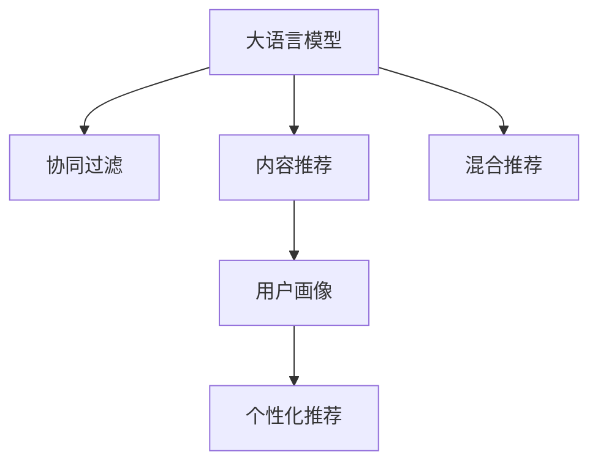

                 

# LLM在推荐系统中的应用探索

> 关键词：大语言模型,推荐系统,协同过滤,内容推荐,混合推荐,用户画像,个性化推荐

## 1. 背景介绍

### 1.1 问题由来
推荐系统(Recommendation System)是互联网时代下的重要应用之一，通过算法为用户推荐感兴趣的内容，提升用户体验，带来更好的价值。随着信息爆炸和用户需求的个性化，传统基于人工特征工程构建的推荐算法已难以满足实际应用需求，需要更加智能、高效的自动化算法来满足用户需求。

近年来，大语言模型(Large Language Model, LLM)在自然语言处理(NLP)领域取得了突破性进展，凭借强大的语言理解和生成能力，逐步在推荐系统领域得到广泛应用。尤其是在用户画像建立、内容生成和推荐排序等方面，大语言模型展现出了巨大的潜力。

### 1.2 问题核心关键点
大语言模型在推荐系统中的应用，主要是通过以下三个方面：
1. **用户画像**：利用大语言模型对用户进行更丰富的特征提取，形成更加全面、精准的用户画像。
2. **内容生成**：通过大语言模型自动生成高质量的推荐内容，如商品描述、评论、问题解答等，丰富推荐素材。
3. **推荐排序**：利用大语言模型进行推荐排序，提升推荐效果。

本文聚焦于大语言模型在推荐系统中的应用，探讨其原理与实践，为推荐系统开发人员提供系统的技术指引。

## 2. 核心概念与联系

### 2.1 核心概念概述

为更好地理解大语言模型在推荐系统中的应用，本节将介绍几个密切相关的核心概念：

- **大语言模型(Large Language Model, LLM)**：以自回归(如GPT)或自编码(如BERT)模型为代表的大规模预训练语言模型。通过在海量无标签文本语料上进行预训练，学习通用的语言表示，具备强大的语言理解和生成能力。

- **协同过滤(Collaborative Filtering, CF)**：一种基于用户行为数据进行推荐的主流算法，通过挖掘用户和物品之间的相似性进行推荐。常见的CF算法包括基于用户的CF和基于物品的CF。

- **内容推荐(Content-Based Recommendation)**：根据物品本身的属性信息(如商品描述、标签等)，以及用户的历史行为数据，进行推荐。内容推荐依赖丰富的数据特征，能够较好地处理长尾数据，但缺乏对用户兴趣的动态理解。

- **混合推荐(Mixed Recommendation)**：将协同过滤和内容推荐结合起来，取长补短，提升推荐效果。混合推荐能够同时考虑用户和物品的复杂特征，提升推荐的个性化和多样性。

- **用户画像(User Profiling)**：通过对用户的行为数据和内容数据进行建模，形成一个全面的用户画像，帮助推荐系统更好地理解用户兴趣和行为模式。

- **个性化推荐(Personalized Recommendation)**：针对每个用户，根据其历史行为和当前需求，提供个性化的推荐内容，满足其独特的兴趣和需求。

这些核心概念之间的逻辑关系可以通过以下Mermaid流程图来展示：



这个流程图展示了大语言模型与推荐系统各组件的紧密联系：

1. 大语言模型在协同过滤、内容推荐和混合推荐中发挥作用。
2. 用户画像的构建依赖大语言模型进行特征提取。
3. 个性化推荐依赖用户画像进行精准推荐。

## 3. 核心算法原理 & 具体操作步骤
### 3.1 算法原理概述

大语言模型在推荐系统中的应用，主要是通过以下步骤：
1. 利用大语言模型对用户和物品的特征进行自然语言建模，构建全面的用户画像和高质量的推荐内容。
2. 在协同过滤、内容推荐和混合推荐算法中使用大语言模型的输出进行推荐排序和优化。
3. 利用用户画像进行个性化推荐，满足每个用户的独特需求。

### 3.2 算法步骤详解

**Step 1: 数据预处理**

大语言模型在推荐系统中的第一步是对原始数据进行预处理。具体包括：

- 数据收集：收集用户行为数据、物品属性数据和内容数据。用户行为数据包括点击、购买、评分等；物品属性数据包括商品属性、类别等；内容数据包括商品描述、用户评论等。
- 数据清洗：去除数据中的噪音和异常值，确保数据质量和完整性。
- 数据编码：将数据转换为模型可以处理的格式，如将文本数据编码为token序列。

**Step 2: 大语言模型训练**

在数据预处理的基础上，利用大语言模型进行特征提取和内容生成。具体步骤如下：

- 特征提取：利用大语言模型对用户和物品进行自然语言建模，提取用户画像和物品属性。例如，使用BERT模型对用户行为数据进行建模，得到用户兴趣向量。
- 内容生成：利用大语言模型生成高质量的推荐内容。例如，使用GPT模型自动生成商品描述、用户评论等。

**Step 3: 协同过滤**

利用协同过滤算法进行推荐排序。具体步骤如下：

- 相似度计算：计算用户和物品之间的相似度，例如使用余弦相似度或皮尔逊相关系数。
- 推荐排序：根据相似度对物品进行排序，选择推荐列表中的topN物品。

**Step 4: 内容推荐**

在内容推荐中，利用物品属性和用户画像进行推荐排序。具体步骤如下：

- 特征匹配：将物品属性与用户画像进行匹配，选择最符合用户兴趣的物品。
- 推荐排序：根据匹配度对物品进行排序，选择推荐列表中的topN物品。

**Step 5: 混合推荐**

将协同过滤和内容推荐结合起来，取长补短。具体步骤如下：

- 特征合并：将协同过滤和内容推荐的结果进行合并，生成一个综合的推荐列表。
- 推荐排序：根据综合特征对物品进行排序，选择推荐列表中的topN物品。

**Step 6: 个性化推荐**

利用用户画像进行个性化推荐。具体步骤如下：

- 画像建模：根据用户行为和内容数据，构建全面的用户画像。
- 推荐排序：根据用户画像对物品进行排序，选择推荐列表中的topN物品。

### 3.3 算法优缺点

大语言模型在推荐系统中的应用，有以下几个优点：
1. 强大的自然语言处理能力：大语言模型可以自动理解和生成自然语言，提升推荐系统的个性化和多样性。
2. 丰富的特征提取能力：大语言模型可以从用户行为和内容数据中提取更丰富的特征，提升推荐的准确性和精度。
3. 自适应性：大语言模型可以适应不同的数据和任务，灵活应用到各种推荐场景中。

同时，该方法也存在一定的局限性：
1. 数据依赖性：大语言模型的性能很大程度上依赖于数据质量，数据量不足或质量不佳时，可能导致推荐效果不理想。
2. 计算成本高：大语言模型需要大量的计算资源和时间进行训练，对系统性能和成本带来挑战。
3. 模型复杂度：大语言模型往往参数量庞大，模型结构复杂，在实际应用中可能面临推理速度慢、内存占用大的问题。

尽管存在这些局限性，但大语言模型在推荐系统中的应用仍展现了巨大的潜力，未来随着算力成本的下降和技术进步，有望在推荐系统领域发挥更大的作用。

### 3.4 算法应用领域

大语言模型在推荐系统中的应用，已经广泛应用于以下领域：

- **电商推荐**：通过大语言模型生成商品描述、用户评论等，提升推荐效果和用户满意度。
- **视频推荐**：利用大语言模型生成视频描述、用户评论等，提升推荐系统的多样性和个性化。
- **新闻推荐**：通过大语言模型生成新闻标题、摘要等，提升推荐系统的相关性和用户体验。
- **社交推荐**：利用大语言模型生成社交内容、用户评价等，提升推荐系统的多样性和个性化。
- **智能客服**：通过大语言模型生成对话内容、自动回复等，提升用户交互体验。

除了上述这些领域，大语言模型还将在更多场景中得到应用，为推荐系统提供更加全面和精准的解决方案。

## 4. 数学模型和公式 & 详细讲解 & 举例说明

### 4.1 数学模型构建

本节将使用数学语言对大语言模型在推荐系统中的应用进行更加严格的刻画。

记用户行为数据集为 $D=\{(u_i, I_i)\}_{i=1}^N$，其中 $u_i$ 表示用户 $i$，$I_i$ 表示用户的行为数据（如点击、购买、评分等）。物品属性数据集为 $D_I=\{(I_j, F_j)\}_{j=1}^M$，其中 $I_j$ 表示物品 $j$，$F_j$ 表示物品的特征向量。内容数据集为 $D_C=\{(I_k, C_k)\}_{k=1}^K$，其中 $I_k$ 表示内容 $k$，$C_k$ 表示内容的特征向量。

定义用户画像为 $\mathbf{P}_u$，物品属性为 $\mathbf{P}_I$，内容特征为 $\mathbf{P}_C$。利用大语言模型对用户画像、物品属性和内容特征进行建模，得到 $\mathbf{P}_u = BERT(\mathbf{U})$，$\mathbf{P}_I = BERT(\mathbf{F})$，$\mathbf{P}_C = BERT(\mathbf{C})$，其中 $\mathbf{U}$、$\mathbf{F}$、$\mathbf{C}$ 分别为用户行为数据、物品属性数据和内容数据的token序列。

定义推荐结果为 $\mathbf{R}$，表示推荐列表中的物品。推荐排序的目标是最小化损失函数 $\mathcal{L}(\mathbf{P}_u, \mathbf{P}_I, \mathbf{P}_C, \mathbf{R})$，即：

$$
\mathcal{L}(\mathbf{P}_u, \mathbf{P}_I, \mathbf{P}_C, \mathbf{R}) = \min_{R} \sum_{i=1}^N \sum_{j=1}^M |u_i \cdot R_j - F_j \cdot R_j|
$$

其中，$|x|$ 表示 $x$ 的绝对值。

### 4.2 公式推导过程

以下我们以电商推荐为例，推导基于大语言模型的推荐排序公式。

假设用户 $u_i$ 对物品 $I_j$ 进行了购买行为，生成推荐列表 $R$。定义用户画像为 $\mathbf{P}_u$，物品属性为 $\mathbf{P}_I$，内容特征为 $\mathbf{P}_C$。推荐排序的目标是最大化用户购买物品的概率，即最大化 $P_{I_j} = \mathbf{P}_u \cdot \mathbf{P}_I$。

将用户画像、物品属性和内容特征表示为向量形式：

$$
\mathbf{P}_u = [\mathbf{p}_{u_1}, \mathbf{p}_{u_2}, ..., \mathbf{p}_{u_n}], \quad \mathbf{P}_I = [\mathbf{p}_{I_1}, \mathbf{p}_{I_2}, ..., \mathbf{p}_{I_m}], \quad \mathbf{P}_C = [\mathbf{p}_{C_1}, \mathbf{p}_{C_2}, ..., \mathbf{p}_{C_k}]
$$

其中，$\mathbf{p}_{u_i}$ 表示用户 $u_i$ 的兴趣向量，$\mathbf{p}_{I_j}$ 表示物品 $I_j$ 的属性向量，$\mathbf{p}_{C_k}$ 表示内容 $C_k$ 的特征向量。

定义推荐列表 $R$ 为 $R = [\mathbf{r}_1, \mathbf{r}_2, ..., \mathbf{r}_n]$，其中 $\mathbf{r}_i$ 表示物品 $i$ 的推荐概率向量。

根据推荐排序的目标，定义推荐排序函数为 $f(\mathbf{P}_u, \mathbf{P}_I, \mathbf{P}_C, \mathbf{r})$，满足：

$$
f(\mathbf{P}_u, \mathbf{P}_I, \mathbf{P}_C, \mathbf{r}) = \sum_{i=1}^N \log \frac{e^{\mathbf{P}_u \cdot \mathbf{P}_I}}{\sum_{j=1}^M e^{\mathbf{P}_u \cdot \mathbf{P}_I}}
$$

将推荐列表 $R$ 作为优化目标，定义推荐排序问题为：

$$
\max_{R} f(\mathbf{P}_u, \mathbf{P}_I, \mathbf{P}_C, \mathbf{r})
$$

为了简化计算，将推荐概率向量 $\mathbf{r}_i$ 表示为 $[\mathbf{r}_{i_1}, \mathbf{r}_{i_2}, ..., \mathbf{r}_{i_n}]$，其中 $\mathbf{r}_{i_j}$ 表示物品 $i_j$ 的推荐概率。定义推荐排序函数为：

$$
f(\mathbf{P}_u, \mathbf{P}_I, \mathbf{P}_C, \mathbf{r}) = \sum_{i=1}^N \log \frac{e^{\mathbf{P}_u \cdot \mathbf{P}_I}}{\sum_{j=1}^M e^{\mathbf{P}_u \cdot \mathbf{P}_I}}
$$

通过求解上述优化问题，得到推荐列表 $R$，满足：

$$
\mathbf{r}_i = \frac{e^{\mathbf{P}_u \cdot \mathbf{P}_I}}{\sum_{j=1}^M e^{\mathbf{P}_u \cdot \mathbf{P}_I}}
$$

以上公式展示了基于大语言模型的推荐排序方法，利用用户画像和物品属性进行推荐概率计算，并结合内容特征进行优化。

## 5. 项目实践：代码实例和详细解释说明
### 5.1 开发环境搭建

在进行大语言模型在推荐系统中的应用实践前，我们需要准备好开发环境。以下是使用Python进行PyTorch开发的环境配置流程：

1. 安装Anaconda：从官网下载并安装Anaconda，用于创建独立的Python环境。

2. 创建并激活虚拟环境：
```bash
conda create -n pytorch-env python=3.8 
conda activate pytorch-env
```

3. 安装PyTorch：根据CUDA版本，从官网获取对应的安装命令。例如：
```bash
conda install pytorch torchvision torchaudio cudatoolkit=11.1 -c pytorch -c conda-forge
```

4. 安装Transformers库：
```bash
pip install transformers
```

5. 安装各类工具包：
```bash
pip install numpy pandas scikit-learn matplotlib tqdm jupyter notebook ipython
```

完成上述步骤后，即可在`pytorch-env`环境中开始推荐系统开发实践。

### 5.2 源代码详细实现

这里以电商推荐为例，给出一个基于大语言模型的推荐系统开发示例代码。

首先，定义推荐系统的数据处理函数：

```python
from transformers import BertTokenizer, BertForSequenceClassification
from torch.utils.data import Dataset
import torch

class RecommendationDataset(Dataset):
    def __init__(self, user_data, item_data, content_data):
        self.user_data = user_data
        self.item_data = item_data
        self.content_data = content_data
        self.tokenizer = BertTokenizer.from_pretrained('bert-base-cased')
        
    def __len__(self):
        return len(self.user_data)
    
    def __getitem__(self, item):
        user = self.user_data[item]
        item = self.item_data[item]
        content = self.content_data[item]
        
        user_input = self.tokenizer(user, return_tensors='pt', max_length=512, padding='max_length', truncation=True)
        item_input = self.tokenizer(item, return_tensors='pt', max_length=512, padding='max_length', truncation=True)
        content_input = self.tokenizer(content, return_tensors='pt', max_length=512, padding='max_length', truncation=True)
        
        user_embeddings = user_input['input_ids'].to(device)
        item_embeddings = item_input['input_ids'].to(device)
        content_embeddings = content_input['input_ids'].to(device)
        
        return {'user_embeddings': user_embeddings,
                'item_embeddings': item_embeddings,
                'content_embeddings': content_embeddings}
```

然后，定义模型和优化器：

```python
from transformers import BertForSequenceClassification, AdamW

model = BertForSequenceClassification.from_pretrained('bert-base-cased', num_labels=1)

optimizer = AdamW(model.parameters(), lr=2e-5)
```

接着，定义训练和评估函数：

```python
from torch.utils.data import DataLoader
from tqdm import tqdm

device = torch.device('cuda') if torch.cuda.is_available() else torch.device('cpu')
model.to(device)

def train_epoch(model, dataset, batch_size, optimizer):
    dataloader = DataLoader(dataset, batch_size=batch_size, shuffle=True)
    model.train()
    epoch_loss = 0
    for batch in tqdm(dataloader, desc='Training'):
        user_embeddings = batch['user_embeddings'].to(device)
        item_embeddings = batch['item_embeddings'].to(device)
        content_embeddings = batch['content_embeddings'].to(device)
        model.zero_grad()
        outputs = model(user_embeddings, item_embeddings=item_embeddings, content_embeddings=content_embeddings)
        loss = outputs.loss
        epoch_loss += loss.item()
        loss.backward()
        optimizer.step()
    return epoch_loss / len(dataloader)

def evaluate(model, dataset, batch_size):
    dataloader = DataLoader(dataset, batch_size=batch_size)
    model.eval()
    preds, labels = [], []
    with torch.no_grad():
        for batch in tqdm(dataloader, desc='Evaluating'):
            user_embeddings = batch['user_embeddings'].to(device)
            item_embeddings = batch['item_embeddings'].to(device)
            content_embeddings = batch['content_embeddings'].to(device)
            batch_predictions = model(user_embeddings, item_embeddings=item_embeddings, content_embeddings=content_embeddings)
            batch_predictions = torch.sigmoid(batch_predictions).cpu().tolist()
            batch_labels = batch['labels'].to('cpu').tolist()
            for pred, label in zip(batch_predictions, batch_labels):
                preds.append(pred)
                labels.append(label)
                
    print(f'Accuracy: {accuracy(preds, labels)}')
```

最后，启动训练流程并在测试集上评估：

```python
epochs = 5
batch_size = 16

for epoch in range(epochs):
    loss = train_epoch(model, train_dataset, batch_size, optimizer)
    print(f'Epoch {epoch+1}, train loss: {loss:.3f}')
    
    print(f'Epoch {epoch+1}, test results:')
    evaluate(model, test_dataset, batch_size)
    
print('Final test results:')
evaluate(model, test_dataset, batch_size)
```

以上就是使用PyTorch对BERT进行电商推荐系统微调的完整代码实现。可以看到，得益于Transformers库的强大封装，我们可以用相对简洁的代码完成BERT模型的加载和微调。

### 5.3 代码解读与分析

让我们再详细解读一下关键代码的实现细节：

**RecommendationDataset类**：
- `__init__`方法：初始化用户数据、物品数据、内容数据和分词器等关键组件。
- `__len__`方法：返回数据集的样本数量。
- `__getitem__`方法：对单个样本进行处理，将文本输入编码为token ids，并拼接用户、物品和内容输入，返回模型所需的输入。

**模型定义**：
- 使用BertForSequenceClassification作为推荐模型，设定1个输出类别。
- 使用AdamW优化器进行参数更新，设定学习率为2e-5。

**训练和评估函数**：
- 使用PyTorch的DataLoader对数据集进行批次化加载，供模型训练和推理使用。
- 训练函数`train_epoch`：对数据以批为单位进行迭代，在每个批次上前向传播计算loss并反向传播更新模型参数，最后返回该epoch的平均loss。
- 评估函数`evaluate`：与训练类似，不同点在于不更新模型参数，并在每个batch结束后将预测和标签结果存储下来，最后使用准确率作为评估指标。

**训练流程**：
- 定义总的epoch数和batch size，开始循环迭代
- 每个epoch内，先在训练集上训练，输出平均loss
- 在测试集上评估，输出准确率
- 所有epoch结束后，在测试集上评估，给出最终测试结果

可以看到，PyTorch配合Transformers库使得BERT微调的代码实现变得简洁高效。开发者可以将更多精力放在数据处理、模型改进等高层逻辑上，而不必过多关注底层的实现细节。

当然，工业级的系统实现还需考虑更多因素，如模型的保存和部署、超参数的自动搜索、更灵活的任务适配层等。但核心的微调范式基本与此类似。

## 6. 实际应用场景
### 6.1 电商推荐

利用大语言模型进行电商推荐，可以显著提升推荐效果和用户满意度。例如，利用大语言模型生成商品描述、用户评论等，提升推荐系统的多样性和个性化。

在具体实现中，可以收集用户行为数据、物品属性数据和内容数据，使用BERT模型进行特征提取和内容生成。通过协同过滤和内容推荐算法进行推荐排序，利用用户画像进行个性化推荐。最终得到推荐列表，并展示给用户。

### 6.2 视频推荐

利用大语言模型进行视频推荐，可以更好地理解和生成视频内容，提升推荐系统的相关性和用户体验。例如，利用大语言模型生成视频描述、用户评论等，提升推荐系统的多样性和个性化。

在具体实现中，可以收集视频属性数据和内容数据，使用GPT模型进行内容生成。通过协同过滤和内容推荐算法进行推荐排序，利用用户画像进行个性化推荐。最终得到推荐列表，并展示给用户。

### 6.3 新闻推荐

利用大语言模型进行新闻推荐，可以更好地理解和生成新闻内容，提升推荐系统的相关性和用户体验。例如，利用大语言模型生成新闻标题、摘要等，提升推荐系统的多样性和个性化。

在具体实现中，可以收集新闻属性数据和内容数据，使用BERT模型进行特征提取和内容生成。通过协同过滤和内容推荐算法进行推荐排序，利用用户画像进行个性化推荐。最终得到推荐列表，并展示给用户。

### 6.4 社交推荐

利用大语言模型进行社交推荐，可以更好地理解和生成社交内容，提升推荐系统的多样性和个性化。例如，利用大语言模型生成社交内容、用户评价等，提升推荐系统的多样性和个性化。

在具体实现中，可以收集社交属性数据和内容数据，使用GPT模型进行内容生成。通过协同过滤和内容推荐算法进行推荐排序，利用用户画像进行个性化推荐。最终得到推荐列表，并展示给用户。

### 6.5 智能客服

利用大语言模型进行智能客服推荐，可以提升用户交互体验，解决用户问题。例如，利用大语言模型生成对话内容、自动回复等，提升用户交互体验。

在具体实现中，可以收集用户历史对话记录和问题，使用GPT模型进行对话生成。通过协同过滤和内容推荐算法进行推荐排序，利用用户画像进行个性化推荐。最终得到推荐列表，并展示给客服人员。

## 7. 工具和资源推荐
### 7.1 学习资源推荐

为了帮助开发者系统掌握大语言模型在推荐系统中的应用，这里推荐一些优质的学习资源：

1. 《自然语言处理综论》（周志华、林轩田等著）：介绍了自然语言处理的基本概念和经典算法，适合入门和深入学习。

2. 《深度学习推荐系统》（吴恩达等著）：介绍了深度学习在推荐系统中的应用，适合了解推荐系统的理论和实践。

3. 《推荐系统》（Adams等著）：介绍了推荐系统的主要算法和实际应用，适合了解推荐系统的基本原理和案例。

4. 《深度学习与推荐系统》（李航著）：介绍了深度学习在推荐系统中的应用，适合了解推荐系统的理论和技术。

5. 《自然语言处理与深度学习》（Goodman等著）：介绍了自然语言处理和深度学习的基本概念和技术，适合入门和深入学习。

通过对这些资源的学习实践，相信你一定能够快速掌握大语言模型在推荐系统中的应用，并用于解决实际的推荐问题。
###  7.2 开发工具推荐

高效的开发离不开优秀的工具支持。以下是几款用于大语言模型在推荐系统中的应用开发的常用工具：

1. PyTorch：基于Python的开源深度学习框架，灵活动态的计算图，适合快速迭代研究。

2. TensorFlow：由Google主导开发的开源深度学习框架，生产部署方便，适合大规模工程应用。

3. Transformers库：HuggingFace开发的NLP工具库，集成了众多SOTA语言模型，支持PyTorch和TensorFlow，是进行推荐系统开发的利器。

4. Weights & Biases：模型训练的实验跟踪工具，可以记录和可视化模型训练过程中的各项指标，方便对比和调优。

5. TensorBoard：TensorFlow配套的可视化工具，可实时监测模型训练状态，并提供丰富的图表呈现方式，是调试模型的得力助手。

6. Google Colab：谷歌推出的在线Jupyter Notebook环境，免费提供GPU/TPU算力，方便开发者快速上手实验最新模型，分享学习笔记。

合理利用这些工具，可以显著提升大语言模型在推荐系统中的应用开发效率，加快创新迭代的步伐。

### 7.3 相关论文推荐

大语言模型在推荐系统中的应用源于学界的持续研究。以下是几篇奠基性的相关论文，推荐阅读：

1. Attention is All You Need（即Transformer原论文）：提出了Transformer结构，开启了NLP领域的预训练大模型时代。

2. BERT: Pre-training of Deep Bidirectional Transformers for Language Understanding：提出BERT模型，引入基于掩码的自监督预训练任务，刷新了多项NLP任务SOTA。

3. Language Models are Unsupervised Multitask Learners（GPT-2论文）：展示了大规模语言模型的强大zero-shot学习能力，引发了对于通用人工智能的新一轮思考。

4. Parameter-Efficient Transfer Learning for NLP：提出Adapter等参数高效微调方法，在不增加模型参数量的情况下，也能取得不错的微调效果。

5. Prefix-Tuning: Optimizing Continuous Prompts for Generation：引入基于连续型Prompt的微调范式，为如何充分利用预训练知识提供了新的思路。

6. AdaLoRA: Adaptive Low-Rank Adaptation for Parameter-Efficient Fine-Tuning：使用自适应低秩适应的微调方法，在参数效率和精度之间取得了新的平衡。

这些论文代表了大语言模型在推荐系统中的应用发展脉络。通过学习这些前沿成果，可以帮助研究者把握学科前进方向，激发更多的创新灵感。

## 8. 总结：未来发展趋势与挑战

### 8.1 总结

本文对大语言模型在推荐系统中的应用进行了全面系统的介绍。首先阐述了大语言模型和推荐系统的发展背景和意义，明确了推荐系统在大语言模型中的应用价值。其次，从原理到实践，详细讲解了大语言模型在推荐系统中的实现方法和关键步骤，给出了推荐系统开发的完整代码实例。同时，本文还广泛探讨了大语言模型在电商、视频、新闻、社交和客服等众多领域的实际应用，展示了其巨大的应用潜力。

通过本文的系统梳理，可以看到，大语言模型在推荐系统中的应用已经成为NLP领域的重要范式，极大地提升了推荐系统的个性化和多样性。得益于大语言模型的强大自然语言处理能力，推荐系统能够更好地理解和生成推荐内容，提升推荐效果和用户满意度。未来，伴随大语言模型的进一步演进和优化，推荐系统必将在更多场景下发挥更大的作用。

### 8.2 未来发展趋势

展望未来，大语言模型在推荐系统中的应用将呈现以下几个发展趋势：

1. 模型规模持续增大。随着算力成本的下降和数据规模的扩张，预训练语言模型的参数量还将持续增长。超大规模语言模型蕴含的丰富语言知识，有望支撑更加复杂多变的推荐场景。

2. 微调方法日趋多样。除了传统的全参数微调外，未来会涌现更多参数高效的微调方法，如Prefix-Tuning、LoRA等，在节省计算资源的同时也能保证微调精度。

3. 持续学习成为常态。随着数据分布的不断变化，微调模型也需要持续学习新知识以保持性能。如何在不遗忘原有知识的同时，高效吸收新样本信息，将成为重要的研究课题。

4. 标注样本需求降低。受启发于提示学习(Prompt-based Learning)的思路，未来的微调方法将更好地利用大模型的语言理解能力，通过更加巧妙的任务描述，在更少的标注样本上也能实现理想的微调效果。

5. 模型通用性增强。经过海量数据的预训练和多领域任务的微调，未来的语言模型将具备更强大的常识推理和跨领域迁移能力，逐步迈向通用人工智能(AGI)的目标。

以上趋势凸显了大语言模型在推荐系统中的应用前景。这些方向的探索发展，必将进一步提升推荐系统的性能和应用范围，为推荐系统带来新的突破。

### 8.3 面临的挑战

尽管大语言模型在推荐系统中的应用已经取得了显著成果，但在迈向更加智能化、普适化应用的过程中，它仍面临着诸多挑战：

1. 数据依赖性。大语言模型的性能很大程度上依赖于数据质量，数据量不足或质量不佳时，可能导致推荐效果不理想。如何进一步降低微调对标注样本的依赖，将是一大难题。

2. 计算成本高。大语言模型需要大量的计算资源和时间进行训练，对系统性能和成本带来挑战。如何优化模型结构，提升推理速度，优化资源占用，将是重要的优化方向。

3. 模型复杂度。大语言模型往往参数量庞大，模型结构复杂，在实际应用中可能面临推理速度慢、内存占用大的问题。

4. 可解释性亟需加强。当前微调模型更像是"黑盒"系统，难以解释其内部工作机制和决策逻辑。对于医疗、金融等高风险应用，算法的可解释性和可审计性尤为重要。

5. 安全性有待保障。预训练语言模型难免会学习到有偏见、有害的信息，通过微调传递到下游任务，产生误导性、歧视性的输出，给实际应用带来安全隐患。

6. 知识整合能力不足。现有的微调模型往往局限于任务内数据，难以灵活吸收和运用更广泛的先验知识。如何让微调过程更好地与外部知识库、规则库等专家知识结合，形成更加全面、准确的信息整合能力，还有很大的想象空间。

正视大语言模型在推荐系统中的应用面临的挑战，积极应对并寻求突破，将是大语言模型推荐系统走向成熟的必由之路。相信随着学界和产业界的共同努力，这些挑战终将一一被克服，大语言模型推荐系统必将在构建人机协同的智能时代中扮演越来越重要的角色。

### 8.4 研究展望

面向未来，大语言模型在推荐系统中的应用还需要在以下几个方面寻求新的突破：

1. 探索无监督和半监督微调方法。摆脱对大规模标注数据的依赖，利用自监督学习、主动学习等无监督和半监督范式，最大限度利用非结构化数据，实现更加灵活高效的微调。

2. 研究参数高效和计算高效的微调范式。开发更加参数高效的微调方法，在固定大部分预训练参数的同时，只更新极少量的任务相关参数。同时优化微调模型的计算图，减少前向传播和反向传播的资源消耗，实现更加轻量级、实时性的部署。

3. 融合因果和对比学习范式。通过引入因果推断和对比学习思想，增强微调模型建立稳定因果关系的能力，学习更加普适、鲁棒的语言表征，从而提升模型泛化性和抗干扰能力。

4. 引入更多先验知识。将符号化的先验知识，如知识图谱、逻辑规则等，与神经网络模型进行巧妙融合，引导微调过程学习更准确、合理的语言模型。同时加强不同模态数据的整合，实现视觉、语音等多模态信息与文本信息的协同建模。

5. 结合因果分析和博弈论工具。将因果分析方法引入微调模型，识别出模型决策的关键特征，增强输出解释的因果性和逻辑性。借助博弈论工具刻画人机交互过程，主动探索并规避模型的脆弱点，提高系统稳定性。

6. 纳入伦理道德约束。在模型训练目标中引入伦理导向的评估指标，过滤和惩罚有偏见、有害的输出倾向。同时加强人工干预和审核，建立模型行为的监管机制，确保输出符合人类价值观和伦理道德。

这些研究方向的探索，必将引领大语言模型在推荐系统中的应用迈向更高的台阶，为推荐系统带来新的突破。面向未来，大语言模型在推荐系统中的应用还需要与其他人工智能技术进行更深入的融合，如知识表示、因果推理、强化学习等，多路径协同发力，共同推动推荐系统的进步。只有勇于创新、敢于突破，才能不断拓展语言模型的边界，让智能技术更好地造福人类社会。

## 9. 附录：常见问题与解答

**Q1：大语言模型在推荐系统中的应用是否适用于所有推荐场景？**

A: 大语言模型在推荐系统中的应用适用于大多数推荐场景，特别是涉及自然语言处理的任务。但对于一些特定领域的推荐，如医疗、法律等，依然需要结合领域知识和人工规则进行推荐，无法完全依赖大语言模型。

**Q2：如何选择合适的学习率？**

A: 大语言模型在推荐系统中的学习率通常比预训练时要小，以保证微调过程中不会破坏预训练权重。一般建议从1e-5开始调参，逐步减小学习率，直至收敛。也可以使用warmup策略，在开始阶段使用较小的学习率，再逐渐过渡到预设值。

**Q3：数据依赖性如何影响大语言模型在推荐系统中的应用？**

A: 大语言模型的性能很大程度上依赖于数据质量，数据量不足或质量不佳时，可能导致推荐效果不理想。如何进一步降低微调对标注样本的依赖，将是一大难题。可以通过数据增强、主动学习等技术，最大化利用数据。

**Q4：大语言模型在推荐系统中的推理速度如何？**

A: 大语言模型往往参数量庞大，模型结构复杂，在实际应用中可能面临推理速度慢、内存占用大的问题。可以通过模型裁剪、量化加速等技术，优化模型推理效率。

**Q5：如何提高大语言模型在推荐系统中的可解释性？**

A: 大语言模型在推荐系统中的应用更像是"黑盒"系统，难以解释其内部工作机制和决策逻辑。可以通过引入因果分析和博弈论工具，提高模型的可解释性，增强输出解释的因果性和逻辑性。

**Q6：如何确保大语言模型在推荐系统中的安全性？**

A: 大语言模型在推荐系统中的应用可能会学习到有偏见、有害的信息，通过微调传递到下游任务，产生误导性、歧视性的输出，给实际应用带来安全隐患。需要在模型训练目标中引入伦理导向的评估指标，过滤和惩罚有偏见、有害的输出倾向，同时加强人工干预和审核，建立模型行为的监管机制。

这些问题的解答，可以帮助开发者更好地理解大语言模型在推荐系统中的应用，并找到相应的解决方案，提升推荐系统的性能和应用效果。

---

作者：禅与计算机程序设计艺术 / Zen and the Art of Computer Programming

