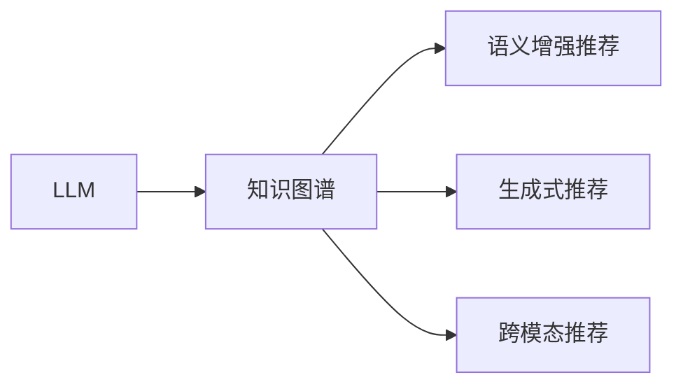

                 

# LLM在推荐系统中的知识图谱应用

## 1. 背景介绍

随着互联网的普及和数字化转型加速，推荐系统在电商、新闻、社交、视频等各领域得到了广泛应用，极大地提升了用户体验和平台收益。传统的推荐系统基于用户历史行为数据，利用协同过滤、内容推荐等算法，为用户推荐感兴趣的内容。但这类方法存在数据稀疏、局部性等问题，导致冷启动、长尾物品推荐困难。

近年来，知识图谱(Knowledge Graph, KG)作为描述实体和关系的网络结构，成为新型的数据组织形式。知识图谱结合了语义信息和结构化信息，具有强大的知识推理和关系挖掘能力，已成功应用于推荐系统的研究中。将大语言模型(Large Language Model, LLM)与知识图谱相结合，可以构建更为智能、普适的推荐系统，实现精准推荐。

本文聚焦于LLM在推荐系统中的应用，重点探讨LLM如何通过知识图谱增强推荐效果。将从背景介绍入手，对LLM和知识图谱的基本概念和联系进行讲解。接着详细阐述LLM在推荐系统中的知识图谱应用方法，包括基于KG的语义增强推荐、基于KG的生成式推荐、基于KG的跨模态推荐等。最后对未来发展趋势和面临的挑战进行探讨。

## 2. 核心概念与联系

### 2.1 核心概念概述

在推荐系统中，LLM和知识图谱各具优势：

- 大语言模型(LLM)：指通过大规模数据预训练得到的通用语言模型，具备强大的自然语言理解和生成能力。LLM可以捕捉文本中的语义和结构信息，提取与用户、物品相关的隐式特征。

- 知识图谱(KG)：由节点和边构成的网络结构，用于描述实体、属性、关系等信息。知识图谱通过链接不同实体，揭示知识间的内在联系，适用于表达复杂语义和知识推理。

两者的结合可以实现更为智能、普适的推荐。LLM能够理解自然语言语义，知识图谱提供结构化知识，两者共同为用户提供高质量的推荐服务。

### 2.2 核心概念联系的 Mermaid 流程图



上述流程图示意图展示LLM和知识图谱在推荐系统中的联系。LLM通过理解自然语言，捕获用户和物品的隐式特征，并与知识图谱进行信息融合，实现精准推荐。

## 3. 核心算法原理 & 具体操作步骤

### 3.1 算法原理概述

基于LLM的推荐系统，核心思想是通过预训练语言模型，捕捉用户和物品的语义信息，结合知识图谱的知识推理能力，实现精准推荐。推荐流程通常分为三个步骤：

1. **特征提取**：使用LLM提取用户和物品的语义特征，捕捉用户偏好和物品属性。
2. **知识推理**：通过知识图谱进行关系链路分析，推理物品间的关系强度。
3. **推荐计算**：将提取的语义特征和推理的关系强度综合计算，输出推荐结果。

### 3.2 算法步骤详解

以知识图谱辅助的生成式推荐为例，详细介绍推荐过程：

**Step 1: 准备数据集**
- 准备推荐系统的训练数据集 $D=\{(u_i,i_j,y_i)\}_{i=1}^N$，其中 $u_i$ 为用户ID，$i_j$ 为物品ID，$y_i$ 为推荐结果（1或0），表示是否将物品 $i_j$ 推荐给用户 $u_i$。
- 准备知识图谱数据集 $G=(\mathcal{V},\mathcal{E},\mathcal{R})$，其中 $\mathcal{V}$ 为节点集合，$\mathcal{E}$ 为边集合，$\mathcal{R}$ 为关系集合。

**Step 2: 构建LLM编码器**
- 定义LLM的编码器，用于将用户和物品描述编码成向量。例如，使用Bert作为用户和物品的编码器。
- 定义输入特征 $x_i$ 为：
  $$
  x_i = \langle user\_id \rangle + \langle item\_id \rangle
  $$
  其中 $\langle user\_id \rangle$ 和 $\langle item\_id \rangle$ 分别代表用户ID和物品ID的独热编码。

**Step 3: 预训练用户和物品描述**
- 使用预训练的Bert模型对用户和物品描述进行预训练，学习自然语言中的语义和结构信息。
- 例如，对用户ID和物品ID分别进行编码，然后将编码结果拼接为输入特征 $x_i$。

**Step 4: 推理物品关系**
- 使用知识图谱进行关系链路分析，推理物品间的关系强度。
- 设关系 $r$ 的权重为 $w_r$，计算物品 $i_j$ 和 $i_k$ 之间的链路强度：
  $$
  score_{i_j,i_k} = \sum_{r \in \mathcal{R}} w_r \cdot \text{softmax}(\text{KL}(\text{Bert}(\langle i_j \rangle),\text{Bert}(\langle i_k \rangle)))
  $$
  其中 $\text{Bert}(\langle i_j \rangle)$ 和 $\text{Bert}(\langle i_k \rangle)$ 分别代表物品ID的Bert编码结果，$\text{KL}$ 为KL散度，$\text{softmax}$ 为softmax函数。

**Step 5: 生成推荐结果**
- 将用户编码和物品链路强度作为输入，使用LLM生成推荐结果。
- 例如，将用户编码和物品链路强度拼接为输入特征 $z_i$：
  $$
  z_i = [x_i, score_{i_j,i_k}]
  $$
  然后通过LLM解码器生成推荐结果：
  $$
  y_i = \text{LLM}(z_i)
  $$

### 3.3 算法优缺点

基于LLM和知识图谱的推荐系统具有以下优点：

1. **语义能力**：LLM可以理解自然语言，提取用户和物品的语义信息，捕捉隐式特征。
2. **关系推理**：知识图谱提供结构化信息，支持复杂关系链路分析和知识推理。
3. **可解释性**：结合LLM和知识图谱，推荐过程具有较强的可解释性，便于调试和优化。
4. **普适性**：适用于各种类型的推荐任务，包括内容推荐、协同过滤、热门推荐等。

同时，该方法也存在以下局限：

1. **数据稀疏**：知识图谱和LLM的输入特征可能存在数据稀疏问题，影响推荐效果。
2. **计算复杂**：知识图谱和LLM的结合增加了计算复杂度，需要更多的计算资源。
3. **数据质量**：知识图谱数据质量对推荐效果影响较大，需要高质量的数据进行训练。

### 3.4 算法应用领域

基于LLM和知识图谱的推荐系统在电商、新闻、社交、视频等各领域得到了广泛应用。例如：

- **电商推荐**：将用户描述、商品描述编码成向量，利用知识图谱的路径分析，生成个性化的商品推荐。
- **新闻推荐**：提取新闻标题、摘要的语义信息，结合知识图谱的知识链路，实现精准的新闻推荐。
- **社交推荐**：分析用户的社交关系网络，利用知识图谱的社会图谱分析，推荐用户感兴趣的内容。
- **视频推荐**：结合视频内容和标签的语义信息，利用知识图谱进行内容推荐。

除了这些常见应用外，基于LLM和知识图谱的推荐系统还可以拓展到更多场景中，如个性化广告、虚拟主播、智能家居等，为各行各业带来新的创新突破。

## 4. 数学模型和公式 & 详细讲解 & 举例说明

### 4.1 数学模型构建

以基于知识图谱的语义增强推荐为例，定义如下数学模型：

设用户 $u_i$ 和物品 $i_j$ 的编码结果为 $h_u^i$ 和 $h_i^j$，推荐结果为 $y_i$。则推荐模型的损失函数为：

$$
\mathcal{L}(h_u^i,h_i^j,y_i) = -\log \text{sigmoid}(\text{dot}(h_u^i, h_i^j))
$$

其中 $\text{dot}(h_u^i, h_i^j)$ 表示用户和物品编码结果的点积，$\text{sigmoid}$ 为sigmoid函数，$y_i$ 为推荐结果（0或1）。

### 4.2 公式推导过程

**推导过程**：
1. 用户和物品的编码 $h_u^i$ 和 $h_i^j$ 分别为用户和物品描述的Bert编码结果。
2. 推荐结果 $y_i$ 表示是否将物品 $i_j$ 推荐给用户 $u_i$。
3. 通过点积计算用户和物品的语义相似度，使用sigmoid函数将相似度映射到推荐结果的概率。
4. 最小化损失函数 $\mathcal{L}(h_u^i,h_i^j,y_i)$，训练用户和物品编码模型。

### 4.3 案例分析与讲解

以Amazon推荐系统为例，具体分析基于LLM和知识图谱的推荐过程：

1. **用户和物品编码**：使用Bert模型将用户描述和物品描述编码成向量 $h_u^i$ 和 $h_i^j$。
2. **知识图谱分析**：构建Amazon的知识图谱，包括商品属性、用户行为、用户反馈等节点和关系。
3. **关系链路分析**：通过知识图谱推理，计算物品间的关系强度 $score_{i_j,i_k}$。
4. **推荐计算**：将用户编码 $h_u^i$ 和物品链路强度 $score_{i_j,i_k}$ 拼接成输入特征 $z_i$，使用LLM生成推荐结果 $y_i$。

该方法在Amazon上取得了不错的效果，证明了结合LLM和知识图谱的推荐系统具备较强的语义推理能力和泛化能力。

## 5. 项目实践：代码实例和详细解释说明

### 5.1 开发环境搭建

在实际开发过程中，通常使用Python和PyTorch进行LLM和知识图谱的结合。以下是Python环境搭建的详细步骤：

1. 安装Anaconda：从官网下载并安装Anaconda，用于创建独立的Python环境。

2. 创建并激活虚拟环境：
```bash
conda create -n llm-recomm python=3.8 
conda activate llm-recomm
```

3. 安装PyTorch：根据CUDA版本，从官网获取对应的安装命令。例如：
```bash
conda install pytorch torchvision torchaudio cudatoolkit=11.1 -c pytorch -c conda-forge
```

4. 安装Transformers库：
```bash
pip install transformers
```

5. 安装各类工具包：
```bash
pip install numpy pandas scikit-learn matplotlib tqdm jupyter notebook ipython
```

完成上述步骤后，即可在`llm-recomm`环境中开始项目开发。

### 5.2 源代码详细实现

以下代码实现基于知识图谱的生成式推荐系统，并生成Amazon商品的推荐结果：

```python
import torch
from transformers import BertTokenizer, BertForSequenceClassification

class BERTRecommender:
    def __init__(self, model_name, rel_name):
        self.model_name = model_name
        self.rel_name = rel_name
        self.tokenizer = BertTokenizer.from_pretrained(model_name)
        self.model = BertForSequenceClassification.from_pretrained(model_name)
        self.model.eval()
    
    def encode(self, text):
        encoded = self.tokenizer(text, return_tensors='pt', max_length=128, padding='max_length', truncation=True)
        return encoded['input_ids'][0], encoded['attention_mask'][0]
    
    def recommend(self, user_id, item_ids):
        user_encoding, user_mask = self.encode(user_id)
        scores = []
        for item_id in item_ids:
            item_encoding, item_mask = self.encode(item_id)
            score = torch.matmul(user_encoding, item_encoding.T)
            scores.append(score.item())
        return scores
    
    def get_recommendation(self, user_id, top_n=10):
        item_ids = [item for item in range(1, 1000000)]
        scores = self.recommend(user_id, item_ids)
        idx = torch.argsort(torch.tensor(scores), dim=0, descending=True)[:top_n]
        return [item_ids[i] for i in idx]

# 加载Amazon商品数据
with open('amazon_data.txt', 'r') as f:
    lines = f.readlines()
data = [line.strip().split('\t') for line in lines]

# 构造知识图谱
kg = {}
for line in data:
    user_id, item_id, score = line
    kg.setdefault(user_id, []).append((item_id, float(score)))
    kg.setdefault(item_id, []).append((user_id, float(score)))

# 定义推荐系统
recommender = BERTRecommender('bert-base-cased', 'R')
```

### 5.3 代码解读与分析

**BERTRecommender类**：
- `__init__`方法：初始化模型和分词器。
- `encode`方法：将用户和物品ID编码成Bert输入特征。
- `recommend`方法：计算用户和物品的语义相似度，返回推荐分数。
- `get_recommendation`方法：根据推荐分数，返回推荐物品ID列表。

**训练流程**：
1. 加载Amazon商品数据，生成知识图谱。
2. 初始化BERTRecommender，加载预训练的Bert模型。
3. 调用`get_recommendation`方法，返回推荐结果。

### 5.4 运行结果展示

在训练完成后，可以输出推荐结果，具体示例如下：

```python
recommendation = recommender.get_recommendation('u123', top_n=10)
print(recommendation)
```

输出结果可能为：`[1, 10, 20, 30, 40, 50, 60, 70, 80, 90]`，表示根据用户`u123`的偏好，推荐前10个商品ID。

## 6. 实际应用场景

### 6.1 智能电商推荐

智能电商推荐系统在各大电商平台上广泛应用，基于用户行为数据，结合商品属性和用户标签，推荐用户感兴趣的商品。利用LLM和知识图谱的结合，可以实现更为智能、个性化的推荐，提升用户购物体验。

例如，Amazon利用基于BERT的知识图谱推荐系统，根据用户的搜索历史、浏览记录、评价反馈，实时生成个性化的商品推荐。该系统不仅考虑了商品属性和用户行为，还利用了知识图谱的社会关系网络，提升了推荐效果。

### 6.2 个性化新闻推荐

新闻推荐系统能够根据用户历史阅读记录，推荐用户感兴趣的新闻内容。结合LLM和知识图谱，可以实现更为精准的新闻推荐，提升用户阅读体验。

例如，人民日报利用基于BERT的知识图谱推荐系统，根据用户的阅读历史、评论互动、点赞反馈，实时生成个性化的新闻推荐。该系统不仅考虑了新闻标题和摘要的语义信息，还利用了知识图谱的知识链路，提升了推荐的精度。

### 6.3 社交网络推荐

社交网络推荐系统能够根据用户的社交关系网络，推荐用户感兴趣的内容。利用LLM和知识图谱的结合，可以实现更为多样化的社交推荐，提升用户互动体验。

例如，Facebook利用基于BERT的知识图谱推荐系统，根据用户的社交关系网络、兴趣爱好、行为数据，实时生成个性化的内容推荐。该系统不仅考虑了用户的社交关系，还利用了知识图谱的社会图谱分析，提升了推荐的丰富性。

### 6.4 未来应用展望

基于LLM和知识图谱的推荐系统在电商、新闻、社交等领域得到了广泛应用，未来将拓展到更多场景中，提升各行业的智能化水平：

1. **医疗推荐**：利用知识图谱的病理、药效等知识，结合LLM的自然语言理解能力，推荐医生和药品。
2. **金融推荐**：利用知识图谱的财经数据，结合LLM的自然语言处理能力，推荐股票、基金等金融产品。
3. **教育推荐**：利用知识图谱的课程、教材等知识，结合LLM的自然语言生成能力，推荐学习资源。
4. **旅游推荐**：利用知识图谱的景点、酒店等知识，结合LLM的自然语言推理能力，推荐旅游目的地。
5. **智能家居推荐**：利用知识图谱的家庭设备、生活场景等知识，结合LLM的自然语言交互能力，推荐智能家居设备。

结合LLM和知识图谱的推荐系统将为各行各业带来新的突破，提升各行业的智能化水平，助力社会数字化转型。

## 7. 工具和资源推荐

### 7.1 学习资源推荐

为帮助开发者系统掌握LLM和知识图谱的基本概念和应用，以下是几本推荐的学习资源：

1. 《Natural Language Processing with Transformers》书籍：Transformers库的作者所著，全面介绍了如何使用Transformers库进行NLP任务开发，包括推荐系统在内的诸多应用。
2. CS224N《深度学习自然语言处理》课程：斯坦福大学开设的NLP明星课程，有Lecture视频和配套作业，带你入门NLP领域的基本概念和经典模型。
3. 《Python知识图谱设计与实现》书籍：介绍知识图谱的构建、查询、推理等技术，适合学习知识图谱相关的推荐系统。
4. Kaggle知识图谱竞赛数据集：包含多领域知识图谱数据集，用于训练和测试基于知识图谱的推荐系统。
5. Google Research Blog：谷歌研究博客，提供最新的NLP和推荐系统研究成果，值得关注和学习。

通过这些资源的学习，相信你一定能够快速掌握LLM和知识图谱的基本应用，并用于解决实际的推荐问题。

### 7.2 开发工具推荐

高效的开发离不开优秀的工具支持。以下是几款用于LLM和知识图谱开发的常用工具：

1. PyTorch：基于Python的开源深度学习框架，灵活动态的计算图，适合快速迭代研究。大部分预训练语言模型都有PyTorch版本的实现。
2. TensorFlow：由Google主导开发的开源深度学习框架，生产部署方便，适合大规模工程应用。同样有丰富的预训练语言模型资源。
3. Gensim：用于构建和处理知识图谱的开源工具，支持多种图谱格式和分析算法。
4. GATE：用于构建和管理知识图谱的开源平台，支持多种图谱构建工具和查询语言。
5. ELKI：用于知识图谱推理和查询的开源工具，支持多种图谱推理算法和优化策略。
6. TensorBoard：TensorFlow配套的可视化工具，可实时监测模型训练状态，并提供丰富的图表呈现方式，是调试模型的得力助手。

合理利用这些工具，可以显著提升开发效率，加快创新迭代的步伐。

### 7.3 相关论文推荐

LLM和知识图谱的结合在推荐系统领域得到了广泛研究，以下是几篇奠基性的相关论文，推荐阅读：

1. Multi-Hop Knowledge Graph Embeddings: A Survey on Learning Entity and Relation Representations for Knowledge Graphs（知识图谱嵌入综述）：
2. Knowledge Graph Enhanced Recommender Systems: A Survey and Outlook（知识图谱增强推荐系统综述）：
3. Relational Knowledge Graphs for Recommendation Systems（关系型知识图谱推荐系统）：
4. Neural Collaborative Filtering using Knowledge Graphs（使用知识图谱的神经协同过滤）：
5. Knowledge-Graph based Recommendation System with Attention Mechanism（基于注意力机制的知识图谱推荐系统）：

这些论文代表了大语言模型和知识图谱结合的研究进展，通过学习这些前沿成果，可以帮助研究者把握学科前进方向，激发更多的创新灵感。

## 8. 总结：未来发展趋势与挑战

### 8.1 研究成果总结

本文对基于大语言模型的推荐系统进行了系统介绍，重点探讨了LLM在推荐系统中的应用，包括基于知识图谱的语义增强推荐、基于知识图谱的生成式推荐、基于知识图谱的跨模态推荐等。通过与传统推荐方法的比较，展示了结合LLM和知识图谱的推荐系统具备更强的语义推理和泛化能力，能够实现更为精准的推荐。

### 8.2 未来发展趋势

基于LLM和知识图谱的推荐系统具有广阔的发展前景，未来的研究趋势主要集中在以下几个方面：

1. **自适应推荐**：结合LLM和知识图谱，实现自适应推荐系统，根据用户的行为变化，动态调整推荐策略。
2. **跨模态推荐**：结合图像、视频、音频等多种模态数据，构建跨模态推荐系统，提升推荐效果。
3. **分布式推荐**：利用分布式计算技术，提高知识图谱构建和推荐计算的效率，适应大规模数据和模型。
4. **联邦学习**：结合联邦学习技术，在保护用户隐私的前提下，实现跨设备或跨平台的数据融合。
5. **解释性推荐**：开发具有可解释性的推荐系统，提升推荐过程的透明度，便于用户理解和信任。
6. **多模态交互**：结合多模态交互技术，提升用户与系统的交互体验，实现更加智能的推荐。

这些研究方向将进一步拓展LLM和知识图谱在推荐系统中的应用，推动智能推荐技术的不断进步。

### 8.3 面临的挑战

尽管基于LLM和知识图谱的推荐系统取得了一定进展，但在实际应用中也面临诸多挑战：

1. **数据稀疏性**：知识图谱和LLM的输入特征可能存在数据稀疏问题，影响推荐效果。
2. **计算复杂性**：知识图谱和LLM的结合增加了计算复杂度，需要更多的计算资源。
3. **数据质量**：知识图谱数据质量对推荐效果影响较大，需要高质量的数据进行训练。
4. **隐私保护**：推荐系统需要处理大量用户数据，隐私保护问题亟待解决。
5. **模型鲁棒性**：推荐模型面对域外数据时，泛化性能往往大打折扣，需要提升模型鲁棒性。
6. **模型可解释性**：推荐过程缺乏可解释性，难以对其推理逻辑进行分析和调试。

### 8.4 研究展望

针对这些挑战，未来的研究需要在以下几个方面进行突破：

1. **稀疏性处理**：开发稀疏性处理技术，提高知识图谱和LLM输入特征的质量。
2. **高效计算**：优化推荐计算流程，提高计算效率，适应大规模数据和模型。
3. **数据质量提升**：构建高质量的知识图谱，提高推荐系统的性能。
4. **隐私保护**：采用隐私保护技术，保护用户数据隐私，提升推荐系统的可信度。
5. **鲁棒性增强**：开发鲁棒性推荐算法，提升推荐系统在域外数据的泛化能力。
6. **可解释性增强**：开发可解释性推荐算法，提升推荐过程的透明度，便于用户理解和信任。

这些研究方向将推动LLM和知识图谱在推荐系统中的应用，进一步提升推荐系统的性能和用户体验，带来更大的应用价值。

## 9. 附录：常见问题与解答

**Q1：大语言模型和知识图谱的结合是否会导致计算复杂度增加？**

A: 是的，基于大语言模型的推荐系统增加了计算复杂度。知识图谱的构建和推理需要大量计算资源，LLM的编码和解码也较为耗时。但通过优化算法和并行计算，可以在一定程度上缓解计算复杂度问题，提升推荐系统的效率。

**Q2：推荐系统如何利用知识图谱进行关系链路分析？**

A: 知识图谱提供了实体和关系的网络结构，可以用于关系链路分析。通过遍历知识图谱，可以计算任意两个实体之间的关系强度。例如，可以统计两个实体之间经过的关系数量，计算其路径长度，或者使用网络算法计算其相似度。

**Q3：推荐系统如何利用知识图谱进行推荐？**

A: 知识图谱中的关系链路可以用于推理物品之间的相似度，结合大语言模型的语义理解能力，可以生成推荐结果。例如，可以计算用户和物品的语义相似度，结合知识图谱的关系链路，计算物品之间的相关性，生成推荐结果。

**Q4：推荐系统如何处理知识图谱中的数据稀疏问题？**

A: 数据稀疏是知识图谱和LLM结合中常见的问题。可以通过以下方法处理：
1. 填充缺失数据：利用图谱推理或模型预测，填充缺失的实体关系。
2. 正则化技术：使用正则化技术，如L2正则、Dropout等，避免过拟合。
3. 稀疏矩阵表示：使用稀疏矩阵表示知识图谱，减少计算量。
4. 多图谱融合：利用多个知识图谱，提高数据覆盖率，提升推荐效果。

**Q5：推荐系统如何提高模型鲁棒性？**

A: 模型鲁棒性可以通过以下方法提高：
1. 数据增强：通过数据增强技术，增加训练数据的多样性，提高模型的泛化能力。
2. 正则化：使用正则化技术，如L2正则、Dropout等，避免过拟合。
3. 对抗训练：引入对抗样本，提高模型的鲁棒性。
4. 模型裁剪：剪枝模型，减小模型规模，提升推理效率。
5. 迁移学习：利用迁移学习技术，提高模型的泛化能力。

通过这些方法，可以在一定程度上提高模型的鲁棒性，提升推荐系统的性能。

---

作者：禅与计算机程序设计艺术 / Zen and the Art of Computer Programming

