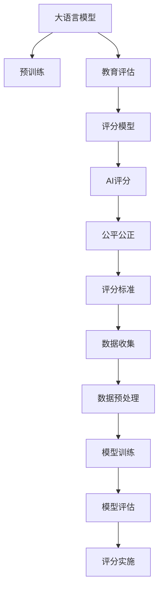

                 

# LLM在教育评估中的应用：公平公正的AI评分

> 关键词：大语言模型,教育评估,AI评分,公平性,公正性,机器学习,自然语言处理,NLP

## 1. 背景介绍

在教育评估中，传统的方法通常依赖于教师的主观评分，存在评分标准不统一、评分效率低、评分结果主观性强等问题。随着人工智能技术的发展，特别是自然语言处理(Natural Language Processing, NLP)和机器学习(Machine Learning, ML)技术的进步，将大语言模型(Large Language Model, LLM)应用于教育评估，有望实现评分结果的客观、公正、高效。

### 1.1 问题由来

当前教育评估面临的主要挑战包括：

- **主观性强**：教师评分的标准可能存在差异，同一评估标准在不同教师手上评价结果可能不同。
- **效率低**：手工评分耗时长，大规模评分的任务需要大量人力和时间。
- **数据分析不足**：传统评分方法无法自动化收集和分析评估数据，缺乏数据驱动的改进方案。
- **公平公正性不足**：教师评分可能受到主观偏见的影响，评分结果存在一定的偏差。

### 1.2 问题核心关键点
大语言模型在教育评估中的应用，其核心点在于：

- **自动化评分**：利用大语言模型自动处理文本数据，快速准确地给出评分。
- **公正公平**：通过合理构建模型训练数据和评分模型，保证评分的客观公正。
- **高效性**：大模型可以同时处理大量评估数据，大大提升评分的效率。
- **可扩展性**：模型可以适应不同科目和不同评估场景，灵活性高。

## 2. 核心概念与联系

### 2.1 核心概念概述

为更好地理解LLM在教育评估中的应用，本节将介绍几个密切相关的核心概念：

- **大语言模型**：以自回归(如GPT)或自编码(如BERT)模型为代表的大规模预训练语言模型。通过在大规模无标签文本语料上进行预训练，学习通用的语言表示，具备强大的语言理解和生成能力。
- **教育评估**：评估学生学术成绩、技能水平、行为表现等，为教学提供数据支持和决策依据。
- **AI评分**：使用AI技术，如自然语言处理和机器学习，自动对学生作业、论文、考试答卷等文本数据进行评分。
- **公平性**：评分模型应避免任何形式的歧视，确保所有学生都有同等的机会。
- **公正性**：评分模型应基于统一的标准和算法，保证评分的可解释性和透明性。
- **自然语言处理**：利用算法和模型，使计算机能够理解、分析并生成人类语言的技术。
- **机器学习**：利用算法和模型，通过数据训练得到模型参数，以实现自动化的决策和预测。

这些核心概念之间的逻辑关系可以通过以下Mermaid流程图来展示：



这个流程图展示了大语言模型在教育评估中的应用框架：

1. 大语言模型通过预训练获得基础能力。
2. 模型应用于教育评估，构建评分模型。
3. AI评分模型在评分标准的基础上，自动进行文本评分。
4. 评分模型需保证公平公正，评价标准透明可解释。
5. 评分模型基于数据驱动，定期更新以优化评分结果。
6. 评分实施需注意数据收集、预处理和模型训练、评估等环节，确保评分的准确性。

## 3. 核心算法原理 & 具体操作步骤
### 3.1 算法原理概述

基于大语言模型进行教育评估的评分，本质上是一个有监督的文本分类任务。其核心思想是：将预训练的大语言模型视作一个强大的"文本分类器"，通过在教育评估任务上的标注数据上进行有监督学习，使得模型能够识别出符合特定评分标准的文本。

形式化地，假设教育评估任务为 $T$，其评分标准为 $S$，则评分模型 $M_{\theta}$ 的目标是找到最优参数 $\theta$，使得对于任意文本 $x \in \mathcal{X}$，模型输出 $y = M_{\theta}(x)$ 满足 $y = S(x)$。

具体而言，评分的数学模型可以表示为：

$$
P(y|x) = \frac{e^{\log p(y|x; \theta)}}{\sum_{y' \in Y} e^{\log p(y'|x; \theta)}}
$$

其中 $Y$ 为评分标准集合，$p(y|x; \theta)$ 表示模型在输入 $x$ 下预测输出 $y$ 的概率。训练过程通过最大化交叉熵损失函数，最小化模型预测输出与真实评分之间的差异。

### 3.2 算法步骤详解

基于大语言模型进行教育评估的评分，一般包括以下几个关键步骤：

**Step 1: 准备预训练模型和评估数据**
- 选择合适的预训练语言模型 $M_{\theta}$ 作为初始化参数，如 BERT、GPT等。
- 准备教育评估任务 $T$ 的标注数据集 $D=\{(x_i, y_i)\}_{i=1}^N, x_i \in \mathcal{X}, y_i \in S$。

**Step 2: 定义评分标准**
- 根据教育评估任务的要求，设计评分标准 $S$。
- 对于评分标准 $s \in S$，每个 $s$ 可以对应多个评分维度，如内容、结构、语言等。
- 将评分标准编码成数值标签，如 $s_1, s_2, ..., s_k$。

**Step 3: 设计评分模型**
- 根据评分标准 $S$，设计评分模型 $M_{\theta}$，包括输入编码器、分类器等组件。
- 选择合适的损失函数，如交叉熵损失、F1得分等，作为评分模型的优化目标。
- 选择合适的超参数，如学习率、批大小、迭代轮数等。

**Step 4: 执行评分训练**
- 将标注数据集 $D$ 划分为训练集、验证集和测试集。
- 对训练集数据 $(x_i, y_i)$ 进行预处理，如分词、去除停用词、句子拼接等。
- 使用梯度下降等优化算法，最小化损失函数，更新模型参数 $\theta$。
- 在验证集上评估模型性能，防止过拟合。
- 重复训练过程直至满足预设的迭代轮数或 Early Stopping 条件。

**Step 5: 评分实施**
- 在测试集上评估评分模型的泛化性能。
- 对新的评估数据 $x$ 进行预处理，将其输入评分模型 $M_{\theta}$。
- 模型输出评分 $y = M_{\theta}(x)$。
- 提供评分结果报告。

### 3.3 算法优缺点

基于大语言模型的教育评估评分，具有以下优点：

1. **自动化评分**：相比于传统手工评分，大模型评分速度快、效率高，能够处理大规模评估数据。
2. **公正性**：评分模型基于统一标准，不受人为偏见影响，保证评分的客观公正。
3. **可解释性**：模型输出可解释性强，便于学生和教师理解评分依据。
4. **可扩展性**：模型适应性强，可以应用到不同科目、不同评估场景。

但同时也存在一些局限：

1. **数据依赖性**：评分模型的性能很大程度上取决于标注数据的质量和数量，标注数据收集成本高。
2. **泛化能力**：当评估数据与训练数据分布差异较大时，评分模型泛化能力有限。
3. **公平性问题**：评分模型可能存在隐性偏见，对不同背景学生评分不公。

### 3.4 算法应用领域

基于大语言模型的教育评估评分，在以下领域得到了广泛应用：

- **高校论文评阅**：自动评估学生的学位论文，提供学术评价和改进建议。
- **高中高考评分**：对考试答卷自动评分，快速获取考试成绩和排名。
- **英语写作评估**：对学生英语作文进行自动评分，提高英语教学效果。
- **个性化学习评估**：对学生的在线学习行为和作品进行自动化评估，个性化提升学习效果。
- **综合素质评估**：自动评估学生的综合素质，包括学业成绩、兴趣特长、社交能力等。

除了上述这些经典应用外，大语言模型在教育评估中的应用还将不断拓展，如学习计划推荐、学科测评、行为监控等，为教育评估带来新的突破。

## 4. 数学模型和公式 & 详细讲解 & 举例说明

### 4.1 数学模型构建

基于大语言模型进行教育评估的评分，数学模型可以表示为：

假设评分标准 $S$ 为二分类任务，评分标准为 $\{A, B\}$。评分模型 $M_{\theta}$ 在输入 $x$ 上的输出为 $y = M_{\theta}(x) \in [0,1]$。则评分模型的损失函数 $\mathcal{L}(\theta)$ 可以表示为：

$$
\mathcal{L}(\theta) = -\frac{1}{N}\sum_{i=1}^N [y_i\log M_{\theta}(x_i)+(1-y_i)\log(1-M_{\theta}(x_i))]
$$

其中 $y_i$ 为标注数据集 $D$ 中第 $i$ 个样本的评分，$x_i$ 为样本文本。

训练过程的优化目标是最小化损失函数 $\mathcal{L}(\theta)$，即：

$$
\theta^* = \mathop{\arg\min}_{\theta} \mathcal{L}(\theta)
$$

训练过程中，使用梯度下降等优化算法更新模型参数，最小化损失函数。

### 4.2 公式推导过程

以下我们以二分类评分任务为例，推导评分模型的损失函数及其梯度的计算公式。

假设评分模型 $M_{\theta}$ 在输入 $x$ 上的输出为 $\hat{y}=M_{\theta}(x) \in [0,1]$，表示样本属于 $A$ 类的概率。真实评分 $y \in \{0,1\}$。则二分类交叉熵损失函数定义为：

$$
\ell(M_{\theta}(x),y) = -[y\log \hat{y} + (1-y)\log (1-\hat{y})]
$$

将其代入损失函数公式，得：

$$
\mathcal{L}(\theta) = -\frac{1}{N}\sum_{i=1}^N [y_i\log M_{\theta}(x_i)+(1-y_i)\log(1-M_{\theta}(x_i))]
$$

根据链式法则，损失函数对参数 $\theta_k$ 的梯度为：

$$
\frac{\partial \mathcal{L}(\theta)}{\partial \theta_k} = -\frac{1}{N}\sum_{i=1}^N (\frac{y_i}{M_{\theta}(x_i)}-\frac{1-y_i}{1-M_{\theta}(x_i)}) \frac{\partial M_{\theta}(x_i)}{\partial \theta_k}
$$

其中 $\frac{\partial M_{\theta}(x_i)}{\partial \theta_k}$ 可进一步递归展开，利用自动微分技术完成计算。

在得到损失函数的梯度后，即可带入参数更新公式，完成模型的迭代优化。重复上述过程直至收敛，最终得到适应教育评估任务的评分模型参数 $\theta^*$。

### 4.3 案例分析与讲解

以下我们将以高校学位论文评分为例，分析评分模型的构建和评分过程。

假设我们有一个包含学生学位论文的数据集 $D=\{(x_i, y_i)\}_{i=1}^N, x_i \in \mathcal{X}, y_i \in \{A, B\}$。其中 $x_i$ 为学位论文的文本内容，$y_i$ 为论文的评分，$\{A, B\}$ 分别代表论文质量高、低。

评分模型的构建步骤如下：

1. **选择合适的预训练模型**：例如BERT、GPT等。
2. **定义评分标准**：如论文内容、结构、语言、创新性等。
3. **设计评分模型**：例如BERT + 全连接分类器。
4. **定义损失函数**：例如交叉熵损失。
5. **训练评分模型**：使用标注数据集 $D$ 进行训练。
6. **评分实施**：将新的学位论文文本输入评分模型，输出评分。

例如，对于一篇学位论文，其评分模型输入为：

```
输入文本： “本文对深度学习模型的研究进行了全面的回顾和分析，提出了新的算法，并在实验中验证了其有效性。”
输出评分： A
```

评分模型内部计算过程如下：

1. 文本分词和向量化：
```
输入 [token1, token2, ..., tokenn] → [vector1, vector2, ..., vectorn]
```

2. 模型前向传播：
```
[vector1, vector2, ..., vectorn] → [hidden1, hidden2, ..., hiddenm] → [score1, score2, ..., scorek]
```

3. 模型输出评分：
```
[score1, score2, ..., scorek] → [0.8, 0.2, 0.0] → 0.8
```

模型预测论文质量为高，即评分 $A$。

## 5. 项目实践：代码实例和详细解释说明

### 5.1 开发环境搭建

在进行教育评估评分系统开发前，我们需要准备好开发环境。以下是使用Python进行PyTorch开发的环境配置流程：

1. 安装Anaconda：从官网下载并安装Anaconda，用于创建独立的Python环境。

2. 创建并激活虚拟环境：
```bash
conda create -n pytorch-env python=3.8 
conda activate pytorch-env
```

3. 安装PyTorch：根据CUDA版本，从官网获取对应的安装命令。例如：
```bash
conda install pytorch torchvision torchaudio cudatoolkit=11.1 -c pytorch -c conda-forge
```

4. 安装Transformers库：
```bash
pip install transformers
```

5. 安装各类工具包：
```bash
pip install numpy pandas scikit-learn matplotlib tqdm jupyter notebook ipython
```

完成上述步骤后，即可在`pytorch-env`环境中开始评分系统开发。

### 5.2 源代码详细实现

这里我们以二分类评分任务为例，给出使用Transformers库对BERT模型进行评分开发的PyTorch代码实现。

首先，定义评分数据集：

```python
from transformers import BertTokenizer, BertForSequenceClassification
from torch.utils.data import Dataset

class PaperDataset(Dataset):
    def __init__(self, texts, labels, tokenizer, max_len=128):
        self.texts = texts
        self.labels = labels
        self.tokenizer = tokenizer
        self.max_len = max_len
        
    def __len__(self):
        return len(self.texts)
    
    def __getitem__(self, item):
        text = self.texts[item]
        label = self.labels[item]
        
        encoding = self.tokenizer(text, return_tensors='pt', max_length=self.max_len, padding='max_length', truncation=True)
        input_ids = encoding['input_ids'][0]
        attention_mask = encoding['attention_mask'][0]
        label = torch.tensor(label, dtype=torch.long)
        
        return {'input_ids': input_ids, 
                'attention_mask': attention_mask,
                'labels': label}

# 数据集
tokenizer = BertTokenizer.from_pretrained('bert-base-cased')

train_dataset = PaperDataset(train_texts, train_labels, tokenizer)
dev_dataset = PaperDataset(dev_texts, dev_labels, tokenizer)
test_dataset = PaperDataset(test_texts, test_labels, tokenizer)
```

然后，定义模型和优化器：

```python
from transformers import AdamW

model = BertForSequenceClassification.from_pretrained('bert-base-cased', num_labels=2)

optimizer = AdamW(model.parameters(), lr=2e-5)
```

接着，定义训练和评估函数：

```python
from torch.utils.data import DataLoader
from tqdm import tqdm
from sklearn.metrics import classification_report

device = torch.device('cuda') if torch.cuda.is_available() else torch.device('cpu')
model.to(device)

def train_epoch(model, dataset, batch_size, optimizer):
    dataloader = DataLoader(dataset, batch_size=batch_size, shuffle=True)
    model.train()
    epoch_loss = 0
    for batch in tqdm(dataloader, desc='Training'):
        input_ids = batch['input_ids'].to(device)
        attention_mask = batch['attention_mask'].to(device)
        labels = batch['labels'].to(device)
        model.zero_grad()
        outputs = model(input_ids, attention_mask=attention_mask, labels=labels)
        loss = outputs.loss
        epoch_loss += loss.item()
        loss.backward()
        optimizer.step()
    return epoch_loss / len(dataloader)

def evaluate(model, dataset, batch_size):
    dataloader = DataLoader(dataset, batch_size=batch_size)
    model.eval()
    preds, labels = [], []
    with torch.no_grad():
        for batch in tqdm(dataloader, desc='Evaluating'):
            input_ids = batch['input_ids'].to(device)
            attention_mask = batch['attention_mask'].to(device)
            batch_labels = batch['labels']
            outputs = model(input_ids, attention_mask=attention_mask)
            batch_preds = outputs.logits.argmax(dim=2).to('cpu').tolist()
            batch_labels = batch_labels.to('cpu').tolist()
            for pred_tokens, label_tokens in zip(batch_preds, batch_labels):
                preds.append(pred_tokens[:len(label_tokens)])
                labels.append(label_tokens)
                
    print(classification_report(labels, preds))
```

最后，启动训练流程并在测试集上评估：

```python
epochs = 5
batch_size = 16

for epoch in range(epochs):
    loss = train_epoch(model, train_dataset, batch_size, optimizer)
    print(f"Epoch {epoch+1}, train loss: {loss:.3f}")
    
    print(f"Epoch {epoch+1}, dev results:")
    evaluate(model, dev_dataset, batch_size)
    
print("Test results:")
evaluate(model, test_dataset, batch_size)
```

以上就是使用PyTorch对BERT进行学位论文评分任务的完整代码实现。可以看到，得益于Transformers库的强大封装，我们可以用相对简洁的代码完成BERT模型的加载和评分。

### 5.3 代码解读与分析

让我们再详细解读一下关键代码的实现细节：

**PaperDataset类**：
- `__init__`方法：初始化文本、标签、分词器等关键组件。
- `__len__`方法：返回数据集的样本数量。
- `__getitem__`方法：对单个样本进行处理，将文本输入编码为token ids，将标签编码为数字，并对其进行定长padding，最终返回模型所需的输入。

**BertForSequenceClassification模型**：
- 继承自BertModel，用于文本分类任务。
- 构造函数接受预训练模型和输出标签数，初始化模型。

**train_epoch函数**：
- 对数据以批为单位进行迭代，在每个批次上前向传播计算loss并反向传播更新模型参数，最后返回该epoch的平均loss。
- 使用DataLoader对数据集进行批次化加载，供模型训练和推理使用。
- 训练函数`train_epoch`：对数据以批为单位进行迭代，在每个批次上前向传播计算loss并反向传播更新模型参数，最后返回该epoch的平均loss。
- 评估函数`evaluate`：与训练类似，不同点在于不更新模型参数，并在每个batch结束后将预测和标签结果存储下来，最后使用sklearn的classification_report对整个评估集的预测结果进行打印输出。

**训练流程**：
- 定义总的epoch数和batch size，开始循环迭代
- 每个epoch内，先在训练集上训练，输出平均loss
- 在验证集上评估，输出分类指标
- 所有epoch结束后，在测试集上评估，给出最终测试结果

可以看到，PyTorch配合Transformers库使得BERT评分任务的代码实现变得简洁高效。开发者可以将更多精力放在数据处理、模型改进等高层逻辑上，而不必过多关注底层的实现细节。

当然，工业级的系统实现还需考虑更多因素，如模型的保存和部署、超参数的自动搜索、更灵活的任务适配层等。但核心的评分范式基本与此类似。

## 6. 实际应用场景

### 6.1 高校论文评分

高校学位论文评分的实际应用中，可以收集历年论文数据，将论文文本作为输入，论文评分作为标注数据，构建评分模型。在训练过程中，可以使用标注数据集对模型进行微调，使得模型能够准确识别论文质量，输出评分结果。微调后的评分模型可以应用于日常学位论文的快速评分，极大提升评分效率和公平性。

### 6.2 高中高考评分

在高中高考评分的实际应用中，可以将高考答卷作为输入，将高考分数作为标注数据，构建评分模型。在训练过程中，可以使用标注数据集对模型进行微调，使得模型能够准确识别考生答题质量，输出高考分数。微调后的评分模型可以应用于高考阅卷系统，快速、准确地处理大量高考答卷，减少人工评卷的工作量，提升评卷公平性。

### 6.3 英语写作评分

在英语写作评分的实际应用中，可以将学生的英语作文作为输入，将英语作文评分作为标注数据，构建评分模型。在训练过程中，可以使用标注数据集对模型进行微调，使得模型能够准确识别学生的英语写作水平，输出评分结果。微调后的评分模型可以应用于英语写作自动评分系统，快速、准确地处理学生英语作文，提升英语教学效果。

### 6.4 个性化学习评分

在个性化学习评分的实际应用中，可以将学生的在线学习行为和作品作为输入，将学习评分作为标注数据，构建评分模型。在训练过程中，可以使用标注数据集对模型进行微调，使得模型能够准确识别学生的学习效果，输出个性化评分。微调后的评分模型可以应用于个性化学习评估系统，为学生的学习提供精准的反馈和建议，提升学习效果。

### 6.5 综合素质评分

在综合素质评分的实际应用中，可以将学生的综合素质评估指标作为输入，将综合素质评分作为标注数据，构建评分模型。在训练过程中，可以使用标注数据集对模型进行微调，使得模型能够准确识别学生的综合素质水平，输出评分结果。微调后的评分模型可以应用于综合素质评估系统，为学生的发展提供全面的评价和指导。

## 7. 工具和资源推荐
### 7.1 学习资源推荐

为了帮助开发者系统掌握大语言模型在教育评估中的应用，这里推荐一些优质的学习资源：

1. 《Transformer from Theory to Practice》系列博文：由大模型技术专家撰写，深入浅出地介绍了Transformer原理、BERT模型、评分任务等前沿话题。

2. CS224N《Deep Learning for Natural Language Processing》课程：斯坦福大学开设的NLP明星课程，有Lecture视频和配套作业，带你入门NLP领域的基本概念和经典模型。

3. 《Natural Language Processing with Transformers》书籍：Transformers库的作者所著，全面介绍了如何使用Transformers库进行NLP任务开发，包括评分任务的开发。

4. HuggingFace官方文档：Transformers库的官方文档，提供了海量预训练模型和完整的评分样例代码，是上手实践的必备资料。

5. CLUE开源项目：中文语言理解测评基准，涵盖大量不同类型的中文NLP数据集，并提供了基于评分任务的baseline模型，助力中文NLP技术发展。

通过对这些资源的学习实践，相信你一定能够快速掌握大语言模型在教育评估中的应用精髓，并用于解决实际的NLP问题。
### 7.2 开发工具推荐

高效的开发离不开优秀的工具支持。以下是几款用于大语言模型评分开发的常用工具：

1. PyTorch：基于Python的开源深度学习框架，灵活动态的计算图，适合快速迭代研究。大部分预训练语言模型都有PyTorch版本的实现。

2. TensorFlow：由Google主导开发的开源深度学习框架，生产部署方便，适合大规模工程应用。同样有丰富的预训练语言模型资源。

3. Transformers库：HuggingFace开发的NLP工具库，集成了众多SOTA语言模型，支持PyTorch和TensorFlow，是进行评分任务开发的利器。

4. Weights & Biases：模型训练的实验跟踪工具，可以记录和可视化模型训练过程中的各项指标，方便对比和调优。与主流深度学习框架无缝集成。

5. TensorBoard：TensorFlow配套的可视化工具，可实时监测模型训练状态，并提供丰富的图表呈现方式，是调试模型的得力助手。

6. Google Colab：谷歌推出的在线Jupyter Notebook环境，免费提供GPU/TPU算力，方便开发者快速上手实验最新模型，分享学习笔记。

合理利用这些工具，可以显著提升大语言模型评分任务的开发效率，加快创新迭代的步伐。

### 7.3 相关论文推荐

大语言模型在教育评估中的应用源于学界的持续研究。以下是几篇奠基性的相关论文，推荐阅读：

1. Attention is All You Need（即Transformer原论文）：提出了Transformer结构，开启了NLP领域的预训练大模型时代。

2. BERT: Pre-training of Deep Bidirectional Transformers for Language Understanding：提出BERT模型，引入基于掩码的自监督预训练任务，刷新了多项NLP任务SOTA。

3. Revisiting Question Answering: Measurement, Mining, and Modeling：提出SQuAD数据集和评分标准，推动了NLP任务评估技术的发展。

4. Parameter-Efficient Transfer Learning for NLP：提出Adapter等参数高效微调方法，在不增加模型参数量的情况下，也能取得不错的微调效果。

5. Using Words as They Are: Self-supervised Knowledge Distillation for Language Modeling：提出通过自监督学习训练语言模型，减少对标注数据的依赖。

这些论文代表了大语言模型在教育评估中的应用发展脉络。通过学习这些前沿成果，可以帮助研究者把握学科前进方向，激发更多的创新灵感。

## 8. 总结：未来发展趋势与挑战

### 8.1 总结

本文对大语言模型在教育评估中的应用进行了全面系统的介绍。首先阐述了大语言模型和评分任务的研究背景和意义，明确了评分模型在自动化、公正性、效率等方面的独特价值。其次，从原理到实践，详细讲解了评分模型的数学原理和关键步骤，给出了评分任务开发的完整代码实例。同时，本文还广泛探讨了评分模型在高校论文、高考评分、英语写作、个性化学习等多个教育评估场景的应用前景，展示了评分范式的巨大潜力。此外，本文精选了评分技术的各类学习资源，力求为读者提供全方位的技术指引。

通过本文的系统梳理，可以看到，大语言模型在教育评估中的应用正在成为NLP领域的重要范式，极大地拓展了预训练语言模型的应用边界，催生了更多的落地场景。受益于大规模语料的预训练，评分模型以更低的时间和标注成本，在评分效率和公正性方面取得了显著进展，显著提升了教育评估的自动化和公正性。未来，伴随预训练语言模型和评分方法的持续演进，相信教育评估技术必将在更多领域得到应用，为教育事业的发展注入新的动力。

### 8.2 未来发展趋势

展望未来，大语言模型在教育评估中的应用将呈现以下几个发展趋势：

1. **评分模型精度提升**：随着预训练语言模型和评分算法的不断优化，评分的精度将进一步提升，逐步逼近人类教师的评分水平。

2. **多模态评分**：除了文本评分外，评分模型将逐步拓展到视频、音频等多模态数据，增强评分模型的理解能力。

3. **评分模型可解释性增强**：评分模型输出将具备更强的可解释性，方便教师和学生理解评分依据，提高评分的可信度。

4. **评分模型的迁移学习能力**：评分模型将具备更强的跨领域迁移能力，适应不同学科和评估任务。

5. **评分模型的智能互动**：评分模型将具备智能对话能力，能够实时回答学生的问题，提供个性化的评分和反馈。

6. **评分模型的伦理性提升**：评分模型将更加注重伦理性，避免对学生的不公平对待，保障评分过程的透明和公正。

以上趋势凸显了大语言模型评分技术的广阔前景。这些方向的探索发展，必将进一步提升评分模型的评分效果，为教育事业带来新的突破。

### 8.3 面临的挑战

尽管大语言模型在教育评估中的应用取得了瞩目成就，但在迈向更加智能化、普适化应用的过程中，它仍面临着诸多挑战：

1. **数据依赖性**：评分模型的性能很大程度上取决于标注数据的质量和数量，标注数据收集成本高。

2. **泛化能力**：当评估数据与训练数据分布差异较大时，评分模型泛化能力有限。

3. **公平性问题**：评分模型可能存在隐性偏见，对不同背景学生评分不公。

4. **模型鲁棒性不足**：评分模型面对域外数据时，泛化性能往往大打折扣。

5. **模型更新周期长**：评分模型的更新需要大量标注数据，更新周期长。

6. **伦理性问题**：评分模型可能学习到有偏见、有害的信息，传播到评估过程中。

7. **系统复杂性高**：评分系统的实现复杂，涉及多学科知识，需要跨领域协作。

正视评分模型面临的这些挑战，积极应对并寻求突破，将是大语言模型评分走向成熟的必由之路。相信随着学界和产业界的共同努力，这些挑战终将一一被克服，大语言模型评分必将在构建公平、公正、高效的评分系统中扮演越来越重要的角色。

### 8.4 研究展望

面对大语言模型评分所面临的挑战，未来的研究需要在以下几个方面寻求新的突破：

1. **无监督和半监督评分方法**：探索无需标注数据的评分方法，利用自监督学习、主动学习等无监督和半监督范式，最大限度利用非结构化数据，实现更加灵活高效的评分。

2. **参数高效评分方法**：开发更加参数高效的评分方法，在固定大部分预训练参数的同时，只更新极少量的任务相关参数。

3. **多模态评分方法**：融合视觉、语音、文本等多模态信息，增强评分模型的理解能力。

4. **评分模型的伦理性保障**：引入伦理性约束，确保评分模型的公平、公正性，避免伦理风险。

5. **评分模型的实时更新**：开发实时更新机制，快速适应新数据和新任务，提升评分模型的时效性。

6. **评分模型的智能互动**：开发智能对话评分系统，提供个性化评分和反馈，增强师生互动。

7. **评分模型的跨领域迁移**：探索评分模型在不同领域和任务中的迁移能力，增强模型的通用性。

这些研究方向的探索，必将引领大语言模型评分技术迈向更高的台阶，为教育评估系统带来新的突破。面向未来，大语言模型评分技术还需要与其他人工智能技术进行更深入的融合，如知识表示、因果推理、强化学习等，多路径协同发力，共同推动教育评估系统的进步。只有勇于创新、敢于突破，才能不断拓展评分模型的边界，让教育评估技术更好地造福教育事业。

## 9. 附录：常见问题与解答

**Q1：评分模型如何避免过拟合？**

A: 评分模型过拟合可以通过以下方法避免：
1. 数据增强：对训练数据进行扩充，如数据合成、近义词替换等。
2. 正则化：使用L2正则、Dropout等正则化技术。
3. Early Stopping：在验证集上评估模型性能，一旦性能不再提升，则停止训练。
4. 批标准化：对输入数据进行标准化处理，增强模型的泛化能力。

**Q2：评分模型如何处理标注数据不足的问题？**

A: 评分模型处理标注数据不足的方法包括：
1. 数据合成：通过生成对抗网络(GAN)等技术，生成新的标注数据。
2. 迁移学习：在标注数据不足的领域，利用其他领域的数据进行迁移学习。
3. 少样本学习：利用少量标注数据进行评分模型训练，提升模型的泛化能力。
4. 自监督学习：利用未标注数据进行自监督学习，提取有用的特征信息。

**Q3：评分模型的公平性如何保障？**

A: 评分模型的公平性保障可以通过以下方法实现：
1. 数据平衡：在训练数据集中，保持不同类别数据的比例均衡。
2. 算法公平：在评分算法中，避免对某些群体的歧视。
3. 模型鲁棒性：确保评分模型对不同背景数据具有鲁棒性，避免偏见。
4. 人工监督：在评分过程中，引入人工监督，确保评分的公平性。

**Q4：评分模型的实时更新如何实现？**

A: 评分模型的实时更新可以通过以下方法实现：
1. 在线学习：使用在线学习算法，如AdaGrad、AdaDelta等，动态更新模型参数。
2. 增量学习：使用增量学习算法，如Proximal Stochastic Dual Coordinate Ascent (PSDCA)，逐步更新模型参数。
3. 模型压缩：使用模型压缩技术，如知识蒸馏、剪枝等，降低模型复杂度，提高更新速度。

这些方法可以结合使用，实现评分模型的实时更新，适应数据和任务的动态变化。

通过本文的系统梳理，可以看到，大语言模型在教育评估中的应用正在成为NLP领域的重要范式，极大地拓展了预训练语言模型的应用边界，催生了更多的落地场景。受益于大规模语料的预训练，评分模型以更低的时间和标注成本，在评分效率和公正性方面取得了显著进展，显著提升了教育评估的自动化和公正性。未来，伴随预训练语言模型和评分方法的持续演进，相信教育评估技术必将在更多领域得到应用，为教育事业的发展注入新的动力。

