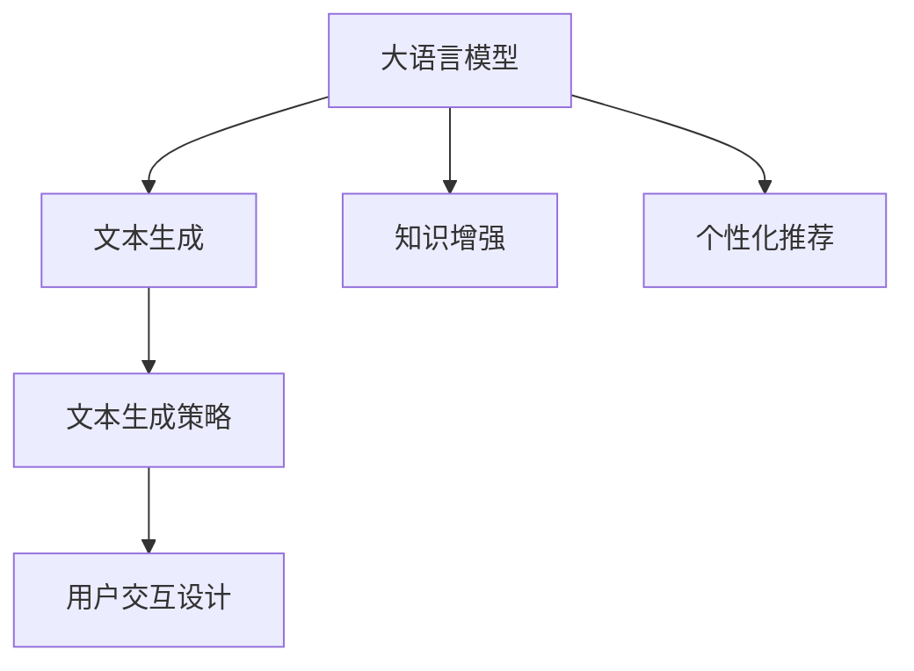

                 

# LLM在智能写作辅助系统中的应用探索

> 关键词：大语言模型(LLM),智能写作辅助系统,文本生成,知识增强,用户需求,个性化推荐

## 1. 背景介绍

### 1.1 问题由来

随着数字化时代的到来，信息爆炸和内容创作的繁重负担成为诸多领域面临的共同挑战。在新闻、营销、教育、科技等领域，撰写高质量、高效率的文本内容，既需要深厚的知识积累，又需要灵感的迸发和创造力的发挥。传统的写作过程往往繁琐耗时，且难以系统性地应用最新知识，制约了内容的创新和发展。

智能写作辅助系统应运而生，通过利用人工智能技术，协助作者创作出具有高质量、高原创性、高效率的文本内容。其中，基于大语言模型(LLM)的文本生成技术，由于其强大的自然语言处理能力和深度学习知识表示能力，成为智能写作辅助系统的重要支柱。

### 1.2 问题核心关键点

智能写作辅助系统的核心问题在于如何将大语言模型的文本生成能力与人类作者的创意和经验深度结合，生成既符合语法规范、又富有创新性的高质量文本内容。这需要综合考虑以下几个关键点：

1. **文本生成模型的选择**：选择合适的大语言模型作为文本生成的基础，其语言理解和生成的能力直接影响生成的文本质量。
2. **文本生成策略的设计**：如何引导模型生成符合用户需求、保持原创性和高可读性的文本。
3. **知识增强与个性化推荐**：如何在文本生成过程中融入最新知识，并为不同用户提供个性化的写作建议。
4. **用户体验的优化**：如何设计友好、高效的交互界面，使用户能够方便地使用智能写作工具。

## 2. 核心概念与联系

### 2.1 核心概念概述

为了更好地理解LLM在智能写作辅助系统中的应用，本节将介绍几个密切相关的核心概念：

- **大语言模型(LLM)**：以Transformer等架构为基础的深度学习模型，能够理解并生成人类语言，具备强大的语言表示能力。
- **文本生成**：通过机器学习模型自动生成符合语法和语义规范的文本内容，常用于对话生成、摘要生成、内容创作等任务。
- **知识增强**：将外部知识源与模型训练相结合，提升文本生成的语义准确性和丰富度。
- **个性化推荐**：根据用户的历史行为和偏好，推荐相关主题、词汇、结构等信息，提升写作的针对性和创新性。
- **用户交互设计**：设计直观、易用的用户界面，优化交互流程，增强用户体验。

这些核心概念之间的逻辑关系可以通过以下Mermaid流程图来展示：



这个流程图展示了大语言模型在智能写作辅助系统中的核心作用，以及各组件之间的相互关系：

1. 大语言模型作为文本生成的基础，负责理解输入指令和生成文本。
2. 知识增强模块将外部知识与模型相结合，提升文本的准确性和丰富度。
3. 个性化推荐系统根据用户行为和偏好，推荐相关内容，增强创作的多样性和个性化。
4. 用户交互设计优化交互界面，提升使用体验，确保系统易用性。

## 3. 核心算法原理 & 具体操作步骤
### 3.1 算法原理概述

智能写作辅助系统中的文本生成过程，本质上是基于大语言模型进行条件生成的问题。其核心思想是：根据用户提供的写作任务和要求，利用大语言模型的自回归或自编码架构，生成符合用户需求的高质量文本内容。

形式化地，假设用户输入的写作任务为 $T$，文本生成模型为 $M_{\theta}$，其中 $\theta$ 为模型的参数。文本生成的目标是在给定任务 $T$ 的条件下，生成最可能的文本 $X$，即：

$$
P(X|T) = \frac{P(X, T)}{P(T)}
$$

由于 $P(T)$ 为常数，因此最大化 $P(X|T)$ 即为文本生成的目标。在实际应用中，通常通过最大似然估计来近似计算 $P(X|T)$，即：

$$
P(X|T) \approx \frac{1}{N}\sum_{i=1}^N \delta_{x_i}(x) \times \log P(x_i|T)
$$

其中，$\delta_{x_i}(x)$ 为Dirac delta函数，表示文本 $X$ 与第 $i$ 个训练样本 $x_i$ 匹配。

### 3.2 算法步骤详解

基于大语言模型的智能写作辅助系统的文本生成过程通常包括以下几个关键步骤：

**Step 1: 任务定义与数据预处理**
- 收集用户提供的写作任务，如文章主题、写作风格、目标读者等，并转化为模型可处理的形式。
- 对文本数据进行预处理，包括分词、去除停用词、标准化等，以便模型更好地理解和生成文本。

**Step 2: 模型选择与加载**
- 选择合适的预训练大语言模型作为文本生成的基础，如GPT、BERT、T5等。
- 加载预训练模型，并进行必要的初始化，如设定种子、冻结某些层等。

**Step 3: 文本生成策略设计**
- 设计文本生成的策略，如多轮对话生成、基于模板的生成、条件概率采样等。
- 选择合适的损失函数，如交叉熵损失、语言模型损失等，评估生成文本的质量。

**Step 4: 知识增强**
- 整合外部知识源，如知识图谱、百科全书、学术文章等，增强模型的语义理解能力。
- 将知识信息编码到文本生成模型的输入或中间层中，提升生成文本的知识深度。

**Step 5: 个性化推荐**
- 收集用户的历史行为数据，如浏览记录、写作习惯等，建立用户画像。
- 根据用户画像和当前写作任务，推荐相关的关键词、主题、结构等信息，丰富生成文本的内容。

**Step 6: 文本后处理**
- 对生成的文本进行后处理，包括语法检查、拼写校正、语义优化等，确保文本的可读性和流畅性。
- 将文本内容格式化为符合用户需求的形式，如段落分隔、标题设置等。

**Step 7: 用户交互与反馈**
- 设计直观的用户交互界面，使用户能够方便地输入任务、接收生成文本和修改意见。
- 根据用户的反馈，不断调整生成策略和模型参数，优化生成文本的质量。

### 3.3 算法优缺点

基于大语言模型的智能写作辅助系统的文本生成方法具有以下优点：

1. **生成文本质量高**：大语言模型能够生成流畅、语法规范、语义准确的文本内容，具有较高的文本生成质量。
2. **知识融入能力强**：通过知识增强模块，模型能够吸收和利用外部知识，提升生成的文本的深度和广度。
3. **个性化推荐精准**：根据用户历史行为和当前需求，个性化推荐相关内容，提升写作的针对性和创新性。
4. **易用性强**：友好的用户交互设计和直观的界面，使用户能够轻松地使用智能写作工具，提升使用体验。

同时，该方法也存在一些局限性：

1. **依赖高质量数据**：生成文本的质量很大程度上依赖于输入任务和知识源的质量，数据噪音和错误会影响文本生成效果。
2. **计算资源消耗大**：大语言模型通常参数量庞大，计算资源消耗大，影响系统的部署和实时性。
3. **生成内容多样性有限**：虽然可以通过个性化推荐增强多样性，但在特定任务和用户偏好下，生成内容仍可能存在一定的局限性。
4. **内容版权问题**：生成的文本可能与用户期望不符，涉及版权和隐私问题，需进行适当的处理和解释。

尽管存在这些局限性，但基于大语言模型的文本生成方法仍是智能写作辅助系统的核心技术，其应用前景广阔。

### 3.4 算法应用领域

基于大语言模型的智能写作辅助系统已经在多个领域得到了应用，包括但不限于：

- **新闻写作辅助**：为记者提供写作灵感、素材推荐、语法校对等辅助。
- **市场营销内容创作**：帮助营销人员生成广告文案、社交媒体内容、产品介绍等。
- **教育写作辅导**：为学生提供作文构思、语言建议、语法检查等功能，提升写作水平。
- **科技写作支持**：协助科技人员生成技术文档、研究报告、专利申请等。
- **创意写作工具**：提供写作灵感、情节构思、角色设计等功能，支持小说、剧本等的创作。

## 4. 数学模型和公式 & 详细讲解 & 举例说明

### 4.1 数学模型构建

智能写作辅助系统中的文本生成过程，本质上是一个条件概率模型。以GPT模型为例，文本生成模型的数学模型为：

$$
P(x_{1:T} | x_0) = \prod_{t=1}^{T} P(x_t | x_{<t})
$$

其中，$x_{1:T}$ 为生成文本，$x_0$ 为输入的任务描述，$P(x_t | x_{<t})$ 表示在给定前 $t-1$ 个词的情况下，第 $t$ 个词的条件概率。

### 4.2 公式推导过程

在实际应用中，通常采用蒙特卡洛方法（如Gibbs采样）或变分推断方法（如变分自编码器）来近似计算条件概率 $P(x_t | x_{<t})$。

以Gibbs采样为例，推导过程如下：

1. **初始化**：随机生成初始状态 $x_1$。
2. **迭代生成**：根据当前状态 $x_t$，计算下一个状态 $x_{t+1}$ 的概率分布 $P(x_{t+1} | x_{<t})$，从该分布中随机采样 $x_{t+1}$。
3. **采样终止**：当生成 $T$ 个词时，停止采样。

根据上式，生成文本的过程可以形式化表示为：

$$
P(x_{1:T} | x_0) = \prod_{t=1}^{T} \int p(x_{t+1} | x_{<t}) p(x_t | x_{<t-1}) \, dx_t
$$

其中，$p(x_t | x_{<t-1})$ 为当前状态 $x_{<t-1}$ 到下一个状态 $x_t$ 的转移概率，通常采用softmax函数进行计算。

### 4.3 案例分析与讲解

假设用户要求生成一篇关于“人工智能的未来”的短文，任务描述为：“探索人工智能技术的发展趋势，分析其对社会、经济的影响，提出应对策略”。

**Step 1: 数据预处理**
- 对用户提供的任务描述进行分词和去除停用词处理。
- 将处理后的任务描述作为文本生成模型的输入。

**Step 2: 模型选择与加载**
- 选择GPT-3作为文本生成模型，设定种子为0，冻结前几层。
- 加载预训练的GPT-3模型，并对其进行微调。

**Step 3: 文本生成策略设计**
- 采用基于模板的生成策略，模板为：“人工智能的未来在于...，它将对...产生深远影响，我们应该...”。
- 使用交叉熵损失函数，评估生成文本与模板的一致性和语法规范性。

**Step 4: 知识增强**
- 将相关的知识图谱、学术论文、新闻报道等数据整合到文本生成模型中，增强模型的知识深度。
- 在生成过程中，将知识信息嵌入到模型输入中，提升文本的准确性和相关性。

**Step 5: 个性化推荐**
- 根据用户的历史写作习惯和当前任务，推荐相关的关键词、主题、结构等信息。
- 在生成文本过程中，将推荐信息整合到模型输入中，丰富文本内容。

**Step 6: 文本后处理**
- 对生成的文本进行语法检查、拼写校正、语义优化等后处理。
- 将文本内容格式化为符合用户需求的形式，如段落分隔、标题设置等。

**Step 7: 用户交互与反馈**
- 设计直观的用户交互界面，使用户能够方便地输入任务、接收生成文本和修改意见。
- 根据用户的反馈，不断调整生成策略和模型参数，优化生成文本的质量。

最终生成的文本为：

```
人工智能的未来在于其不断发展和创新，它将对社会、经济产生深远影响，我们应该积极应对其带来的挑战，同时抓住机遇。首先，人工智能技术将极大地提升生产力和效率，改变人类的工作方式和生活方式。其次，人工智能将推动经济结构的转型升级，促进新兴产业的发展。最后，人工智能的应用将带来新的伦理和社会问题，我们需要共同努力，制定合理的政策和规范，保障人工智能技术的健康发展。
```

## 5. 项目实践：代码实例和详细解释说明
### 5.1 开发环境搭建

在进行智能写作辅助系统的开发前，我们需要准备好开发环境。以下是使用Python进行PyTorch开发的环境配置流程：

1. 安装Anaconda：从官网下载并安装Anaconda，用于创建独立的Python环境。

2. 创建并激活虚拟环境：
```bash
conda create -n pytorch-env python=3.8 
conda activate pytorch-env
```

3. 安装PyTorch：根据CUDA版本，从官网获取对应的安装命令。例如：
```bash
conda install pytorch torchvision torchaudio cudatoolkit=11.1 -c pytorch -c conda-forge
```

4. 安装Transformers库：
```bash
pip install transformers
```

5. 安装各类工具包：
```bash
pip install numpy pandas scikit-learn matplotlib tqdm jupyter notebook ipython
```

完成上述步骤后，即可在`pytorch-env`环境中开始开发实践。

### 5.2 源代码详细实现

下面以GPT模型为例，给出使用Transformers库进行智能写作辅助系统开发的PyTorch代码实现。

首先，定义任务描述处理函数：

```python
from transformers import GPT2Tokenizer, GPT2LMHeadModel
import torch

def process_task(task):
    # 分词和去除停用词
    tokenizer = GPT2Tokenizer.from_pretrained('gpt2')
    task_tokens = tokenizer(task, return_tensors='pt')
    
    # 去除特殊符号
    task_tokens['input_ids'] = task_tokens['input_ids'][:, :-1]
    task_tokens['attention_mask'] = task_tokens['attention_mask'][:, :-1]
    
    return task_tokens
```

然后，定义生成模型和优化器：

```python
from transformers import AdamW

model = GPT2LMHeadModel.from_pretrained('gpt2')
model.eval()

optimizer = AdamW(model.parameters(), lr=2e-5)
```

接着，定义文本生成策略：

```python
def generate_text(model, task_tokens, max_len=512, num_return_sequences=1):
    with torch.no_grad():
        inputs = model.to(torch.device('cuda'))
        outputs = model.generate(task_tokens['input_ids'], attention_mask=task_tokens['attention_mask'], max_length=max_len, num_return_sequences=num_return_sequences, do_sample=True, top_p=0.9)
    
    return tokenizer.decode(outputs, skip_special_tokens=True)
```

最后，启动文本生成流程：

```python
task = "人工智能的未来在于...，它将对...产生深远影响，我们应该..."

task_tokens = process_task(task)
generated_text = generate_text(model, task_tokens)

print(generated_text)
```

以上就是使用PyTorch对GPT模型进行文本生成任务的完整代码实现。可以看到，得益于Transformers库的强大封装，我们可以用相对简洁的代码完成模型的加载和生成。

### 5.3 代码解读与分析

让我们再详细解读一下关键代码的实现细节：

**process_task函数**：
- 分词和去除停用词：使用GPT2Tokenizer对任务描述进行分词和去除停用词处理。
- 去除特殊符号：将任务描述中的特殊符号和结束符号去除，以便于模型生成。

**generate_text函数**：
- 定义生成函数：使用GPT2LMHeadModel进行文本生成，通过设定最大长度和生成序列数，生成多个文本序列。
- 解码函数：使用tokenizer.decode函数对生成的文本进行解码，并去除特殊符号，输出最终生成的文本。

**生成流程**：
- 先定义任务描述，并进行预处理。
- 调用generate_text函数进行文本生成，设定最大长度和生成序列数。
- 对生成的文本进行解码和处理，输出最终结果。

可以看到，PyTorch配合Transformers库使得GPT模型文本生成的代码实现变得简洁高效。开发者可以将更多精力放在数据处理、模型改进等高层逻辑上，而不必过多关注底层的实现细节。

当然，工业级的系统实现还需考虑更多因素，如模型的保存和部署、超参数的自动搜索、更灵活的任务适配层等。但核心的文本生成范式基本与此类似。

## 6. 实际应用场景
### 6.1 新闻写作辅助

智能写作辅助系统在新闻写作中有着广泛的应用前景。记者和编辑往往需要在短时间内产出高质量的新闻报道，大语言模型可以在提供写作灵感、素材推荐、语法校对等方面提供有效支持。

具体而言，系统可以根据当前热点事件和新闻领域，自动生成相关报道模板和背景知识，帮助记者快速撰写新闻稿。同时，系统还可以对已生成的文本进行语法和拼写检查，确保新闻内容的规范性和准确性。

### 6.2 市场营销内容创作

市场营销人员在撰写广告文案、社交媒体内容、产品介绍等时，常常需要花费大量时间和精力。智能写作辅助系统可以生成符合品牌调性的创意文案，丰富营销内容的多样性和创新性。

系统可以根据用户的品牌风格和市场定位，自动生成吸引人的广告词、宣传语和社交媒体帖子，提高营销效果。同时，系统还可以分析用户的互动反馈，不断优化生成策略，提升用户满意度和品牌知名度。

### 6.3 教育写作辅导

学生在学习写作时，常常遇到素材不足、语法错误等问题。智能写作辅助系统可以为学生提供写作指导、语法检查、拼写纠正等功能，提升写作水平。

具体而言，系统可以根据学生的学习进度和写作习惯，自动生成相关的写作提示和素材推荐，帮助学生完成作文和研究报告。同时，系统还可以对学生的文本进行语法和拼写检查，提供针对性的建议和修改意见，提升写作质量。

### 6.4 科技写作支持

科技人员在撰写技术文档、研究报告、专利申请等时，常常需要具备深厚的专业知识。智能写作辅助系统可以帮助科技人员生成技术描述、实验方案、论文摘要等内容，提升科研效率和写作质量。

系统可以根据科技人员的研究方向和领域，自动生成相关的技术文档模板和知识图谱信息，帮助研究人员快速撰写技术文档。同时，系统还可以对生成的文本进行语法和语义检查，确保文档的规范性和准确性。

## 7. 工具和资源推荐
### 7.1 学习资源推荐

为了帮助开发者系统掌握智能写作辅助技术，这里推荐一些优质的学习资源：

1. **《自然语言处理综述》**：斯坦福大学NLP专家Michael Riley编写的书籍，全面介绍自然语言处理的基本概念和前沿技术，包括文本生成、知识增强、个性化推荐等。

2. **CS224N《自然语言处理》课程**：斯坦福大学开设的NLP明星课程，涵盖文本生成、知识图谱、多模态学习等主题，提供Lecture视频和配套作业，适合入门学习。

3. **《自然语言生成综述》**：MIT教授Emily Bender等编写的书籍，系统介绍自然语言生成的基本原理和前沿技术，包括条件生成、知识增强、对抗生成等。

4. **Transformers官方文档**：HuggingFace官方文档，提供了大量预训练语言模型的样例代码和优化策略，是学习智能写作辅助系统的必备资源。

5. **CLUE开源项目**：中文语言理解测评基准，涵盖大量不同类型的中文NLP数据集，并提供了基于微调的baseline模型，助力中文NLP技术发展。

通过对这些资源的学习实践，相信你一定能够快速掌握智能写作辅助技术，并用于解决实际的NLP问题。

### 7.2 开发工具推荐

高效的开发离不开优秀的工具支持。以下是几款用于智能写作辅助系统开发的常用工具：

1. **PyTorch**：基于Python的开源深度学习框架，灵活动态的计算图，适合快速迭代研究。大部分预训练语言模型都有PyTorch版本的实现。

2. **TensorFlow**：由Google主导开发的开源深度学习框架，生产部署方便，适合大规模工程应用。同样有丰富的预训练语言模型资源。

3. **Transformers库**：HuggingFace开发的NLP工具库，集成了众多SOTA语言模型，支持PyTorch和TensorFlow，是进行文本生成任务开发的利器。

4. **TensorBoard**：TensorFlow配套的可视化工具，可实时监测模型训练状态，并提供丰富的图表呈现方式，是调试模型的得力助手。

5. **Weights & Biases**：模型训练的实验跟踪工具，可以记录和可视化模型训练过程中的各项指标，方便对比和调优。与主流深度学习框架无缝集成。

6. **Jupyter Notebook**：开源的交互式计算环境，支持Python和R等语言，适合进行数据探索、模型调试和交互式编程。

合理利用这些工具，可以显著提升智能写作辅助系统的开发效率，加快创新迭代的步伐。

### 7.3 相关论文推荐

智能写作辅助系统的文本生成技术源于学界的持续研究。以下是几篇奠基性的相关论文，推荐阅读：

1. **Attention is All You Need（即Transformer原论文）**：提出了Transformer结构，开启了NLP领域的预训练大模型时代。

2. **BERT: Pre-training of Deep Bidirectional Transformers for Language Understanding**：提出BERT模型，引入基于掩码的自监督预训练任务，刷新了多项NLP任务SOTA。

3. **Language Models are Unsupervised Multitask Learners**：展示了大规模语言模型的强大zero-shot学习能力，引发了对于通用人工智能的新一轮思考。

4. **Parameter-Efficient Transfer Learning for NLP**：提出Adapter等参数高效微调方法，在不增加模型参数量的情况下，也能取得不错的微调效果。

5. **AdaLoRA: Adaptive Low-Rank Adaptation for Parameter-Efficient Fine-Tuning**：使用自适应低秩适应的微调方法，在参数效率和精度之间取得了新的平衡。

这些论文代表了大语言模型文本生成技术的发展脉络。通过学习这些前沿成果，可以帮助研究者把握学科前进方向，激发更多的创新灵感。

## 8. 总结：未来发展趋势与挑战

### 8.1 总结

本文对基于大语言模型的智能写作辅助系统进行了全面系统的介绍。首先阐述了智能写作辅助系统的背景和意义，明确了文本生成在提升写作效率和质量方面的独特价值。其次，从原理到实践，详细讲解了文本生成模型的数学原理和关键步骤，给出了微调过程的完整代码实例。同时，本文还广泛探讨了文本生成方法在新闻、市场营销、教育、科技等领域的实际应用前景，展示了其巨大的应用潜力。此外，本文精选了文本生成技术的各类学习资源，力求为读者提供全方位的技术指引。

通过本文的系统梳理，可以看到，基于大语言模型的文本生成技术正在成为智能写作辅助系统的核心技术，极大地拓展了预训练语言模型的应用边界，催生了更多的落地场景。受益于大规模语料的预训练，文本生成模型能够生成流畅、语法规范、语义准确的文本内容，为传统写作方式带来了革命性的改变。未来，伴随预训练语言模型和文本生成方法的不断演进，相信NLP技术将在更广阔的应用领域大放异彩，深刻影响人类的生产生活方式。

### 8.2 未来发展趋势

展望未来，大语言模型文本生成技术将呈现以下几个发展趋势：

1. **生成内容多样性提升**：通过引入更多先验知识、多模态信息融合、因果推理等，生成内容将更加丰富多样，提升文本生成模型的表现力。
2. **知识增强能力的强化**：通过与外部知识库、逻辑规则等专家知识结合，生成文本将具备更强的语义准确性和逻辑性，提升智能写作系统的智能水平。
3. **个性化推荐系统的优化**：通过深度学习、强化学习等技术，个性化推荐系统将更加精准高效，提升文本生成的针对性和创新性。
4. **交互界面的优化**：通过设计直观、易用的用户界面，提升用户体验，降低使用门槛，使得智能写作系统更加普及。
5. **实时性和响应速度的提升**：通过优化计算图、引入并行计算、使用预训练和微调相结合的策略等，提升文本生成的实时性和响应速度，满足实时应用的需求。
6. **生成文本的可解释性增强**：通过因果推理、可解释性算法等技术，提升文本生成的可解释性，增强系统的透明度和可信度。

以上趋势凸显了智能写作辅助系统的巨大前景。这些方向的探索发展，必将进一步提升文本生成模型的性能和应用范围，为内容创作带来新的变革性影响。

### 8.3 面临的挑战

尽管大语言模型文本生成技术已经取得了瞩目成就，但在迈向更加智能化、普适化应用的过程中，它仍面临着诸多挑战：

1. **生成内容质量不稳定**：尽管文本生成模型的技术不断进步，但在特定领域和任务中，生成的文本仍可能存在质量不稳定的现象，影响用户体验。
2. **知识库的构建和维护**：外部知识库的构建和维护需要大量的人力物力，且知识库的更新速度难以跟上知识快速增长的步伐。
3. **数据隐私和安全问题**：生成文本可能涉及用户的隐私信息，如何保护用户隐私、确保数据安全，是一个亟待解决的问题。
4. **计算资源消耗大**：文本生成模型的计算复杂度高，在实际部署中需要大量的计算资源，如何优化计算图、降低资源消耗，是实现高性能部署的关键。
5. **生成内容的版权和伦理问题**：生成的文本可能与用户期望不符，涉及版权和伦理问题，如何处理和解释生成文本的版权归属，是一个需要认真对待的问题。
6. **用户对AI的信任和接受度**：智能写作辅助系统需要用户信任和接受，如何提高用户对AI的信任度，增强系统的透明度和可信度，是推广智能写作系统的重要课题。

正视智能写作辅助系统面临的这些挑战，积极应对并寻求突破，将是大语言模型文本生成技术迈向成熟的必由之路。相信随着学界和产业界的共同努力，这些挑战终将一一被克服，智能写作辅助系统必将在内容创作中发挥越来越重要的作用。

### 8.4 研究展望

面对大语言模型文本生成技术所面临的种种挑战，未来的研究需要在以下几个方面寻求新的突破：

1. **生成内容质量提升**：进一步提升文本生成模型的质量，使其生成的文本更加流畅、准确、有创意。
2. **知识增强技术的改进**：探索更加高效的知识增强方法，提升模型对外部知识的吸收和整合能力，丰富生成文本的语义信息。
3. **个性化推荐系统的优化**：开发更加精准高效的个性化推荐系统，根据用户行为和偏好，生成符合其需求的高质量文本内容。
4. **用户交互界面的优化**：设计直观、易用的用户界面，优化交互流程，提升用户体验。
5. **实时性和响应速度的提升**：优化计算图、引入并行计算、使用预训练和微调相结合的策略，提升文本生成的实时性和响应速度。
6. **生成文本的可解释性增强**：通过因果推理、可解释性算法等技术，提升文本生成的可解释性，增强系统的透明度和可信度。

这些研究方向的探索，必将引领智能写作辅助系统技术迈向更高的台阶，为内容创作带来新的变革性影响。面向未来，智能写作辅助系统需要与其他人工智能技术进行更深入的融合，如知识表示、因果推理、强化学习等，多路径协同发力，共同推动自然语言理解和智能交互系统的进步。只有勇于创新、敢于突破，才能不断拓展智能写作辅助系统的边界，让智能技术更好地造福人类社会。

## 9. 附录：常见问题与解答

**Q1：智能写作辅助系统是否适用于所有写作场景？**

A: 智能写作辅助系统适用于大多数需要高效、高质写作的场景，如新闻报道、市场营销、教育辅导、科技文档等。但对于一些需要高度原创性、深度思考的写作任务，如小说、哲学论文、艺术创作等，智能写作系统还需进一步提升生成内容的深度和创新性。

**Q2：如何选择合适的文本生成模型？**

A: 选择合适的文本生成模型需要考虑以下几个因素：
1. **任务类型**：不同类型的写作任务适合不同结构的模型，如新闻报道适合基于语言模型的模型，小说创作适合基于生成对抗网络(GAN)的模型。
2. **数据质量**：高质量的数据能够提升模型的生成效果，低质量的数据可能导致生成文本的质量不稳定。
3. **计算资源**：模型的参数量和计算复杂度直接影响其实时性和资源消耗，需根据实际应用场景选择合适的模型。
4. **性能要求**：对于实时性要求高的应用，如实时问答系统、在线客服等，需选择计算效率高、响应速度快的模型。

**Q3：如何优化文本生成模型的生成质量？**

A: 优化文本生成模型的生成质量需要综合考虑以下几个方面：
1. **数据预处理**：对输入数据进行分词、去停用词、标准化等预处理，提升模型的输入质量。
2. **模型选择和微调**：选择合适的预训练模型并进行微调，优化生成策略和损失函数，提升生成文本的质量。
3. **知识增强**：通过整合外部知识库和逻辑规则，提升模型的语义理解和生成能力。
4. **个性化推荐**：根据用户历史行为和当前需求，推荐相关主题、词汇、结构等信息，提升生成文本的针对性和创新性。
5. **后处理和反馈**：对生成的文本进行语法检查、拼写校正、语义优化等后处理，根据用户反馈不断调整生成策略和模型参数。

**Q4：智能写作辅助系统在落地部署时需要注意哪些问题？**

A: 将智能写作辅助系统转化为实际应用，还需要考虑以下因素：
1. **模型裁剪和压缩**：对模型进行裁剪和压缩，去除不必要的层和参数，减小模型尺寸，提高推理速度。
2. **量化加速**：将浮点模型转为定点模型，压缩存储空间，提高计算效率。
3. **服务化封装**：将模型封装为标准化服务接口，便于集成调用。
4. **弹性伸缩**：根据请求流量动态调整资源配置，平衡服务质量和成本。
5. **监控告警**：实时采集系统指标，设置异常告警阈值，确保服务稳定性。
6. **安全防护**：采用访问鉴权、数据脱敏等措施，保障数据和模型安全。

通过综合考虑以上因素，可以构建高效、稳定、安全的智能写作辅助系统，提升内容创作的质量和效率。

---

作者：禅与计算机程序设计艺术 / Zen and the Art of Computer Programming

