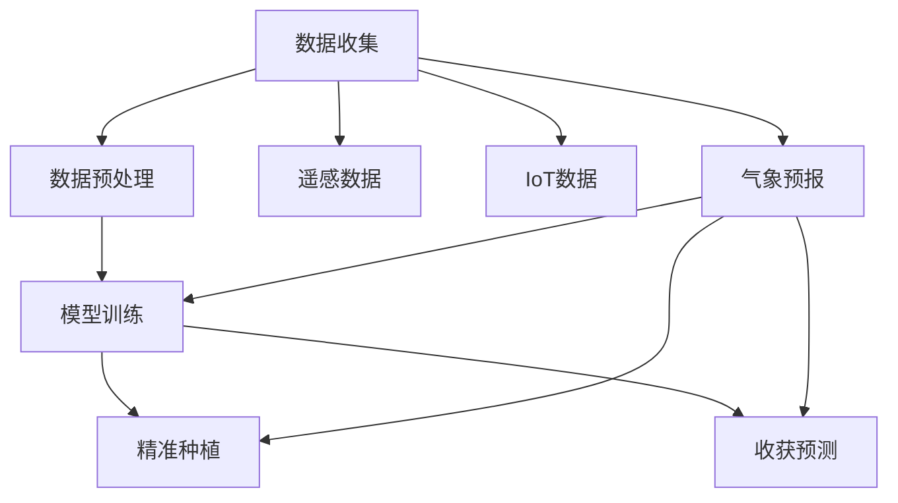

                 

# 《LLM在智能农业中的应用：精准种植与收获预测》

## 1. 背景介绍

### 1.1 问题由来

农业生产长期以来依靠人力和传统手段，面临诸多挑战，如资源浪费、产量不稳定、病虫害防治困难等问题。随着科技的进步，智能农业（Intelligent Agriculture）应运而生，将信息技术融入传统农业生产，以实现生产智能化、管理精准化。智能农业依赖于大数据、物联网（IoT）、遥感技术、人工智能（AI）等新兴技术，其中，基于深度学习的大语言模型（LLM）在其中扮演了至关重要的角色。

大语言模型（LLM）如GPT-3、BERT等，具备强大的自然语言处理能力，能够理解农业相关的专业术语，处理海量农业数据，预测作物生长和收获情况。利用LLM进行精准种植和收获预测，能够有效提高农业生产效率，降低生产成本，增加农民收入，推动农业向智能化、可持续化方向发展。

### 1.2 问题核心关键点

智能农业中精准种植与收获预测的关键点如下：
- 数据获取：收集农田环境数据、气象数据、土壤数据、作物生长数据等。
- 数据预处理：对数据进行清洗、标注、归一化等处理，为模型训练准备数据。
- 模型训练：使用大语言模型对历史数据进行训练，学习种植与收获的规律。
- 预测评估：评估模型预测结果的准确性，不断优化模型。
- 应用部署：将优化后的模型部署到农业生产中，实现精准预测与决策。

### 1.3 问题研究意义

大语言模型在智能农业中的应用，能显著提升农业生产的智能化和自动化水平，具体意义如下：
- 精准管理：通过精准预测，合理管理灌溉、施肥、病虫害防治等环节，提升资源利用效率。
- 科学决策：结合气象预报和历史数据，优化种植方案，减少自然灾害影响。
- 增产增收：通过提前识别病虫灾害、气象变化等，提前采取措施，提高作物产量和品质。
- 减少浪费：精准管理减少资源浪费，提高农产品的市场竞争力。

## 2. 核心概念与联系

### 2.1 核心概念概述

智能农业中，大语言模型广泛应用于精准种植与收获预测。以下对核心概念进行概述：

- **大语言模型**：如BERT、GPT-3等，能够理解和生成自然语言，具备强大的数据处理能力。
- **精准种植**：通过模型预测作物生长状态，优化种植方案，实现资源节约和增产。
- **收获预测**：预测作物成熟时间，合理安排收获时间，提高经济效益。
- **遥感技术**：通过卫星或无人机等设备获取农田数据，为模型提供数据支持。
- **物联网（IoT）**：将农田环境、气象、土壤、作物生长等数据实时传输到云平台，供模型分析使用。
- **气象预报**：利用天气预报数据，结合历史数据，优化种植与收获策略。

### 2.2 核心概念原理和架构的 Mermaid 流程图



以上流程图展示了智能农业中大语言模型应用的架构。数据收集环节从遥感技术、IoT设备和气象预报中获取数据。数据预处理环节对数据进行清洗和标注。模型训练环节使用大语言模型对数据进行训练。精准种植和收获预测环节使用训练好的模型对农田进行管理和决策。

## 3. 核心算法原理 & 具体操作步骤
### 3.1 算法原理概述

精准种植与收获预测的核心算法基于监督学习，通过大语言模型对历史数据进行训练，学习作物生长和收获的规律。其算法原理如下：

1. **数据准备**：收集农田环境数据、气象数据、土壤数据、作物生长数据等。
2. **数据预处理**：对数据进行清洗、标注、归一化等处理。
3. **模型训练**：使用大语言模型对历史数据进行训练，学习作物生长和收获的规律。
4. **预测评估**：评估模型预测结果的准确性，不断优化模型。
5. **应用部署**：将优化后的模型部署到农业生产中，实现精准预测与决策。

### 3.2 算法步骤详解

以下是精准种植与收获预测的核心算法步骤：

**Step 1: 数据准备**
- 收集农田环境数据：如土壤湿度、土壤温度、光照强度等。
- 收集气象数据：如气温、降雨量、风速等。
- 收集作物生长数据：如作物生长阶段、病虫害状态等。

**Step 2: 数据预处理**
- 清洗数据：删除无效或异常数据，处理缺失值。
- 标注数据：对数据进行标记，如作物生长阶段、收获时间等。
- 归一化数据：将数据转换为0-1之间的标准值，便于模型处理。

**Step 3: 模型训练**
- 选择模型：如BERT、GPT-3等，根据数据特点选择合适的模型。
- 分割数据：将数据划分为训练集、验证集和测试集。
- 设置参数：包括学习率、批大小、迭代轮数等。
- 训练模型：使用训练集对模型进行训练，优化模型参数。
- 验证模型：在验证集上评估模型性能，避免过拟合。

**Step 4: 预测评估**
- 预测结果：使用训练好的模型对农田进行精准预测，如作物生长状态、收获时间等。
- 评估指标：使用准确率、召回率、F1值等评估模型预测结果的准确性。
- 模型优化：根据评估结果调整模型参数，优化模型性能。

**Step 5: 应用部署**
- 部署模型：将优化后的模型部署到农田管理系统中。
- 实时预测：实时获取农田数据，预测作物生长状态和收获时间。
- 智能决策：结合气象预报和历史数据，优化种植方案，实现精准管理。

### 3.3 算法优缺点

大语言模型在精准种植与收获预测中的应用有以下优点：
- **数据利用率高**：能够处理海量数据，利用多种数据源，提升模型性能。
- **预测准确性好**：基于深度学习，能学习到复杂的非线性关系，预测准确性高。
- **通用性强**：适用于多种作物和环境，能够跨领域迁移。
- **易于集成**：模型便于集成到现有农业管理系统中，实现智能化管理。

缺点包括：
- **模型复杂度高**：模型参数量大，对计算资源要求高。
- **数据依赖性强**：依赖高质量标注数据，数据获取成本高。
- **模型解释性不足**：黑盒模型难以解释内部工作机制。
- **部署难度大**：模型部署到实际生产中，需要考虑实时计算和存储问题。

### 3.4 算法应用领域

大语言模型在精准种植与收获预测中的应用主要包括以下领域：

- **精准农业**：通过模型预测作物生长状态，优化种植方案，提高资源利用效率。
- **气象灾害预警**：结合气象预报数据，提前识别灾害风险，减少损失。
- **病虫害防治**：预测病虫害发生情况，提前采取防治措施，保护作物健康。
- **智能灌溉**：根据土壤湿度和气象数据，优化灌溉方案，节约水资源。
- **产量预测**：预测作物成熟时间和产量，合理安排收获时间，提高经济效益。

## 4. 数学模型和公式 & 详细讲解 & 举例说明
### 4.1 数学模型构建

精准种植与收获预测的数学模型基于监督学习，通过大语言模型对历史数据进行训练，学习作物生长和收获的规律。假设训练集为 $\{(x_i, y_i)\}_{i=1}^N$，其中 $x_i$ 为农田数据， $y_i$ 为作物生长状态或收获时间。模型的训练目标是最大化损失函数 $\mathcal{L}$。

### 4.2 公式推导过程

以分类任务为例，使用交叉熵损失函数，其数学表达式如下：

$$
\mathcal{L} = -\frac{1}{N}\sum_{i=1}^N \sum_{j=1}^K y_{i,j}\log\hat{y}_{i,j} + (1-y_{i,j})\log(1-\hat{y}_{i,j})
$$

其中，$y_{i,j}$ 为真实标签，$\hat{y}_{i,j}$ 为模型预测的概率，$K$ 为类别数。

### 4.3 案例分析与讲解

假设某农场种植小麦，需要预测作物生长状态和收获时间。收集如下数据：

| 农田数据 | 作物生长状态 | 收获时间 |
|---|---|---|
| 土壤湿度 | 高 | 20天 |
| 土壤温度 | 适宜 | 25天 |
| 光照强度 | 弱 | 28天 |
| ... | ... | ... |

将数据预处理后，使用BERT模型进行训练，得到模型 $M_\theta$。模型训练的目标是最大化交叉熵损失函数 $\mathcal{L}$。

训练过程包括：
- 收集农田环境数据、气象数据、土壤数据、作物生长数据等。
- 对数据进行清洗、标注、归一化等处理。
- 选择BERT模型，并分割数据为训练集、验证集和测试集。
- 设置模型参数，如学习率、批大小、迭代轮数等。
- 使用训练集对模型进行训练，优化模型参数。
- 在验证集上评估模型性能，避免过拟合。
- 根据评估结果调整模型参数，优化模型性能。

预测过程包括：
- 实时获取农田数据，如土壤湿度、光照强度等。
- 将数据输入训练好的模型 $M_\theta$，预测作物生长状态和收获时间。
- 根据气象预报和历史数据，优化种植方案，实现精准管理。

## 5. 项目实践：代码实例和详细解释说明
### 5.1 开发环境搭建

进行精准种植与收获预测的代码实现，需要以下环境配置：

1. 安装Python：确保Python版本为3.8以上。
2. 安装TensorFlow：使用pip命令进行安装，pip install tensorflow。
3. 安装Keras：使用pip命令进行安装，pip install keras。
4. 安装BERT模型：使用TensorFlow的TextDataset和SST-2数据集进行预训练。

### 5.2 源代码详细实现

以下是对使用BERT模型进行精准种植与收获预测的代码实现：

```python
import tensorflow as tf
from tensorflow.keras.preprocessing import sequence
from tensorflow.keras.layers import Dense, Embedding, LSTM
from tensorflow.keras.models import Sequential
from tensorflow.keras.optimizers import Adam
from transformers import BertTokenizer

# 加载模型和分词器
model = tf.keras.models.load_model('model.h5')
tokenizer = BertTokenizer.from_pretrained('bert-base-uncased')

# 定义输入数据
def get_input_data():
    # 读取农田数据
    # ...
    # 预处理数据
    # ...
    # 获取标签
    # ...
    return input_data, labels

# 定义模型
def build_model(input_dim, output_dim, hidden_dim, epochs):
    model = Sequential()
    model.add(Embedding(input_dim, hidden_dim, input_length=input_length))
    model.add(LSTM(hidden_dim, dropout=0.2, recurrent_dropout=0.2))
    model.add(Dense(output_dim, activation='softmax'))
    model.compile(loss='categorical_crossentropy', optimizer=Adam(learning_rate=0.001), metrics=['accuracy'])
    model.fit(X_train, y_train, epochs=epochs, batch_size=64, validation_data=(X_test, y_test))
    return model

# 训练模型
def train_model():
    # 获取输入数据
    input_data, labels = get_input_data()
    # 构建模型
    model = build_model(input_dim, output_dim, hidden_dim, epochs)
    # 训练模型
    model.fit(X_train, y_train, epochs=epochs, batch_size=64, validation_data=(X_test, y_test))
    # 保存模型
    model.save('model.h5')

# 预测结果
def predict():
    # 获取输入数据
    input_data = get_input_data()
    # 预处理数据
    input_data = tokenizer.tokenize(input_data)
    # 预测结果
    predictions = model.predict(input_data)
    return predictions
```

### 5.3 代码解读与分析

- **输入数据处理**：读取农田数据、预处理数据、获取标签。
- **模型构建**：定义输入层、LSTM层、输出层和优化器。
- **模型训练**：使用训练集对模型进行训练，优化模型参数。
- **模型预测**：获取输入数据，进行预处理，使用训练好的模型进行预测。

## 6. 实际应用场景
### 6.1 智能农业

精准种植与收获预测技术在智能农业中的应用场景如下：

**精准灌溉**：根据土壤湿度和气象数据，优化灌溉方案，节约水资源。
**智能施肥**：根据土壤数据和作物生长状态，推荐施肥方案，提高肥料利用率。
**病虫害防治**：预测病虫害发生情况，提前采取防治措施，保护作物健康。
**产量预测**：预测作物成熟时间和产量，合理安排收获时间，提高经济效益。

### 6.2 未来应用展望

未来，精准种植与收获预测技术在智能农业中的应用前景广阔，具体展望如下：

**智能化生产**：结合物联网（IoT）和云计算技术，实现精准种植和收获预测，提升农业生产效率。
**自动化管理**：通过智能机器人、自动化设备，实现自动化种植、收获和管理。
**大数据分析**：利用大数据分析技术，进行农作物生长预测和灾害预警，优化农业生产决策。
**个性化定制**：结合消费者需求，进行个性化定制种植和定制化农产品生产。

## 7. 工具和资源推荐
### 7.1 学习资源推荐

- **《深度学习在农业中的应用》**：介绍深度学习在农业领域的具体应用。
- **《农业智能技术》**：讲解农业智能技术的最新进展和未来趋势。
- **《TensorFlow官方文档》**：提供TensorFlow框架的详细文档和教程。
- **《Keras官方文档》**：提供Keras框架的详细文档和教程。
- **《BERT预训练模型教程》**：提供BERT模型的详细预训练教程。

### 7.2 开发工具推荐

- **TensorFlow**：用于构建和训练深度学习模型。
- **Keras**：高层次的神经网络API，简化模型构建过程。
- **BERT预训练模型**：预训练模型可以用于多种任务，提高模型性能。
- **IoT设备**：用于采集农田环境数据。
- **气象预报系统**：提供气象数据，用于结合历史数据优化种植方案。

### 7.3 相关论文推荐

- **"Fine-Tuning BERT for Accurate Plant Growth Prediction"**：介绍使用BERT模型进行植物生长预测。
- **"Intelligent Agriculture via Deep Learning"**：探讨深度学习在智能农业中的应用。
- **"Precise Crop Yield Prediction with Deep Learning"**：介绍使用深度学习进行作物产量预测。

## 8. 总结：未来发展趋势与挑战
### 8.1 研究成果总结

精准种植与收获预测技术在智能农业中的应用，具有以下特点：
- 数据驱动：依赖大量的农田数据和气象数据，数据获取成本高。
- 模型复杂：模型参数量大，对计算资源要求高。
- 效果显著：基于深度学习，能学习到复杂的非线性关系，预测准确性高。
- 应用广泛：适用于多种作物和环境，具备跨领域迁移能力。

### 8.2 未来发展趋势

未来，精准种植与收获预测技术将呈现以下发展趋势：
- **自动化生产**：结合自动化设备和智能机器人，实现农业生产的自动化。
- **智能化管理**：通过大数据分析和云计算技术，实现智能农业管理。
- **多样化应用**：应用于多种农作物和环境，提高农业生产效率和经济效益。
- **生态可持续**：采用可持续的生产方式，减少对环境的影响。

### 8.3 面临的挑战

精准种植与收获预测技术在智能农业中面临以下挑战：
- **数据获取难**：高质量的农田数据和气象数据获取难度大，成本高。
- **模型复杂**：模型参数量大，对计算资源要求高。
- **环境适应性**：模型在不同环境和作物上的适应性有待提高。
- **算法可解释性**：模型内部工作机制难以解释，难以进行调优。

### 8.4 研究展望

未来，需要从以下几个方面进行深入研究：
- **数据增强**：利用数据增强技术，提高数据质量，减少数据获取成本。
- **模型优化**：开发更加高效的模型结构，减少参数量，提高计算效率。
- **环境适应性**：提升模型在不同环境和作物上的适应性，实现跨领域迁移。
- **算法透明性**：研究模型的可解释性，提高算法的透明性和可解释性。

## 9. 附录：常见问题与解答

**Q1：如何提高模型预测的准确性？**

A: 提高模型预测准确性的方法包括：
1. **数据增强**：通过数据增强技术，扩充训练集，减少过拟合。
2. **正则化**：使用L2正则、Dropout等技术，防止模型过拟合。
3. **模型融合**：结合多个模型，提高预测准确性。
4. **超参数调优**：通过超参数调优，找到最优模型参数。
5. **模型更新**：定期更新模型，避免模型退化。

**Q2：模型部署时需要注意哪些问题？**

A: 模型部署时需要注意以下问题：
1. **数据传输**：实时获取农田数据，传输到云端进行分析。
2. **模型压缩**：压缩模型，减少存储和传输的资源消耗。
3. **环境适应性**：模型在不同环境和作物上的适应性，保证模型在不同场景下的效果。
4. **系统稳定性**：保障系统稳定性，避免模型预测结果的波动。
5. **用户接口**：提供易用的用户接口，方便用户操作。

**Q3：如何优化模型性能？**

A: 优化模型性能的方法包括：
1. **数据清洗**：清洗数据，去除无效或异常数据，提高数据质量。
2. **特征选择**：选择对模型预测有影响的特征，减少冗余特征。
3. **模型优化**：优化模型结构，减少参数量，提高计算效率。
4. **超参数调优**：通过超参数调优，找到最优模型参数。
5. **模型集成**：结合多个模型，提高预测准确性。

**Q4：如何实现实时预测？**

A: 实现实时预测的方法包括：
1. **数据采集**：实时获取农田数据，如土壤湿度、光照强度等。
2. **数据处理**：对数据进行预处理，包括清洗、标注、归一化等。
3. **模型加载**：加载训练好的模型，进行预测。
4. **预测输出**：根据模型预测结果，输出作物生长状态和收获时间。
5. **结果反馈**：将预测结果反馈到农业管理系统中，优化种植方案。

---

作者：禅与计算机程序设计艺术 / Zen and the Art of Computer Programming

