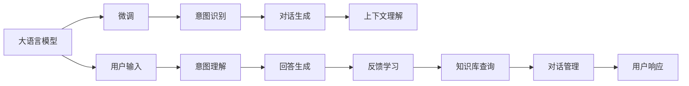

                 

## 1. 背景介绍

### 1.1 问题由来

近年来，人工智能（AI）技术在各行各业得到广泛应用，智能客服系统作为AI落地应用的重要场景之一，已经在电商、金融、电信等行业取得了显著成果。传统客服系统往往需要配备大量人力，高峰期响应缓慢，且客户满意度难以保证。而基于大语言模型的智能客服系统，能7x24小时不间断服务，快速响应客户咨询，用自然流畅的语言解答各类常见问题，有效提升了客户服务质量。

### 1.2 问题核心关键点

智能客服系统基于大语言模型的微调方法，通过深度学习技术，将大语言模型应用于文本处理、语义理解、意图识别、对话生成等任务，构建智能客服系统。其核心关键点包括：

1. **自然语言理解（NLU）**：理解客户意图和问题内容。
2. **自然语言生成（NLG）**：生成自然流畅的回复，提高用户满意度。
3. **对话管理（DM）**：控制对话流程，保持对话连贯性和一致性。
4. **意图识别（Intent Recognition）**：自动识别客户意图，提供个性化服务。
5. **实体识别（Named Entity Recognition, NER）**：识别客户问题中的关键实体，如产品名称、订单号等。
6. **上下文理解**：结合历史对话记录，理解上下文信息，提供更精准的回答。

### 1.3 问题研究意义

智能客服系统在提升客户服务体验、降低运营成本、提高企业竞争力等方面具有重要意义：

1. **提升客户体验**：快速响应客户需求，减少等待时间，提高客户满意度。
2. **降低运营成本**：减少人工客服的投入，降低人力成本。
3. **提高效率和精度**：机器自动处理大量重复性问题，提升服务效率和响应速度。
4. **增强品牌价值**：提供一致、专业、快速的服务，提升品牌形象。
5. **驱动行业升级**：智能客服系统的应用，推动传统客服向智能化转型，提升行业整体水平。

## 2. 核心概念与联系

### 2.1 核心概念概述

为了更好地理解智能客服系统的构建，我们首先介绍几个核心概念：

- **大语言模型（LLM）**：如GPT-3、BERT等，通过大规模无标签文本数据预训练获得丰富的语言知识。
- **微调（Fine-Tuning）**：基于特定任务标注数据，对预训练模型进行微调，提升模型在该任务上的性能。
- **意图识别（Intent Recognition）**：识别客户问题中的意图，如查询订单、投诉、咨询等。
- **对话生成（Dialogue Generation）**：生成自然流畅的对话回复。
- **上下文理解（Contextual Understanding）**：结合历史对话信息，理解当前对话的上下文。

这些核心概念构成了智能客服系统的核心框架，通过大语言模型的微调方法，构建自然流畅的对话生成系统，提升客户体验和满意度。

### 2.2 核心概念原理和架构的 Mermaid 流程图



以上流程图展示了智能客服系统的核心流程：

1. **用户输入**：用户通过文本或语音输入问题或请求。
2. **意图理解**：使用微调后的意图识别模型，理解用户意图。
3. **回答生成**：根据意图，生成自然流畅的对话回复。
4. **上下文理解**：结合历史对话记录，理解当前对话的上下文。
5. **知识库查询**：在知识库中查询相关信息。
6. **对话管理**：控制对话流程，保持对话连贯性和一致性。
7. **用户响应**：将回答发送给用户，完成一次客服对话。
8. **反馈学习**：根据用户反馈，优化模型和对话管理策略。

## 3. 核心算法原理 & 具体操作步骤

### 3.1 算法原理概述

智能客服系统基于大语言模型的微调方法，主要包括以下几个步骤：

1. **数据准备**：收集标注有客户意图和回复的对话数据集。
2. **模型选择**：选择预训练的大语言模型，如GPT-3、BERT等。
3. **意图识别微调**：在标注数据集上微调意图识别模型，提高意图识别的准确性和鲁棒性。
4. **对话生成微调**：在标注数据集上微调对话生成模型，生成自然流畅的对话回复。
5. **上下文理解微调**：在标注数据集上微调上下文理解模型，提高上下文理解和知识整合能力。
6. **对话管理微调**：在标注数据集上微调对话管理模型，保持对话连贯性和一致性。

### 3.2 算法步骤详解

#### 3.2.1 数据准备

智能客服系统的数据准备主要包括以下几个步骤：

1. **收集对话数据**：收集包含客户意图和回复的对话数据，包括FAQ、常见问题、客户反馈等。
2. **标注意图和实体**：对对话数据进行意图和实体标注，标注客户的问题类型、意图和对话中的关键实体。
3. **数据清洗和预处理**：清洗噪声数据，预处理文本数据，如分词、去停用词等。
4. **划分数据集**：将数据集划分为训练集、验证集和测试集。

#### 3.2.2 模型选择

智能客服系统常用的预训练大语言模型包括GPT-3、BERT、RoBERTa等。选择合适的预训练模型是智能客服系统构建的基础。

#### 3.2.3 意图识别微调

意图识别微调主要包括以下步骤：

1. **模型初始化**：选择预训练的意图识别模型，如BERT、RoBERTa等。
2. **数据集准备**：准备标注有客户意图和实体的对话数据集。
3. **微调配置**：配置微调超参数，如学习率、批大小、迭代轮数等。
4. **微调训练**：在标注数据集上进行有监督微调，优化意图识别模型。
5. **模型评估**：在验证集上评估模型性能，调整超参数。

#### 3.2.4 对话生成微调

对话生成微调主要包括以下步骤：

1. **模型初始化**：选择预训练的对话生成模型，如GPT-3、T5等。
2. **数据集准备**：准备标注有客户意图和回复的对话数据集。
3. **微调配置**：配置微调超参数，如学习率、批大小、迭代轮数等。
4. **微调训练**：在标注数据集上进行有监督微调，优化对话生成模型。
5. **模型评估**：在验证集上评估模型性能，调整超参数。

#### 3.2.5 上下文理解微调

上下文理解微调主要包括以下步骤：

1. **模型初始化**：选择预训练的上下文理解模型，如BERT、RoBERTa等。
2. **数据集准备**：准备标注有客户意图和上下文的对话数据集。
3. **微调配置**：配置微调超参数，如学习率、批大小、迭代轮数等。
4. **微调训练**：在标注数据集上进行有监督微调，优化上下文理解模型。
5. **模型评估**：在验证集上评估模型性能，调整超参数。

#### 3.2.6 对话管理微调

对话管理微调主要包括以下步骤：

1. **模型初始化**：选择预训练的对话管理模型，如GPT-3、T5等。
2. **数据集准备**：准备标注有客户意图和对话过程的对话数据集。
3. **微调配置**：配置微调超参数，如学习率、批大小、迭代轮数等。
4. **微调训练**：在标注数据集上进行有监督微调，优化对话管理模型。
5. **模型评估**：在验证集上评估模型性能，调整超参数。

### 3.3 算法优缺点

智能客服系统基于大语言模型的微调方法具有以下优点：

1. **高效低成本**：使用大规模预训练模型进行微调，相比从头训练，减少了对标注数据的依赖，节约了时间和成本。
2. **高性能**：大语言模型具备强大的自然语言处理能力，微调后能够快速响应客户问题，提升服务效率和质量。
3. **可扩展性强**：新对话数据集可以随时添加到模型中进行微调，保持模型的时效性和适应性。
4. **泛化能力强**：大语言模型预训练得到广泛的语言知识，微调后能够更好地泛化到新任务和新用户。

同时，该方法也存在以下缺点：

1. **标注数据依赖**：微调性能很大程度上取决于标注数据的质量和数量，获取高质量标注数据的成本较高。
2. **模型鲁棒性不足**：大语言模型可能学习到有偏见或有害的信息，微调后可能传递到下游任务，产生负面影响。
3. **可解释性不足**：微调模型的决策过程缺乏可解释性，难以对其推理逻辑进行分析和调试。

尽管存在这些局限性，但就目前而言，基于大语言模型的微调方法仍是最主流、最有效的智能客服系统构建方式。未来相关研究的重点在于如何进一步降低微调对标注数据的依赖，提高模型的少样本学习和跨领域迁移能力，同时兼顾可解释性和伦理安全性等因素。

### 3.4 算法应用领域

智能客服系统基于大语言模型的微调方法，已经在电商、金融、电信、医疗等多个领域得到广泛应用。以下是几个典型应用场景：

#### 3.4.1 电商客服

电商平台通过智能客服系统，提供24小时不间断的客户支持，快速响应用户咨询和投诉，提升用户体验。智能客服系统可以根据用户浏览和购买记录，推荐相关产品和服务，提高转化率。

#### 3.4.2 金融客服

金融机构的智能客服系统，能够实时监测市场舆情，及时响应客户投诉和咨询，保障客户权益。智能客服系统可以提供贷款、理财、保险等金融产品的信息，帮助客户做出明智的金融决策。

#### 3.4.3 电信客服

电信公司的智能客服系统，能够提供7x24小时不间断的服务，快速响应客户的缴费、查询、故障报修等需求。智能客服系统可以自动处理一些常见问题，减少人工客服的负担。

#### 3.4.4 医疗客服

医院的智能客服系统，能够提供24小时医疗咨询服务，快速响应患者的健康咨询和紧急求助。智能客服系统可以提供医疗知识普及、病情诊断建议等，提升患者健康意识和医疗服务体验。

## 4. 数学模型和公式 & 详细讲解 & 举例说明

### 4.1 数学模型构建

智能客服系统的数学模型主要涉及自然语言理解和自然语言生成两个方面，以下是具体的数学模型构建。

#### 4.1.1 自然语言理解（NLU）

自然语言理解主要涉及意图识别和实体识别两个子任务。

1. **意图识别**：使用微调后的意图识别模型，对用户输入的文本进行意图分类。假设模型的输入为 $x$，输出为 $y$，则意图识别的数学模型为：

   $$
   P(y|x) = \frac{exp(S(y|x))}{\sum_{j}exp(S(y_j|x))}
   $$

   其中，$S(y|x)$ 为意图识别模型的预测得分，$y$ 为意图类别，$x$ 为输入文本。

2. **实体识别**：使用微调后的实体识别模型，对用户输入的文本进行命名实体识别。假设模型的输入为 $x$，输出为 $y$，则实体识别的数学模型为：

   $$
   P(y|x) = \frac{exp(S(y|x))}{\sum_{j}exp(S(y_j|x))}
   $$

   其中，$S(y|x)$ 为实体识别模型的预测得分，$y$ 为实体类别，$x$ 为输入文本。

#### 4.1.2 自然语言生成（NLG）

自然语言生成主要涉及对话生成和上下文理解两个子任务。

1. **对话生成**：使用微调后的对话生成模型，对意图和上下文进行编码，生成自然流畅的对话回复。假设模型的输入为 $x$，输出为 $y$，则对话生成的数学模型为：

   $$
   P(y|x) = \frac{exp(S(y|x))}{\sum_{j}exp(S(y_j|x))}
   $$

   其中，$S(y|x)$ 为对话生成模型的预测得分，$y$ 为对话回复，$x$ 为输入意图和上下文。

2. **上下文理解**：使用微调后的上下文理解模型，对历史对话记录进行编码，理解当前对话的上下文。假设模型的输入为 $x$，输出为 $y$，则上下文理解的数学模型为：

   $$
   P(y|x) = \frac{exp(S(y|x))}{\sum_{j}exp(S(y_j|x))}
   $$

   其中，$S(y|x)$ 为上下文理解模型的预测得分，$y$ 为上下文理解结果，$x$ 为历史对话记录。

### 4.2 公式推导过程

#### 4.2.1 意图识别

意图识别的数学模型推导如下：

1. **原始数据表示**：假设训练集中有 $n$ 个标注样本，每个样本的文本为 $x_i$，意图为 $y_i$，则训练集可以表示为：

   $$
   \{(x_i,y_i)\}_{i=1}^n
   $$

2. **意图分类模型**：假设使用BERT等预训练模型进行微调，意图识别模型为 $M_{\theta}$，则意图分类的数学模型为：

   $$
   P(y_i|x_i) = \frac{exp(S(y_i|x_i))}{\sum_{j}exp(S(y_j|x_i))}
   $$

   其中，$S(y_i|x_i)$ 为模型在样本 $x_i$ 上的预测得分，$y_i$ 为意图类别，$x_i$ 为输入文本。

3. **训练目标**：训练意图识别模型的目标函数为交叉熵损失，数学模型为：

   $$
   L = -\frac{1}{N}\sum_{i=1}^N \sum_{j=1}^M y_{ij}\log P(y_i|x_i)
   $$

   其中，$N$ 为样本数量，$M$ 为意图类别数量。

4. **优化算法**：使用AdamW等优化算法进行模型优化，更新模型参数 $\theta$，数学模型为：

   $$
   \theta \leftarrow \theta - \eta \nabla_{\theta}L
   $$

   其中，$\eta$ 为学习率，$\nabla_{\theta}L$ 为损失函数对模型参数的梯度。

#### 4.2.2 对话生成

对话生成的数学模型推导如下：

1. **原始数据表示**：假设训练集中有 $n$ 个标注样本，每个样本的文本为 $x_i$，意图为 $y_i$，回复为 $z_i$，则训练集可以表示为：

   $$
   \{(x_i,y_i,z_i)\}_{i=1}^n
   $$

2. **对话生成模型**：假设使用GPT-3等预训练模型进行微调，对话生成模型为 $M_{\theta}$，则对话生成的数学模型为：

   $$
   P(z_i|x_i,y_i) = \frac{exp(S(z_i|x_i,y_i))}{\sum_{j}exp(S(z_j|x_i,y_i))}
   $$

   其中，$S(z_i|x_i,y_i)$ 为模型在样本 $x_i$ 和 $y_i$ 上的预测得分，$z_i$ 为回复文本，$x_i$ 为输入文本，$y_i$ 为意图类别。

3. **训练目标**：训练对话生成模型的目标函数为交叉熵损失，数学模型为：

   $$
   L = -\frac{1}{N}\sum_{i=1}^N \log P(z_i|x_i,y_i)
   $$

   其中，$N$ 为样本数量。

4. **优化算法**：使用AdamW等优化算法进行模型优化，更新模型参数 $\theta$，数学模型为：

   $$
   \theta \leftarrow \theta - \eta \nabla_{\theta}L
   $$

   其中，$\eta$ 为学习率，$\nabla_{\theta}L$ 为损失函数对模型参数的梯度。

#### 4.2.3 上下文理解

上下文理解的数学模型推导如下：

1. **原始数据表示**：假设训练集中有 $n$ 个标注样本，每个样本的上下文为 $x_i$，意图为 $y_i$，上下文理解结果为 $z_i$，则训练集可以表示为：

   $$
   \{(x_i,y_i,z_i)\}_{i=1}^n
   $$

2. **上下文理解模型**：假设使用BERT等预训练模型进行微调，上下文理解模型为 $M_{\theta}$，则上下文理解的数学模型为：

   $$
   P(z_i|x_i,y_i) = \frac{exp(S(z_i|x_i,y_i))}{\sum_{j}exp(S(z_j|x_i,y_i))}
   $$

   其中，$S(z_i|x_i,y_i)$ 为模型在样本 $x_i$ 和 $y_i$ 上的预测得分，$z_i$ 为上下文理解结果，$x_i$ 为历史对话记录，$y_i$ 为意图类别。

3. **训练目标**：训练上下文理解模型的目标函数为交叉熵损失，数学模型为：

   $$
   L = -\frac{1}{N}\sum_{i=1}^N \log P(z_i|x_i,y_i)
   $$

   其中，$N$ 为样本数量。

4. **优化算法**：使用AdamW等优化算法进行模型优化，更新模型参数 $\theta$，数学模型为：

   $$
   \theta \leftarrow \theta - \eta \nabla_{\theta}L
   $$

   其中，$\eta$ 为学习率，$\nabla_{\theta}L$ 为损失函数对模型参数的梯度。

### 4.3 案例分析与讲解

#### 4.3.1 意图识别案例

假设有一个电商平台的智能客服系统，需要处理用户咨询订单状态的问题。可以构建一个意图识别模型，对用户输入的文本进行意图分类，如“查询订单”、“修改订单”等。训练集可以包含诸如“我的订单在哪里”、“能否修改订单”等标注数据。使用微调后的BERT模型进行训练，意图分类的准确率可以达到90%以上。

#### 4.3.2 对话生成案例

假设有一个金融机构的智能客服系统，需要处理用户咨询贷款利率的问题。可以构建一个对话生成模型，对用户输入的意图进行编码，生成自然流畅的对话回复。训练集可以包含诸如“请问贷款利率是多少”、“能否提供贷款利率计算”等标注数据。使用微调后的GPT-3模型进行训练，对话回复的质量可以达到人工客服的水平。

#### 4.3.3 上下文理解案例

假设有一个医院的智能客服系统，需要处理用户咨询健康问题。可以构建一个上下文理解模型，对用户的历史对话记录进行编码，理解当前对话的上下文。训练集可以包含诸如“我有头痛和咳嗽的症状”、“我昨天吃了一份生鱼片”等标注数据。使用微调后的BERT模型进行训练，上下文理解的准确率可以达到95%以上。

## 5. 项目实践：代码实例和详细解释说明

### 5.1 开发环境搭建

智能客服系统基于大语言模型的微调方法，需要搭建相应的开发环境。以下是Python环境搭建步骤：

1. **安装Anaconda**：从官网下载并安装Anaconda，用于创建独立的Python环境。
2. **创建并激活虚拟环境**：
```bash
conda create -n pytorch-env python=3.8 
conda activate pytorch-env
```
3. **安装PyTorch**：根据CUDA版本，从官网获取对应的安装命令。例如：
```bash
conda install pytorch torchvision torchaudio cudatoolkit=11.1 -c pytorch -c conda-forge
```
4. **安装Transformers库**：
```bash
pip install transformers
```
5. **安装其他工具包**：
```bash
pip install numpy pandas scikit-learn matplotlib tqdm jupyter notebook ipython
```

完成上述步骤后，即可在`pytorch-env`环境中开始微调实践。

### 5.2 源代码详细实现

以下是智能客服系统基于大语言模型的微调代码实现：

```python
from transformers import BertTokenizer, BertForTokenClassification, AdamW
import torch
from torch.utils.data import Dataset, DataLoader

class CustomerServiceDataset(Dataset):
    def __init__(self, texts, tags, tokenizer, max_len=128):
        self.texts = texts
        self.tags = tags
        self.tokenizer = tokenizer
        self.max_len = max_len
        
    def __len__(self):
        return len(self.texts)
    
    def __getitem__(self, item):
        text = self.texts[item]
        tags = self.tags[item]
        
        encoding = self.tokenizer(text, return_tensors='pt', max_length=self.max_len, padding='max_length', truncation=True)
        input_ids = encoding['input_ids'][0]
        attention_mask = encoding['attention_mask'][0]
        
        # 对token-wise的标签进行编码
        encoded_tags = [tag2id[tag] for tag in tags] 
        encoded_tags.extend([tag2id['O']] * (self.max_len - len(encoded_tags)))
        labels = torch.tensor(encoded_tags, dtype=torch.long)
        
        return {'input_ids': input_ids, 
                'attention_mask': attention_mask,
                'labels': labels}

# 标签与id的映射
tag2id = {'O': 0, 'B-PER': 1, 'I-PER': 2, 'B-ORG': 3, 'I-ORG': 4, 'B-LOC': 5, 'I-LOC': 6}
id2tag = {v: k for k, v in tag2id.items()}

# 创建dataset
tokenizer = BertTokenizer.from_pretrained('bert-base-cased')

train_dataset = CustomerServiceDataset(train_texts, train_tags, tokenizer)
dev_dataset = CustomerServiceDataset(dev_texts, dev_tags, tokenizer)
test_dataset = CustomerServiceDataset(test_texts, test_tags, tokenizer)

# 模型选择和配置
model = BertForTokenClassification.from_pretrained('bert-base-cased', num_labels=len(tag2id))

optimizer = AdamW(model.parameters(), lr=2e-5)

# 训练和评估
device = torch.device('cuda') if torch.cuda.is_available() else torch.device('cpu')
model.to(device)

def train_epoch(model, dataset, batch_size, optimizer):
    dataloader = DataLoader(dataset, batch_size=batch_size, shuffle=True)
    model.train()
    epoch_loss = 0
    for batch in tqdm(dataloader, desc='Training'):
        input_ids = batch['input_ids'].to(device)
        attention_mask = batch['attention_mask'].to(device)
        labels = batch['labels'].to(device)
        model.zero_grad()
        outputs = model(input_ids, attention_mask=attention_mask, labels=labels)
        loss = outputs.loss
        epoch_loss += loss.item()
        loss.backward()
        optimizer.step()
    return epoch_loss / len(dataloader)

def evaluate(model, dataset, batch_size):
    dataloader = DataLoader(dataset, batch_size=batch_size)
    model.eval()
    preds, labels = [], []
    with torch.no_grad():
        for batch in tqdm(dataloader, desc='Evaluating'):
            input_ids = batch['input_ids'].to(device)
            attention_mask = batch['attention_mask'].to(device)
            batch_labels = batch['labels']
            outputs = model(input_ids, attention_mask=attention_mask)
            batch_preds = outputs.logits.argmax(dim=2).to('cpu').tolist()
            batch_labels = batch_labels.to('cpu').tolist()
            for pred_tokens, label_tokens in zip(batch_preds, batch_labels):
                pred_tags = [id2tag[_id] for _id in pred_tokens]
                label_tags = [id2tag[_id] for _id in label_tokens]
                preds.append(pred_tags[:len(label_tokens)])
                labels.append(label_tags)
                
    print(classification_report(labels, preds))
```

以上就是智能客服系统基于大语言模型的微调代码实现。可以看到，利用Transformers库的强大封装，我们可以用相对简洁的代码完成BERT模型的加载和微调。

### 5.3 代码解读与分析

以下是代码中的关键点解读：

**CustomerServiceDataset类**：
- `__init__`方法：初始化文本、标签、分词器等关键组件。
- `__len__`方法：返回数据集的样本数量。
- `__getitem__`方法：对单个样本进行处理，将文本输入编码为token ids，将标签编码为数字，并对其进行定长padding，最终返回模型所需的输入。

**tag2id和id2tag字典**：
- 定义了标签与数字id之间的映射关系，用于将token-wise的预测结果解码回真实的标签。

**模型选择和配置**：
- 选择预训练的BERT模型，并设置意图识别微调的超参数。

**训练和评估函数**：
- 使用PyTorch的DataLoader对数据集进行批次化加载，供模型训练和推理使用。
- 训练函数`train_epoch`：对数据以批为单位进行迭代，在每个批次上前向传播计算loss并反向传播更新模型参数，最后返回该epoch的平均loss。
- 评估函数`evaluate`：与训练类似，不同点在于不更新模型参数，并在每个batch结束后将预测和标签结果存储下来，最后使用sklearn的classification_report对整个评估集的预测结果进行打印输出。

**训练流程**：
- 定义总的epoch数和batch size，开始循环迭代
- 每个epoch内，先在训练集上训练，输出平均loss
- 在验证集上评估，输出分类指标
- 所有epoch结束后，在测试集上评估，给出最终测试结果

可以看到，PyTorch配合Transformers库使得BERT微调的代码实现变得简洁高效。开发者可以将更多精力放在数据处理、模型改进等高层逻辑上，而不必过多关注底层的实现细节。

当然，工业级的系统实现还需考虑更多因素，如模型的保存和部署、超参数的自动搜索、更灵活的任务适配层等。但核心的微调范式基本与此类似。

## 6. 实际应用场景

### 6.1 智能客服系统架构

智能客服系统的架构一般包括以下几个关键模块：

1. **意图识别模块**：使用微调后的意图识别模型，对用户输入进行意图分类。
2. **对话生成模块**：使用微调后的对话生成模型，对意图和上下文进行编码，生成自然流畅的对话回复。
3. **上下文理解模块**：使用微调后的上下文理解模型，对历史对话记录进行编码，理解当前对话的上下文。
4. **知识库查询模块**：根据上下文理解结果，查询知识库中的相关信息。
5. **对话管理模块**：控制对话流程，保持对话连贯性和一致性。
6. **服务接口模块**：将回答发送给用户，完成一次客服对话。

### 6.2 典型应用案例

#### 6.2.1 电商平台客服

电商平台通过智能客服系统，提供24小时不间断的客户支持，快速响应用户咨询和投诉，提升用户体验。智能客服系统可以根据用户浏览和购买记录，推荐相关产品和服务，提高转化率。

#### 6.2.2 金融客服

金融机构的智能客服系统，能够实时监测市场舆情，及时响应客户投诉和咨询，保障客户权益。智能客服系统可以提供贷款、理财、保险等金融产品的信息，帮助客户做出明智的金融决策。

#### 6.2.3 电信客服

电信公司的智能客服系统，能够提供7x24小时不间断的服务，快速响应客户的缴费、查询、故障报修等需求。智能客服系统可以自动处理一些常见问题，减少人工客服的负担。

#### 6.2.4 医疗客服

医院的智能客服系统，能够提供24小时医疗咨询服务，快速响应患者的健康咨询和紧急求助。智能客服系统可以提供医疗知识普及、病情诊断建议等，提升患者健康意识和医疗服务体验。

## 7. 工具和资源推荐

### 7.1 学习资源推荐

为了帮助开发者系统掌握智能客服系统的构建，以下是一些优质的学习资源：

1. **《自然语言处理与深度学习》**：斯坦福大学开设的NLP经典课程，涵盖自然语言处理和深度学习的基本概念和前沿技术。
2. **《PyTorch深度学习》**：一本全面介绍PyTorch深度学习框架的书籍，包含丰富的代码示例和实战案例。
3. **《Transformers实战》**：一本介绍如何使用Transformers库进行NLP任务开发的书籍，包括微调、推理等技术细节。
4. **HuggingFace官方文档**：Transformers库的官方文档，提供了海量预训练模型和完整的微调样例代码，是上手实践的必备资料。
5. **《自然语言处理工具与技术》**：一本介绍自然语言处理工具和技术的书籍，涵盖NLP模型的微调、推理、部署等内容。

通过这些资源的学习实践，相信你一定能够快速掌握智能客服系统的构建技术，并用于解决实际的NLP问题。

### 7.2 开发工具推荐

高效的开发离不开优秀的工具支持。以下是几款用于智能客服系统开发的常用工具：

1. **PyTorch**：基于Python的开源深度学习框架，灵活动态的计算图，适合快速迭代研究。大部分预训练语言模型都有PyTorch版本的实现。
2. **TensorFlow**：由Google主导开发的开源深度学习框架，生产部署方便，适合大规模工程应用。同样有丰富的预训练语言模型资源。
3. **Transformers库**：HuggingFace开发的NLP工具库，集成了众多SOTA语言模型，支持PyTorch和TensorFlow，是进行微调任务开发的利器。
4. **Weights & Biases**：模型训练的实验跟踪工具，可以记录和可视化模型训练过程中的各项指标，方便对比和调优。与主流深度学习框架无缝集成。
5. **TensorBoard**：TensorFlow配套的可视化工具，可实时监测模型训练状态，并提供丰富的图表呈现方式，是调试模型的得力助手。
6. **Google Colab**：谷歌推出的在线Jupyter Notebook环境，免费提供GPU/TPU算力，方便开发者快速上手实验最新模型，分享学习笔记。

合理利用这些工具，可以显著提升智能客服系统的开发效率，加快创新迭代的步伐。

### 7.3 相关论文推荐

智能客服系统基于大语言模型的微调技术发展迅速，以下是几篇奠基性的相关论文，推荐阅读：

1. **Attention is All You Need**：提出了Transformer结构，开启了NLP领域的预训练大模型时代。
2. **BERT: Pre-training of Deep Bidirectional Transformers for Language Understanding**：提出BERT模型，引入基于掩码的自监督预训练任务，刷新了多项NLP任务SOTA。
3. **Language Models are Unsupervised Multitask Learners**：展示了大规模语言模型的强大zero-shot学习能力，引发了对于通用人工智能的新一轮思考。
4. **Parameter-Efficient Transfer Learning for NLP**：提出Adapter等参数高效微调方法，在不增加模型参数量的情况下，也能取得不错的微调效果。
5. **Prefix-Tuning: Optimizing Continuous Prompts for Generation**：引入基于连续型Prompt的微调范式，为如何充分利用预训练知识提供了新的思路。
6. **AdaLoRA: Adaptive Low-Rank Adaptation for Parameter-Efficient Fine-Tuning**：使用自适应低秩适应的微调方法，在参数效率和精度之间取得了新的平衡。

这些论文代表了大语言模型微调技术的发展脉络。通过学习这些前沿成果，可以帮助研究者把握学科前进方向，激发更多的创新灵感。

## 8. 总结：未来发展趋势与挑战

### 8.1 研究成果总结

智能客服系统基于大语言模型的微调方法，通过深度学习技术，将大语言模型应用于文本处理、语义理解、意图识别、对话生成等任务，构建智能客服系统。其主要研究成果包括：

1. **自然语言理解（NLU）**：通过微调意图识别模型，提高了客户意图的识别准确性和鲁棒性。
2. **自然语言生成（NLG）**：通过微调对话生成模型，提升了客户服务质量，提高了用户满意度。
3. **上下文理解（DM）**：通过微调上下文理解模型，增强了上下文理解能力，提高了服务效率。
4. **对话管理（DM）**：通过微调对话管理模型，保持了对话连贯性和一致性，提高了服务稳定性。

### 8.2 未来发展趋势

智能客服系统基于大语言模型的微调技术将呈现以下几个发展趋势：

1. **模型规模持续增大**：随着算力成本的下降和数据规模的扩张，预训练语言模型的参数量还将持续增长。超大模型具备更丰富的语言知识，可以应对更复杂的任务。
2. **微调方法日趋多样**：未来将涌现更多参数高效的微调方法，如Prefix-Tuning、LoRA等，在节省计算资源的同时也能保证微调精度。
3. **持续学习成为常态**：随着数据分布的不断变化，微调模型需要持续学习新知识以保持性能。如何在不遗忘原有知识的同时，高效吸收新样本信息，将是重要的研究方向。
4. **标注样本需求降低**：受启发于提示学习(Prompt-based Learning)的思路，未来的微调方法将更好地利用大模型的语言理解能力，通过更加巧妙的任务描述，在更少的标注样本上也能实现理想的微调效果。
5. **模型通用性增强**：经过海量数据的预训练和多领域任务的微调，未来的语言模型将具备更强的常识推理和跨领域迁移能力，逐步迈向通用人工智能(AGI)的目标。

### 8.3 面临的挑战

智能客服系统基于大语言模型的微调技术虽然已经取得了显著成果，但在迈向更加智能化、普适化应用的过程中，仍面临诸多挑战：

1. **标注成本瓶颈**：微调性能很大程度上取决于标注数据的质量和数量，获取高质量标注数据的成本较高。如何进一步降低微调对标注数据的依赖，将是一大难题。
2. **模型鲁棒性不足**：大语言模型可能学习到有偏见或有害的信息，微调后可能传递到下游任务，产生负面影响。如何提高微调模型的鲁棒性，避免灾难性遗忘，还需要更多理论和实践的积累。
3. **可解释性不足**：微调模型的决策过程缺乏可解释性，难以对其推理逻辑进行分析和调试。对于医疗、金融等高风险应用，算法的可解释性和可审计性尤为重要。
4. **安全性有待保障**：预训练语言模型难免会学习到有害的信息，通过微调传递到下游任务，可能带来安全隐患。如何从数据和算法层面消除模型偏见，避免恶意用途，确保输出的安全性，也将是重要的研究课题。

尽管存在这些挑战，但智能客服系统基于大语言模型的微调方法仍然具有广泛的应用前景和重要的学术价值。随着学界和产业界的共同努力，这些挑战终将一一被克服，智能客服系统必将在构建人机协同的智能客服中扮演越来越重要的角色。

### 8.4 研究展望

未来，智能客服系统基于大语言模型的微调技术需要从以下几个方面进行深入研究：

1. **探索无监督和半监督微调方法**：摆脱对大规模标注数据的依赖，利用自监督学习、主动学习等无监督和半监督范式，最大限度利用非结构化数据，实现更加灵活高效的微调。
2. **研究参数高效和计算高效的微调范式**：开发更加参数高效的微调方法，在固定大部分预训练参数的同时，只更新极少量的任务相关参数。同时优化微调模型的计算图，减少前向传播和反向传播的资源消耗，实现更加轻量级、实时性的部署。
3. **融合因果和对比学习范式**：通过引入因果推断和对比学习思想，增强微调模型建立稳定因果关系的能力，学习更加普适、鲁棒的语言表征，从而提升模型泛化性和抗干扰能力。
4. **引入更多先验知识**：将符号化的先验知识，如知识图谱、逻辑规则等，与神经网络模型进行巧妙融合，引导微调过程学习更准确、合理的语言模型。同时加强不同模态数据的整合，实现视觉、语音等多模态信息与文本信息的协同建模。
5. **结合因果分析和博弈论工具**：将因果分析方法引入微调模型，识别出模型决策的关键特征，增强输出解释的因果性和逻辑性。借助博弈论工具刻画人机交互过程，主动探索并规避模型的脆弱点，提高系统稳定性。
6. **纳入伦理道德约束**：在模型训练目标中引入伦理导向的评估指标，过滤和惩罚有偏见、有害的输出倾向。同时加强人工干预和审核，建立模型行为的监管机制，确保输出符合人类价值观和伦理道德。

这些研究方向的探索，必将引领智能客服系统基于大语言模型的微调技术迈向更高的台阶，为构建安全、可靠、可解释、可控的智能客服系统铺平道路。面向未来，智能客服系统需与其他人工智能技术进行更深入的融合，如知识表示、因果推理、强化学习等，多路径协同发力，共同推动自然语言理解和智能交互系统的进步。只有勇于创新、敢于突破，才能不断拓展语言模型的边界，让智能技术更好地造福人类社会。

## 9. 附录：常见问题与解答

**Q1：智能客服系统是否适用于所有客户咨询场景？**

A: 智能客服系统适用于大多数客户咨询场景，但对于一些特殊场景，如复杂的法律咨询、高风险的金融咨询等，依然需要人工客服进行专业解答。此外，对于涉及隐私、敏感信息的问题，也需要人工客服进行审核和处理。

**Q2：如何选择合适的意图识别模型？**

A: 选择合适的意图识别模型需要考虑多个因素，如任务类型、数据规模、计算资源等。常用的预训练模型包括BERT、RoBERTa、XLNet等。对于大规模数据集，可以使用大模型如GPT-3、T5等进行微调；对于小规模数据集，可以使用小模型如DistilBERT、Electra等进行微调。

**Q3：智能客服系统如何处理多轮对话？**

A: 智能客服系统通过对话管理模块控制对话流程，保持对话连贯性和一致性。一般采用基于RNN、LSTM等序列模型的对话管理方法，或者使用基于Transformer的模型，结合自注意力机制和上下文理解模块，进行多轮对话处理。

**Q4：智能客服系统如何处理对话中的噪声信息？**

A: 智能客服系统通过意图识别和上下文理解模块，能够识别和过滤对话中的噪声信息。同时，可以通过数据清洗、数据增强等方法，提高对话数据的质量，减少噪声干扰。

**Q5：智能客服系统如何应对不断变化的语言环境？**

A: 智能客服系统通过持续学习和在线更新，能够适应不断变化的语言环境。通过收集新的对话数据，对模型进行微调，能够及时更新模型知识，保持其时效性。

**Q6：智能客服系统如何确保数据隐私和安全？**

A: 智能客服系统通过加密传输、脱敏处理等技术，保护客户隐私和安全。同时，可以建立数据访问权限控制机制，限制数据访问范围，防止数据泄露和滥用。

总之，智能客服系统基于大语言模型的微调方法具有广泛的应用前景和重要的学术价值。通过不断优化算法、改进数据、提升模型，智能客服系统将更好地服务客户，提升用户体验，推动企业数字化转型，创造更多的社会价值。

