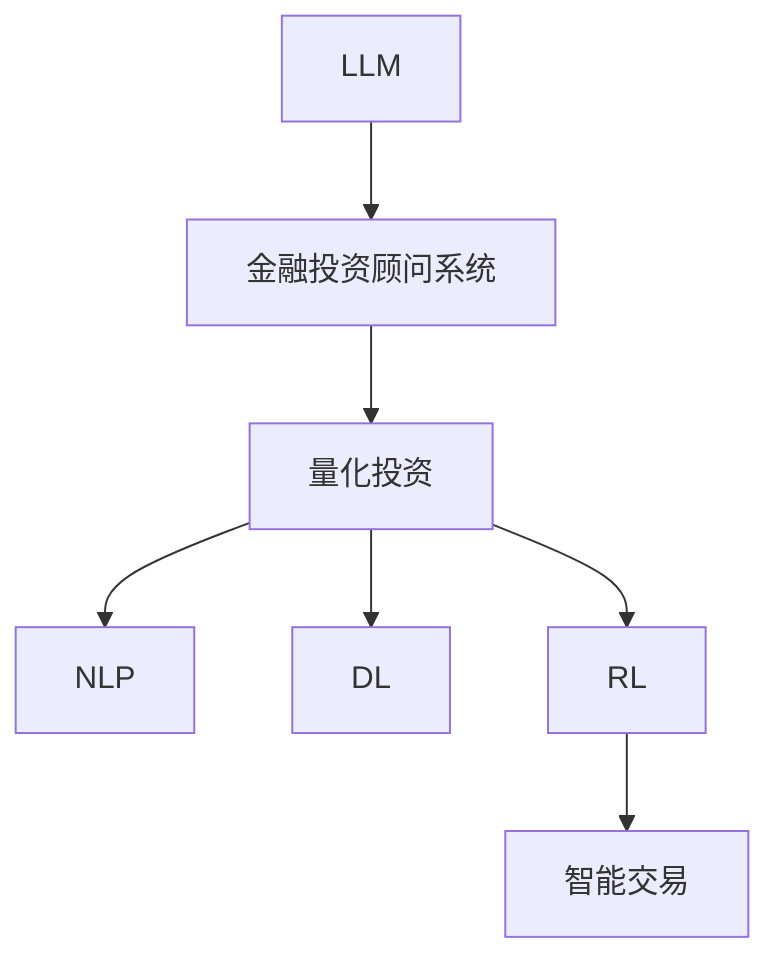

                 

## 1. 背景介绍

### 1.1 问题由来

在金融投资领域，投资顾问系统作为重要的辅助工具，通过提供个性化的投资建议和市场分析，帮助投资者做出更明智的投资决策。然而，传统的投资顾问系统依赖于人工经验和规则，存在主观性强、覆盖面窄、适应性差等问题。近年来，人工智能技术，特别是大语言模型（Large Language Models, LLMs），在金融领域的探索应用逐渐增多，展示出了强大的潜力。

### 1.2 问题核心关键点

LLM在智能投资顾问系统中的应用，核心在于其强大的自然语言理解和生成能力。通过学习海量财经资讯和历史交易数据，LLM能够理解复杂的市场动态，生成有价值的投资建议，甚至直接参与交易决策。这种基于自然语言处理的智能化投资顾问系统，能够降低人工成本，提升决策效率和质量，并能够在数据驱动的基础上持续学习进化，适应市场变化。

### 1.3 问题研究意义

研究LLM在智能投资顾问系统中的应用前景，对于拓展金融AI技术的应用边界，提升投资顾问系统的智能化水平，加速金融行业的数字化转型，具有重要意义：

1. **降低顾问成本**：LLM能自动生成投资建议，减少人工顾问的劳动强度。
2. **提升决策质量**：LLM融合大量市场数据，提供更准确、全面的投资分析。
3. **增强市场适应性**：LLM能够实时学习新数据，快速调整投资策略。
4. **促进行业升级**：LLM驱动的智能顾问系统能够为更多投资者提供优质服务，推动行业健康发展。

## 2. 核心概念与联系

### 2.1 核心概念概述

为更好地理解LLM在智能投资顾问系统中的应用，本节将介绍几个密切相关的核心概念：

- **大语言模型（LLM）**：基于自回归或自编码结构训练的大型语言模型，如GPT系列、BERT等，具备强大的自然语言理解和生成能力。
- **金融投资顾问系统**：提供个性化投资建议，帮助投资者进行资产配置和交易决策的系统。
- **量化投资**：基于数学模型和算法，通过数据分析和计算实现交易策略的投资方式。
- **自然语言处理（NLP）**：研究计算机如何处理、理解、生成人类语言的技术，LLM是NLP领域的最新进展。
- **深度学习（DL）**：一种基于神经网络的机器学习方法，LLM作为DL的代表性成果，在金融领域展现了广阔应用前景。
- **强化学习（RL）**：通过试错学习，使系统在不断交互中优化决策策略，与LLM结合可以提升交易系统的智能性。

这些核心概念之间的逻辑关系可以通过以下Mermaid流程图来展示：



这个流程图展示了LLM的核心概念及其之间的关系：

1. LLM通过预训练获得基础能力。
2. 金融投资顾问系统利用LLM进行个性化投资建议。
3. 量化投资、NLP、DL、RL等技术相互融合，支持LLM在金融领域的具体应用。
4. 智能交易系统通过LLM实现更智能、高效的交易策略。

## 3. 核心算法原理 & 具体操作步骤
### 3.1 算法原理概述

LLM在智能投资顾问系统中的应用，本质上是利用自然语言处理技术，将市场信息转换为计算机可理解的格式，通过深度学习模型进行分析和推理，生成投资建议。具体步骤如下：

1. **数据采集与预处理**：收集财经资讯、市场行情、历史交易数据等，并进行数据清洗、格式转换等预处理。
2. **模型训练**：使用预训练的LLM模型作为初始化参数，加载大量金融领域的标注数据进行微调，训练得到投资建议生成模型。
3. **投资建议生成**：将最新的市场数据输入LLM模型，通过前向传播生成投资建议。
4. **策略优化**：结合历史交易数据和市场动态，使用强化学习等技术对策略进行优化调整。

### 3.2 算法步骤详解

#### 步骤1：数据采集与预处理

- **数据来源**：收集财经新闻、股票行情、行业报告、公司财报等。
- **数据格式转换**：将各种数据格式转换为统一的可输入LLM的文本格式。
- **数据清洗**：去除无关数据、处理缺失值、归一化处理等。
- **数据增强**：通过数据合成、样本重采样的方式扩充训练集，提高模型泛化能力。

#### 步骤2：模型训练

- **选择预训练模型**：选取如GPT-3、BERT等预训练模型，加载其参数和架构。
- **微调设置**：选择合适的微调超参数，如学习率、批大小、迭代轮数等。
- **标注数据准备**：标注好金融领域相关数据，包括新闻、交易记录、市场分析等。
- **微调训练**：使用微调框架对模型进行训练，如PyTorch、TensorFlow等。
- **验证与调优**：在验证集上评估模型性能，调整模型参数，直至满足预设的性能指标。

#### 步骤3：投资建议生成

- **输入数据处理**：将最新的市场数据（如股票行情、行业动态）转换为LLM可处理格式。
- **前向传播**：将处理后的数据输入LLM模型，通过前向传播得到投资建议。
- **输出解析**：将LLM生成的建议解析为具体的投资决策，如买入、卖出、持仓等。

#### 步骤4：策略优化

- **历史数据分析**：使用强化学习技术，分析历史交易数据，提取最优策略。
- **策略更新**：根据最新市场数据，动态更新投资策略，优化投资建议。
- **实时监测**：实时监控市场动态，调整投资策略，确保策略的有效性。

### 3.3 算法优缺点

#### 优点

1. **自动化决策**：LLM能够自动生成投资建议，减少人工干预，提高决策效率。
2. **全视角分析**：LLM融合多领域数据，提供全面的市场分析和预测。
3. **灵活调整**：LLM能够实时学习新数据，动态调整策略，适应市场变化。
4. **跨领域融合**：LLM可以与量化投资、强化学习等技术结合，提升系统智能化水平。

#### 缺点

1. **数据依赖性高**：LLM的表现很大程度上依赖于训练数据的质量，需要高质量的财经数据支撑。
2. **模型复杂度高**：LLM参数量庞大，训练和推理资源需求高。
3. **鲁棒性不足**：LLM对数据偏差和噪声较为敏感，容易产生错误建议。
4. **解释性不足**：LLM生成的决策过程复杂，难以解释其内部工作机制。

### 3.4 算法应用领域

LLM在智能投资顾问系统中的应用，主要体现在以下几个方面：

1. **市场分析**：LLM通过分析财经新闻、行业报告等，生成市场分析和预测报告。
2. **投资建议**：根据市场动态和用户偏好，LLM提供个性化的投资建议，帮助用户做出决策。
3. **风险管理**：LLM通过识别市场风险，提供风险评估和预警。
4. **量化交易**：LLM辅助量化交易系统，生成交易信号，自动执行交易策略。
5. **客户服务**：LLM提供智能客服，解答用户疑问，优化用户体验。

## 4. 数学模型和公式 & 详细讲解 & 举例说明

### 4.1 数学模型构建

假设LLM模型为$f_\theta: \mathcal{X} \rightarrow \mathcal{Y}$，其中$\mathcal{X}$为输入空间，$\mathcal{Y}$为输出空间，$\theta$为模型参数。定义输入数据为$x_i \in \mathcal{X}$，输出数据为$y_i \in \mathcal{Y}$，则模型的训练目标为：

$$
\min_{\theta} \sum_{i=1}^N \ell(f_\theta(x_i), y_i)
$$

其中$\ell$为损失函数，通常为交叉熵损失。在金融投资领域，$x_i$可以是股票行情、市场动态等文本数据，$y_i$为投资建议（买入、卖出、持仓等）。

### 4.2 公式推导过程

假设$f_\theta$为预训练的LLM模型，其输入为$x_i$，输出为$y_i$，则损失函数$\ell$可以表示为：

$$
\ell(f_\theta(x_i), y_i) = -y_i\log f_\theta(x_i) - (1-y_i)\log(1-f_\theta(x_i))
$$

将上述损失函数代入训练目标，得：

$$
\min_{\theta} \sum_{i=1}^N [-y_i\log f_\theta(x_i) - (1-y_i)\log(1-f_\theta(x_i))]
$$

### 4.3 案例分析与讲解

假设某用户关注某股票，其历史交易记录为$x_i = \{[2020-01-01, 100], [2020-02-01, 150], [2020-03-01, 200]\}$，当前市场动态为$y_i = [2020-04-01, 下跌]$。则输入数据$x_i$为：

```plaintext
[2020-01-01, 100], [2020-02-01, 150], [2020-03-01, 200], [2020-04-01, 下跌]
```

使用预训练的LLM模型$f_\theta$进行前向传播，得到投资建议$y_i$，例如$f_\theta(x_i) = 0.8$，则损失函数为：

$$
\ell(f_\theta(x_i), y_i) = -0.8\log(0.8) - 0.2\log(1-0.8)
$$

在训练过程中，通过优化算法（如AdamW、SGD等）更新模型参数$\theta$，最小化上述损失函数。

## 5. 项目实践：代码实例和详细解释说明

### 5.1 开发环境搭建

进行LLM在智能投资顾问系统中的应用开发，需要以下开发环境：

1. **Python**：选择Python作为开发语言，兼容性强，生态丰富。
2. **PyTorch**：基于Python的开源深度学习框架，支持动态计算图，适合研究和实验。
3. **TensorFlow**：Google开发的开源深度学习框架，支持静态计算图，适合生产部署。
4. **TensorBoard**：TensorFlow配套的可视化工具，可以实时监测模型训练状态，并提供图表展示。
5. **Weights & Biases**：模型训练的实验跟踪工具，记录和可视化训练过程中的各项指标，方便对比和调优。
6. **Jupyter Notebook**：交互式的笔记本环境，支持代码编写、数据处理和模型训练。

### 5.2 源代码详细实现

以下是一个基于PyTorch实现LLM在智能投资顾问系统中的应用示例代码：

```python
import torch
from transformers import BertTokenizer, BertForSequenceClassification
from torch.utils.data import DataLoader
from sklearn.model_selection import train_test_split
import pandas as pd

# 数据加载
df = pd.read_csv('financial_data.csv')
tokenizer = BertTokenizer.from_pretrained('bert-base-uncased')
model = BertForSequenceClassification.from_pretrained('bert-base-uncased', num_labels=2)
device = torch.device('cuda' if torch.cuda.is_available() else 'cpu')
model.to(device)

# 数据预处理
def preprocess_data(data, tokenizer):
    inputs = tokenizer(data['text'], return_tensors='pt', padding='max_length', truncation=True)
    return inputs.to(device)

# 数据划分
X_train, X_val, y_train, y_val = train_test_split(df['text'], df['label'], test_size=0.2, random_state=42)

# 数据批处理
train_loader = DataLoader(X_train, batch_size=16, collate_fn=preprocess_data)
val_loader = DataLoader(X_val, batch_size=16, collate_fn=preprocess_data)

# 训练模型
model.train()
optimizer = torch.optim.Adam(model.parameters(), lr=2e-5)
for epoch in range(5):
    for batch in train_loader:
        inputs = batch['input_ids']
        attention_mask = batch['attention_mask']
        labels = batch['labels']
        outputs = model(inputs, attention_mask=attention_mask, labels=labels)
        loss = outputs.loss
        optimizer.zero_grad()
        loss.backward()
        optimizer.step()

# 验证模型
model.eval()
with torch.no_grad():
    total_correct = 0
    total_samples = 0
    for batch in val_loader:
        inputs = batch['input_ids']
        attention_mask = batch['attention_mask']
        labels = batch['labels']
        outputs = model(inputs, attention_mask=attention_mask)
        _, preds = torch.max(outputs, dim=1)
        total_correct += (preds == labels).sum().item()
        total_samples += labels.size(0)
    acc = total_correct / total_samples
    print(f'Validation Accuracy: {acc:.2f}')
```

### 5.3 代码解读与分析

上述代码主要实现了LLM在智能投资顾问系统中的基本功能：

1. **数据加载**：使用Pandas读取金融数据，并进行初步处理。
2. **模型加载**：使用BertTokenizer和BertForSequenceClassification加载预训练模型。
3. **数据预处理**：定义`preprocess_data`函数，对输入数据进行分词、编码等预处理。
4. **数据划分**：将数据划分为训练集和验证集。
5. **模型训练**：定义训练循环，使用AdamW优化器进行模型参数更新。
6. **模型验证**：在验证集上评估模型性能。

## 6. 实际应用场景

### 6.1 智能投资顾问系统

智能投资顾问系统通过结合LLM和强化学习，能够提供实时、个性化的投资建议。具体应用场景包括：

1. **市场分析**：LLM分析财经新闻、行业报告等，生成市场分析报告。
2. **投资建议**：根据市场动态和用户偏好，LLM生成具体的投资建议。
3. **风险管理**：LLM识别市场风险，提供风险评估和预警。
4. **量化交易**：LLM辅助量化交易系统，生成交易信号，自动执行交易策略。
5. **客户服务**：LLM提供智能客服，解答用户疑问，优化用户体验。

### 6.2 智能投顾策略优化

LLM在策略优化中的应用，可以通过分析历史交易数据和市场动态，生成最优的投资策略。具体步骤如下：

1. **数据收集**：收集历史交易数据、市场行情、公司财报等。
2. **模型训练**：使用预训练的LLM模型，加载大量金融领域的标注数据进行微调，训练得到策略优化模型。
3. **策略生成**：将最新市场数据输入LLM模型，通过前向传播生成最优策略。
4. **策略评估**：结合历史交易数据，评估策略性能，并进行优化调整。
5. **实时监测**：实时监测市场动态，调整投资策略，确保策略的有效性。

### 6.3 智能投顾客户服务

智能投顾系统可以通过LLM提供智能客服，解答用户疑问，优化用户体验。具体步骤如下：

1. **知识库构建**：收集常见问题和答案，构建知识库。
2. **智能问答**：使用LLM对用户问题进行理解和回答。
3. **用户交互**：通过自然语言处理技术，实现与用户的自然交互。
4. **服务评价**：收集用户反馈，不断优化服务质量。

## 7. 工具和资源推荐

### 7.1 学习资源推荐

为了帮助开发者系统掌握LLM在智能投资顾问系统中的应用，以下是一些优质的学习资源：

1. **《自然语言处理入门》课程**：提供自然语言处理的基础知识和常用技术，涵盖金融领域的应用。
2. **《深度学习实践》课程**：由Google主讲，介绍深度学习在金融领域的应用，包括LLM的应用。
3. **《金融量化投资》书籍**：系统讲解量化投资的基本原理和策略，结合LLM进行应用实践。
4. **《金融机器学习》书籍**：深入介绍机器学习在金融领域的应用，涵盖LLM的详细应用。
5. **HuggingFace官方文档**：提供预训练模型的使用方法和样例代码，帮助开发者快速上手。

### 7.2 开发工具推荐

进行LLM在智能投资顾问系统中的应用开发，需要以下工具：

1. **PyTorch**：基于Python的开源深度学习框架，支持动态计算图，适合研究和实验。
2. **TensorFlow**：Google开发的开源深度学习框架，支持静态计算图，适合生产部署。
3. **TensorBoard**：TensorFlow配套的可视化工具，可以实时监测模型训练状态，并提供图表展示。
4. **Weights & Biases**：模型训练的实验跟踪工具，记录和可视化训练过程中的各项指标，方便对比和调优。
5. **Jupyter Notebook**：交互式的笔记本环境，支持代码编写、数据处理和模型训练。

### 7.3 相关论文推荐

以下是几篇经典的相关论文，推荐阅读：

1. **《深度学习在金融领域的应用》**：综述了深度学习在金融领域的应用，包括LLM的应用。
2. **《金融市场分析与预测》**：介绍金融市场分析和预测的基本方法和技术，结合LLM进行应用实践。
3. **《强化学习在金融交易中的应用》**：探讨强化学习在金融交易中的应用，结合LLM进行策略优化。
4. **《自然语言处理在金融分析中的应用》**：深入介绍自然语言处理技术在金融分析中的应用，结合LLM进行应用实践。

## 8. 总结：未来发展趋势与挑战

### 8.1 研究成果总结

本文系统介绍了LLM在智能投资顾问系统中的应用前景，从核心概念、算法原理到具体操作步骤，全面展示了LLM在该领域的应用潜力。

### 8.2 未来发展趋势

展望未来，LLM在智能投资顾问系统中的应用前景广阔，主要趋势如下：

1. **模型规模持续增大**：随着算力成本的下降和数据规模的扩张，预训练语言模型的参数量还将持续增长。超大批次的训练和推理资源需求将逐渐降低。
2. **微调方法日趋多样**：未来会涌现更多参数高效的微调方法，如AdaLoRA、Prefix-Tuning等，在参数效率和精度之间取得新的平衡。
3. **跨领域融合**：LLM可以与量化投资、强化学习等技术结合，提升系统的智能化水平。
4. **知识整合能力增强**：将符号化的先验知识，如知识图谱、逻辑规则等，与神经网络模型进行融合，提升模型性能。

### 8.3 面临的挑战

尽管LLM在智能投资顾问系统中的应用前景广阔，但仍面临诸多挑战：

1. **数据依赖性高**：LLM的表现很大程度上依赖于训练数据的质量，需要高质量的财经数据支撑。
2. **模型复杂度高**：LLM参数量庞大，训练和推理资源需求高。
3. **鲁棒性不足**：LLM对数据偏差和噪声较为敏感，容易产生错误建议。
4. **解释性不足**：LLM生成的决策过程复杂，难以解释其内部工作机制。

### 8.4 研究展望

未来，针对这些挑战，需要在以下几个方面进行深入研究：

1. **数据增强技术**：通过数据合成、样本重采样等方式扩充训练集，提高模型泛化能力。
2. **参数高效微调**：开发更多参数高效的微调方法，如AdaLoRA、Prefix-Tuning等，在固定大部分预训练参数的情况下，只更新极少量的任务相关参数。
3. **模型解释性**：引入可解释性技术，如Attention机制、LIME等，增强模型的解释性和透明度。
4. **知识融合技术**：将符号化的先验知识，如知识图谱、逻辑规则等，与神经网络模型进行融合，提升模型性能。

## 9. 附录：常见问题与解答

**Q1：LLM在智能投资顾问系统中面临哪些挑战？**

A: LLM在智能投资顾问系统中面临的主要挑战包括：
1. 数据依赖性高：LLM的表现很大程度上依赖于训练数据的质量，需要高质量的财经数据支撑。
2. 模型复杂度高：LLM参数量庞大，训练和推理资源需求高。
3. 鲁棒性不足：LLM对数据偏差和噪声较为敏感，容易产生错误建议。
4. 解释性不足：LLM生成的决策过程复杂，难以解释其内部工作机制。

**Q2：如何提高LLM在智能投资顾问系统中的鲁棒性？**

A: 提高LLM在智能投资顾问系统中的鲁棒性，可以通过以下方法：
1. 数据增强：通过数据合成、样本重采样等方式扩充训练集，提高模型泛化能力。
2. 正则化技术：使用L2正则、Dropout等技术，防止模型过拟合。
3. 对抗训练：引入对抗样本，提高模型鲁棒性。
4. 参数高效微调：只更新少量的任务相关参数，减小过拟合风险。
5. 多模型集成：训练多个LLM模型，取平均输出，抑制过拟合。

**Q3：如何提高LLM在智能投资顾问系统中的解释性？**

A: 提高LLM在智能投资顾问系统中的解释性，可以通过以下方法：
1. Attention机制：引入Attention机制，解释LLM对输入文本的关注重点。
2. LIME：使用LIME（Local Interpretable Model-agnostic Explanations）技术，生成模型局部解释。
3. SHAP：使用SHAP（SHapley Additive exPlanations）技术，生成模型整体解释。
4. 可视化工具：使用TensorBoard等可视化工具，可视化模型内部工作机制。
5. 用户交互：通过用户交互，获取模型建议的合理性反馈，不断优化模型。

**Q4：如何降低LLM在智能投资顾问系统中的计算成本？**

A: 降低LLM在智能投资顾问系统中的计算成本，可以通过以下方法：
1. 参数高效微调：只更新少量的任务相关参数，减小计算开销。
2. 模型压缩：使用知识蒸馏、模型量化等技术，压缩模型大小。
3. 硬件加速：使用GPU/TPU等高性能设备，提升计算效率。
4. 并行计算：使用模型并行、数据并行等技术，提升并行计算能力。
5. 实时推理：优化推理算法，提升实时推理效率。

---

作者：禅与计算机程序设计艺术 / Zen and the Art of Computer Programming

