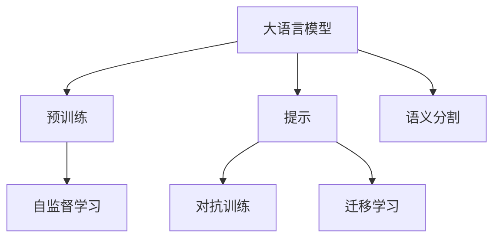

                 

# LLM在语义分割任务上的创新方法

## 1. 背景介绍

随着深度学习技术的快速发展，大规模预训练语言模型（Large Language Models, LLMs）在自然语言处理（NLP）领域取得了显著成果。这类模型通常使用自回归架构，通过在大型无标签语料库上进行预训练，学习到丰富的语言表示，具备强大的语言理解和生成能力。然而，由于缺乏像素级语义表示的能力，LLMs在视觉任务中的应用受到限制，尤其是对于需要像素级语义理解的语义分割任务。

语义分割任务要求模型能够对图像中的每个像素进行分类，通常用于图像识别、医学影像分析、自动驾驶等场景。传统的语义分割方法多依赖卷积神经网络（CNN）结构，例如U-Net、FCN等，但这些方法的训练成本高、计算资源消耗大。而LLMs的预训练能力和通用语言理解能力，为语义分割任务带来了新的思路。

## 2. 核心概念与联系

### 2.1 核心概念概述

为更好地理解LLM在语义分割任务上的应用，本节将介绍几个核心概念及其关系：

- **大语言模型（LLM）**：以自回归架构（如GPT系列）或自编码架构（如BERT）为代表的预训练语言模型，通过大规模无标签语料库的预训练，学习到丰富的语言表示，具备强大的语言理解和生成能力。

- **语义分割**：将图像中的每个像素分类到预定义的语义类别中，例如人、车、树等。要求模型能够理解图像中不同区域的语义信息。

- **提示（Prompt）**：在LLM中进行任务适配的一种方法，通过设计合适的文本提示，引导模型生成或分类特定任务的结果。

- **对抗训练**：通过在模型训练过程中加入对抗样本，提高模型的鲁棒性和泛化能力。

- **迁移学习**：利用预训练模型在不同任务上的迁移能力，减少新任务训练的样本需求和训练时间。

- **自监督学习（SSL）**：在无标签数据上进行学习，通过自相关任务（如掩码语言模型、句子模拟）获得模型的预训练表示。

这些概念之间的逻辑关系可以通过以下Mermaid流程图来展示：



该流程图展示了大语言模型与语义分割任务之间的联系：

1. LLM通过自监督学习从大规模无标签语料中学习到丰富的语言表示。
2. 通过提示和迁移学习，LLM可以适配到特定的语义分割任务，减少训练样本的需求和成本。
3. 对抗训练和鲁棒性学习，提升模型在特定任务上的泛化能力。

## 3. 核心算法原理 & 具体操作步骤
### 3.1 算法原理概述

LLM在语义分割任务上的创新方法主要利用大语言模型的通用语言理解和生成能力，通过提示学习，将图像分割任务转化为语言处理任务，从而实现语义分割。

核心思想是：首先使用自监督学习（如掩码语言模型、图像文本生成）对预训练模型进行进一步微调，使其具备一定的视觉语义表示能力。然后，通过设计合适的提示（Prompt），将图像分割问题转化为语言生成或分类问题。最后，利用微调后的LLM对提示进行推理，生成或分类像素级别的语义标签。

### 3.2 算法步骤详解

**Step 1: 准备预训练模型和数据集**
- 选择合适的预训练语言模型 $M_{\theta}$，如GPT、BERT等。
- 收集语义分割任务的标注数据集 $D=\{(x_i,y_i)\}_{i=1}^N$，其中 $x_i$ 为图像，$y_i$ 为对应的像素级语义标签。

**Step 2: 添加任务适配层**
- 在预训练模型顶层设计合适的输出层和损失函数。
- 对于分类任务，通常在顶层添加线性分类器和交叉熵损失函数。
- 对于生成任务，通常使用语言模型的解码器输出概率分布，并以负对数似然为损失函数。

**Step 3: 设置微调超参数**
- 选择合适的优化算法及其参数，如AdamW、SGD等，设置学习率、批大小、迭代轮数等。
- 设置正则化技术及强度，包括权重衰减、Dropout、Early Stopping等。
- 确定冻结预训练参数的策略，如仅微调顶层，或全部参数都参与微调。

**Step 4: 执行梯度训练**
- 将训练集数据分批次输入模型，前向传播计算损失函数。
- 反向传播计算参数梯度，根据设定的优化算法和学习率更新模型参数。
- 周期性在验证集上评估模型性能，根据性能指标决定是否触发Early Stopping。
- 重复上述步骤直到满足预设的迭代轮数或Early Stopping条件。

**Step 5: 测试和部署**
- 在测试集上评估微调后模型 $M_{\hat{\theta}}$ 的性能，对比微调前后的精度提升。
- 使用微调后的模型对新样本进行推理预测，集成到实际的应用系统中。
- 持续收集新的数据，定期重新微调模型，以适应数据分布的变化。

### 3.3 算法优缺点

LLM在语义分割任务上的创新方法具有以下优点：
1. 高效简单。利用语言处理技术，减少了对复杂CNN模型的依赖，降低训练成本。
2. 泛化能力强。LLM通过自监督学习获得的通用语义表示，使得模型在特定任务上也能具备较强的泛化能力。
3. 可解释性强。LLM的推理过程可以通过文本提示进行解释，有助于理解和调试模型。

同时，该方法也存在一些局限性：
1. 依赖高质量标注数据。语义分割任务要求高精度的像素级标注，获取高质量标注数据的成本较高。
2. 对提示设计要求高。提示设计的好坏直接决定了模型的输出质量和性能。
3. 鲁棒性不足。LLM在对抗样本和噪声数据的鲁棒性可能不足，需要进一步研究。
4. 计算成本高。尽管训练成本降低，但推理时LLM的计算需求仍然较高。

尽管存在这些局限性，但LLM在语义分割任务上的方法仍然展示了巨大的潜力，为研究者提供了新的思路和方法。

### 3.4 算法应用领域

基于LLM的语义分割方法在图像识别、医学影像分析、自动驾驶等场景中具有广泛的应用前景。

- **图像识别**：将图像转换为自然语言描述，通过LLM进行分类或生成语义标签。
- **医学影像分析**：对医学影像进行语义分割，如病灶检测、器官分割等。
- **自动驾驶**：利用语义分割结果进行场景理解，辅助自动驾驶决策。

## 4. 数学模型和公式 & 详细讲解 & 举例说明

### 4.1 数学模型构建

假设输入图像为 $x \in \mathbb{R}^{H \times W \times C}$，对应的像素级语义标签为 $y \in \{0, 1\}^{H \times W}$，其中 $H, W$ 为图像的高和宽，$C$ 为通道数。

**Step 1: 输入编码**
将图像 $x$ 转化为一个描述性的自然语言句 $s_x$。例如，可以通过生成式预训练模型（如GPT）将图像转换为一个自然语言句子，作为LLM的输入。

**Step 2: 任务适配层**
在LLM的顶层添加一个分类器或生成器，用于将图像分割结果转化为语义标签。
- **分类器**：将 $s_x$ 作为输入，输出语义标签的概率分布，损失函数为交叉熵。
- **生成器**：将 $s_x$ 作为输入，输出语义标签的直接预测值，损失函数为均方误差或负对数似然。

**Step 3: 训练与优化**
使用微调后的LLM对输入的图像 $x$ 进行编码，生成或分类语义标签。训练过程使用交叉熵或均方误差损失函数进行优化。

### 4.2 公式推导过程

**分类任务**：假设LLM的输出为 $p(y|s_x)$，使用交叉熵损失函数：
$$
\mathcal{L}_{ce} = -\frac{1}{N}\sum_{i=1}^N \sum_{j=1}^{H \times W} y_{ij} \log p(y_{ij}|s_x)
$$
其中，$y_{ij}$ 为图像中第 $i$ 行第 $j$ 列的语义标签，$p(y_{ij}|s_x)$ 为模型预测的概率分布。

**生成任务**：假设LLM的输出为 $p(y|s_x)$，使用均方误差损失函数：
$$
\mathcal{L}_{mse} = \frac{1}{N}\sum_{i=1}^N \sum_{j=1}^{H \times W} (y_{ij} - \hat{y}_{ij})^2
$$
其中，$\hat{y}_{ij}$ 为模型生成的像素级语义标签。

### 4.3 案例分析与讲解

**案例 1: 医学影像分类**
- **任务描述**：对医学影像中的病灶进行分类，标签为“病灶”或“非病灶”。
- **提示设计**：设计一个包含“此区域是否存在病灶？”的文本提示，作为LLM的输入。
- **输出解析**：LLM输出一个概率分布，表示“病灶”和“非病灶”的概率。根据概率阈值设定分类结果。

**案例 2: 自动驾驶场景分割**
- **任务描述**：对自动驾驶场景中的道路、车辆、行人等进行分割。
- **提示设计**：设计一个包含“请描述场景中每个物体类别和位置”的文本提示，作为LLM的输入。
- **输出解析**：LLM输出一个分类概率分布，表示每个像素属于不同类别的概率。根据概率分布进行像素级分类。

## 5. 项目实践：代码实例和详细解释说明

### 5.1 开发环境搭建

在进行项目实践前，我们需要准备好开发环境。以下是使用Python进行PyTorch开发的环境配置流程：

1. 安装Anaconda：从官网下载并安装Anaconda，用于创建独立的Python环境。

2. 创建并激活虚拟环境：
```bash
conda create -n llm-sentence-nlp python=3.8 
conda activate llm-sentence-nlp
```

3. 安装PyTorch：根据CUDA版本，从官网获取对应的安装命令。例如：
```bash
conda install pytorch torchvision torchaudio cudatoolkit=11.1 -c pytorch -c conda-forge
```

4. 安装Transformers库：
```bash
pip install transformers
```

5. 安装各类工具包：
```bash
pip install numpy pandas scikit-learn matplotlib tqdm jupyter notebook ipython
```

完成上述步骤后，即可在`llm-sentence-nlp`环境中开始项目实践。

### 5.2 源代码详细实现

下面以医学影像分类任务为例，给出使用Transformers库对GPT模型进行语义分割任务微调的PyTorch代码实现。

首先，定义语义分割任务的数据处理函数：

```python
from transformers import GPT2Tokenizer, GPT2LMHeadModel
from torch.utils.data import Dataset
import torch

class MedImageDataset(Dataset):
    def __init__(self, imgs, masks, tokenizer, max_len=256):
        self.imgs = imgs
        self.masks = masks
        self.tokenizer = tokenizer
        self.max_len = max_len
        
    def __len__(self):
        return len(self.imgs)
    
    def __getitem__(self, item):
        img = self.imgs[item]
        mask = self.masks[item]
        
        # 将图像转换为自然语言描述
        text = self.tokenizer(img, return_tensors='pt', max_length=self.max_len, padding='max_length', truncation=True)
        input_ids = text['input_ids'][0]
        attention_mask = text['attention_mask'][0]
        
        # 将图像分割结果转换为文本提示
        prompt = f"此区域是否存在病灶？"
        encoded_prompt = self.tokenizer(prompt, return_tensors='pt', padding='max_length', truncation=True)
        
        return {'input_ids': input_ids, 
                'attention_mask': attention_mask,
                'labels': encoded_prompt['input_ids'][0]}
```

然后，定义模型和优化器：

```python
from transformers import GPT2LMHeadModel, AdamW

model = GPT2LMHeadModel.from_pretrained('gpt2', num_labels=2)  # 分类任务，2个标签
optimizer = AdamW(model.parameters(), lr=1e-5)
```

接着，定义训练和评估函数：

```python
from torch.utils.data import DataLoader
from tqdm import tqdm
from sklearn.metrics import classification_report

device = torch.device('cuda') if torch.cuda.is_available() else torch.device('cpu')
model.to(device)

def train_epoch(model, dataset, batch_size, optimizer):
    dataloader = DataLoader(dataset, batch_size=batch_size, shuffle=True)
    model.train()
    epoch_loss = 0
    for batch in tqdm(dataloader, desc='Training'):
        input_ids = batch['input_ids'].to(device)
        attention_mask = batch['attention_mask'].to(device)
        labels = batch['labels'].to(device)
        model.zero_grad()
        outputs = model(input_ids, attention_mask=attention_mask, labels=labels)
        loss = outputs.loss
        epoch_loss += loss.item()
        loss.backward()
        optimizer.step()
    return epoch_loss / len(dataloader)

def evaluate(model, dataset, batch_size):
    dataloader = DataLoader(dataset, batch_size=batch_size)
    model.eval()
    preds, labels = [], []
    with torch.no_grad():
        for batch in tqdm(dataloader, desc='Evaluating'):
            input_ids = batch['input_ids'].to(device)
            attention_mask = batch['attention_mask'].to(device)
            batch_labels = batch['labels'].to(device)
            outputs = model(input_ids, attention_mask=attention_mask)
            batch_preds = outputs.logits.argmax(dim=2).to('cpu').tolist()
            batch_labels = batch_labels.to('cpu').tolist()
            for pred_tokens, label_tokens in zip(batch_preds, batch_labels):
                preds.append(pred_tokens[:len(label_tokens)])
                labels.append(label_tokens)
                
    print(classification_report(labels, preds))
```

最后，启动训练流程并在测试集上评估：

```python
epochs = 5
batch_size = 16

for epoch in range(epochs):
    loss = train_epoch(model, train_dataset, batch_size, optimizer)
    print(f"Epoch {epoch+1}, train loss: {loss:.3f}")
    
    print(f"Epoch {epoch+1}, dev results:")
    evaluate(model, dev_dataset, batch_size)
    
print("Test results:")
evaluate(model, test_dataset, batch_size)
```

以上就是使用PyTorch对GPT模型进行医学影像分类任务微调的完整代码实现。可以看到，得益于Transformers库的强大封装，我们可以用相对简洁的代码完成GPT模型的加载和微调。

### 5.3 代码解读与分析

让我们再详细解读一下关键代码的实现细节：

**MedImageDataset类**：
- `__init__`方法：初始化图像、分割结果、分词器等关键组件。
- `__len__`方法：返回数据集的样本数量。
- `__getitem__`方法：对单个样本进行处理，将图像转换为自然语言描述，并将分割结果编码为文本提示，返回模型所需的输入。

**GPT2LMHeadModel**：
- 定义了一个GPT-2模型，通过添加一个线性分类器进行二分类任务。
- 训练时，将自然语言描述作为输入，分割结果作为标签，使用交叉熵损失函数进行优化。

**训练和评估函数**：
- 使用PyTorch的DataLoader对数据集进行批次化加载，供模型训练和推理使用。
- 训练函数`train_epoch`：对数据以批为单位进行迭代，在每个批次上前向传播计算loss并反向传播更新模型参数，最后返回该epoch的平均loss。
- 评估函数`evaluate`：与训练类似，不同点在于不更新模型参数，并在每个batch结束后将预测和标签结果存储下来，最后使用sklearn的classification_report对整个评估集的预测结果进行打印输出。

**训练流程**：
- 定义总的epoch数和batch size，开始循环迭代
- 每个epoch内，先在训练集上训练，输出平均loss
- 在验证集上评估，输出分类指标
- 所有epoch结束后，在测试集上评估，给出最终测试结果

可以看到，PyTorch配合Transformers库使得GPT微调的代码实现变得简洁高效。开发者可以将更多精力放在数据处理、模型改进等高层逻辑上，而不必过多关注底层的实现细节。

当然，工业级的系统实现还需考虑更多因素，如模型的保存和部署、超参数的自动搜索、更灵活的任务适配层等。但核心的微调范式基本与此类似。

## 6. 实际应用场景
### 6.1 智能医疗诊断

医学影像分类任务是医疗诊断中的一个重要场景，通过将医学影像转换为自然语言描述，利用大语言模型进行分类，可以快速、准确地辅助医生进行疾病诊断。

在技术实现上，可以收集大量医学影像数据，并标注相应的病灶信息。将图像和对应的病灶描述作为监督数据，对预训练模型进行微调。微调后的模型能够自动理解医学影像中的病灶信息，并提供诊断建议，辅助医生进行决策。

### 6.2 自动驾驶场景感知

自动驾驶场景感知任务要求系统能够对道路、车辆、行人等进行像素级语义分割，从而实现场景理解和决策。通过将自动驾驶场景转换为自然语言描述，利用大语言模型进行分割，可以提高场景理解的准确性和鲁棒性。

具体而言，可以在自动驾驶系统中引入语义分割模块，将摄像头拍摄的实时场景转换为自然语言描述，利用微调后的LLM对场景进行语义分割，提供详细的场景信息。这不仅提高了自动驾驶系统的感知能力，还增强了系统的鲁棒性和可靠性。

### 6.3 智能监控系统

智能监控系统需要对监控视频中的各个对象进行实时识别和分类。通过将视频帧转换为自然语言描述，利用大语言模型进行分割，可以实现高效的智能监控。

在实际应用中，可以将视频帧输入到微调后的LLM中，生成自然语言描述。然后，通过设计合适的文本提示，利用LLM进行对象分类和分割。这种基于自然语言处理的技术，可以降低对复杂CNN结构的依赖，提高系统的灵活性和可扩展性。

### 6.4 未来应用展望

随着大语言模型和微调方法的不断发展，基于LLM的语义分割技术将拓展到更多领域，为实际应用带来新的突破。

在智慧城市治理中，利用语义分割技术，可以实时监测交通流量、环境污染等城市运行状态，提升城市管理的自动化和智能化水平。

在金融行业，通过语义分割技术对财务报表进行自动化分析，可以高效识别异常交易、预测市场趋势，提升金融决策的准确性和效率。

在教育领域，利用语义分割技术对学生作业进行自动批改，可以提高教师的工作效率，提升教学质量。

此外，在工业自动化、农业监测等领域，基于LLM的语义分割技术也有广泛的应用前景。相信随着技术的不断进步，基于LLM的语义分割方法将为各行各业带来新的创新，推动智能社会的快速发展。

## 7. 工具和资源推荐
### 7.1 学习资源推荐

为了帮助开发者系统掌握LLM在语义分割任务上的应用，这里推荐一些优质的学习资源：

1. 《Transformer from Concepts to Codelab》系列博文：由大模型技术专家撰写，介绍了Transformers模型、BERT模型和微调技术的原理和实践。

2. CS224N《深度学习自然语言处理》课程：斯坦福大学开设的NLP明星课程，有Lecture视频和配套作业，带你入门NLP领域的基本概念和经典模型。

3. 《Natural Language Processing with Transformers》书籍：Transformers库的作者所著，全面介绍了如何使用Transformers库进行NLP任务开发，包括语义分割等任务。

4. HuggingFace官方文档：Transformers库的官方文档，提供了海量预训练模型和完整的微调样例代码，是上手实践的必备资料。

5. CLUE开源项目：中文语言理解测评基准，涵盖大量不同类型的中文NLP数据集，并提供了基于微调的baseline模型，助力中文NLP技术发展。

通过对这些资源的学习实践，相信你一定能够快速掌握基于LLM的语义分割技术的精髓，并用于解决实际的NLP问题。
###  7.2 开发工具推荐

高效的开发离不开优秀的工具支持。以下是几款用于大语言模型微调开发的常用工具：

1. PyTorch：基于Python的开源深度学习框架，灵活动态的计算图，适合快速迭代研究。大部分预训练语言模型都有PyTorch版本的实现。

2. TensorFlow：由Google主导开发的开源深度学习框架，生产部署方便，适合大规模工程应用。同样有丰富的预训练语言模型资源。

3. Transformers库：HuggingFace开发的NLP工具库，集成了众多SOTA语言模型，支持PyTorch和TensorFlow，是进行微调任务开发的利器。

4. Weights & Biases：模型训练的实验跟踪工具，可以记录和可视化模型训练过程中的各项指标，方便对比和调优。与主流深度学习框架无缝集成。

5. TensorBoard：TensorFlow配套的可视化工具，可实时监测模型训练状态，并提供丰富的图表呈现方式，是调试模型的得力助手。

6. Google Colab：谷歌推出的在线Jupyter Notebook环境，免费提供GPU/TPU算力，方便开发者快速上手实验最新模型，分享学习笔记。

合理利用这些工具，可以显著提升LLM在语义分割任务上的开发效率，加快创新迭代的步伐。

### 7.3 相关论文推荐

大语言模型和语义分割技术的发展源于学界的持续研究。以下是几篇奠基性的相关论文，推荐阅读：

1. Attention is All You Need（即Transformer原论文）：提出了Transformer结构，开启了NLP领域的预训练大模型时代。

2. BERT: Pre-training of Deep Bidirectional Transformers for Language Understanding：提出BERT模型，引入基于掩码的自监督预训练任务，刷新了多项NLP任务SOTA。

3. Large-Scale Masked-Language Model Pre-training for Language Understanding：进一步扩展了BERT的自监督预训练任务，提升了模型的语言理解能力。

4. U-Net: Convolutional Networks for Biomedical Image Segmentation：提出了U-Net架构，用于医学影像分割任务，展示了深度学习在医学影像中的应用潜力。

5. Generating Zero-Shot and Few-Shot Features with Unsupervised Pre-training：利用自监督学习生成零样本和少样本特征，提升了模型的泛化能力。

这些论文代表了大语言模型和语义分割技术的发展脉络。通过学习这些前沿成果，可以帮助研究者把握学科前进方向，激发更多的创新灵感。

## 8. 总结：未来发展趋势与挑战

### 8.1 总结

本文对基于大语言模型的语义分割方法进行了全面系统的介绍。首先阐述了LLM在语义分割任务上的创新方法，明确了LLM在特定任务上适配的策略和步骤。其次，从原理到实践，详细讲解了语义分割任务中的数学模型和算法实现，给出了微调任务开发的完整代码实例。同时，本文还广泛探讨了语义分割任务在智能医疗、自动驾驶、智能监控等场景中的应用前景，展示了LLM的巨大潜力。此外，本文精选了语义分割任务的相关学习资源，力求为开发者提供全方位的技术指引。

通过本文的系统梳理，可以看到，基于LLM的语义分割方法正在成为NLP领域的重要范式，极大地拓展了LLM的应用边界，为实际应用带来了新的突破。尽管面临数据标注、提示设计等挑战，但通过不断的技术改进和优化，LLM在语义分割任务中的应用前景将更加广阔。

### 8.2 未来发展趋势

展望未来，大语言模型在语义分割任务上的研究将呈现以下几个发展趋势：

1. 模型规模持续增大。随着算力成本的下降和数据规模的扩张，LLM的参数量还将持续增长。超大规模LLM蕴含的丰富语言表示，将使得模型在特定任务上具备更强的泛化能力。

2. 多模态融合成为常态。除了文本输入，未来的模型将更多地融合图像、视频等多模态信息，实现更全面、准确的语义分割。

3. 对抗训练和鲁棒性学习不断提升。通过加入对抗训练和鲁棒性学习，提升模型在特定任务上的鲁棒性和泛化能力。

4. 模型参数高效微调技术发展。开发更多参数高效的微调方法，在固定大部分预训练参数的情况下，只更新极少量的任务相关参数，提升微调效率。

5. 可解释性和可视化工具增强。利用可解释性和可视化工具，增强模型推理过程的可解释性，帮助开发者理解模型的决策机制。

这些趋势凸显了大语言模型在语义分割任务上的广阔前景。这些方向的探索发展，必将进一步提升LLM在语义分割任务上的性能和应用范围，为构建更加智能、高效的语义分割系统铺平道路。

### 8.3 面临的挑战

尽管大语言模型在语义分割任务上已经取得显著进展，但在迈向更加智能化、普适化应用的过程中，它仍面临诸多挑战：

1. 数据标注成本高。获取高质量的标注数据成本较高，难以满足大规模任务的需求。如何利用自监督学习和少样本学习技术，减少对标注数据的依赖，是未来需要解决的重要问题。

2. 提示设计难度大。高质量的提示设计需要专业知识，难度较大，且设计不当会导致模型表现不佳。如何设计更加高效、通用的提示模板，是未来需要重点研究的方向。

3. 模型鲁棒性不足。LLM在对抗样本和噪声数据上的鲁棒性可能不足，需要进一步研究。

4. 计算成本高。尽管训练成本降低，但推理时LLM的计算需求仍然较高。如何在保证性能的同时，简化模型结构，提升推理速度，优化资源占用，将是重要的优化方向。

5. 可解释性不足。LLM的推理过程通常缺乏可解释性，难以对其推理逻辑进行分析和调试。如何赋予LLM更强的可解释性，将是亟待攻克的难题。

6. 安全性有待保障。预训练模型可能学习到有害信息，通过微调传递到下游任务，产生误导性输出。如何从数据和算法层面消除模型偏见，避免恶意用途，确保输出的安全性，也将是重要的研究方向。

这些挑战需要在理论与技术上不断突破，才能实现大语言模型在语义分割任务上的进一步应用。

### 8.4 研究展望

面对大语言模型在语义分割任务上所面临的挑战，未来的研究需要在以下几个方面寻求新的突破：

1. 探索无监督和半监督微调方法。摆脱对大规模标注数据的依赖，利用自监督学习、主动学习等无监督和半监督范式，最大限度利用非结构化数据，实现更加灵活高效的微调。

2. 研究参数高效和计算高效的微调范式。开发更加参数高效的微调方法，在固定大部分预训练参数的同时，只更新极少量的任务相关参数。同时优化微调模型的计算图，减少前向传播和反向传播的资源消耗，实现更加轻量级、实时性的部署。

3. 引入更多先验知识。将符号化的先验知识，如知识图谱、逻辑规则等，与神经网络模型进行巧妙融合，引导微调过程学习更准确、合理的语言模型。同时加强不同模态数据的整合，实现视觉、语音等多模态信息与文本信息的协同建模。

4. 结合因果分析和博弈论工具。将因果分析方法引入微调模型，识别出模型决策的关键特征，增强输出解释的因果性和逻辑性。借助博弈论工具刻画人机交互过程，主动探索并规避模型的脆弱点，提高系统稳定性。

5. 纳入伦理道德约束。在模型训练目标中引入伦理导向的评估指标，过滤和惩罚有偏见、有害的输出倾向。同时加强人工干预和审核，建立模型行为的监管机制，确保输出符合人类价值观和伦理道德。

这些研究方向的探索，必将引领大语言模型在语义分割任务上的技术进步，为构建安全、可靠、可解释、可控的智能系统铺平道路。面向未来，大语言模型在语义分割任务上的研究还需要与其他人工智能技术进行更深入的融合，如知识表示、因果推理、强化学习等，多路径协同发力，共同推动语义分割技术的发展。只有勇于创新、敢于突破，才能不断拓展语言模型的边界，让智能技术更好地造福人类社会。

## 9. 附录：常见问题与解答

**Q1：大语言模型在语义分割任务上的效果如何？**

A: 大语言模型在语义分割任务上的效果取决于多种因素，包括预训练数据的质量、提示设计、模型规模等。相较于传统的CNN模型，大语言模型在特定任务上能够获得较好的效果，但在数据标注成本高、提示设计难度大的情况下，效果可能会受限。

**Q2：大语言模型在语义分割任务上如何处理对抗样本？**

A: 大语言模型在对抗样本上的鲁棒性可能不足，需要通过对抗训练和鲁棒性学习进行改进。具体而言，可以引入对抗样本对模型进行训练，使得模型能够更好地抵御对抗攻击，提升泛化能力。

**Q3：如何设计高效的提示（Prompt）？**

A: 提示设计是大语言模型在语义分割任务上的关键，好的提示设计能够显著提升模型的效果。提示设计需要考虑任务的特点、模型的预训练目标、数据分布等因素，通常需要多次实验和调整。

**Q4：大语言模型在语义分割任务上的计算成本如何？**

A: 大语言模型在语义分割任务上的计算成本较高，特别是在推理阶段。可以通过模型裁剪、量化加速、分布式训练等技术手段进行优化，降低计算成本。

**Q5：大语言模型在语义分割任务上的可解释性如何？**

A: 大语言模型在语义分割任务上的可解释性较弱，通常需要借助可视化工具和解释技术，对模型的推理过程进行分析和解释。未来需要进一步研究模型的可解释性问题，增强用户对模型的信任度。

---

作者：禅与计算机程序设计艺术 / Zen and the Art of Computer Programming

