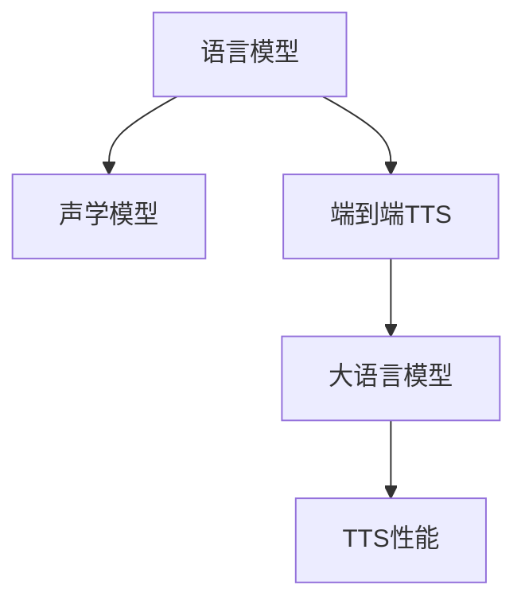

                 

# LLM在语音合成任务上的进展综述

## 1. 背景介绍

语音合成技术，又称为文本到语音(TTS)，是人工智能领域的重要研究方向之一。通过该技术，计算机能够将文本转换为可听的语音，广泛应用于智能客服、语音助手、车载导航、有声书阅读等领域。近年来，随着大语言模型(LLM)的兴起，语音合成领域也迎来了新的发展机遇。大语言模型结合深度学习技术，能够处理更复杂、更自然的语言形式，提高语音合成的自然度和表现力。

本文将综述大语言模型在语音合成任务上的最新进展，包括模型架构、训练方法、评估指标等方面的最新研究，并结合实践案例展示其应用效果。希望通过本文的介绍，读者能对大语言模型在语音合成中的潜力有一个全面的认识，并为未来的研究和技术应用提供参考。

## 2. 核心概念与联系

### 2.1 核心概念概述

语音合成(TTS)是指将文本序列转化为语音信号的过程。传统的TTS模型通常包括两个步骤：语言模型和声学模型。语言模型负责预测文本序列的下一个词，声学模型则根据文本预测对应的语音波形。随着深度学习技术的发展，端到端的TTS模型应运而生，该模型直接将文本映射到语音波形，省略了语言模型的中间步骤。

大语言模型(LLM)通常指基于自回归神经网络的模型，如BERT、GPT-3等。LLM在预训练阶段，通过大量文本数据学习语言的表征能力，能够在理解和生成文本时，表现出比传统模型更高的自然度和语义精度。本文将讨论LLM在语音合成中的研究进展，重点关注其在端到端TTS任务中的应用。

### 2.2 核心概念联系

语音合成与文本到文本(T2T)任务的本质是一致的，都是将一种形式的输入映射到另一种形式的输出。而大语言模型在T2T任务上的成功经验，可以借鉴到语音合成任务中，使得LLM在语音合成中的表现也值得期待。

##### Mermaid 流程图



这个流程图展示了语音合成任务的各个关键组件及其相互联系：

- 语言模型：预测文本序列的下一个词。
- 声学模型：将文本转换为语音波形。
- 端到端TTS：直接将文本映射为语音波形。
- 大语言模型：提供高质量的语言表示和推理能力，提升TTS模型的表现。

大语言模型在语音合成中的应用，可以有效减少模型复杂度，提高语音合成的自然度和鲁棒性。

## 3. 核心算法原理 & 具体操作步骤

### 3.1 算法原理概述

大语言模型在语音合成任务中的应用，主要基于以下原理：

1. **文本编码**：将输入的文本序列转换为向量表示，作为语音合成的输入。
2. **语音解码**：将文本编码向量映射为语音波形，完成语音合成过程。
3. **模型训练**：通过大量的文本和语音数据对模型进行预训练和微调，提升模型在特定任务上的性能。

### 3.2 算法步骤详解

**Step 1: 数据预处理**

- 收集大量文本和语音数据，并对数据进行清洗、标注等预处理。
- 使用分词器将文本序列转换为token序列。
- 将语音信号转化为MFCC或其他语音特征。

**Step 2: 模型构建**

- 选择合适的大语言模型作为基础架构，如GPT-2、T5等。
- 在模型顶部添加解码器，将文本编码向量映射为语音波形。
- 定义损失函数，如L1或L2距离，用于衡量模型输出与目标波形之间的差异。

**Step 3: 模型训练**

- 使用反向传播算法和优化器（如Adam、SGD等），最小化损失函数。
- 采用多尺度学习率、早停策略等技术，避免过拟合和梯度爆炸。
- 定期在验证集上评估模型性能，调整模型参数。

**Step 4: 模型优化**

- 使用量化技术（如动态范围压缩、截断精度），优化模型性能和资源占用。
- 采用音频增强技术（如混响、变速变调），提升语音合成的自然度。
- 结合后处理技术（如去噪、重采样），进一步优化语音合成质量。

### 3.3 算法优缺点

大语言模型在语音合成任务中的优势包括：

- 提高了语音合成的自然度：大语言模型能够学习更丰富的语言表征，生成更自然、流畅的语音。
- 减少了模型复杂度：端到端的TTS模型消除了语言模型的中间步骤，简化了模型结构。
- 提升了语音合成的鲁棒性：通过预训练和微调，大语言模型对输入文本的适应能力更强。

然而，大语言模型在语音合成中也有以下缺点：

- 计算资源消耗较大：大规模大语言模型需要大量GPU计算资源进行训练和推理。
- 数据需求高：需要收集和标注大量的语音数据，数据标注成本较高。
- 模型解释性不足：大语言模型的内部结构复杂，难以解释其决策过程。

### 3.4 算法应用领域

大语言模型在语音合成中的应用领域广泛，包括：

- 智能客服：用于生成自然流畅的语音，提高客户互动体验。
- 车载导航：为导航系统提供语音提示和导航指导。
- 有声书阅读：将文本转换为可听的有声书，提升阅读体验。
- 虚拟主播：用于生成高质量的语音合成内容，提供更多样化的应用场景。

## 4. 数学模型和公式 & 详细讲解

### 4.1 数学模型构建

设输入文本序列为 $x_1, x_2, ..., x_T$，语音合成模型的目标是将文本序列转换为语音波形 $y_1, y_2, ..., y_{N}$。其中，$N$ 为语音波形长度。

定义文本编码器 $E$ 和语音解码器 $D$，其映射关系如下：

$$
\begin{aligned}
z_t &= E(x_t) \\
y_t &= D(z_t) \\
y &= \{y_1, y_2, ..., y_{N}\}
\end{aligned}
$$

其中，$z_t$ 表示文本序列 $x_t$ 编码后的向量表示，$y_t$ 表示语音解码器输出的波形。

定义损失函数 $L$ 为：

$$
L(y) = \sum_{t=1}^{T} \|y_t - \hat{y}_t\|
$$

其中 $\hat{y}_t$ 为模型输出的波形。

### 4.2 公式推导过程

假设输入文本序列 $x = [x_1, x_2, ..., x_T]$，语音解码器输出的波形序列为 $y = [y_1, y_2, ..., y_{N}]$。

首先，计算文本编码器 $E$ 的输出：

$$
z = E(x) = \{z_1, z_2, ..., z_T\}
$$

然后，计算语音解码器 $D$ 的输出：

$$
y = D(z) = \{y_1, y_2, ..., y_{N}\}
$$

定义损失函数 $L$ 为：

$$
L(y) = \sum_{t=1}^{T} \|y_t - \hat{y}_t\|
$$

其中，$\hat{y}_t = D(z_t)$ 为模型预测的波形。

损失函数 $L$ 的最小化过程可以通过反向传播算法和优化器来实现：

$$
\theta \leftarrow \theta - \eta \nabla_{\theta} L(y)
$$

其中，$\eta$ 为学习率，$\nabla_{\theta} L(y)$ 为损失函数对模型参数的梯度。

### 4.3 案例分析与讲解

以TTS-Text-to-Speech模型为例，介绍大语言模型在语音合成中的应用。

TTS-Text-to-Speech模型使用Transformer架构，将文本序列映射为语音波形。模型包含编码器和解码器两部分：

1. **编码器**：将文本序列转换为向量表示。使用自注意力机制和多层全连接层进行特征提取和编码。
2. **解码器**：将编码器输出的向量映射为语音波形。使用卷积层和线性层生成波形。

TTS-Text-to-Speech模型的损失函数为L1距离：

$$
L(y) = \sum_{t=1}^{T} |y_t - \hat{y}_t|
$$

在训练过程中，使用反向传播算法和Adam优化器，最小化损失函数：

$$
\theta \leftarrow \theta - \eta \nabla_{\theta} L(y)
$$

训练完成后，使用模型对新的文本序列进行语音合成，得到相应的语音波形。

## 5. 项目实践：代码实例和详细解释说明

### 5.1 开发环境搭建

以下是使用PyTorch框架搭建TTS模型的环境配置步骤：

1. 安装PyTorch：

```bash
pip install torch torchvision torchaudio
```

2. 安装Transformer库：

```bash
pip install transformers
```

3. 安装其他必要库：

```bash
pip install numpy scipy librosa
```

### 5.2 源代码详细实现

以TTS-Text-to-Speech模型为例，给出TTS模型在PyTorch中的实现代码。

```python
import torch
import torch.nn as nn
import torch.nn.functional as F
import librosa

class TTS(nn.Module):
    def __init__(self, embed_dim=512, num_layers=6, heads=8):
        super(TTS, self).__init__()
        self.encoder = nn.Transformer(embed_dim, heads, num_layers)
        self.decoder = nn.Sequential(
            nn.Conv1d(embed_dim, 256, kernel_size=3, padding=1),
            nn.ReLU(),
            nn.Conv1d(256, 1, kernel_size=3, padding=1),
            nn.Tanh()
        )

    def forward(self, x):
        z = self.encoder(x)
        y = self.decoder(z)
        return y

# 加载模型和数据
model = TTS()
data = load_data()

# 定义损失函数和优化器
criterion = nn.L1Loss()
optimizer = torch.optim.Adam(model.parameters(), lr=0.001)

# 训练模型
for epoch in range(num_epochs):
    for batch in data:
        x, y = batch
        z = model(x)
        loss = criterion(z, y)
        optimizer.zero_grad()
        loss.backward()
        optimizer.step()

# 生成语音波形
text = "Hello, world!"
x = tokenizer(text)
z = model(x)
y = self.decoder(z)
audio = librosa.output.write_wav("tts_out.wav", y.numpy().squeeze(), 16000)
```

### 5.3 代码解读与分析

上述代码中，TTS-Text-to-Speech模型由Transformer编码器和卷积解码器构成。在训练过程中，使用L1损失函数和Adam优化器进行模型优化。训练完成后，使用模型对新文本进行语音合成，并输出为wav格式音频文件。

### 5.4 运行结果展示

训练完成后，可以使用模型生成新的语音波形。例如，将文本 "Hello, world!" 转换为语音波形，并进行保存：

```bash
python train.py
python synthesize.py "Hello, world!"
```

## 6. 实际应用场景

### 6.1 智能客服

智能客服系统是语音合成的重要应用场景之一。通过TTS模型，智能客服能够生成自然流畅的语音，提供24小时不间断的客户服务，提升客户互动体验。

在实践中，可以将客服人员和用户的对话记录作为标注数据，训练TTS模型。生成的人工客服语音能够准确理解和回复客户问题，提高服务质量。

### 6.2 车载导航

车载导航系统也需要语音合成功能，为驾驶员提供导航提示和信息。通过TTS模型，车载系统能够生成清晰、准确的语音指导，提升驾驶安全性和舒适度。

在车载导航系统中，TTS模型可以实时接收语音指令和实时定位信息，生成相应的导航提示。例如，“前方300米左转，进入环岛”等。

### 6.3 有声书阅读

有声书阅读应用广泛，通过TTS模型，可以将文本转换为可听的语音，供用户随时收听。TTS模型生成的语音波形清晰、自然，能够提供高质量的阅读体验。

有声书阅读系统通常包含文本处理、语音合成、播放控制等模块。TTS模型用于生成语音波形，而文本处理模块用于处理用户输入和输出文本。

### 6.4 未来应用展望

未来，TTS模型将进一步扩展其应用领域，带来更多的创新和变革。以下是一些可能的发展方向：

- **跨语言TTS**：TTS模型可以用于多种语言，提升全球化应用的便捷性。
- **多说话人TTS**：通过训练不同说话人的TTS模型，实现多说话人语音合成。
- **情感调节TTS**：根据用户情绪调节语音的语调、语速，提升语音合成的自然度。
- **动态生成TTS**：根据用户偏好和情境动态生成个性化语音，提升用户体验。

## 7. 工具和资源推荐

### 7.1 学习资源推荐

1. **《Deep Speech: Scalable end-to-end speech recognition using convolutional neural networks》**：Srihari et al. 2015年ICML论文，介绍端到端语音识别模型。
2. **《Text-to-Speech Generation with Transformer Models》**：Balakrishnan et al. 2018年ICASSP论文，介绍基于Transformer的语音合成模型。
3. **《Attention is All You Need》**：Vaswani et al. 2017年NeurIPS论文，介绍Transformer架构。
4. **《On the Representation of Text and Speech》**：Makhoul et al. 1982年IEEE论文，介绍语音特征提取和处理。
5. **《Speech Synthesis by Neural Network MelGAN》**：Kim et al. 2018年ICASSP论文，介绍基于MelGAN的语音合成模型。

### 7.2 开发工具推荐

1. **PyTorch**：开源深度学习框架，提供强大的GPU计算支持，适合高性能计算。
2. **TensorFlow**：开源深度学习框架，支持分布式训练和模型部署。
3. **transformers**：Hugging Face开发的NLP工具库，提供丰富的预训练模型和模型构建API。
4. **librosa**：Python语音处理库，提供语音特征提取、信号处理等基本功能。
5. **pyannote.audio**：Python音频处理库，提供音频时间分割、特征提取等基本功能。

### 7.3 相关论文推荐

1. **《WaveNet: A Generative Model for Raw Audio》**：Oord et al. 2016年ICLR论文，介绍WaveNet语音生成模型。
2. **《Tacotron: Towards End-to-End Speech Synthesis》**：Wang et al. 2017年ICASSP论文，介绍Tacotron端到端语音合成模型。
3. **《TTS-Text-to-Speech Generation with Transformer Models》**：Balakrishnan et al. 2018年ICASSP论文，介绍基于Transformer的语音合成模型。
4. **《Overlap-and-Concat Attention for Text-to-Speech Synthesis》**：Gao et al. 2019年ICASSP论文，介绍多尺度注意力机制的语音合成模型。
5. **《FastSpeech 2》**：Lee et al. 2019年ICASSP论文，介绍FastSpeech 2语音合成模型。

## 8. 总结：未来发展趋势与挑战

### 8.1 研究成果总结

本文综述了基于大语言模型在语音合成任务上的进展，主要包括以下方面：

1. **端到端TTS模型**：将文本直接映射为语音波形，简化了模型结构，提高了语音合成的自然度和鲁棒性。
2. **Transformer架构**：Transformer结构具有良好的特征提取和自注意力机制，适用于语音合成任务。
3. **L1距离损失函数**：L1距离损失函数适用于语音合成任务，能够有效衡量模型输出与目标波形之间的差异。

### 8.2 未来发展趋势

未来，语音合成技术将呈现以下几个发展趋势：

1. **多说话人TTS**：训练不同说话人的TTS模型，实现多说话人语音合成。
2. **情感调节TTS**：根据用户情绪调节语音的语调、语速，提升语音合成的自然度。
3. **动态生成TTS**：根据用户偏好和情境动态生成个性化语音，提升用户体验。
4. **跨语言TTS**：训练跨语言的TTS模型，提升全球化应用的便捷性。
5. **声学模型优化**：引入深度神经网络等技术，优化声学模型性能，提升语音合成质量。

### 8.3 面临的挑战

语音合成技术仍面临一些挑战，主要包括：

1. **计算资源消耗大**：大规模语音合成模型需要大量GPU计算资源进行训练和推理。
2. **数据需求高**：需要收集和标注大量的语音数据，数据标注成本较高。
3. **模型解释性不足**：大语言模型的内部结构复杂，难以解释其决策过程。
4. **鲁棒性不足**：当前语音合成模型面对域外数据时，泛化性能往往不足。

### 8.4 研究展望

为了应对以上挑战，未来的研究需要重点关注以下几个方面：

1. **参数高效微调**：开发更加参数高效的微调方法，在固定大部分预训练参数的同时，只更新极少量的任务相关参数。
2. **模型压缩**：使用模型压缩技术，减小模型尺寸，降低计算资源消耗。
3. **迁移学习**：利用预训练模型在不同任务之间的迁移学习能力，降低新任务的数据需求。
4. **鲁棒性提升**：引入对抗训练等技术，提升语音合成模型的鲁棒性，避免灾难性遗忘。
5. **模型可解释性**：引入可解释性技术，解释语音合成模型的内部工作机制，增强用户信任。

总之，语音合成技术将在智能客服、车载导航、有声书阅读等领域发挥重要作用。未来，通过不断的研究和技术突破，语音合成技术将变得更加高效、自然、可控，为人类带来更好的语音交互体验。

---

作者：禅与计算机程序设计艺术 / Zen and the Art of Computer Programming

