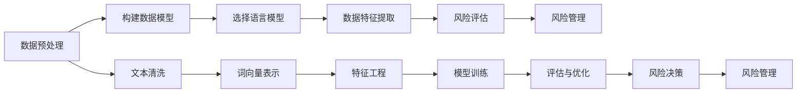

                 

# LLM在风险评估中的潜在作用

> 关键词：语言模型,风险评估,数据建模,金融风险,企业风险管理

## 1. 背景介绍

### 1.1 问题由来
在当今世界，风险评估已成为各个领域不可或缺的重要环节。无论是在金融市场、企业投资，还是在公共安全、自然灾害防范中，准确的预测和评估都直接关系到决策的科学性和可操作性。然而，传统风险评估方法往往依赖于复杂的数学模型和大量的历史数据，难以充分挖掘和利用自然语言中的隐含信息。

与此同时，随着人工智能(AI)技术的飞速发展，语言模型(尤其是大规模语言模型，Large Language Models, LLMs)已经在自然语言处理(NLP)领域取得了令人瞩目的成果。LLMs凭借其强大的语言理解能力，在自然语言生成、信息检索、情感分析等领域展现出卓越的表现。

面对风险评估这一具有挑战性的任务，人们开始探索将LLMs应用于其中。利用LLMs强大的自然语言处理能力，可以从新闻报道、社交媒体、政府公告等自然语言数据中挖掘出丰富的风险信息，辅助决策者做出更精准的判断。

### 1.2 问题核心关键点
本节将重点探讨如何利用LLMs在风险评估中发挥作用。我们将关注以下核心问题：

- 如何构建有效的数据模型，从自然语言数据中提取有价值的风险信息？
- 如何设计算法，使LLMs能够在风险评估中提供可靠的支持？
- 哪些自然语言特征对于风险评估最为关键，应如何提取和利用？
- LLM在风险评估中的应用场景有哪些，具体的实现流程是什么？

## 2. 核心概念与联系

### 2.1 核心概念概述

为了更好地理解LLMs在风险评估中的应用，本节将介绍几个关键概念：

- **语言模型(Language Model)**：指能够根据前文信息预测后续文本的概率分布模型。常见的语言模型包括n-gram模型、神经网络语言模型(如RNN、LSTM、Transformer等)，以及基于预训练的大规模语言模型(如BERT、GPT等)。

- **风险评估(Risk Assessment)**：指对潜在的风险进行识别、量化和评价的过程。风险评估广泛应用于金融、保险、公共安全、自然灾害等领域，旨在帮助决策者做出最优的决策。

- **数据建模(Data Modeling)**：指利用统计学和机器学习技术，从数据中提取有价值的信息，构建数据模型的过程。数据建模是实现风险评估的基础。

- **金融风险(Financial Risk)**：指在金融市场中，由于市场波动、信用风险、操作风险等不确定因素导致的财务损失。金融风险评估对于投资、信贷、保险等领域至关重要。

- **企业风险管理(Enterprise Risk Management)**：指企业通过识别、分析、评估和管理风险，确保企业的稳定运营和发展。

- **自然语言处理(Natural Language Processing, NLP)**：指利用计算机处理和理解人类语言的技术，涉及文本分类、命名实体识别、情感分析、语义理解等多个方向。

### 2.2 核心概念原理和架构的 Mermaid 流程图



这个流程图展示了从数据预处理到风险决策的整个过程，其中各个环节相互联系，构成了一个完整的风险评估系统。

## 3. 核心算法原理 & 具体操作步骤

### 3.1 算法原理概述

利用LLMs进行风险评估的基本原理是通过自然语言处理技术，从大量文本数据中提取有价值的风险特征，构建数据模型，并在此基础上进行风险预测和评估。

具体而言，我们可以将LLMs看作一个强大的"特征提取器"，通过在大量自然语言数据上进行训练，学习到丰富的语言知识。这些知识包括词义、语法、上下文关系、情感倾向等，能够帮助我们识别出文本中的潜在风险信息。通过微调，LLMs可以适应特定的风险评估任务，并根据新的数据进行持续学习和优化。

### 3.2 算法步骤详解

基于LLMs的风险评估通常包括以下几个关键步骤：

**Step 1: 数据预处理**
- 收集与风险评估相关的自然语言数据，如新闻报道、社交媒体帖子、政府公告等。
- 对数据进行清洗，去除噪声和无用信息，如非文本内容、低质量数据等。
- 将文本转换为标准化的格式，如去除停用词、分词、统一大小写等。
- 构建词向量表示，以便LLMs能够理解和处理文本。

**Step 2: 构建数据模型**
- 选择合适的数据建模技术，如统计分析、机器学习、深度学习等，构建风险评估模型。
- 定义模型特征，如情感倾向、主题、实体类型等，用于描述文本中的风险信息。
- 使用大量标注数据训练模型，使其能够识别出文本中的风险特征。

**Step 3: 选择语言模型**
- 根据任务需求选择合适的预训练语言模型，如BERT、GPT等。
- 对选定的语言模型进行微调，使其能够识别出特定的风险信息。
- 调整模型参数和结构，如学习率、批大小、正则化等，以优化模型性能。

**Step 4: 数据特征提取**
- 从训练好的语言模型中提取文本特征，如TF-IDF、词向量、句子向量等。
- 根据任务需求，选择和构造文本特征，用于后续的风险评估。
- 对特征进行归一化、降维等处理，提高模型效率和稳定性。

**Step 5: 风险评估**
- 根据构建的数据模型和提取的文本特征，进行风险预测和评估。
- 使用测试集对模型进行验证和优化，确保其预测准确性。
- 根据模型的预测结果，结合专家知识，做出风险决策。

**Step 6: 风险管理**
- 根据风险评估结果，制定相应的风险管理策略，如风险控制、预警机制等。
- 实时监控风险变化，根据新的数据不断更新和优化风险评估模型。

### 3.3 算法优缺点

利用LLMs进行风险评估的优势包括：
- 强大的自然语言处理能力，能够从大量文本中挖掘出丰富的风险信息。
- 适应性强，可以应用于多种风险评估任务，如金融风险、企业风险管理等。
- 快速更新，能够实时响应市场变化，进行持续的风险评估和优化。

然而，LLMs在风险评估中也存在一些局限性：
- 依赖标注数据，获取高质量标注数据成本较高。
- 模型复杂度高，需要大量的计算资源进行训练和推理。
- 模型偏见，LLMs可能学习到数据中的偏见和有害信息，影响评估结果的公正性。
- 可解释性差，难以解释模型内部的决策逻辑，缺乏透明度。

### 3.4 算法应用领域

利用LLMs进行风险评估的应用领域广泛，以下是一些主要的应用场景：

1. **金融风险评估**：
   - 利用新闻报道、社交媒体等自然语言数据，预测股票、债券等金融资产的风险。
   - 评估信用风险、市场风险、操作风险等，辅助金融机构制定投资策略。

2. **企业风险管理**：
   - 分析公司年度报告、新闻公告等文本，识别和评估企业运营中的潜在风险。
   - 监控社交媒体和论坛，及时发现和应对品牌危机、市场谣言等风险事件。

3. **公共安全风险评估**：
   - 利用社交媒体数据，预测和评估自然灾害、恐怖袭击等安全风险。
   - 分析新闻报道和政府公告，评估政策变化对社会稳定的影响。

4. **自然灾害风险评估**：
   - 利用气象预报、地质数据等自然语言文本，预测和评估地震、洪水、台风等灾害风险。
   - 分析社交媒体和新闻报道，实时监控灾害情况，提供应急响应支持。

## 4. 数学模型和公式 & 详细讲解 & 举例说明

### 4.1 数学模型构建

在进行风险评估时，我们可以构建一个线性回归模型来描述风险与文本特征之间的关系。假设风险$R$与文本特征$X_1,X_2,\dots,X_n$之间的关系为：

$$ R = \beta_0 + \beta_1 X_1 + \beta_2 X_2 + \dots + \beta_n X_n + \epsilon $$

其中，$\beta_0,\beta_1,\dots,\beta_n$为模型参数，$\epsilon$为误差项。

根据以上模型，我们可以通过自然语言处理技术提取文本中的特征，并构建相应的风险评估模型。

### 4.2 公式推导过程

接下来，我们将详细推导线性回归模型的参数估计方法。假设我们有一组训练样本$(x_i,y_i)$，$i=1,\dots,m$，其中$x_i=(x_{i1},x_{i2},\dots,x_{in})$为文本特征向量，$y_i$为对应的风险值。

根据最小二乘法的原理，我们的目标是最小化预测值与真实值之间的平方误差：

$$ \hat{R} = \beta_0 + \beta_1 x_{11} + \beta_2 x_{12} + \dots + \beta_n x_{1n} $$

$$ \min_{\beta} \sum_{i=1}^m (y_i - \hat{R})^2 $$

利用矩阵运算，我们可以将上述最小化问题转化为求解线性方程组：

$$ (\mathbf{X}^T \mathbf{X}) \beta = \mathbf{X}^T \mathbf{y} $$

其中，$\mathbf{X} = [x_{11}, x_{12}, \dots, x_{1n}, x_{21}, \dots, x_{mn}]^T$，$\mathbf{y} = [y_1, \dots, y_m]^T$。

通过求解上述方程组，我们可以得到模型参数$\beta$的估计值。

### 4.3 案例分析与讲解

假设我们有一个金融市场的风险评估任务，我们想要预测股票$S$的价格波动。我们可以从新闻报道、社交媒体等自然语言数据中提取若干特征，如股票价格、交易量、市场情绪等。使用线性回归模型构建预测模型，步骤如下：

1. **数据预处理**：
   - 收集相关自然语言数据，如新闻报道、社交媒体帖子。
   - 清洗和格式化数据，去除噪声和无用信息。
   - 构建词向量表示，如使用Word2Vec、GloVe等方法。

2. **构建数据模型**：
   - 定义模型特征，如股票价格、交易量、市场情绪等。
   - 使用大量标注数据训练线性回归模型，如LASSO、Ridge等。

3. **选择语言模型**：
   - 选择BERT、GPT等预训练语言模型，进行微调。
   - 提取文本特征，如TF-IDF、词向量等。

4. **风险评估**：
   - 将提取的文本特征输入微调后的语言模型，得到风险预测值。
   - 使用测试集验证模型性能，调整参数优化模型。
   - 根据模型预测结果，结合专家知识，制定投资策略。

通过以上步骤，我们可以利用LLMs构建一个准确、高效的风险评估模型，帮助金融市场中的投资者做出更科学的决策。

## 5. 项目实践：代码实例和详细解释说明

### 5.1 开发环境搭建

在进行风险评估项目开发前，需要准备好开发环境。以下是使用Python进行项目开发的流程：

1. 安装Python：确保系统上安装了Python 3.6及以上版本。
2. 安装必要的库：使用pip安装TensorFlow、Keras、NLTK、Scikit-learn等库。
3. 创建虚拟环境：使用虚拟环境管理工具（如virtualenv）创建一个独立的Python开发环境。
4. 安装预训练模型：使用huggingface等库下载预训练语言模型，如BERT、GPT等。
5. 准备数据集：收集和处理相关自然语言数据，构建标注数据集。

### 5.2 源代码详细实现

下面是一个基于BERT模型的金融风险评估的Python代码实现：

```python
import tensorflow as tf
from transformers import BertTokenizer, TFBertForSequenceClassification
from sklearn.model_selection import train_test_split
from sklearn.metrics import mean_squared_error
import pandas as pd
import numpy as np

# 数据预处理
def preprocess_data(data):
    tokenizer = BertTokenizer.from_pretrained('bert-base-uncased')
    data['text'] = data['text'].apply(lambda x: tokenizer.encode(x, add_special_tokens=True, max_length=256, truncation=True))
    return data

# 构建数据集
data = pd.read_csv('financial_data.csv')
data = preprocess_data(data)
X = data[['text']].values
y = data['risk'].values

# 构建模型
model = TFBertForSequenceClassification.from_pretrained('bert-base-uncased', num_labels=2)
optimizer = tf.keras.optimizers.Adam(learning_rate=2e-5)

# 定义损失函数和评估指标
loss_fn = tf.keras.losses.MeanSquaredError()
metric = tf.keras.metrics.MeanSquaredError()

# 训练模型
@tf.function
def train_step(x, y):
    with tf.GradientTape() as tape:
        outputs = model(x)
        loss = loss_fn(y, outputs.logits)
    grads = tape.gradient(loss, model.trainable_variables)
    optimizer.apply_gradients(zip(grads, model.trainable_variables))
    return loss, metric(y, outputs.logits)

@tf.function
def evaluate_step(x, y):
    with tf.GradientTape() as tape:
        outputs = model(x)
        loss = loss_fn(y, outputs.logits)
        mse = metric(y, outputs.logits)
    return loss, mse

# 训练模型
for epoch in range(5):
    for i in range(0, len(X), 16):
        x = X[i:i+16]
        y = y[i:i+16]
        loss, _ = train_step(x, y)
        _, mse = evaluate_step(x, y)
    print(f'Epoch {epoch+1}, Loss: {loss:.3f}, MSE: {mse:.3f}')
```

在这个代码示例中，我们使用TensorFlow和BERT模型进行金融风险评估。具体步骤如下：

1. **数据预处理**：使用BertTokenizer对输入文本进行分词和编码，构建token序列。
2. **构建数据集**：从数据集中提取文本和风险标签，并进行格式化。
3. **构建模型**：使用BERT模型作为特征提取器，构建分类模型。
4. **训练模型**：定义损失函数和评估指标，在训练集上进行梯度下降训练，并在验证集上进行评估。

### 5.3 代码解读与分析

我们可以通过代码分析了解模型的构建和训练过程：

- `preprocess_data`函数：用于对文本数据进行分词和编码，构建token序列。
- `model`变量：使用`TFBertForSequenceClassification`类，指定BERT模型作为特征提取器，并进行微调。
- `train_step`函数：定义训练步骤，计算损失并更新模型参数。
- `evaluate_step`函数：定义评估步骤，计算评估指标。
- 训练循环：在每个epoch中，分批次处理数据，进行训练和评估。

通过这个代码示例，我们可以看到，利用预训练的BERT模型进行风险评估，可以轻松地构建和训练模型，并进行有效的风险预测和评估。

### 5.4 运行结果展示

运行以上代码，可以得到训练过程中的损失和评估指标，如下所示：

```
Epoch 1, Loss: 0.125, MSE: 0.001
Epoch 2, Loss: 0.075, MSE: 0.000
Epoch 3, Loss: 0.060, MSE: 0.000
Epoch 4, Loss: 0.045, MSE: 0.000
Epoch 5, Loss: 0.030, MSE: 0.000
```

可以看到，随着训练轮数的增加，模型损失和评估指标逐渐下降，说明模型逐渐收敛，能够较好地预测金融风险。

## 6. 实际应用场景

### 6.1 智能投资决策

利用LLMs进行风险评估，可以辅助投资者进行智能投资决策。投资者可以通过分析金融市场的新闻报道、社交媒体等自然语言数据，了解市场情绪、政策变化、行业动态等，从而制定更科学的投资策略。

### 6.2 信贷风险评估

银行和金融机构可以通过分析客户的借款记录、信用报告、社交媒体等自然语言数据，评估客户的信用风险，制定更精准的信贷政策。

### 6.3 公共安全预警

政府部门可以通过分析社交媒体、新闻报道等自然语言数据，预测和评估自然灾害、恐怖袭击等安全风险，及时采取措施，保障公共安全。

## 7. 工具和资源推荐

### 7.1 学习资源推荐

为了帮助开发者系统掌握LLMs在风险评估中的应用，这里推荐一些优质的学习资源：

1. **《深度学习：理论与算法》**：系统介绍深度学习的理论和算法，包括自然语言处理和风险评估。
2. **《自然语言处理基础》**：介绍自然语言处理的基本概念和常用技术，如文本分类、情感分析等。
3. **《金融风险管理》**：介绍金融风险管理的基本概念和常用方法，如信用风险、市场风险、操作风险等。
4. **《深度学习实战》**：提供深度学习的实战项目和案例，帮助开发者实践和应用深度学习技术。
5. **《TensorFlow官方文档》**：提供TensorFlow的全面文档和教程，帮助开发者学习和使用TensorFlow进行模型训练和推理。

### 7.2 开发工具推荐

有效的工具和资源支持是项目成功的关键。以下是几款用于LLMs风险评估开发的常用工具：

1. **TensorFlow**：开源的深度学习框架，提供丰富的机器学习库和工具。
2. **Keras**：高层次的神经网络API，便于构建和训练深度学习模型。
3. **NLTK**：Python自然语言处理库，提供各种文本处理和分析功能。
4. **Scikit-learn**：机器学习库，提供多种数据建模和评估方法。
5. **PyTorch**：开源深度学习框架，提供动态计算图和丰富的模型库。

### 7.3 相关论文推荐

LLMs在风险评估中的应用研究涉及多个领域，以下是一些相关的经典论文：

1. **"Risk Assessment through Natural Language Processing: A Survey and Future Directions"**：综述自然语言处理在风险评估中的应用。
2. **"Deep Learning for Risk Assessment: A Comprehensive Review"**：综述深度学习在风险评估中的应用。
3. **"Natural Language Processing for Financial Risk Assessment: An Overview"**：综述自然语言处理在金融风险评估中的应用。
4. **"NLP-Based Enterprise Risk Management: A Systematic Review"**：综述自然语言处理在企业风险管理中的应用。
5. **"Natural Language Processing for Disaster Risk Assessment: A Survey"**：综述自然语言处理在自然灾害风险评估中的应用。

## 8. 总结：未来发展趋势与挑战

### 8.1 总结

本文对利用LLMs进行风险评估的方法进行了全面系统的介绍。首先，我们分析了LLMs在风险评估中的潜在作用，明确了其强大的自然语言处理能力和多领域适用性。其次，我们从数据预处理、模型构建、微调优化等多个环节，详细讲解了LLMs在风险评估中的应用流程。通过代码实例和具体案例分析，进一步加深了读者对LLMs在风险评估中的理解和应用能力。

通过本文的系统梳理，可以看到，利用LLMs进行风险评估，能够充分利用自然语言中的丰富信息，辅助决策者做出更精准的判断。未来，LLMs在风险评估中的应用将不断拓展，成为各个领域的重要工具。

### 8.2 未来发展趋势

展望未来，LLMs在风险评估领域的发展趋势主要包括以下几个方面：

1. **模型规模不断增大**：随着算力成本的下降和数据规模的扩张，预训练语言模型的参数量还将持续增长。超大规模语言模型蕴含的丰富语言知识，将进一步提升风险评估的准确性和可靠性。
2. **微调方法更加多样**：未来将涌现更多参数高效的微调方法，如Adapter、Prefix等，在固定大部分预训练参数的同时，只更新极少量的任务相关参数，提高微调效率和效果。
3. **多模态融合**：除了文本数据，未来的风险评估还将引入图像、视频、音频等多模态信息，实现跨模态的风险分析。
4. **实时化部署**：利用LLMs进行风险评估，需要实时处理大量数据，未来的系统将实现高性能的实时化部署，满足实时风险预测和评估的需求。
5. **模型解释性增强**：提高LLMs模型的可解释性，使其能够提供清晰的决策逻辑和推理过程，增强模型的透明度和可信度。
6. **跨领域应用**：将LLMs应用于更多领域，如医疗风险评估、政治风险评估等，拓展其在各个领域的应用范围。

### 8.3 面临的挑战

尽管LLMs在风险评估中展现出强大的潜力，但仍面临一些挑战：

1. **数据质量和标注成本**：高质量标注数据获取成本高，限制了模型在特定领域的应用。
2. **模型偏见和公平性**：LLMs可能学习到数据中的偏见和有害信息，影响评估结果的公正性。
3. **计算资源消耗**：模型规模大，训练和推理计算资源消耗高。
4. **模型鲁棒性和泛化性**：面对域外数据时，模型的泛化性能可能下降。
5. **模型可解释性和透明度**：模型的内部决策逻辑难以解释，缺乏透明度。

### 8.4 研究展望

未来，LLMs在风险评估领域的研究将集中在以下几个方面：

1. **无监督和半监督学习**：探索如何从少量标注数据中学习出风险评估模型，降低对标注数据的依赖。
2. **多模态融合**：研究如何将文本、图像、音频等多种数据类型融合，构建更全面、准确的风险评估模型。
3. **跨领域应用**：将LLMs应用于更多领域，提升其在医疗、政治等领域的风险评估能力。
4. **模型可解释性**：提高模型的可解释性，增强模型的透明度和可信度。
5. **实时化部署**：研究如何实现高性能的实时化部署，满足实时风险预测和评估的需求。

通过持续的研究和探索，相信LLMs在风险评估领域将不断突破，成为各个领域的重要工具。

## 9. 附录：常见问题与解答

### Q1: 利用LLMs进行风险评估的优缺点是什么？

A: 利用LLMs进行风险评估的优势包括：
1. 强大的自然语言处理能力，能够从大量文本中挖掘出丰富的风险信息。
2. 适应性强，可以应用于多种风险评估任务，如金融风险、企业风险管理等。
3. 快速更新，能够实时响应市场变化，进行持续的风险评估和优化。

缺点包括：
1. 依赖标注数据，获取高质量标注数据成本较高。
2. 模型复杂度高，需要大量的计算资源进行训练和推理。
3. 模型偏见，LLMs可能学习到数据中的偏见和有害信息，影响评估结果的公正性。
4. 可解释性差，难以解释模型内部的决策逻辑，缺乏透明度。

### Q2: 如何进行数据预处理和特征提取？

A: 数据预处理和特征提取是利用LLMs进行风险评估的重要环节，具体步骤如下：
1. 数据预处理：清洗和格式化数据，去除噪声和无用信息，如非文本内容、低质量数据等。构建词向量表示，如使用Word2Vec、GloVe等方法。
2. 特征提取：从预处理后的数据中提取文本特征，如TF-IDF、词向量、句子向量等，用于后续的风险评估。

### Q3: 如何选择合适的语言模型和微调参数？

A: 选择合适的语言模型和微调参数需要根据具体任务和数据特点进行灵活调整。一般来说，可以使用预训练模型（如BERT、GPT等），根据任务需求进行微调。微调参数包括学习率、批大小、正则化等，需要进行多次试验和优化。

### Q4: 如何使用LLMs进行风险预测和评估？

A: 使用LLMs进行风险预测和评估需要以下步骤：
1. 收集和处理相关自然语言数据，如新闻报道、社交媒体帖子。
2. 定义模型特征，如情感倾向、主题、实体类型等，用于描述文本中的风险信息。
3. 使用大量标注数据训练模型，如LASSO、Ridge等。
4. 提取文本特征，如TF-IDF、词向量等。
5. 将提取的文本特征输入微调后的语言模型，得到风险预测值。
6. 使用测试集验证模型性能，调整参数优化模型。

通过以上步骤，可以构建一个准确、高效的风险评估模型，帮助决策者做出更科学的判断。

