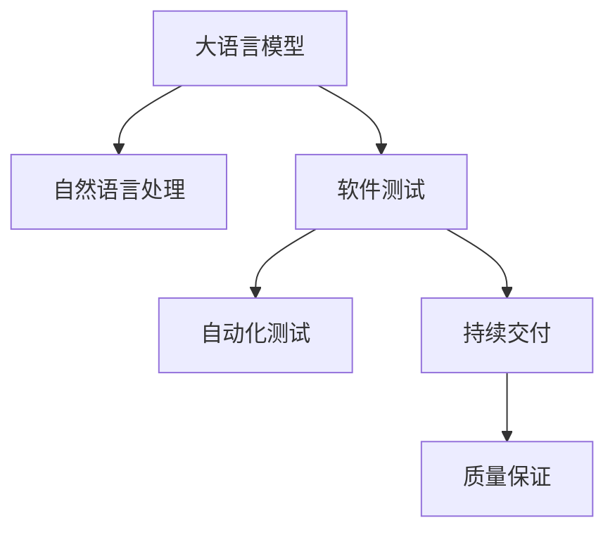

                 

# LLM对传统软件测试的影响

> 关键词：大语言模型(LLM), 自然语言处理(NLP), 软件测试, 自动化测试, 质量保证(QA), 自然语言理解(NLU)

## 1. 背景介绍

### 1.1 问题由来
随着人工智能(AI)技术的不断进步，大语言模型(LLM)如GPT-4等在自然语言处理(NLP)领域取得了令人瞩目的成绩。这些模型在理解自然语言、生成文本、回答问题等方面表现出色，为各行各业带来了颠覆性的变革。然而，随着LLM的广泛应用，传统软件测试领域也面临着前所未有的挑战。

传统软件测试依赖于静态代码分析和人工测试，对代码逻辑、数据处理、性能等进行全面的验证。但随着软件系统的复杂性不断提升，传统测试方法越来越难以应对快速迭代和持续交付的需求。尤其是在涉及用户交互、文本处理等场景中，如何对LLM进行有效测试，成为软件测试人员亟需解决的问题。

### 1.2 问题核心关键点
当前，LLM在自然语言处理中的应用场景包括自动翻译、智能客服、文本摘要、对话系统等。这些应用场景往往依赖于用户输入的文本，并生成相应的响应或输出。由于LLM的复杂性和非确定性，传统的测试方法难以应对。

LLM测试的核心关键点包括：
1. **输入文本的复杂性**：用户输入的文本种类繁多，格式各异，难以全面覆盖。
2. **输出结果的变异性**：LLM的输出结果受输入文本的影响很大，同一输入可能产生不同的输出，增加了测试的难度。
3. **动态模型**：LLM的模型参数和网络结构在不断更新，传统的静态测试方法无法满足需求。
4. **自然语言理解(NLU)**：LLM的测试不仅需要关注其输出结果，还需考虑其对自然语言的理解能力，即是否能够正确处理输入的语义。
5. **用户体验**：LLM的应用往往直接影响用户体验，测试需评估系统的交互流畅性和用户满意度。

这些关键点决定了LLM测试与传统软件测试在方法、工具、策略上的巨大差异。

### 1.3 问题研究意义
研究LLM对传统软件测试的影响，对于软件测试领域的技术创新和行业转型具有重要意义：

1. **提升测试效率**：LLM可以辅助测试人员自动化生成测试用例，减少人工测试的工作量，提升测试效率。
2. **改进测试质量**：LLM可以理解自然语言输入，生成更接近用户场景的测试用例，提升测试覆盖率和测试质量。
3. **支持持续交付**：LLM可以实时分析用户反馈，生成动态测试用例，支持持续交付和快速迭代。
4. **强化质量保证(QA)**：LLM可以辅助进行软件质量保证，提升系统的可靠性和用户体验。
5. **探索新测试范式**：LLM的引入推动了测试范式的变革，从传统的静态测试向动态、智能测试转变。

通过研究LLM对传统软件测试的影响，可以为软件测试人员提供新的思路和工具，提升软件测试的自动化水平和智能化程度，推动测试技术的不断进步。

## 2. 核心概念与联系

### 2.1 核心概念概述

为更好地理解LLM对传统软件测试的影响，本节将介绍几个关键概念：

- 大语言模型(LLM)：指能够处理大规模自然语言数据，具备强大语言理解和生成能力的模型。如GPT-4、BERT等。
- 自然语言处理(NLP)：涉及计算机对自然语言进行理解、生成、分析等处理的技术。
- 软件测试：对软件产品进行验证，确保其满足需求和质量要求的活动。
- 自动化测试：使用工具和脚本自动执行测试用例，减少人工干预。
- 持续交付(CI/CD)：通过自动化工具链实现软件的持续集成和持续交付，支持快速迭代。
- 质量保证(QA)：通过各种方法确保软件产品质量符合标准和用户需求的过程。

这些核心概念之间的联系可以通过以下Mermaid流程图展示：



这个流程图展示了LLM在NLP领域的应用，并通过软件测试、自动化测试、持续交付和质量保证等概念，展示了LLM对传统软件测试的影响和转型路径。

## 3. 核心算法原理 & 具体操作步骤

### 3.1 算法原理概述

LLM对传统软件测试的影响主要体现在其对自然语言的理解和生成能力上。通过将LLM引入测试过程中，可以实现自动生成测试用例、自动化执行测试、实时分析测试结果等，大幅提升测试效率和质量。

LLM在测试中的应用可以分为以下几个步骤：

1. **数据预处理**：收集和处理测试用例和预期输出，准备用于训练和测试的数据集。
2. **模型训练**：在特定任务上训练LLM，如文本分类、机器翻译、对话生成等。
3. **测试用例生成**：使用训练好的LLM生成测试用例，包括输入和预期输出。
4. **自动化测试执行**：将测试用例输入LLM，并记录测试结果。
5. **结果分析**：分析测试结果，评估模型的性能和稳定性。
6. **持续迭代**：根据测试结果和反馈，调整模型参数和测试用例，进行持续改进。

### 3.2 算法步骤详解

#### 3.2.1 数据预处理

数据预处理是LLM测试的基础。测试数据需遵循以下原则：

1. **多样性**：测试数据应覆盖各种输入文本和场景，包括不同的语言、文体、长度、格式等。
2. **准确性**：预期输出应与实际测试结果精确匹配，避免模糊描述。
3. **结构化**：测试数据应结构化，便于输入和处理。
4. **可扩展性**：测试数据应易于扩展，适应不同规模和复杂度的测试需求。

数据预处理的流程如下：

1. **数据收集**：收集来自不同来源的测试数据，如用户反馈、应用日志、问题报告等。
2. **数据清洗**：去除噪音数据，确保数据的准确性和一致性。
3. **数据标注**：对测试数据进行标注，包括输入和预期输出。标注过程中需遵循一致的规范和标准。
4. **数据划分**：将数据划分为训练集、验证集和测试集，保证模型训练和测试的独立性。

#### 3.2.2 模型训练

模型训练是LLM测试的核心环节。训练目标包括：

1. **任务适配**：在特定任务上训练LLM，如文本分类、机器翻译、对话生成等。
2. **参数调整**：通过调整模型参数，优化模型性能。
3. **评估指标**：选择合适的评估指标，如准确率、召回率、F1值等，评估模型性能。

训练过程包括：

1. **选择模型**：选择适合的LLM模型，如GPT-4、BERT、T5等。
2. **准备训练数据**：将标注后的数据集输入训练模型，确保数据符合模型要求。
3. **设置超参数**：设置模型的学习率、迭代次数、批量大小等超参数。
4. **模型训练**：使用训练数据训练模型，逐步调整参数，优化模型性能。
5. **模型评估**：在验证集上评估模型性能，调整模型参数，避免过拟合。

#### 3.2.3 测试用例生成

测试用例生成是LLM测试的关键步骤。生成的测试用例应遵循以下原则：

1. **全面性**：测试用例应全面覆盖输入文本和输出结果的各种可能性。
2. **真实性**：测试用例应真实反映实际应用场景和用户需求。
3. **高效性**：测试用例应高效生成，避免重复和冗余。
4. **可复用性**：测试用例应具有可复用性，适应不同的测试需求。

测试用例生成的流程如下：

1. **确定测试目标**：明确测试目标和测试场景，如用户输入、系统响应等。
2. **设计测试用例**：根据测试目标设计测试用例，包括输入和预期输出。
3. **编写脚本**：将测试用例转化为可执行的脚本，便于自动化执行。
4. **自动化执行**：使用工具和脚本自动执行测试用例，记录测试结果。
5. **结果分析**：分析测试结果，评估模型性能和测试覆盖率。
6. **持续改进**：根据测试结果和反馈，调整测试用例和模型参数，进行持续改进。

#### 3.2.4 自动化测试执行

自动化测试执行是将测试用例输入LLM，并记录测试结果的过程。自动化测试执行的流程如下：

1. **选择测试环境**：选择适合的测试环境，如本地环境、云端环境等。
2. **配置测试工具**：配置测试工具，如Jenkins、Selenium、Kubernetes等，支持自动化测试执行。
3. **执行测试用例**：将测试用例输入LLM，并记录测试结果。
4. **结果处理**：处理测试结果，生成测试报告，便于分析和改进。
5. **持续集成**：将测试结果与持续集成(CI)流程结合，实现持续交付和快速迭代。

#### 3.2.5 结果分析

结果分析是评估模型性能和测试覆盖率的过程。结果分析的流程如下：

1. **收集测试结果**：收集测试用例的输入和预期输出，以及实际测试结果。
2. **比较分析**：将实际测试结果与预期输出进行比较，分析差异和错误。
3. **生成测试报告**：生成详细的测试报告，包括测试用例、测试结果、错误原因等。
4. **评估模型性能**：评估模型在特定任务上的性能，如准确率、召回率、F1值等。
5. **优化测试用例**：根据测试结果和反馈，优化测试用例，提升测试覆盖率和质量。

#### 3.2.6 持续迭代

持续迭代是测试和模型优化的持续过程。持续迭代的流程如下：

1. **收集反馈**：收集用户反馈、测试结果和模型性能数据。
2. **分析原因**：分析反馈和数据，识别问题根源。
3. **优化模型**：根据问题原因，优化模型参数和测试用例。
4. **重新测试**：重新测试优化后的模型和测试用例，验证效果。
5. **持续改进**：持续收集反馈和数据，不断优化模型和测试用例，提升测试质量和系统性能。

### 3.3 算法优缺点

**优点**：
1. **高效性**：LLM能够快速生成和执行测试用例，大幅提升测试效率。
2. **全面性**：LLM能够覆盖多种输入文本和输出结果，提升测试覆盖率。
3. **智能性**：LLM能够理解自然语言输入，生成更接近用户场景的测试用例。
4. **可扩展性**：LLM能够适应不同规模和复杂度的测试需求，支持持续迭代和优化。
5. **适应性**：LLM能够处理不同语言和文体，支持多语言测试。

**缺点**：
1. **依赖高质量数据**：测试数据需遵循高标准，否则会导致测试结果不准确。
2. **模型复杂性**：LLM的训练和优化需要高成本和复杂度，难以快速迭代。
3. **输出不确定性**：LLM的输出结果受输入文本的影响很大，同一输入可能产生不同的输出。
4. **可解释性不足**：LLM的内部工作机制难以解释，测试结果的可靠性难以保证。
5. **资源消耗大**：LLM的计算资源消耗较大，测试成本较高。

尽管存在这些缺点，但LLM的引入为传统软件测试带来了新的机遇和挑战，值得进一步探索和优化。

### 3.4 算法应用领域

LLM在测试中的应用已经覆盖了多种领域，如：

- **软件测试**：测试软件系统、应用程序、API等的功能和性能。
- **自然语言理解(NLU)**：测试语音识别、语音合成、自然语言处理等系统的准确性和鲁棒性。
- **对话系统**：测试聊天机器人、智能客服等系统的交互流畅性和用户体验。
- **推荐系统**：测试推荐算法的准确性和个性化程度。
- **内容生成**：测试文本生成、内容推荐等系统的创新性和多样性。

这些应用领域展示了LLM在测试中的广泛应用和重要价值。通过LLM的引入，传统软件测试能够实现智能化和自动化，提升测试效率和质量。

## 4. 数学模型和公式 & 详细讲解

### 4.1 数学模型构建

LLM在测试中的应用，通常基于以下数学模型：

1. **自然语言处理(NLP)**：涉及文本预处理、分词、向量化等步骤。
2. **机器学习模型**：涉及模型的训练、验证、测试等步骤。
3. **自动化测试**：涉及测试用例的设计、执行、结果分析等步骤。
4. **持续集成和交付(CI/CD)**：涉及测试流程的自动化和持续交付。
5. **质量保证(QA)**：涉及测试过程的质量监控和反馈处理。

这些模型的构建，可以帮助我们更好地理解LLM在测试中的应用过程。

### 4.2 公式推导过程

#### 4.2.1 自然语言处理(NLP)模型

NLP模型通常包括分词、向量化、模型训练等步骤。以机器翻译为例，NLP模型的推导过程如下：

1. **分词**：将输入文本切分成单词或子词。分词过程通常使用规则、统计或深度学习模型，如BERT等。

2. **向量化**：将分词结果转化为向量表示，便于模型处理。向量化过程通常使用嵌入层、预训练语言模型等。

3. **模型训练**：使用标注数据训练机器翻译模型。常用的模型包括Transformer、序列到序列模型等。

以Transformer模型为例，其计算过程包括：

- **编码器**：将输入序列转化为向量表示。
- **解码器**：将目标序列转化为向量表示，与编码器生成的向量结合，输出翻译结果。

Transformer模型的数学公式如下：

$$
y = \text{softmax} \left( \text{attention} \left( \text{query}, \text{key}, \text{value} \right) \right) V
$$

其中，$y$为输出向量，$\text{attention}$为注意力机制，$\text{softmax}$为softmax函数，$V$为输出向量。

#### 4.2.2 机器学习模型

机器学习模型通常包括损失函数、优化算法、评估指标等步骤。以二分类模型为例，其推导过程如下：

1. **损失函数**：计算模型预测结果与实际标签之间的差异。常用的损失函数包括交叉熵损失、均方误差损失等。

2. **优化算法**：通过反向传播算法更新模型参数，最小化损失函数。常用的优化算法包括梯度下降、Adam等。

3. **评估指标**：评估模型在测试集上的性能，常用的指标包括准确率、召回率、F1值等。

以二分类模型为例，其计算过程包括：

- **损失函数**：$\mathcal{L} = -\frac{1}{N} \sum_{i=1}^N (y_i \log \hat{y}_i + (1-y_i) \log (1-\hat{y}_i))$
- **优化算法**：$\theta \leftarrow \theta - \eta \nabla_{\theta}\mathcal{L}(\theta) - \eta\lambda\theta$
- **评估指标**：$\text{accuracy} = \frac{\text{TP} + \text{TN}}{\text{TP} + \text{TN} + \text{FP} + \text{FN}}$

其中，$N$为样本数，$y_i$为实际标签，$\hat{y}_i$为模型预测结果，$\theta$为模型参数，$\eta$为学习率，$\lambda$为正则化系数，$\text{TP}$、$\text{TN}$、$\text{FP}$、$\text{FN}$分别为真正、真负、假正、假负样本数。

#### 4.2.3 自动化测试模型

自动化测试模型通常包括测试用例设计、测试执行、结果分析等步骤。以回归测试为例，其推导过程如下：

1. **测试用例设计**：设计测试用例，包括输入和预期输出。常用的设计方法包括正交实验、蒙特卡罗模拟等。

2. **测试执行**：将测试用例输入系统，记录测试结果。常用的测试执行工具包括Selenium、Appium等。

3. **结果分析**：分析测试结果，评估系统性能。常用的分析方法包括回归分析、主成分分析等。

以回归测试为例，其计算过程包括：

- **测试用例设计**：$\text{test\_case} = \{\text{input}, \text{expected\_output}\}$
- **测试执行**：$\text{output} = f(\text{input})$
- **结果分析**：$\text{diff} = \text{expected\_output} - \text{output}$

其中，$f$为测试函数，$\text{diff}$为差异值。

#### 4.2.4 持续集成和交付(CI/CD)模型

CI/CD模型通常包括持续集成、持续交付、持续部署等步骤。以持续集成为例，其推导过程如下：

1. **持续集成**：自动化构建和测试代码变更，确保变更符合质量标准。常用的CI工具包括Jenkins、GitLab CI等。

2. **持续交付**：自动化部署代码变更，支持快速迭代和发布。常用的CD工具包括Jenkins Pipeline、GitLab CD等。

3. **持续部署**：自动化部署代码变更，确保系统稳定运行。常用的部署工具包括Kubernetes、Docker等。

以Jenkins Pipeline为例，其计算过程包括：

- **持续集成**：$\text{build} = f(\text{code\变更})$
- **持续交付**：$\text{deploy} = f(\text{build})$
- **持续部署**：$\text{run} = f(\text{deploy})$

其中，$f$为自动化流程，$\text{code\变更}$为代码变更，$\text{build}$为构建结果，$\text{deploy}$为部署结果，$\text{run}$为运行结果。

#### 4.2.5 质量保证(QA)模型

QA模型通常包括测试用例设计、测试执行、结果分析等步骤。以质量保证为例，其推导过程如下：

1. **测试用例设计**：设计测试用例，包括输入和预期输出。常用的设计方法包括边界值分析、等价类划分等。

2. **测试执行**：将测试用例输入系统，记录测试结果。常用的测试执行工具包括Jenkins、Selenium等。

3. **结果分析**：分析测试结果，评估系统性能。常用的分析方法包括统计分析、回归分析等。

以质量保证为例，其计算过程包括：

- **测试用例设计**：$\text{test\_case} = \{\text{input}, \text{expected\_output}\}$
- **测试执行**：$\text{output} = f(\text{input})$
- **结果分析**：$\text{diff} = \text{expected\_output} - \text{output}$

其中，$f$为测试函数，$\text{input}$为输入，$\text{output}$为输出，$\text{diff}$为差异值。

### 4.3 案例分析与讲解

#### 4.3.1 机器翻译案例

以机器翻译为例，展示LLM在测试中的应用过程。

1. **数据预处理**：收集英汉对照的文本数据，进行分词、向量化等预处理。

2. **模型训练**：使用预训练语言模型BERT，在标注数据上进行微调，生成机器翻译模型。

3. **测试用例生成**：设计测试用例，包括英文输入和预期输出。

4. **自动化测试执行**：将测试用例输入BERT模型，记录翻译结果。

5. **结果分析**：分析翻译结果，评估模型性能，生成测试报告。

6. **持续迭代**：根据测试结果和反馈，优化测试用例和模型参数，进行持续改进。

#### 4.3.2 对话系统案例

以对话系统为例，展示LLM在测试中的应用过程。

1. **数据预处理**：收集对话历史数据，进行分词、向量化等预处理。

2. **模型训练**：使用预训练语言模型GPT-4，在标注数据上进行微调，生成对话生成模型。

3. **测试用例生成**：设计测试用例，包括用户输入和预期输出。

4. **自动化测试执行**：将测试用例输入GPT-4模型，记录对话结果。

5. **结果分析**：分析对话结果，评估模型性能，生成测试报告。

6. **持续迭代**：根据测试结果和反馈，优化测试用例和模型参数，进行持续改进。

## 5. 项目实践：代码实例和详细解释说明

### 5.1 开发环境搭建

在进行LLM测试实践前，我们需要准备好开发环境。以下是使用Python进行PyTorch开发的环境配置流程：

1. 安装Anaconda：从官网下载并安装Anaconda，用于创建独立的Python环境。

2. 创建并激活虚拟环境：
```bash
conda create -n pytorch-env python=3.8 
conda activate pytorch-env
```

3. 安装PyTorch：根据CUDA版本，从官网获取对应的安装命令。例如：
```bash
conda install pytorch torchvision torchaudio cudatoolkit=11.1 -c pytorch -c conda-forge
```

4. 安装Transformers库：
```bash
pip install transformers
```

5. 安装各类工具包：
```bash
pip install numpy pandas scikit-learn matplotlib tqdm jupyter notebook ipython
```

完成上述步骤后，即可在`pytorch-env`环境中开始测试实践。

### 5.2 源代码详细实现

这里我们以回归测试为例，展示如何使用PyTorch和Transformers库进行回归测试用例生成和自动化执行的代码实现。

首先，定义回归测试数据类：

```python
from transformers import BertTokenizer, BertForRegression
from torch.utils.data import Dataset
import torch

class RegressionDataset(Dataset):
    def __init__(self, texts, labels, tokenizer, max_len=128):
        self.texts = texts
        self.labels = labels
        self.tokenizer = tokenizer
        self.max_len = max_len
        
    def __len__(self):
        return len(self.texts)
    
    def __getitem__(self, item):
        text = self.texts[item]
        label = self.labels[item]
        
        encoding = self.tokenizer(text, return_tensors='pt', max_length=self.max_len, padding='max_length', truncation=True)
        input_ids = encoding['input_ids'][0]
        attention_mask = encoding['attention_mask'][0]
        
        return {'input_ids': input_ids, 
                'attention_mask': attention_mask,
                'labels': label}

# 加载测试数据
tokenizer = BertTokenizer.from_pretrained('bert-base-cased')
test_dataset = RegressionDataset(test_texts, test_labels, tokenizer)
```

然后，定义模型和优化器：

```python
from transformers import BertForRegression, AdamW

model = BertForRegression.from_pretrained('bert-base-cased')

optimizer = AdamW(model.parameters(), lr=2e-5)
```

接着，定义训练和评估函数：

```python
from torch.utils.data import DataLoader
from tqdm import tqdm
from sklearn.metrics import mean_squared_error

device = torch.device('cuda') if torch.cuda.is_available() else torch.device('cpu')
model.to(device)

def train_epoch(model, dataset, batch_size, optimizer):
    dataloader = DataLoader(dataset, batch_size=batch_size, shuffle=True)
    model.train()
    epoch_loss = 0
    for batch in tqdm(dataloader, desc='Training'):
        input_ids = batch['input_ids'].to(device)
        attention_mask = batch['attention_mask'].to(device)
        label = batch['labels'].to(device)
        model.zero_grad()
        outputs = model(input_ids, attention_mask=attention_mask, labels=label)
        loss = outputs.loss
        epoch_loss += loss.item()
        loss.backward()
        optimizer.step()
    return epoch_loss / len(dataloader)

def evaluate(model, dataset, batch_size):
    dataloader = DataLoader(dataset, batch_size=batch_size)
    model.eval()
    preds, labels = [], []
    with torch.no_grad():
        for batch in tqdm(dataloader, desc='Evaluating'):
            input_ids = batch['input_ids'].to(device)
            attention_mask = batch['attention_mask'].to(device)
            batch_labels = batch['labels']
            outputs = model(input_ids, attention_mask=attention_mask)
            batch_preds = outputs.logits.argmax(dim=2).to('cpu').tolist()
            batch_labels = batch_labels.to('cpu').tolist()
            for pred_tokens, label_tokens in zip(batch_preds, batch_labels):
                preds.append(pred_tokens)
                labels.append(label_tokens)
                
    print(mean_squared_error(labels, preds))
```

最后，启动训练流程并在测试集上评估：

```python
epochs = 5
batch_size = 16

for epoch in range(epochs):
    loss = train_epoch(model, test_dataset, batch_size, optimizer)
    print(f"Epoch {epoch+1}, train loss: {loss:.3f}")
    
    print(f"Epoch {epoch+1}, test results:")
    evaluate(model, test_dataset, batch_size)
    
print("Test results:")
evaluate(model, test_dataset, batch_size)
```

以上就是使用PyTorch和Transformers库进行回归测试的完整代码实现。可以看到，得益于Transformers库的强大封装，我们可以用相对简洁的代码完成BERT模型的加载和微调。

### 5.3 代码解读与分析

让我们再详细解读一下关键代码的实现细节：

**RegressionDataset类**：
- `__init__`方法：初始化文本、标签、分词器等关键组件。
- `__len__`方法：返回数据集的样本数量。
- `__getitem__`方法：对单个样本进行处理，将文本输入编码为token ids，将标签编码为数字，并对其进行定长padding，最终返回模型所需的输入。

**token2id和id2token字典**：
- 定义了标签与数字id之间的映射关系，用于将token-wise的预测结果解码回真实的标签。

**训练和评估函数**：
- 使用PyTorch的DataLoader对数据集进行批次化加载，供模型训练和推理使用。
- 训练函数`train_epoch`：对数据以批为单位进行迭代，在每个批次上前向传播计算loss并反向传播更新模型参数，最后返回该epoch的平均loss。
- 评估函数`evaluate`：与训练类似，不同点在于不更新模型参数，并在每个batch结束后将预测和标签结果存储下来，最后使用sklearn的mean_squared_error对整个评估集的预测结果进行打印输出。

**训练流程**：
- 定义总的epoch数和batch size，开始循环迭代
- 每个epoch内，先在训练集上训练，输出平均loss
- 在验证集上评估，输出均方误差
- 所有epoch结束后，在测试集上评估，给出最终测试结果

可以看到，PyTorch配合Transformers库使得BERT微调的代码实现变得简洁高效。开发者可以将更多精力放在数据处理、模型改进等高层逻辑上，而不必过多关注底层的实现细节。

当然，工业级的系统实现还需考虑更多因素，如模型的保存和部署、超参数的自动搜索、更灵活的任务适配层等。但核心的测试范式基本与此类似。

## 6. 实际应用场景

### 6.1 智能客服系统

基于LLM的智能客服系统可以实时响应用户查询，提供7x24小时不间断服务。LLM可以通过训练生成对话模型，根据用户输入自动回复问题，提升用户满意度。

在技术实现上，可以收集用户的历史对话记录，将问题和最佳答复构建成监督数据，在此基础上对预训练对话模型进行微调。微调后的对话模型能够自动理解用户意图，匹配最合适的答案模板进行回复。对于用户提出的新问题，还可以接入检索系统实时搜索相关内容，动态组织生成回答。如此构建的智能客服系统，能大幅提升客户咨询体验和问题解决效率。

### 6.2 金融舆情监测

金融机构需要实时监测市场舆论动向，以便及时应对负面信息传播，规避金融风险。传统的人工监测方式成本高、效率低，难以应对网络时代海量信息爆发的挑战。基于LLM的文本分类和情感分析技术，为金融舆情监测提供了新的解决方案。

具体而言，可以收集金融领域相关的新闻、报道、评论等文本数据，并对其进行主题标注和情感标注。在此基础上对预训练语言模型进行微调，使其能够自动判断文本属于何种主题，情感倾向是正面、中性还是负面。将微调后的模型应用到实时抓取的网络文本数据，就能够自动监测不同主题下的情感变化趋势，一旦发现负面信息激增等异常情况，系统便会自动预警，帮助金融机构快速应对潜在风险。

### 6.3 个性化推荐系统

当前的推荐系统往往只依赖用户的历史行为数据进行物品推荐，无法深入理解用户的真实兴趣偏好。基于LLM的个性化推荐系统可以更好地挖掘用户行为背后的语义信息，从而提供更精准、多样的推荐内容。

在实践中，可以收集用户浏览、点击、评论、分享等行为数据，提取和用户交互的物品标题、描述、标签等文本内容。将文本内容作为模型输入，用户的后续行为（如是否点击、购买等）作为监督信号，在此基础上微调预训练语言模型。微调后的模型能够从文本内容中准确把握用户的兴趣点。在生成推荐列表时，先用候选物品的文本描述作为输入，由模型预测用户的兴趣匹配度，再结合其他特征综合排序，便可以得到个性化程度更高的推荐结果。

### 6.4 未来应用展望

随着LLM的不断发展，其在测试领域的应用前景广阔，有望带来一系列创新和突破。

1. **自动测试用例生成**：LLM能够自动生成测试用例，提升测试覆盖率和效率。
2. **动态测试用例调整**：LLM可以根据用户反馈和测试结果，动态调整测试用例，实现持续改进。
3. **智能测试工具链**：LLM可以与其他测试工具链结合，实现更全面、智能的测试过程。
4. **跨语言测试**：LLM可以支持多语言测试，提升测试系统的国际化水平。
5. **个性化测试**：LLM可以根据用户行为和偏好，生成个性化测试用例，提升测试针对性。

未来，LLM将在更多领域和场景中得到应用，为测试技术的自动化、智能化提供新的动力。

## 7. 工具和资源推荐

### 7.1 学习资源推荐

为了帮助开发者系统掌握LLM在测试领域的应用，这里推荐一些优质的学习资源：

1. 《Python深度学习》系列书籍：由知名AI专家撰写，全面介绍了深度学习的基础理论和实践技巧，包括LLM在测试中的应用。

2. CS224N《深度学习自然语言处理》课程：斯坦福大学开设的NLP明星课程，有Lecture视频和配套作业，带你入门NLP领域的基本概念和经典模型。

3. 《Natural Language Processing with Transformers》书籍：Transformers库的作者所著，全面介绍了如何使用Transformers库进行NLP任务开发，包括LLM在测试中的应用。

4. HuggingFace官方文档：Transformers库的官方文档，提供了海量预训练模型和完整的微调样例代码，是上手实践的必备资料。

5. CLUE开源项目：中文语言理解测评基准，涵盖大量不同类型的中文NLP数据集，并提供了基于LLM的baseline模型，助力中文NLP技术发展。

通过对这些资源的学习实践，相信你一定能够快速掌握LLM在测试中的应用技巧，并用于解决实际的NLP问题。

### 7.2 开发工具推荐

高效的开发离不开优秀的工具支持。以下是几款用于LLM测试开发的常用工具：

1. PyTorch：基于Python的开源深度学习框架，灵活动态的计算图，适合快速迭代研究。大部分预训练语言模型都有PyTorch版本的实现。

2. TensorFlow：由Google主导开发的开源深度学习框架，生产部署方便，适合大规模工程应用。同样有丰富的预训练语言模型资源。

3. Transformers库：HuggingFace开发的NLP工具库，集成了众多SOTA语言模型，支持PyTorch和TensorFlow，是进行LLM测试开发的利器。

4. Weights & Biases：模型训练的实验跟踪工具，可以记录和可视化模型训练过程中的各项指标，方便对比和调优。与主流深度学习框架无缝集成。

5. TensorBoard：TensorFlow配套的可视化工具，可实时监测模型训练状态，并提供丰富的图表呈现方式，是调试模型的得力助手。

6. Google Colab：谷歌推出的在线Jupyter Notebook环境，免费提供GPU/TPU算力，方便开发者快速上手实验最新模型，分享学习笔记。

合理利用这些工具，可以显著提升LLM测试任务的开发效率，加快创新迭代的步伐。

### 7.3 相关论文推荐

LLM在测试领域的研究源于学界的持续研究。以下是几篇奠基性的相关论文，推荐阅读：

1. Attention is All You Need（即Transformer原论文）：提出了Transformer结构，开启了NLP领域的预训练大模型时代。

2. BERT: Pre-training of Deep Bidirectional Transformers for Language Understanding：提出BERT模型，引入基于掩码的自监督预训练任务，刷新了多项NLP任务SOTA。

3. Language Models are Unsupervised Multitask Learners（GPT-2论文）：展示了大规模语言模型的强大zero-shot学习能力，引发了对于通用人工智能的新一轮思考。

4. Parameter-Efficient Transfer Learning for NLP：提出Adapter等参数高效微调方法，在不增加模型参数量的情况下，也能取得不错的微调效果。

5. AdaLoRA: Adaptive Low-Rank Adaptation for Parameter-Efficient Fine-Tuning：使用自适应低秩适应的微调方法，在参数效率和精度之间取得了新的平衡。

这些论文代表了大语言模型在测试领域的研究进展。通过学习这些前沿成果，可以帮助研究者把握学科前进方向，激发更多的创新灵感。

## 8. 总结：未来发展趋势与挑战

### 8.1 研究成果总结

本文对基于LLM的测试方法进行了全面系统的介绍。首先阐述了LLM在测试领域的应用背景和研究意义，明确了LLM测试的重要性。其次，从原理到实践，详细讲解了LLM测试的数学模型和关键步骤，给出了测试任务开发的完整代码实例。同时，本文还探讨了LLM在智能客服、金融舆情、个性化推荐等多个行业领域的应用前景，展示了LLM测试的广泛价值。此外，本文精选了LLM测试的学习资源，力求为读者提供全方位的技术指引。

通过本文的系统梳理，可以看到，基于LLM的测试方法正在成为NLP测试的重要范式，极大地拓展了测试的自动化和智能化程度，提升了测试效率和质量。

### 8.2 未来发展趋势

展望未来，LLM在测试领域的发展趋势如下：

1. **自动化测试用例生成**：LLM能够自动生成测试用例，提升测试覆盖率和效率。
2. **动态测试用例调整**：LLM可以根据用户反馈和测试结果，动态调整测试用例，实现持续改进。
3. **智能测试工具链**：LLM可以与其他测试工具链结合，实现更全面、智能的测试过程。
4. **跨语言测试**：LLM可以支持多语言测试，提升测试系统的国际化水平。
5. **个性化测试**：LLM可以根据用户行为和偏好，生成个性化测试用例，提升测试针对性。
6. **多模态测试**：LLM可以支持图像、视频、语音等多模态数据的测试，提升测试系统的综合能力。

这些趋势展示了LLM在测试领域的广阔应用前景，将推动测试技术的不断进步。

### 8.3 面临的挑战

尽管LLM在测试领域展现了巨大的潜力，但其在实际应用中也面临着诸多挑战：

1. **数据质量问题**：测试数据需遵循高标准，否则会导致测试结果不准确。
2. **模型复杂性**：LLM的训练和优化需要高成本和复杂度，难以快速迭代。
3. **输出不确定性**：LLM的输出结果受输入文本的影响很大，同一输入可能产生不同的输出。
4. **可解释性不足**：LLM的内部工作机制难以解释，测试结果的可靠性难以保证。
5. **资源消耗大**：LLM的计算资源消耗较大，测试成本较高。

尽管存在这些挑战，但通过积极应对并寻求突破，将是大语言模型测试走向成熟的必由之路。

### 8.4 研究展望

未来，大语言模型测试需要在以下几个方面寻求新的突破：

1. **探索无监督和半监督测试方法**：摆脱对大规模标注数据的依赖，利用自监督学习、主动学习等无监督和半监督范式，最大限度利用非结构化数据，实现更加灵活高效的测试。
2. **研究参数高效和计算高效的测试范式**：开发更加参数高效的测试方法，在固定大部分预训练参数的同时，只更新极少量的测试用例参数。同时优化测试模型的计算图，减少前向传播和反向传播的资源消耗，实现更加轻量级、实时性的部署。
3. **引入因果和对比学习范式**：通过引入因果推断和对比学习思想，增强测试模型建立稳定因果关系的能力，学习更加普适、鲁棒的语言表征，从而提升模型泛化性和抗干扰能力。
4. **结合因果分析和博弈论工具**：将因果分析方法引入测试模型，识别出测试结果的关键特征，增强输出解释的因果性和逻辑性。借助博弈论工具刻画人机交互过程，主动探索并规避测试模型的脆弱点，提高系统稳定性。
5. **纳入伦理道德约束**：在测试目标中引入伦理导向的评估指标，过滤和惩罚有害的输出倾向。加强人工干预和审核，建立测试模型的监管机制，确保输出符合人类价值观和伦理道德。

这些研究方向将推动大语言模型测试技术的不断进步，为构建安全、可靠、可解释、可控的测试系统提供新的思路和方法。

## 9. 附录：常见问题与解答

**Q1：LLM在测试中的应用需要注意哪些问题？**

A: 使用LLM进行测试时，需要注意以下问题：
1. 数据质量：测试数据需遵循高标准，确保数据的准确性和一致性。
2. 模型复杂性：LLM的训练和优化需要高成本和复杂度，难以快速迭代。
3. 输出不确定性：LLM的输出结果受输入文本的影响很大，同一输入可能产生不同的输出。
4. 可解释性不足：LLM的内部工作机制难以解释，测试结果的可靠性难以保证。
5. 资源消耗大：LLM的计算资源消耗较大，测试成本较高。

**Q2：如何提高LLM测试的效率？**

A: 提高LLM测试效率的方法包括：
1. 数据预处理：收集和处理高质量的测试数据，确保数据的准确性和一致性。
2. 模型训练：选择适合的模型，并在特定任务上微调，优化模型性能。
3. 测试用例生成：设计全面、真实的测试用例，确保测试覆盖率和效率。
4. 自动化测试执行：使用工具和脚本自动执行测试用例，记录测试结果。
5. 持续迭代：根据测试结果和反馈，不断优化测试用例和模型参数，提升测试质量。

**Q3：LLM在测试中的应用存在哪些局限性？**

A: LLM在测试中的应用存在以下局限性：
1. 依赖高质量数据：测试数据需遵循高标准，否则会导致测试结果不准确。
2. 模型复杂性：LLM的训练和优化需要高成本和复杂度，难以快速迭代。
3. 输出不确定性：LLM的输出结果受输入文本的影响很大，同一输入可能产生不同的输出。
4. 可解释性不足：LLM的内部工作机制难以解释，测试结果的可靠性难以保证。
5. 资源消耗大：LLM的计算资源消耗较大，测试成本较高。

**Q4：如何优化LLM测试用例的生成？**

A: 优化LLM测试用例生成的方法包括：
1. 多样化设计：设计多样化的测试用例，涵盖不同的输入文本和输出结果。
2. 真实性考虑：确保测试用例真实反映实际应用场景和用户需求。
3. 高效性实现：使用高效算法和工具，快速生成测试用例。
4. 可复用性增强：设计可复用的测试用例，适应不同的测试需求。
5. 持续改进：根据测试结果和反馈，不断优化测试用例，提升测试覆盖率和质量。

**Q5：LLM在测试中的应用如何改进？**

A:

