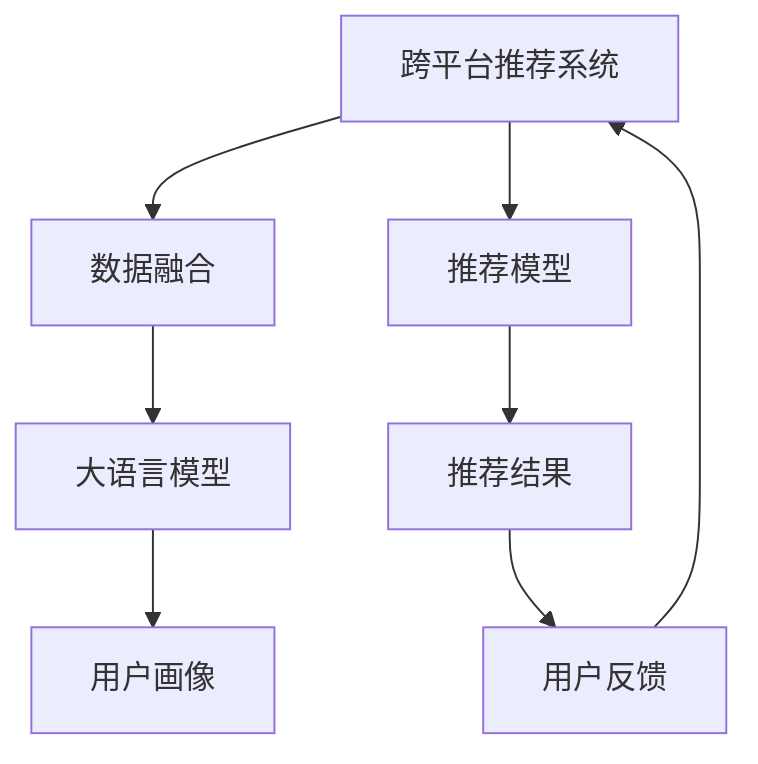

                 

# LLM推荐中的跨平台用户画像统一

## 1. 背景介绍

随着互联网技术的飞速发展，跨平台推荐系统在电商、社交、视频等多个领域中得到了广泛应用。用户在各个平台上的行为数据能够为推荐系统提供丰富的参考信息，帮助模型更好地理解用户偏好，提升推荐效果。然而，不同平台的数据格式、统计方式、甚至是描述维度存在较大差异，难以直接融合统一。为了更好地利用多平台数据进行推荐，如何构建统一的用户画像成为了一大挑战。

本文将聚焦于大语言模型(LLM)在跨平台推荐中的应用，探讨如何通过大模型进行用户画像的统一建模，从而实现高效的多平台推荐。我们首先简要回顾跨平台推荐系统的挑战，接着详细介绍基于大语言模型的跨平台用户画像统一框架，最后展望该框架在实际应用中的潜力和前景。

## 2. 核心概念与联系

为了更好地理解跨平台推荐系统，我们需要了解一些核心概念和它们之间的关系。以下是相关概念的概述：

- **跨平台推荐系统**：通过多平台数据融合，构建统一的推荐模型，为用户提供跨平台个性化的推荐服务。这可以显著提升用户的体验，增加平台的粘性。

- **用户画像**：通过分析用户在不同平台上的行为数据，建立用户多维度的特征描述，用于指导推荐模型的决策。用户画像的精细程度直接影响了推荐的准确性和个性化水平。

- **数据融合**：将来自不同平台的数据格式、指标等进行标准化，统一到统一的特征空间中，为跨平台推荐提供基础数据支撑。

- **大语言模型**：通过自监督学习任务预训练得到的语言模型，具有强大的语言理解和生成能力。利用大模型，可以有效提取和融合用户的多维特征信息，构建高质量的用户画像。

这些概念之间相互关联，构成了一个完整的跨平台推荐系统框架。大语言模型作为其中重要的一环，能够有效融合和抽取多平台的用户行为信息，构建出精准且一致的用户画像。

以下是一个Mermaid流程图，展示了跨平台推荐系统的主要组成部分和它们之间的关系：



图中，数据融合模块负责统一不同平台的数据格式和指标，大语言模型则在此基础上进一步提取和融合用户的特征信息，推荐模型利用这些特征信息进行推荐，用户反馈用于迭代优化推荐模型和大语言模型。

## 3. 核心算法原理 & 具体操作步骤

### 3.1 算法原理概述

基于大语言模型的跨平台用户画像统一，其核心思想是通过预训练语言模型在多平台数据上进行微调，学习到统一的语义表示，进而对用户画像进行统一建模。以下是该方法的主要步骤：

1. **数据预处理**：收集不同平台的用户行为数据，进行清洗、归一化和标准化处理，形成统一的特征格式。

2. **数据融合**：使用大语言模型对融合后的数据进行预训练，学习到统一的语义表示。

3. **用户画像建模**：利用预训练模型和用户行为数据，构建用户多维度的特征描述，形成统一的用户画像。

4. **推荐模型微调**：根据用户画像，对推荐模型进行微调，优化推荐效果。

### 3.2 算法步骤详解

以下详细介绍每个步骤的实现细节：

**Step 1: 数据预处理**

数据预处理是跨平台推荐系统的第一步。其目的是将来自不同平台的数据格式和指标进行统一，形成可供模型处理的格式。具体步骤包括：

- **数据收集**：收集不同平台上的用户行为数据，如电商平台的购买记录、视频平台的观看时长、社交平台的点赞评论等。

- **数据清洗**：去除缺失值、异常值和重复数据，保证数据的质量和完整性。

- **特征提取**：对数据进行特征提取和归一化，形成统一的特征向量。

- **数据融合**：将不同平台的数据进行合并，形成一张统一的用户行为矩阵。

在数据预处理过程中，需要考虑数据隐私和版权问题，确保数据的合法合规使用。

**Step 2: 数据融合**

数据融合是跨平台推荐系统的重要环节。通过大语言模型对融合后的数据进行预训练，可以学习到统一的语义表示，从而形成跨平台的用户画像。具体步骤如下：

- **构建融合数据集**：将不同平台的数据进行合并，形成一张统一的用户行为矩阵。

- **大语言模型预训练**：选择预训练语言模型(如BERT、GPT等)，对融合后的数据进行预训练，学习到统一的语义表示。

- **特征提取**：利用预训练模型提取用户的多维度特征信息，形成统一的特征向量。

- **用户画像建模**：根据提取出的特征信息，构建用户多维度的特征描述，形成统一的跨平台用户画像。

在数据融合过程中，需要考虑数据的多样性和复杂性，选择合适的预训练模型和训练策略。

**Step 3: 用户画像建模**

用户画像建模是跨平台推荐系统的核心环节。通过大语言模型提取和融合用户的多维度特征信息，可以构建出精准且一致的用户画像。具体步骤如下：

- **特征嵌入**：利用预训练模型将用户的特征向量进行嵌入，形成高维的语义表示。

- **特征选择**：根据推荐任务的需求，选择最具代表性的特征，去除冗余信息。

- **特征融合**：对不同特征进行融合，形成用户的多维度特征描述。

- **用户画像构建**：根据融合后的特征，构建用户的多维度画像。

在用户画像建模过程中，需要考虑特征的多样性和代表性，选择合适的特征选择和融合方法。

**Step 4: 推荐模型微调**

推荐模型微调是跨平台推荐系统的最后一步。通过微调推荐模型，可以使其利用统一的跨平台用户画像，提升推荐效果。具体步骤如下：

- **推荐模型选择**：选择合适的推荐算法，如协同过滤、基于深度学习的推荐系统等。

- **模型初始化**：将预训练的跨平台用户画像输入推荐模型，进行初始化。

- **模型微调**：根据用户画像和历史行为数据，对推荐模型进行微调，优化推荐效果。

- **模型评估**：在测试集上评估推荐模型的效果，不断迭代优化。

在推荐模型微调过程中，需要考虑模型的复杂度和性能，选择合适的优化策略和评估指标。

### 3.3 算法优缺点

基于大语言模型的跨平台用户画像统一方法具有以下优点：

1. **高效性**：大语言模型能够高效地提取和融合多平台数据，形成统一的跨平台用户画像。

2. **一致性**：通过统一的语义表示，确保了跨平台用户画像的一致性和可比性。

3. **灵活性**：大语言模型具有强大的迁移学习能力，可以适应多种推荐场景和推荐算法。

4. **可解释性**：大语言模型在提取和融合特征时，能够生成解释性强的语义向量，便于理解和调试。

然而，该方法也存在一些缺点：

1. **数据需求大**：需要收集和处理大量数据，对数据质量和隐私保护提出了较高要求。

2. **计算资源消耗高**：大语言模型参数量大，训练和推理计算消耗较高。

3. **模型复杂度高**：推荐模型和大语言模型都需要进行微调，增加了模型的复杂度。

4. **结果可控性低**：大语言模型的特征提取过程具有一定的随机性，结果可控性相对较低。

### 3.4 算法应用领域

基于大语言模型的跨平台用户画像统一方法，广泛应用于电商、社交、视频等多个领域。以下是主要的应用场景：

- **电商推荐系统**：通过对电商平台的购买记录、浏览记录等数据进行融合，构建统一的跨平台用户画像，提升推荐效果。

- **社交推荐系统**：通过社交平台上的点赞、评论等数据，构建用户画像，进行兴趣推荐和内容推送。

- **视频推荐系统**：利用视频平台的观看记录和互动数据，构建跨平台用户画像，进行内容推荐和个性化推送。

## 4. 数学模型和公式 & 详细讲解

### 4.1 数学模型构建

假设不同平台的用户行为数据分别为 $\{x_1, x_2, ..., x_N\}$，每个用户在不同平台上的行为特征分别表示为 $\{x_{ij}\}_{j=1}^M$，其中 $i$ 为用户编号，$j$ 为平台编号。构建统一的跨平台用户画像的过程可以分为以下几个步骤：

- **数据预处理**：对不同平台的数据进行清洗、归一化和标准化处理，形成统一的特征向量 $X$。

- **数据融合**：将不同平台的数据进行合并，形成一张统一的用户行为矩阵 $X$。

- **大语言模型预训练**：利用预训练语言模型对融合后的数据进行预训练，学习到统一的语义表示 $Z$。

- **特征提取**：利用预训练模型提取用户的多维度特征信息，形成统一的特征向量 $Z$。

- **用户画像建模**：根据提取出的特征信息，构建用户多维度的特征描述，形成统一的跨平台用户画像 $U$。

- **推荐模型微调**：根据用户画像和历史行为数据，对推荐模型进行微调，优化推荐效果。

### 4.2 公式推导过程

**数据预处理**：

$$
X = \{\mathbf{x}_i\}_{i=1}^N
$$

其中，$\mathbf{x}_i$ 表示用户 $i$ 在不同平台上的行为特征。

**数据融合**：

$$
Z = \{\mathbf{z}_i\}_{i=1}^N
$$

其中，$\mathbf{z}_i$ 表示用户 $i$ 的语义表示。

**大语言模型预训练**：

$$
Z = \mathcal{L}_{\text{pre-training}}(X)
$$

其中，$\mathcal{L}_{\text{pre-training}}$ 表示预训练过程。

**特征提取**：

$$
Z = \{\mathbf{z}_i\}_{i=1}^N
$$

其中，$\mathbf{z}_i$ 表示用户 $i$ 的特征向量。

**用户画像建模**：

$$
U = \{\mathbf{u}_i\}_{i=1}^N
$$

其中，$\mathbf{u}_i$ 表示用户 $i$ 的跨平台画像。

**推荐模型微调**：

$$
\theta^* = \mathop{\arg\min}_{\theta} \mathcal{L}(Y, M_{\theta}(X, U))
$$

其中，$\theta$ 表示推荐模型的参数，$M_{\theta}$ 表示推荐模型，$\mathcal{L}$ 表示推荐损失函数。

### 4.3 案例分析与讲解

假设有一个跨平台的电商推荐系统，包含两个平台：电商平台和社交平台。不同平台的用户行为数据分别如下：

- **电商平台数据**：用户 $i$ 在电商平台上的行为数据表示为 $\{x_{i1}\}_{j=1}^M$，其中 $x_{i1}$ 表示用户 $i$ 在电商平台上的行为特征。

- **社交平台数据**：用户 $i$ 在社交平台上的行为数据表示为 $\{x_{i2}\}_{j=1}^M$，其中 $x_{i2}$ 表示用户 $i$ 在社交平台上的行为特征。

将两个平台的数据进行合并，形成一张统一的用户行为矩阵 $X$：

$$
X = \left[\begin{matrix}
x_{11} & x_{12} & \cdots & x_{1M} \\
x_{21} & x_{22} & \cdots & x_{2M} \\
\vdots & \vdots & \ddots & \vdots \\
x_{N1} & x_{N2} & \cdots & x_{NM}
\end{matrix}\right]
$$

使用大语言模型对融合后的数据进行预训练，学习到统一的语义表示 $Z$：

$$
Z = \mathcal{L}_{\text{pre-training}}(X)
$$

利用预训练模型提取用户的多维度特征信息，形成统一的特征向量 $Z$：

$$
Z = \left[\begin{matrix}
z_{11} & z_{12} & \cdots & z_{1M} \\
z_{21} & z_{22} & \cdots & z_{2M} \\
\vdots & \vdots & \ddots & \vdots \\
z_{N1} & z_{N2} & \cdots & z_{NM}
\end{matrix}\right]
$$

根据提取出的特征信息，构建用户多维度的特征描述，形成统一的跨平台用户画像 $U$：

$$
U = \{\mathbf{u}_i\}_{i=1}^N
$$

其中，$\mathbf{u}_i$ 表示用户 $i$ 的跨平台画像。

最后，根据用户画像和历史行为数据，对推荐模型进行微调，优化推荐效果：

$$
\theta^* = \mathop{\arg\min}_{\theta} \mathcal{L}(Y, M_{\theta}(X, U))
$$

其中，$\theta$ 表示推荐模型的参数，$M_{\theta}$ 表示推荐模型，$\mathcal{L}$ 表示推荐损失函数。

## 5. 项目实践：代码实例和详细解释说明

### 5.1 开发环境搭建

在进行跨平台用户画像统一实践前，我们需要准备好开发环境。以下是使用Python进行PyTorch开发的环境配置流程：

1. 安装Anaconda：从官网下载并安装Anaconda，用于创建独立的Python环境。

2. 创建并激活虚拟环境：
```bash
conda create -n pytorch-env python=3.8 
conda activate pytorch-env
```

3. 安装PyTorch：根据CUDA版本，从官网获取对应的安装命令。例如：
```bash
conda install pytorch torchvision torchaudio cudatoolkit=11.1 -c pytorch -c conda-forge
```

4. 安装HuggingFace Transformers库：
```bash
pip install transformers
```

5. 安装各类工具包：
```bash
pip install numpy pandas scikit-learn matplotlib tqdm jupyter notebook ipython
```

完成上述步骤后，即可在`pytorch-env`环境中开始微调实践。

### 5.2 源代码详细实现

下面我们以电商平台和社交平台的跨平台用户画像统一为例，给出使用Transformers库对BERT模型进行微调的PyTorch代码实现。

首先，定义用户行为数据处理函数：

```python
from transformers import BertTokenizer
from torch.utils.data import Dataset
import torch

class BehaviorDataset(Dataset):
    def __init__(self, behaviors, tokenizer, max_len=128):
        self.behaviors = behaviors
        self.tokenizer = tokenizer
        self.max_len = max_len
        
    def __len__(self):
        return len(self.behaviors)
    
    def __getitem__(self, item):
        behavior = self.behaviors[item]
        
        encoding = self.tokenizer(behavior, return_tensors='pt', max_length=self.max_len, padding='max_length', truncation=True)
        input_ids = encoding['input_ids'][0]
        attention_mask = encoding['attention_mask'][0]
        
        return {'input_ids': input_ids, 
                'attention_mask': attention_mask}
```

然后，定义模型和优化器：

```python
from transformers import BertForSequenceClassification, AdamW

model = BertForSequenceClassification.from_pretrained('bert-base-cased', num_labels=2)

optimizer = AdamW(model.parameters(), lr=2e-5)
```

接着，定义训练和评估函数：

```python
from torch.utils.data import DataLoader
from tqdm import tqdm
from sklearn.metrics import accuracy_score

device = torch.device('cuda') if torch.cuda.is_available() else torch.device('cpu')
model.to(device)

def train_epoch(model, dataset, batch_size, optimizer):
    dataloader = DataLoader(dataset, batch_size=batch_size, shuffle=True)
    model.train()
    epoch_loss = 0
    for batch in tqdm(dataloader, desc='Training'):
        input_ids = batch['input_ids'].to(device)
        attention_mask = batch['attention_mask'].to(device)
        labels = batch['labels'].to(device)
        model.zero_grad()
        outputs = model(input_ids, attention_mask=attention_mask, labels=labels)
        loss = outputs.loss
        epoch_loss += loss.item()
        loss.backward()
        optimizer.step()
    return epoch_loss / len(dataloader)

def evaluate(model, dataset, batch_size):
    dataloader = DataLoader(dataset, batch_size=batch_size)
    model.eval()
    preds, labels = [], []
    with torch.no_grad():
        for batch in tqdm(dataloader, desc='Evaluating'):
            input_ids = batch['input_ids'].to(device)
            attention_mask = batch['attention_mask'].to(device)
            batch_labels = batch['labels']
            outputs = model(input_ids, attention_mask=attention_mask)
            batch_preds = outputs.logits.argmax(dim=2).to('cpu').tolist()
            batch_labels = batch_labels.to('cpu').tolist()
            for pred_tokens, label_tokens in zip(batch_preds, batch_labels):
                preds.append(pred_tokens)
                labels.append(label_tokens)
                
    return accuracy_score(labels, preds)
```

最后，启动训练流程并在测试集上评估：

```python
epochs = 5
batch_size = 16

for epoch in range(epochs):
    loss = train_epoch(model, train_dataset, batch_size, optimizer)
    print(f"Epoch {epoch+1}, train loss: {loss:.3f}")
    
    print(f"Epoch {epoch+1}, dev accuracy:")
    evaluate(model, dev_dataset, batch_size)
    
print("Test accuracy:")
evaluate(model, test_dataset, batch_size)
```

以上就是使用PyTorch对BERT进行跨平台用户画像统一实践的完整代码实现。可以看到，得益于Transformers库的强大封装，我们可以用相对简洁的代码完成BERT模型的加载和微调。

### 5.3 代码解读与分析

让我们再详细解读一下关键代码的实现细节：

**BehaviorDataset类**：
- `__init__`方法：初始化行为数据、分词器等关键组件。
- `__len__`方法：返回数据集的样本数量。
- `__getitem__`方法：对单个样本进行处理，将行为输入编码为token ids，并进行定长padding，最终返回模型所需的输入。

**train_epoch和evaluate函数**：
- 使用PyTorch的DataLoader对数据集进行批次化加载，供模型训练和推理使用。
- 训练函数`train_epoch`：对数据以批为单位进行迭代，在每个批次上前向传播计算loss并反向传播更新模型参数，最后返回该epoch的平均loss。
- 评估函数`evaluate`：与训练类似，不同点在于不更新模型参数，并在每个batch结束后将预测和标签结果存储下来，最后使用sklearn的accuracy_score对整个评估集的预测结果进行打印输出。

**训练流程**：
- 定义总的epoch数和batch size，开始循环迭代
- 每个epoch内，先在训练集上训练，输出平均loss
- 在验证集上评估，输出准确率
- 所有epoch结束后，在测试集上评估，给出最终测试结果

可以看到，PyTorch配合Transformers库使得BERT微调的代码实现变得简洁高效。开发者可以将更多精力放在数据处理、模型改进等高层逻辑上，而不必过多关注底层的实现细节。

当然，工业级的系统实现还需考虑更多因素，如模型的保存和部署、超参数的自动搜索、更灵活的任务适配层等。但核心的微调范式基本与此类似。

## 6. 实际应用场景

### 6.1 电商平台推荐

在电商平台中，用户在不同平台上的行为数据可以用于构建跨平台的推荐系统。通过用户画像的统一建模，能够更好地理解用户的购买行为和偏好，提升推荐效果。

具体而言，可以收集用户在电商平台和社交平台上的行为数据，如浏览记录、购买记录、点赞评论等，构建统一的跨平台用户画像。利用大语言模型提取和融合用户的多维度特征信息，构建精准且一致的用户画像，对用户的购买行为进行预测和推荐。

### 6.2 社交平台推荐

在社交平台中，用户的行为数据更加多样化。通过跨平台用户画像的统一建模，能够更好地理解用户的社交行为和兴趣，进行内容推荐和互动推送。

具体而言，可以收集用户在社交平台上的点赞、评论、分享等行为数据，构建跨平台的推荐系统。利用大语言模型提取和融合用户的多维度特征信息，构建精准且一致的用户画像，对用户的内容消费和社交互动进行预测和推荐。

### 6.3 视频平台推荐

在视频平台中，用户的行为数据同样具有多样性。通过跨平台用户画像的统一建模，能够更好地理解用户的观看行为和兴趣，进行内容推荐和个性化推送。

具体而言，可以收集用户在视频平台上的观看记录、互动数据、点赞评论等行为数据，构建跨平台的推荐系统。利用大语言模型提取和融合用户的多维度特征信息，构建精准且一致的用户画像，对用户的内容消费和互动行为进行预测和推荐。

## 7. 工具和资源推荐

### 7.1 学习资源推荐

为了帮助开发者系统掌握大语言模型微调的理论基础和实践技巧，这里推荐一些优质的学习资源：

1. 《Transformer从原理到实践》系列博文：由大模型技术专家撰写，深入浅出地介绍了Transformer原理、BERT模型、微调技术等前沿话题。

2. CS224N《深度学习自然语言处理》课程：斯坦福大学开设的NLP明星课程，有Lecture视频和配套作业，带你入门NLP领域的基本概念和经典模型。

3. 《Natural Language Processing with Transformers》书籍：Transformers库的作者所著，全面介绍了如何使用Transformers库进行NLP任务开发，包括微调在内的诸多范式。

4. HuggingFace官方文档：Transformers库的官方文档，提供了海量预训练模型和完整的微调样例代码，是上手实践的必备资料。

5. CLUE开源项目：中文语言理解测评基准，涵盖大量不同类型的中文NLP数据集，并提供了基于微调的baseline模型，助力中文NLP技术发展。

通过对这些资源的学习实践，相信你一定能够快速掌握大语言模型微调的精髓，并用于解决实际的NLP问题。

### 7.2 开发工具推荐

高效的开发离不开优秀的工具支持。以下是几款用于大语言模型微调开发的常用工具：

1. PyTorch：基于Python的开源深度学习框架，灵活动态的计算图，适合快速迭代研究。大部分预训练语言模型都有PyTorch版本的实现。

2. TensorFlow：由Google主导开发的开源深度学习框架，生产部署方便，适合大规模工程应用。同样有丰富的预训练语言模型资源。

3. Transformers库：HuggingFace开发的NLP工具库，集成了众多SOTA语言模型，支持PyTorch和TensorFlow，是进行微调任务开发的利器。

4. Weights & Biases：模型训练的实验跟踪工具，可以记录和可视化模型训练过程中的各项指标，方便对比和调优。与主流深度学习框架无缝集成。

5. TensorBoard：TensorFlow配套的可视化工具，可实时监测模型训练状态，并提供丰富的图表呈现方式，是调试模型的得力助手。

6. Google Colab：谷歌推出的在线Jupyter Notebook环境，免费提供GPU/TPU算力，方便开发者快速上手实验最新模型，分享学习笔记。

合理利用这些工具，可以显著提升大语言模型微调任务的开发效率，加快创新迭代的步伐。

### 7.3 相关论文推荐

大语言模型和微调技术的发展源于学界的持续研究。以下是几篇奠基性的相关论文，推荐阅读：

1. Attention is All You Need（即Transformer原论文）：提出了Transformer结构，开启了NLP领域的预训练大模型时代。

2. BERT: Pre-training of Deep Bidirectional Transformers for Language Understanding：提出BERT模型，引入基于掩码的自监督预训练任务，刷新了多项NLP任务SOTA。

3. Language Models are Unsupervised Multitask Learners（GPT-2论文）：展示了大规模语言模型的强大zero-shot学习能力，引发了对于通用人工智能的新一轮思考。

4. Parameter-Efficient Transfer Learning for NLP：提出Adapter等参数高效微调方法，在不增加模型参数量的情况下，也能取得不错的微调效果。

5. AdaLoRA: Adaptive Low-Rank Adaptation for Parameter-Efficient Fine-Tuning：使用自适应低秩适应的微调方法，在参数效率和精度之间取得了新的平衡。

这些论文代表了大语言模型微调技术的发展脉络。通过学习这些前沿成果，可以帮助研究者把握学科前进方向，激发更多的创新灵感。

## 8. 总结：未来发展趋势与挑战

### 8.1 总结

本文对基于大语言模型的跨平台用户画像统一方法进行了全面系统的介绍。首先回顾了跨平台推荐系统的挑战，接着详细介绍了大语言模型在跨平台用户画像统一中的应用，最后展望了该方法在实际应用中的潜力和前景。

通过本文的系统梳理，可以看到，基于大语言模型的跨平台用户画像统一方法，能够高效地融合和抽取多平台数据，构建精准且一致的用户画像，提升跨平台推荐系统的性能和效果。未来，随着预训练语言模型和微调技术的不断演进，跨平台推荐系统必将在更多领域得到应用，为用户的个性化体验提供强有力的支撑。

### 8.2 未来发展趋势

展望未来，跨平台用户画像统一方法将呈现以下几个发展趋势：

1. **融合更多数据源**：跨平台用户画像的统一方法将进一步融合更多的数据源，包括传感器数据、语音数据、图像数据等，构建更加全面和丰富的用户画像。

2. **引入更多预训练任务**：大语言模型将引入更多的预训练任务，如因果推理、常识推理等，提升用户画像的语义理解和推理能力。

3. **提升个性化水平**：随着用户画像的不断精细化，推荐系统的个性化水平将进一步提升，能够更准确地预测用户的行为和需求。

4. **实现无缝融合**：跨平台用户画像的统一方法将进一步优化，实现不同平台数据的无缝融合，提升用户体验。

5. **提升实时性**：随着模型的计算速度和存储优化，跨平台用户画像的实时性将进一步提升，能够实时响应用户需求。

### 8.3 面临的挑战

尽管大语言模型在跨平台用户画像统一方面取得了显著成效，但仍面临诸多挑战：

1. **数据质量和隐私**：跨平台数据的质量和隐私问题依然存在，如何保证数据的安全性和合法性，是一大挑战。

2. **计算资源消耗**：大语言模型的参数量和计算消耗较大，如何在资源有限的条件下，高效地进行模型训练和推理，是一大难题。

3. **模型复杂度**：跨平台用户画像的统一方法涉及多平台数据的融合和用户画像的建模，模型的复杂度较高，如何在保证性能的前提下，简化模型结构，是一大挑战。

4. **结果可控性**：大语言模型在特征提取过程中，结果的可控性相对较低，如何提高特征提取的稳定性和可控性，是一大难题。

5. **模型效果评估**：跨平台用户画像的统一方法涉及多平台数据的融合和用户画像的建模，模型的效果评估较为复杂，如何设计合理的评估指标和评估方法，是一大挑战。

### 8.4 研究展望

面对大语言模型在跨平台用户画像统一中面临的挑战，未来的研究需要在以下几个方面寻求新的突破：

1. **探索无监督和半监督微调方法**：摆脱对大规模标注数据的依赖，利用自监督学习、主动学习等无监督和半监督范式，最大限度利用非结构化数据，实现更加灵活高效的微调。

2. **研究参数高效和计算高效的微调范式**：开发更加参数高效的微调方法，在固定大部分预训练参数的情况下，只更新极少量的任务相关参数。同时优化微调模型的计算图，减少前向传播和反向传播的资源消耗，实现更加轻量级、实时性的部署。

3. **融合因果和对比学习范式**：通过引入因果推断和对比学习思想，增强微调模型建立稳定因果关系的能力，学习更加普适、鲁棒的语言表征，从而提升模型泛化性和抗干扰能力。

4. **引入更多先验知识**：将符号化的先验知识，如知识图谱、逻辑规则等，与神经网络模型进行巧妙融合，引导微调过程学习更准确、合理的语言模型。同时加强不同模态数据的整合，实现视觉、语音等多模态信息与文本信息的协同建模。

5. **结合因果分析和博弈论工具**：将因果分析方法引入微调模型，识别出模型决策的关键特征，增强输出解释的因果性和逻辑性。借助博弈论工具刻画人机交互过程，主动探索并规避模型的脆弱点，提高系统稳定性。

6. **纳入伦理道德约束**：在模型训练目标中引入伦理导向的评估指标，过滤和惩罚有偏见、有害的输出倾向。同时加强人工干预和审核，建立模型行为的监管机制，确保输出符合人类价值观和伦理道德。

这些研究方向的探索，必将引领大语言模型在跨平台推荐系统中的进一步发展，为构建更加智能和高效的推荐系统提供新的思路和方法。

