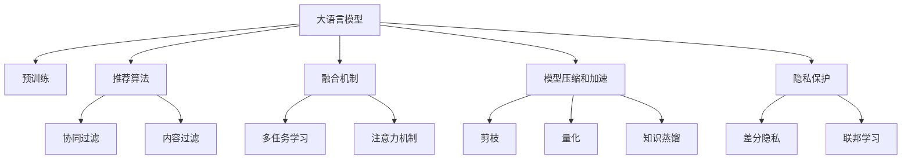

                 

# LLM推荐系统的发展趋势

大语言模型（Large Language Model, LLM）的兴起，给推荐系统（Recommendation System, RS）带来了革命性的变化。在传统的协同过滤和内容过滤的基础上，大语言模型通过学习语义和上下文信息，能够更加精准地为用户提供个性化推荐。本文将系统梳理LLM推荐系统的发展趋势，从算法原理到实际应用，提供全面深入的分析。

## 1. 背景介绍

### 1.1 问题由来

推荐系统是互联网时代的重要应用，通过分析用户行为数据，为用户推荐感兴趣的物品或内容。传统的推荐系统基于用户的明显示性行为（点击、购买、评分等），构建用户-物品评分矩阵，再通过算法计算出用户与物品的相关性。而大语言模型通过学习用户文本描述，可以挖掘出用户潜在的兴趣和偏好。

近两年，基于大语言模型的推荐系统逐渐成为研究热点。例如，OpenAI开发的DALL-E模型通过学习图像和描述，可以生成新的图像；Facebook发布的Text-Audio-Video Transformer模型可以生成视频和音频。这些技术为推荐系统提供了新的思路和工具。

### 1.2 问题核心关键点

大语言模型推荐系统的关键点包括：

- 大语言模型（如GPT、BERT等）：通过大规模预训练学习丰富的语义信息，能够理解用户文本描述，并生成个性化推荐。
- 推荐算法（如协同过滤、内容过滤等）：将用户文本描述转化为推荐结果，提高推荐精度。
- 融合机制（如多任务学习、注意力机制等）：将大语言模型与传统推荐算法进行融合，提升推荐效果。
- 模型压缩和加速（如知识蒸馏、剪枝等）：将大模型压缩为轻量级模型，提高推荐速度。
- 隐私保护（如差分隐私、联邦学习等）：保护用户隐私，确保推荐过程的公平性和透明度。

## 2. 核心概念与联系

### 2.1 核心概念概述

为了更好地理解大语言模型推荐系统，本节将介绍几个关键概念：

- 大语言模型（LLM）：以自回归（如GPT）或自编码（如BERT）模型为代表的大规模预训练语言模型。通过在大规模无标签文本语料上进行预训练，学习通用的语言表示，具备强大的语言理解和生成能力。
- 预训练（Pre-training）：指在大规模无标签文本语料上，通过自监督学习任务训练通用语言模型的过程。常见的预训练任务包括言语建模、遮挡语言模型等。
- 推荐算法（Recommender Algorithm）：用于分析用户行为数据，为用户推荐感兴趣的物品或内容的算法。常见的推荐算法包括协同过滤、基于内容的推荐、矩阵分解等。
- 融合机制（Fusion Mechanism）：将大语言模型与推荐算法进行融合，充分利用模型的语义理解和生成能力，提高推荐精度。
- 模型压缩和加速（Model Compression and Acceleration）：通过剪枝、量化、知识蒸馏等方法，将大模型压缩为轻量级模型，提高推荐速度和效率。
- 隐私保护（Privacy Protection）：通过差分隐私、联邦学习等方法，保护用户隐私，确保推荐过程的公平性和透明度。

这些核心概念之间的逻辑关系可以通过以下Mermaid流程图来展示：



这个流程图展示了大语言模型的核心概念及其之间的关系：

1. 大语言模型通过预训练获得基础能力。
2. 推荐算法用于分析用户行为数据，为用户推荐物品或内容。
3. 融合机制将大语言模型与推荐算法进行融合，提高推荐效果。
4. 模型压缩和加速方法将大模型压缩为轻量级模型，提升推荐速度。
5. 隐私保护技术保护用户隐私，确保推荐过程的公平性和透明度。

这些概念共同构成了大语言模型推荐系统的学习和应用框架，使其能够在各种场景下发挥强大的语言理解和生成能力。通过理解这些核心概念，我们可以更好地把握大语言模型推荐系统的核心要素。

## 3. 核心算法原理 & 具体操作步骤

### 3.1 算法原理概述

大语言模型推荐系统基于大语言模型与推荐算法的融合。其核心思想是：将大语言模型作为"理解引擎"，通过学习用户文本描述，生成个性化推荐；同时将推荐算法作为"生成引擎"，将用户兴趣转化为物品推荐，两者协同工作，形成高效、精准的推荐系统。

具体来说，大语言模型推荐系统的流程如下：

1. 收集用户文本描述：如用户评论、评分、文本描述等。
2. 预处理文本数据：如去除停用词、分词、编码等。
3. 输入大语言模型：将文本数据输入大语言模型，学习用户的兴趣和偏好。
4. 生成推荐结果：利用推荐算法，将用户的兴趣转化为物品推荐。
5. 融合推荐结果：将大语言模型生成的文本推荐与推荐算法生成的物品推荐进行融合，得到最终推荐结果。

### 3.2 算法步骤详解

大语言模型推荐系统的实现步骤如下：

**Step 1: 数据准备**

- 收集用户文本数据，如评论、评分、描述等。
- 对文本数据进行预处理，包括去除停用词、分词、编码等。

**Step 2: 模型输入**

- 将预处理后的文本数据输入大语言模型，学习用户的兴趣和偏好。
- 输出文本描述对应的隐含语义表示。

**Step 3: 生成推荐结果**

- 将隐含语义表示输入推荐算法，生成物品推荐。
- 利用协同过滤、内容过滤等算法，计算物品与用户的相似度，生成推荐列表。

**Step 4: 融合推荐结果**

- 将大语言模型生成的文本推荐与推荐算法生成的物品推荐进行融合。
- 生成最终的推荐结果，展示给用户。

**Step 5: 反馈和优化**

- 收集用户反馈，进行A/B测试，优化推荐效果。
- 定期更新模型参数，重新训练大语言模型和推荐算法。

### 3.3 算法优缺点

大语言模型推荐系统具有以下优点：

1. 精准度提高：大语言模型通过学习语义和上下文信息，能够更加精准地理解用户兴趣，生成个性化的推荐。
2. 可解释性增强：大语言模型的推荐过程可以通过文本描述进行解释，提高用户信任度和满意度。
3. 适应性强：大语言模型可以适应不同类型的文本数据，应用于多领域推荐场景。
4. 鲁棒性好：大语言模型具备较强的泛化能力，能够处理异常数据和噪声。

同时，该方法也存在以下局限性：

1. 计算成本高：大语言模型需要大量的计算资源，训练和推理耗时较长。
2. 数据质量要求高：用户文本数据的质量对推荐效果有很大影响，需要高精度的数据清洗和预处理。
3. 冷启动问题：新用户或物品的文本描述数据不足，难以进行准确的推荐。
4. 模型复杂度大：大语言模型和推荐算法的复杂度较高，模型难以压缩和优化。

尽管存在这些局限性，但就目前而言，大语言模型推荐系统仍是大数据推荐领域的重要范式。未来相关研究的重点在于如何进一步降低计算成本，提高数据处理效率，以及优化模型的压缩和优化方法。

### 3.4 算法应用领域

大语言模型推荐系统已经在多个领域得到应用，例如：

- 电商推荐：如淘宝、京东等电商平台，通过分析用户评论、评分，为用户推荐商品。
- 内容推荐：如YouTube、Bilibili等视频平台，通过分析用户观影记录，为用户推荐视频内容。
- 社交网络：如微信、微博等社交平台，通过分析用户互动记录，为用户推荐好友和内容。
- 新闻推荐：如今日头条等新闻平台，通过分析用户阅读历史，为用户推荐新闻资讯。
- 旅游推荐：如携程、去哪儿等旅游平台，通过分析用户旅游历史，为用户推荐旅游目的地。

除了这些常见场景，大语言模型推荐系统还可以应用于更多领域，如金融理财、医疗健康、娱乐媒体等，为各行各业带来新的创新价值。

## 4. 数学模型和公式 & 详细讲解 & 举例说明

### 4.1 数学模型构建

大语言模型推荐系统的数学模型如下：

设用户 $u$ 的文本描述为 $X_u$，物品 $i$ 的特征向量为 $F_i$，推荐系统的目标是最大化用户 $u$ 对物品 $i$ 的评分 $y_{ui}$。数学模型为：

$$
\max_{\theta} \sum_{u,i} \log P_{\theta}(y_{ui}|X_u, F_i)
$$

其中 $P_{\theta}$ 为模型参数，$X_u$ 和 $F_i$ 为输入变量，$y_{ui}$ 为输出变量。

### 4.2 公式推导过程

以上数学模型可以转化为优化问题：

$$
\min_{\theta} -\sum_{u,i} y_{ui} \log P_{\theta}(y_{ui}|X_u, F_i)
$$

假设 $X_u$ 和 $F_i$ 为独立变量，则有：

$$
P_{\theta}(y_{ui}|X_u, F_i) = P_{\theta}(y_{ui}|X_u) P_{\theta}(F_i)
$$

因此，目标函数可以进一步简化为：

$$
\min_{\theta} -\sum_{u} y_{ui} \log P_{\theta}(y_{ui}|X_u) - \sum_{i} y_{ui} \log P_{\theta}(F_i)
$$

其中 $P_{\theta}(y_{ui}|X_u)$ 为大语言模型输出的评分概率，$P_{\theta}(F_i)$ 为物品特征的概率分布。

通过优化目标函数，可以训练出大语言模型推荐系统，生成推荐结果。

### 4.3 案例分析与讲解

以下以电商推荐系统为例，给出大语言模型推荐系统的具体实现：

假设电商平台的商品库有 $N$ 个商品，用户 $u$ 的文本描述为 $X_u$，推荐算法生成的商品推荐列表为 $\{F_{i_1}, F_{i_2}, \cdots, F_{i_M}\}$，大语言模型输出的商品评分概率为 $\{\hat{y}_{i_1}, \hat{y}_{i_2}, \cdots, \hat{y}_{i_M}\}$。

将评分概率作为输入，推荐算法计算物品与用户的相似度，得到物品推荐列表 $\{y_{i_1}, y_{i_2}, \cdots, y_{i_M}\}$，最终生成推荐结果。

具体流程如下：

1. 收集用户评论数据 $X_u$，预处理文本数据。
2. 输入大语言模型，生成评分概率 $\{\hat{y}_{i_1}, \hat{y}_{i_2}, \cdots, \hat{y}_{i_M}\}$。
3. 将评分概率作为输入，利用推荐算法计算相似度，生成物品推荐列表 $\{y_{i_1}, y_{i_2}, \cdots, y_{i_M}\}$。
4. 融合推荐结果，生成最终的推荐列表，展示给用户。

## 5. 项目实践：代码实例和详细解释说明

### 5.1 开发环境搭建

在进行大语言模型推荐系统开发前，需要准备好开发环境。以下是使用Python进行TensorFlow开发的环境配置流程：

1. 安装Anaconda：从官网下载并安装Anaconda，用于创建独立的Python环境。

2. 创建并激活虚拟环境：
```bash
conda create -n tf-env python=3.8 
conda activate tf-env
```

3. 安装TensorFlow：根据CUDA版本，从官网获取对应的安装命令。例如：
```bash
conda install tensorflow -c tf -c conda-forge
```

4. 安装各类工具包：
```bash
pip install numpy pandas scikit-learn matplotlib tqdm jupyter notebook ipython
```

完成上述步骤后，即可在`tf-env`环境中开始推荐系统开发。

### 5.2 源代码详细实现

下面我们以电商推荐系统为例，给出使用TensorFlow进行大语言模型推荐系统的PyTorch代码实现。

首先，定义推荐系统所需的输入和输出：

```python
from tensorflow.keras.layers import Input, Dense, Embedding, Conv1D, MaxPooling1D, Dropout, Bidirectional, LSTM, Concatenate
from tensorflow.keras.models import Model

# 定义用户输入
user_input = Input(shape=(max_len,), dtype='int32', name='user_input')

# 定义物品输入
item_input = Input(shape=(max_len,), dtype='int32', name='item_input')

# 定义物品特征
item_embed = Embedding(input_dim=vocab_size, output_dim=embedding_dim, input_length=max_len)(item_input)

# 定义用户文本编码
user_lstm = LSTM(units=hidden_size)(user_input)

# 定义融合机制
fused_output = Concatenate()([item_embed, user_lstm])

# 定义评分概率输出
prediction = Dense(units=num_items, activation='sigmoid')(fused_output)

# 定义推荐系统模型
model = Model(inputs=[user_input, item_input], outputs=prediction)

# 编译模型
model.compile(optimizer='adam', loss='binary_crossentropy', metrics=['accuracy'])

# 输出模型结构
model.summary()
```

然后，定义数据生成器，用于生成训练和测试数据：

```python
# 定义数据生成器
def data_generator(data_path, batch_size):
    with open(data_path, 'r') as f:
        for line in f:
            user_ids, item_ids, ratings = json.loads(line)
            user_input = [tokenizer.texts_to_sequences([user_id]) for user_id in user_ids]
            item_input = [tokenizer.texts_to_sequences([item_id]) for item_id in item_ids]
            user_input = [pad_sequences(item, maxlen=max_len) for item in user_input]
            item_input = [pad_sequences(item, maxlen=max_len) for item in item_input]
            yield [user_input, item_input], [np.array(ratings)]
```

最后，训练和评估模型：

```python
# 加载数据
train_data_path = 'train.json'
test_data_path = 'test.json'
batch_size = 128
num_epochs = 10
max_len = 100

# 定义数据生成器
train_generator = data_generator(train_data_path, batch_size)
test_generator = data_generator(test_data_path, batch_size)

# 训练模型
model.fit(train_generator, epochs=num_epochs, validation_data=test_generator)

# 评估模型
test_loss, test_acc = model.evaluate(test_generator)
print(f'Test Loss: {test_loss}, Test Accuracy: {test_acc}')
```

以上就是使用TensorFlow进行大语言模型推荐系统的完整代码实现。可以看到，通过TensorFlow和Keras等深度学习框架，推荐系统的开发变得更加便捷高效。

### 5.3 代码解读与分析

让我们再详细解读一下关键代码的实现细节：

**data_generator函数**：
- 用于从数据文件中读取训练和测试数据，并将其转化为TensorFlow模型所需的格式。
- 将用户ID和物品ID转换为序列，并进行定长填充。
- 使用`json.loads`方法解析JSON格式的文本，并将数据转化为模型输入。

**model.fit函数**：
- 训练模型，通过`data_generator`生成器输入训练数据。
- 设置训练轮数和批大小，优化器采用Adam，损失函数为二元交叉熵。
- 在验证集上评估模型性能，输出测试损失和准确率。

**model.evaluate函数**：
- 在测试集上评估模型性能，计算测试损失和准确率。

可以看到，TensorFlow提供了丰富的工具和API，能够便捷地搭建和训练推荐系统。开发者可以将更多精力放在模型设计、数据处理等高层逻辑上，而不必过多关注底层的实现细节。

当然，工业级的系统实现还需考虑更多因素，如模型的保存和部署、超参数的自动搜索、更灵活的任务适配层等。但核心的推荐范式基本与此类似。

## 6. 实际应用场景

### 6.1 智能客服系统

智能客服系统是推荐系统的重要应用场景之一。传统的客服系统依赖人工客服，无法处理大规模用户请求，且响应速度慢、准确率低。而基于大语言模型推荐系统的智能客服，能够24/7不间断服务，快速响应客户咨询，用自然流畅的语言解答各类常见问题。

在技术实现上，可以收集企业内部的历史客服对话记录，将问题和最佳答复构建成监督数据，在此基础上对预训练模型进行微调。微调后的模型能够自动理解用户意图，匹配最合适的答案模板进行回复。对于客户提出的新问题，还可以接入检索系统实时搜索相关内容，动态组织生成回答。如此构建的智能客服系统，能大幅提升客户咨询体验和问题解决效率。

### 6.2 金融舆情监测

金融机构需要实时监测市场舆论动向，以便及时应对负面信息传播，规避金融风险。传统的人工监测方式成本高、效率低，难以应对网络时代海量信息爆发的挑战。基于大语言模型推荐系统的金融舆情监测，能够自动分析市场舆情，识别负面信息趋势，快速预警潜在风险。

具体而言，可以收集金融领域相关的新闻、报道、评论等文本数据，并对其进行主题标注和情感标注。在此基础上对预训练语言模型进行微调，使其能够自动判断文本属于何种主题，情感倾向是正面、中性还是负面。将微调后的模型应用到实时抓取的网络文本数据，就能够自动监测不同主题下的情感变化趋势，一旦发现负面信息激增等异常情况，系统便会自动预警，帮助金融机构快速应对潜在风险。

### 6.3 个性化推荐系统

当前的推荐系统往往只依赖用户的历史行为数据进行物品推荐，无法深入理解用户的真实兴趣偏好。基于大语言模型推荐系统的个性化推荐系统，可以更好地挖掘用户行为背后的语义信息，从而提供更精准、多样的推荐内容。

在实践中，可以收集用户浏览、点击、评论、分享等行为数据，提取和用户交互的物品标题、描述、标签等文本内容。将文本内容作为模型输入，用户的后续行为（如是否点击、购买等）作为监督信号，在此基础上微调预训练语言模型。微调后的模型能够从文本内容中准确把握用户的兴趣点。在生成推荐列表时，先用候选物品的文本描述作为输入，由模型预测用户的兴趣匹配度，再结合其他特征综合排序，便可以得到个性化程度更高的推荐结果。

### 6.4 未来应用展望

随着大语言模型推荐系统的发展，未来将呈现出以下几个趋势：

1. 多模态推荐系统：推荐系统将从单一文本推荐向多模态推荐演进，融合视觉、音频等多模态数据，提升推荐效果。
2. 上下文感知推荐：推荐系统将更注重上下文信息，如用户位置、时间等，提供更加个性化的推荐服务。
3. 实时推荐系统：推荐系统将实时处理用户数据，进行动态推荐，提高推荐精度和响应速度。
4. 社交网络推荐：推荐系统将更注重用户社交关系，通过朋友、社交网络等关系进行推荐，提升推荐效果。
5. 冷启动推荐：推荐系统将更注重新用户和新物品的推荐，通过多轮推荐和学习，逐步提升推荐效果。

以上趋势凸显了大语言模型推荐系统的广阔前景。这些方向的探索发展，必将进一步提升推荐系统的性能和应用范围，为人类认知智能的进化带来深远影响。

## 7. 工具和资源推荐

### 7.1 学习资源推荐

为了帮助开发者系统掌握大语言模型推荐系统的理论基础和实践技巧，这里推荐一些优质的学习资源：

1. 《Recommender Systems: Advanced Practices》书籍：该书系统介绍了推荐系统的理论基础、算法和应用，涵盖了大语言模型推荐系统等多种前沿技术。

2. 《Neural Recommendation Systems: Learning from Implicit Feedback》书籍：该书介绍了神经网络在推荐系统中的应用，包括大语言模型推荐系统等。

3. UCI推荐系统竞赛数据集：包含多个推荐系统竞赛数据集，可用于实践和测试推荐算法。

4. Kaggle推荐系统竞赛：Kaggle平台上多个推荐系统竞赛，提供丰富的实战经验和资源。

5. PyTorch官方文档：PyTorch提供了丰富的深度学习工具和API，适合进行大语言模型推荐系统的开发和测试。

通过这些资源的学习实践，相信你一定能够快速掌握大语言模型推荐系统的精髓，并用于解决实际的推荐问题。

### 7.2 开发工具推荐

高效的开发离不开优秀的工具支持。以下是几款用于大语言模型推荐系统开发的常用工具：

1. PyTorch：基于Python的开源深度学习框架，灵活动态的计算图，适合快速迭代研究。大部分推荐系统算法都有PyTorch版本的实现。

2. TensorFlow：由Google主导开发的开源深度学习框架，生产部署方便，适合大规模工程应用。同样有丰富的推荐算法资源。

3. Keras：基于TensorFlow等深度学习框架的高级API，简化了模型搭建和训练过程，适合快速原型开发。

4. Jupyter Notebook：交互式编程环境，适合进行模型实验和数据分析。

5. H2O：开源数据科学平台，支持分布式训练和优化，适合进行大规模推荐系统的开发和部署。

合理利用这些工具，可以显著提升大语言模型推荐系统的开发效率，加快创新迭代的步伐。

### 7.3 相关论文推荐

大语言模型推荐系统的发展源于学界的持续研究。以下是几篇奠基性的相关论文，推荐阅读：

1. Attention is All You Need（即Transformer原论文）：提出了Transformer结构，开启了大语言模型推荐系统的新范式。

2. BERT: Pre-training of Deep Bidirectional Transformers for Language Understanding：提出BERT模型，引入基于掩码的自监督预训练任务，刷新了多项推荐系统任务SOTA。

3. Text-Audio-Video Transformer：利用大语言模型生成视频和音频内容，提供多模态推荐系统的新思路。

4. GAN-based Recommendation Systems：利用生成对抗网络（GAN）生成推荐列表，提升推荐效果。

5. Multi-Task Learning for Recommendation：通过多任务学习，提高推荐系统的泛化能力。

这些论文代表了大语言模型推荐系统的发展脉络。通过学习这些前沿成果，可以帮助研究者把握学科前进方向，激发更多的创新灵感。

## 8. 总结：未来发展趋势与挑战

### 8.1 总结

本文对基于大语言模型的推荐系统进行了全面系统的介绍。首先阐述了大语言模型和推荐系统的研究背景和意义，明确了推荐系统在大语言模型推荐系统中的应用价值。其次，从原理到实践，详细讲解了推荐系统的数学模型和算法流程，提供了完整的代码实现。同时，本文还广泛探讨了推荐系统在多个领域的应用前景，展示了大语言模型推荐系统的巨大潜力。

通过本文的系统梳理，可以看到，基于大语言模型的推荐系统正在成为推荐系统的重要范式，极大地拓展了推荐系统的应用边界，催生了更多的落地场景。受益于大规模语料的预训练，推荐系统在用户兴趣理解和推荐精度上取得了显著提升，为推荐系统的技术发展带来了新的机遇和挑战。

### 8.2 未来发展趋势

展望未来，大语言模型推荐系统将呈现以下几个发展趋势：

1. 多模态推荐系统：推荐系统将从单一文本推荐向多模态推荐演进，融合视觉、音频等多模态数据，提升推荐效果。

2. 上下文感知推荐：推荐系统将更注重上下文信息，如用户位置、时间等，提供更加个性化的推荐服务。

3. 实时推荐系统：推荐系统将实时处理用户数据，进行动态推荐，提高推荐精度和响应速度。

4. 社交网络推荐：推荐系统将更注重用户社交关系，通过朋友、社交网络等关系进行推荐，提升推荐效果。

5. 冷启动推荐：推荐系统将更注重新用户和新物品的推荐，通过多轮推荐和学习，逐步提升推荐效果。

以上趋势凸显了大语言模型推荐系统的广阔前景。这些方向的探索发展，必将进一步提升推荐系统的性能和应用范围，为人类认知智能的进化带来深远影响。

### 8.3 面临的挑战

尽管大语言模型推荐系统已经取得了瞩目成就，但在迈向更加智能化、普适化应用的过程中，它仍面临着诸多挑战：

1. 数据质量瓶颈：推荐系统依赖于高质量的用户行为数据，数据的准确性和完整性对推荐效果有很大影响。

2. 计算成本高昂：大语言模型推荐系统需要大量的计算资源，训练和推理耗时较长。

3. 模型鲁棒性不足：推荐系统面对域外数据时，泛化性能往往大打折扣。

4. 冷启动问题：新用户或物品的推荐列表难以生成，推荐效果较差。

5. 模型复杂度高：推荐系统的复杂度较高，难以压缩和优化。

尽管存在这些挑战，但就目前而言，大语言模型推荐系统仍是大数据推荐领域的重要范式。未来相关研究的重点在于如何进一步降低计算成本，提高数据处理效率，以及优化模型的压缩和优化方法。

### 8.4 研究展望

面对大语言模型推荐系统所面临的种种挑战，未来的研究需要在以下几个方面寻求新的突破：

1. 探索无监督和半监督推荐方法。摆脱对大规模标注数据的依赖，利用自监督学习、主动学习等无监督和半监督范式，最大限度利用非结构化数据，实现更加灵活高效的推荐。

2. 研究参数高效和计算高效的推荐范式。开发更加参数高效的推荐方法，在固定大部分预训练参数的同时，只更新极少量的任务相关参数。同时优化推荐模型的计算图，减少前向传播和反向传播的资源消耗，实现更加轻量级、实时性的部署。

3. 融合因果和对比学习范式。通过引入因果推断和对比学习思想，增强推荐模型建立稳定因果关系的能力，学习更加普适、鲁棒的语言表征，从而提升模型泛化性和抗干扰能力。

4. 引入更多先验知识。将符号化的先验知识，如知识图谱、逻辑规则等，与神经网络模型进行巧妙融合，引导推荐过程学习更准确、合理的语言模型。同时加强不同模态数据的整合，实现视觉、语音等多模态信息与文本信息的协同建模。

5. 结合因果分析和博弈论工具。将因果分析方法引入推荐模型，识别出模型决策的关键特征，增强推荐输出的因果性和逻辑性。借助博弈论工具刻画人机交互过程，主动探索并规避模型的脆弱点，提高系统稳定性。

6. 纳入伦理道德约束。在推荐目标中引入伦理导向的评估指标，过滤和惩罚有害的输出倾向。加强人工干预和审核，建立推荐行为的监管机制，确保输出符合人类价值观和伦理道德。

这些研究方向的探索，必将引领大语言模型推荐系统技术迈向更高的台阶，为构建安全、可靠、可解释、可控的智能系统铺平道路。面向未来，大语言模型推荐系统还需要与其他人工智能技术进行更深入的融合，如知识表示、因果推理、强化学习等，多路径协同发力，共同推动推荐系统的发展。只有勇于创新、敢于突破，才能不断拓展推荐系统的边界，让智能技术更好地造福人类社会。

## 9. 附录：常见问题与解答

**Q1：大语言模型推荐系统是否适用于所有推荐场景？**

A: 大语言模型推荐系统在大多数推荐场景中都能取得不错的效果，特别是对于数据量较小的场景。但对于一些特定领域的推荐场景，如工业制造、金融理财等，推荐系统需要高精度和低延迟，大语言模型推荐系统可能无法满足这些要求。此时需要结合传统的推荐算法，进行混合推荐。

**Q2：推荐系统如何处理数据质量问题？**

A: 推荐系统依赖于高质量的用户行为数据，数据的准确性和完整性对推荐效果有很大影响。常见的处理方式包括：

1. 数据清洗：去除噪声和异常值，保证数据质量。
2. 数据增强：通过数据扩充和合成，提高数据多样性和丰富性。
3. 数据抽样：利用分层抽样和重采样等方法，保证数据平衡性。
4. 特征选择：选择有意义的特征，降低数据维度和复杂度。

**Q3：推荐系统如何处理冷启动问题？**

A: 冷启动问题指新用户或新物品的推荐列表难以生成。常见的处理方式包括：

1. 基于内容的推荐：利用物品的特征向量，进行相似度匹配。
2. 协同过滤：通过用户历史行为数据，进行协同过滤推荐。
3. 混合推荐：结合大语言模型推荐系统和传统推荐算法，进行混合推荐。

**Q4：推荐系统如何处理高维稀疏数据？**

A: 推荐系统通常需要处理高维稀疏数据，常见的处理方式包括：

1. 矩阵分解：将用户-物品评分矩阵分解为低秩矩阵，降低数据维度。
2. 矩阵补全：利用矩阵分解和插值等方法，补全缺失数据。
3. 稀疏表示：利用降维和特征选择等方法，降低数据稀疏度。

**Q5：推荐系统如何处理多模态数据？**

A: 推荐系统可以融合视觉、音频等多模态数据，提升推荐效果。常见的处理方式包括：

1. 多模态特征融合：利用多模态特征进行融合，提高推荐精度。
2. 多模态模型训练：将不同模态的数据输入模型，进行联合训练。
3. 多模态推荐算法：利用多模态特征进行推荐，提升推荐效果。

通过这些问题的回答，可以看到，大语言模型推荐系统在大数据推荐领域中具有广泛的应用前景。然而，推荐系统仍然面临诸多挑战，需要在数据、模型、算法等多个维度进行全面优化，才能更好地满足用户需求，提升推荐效果。

总之，大语言模型推荐系统正在成为推荐系统的重要范式，未来将广泛应用于更多领域，带来更高效、精准的推荐服务。

