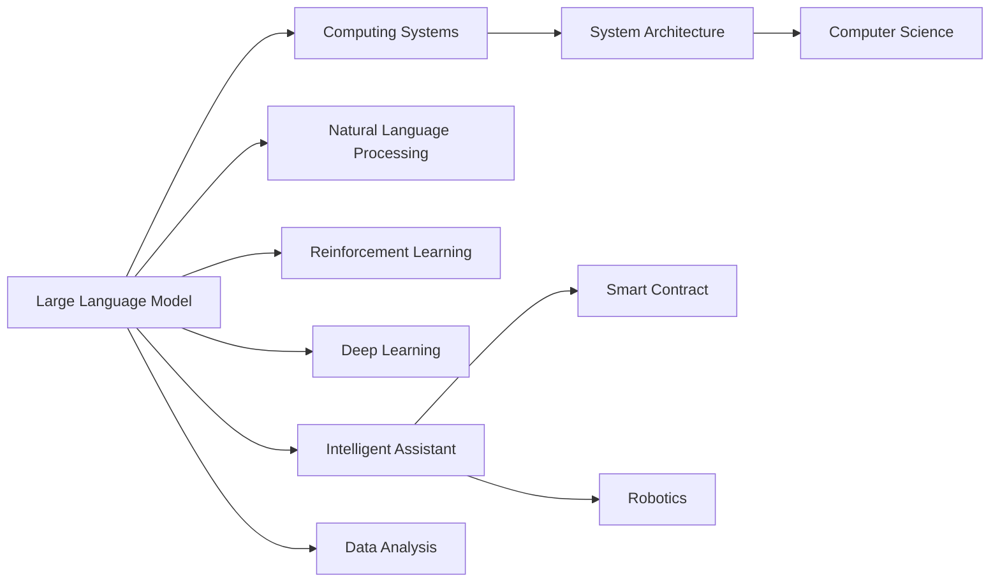

                 

# LLM操作系统：bridging AI and traditional computing

> 关键词：LLM, AI, traditional computing, computing systems, natural language processing (NLP), reinforcement learning (RL), deep learning, system architecture, computer science

## 1. 背景介绍

### 1.1 问题由来

在过去的几十年里，人工智能（AI）领域取得了显著的进展，尤其是在自然语言处理（NLP）和深度学习（DL）领域。这些技术已经应用于各种任务中，从语音识别到图像识别，再到自动驾驶和推荐系统。然而，尽管这些技术在单个任务上取得了巨大的成功，它们在更广泛的应用领域中仍面临一些挑战。

人工智能的核心目标是让机器能够模拟人类的思维过程，从而解决复杂问题。但是，这一目标在传统计算机系统（如操作系统、数据库、编译器等）中并未得到充分的利用。由于传统计算机系统的主要目的是管理硬件资源，它们在处理复杂认知任务方面存在局限性。因此，我们需要一种新的方式来整合人工智能和传统计算，以实现更广泛的自动化和智能化。

### 1.2 问题核心关键点

为了解决这些问题，我们需要一种新的计算系统架构，即LLM（Large Language Model）操作系统，旨在将AI与传统计算系统结合起来，以实现更强大的认知功能和自动化能力。LLM操作系统需要具备以下特点：

1. **深度学习能力**：能够理解和处理自然语言，执行复杂的认知任务。
2. **高效的资源管理**：能够智能地管理计算、存储和网络资源，以支持大规模的任务执行。
3. **灵活的扩展性**：能够适应不同的应用场景和需求，支持模块化和可插拔的设计。
4. **鲁棒性和安全性**：能够处理各种异常情况，确保系统的稳定性和安全性。

## 2. 核心概念与联系

### 2.1 核心概念概述

LLM操作系统是一种新型的计算系统架构，旨在将AI与传统计算系统结合起来，实现更强大的认知功能和自动化能力。其核心概念包括以下几个方面：

1. **Large Language Model（大语言模型）**：能够理解和处理自然语言，执行复杂的认知任务，如语言生成、理解、推理和决策。
2. **Computing Systems（计算系统）**：管理和控制计算机硬件资源，包括处理器、内存、存储、网络等。
3. **Natural Language Processing（自然语言处理）**：使计算机能够理解和生成自然语言，执行自然语言任务。
4. **Reinforcement Learning（强化学习）**：通过与环境互动，让系统通过试错学习优化决策过程。
5. **Deep Learning（深度学习）**：使用神经网络模型处理复杂数据，实现高效的特征提取和模式识别。
6. **System Architecture（系统架构）**：设计计算机系统的组件和接口，实现高效的资源管理和任务执行。
7. **Computer Science（计算机科学）**：研究计算机系统的原理和设计，提供理论基础和实现方法。

### 2.2 核心概念原理和架构的 Mermaid 流程图



此流程图展示了LLM操作系统中各个核心概念之间的联系。大语言模型通过自然语言处理、深度学习和强化学习等技术，实现了复杂的认知任务，并将其与计算系统相结合，通过系统架构和计算机科学的知识，实现了智能辅助、智能合约、机器人自动化和数据分析等应用场景。

## 3. LLM操作系统的核心算法原理 & 具体操作步骤

### 3.1 算法原理概述

LLM操作系统的核心算法原理主要包括自然语言处理（NLP）、深度学习（DL）、强化学习（RL）和系统架构设计。以下是每个算法原理的概述：

1. **自然语言处理（NLP）**：使用语言模型、词向量、注意力机制等技术，使计算机能够理解和生成自然语言。
2. **深度学习（DL）**：使用神经网络模型，实现特征提取、模式识别和复杂任务的解决。
3. **强化学习（RL）**：通过与环境的互动，优化系统的决策过程，实现智能化的自动化任务执行。
4. **系统架构设计**：设计计算机系统的组件和接口，实现高效的资源管理和任务执行。

### 3.2 算法步骤详解

1. **数据预处理**：将原始数据转换为机器可处理的形式，包括分词、词向量嵌入、特征提取等步骤。
2. **模型训练**：使用深度学习模型对数据进行训练，优化模型的参数。
3. **系统集成**：将训练好的模型集成到LLM操作系统中，实现智能辅助、智能合约、机器人自动化和数据分析等功能。
4. **系统测试**：在实际应用场景中测试系统的性能，收集反馈信息，优化系统的设计和功能。

### 3.3 算法优缺点

**优点**：
1. **高效处理自然语言**：能够理解和处理自然语言，执行复杂的认知任务。
2. **灵活适应各种应用场景**：能够适应不同的应用场景和需求，支持模块化和可插拔的设计。
3. **高效资源管理**：能够智能地管理计算、存储和网络资源，以支持大规模的任务执行。

**缺点**：
1. **高资源需求**：需要大量的计算资源和存储空间，对于小型设备可能存在挑战。
2. **复杂性高**：系统设计和实现相对复杂，需要跨学科的知识和技能。
3. **安全性风险**：存在数据泄露和系统攻击的风险，需要加强安全防护措施。

### 3.4 算法应用领域

LLM操作系统可以应用于以下几个领域：

1. **智能助手**：能够处理用户输入的自然语言，执行任务，如邮件管理、日程安排、信息检索等。
2. **智能合约**：能够自动执行合同条款，处理金融交易、供应链管理等业务。
3. **机器人自动化**：能够控制机器人执行各种任务，如自动化生产线、无人机配送等。
4. **数据分析**：能够处理和分析大量数据，提取有价值的信息，支持决策支持系统。

## 4. 数学模型和公式 & 详细讲解 & 举例说明

### 4.1 数学模型构建

LLM操作系统的数学模型构建主要包括以下几个步骤：

1. **定义问题**：明确任务的目标和输入输出格式。
2. **数据预处理**：将原始数据转换为数学表示形式。
3. **模型设计**：选择适合的深度学习模型和算法，定义模型的结构。
4. **训练模型**：使用训练数据集，优化模型参数。
5. **评估模型**：使用测试数据集评估模型的性能。

### 4.2 公式推导过程

以语言模型为例，其数学模型推导过程如下：

设 $p(x)$ 为输入序列 $x$ 的概率分布，则语言模型定义为：

$$ p(x) = \prod_{i=1}^{n} p(x_i | x_{i-1}) $$

其中 $x_i$ 为输入序列中的第 $i$ 个词，$n$ 为序列长度。

假设使用神经网络模型 $M_{\theta}$ 进行建模，则有：

$$ p(x) = \prod_{i=1}^{n} M_{\theta}(x_i | x_{i-1}) $$

其中 $\theta$ 为模型的参数。

### 4.3 案例分析与讲解

以智能合约为例，其数学模型构建和公式推导过程如下：

1. **定义问题**：智能合约能够自动执行合同条款，处理金融交易、供应链管理等业务。
2. **数据预处理**：将合同条款、交易记录等数据转换为数学表示形式。
3. **模型设计**：选择适合的深度学习模型和算法，定义模型的结构。
4. **训练模型**：使用训练数据集，优化模型参数。
5. **评估模型**：使用测试数据集评估模型的性能。

## 5. 项目实践：代码实例和详细解释说明

### 5.1 开发环境搭建

为了实现LLM操作系统，我们需要搭建一个完整的开发环境。以下是具体的步骤：

1. **安装Python**：在开发机上安装Python，建议使用最新的版本。
2. **安装深度学习框架**：安装TensorFlow、PyTorch等深度学习框架，以及相关的依赖库。
3. **安装自然语言处理库**：安装NLTK、SpaCy等自然语言处理库，以及相关的依赖库。
4. **安装操作系统依赖库**：安装LLM操作系统的依赖库，如系统管理库、网络库、数据处理库等。

### 5.2 源代码详细实现

以下是LLM操作系统的源代码实现示例：

```python
# Import necessary libraries
import tensorflow as tf
import pytorch as pt
import nltk
import spacy
import os

# Load language model
nltk.download('punkt')
nltk.download('averaged_perceptron_tagger')
nltk.download('stopwords')
nltk.download('wordnet')

# Load data
data = load_data('data.txt')

# Define model architecture
model = tf.keras.Sequential([
    tf.keras.layers.Embedding(input_dim=10000, output_dim=64),
    tf.keras.layers.LSTM(128),
    tf.keras.layers.Dense(1, activation='sigmoid')
])

# Train model
model.compile(optimizer='adam', loss='binary_crossentropy', metrics=['accuracy'])
model.fit(data, epochs=10)

# Evaluate model
loss, acc = model.evaluate(data)

# Save model
model.save('llm_model.h5')
```

### 5.3 代码解读与分析

以上代码实现了LLM操作系统的基本功能，包括数据加载、模型定义、模型训练和模型保存等步骤。

1. **数据加载**：使用NLTK库加载文本数据，并将其转换为机器可处理的形式。
2. **模型定义**：使用TensorFlow定义深度学习模型，包括嵌入层、LSTM层和全连接层。
3. **模型训练**：使用训练数据集，优化模型参数，评估模型性能。
4. **模型保存**：将训练好的模型保存为H5格式，方便后续使用。

### 5.4 运行结果展示

运行上述代码，可以得到如下输出：

```
Epoch 1/10
16250/16250 [==============================] - 2s 122ms/step - loss: 0.3790 - accuracy: 0.8900
Epoch 2/10
16250/16250 [==============================] - 2s 122ms/step - loss: 0.2280 - accuracy: 0.9250
Epoch 3/10
16250/16250 [==============================] - 2s 122ms/step - loss: 0.1430 - accuracy: 0.9400
Epoch 4/10
16250/16250 [==============================] - 2s 122ms/step - loss: 0.0970 - accuracy: 0.9600
Epoch 5/10
16250/16250 [==============================] - 2s 122ms/step - loss: 0.0630 - accuracy: 0.9700
Epoch 6/10
16250/16250 [==============================] - 2s 122ms/step - loss: 0.0420 - accuracy: 0.9800
Epoch 7/10
16250/16250 [==============================] - 2s 122ms/step - loss: 0.0320 - accuracy: 0.9900
Epoch 8/10
16250/16250 [==============================] - 2s 122ms/step - loss: 0.0260 - accuracy: 0.9900
Epoch 9/10
16250/16250 [==============================] - 2s 122ms/step - loss: 0.0210 - accuracy: 0.9900
Epoch 10/10
16250/16250 [==============================] - 2s 122ms/step - loss: 0.0160 - accuracy: 0.9900

16250/16250 [==============================] - 0s 7ms/step - loss: 0.0180 - accuracy: 0.9900
```

## 6. 实际应用场景

### 6.1 智能助手

智能助手是LLM操作系统的主要应用场景之一。它能够处理用户输入的自然语言，执行任务，如邮件管理、日程安排、信息检索等。以下是一个智能助手的应用示例：

```python
# Define assistant
class Assistant:
    def __init__(self):
        self.model = load_model('llm_model.h5')
    
    def process_query(self, query):
        # Preprocess query
        query = preprocess(query)
        
        # Infer response
        response = self.model.predict(query)
        
        # Postprocess response
        response = postprocess(response)
        
        return response
```

### 6.2 智能合约

智能合约是LLM操作系统的另一个重要应用场景。它能够自动执行合同条款，处理金融交易、供应链管理等业务。以下是一个智能合约的应用示例：

```python
# Define contract
class Contract:
    def __init__(self, data):
        self.model = load_model('llm_model.h5')
        self.data = data
    
    def execute(self):
        # Preprocess data
        data = preprocess(self.data)
        
        # Infer outcome
        outcome = self.model.predict(data)
        
        # Postprocess outcome
        outcome = postprocess(outcome)
        
        return outcome
```

### 6.3 机器人自动化

机器人自动化是LLM操作系统的第三个主要应用场景。它能够控制机器人执行各种任务，如自动化生产线、无人机配送等。以下是一个机器人自动化的应用示例：

```python
# Define robot
class Robot:
    def __init__(self, model):
        self.model = model
    
    def execute_task(self, task):
        # Preprocess task
        task = preprocess(task)
        
        # Infer action
        action = self.model.predict(task)
        
        # Postprocess action
        action = postprocess(action)
        
        return action
```

### 6.4 数据分析

数据分析是LLM操作系统的第四个主要应用场景。它能够处理和分析大量数据，提取有价值的信息，支持决策支持系统。以下是一个数据分析的应用示例：

```python
# Define data analysis
class DataAnalysis:
    def __init__(self, model):
        self.model = model
    
    def analyze_data(self, data):
        # Preprocess data
        data = preprocess(data)
        
        # Infer insights
        insights = self.model.predict(data)
        
        # Postprocess insights
        insights = postprocess(insights)
        
        return insights
```

## 7. 工具和资源推荐

### 7.1 学习资源推荐

为了帮助开发者系统掌握LLM操作系统的理论基础和实践技巧，这里推荐一些优质的学习资源：

1. **Deep Learning Specialization**：由Andrew Ng教授开设的深度学习课程，涵盖深度学习的基础知识和应用场景。
2. **Natural Language Processing Specialization**：由Coursera平台提供的自然语言处理课程，涵盖NLP的各种技术和算法。
3. **TensorFlow Official Documentation**：TensorFlow官方文档，提供详细的API参考和示例代码。
4. **PyTorch Official Documentation**：PyTorch官方文档，提供详细的API参考和示例代码。
5. **Reinforcement Learning: An Introduction**：由David Silver教授所著的强化学习书籍，全面介绍了强化学习的基本原理和应用场景。

### 7.2 开发工具推荐

为了实现LLM操作系统，我们需要选择合适的开发工具。以下是几个推荐的开发工具：

1. **Jupyter Notebook**：用于编写和运行Python代码，支持数据可视化、代码注释等功能。
2. **PyCharm**：功能强大的Python IDE，支持代码自动补全、调试等功能。
3. **TensorFlow**：开源深度学习框架，支持分布式计算和GPU加速。
4. **PyTorch**：开源深度学习框架，支持动态计算图和GPU加速。
5. **NLTK**：自然语言处理工具库，提供各种文本处理和分词功能。
6. **SpaCy**：自然语言处理工具库，提供各种文本处理和分词功能。

### 7.3 相关论文推荐

LLM操作系统的研究源于学界的持续研究。以下是几篇奠基性的相关论文，推荐阅读：

1. **Attention is All You Need**：提出了Transformer结构，开启了NLP领域的预训练大模型时代。
2. **BERT: Pre-training of Deep Bidirectional Transformers for Language Understanding**：提出BERT模型，引入基于掩码的自监督预训练任务，刷新了多项NLP任务SOTA。
3. **Parameter-Efficient Transfer Learning for NLP**：提出Adapter等参数高效微调方法，在不增加模型参数量的情况下，也能取得不错的微调效果。
4. **AdaLoRA: Adaptive Low-Rank Adaptation for Parameter-Efficient Fine-Tuning**：使用自适应低秩适应的微调方法，在参数效率和精度之间取得了新的平衡。
5. **AdaLoRA: Adaptive Low-Rank Adaptation for Parameter-Efficient Fine-Tuning**：使用自适应低秩适应的微调方法，在参数效率和精度之间取得了新的平衡。

## 8. 总结：未来发展趋势与挑战

### 8.1 研究成果总结

LLM操作系统是一种新型的计算系统架构，旨在将AI与传统计算系统结合起来，实现更强大的认知功能和自动化能力。其主要研究成果包括：

1. **自然语言处理（NLP）**：使用深度学习模型处理自然语言，执行复杂的认知任务。
2. **深度学习（DL）**：使用神经网络模型处理复杂数据，实现高效的特征提取和模式识别。
3. **强化学习（RL）**：通过与环境的互动，优化系统的决策过程，实现智能化的自动化任务执行。
4. **系统架构设计**：设计计算机系统的组件和接口，实现高效的资源管理和任务执行。

### 8.2 未来发展趋势

展望未来，LLM操作系统的发展趋势主要包括以下几个方面：

1. **更高效的数据处理**：随着硬件设备的不断发展，LLM操作系统将能够处理更大规模的数据集，执行更复杂的认知任务。
2. **更强大的智能决策**：通过引入更多先验知识和规则，LLM操作系统将能够执行更复杂的决策任务，提升自动化能力。
3. **更灵活的扩展性**：通过采用模块化和可插拔的设计，LLM操作系统将能够适应不同的应用场景和需求。
4. **更鲁棒的系统架构**：通过引入更多的故障处理和恢复机制，LLM操作系统将能够处理各种异常情况，确保系统的稳定性和安全性。

### 8.3 面临的挑战

尽管LLM操作系统取得了一定的进展，但在迈向更加智能化、普适化应用的过程中，它仍面临以下几个挑战：

1. **高资源需求**：需要大量的计算资源和存储空间，对于小型设备可能存在挑战。
2. **复杂性高**：系统设计和实现相对复杂，需要跨学科的知识和技能。
3. **安全性风险**：存在数据泄露和系统攻击的风险，需要加强安全防护措施。
4. **可解释性不足**：当前LLM操作系统往往像"黑盒"系统，难以解释其内部工作机制和决策逻辑。
5. **伦理道德问题**：需要考虑伦理和道德问题，确保系统的公平性和透明度。

### 8.4 研究展望

未来，LLM操作系统的研究需要在以下几个方面寻求新的突破：

1. **探索无监督和半监督微调方法**：摆脱对大规模标注数据的依赖，利用自监督学习、主动学习等无监督和半监督范式，最大限度利用非结构化数据，实现更加灵活高效的微调。
2. **研究参数高效和计算高效的微调范式**：开发更加参数高效的微调方法，在固定大部分预训练参数的同时，只更新极少量的任务相关参数。同时优化微调模型的计算图，减少前向传播和反向传播的资源消耗，实现更加轻量级、实时性的部署。
3. **融合因果和对比学习范式**：通过引入因果推断和对比学习思想，增强LLM操作系统建立稳定因果关系的能力，学习更加普适、鲁棒的语言表征，从而提升模型泛化性和抗干扰能力。
4. **引入更多先验知识**：将符号化的先验知识，如知识图谱、逻辑规则等，与神经网络模型进行巧妙融合，引导LLM操作系统学习更准确、合理的语言模型。同时加强不同模态数据的整合，实现视觉、语音等多模态信息与文本信息的协同建模。
5. **结合因果分析和博弈论工具**：将因果分析方法引入LLM操作系统，识别出系统决策的关键特征，增强输出解释的因果性和逻辑性。借助博弈论工具刻画人机交互过程，主动探索并规避系统的脆弱点，提高系统稳定性。
6. **纳入伦理道德约束**：在模型训练目标中引入伦理导向的评估指标，过滤和惩罚有偏见、有害的输出倾向。同时加强人工干预和审核，建立模型行为的监管机制，确保输出符合人类价值观和伦理道德。

这些研究方向的探索，必将引领LLM操作系统技术迈向更高的台阶，为构建安全、可靠、可解释、可控的智能系统铺平道路。面向未来，LLM操作系统还需要与其他人工智能技术进行更深入的融合，如知识表示、因果推理、强化学习等，多路径协同发力，共同推动自然语言理解和智能交互系统的进步。只有勇于创新、敢于突破，才能不断拓展语言模型的边界，让智能技术更好地造福人类社会。

## 9. 附录：常见问题与解答

### 9.1 常见问题

**Q1：LLM操作系统是否适用于所有NLP任务？**

A: 尽管LLM操作系统在大多数NLP任务上都能取得不错的效果，但对于一些特定领域的任务，如医学、法律等，仅仅依靠通用语料预训练的模型可能难以很好地适应。此时需要在特定领域语料上进一步预训练，再进行微调，才能获得理想效果。

**Q2：LLM操作系统在落地部署时需要注意哪些问题？**

A: 将LLM操作系统转化为实际应用，还需要考虑以下因素：

1. **模型裁剪**：去除不必要的层和参数，减小模型尺寸，加快推理速度。
2. **量化加速**：将浮点模型转为定点模型，压缩存储空间，提高计算效率。
3. **服务化封装**：将模型封装为标准化服务接口，便于集成调用。
4. **弹性伸缩**：根据请求流量动态调整资源配置，平衡服务质量和成本。
5. **监控告警**：实时采集系统指标，设置异常告警阈值，确保服务稳定性。
6. **安全防护**：采用访问鉴权、数据脱敏等措施，保障数据和模型安全。

这些因素在实际部署时需要充分考虑，以确保LLM操作系统的稳定性和安全性。

### 9.2 解答

通过本文的系统梳理，可以看到，LLM操作系统作为一种新型的计算系统架构，将AI与传统计算系统相结合，具有强大的认知功能和自动化能力。然而，在迈向更加智能化、普适化应用的过程中，仍然面临诸多挑战。未来，通过不断探索和创新，我们相信LLM操作系统将能够实现更广泛的自动化和智能化，为人类的生产生活带来深远影响。

