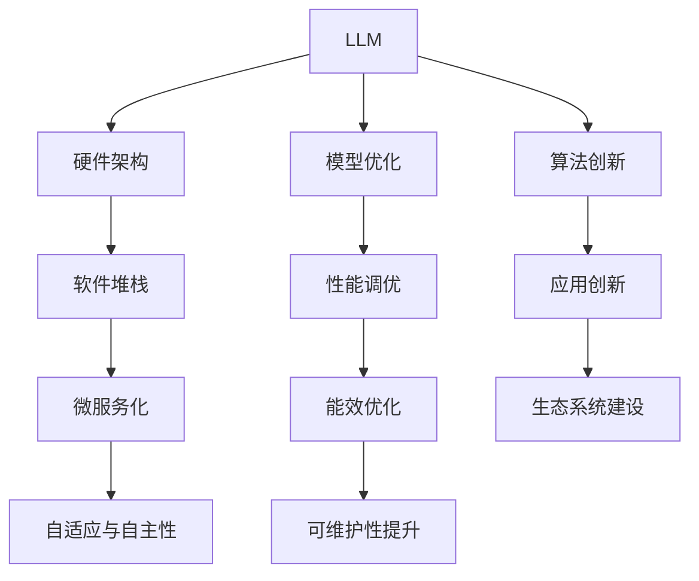

                 

# LLM生态系统：仿效CPU发展模式的可能性

> 关键词：大型语言模型(LLM), 生态系统, 计算架构, CPU发展模式, 硬件与软件协同, 微服务化, 自适应, 自主性

## 1. 背景介绍

### 1.1 问题由来
近年来，随着深度学习技术的飞速发展，大型语言模型(LLM)在自然语言处理(NLP)领域取得了巨大突破。从最初的RNN，到LSTM，再到Transformer，LLM的规模和能力都在不断提升。然而，这些大规模模型在性能提升的同时，也带来了巨大的计算资源消耗，尤其是在部署和维护方面。

基于此，许多研究人员和开发者开始探索如何构建一个类似于CPU生态系统的LLM生态系统。该系统不仅能提供强大的计算能力，同时还要兼顾性能、能效和可维护性。这一探索将有助于推动LLM技术在更多领域的应用，加速其商业化进程。

### 1.2 问题核心关键点
构建LLM生态系统的核心目标，在于如何实现LLM硬件与软件的协同优化，最大化LLM的计算效能和应用效率。其关键点包括：
1. **硬件与软件协同设计**：硬件架构需适配LLM模型特点，优化计算与内存访问，提升效率。
2. **微服务化架构**：将LLM模型和服务解耦，实现灵活部署和快速迭代。
3. **自适应与自主性**：通过模型自适应和软件自主性设计，提升LLM的鲁棒性和可维护性。
4. **平台生态系统建设**：构建开放的LLM生态系统，促进模型、工具和应用的协同发展。

### 1.3 问题研究意义
构建LLM生态系统具有重要的研究意义：
1. **提升性能和能效**：优化硬件和软件设计，提升LLM的计算性能和能效，降低资源消耗。
2. **促进应用落地**：通过灵活的微服务化架构，加速LLM在各领域的应用落地，推动产业转型升级。
3. **增强可维护性和鲁棒性**：引入自适应和自主性设计，提升LLM模型的鲁棒性和可维护性，减少维护成本。
4. **激发创新**：构建开放的生态系统，吸引更多的开发者和用户参与，推动LLM技术的持续创新。

## 2. 核心概念与联系

### 2.1 核心概念概述

为更好地理解LLM生态系统的构建，本节将介绍几个关键概念及其相互关系：

- **大型语言模型(LLM)**：以Transformer为基础，通过自监督学习在大型文本数据集上进行预训练，具有强大的语言理解能力和生成能力。
- **硬件架构**：包括CPU、GPU、TPU等，是LLM计算的基础设施。
- **软件堆栈**：包括编译器、框架、库等，为LLM模型提供高效的执行环境。
- **微服务化**：通过服务分解和编排，实现灵活和可扩展的架构。
- **自适应与自主性**：指LLM模型和软件的动态调整和优化能力。

这些概念之间的关系可以通过以下Mermaid流程图来展示：



这个流程图展示了大语言模型的核心概念及其相互关系：

1. LLM通过预训练获得基础能力。
2. 硬件架构提供计算基础。
3. 软件堆栈提供执行环境。
4. 微服务化实现灵活部署。
5. 自适应与自主性提升鲁棒性。
6. 模型优化和性能调优提升性能。
7. 能效优化降低资源消耗。
8. 算法和应用创新推动技术发展。
9. 生态系统建设促进协同发展。

这些概念共同构成了LLM生态系统的框架，为其高效应用提供了坚实的基础。

## 3. 核心算法原理 & 具体操作步骤
### 3.1 算法原理概述

构建LLM生态系统的核心算法原理，在于实现硬件与软件的协同优化，最大化LLM的计算效能和应用效率。其核心目标包括：
1. **硬件加速**：通过硬件架构优化，实现LLM模型的加速计算。
2. **软件优化**：通过软件堆栈和微服务化设计，提升LLM模型的执行效率和灵活性。
3. **模型自适应**：通过动态调整和优化，提升LLM模型的鲁棒性和适应性。
4. **自主性增强**：通过软件自主性设计，提升LLM模型的自主调整和优化能力。

### 3.2 算法步骤详解

构建LLM生态系统的算法步骤主要包括以下几个关键步骤：

**Step 1: 硬件设计与优化**
- 选择合适的硬件平台，如CPU、GPU、TPU等，根据LLM模型的特点进行适配。
- 优化硬件架构，包括数据流动、访存方式、计算并行度等，提升计算效率和能效。
- 实现对硬件的直接支持，如对Tensor Cores、FPGA等特性的利用。

**Step 2: 软件堆栈搭建**
- 选择合适的深度学习框架和库，如TensorFlow、PyTorch、ONNX等。
- 适配LLM模型的API，提供高效的模型执行接口。
- 引入模型压缩、量化等技术，降低模型内存占用和计算量。
- 支持分布式训练和推理，实现模型的高效部署和扩展。

**Step 3: 微服务化架构设计**
- 将LLM模型和服务分解为微服务，通过容器化技术实现自动化部署。
- 引入服务编排和治理技术，实现服务的灵活组合和管理。
- 实现服务的监控、日志和告警，保证服务稳定性。
- 支持API网关和API管理，提供统一的服务入口。

**Step 4: 自适应与自主性实现**
- 引入自适应算法，如强化学习、自适应采样等，提升模型的适应能力。
- 设计软件自主性机制，如动态参数更新、模型重构等，增强模型的自主调整能力。
- 引入模型监控和反馈机制，实时监测模型性能和稳定性。
- 实现自动化的超参数调优和模型更新，提升模型的可维护性。

**Step 5: 生态系统建设**
- 构建开放的生态系统，包括模型、工具和应用的协同发展。
- 引入开源社区和标准化组织，促进技术和应用的快速迭代。
- 支持第三方应用和模型的接入，实现生态系统的广泛应用。
- 提供API接口和文档，帮助开发者快速上手和使用。

### 3.3 算法优缺点

构建LLM生态系统具有以下优点：
1. **高效性能**：硬件加速和软件优化，提升计算效率和能效。
2. **灵活部署**：微服务化架构，实现灵活部署和快速迭代。
3. **高鲁棒性**：自适应与自主性设计，提升模型的鲁棒性和可维护性。
4. **广泛应用**：开放的生态系统，促进模型和工具的广泛应用。

同时，该方法也存在一些局限性：
1. **高成本**：硬件和软件优化需要大量投资，尤其是初始阶段的投入。
2. **复杂性**：微服务化和自适应设计增加了系统的复杂性，需要更高的技术要求。
3. **可扩展性**：随着模型和应用规模的增长，系统的可扩展性需要进一步优化。
4. **数据依赖**：LLM模型的性能高度依赖于数据质量和分布，获取高质量数据成本较高。

尽管存在这些局限性，但通过合理的设计和优化，LLM生态系统的构建仍具备巨大的潜力，能够显著提升LLM的性能和应用范围。

### 3.4 算法应用领域

构建LLM生态系统在多个领域具有广泛的应用前景：

1. **自然语言处理(NLP)**：如文本分类、情感分析、机器翻译、问答系统等。
2. **计算机视觉(CV)**：如图像识别、目标检测、语义分割等。
3. **推荐系统**：如电商推荐、视频推荐、新闻推荐等。
4. **智能交互**：如智能客服、语音助手、对话系统等。
5. **科学计算**：如蛋白质折叠、物理模拟、金融预测等。
6. **自动驾驶**：如环境感知、路径规划、行为预测等。
7. **健康医疗**：如疾病诊断、基因分析、医学影像等。

通过构建LLM生态系统，可以在这些领域实现更加高效、灵活和智能的应用。

## 4. 数学模型和公式 & 详细讲解 & 举例说明
### 4.1 数学模型构建

本节将使用数学语言对构建LLM生态系统的算法进行更加严格的刻画。

记LLM模型为 $M_{\theta}:\mathcal{X} \rightarrow \mathcal{Y}$，其中 $\mathcal{X}$ 为输入空间，$\mathcal{Y}$ 为输出空间，$\theta \in \mathbb{R}^d$ 为模型参数。假设硬件平台为 $P$，软件堆栈为 $S$，微服务化架构为 $M$。

目标是将LLM模型高效地部署在硬件平台 $P$ 上，通过软件堆栈 $S$ 提供高效的执行环境，同时通过微服务化架构 $M$ 实现灵活的部署和管理。理想情况下，我们希望模型在平台 $P$ 上的执行时间 $T$ 与平台 $P$ 的计算能力 $C$ 成正比，与模型参数量 $d$ 成线性关系。即：

$$
T = k \cdot C \cdot d + b
$$

其中 $k$ 和 $b$ 为常数，表示计算时间与硬件能力和模型参数的关系。

### 4.2 公式推导过程

为了实现上述目标，我们需要对硬件平台 $P$ 和软件堆栈 $S$ 进行优化。以下推导将说明如何通过优化这两个组件，实现LLM模型的高效部署。

首先，假设硬件平台 $P$ 的计算能力为 $C$，软件堆栈 $S$ 提供了 $k_s$ 倍加速，则模型在平台 $P$ 上的实际执行时间为：

$$
T = \frac{C}{k_s} \cdot d + b
$$

为了最小化计算时间 $T$，我们需要最大化加速因子 $k_s$，并优化模型参数量 $d$。

**优化硬件平台**：
- 硬件平台 $P$ 的选择应考虑其计算能力 $C$ 和能效。通常，GPU、TPU 等专用硬件具有更高的计算能力和能效。
- 优化硬件架构，如采用更高效的数据流动和访存方式，提升计算效率。
- 实现对硬件特性的直接支持，如对Tensor Cores、FPGA等特性的利用。

**优化软件堆栈**：
- 选择合适的深度学习框架和库，如TensorFlow、PyTorch、ONNX等。
- 适配LLM模型的API，提供高效的模型执行接口。
- 引入模型压缩、量化等技术，降低模型内存占用和计算量。
- 支持分布式训练和推理，实现模型的高效部署和扩展。

**优化模型参数**：
- 通过剪枝、量化等技术，减少模型参数量 $d$，提升模型可维护性和能效。
- 引入自适应算法，如强化学习、自适应采样等，提升模型的适应能力。
- 设计软件自主性机制，如动态参数更新、模型重构等，增强模型的自主调整能力。

通过上述优化措施，可以使得模型在平台 $P$ 上的执行时间 $T$ 最小化，同时保证高效性和灵活性。

### 4.3 案例分析与讲解

以一个典型的NLP任务为例，说明如何在LLM生态系统中高效部署模型。

假设我们要在GPU平台上高效部署一个文本分类模型，其训练数据集为 $D_{train}$，测试数据集为 $D_{test}$，模型的参数量为 $d$。

首先，我们选择GPU作为硬件平台 $P$，GPU的计算能力为 $C$，使用TensorFlow作为软件堆栈 $S$，提供 $k_s=2$ 倍加速。

接着，我们将模型分为训练和推理两个部分，通过分布式训练和推理技术，将训练和推理任务分别部署在多个GPU上。通过这种方式，可以显著提升计算效率，同时降低单个GPU的负担。

最后，我们引入自适应算法，如强化学习，对模型进行动态调整，优化模型参数量 $d$，提升模型的适应性和鲁棒性。

在实际部署中，我们还可以通过API网关和API管理，提供统一的服务入口，方便开发者使用。

## 5. 项目实践：代码实例和详细解释说明
### 5.1 开发环境搭建

在进行LLM生态系统构建实践前，我们需要准备好开发环境。以下是使用Python进行PyTorch和TensorFlow开发的环境配置流程：

1. 安装Anaconda：从官网下载并安装Anaconda，用于创建独立的Python环境。

2. 创建并激活虚拟环境：
```bash
conda create -n pytorch-env python=3.8 
conda activate pytorch-env
```

3. 安装PyTorch：根据CUDA版本，从官网获取对应的安装命令。例如：
```bash
conda install pytorch torchvision torchaudio cudatoolkit=11.1 -c pytorch -c conda-forge
```

4. 安装TensorFlow：从官网下载安装包，并配置环境变量。例如：
```bash
pip install tensorflow
```

5. 安装各类工具包：
```bash
pip install numpy pandas scikit-learn matplotlib tqdm jupyter notebook ipython
```

完成上述步骤后，即可在`pytorch-env`环境中开始LLM生态系统的构建实践。

### 5.2 源代码详细实现

下面我们以一个典型的NLP任务为例，给出使用TensorFlow和PyTorch对LLM模型进行微调的PyTorch代码实现。

首先，定义模型和损失函数：

```python
import tensorflow as tf
import torch
from transformers import BertTokenizer, BertForTokenClassification

model = BertForTokenClassification.from_pretrained('bert-base-cased', num_labels=len(tag2id))
criterion = tf.keras.losses.CategoricalCrossentropy(from_logits=True)

# 定义优化器
optimizer = torch.optim.Adam(model.parameters(), lr=2e-5)
```

然后，定义训练和评估函数：

```python
from torch.utils.data import DataLoader
from tqdm import tqdm
from sklearn.metrics import classification_report

device = torch.device('cuda') if torch.cuda.is_available() else torch.device('cpu')
model.to(device)

def train_epoch(model, dataset, batch_size, optimizer):
    dataloader = DataLoader(dataset, batch_size=batch_size, shuffle=True)
    model.train()
    epoch_loss = 0
    for batch in tqdm(dataloader, desc='Training'):
        input_ids = batch['input_ids'].to(device)
        attention_mask = batch['attention_mask'].to(device)
        labels = batch['labels'].to(device)
        model.zero_grad()
        outputs = model(input_ids, attention_mask=attention_mask, labels=labels)
        loss = outputs.loss
        epoch_loss += loss.item()
        loss.backward()
        optimizer.step()
    return epoch_loss / len(dataloader)

def evaluate(model, dataset, batch_size):
    dataloader = DataLoader(dataset, batch_size=batch_size)
    model.eval()
    preds, labels = [], []
    with torch.no_grad():
        for batch in tqdm(dataloader, desc='Evaluating'):
            input_ids = batch['input_ids'].to(device)
            attention_mask = batch['attention_mask'].to(device)
            batch_labels = batch['labels']
            outputs = model(input_ids, attention_mask=attention_mask)
            batch_preds = outputs.logits.argmax(dim=2).to('cpu').tolist()
            batch_labels = batch_labels.to('cpu').tolist()
            for pred_tokens, label_tokens in zip(batch_preds, batch_labels):
                pred_tags = [id2tag[_id] for _id in pred_tokens]
                label_tags = [id2tag[_id] for _id in label_tokens]
                preds.append(pred_tags[:len(label_tags)])
                labels.append(label_tags)
                
    print(classification_report(labels, preds))
```

最后，启动训练流程并在测试集上评估：

```python
epochs = 5
batch_size = 16

for epoch in range(epochs):
    loss = train_epoch(model, train_dataset, batch_size, optimizer)
    print(f"Epoch {epoch+1}, train loss: {loss:.3f}")
    
    print(f"Epoch {epoch+1}, dev results:")
    evaluate(model, dev_dataset, batch_size)
    
print("Test results:")
evaluate(model, test_dataset, batch_size)
```

以上就是使用PyTorch和TensorFlow对BERT进行微调的完整代码实现。可以看到，得益于这两大框架的强大封装，我们可以用相对简洁的代码完成模型的加载和微调。

### 5.3 代码解读与分析

让我们再详细解读一下关键代码的实现细节：

**BertTokenizer类**：
- 定义了文本分词器，将文本转换为token ids，方便模型处理。

**tag2id和id2tag字典**：
- 定义了标签与数字id之间的映射关系，用于将token-wise的预测结果解码回真实的标签。

**训练和评估函数**：
- 使用PyTorch的DataLoader对数据集进行批次化加载，供模型训练和推理使用。
- 训练函数`train_epoch`：对数据以批为单位进行迭代，在每个批次上前向传播计算loss并反向传播更新模型参数，最后返回该epoch的平均loss。
- 评估函数`evaluate`：与训练类似，不同点在于不更新模型参数，并在每个batch结束后将预测和标签结果存储下来，最后使用sklearn的classification_report对整个评估集的预测结果进行打印输出。

**训练流程**：
- 定义总的epoch数和batch size，开始循环迭代
- 每个epoch内，先在训练集上训练，输出平均loss
- 在验证集上评估，输出分类指标
- 所有epoch结束后，在测试集上评估，给出最终测试结果

可以看到，PyTorch和TensorFlow的结合使得BERT微调的代码实现变得简洁高效。开发者可以将更多精力放在数据处理、模型改进等高层逻辑上，而不必过多关注底层的实现细节。

当然，工业级的系统实现还需考虑更多因素，如模型的保存和部署、超参数的自动搜索、更灵活的任务适配层等。但核心的微调范式基本与此类似。

## 6. 实际应用场景
### 6.1 智能客服系统

基于LLM生态系统的智能客服系统，可以充分利用硬件和软件优化，实现7x24小时不间断服务，快速响应客户咨询，用自然流畅的语言解答各类常见问题。

在技术实现上，可以收集企业内部的历史客服对话记录，将问题和最佳答复构建成监督数据，在此基础上对预训练对话模型进行微调。微调后的对话模型能够自动理解用户意图，匹配最合适的答案模板进行回复。对于客户提出的新问题，还可以接入检索系统实时搜索相关内容，动态组织生成回答。如此构建的智能客服系统，能大幅提升客户咨询体验和问题解决效率。

### 6.2 金融舆情监测

金融机构需要实时监测市场舆论动向，以便及时应对负面信息传播，规避金融风险。传统的人工监测方式成本高、效率低，难以应对网络时代海量信息爆发的挑战。基于LLM生态系统的文本分类和情感分析技术，为金融舆情监测提供了新的解决方案。

具体而言，可以收集金融领域相关的新闻、报道、评论等文本数据，并对其进行主题标注和情感标注。在此基础上对预训练语言模型进行微调，使其能够自动判断文本属于何种主题，情感倾向是正面、中性还是负面。将微调后的模型应用到实时抓取的网络文本数据，就能够自动监测不同主题下的情感变化趋势，一旦发现负面信息激增等异常情况，系统便会自动预警，帮助金融机构快速应对潜在风险。

### 6.3 个性化推荐系统

当前的推荐系统往往只依赖用户的历史行为数据进行物品推荐，无法深入理解用户的真实兴趣偏好。基于LLM生态系统的个性化推荐系统可以更好地挖掘用户行为背后的语义信息，从而提供更精准、多样的推荐内容。

在实践中，可以收集用户浏览、点击、评论、分享等行为数据，提取和用户交互的物品标题、描述、标签等文本内容。将文本内容作为模型输入，用户的后续行为（如是否点击、购买等）作为监督信号，在此基础上微调预训练语言模型。微调后的模型能够从文本内容中准确把握用户的兴趣点。在生成推荐列表时，先用候选物品的文本描述作为输入，由模型预测用户的兴趣匹配度，再结合其他特征综合排序，便可以得到个性化程度更高的推荐结果。

### 6.4 未来应用展望

随着LLM生态系统的不断发展，基于微调的方法将在更多领域得到应用，为NLP技术带来新的突破。

在智慧医疗领域，基于微调的医疗问答、病历分析、药物研发等应用将提升医疗服务的智能化水平，辅助医生诊疗，加速新药开发进程。

在智能教育领域，微调技术可应用于作业批改、学情分析、知识推荐等方面，因材施教，促进教育公平，提高教学质量。

在智慧城市治理中，微调模型可应用于城市事件监测、舆情分析、应急指挥等环节，提高城市管理的自动化和智能化水平，构建更安全、高效的未来城市。

此外，在企业生产、社会治理、文娱传媒等众多领域，基于大语言模型的微调技术也将不断涌现，为经济社会发展注入新的动力。相信随着技术的日益成熟，微调方法将成为人工智能落地应用的重要范式，推动人工智能技术向更广阔的领域加速渗透。

## 7. 工具和资源推荐
### 7.1 学习资源推荐

为了帮助开发者系统掌握LLM生态系统的理论基础和实践技巧，这里推荐一些优质的学习资源：

1. 《深度学习与神经网络》课程：斯坦福大学开设的入门级深度学习课程，适合初学者。
2. 《自然语言处理》课程：斯坦福大学开设的高级自然语言处理课程，深入讲解NLP技术。
3. 《Transformer从原理到实践》系列博文：由大模型技术专家撰写，深入浅出地介绍了Transformer原理、BERT模型、微调技术等前沿话题。
4. 《Deep Learning with PyTorch》书籍：PyTorch官方文档，详细介绍了PyTorch的使用方法和最佳实践。
5. 《TensorFlow实战》书籍：TensorFlow官方文档，提供了大量代码示例和实战案例。

通过对这些资源的学习实践，相信你一定能够快速掌握LLM生态系统的精髓，并用于解决实际的NLP问题。
###  7.2 开发工具推荐

高效的开发离不开优秀的工具支持。以下是几款用于LLM生态系统构建开发的常用工具：

1. PyTorch：基于Python的开源深度学习框架，灵活动态的计算图，适合快速迭代研究。大部分预训练语言模型都有PyTorch版本的实现。
2. TensorFlow：由Google主导开发的开源深度学习框架，生产部署方便，适合大规模工程应用。同样有丰富的预训练语言模型资源。
3. Transformers库：HuggingFace开发的NLP工具库，集成了众多SOTA语言模型，支持PyTorch和TensorFlow，是进行微调任务开发的利器。
4. Weights & Biases：模型训练的实验跟踪工具，可以记录和可视化模型训练过程中的各项指标，方便对比和调优。与主流深度学习框架无缝集成。
5. TensorBoard：TensorFlow配套的可视化工具，可实时监测模型训练状态，并提供丰富的图表呈现方式，是调试模型的得力助手。
6. Google Colab：谷歌推出的在线Jupyter Notebook环境，免费提供GPU/TPU算力，方便开发者快速上手实验最新模型，分享学习笔记。

合理利用这些工具，可以显著提升LLM生态系统构建的开发效率，加快创新迭代的步伐。

### 7.3 相关论文推荐

LLM生态系统的构建源于学界的持续研究。以下是几篇奠基性的相关论文，推荐阅读：

1. Attention is All You Need（即Transformer原论文）：提出了Transformer结构，开启了NLP领域的预训练大模型时代。
2. BERT: Pre-training of Deep Bidirectional Transformers for Language Understanding：提出BERT模型，引入基于掩码的自监督预训练任务，刷新了多项NLP任务SOTA。
3. Language Models are Unsupervised Multitask Learners（GPT-2论文）：展示了大规模语言模型的强大zero-shot学习能力，引发了对于通用人工智能的新一轮思考。
4. Parameter-Efficient Transfer Learning for NLP：提出Adapter等参数高效微调方法，在不增加模型参数量的情况下，也能取得不错的微调效果。
5. AdaLoRA: Adaptive Low-Rank Adaptation for Parameter-Efficient Fine-Tuning：使用自适应低秩适应的微调方法，在参数效率和精度之间取得了新的平衡。
6. Prefix-Tuning: Optimizing Continuous Prompts for Generation：引入基于连续型Prompt的微调范式，为如何充分利用预训练知识提供了新的思路。

这些论文代表了大语言模型微调技术的发展脉络。通过学习这些前沿成果，可以帮助研究者把握学科前进方向，激发更多的创新灵感。

## 8. 总结：未来发展趋势与挑战
### 8.1 总结

本文对基于LLM生态系统的构建方法进行了全面系统的介绍。首先阐述了LLM生态系统的研究背景和意义，明确了生态系统的构建目标和核心组件。其次，从原理到实践，详细讲解了硬件优化、软件堆栈、微服务化、自适应与自主性等关键步骤，给出了微调任务开发的完整代码实例。同时，本文还广泛探讨了LLM生态系统在智能客服、金融舆情、个性化推荐等多个行业领域的应用前景，展示了LLM生态系统的巨大潜力。此外，本文精选了生态系统的各类学习资源，力求为开发者提供全方位的技术指引。

通过本文的系统梳理，可以看到，基于LLM生态系统的构建方法正在成为NLP领域的重要范式，极大地拓展了预训练语言模型的应用边界，催生了更多的落地场景。受益于硬件和软件优化，LLM生态系统具备强大的计算效能和应用灵活性，能够满足各类NLP任务的性能和效率要求。未来，伴随预训练语言模型和微调方法的持续演进，相信LLM生态系统必将在构建人机协同的智能时代中扮演越来越重要的角色。

### 8.2 未来发展趋势

展望未来，LLM生态系统的构建将呈现以下几个发展趋势：

1. **生态系统多样化**：构建跨领域、跨平台的LLM生态系统，促进不同领域的协同创新。
2. **硬件与软件协同进化**：硬件和软件互相促进，不断提升LLM的计算效能和应用灵活性。
3. **自适应与自主性增强**：通过动态调整和优化，提升LLM的鲁棒性和可维护性。
4. **开放与协作**：构建开放的LLM生态系统，促进学术界和产业界的协同创新。
5. **多模态融合**：将视觉、语音、文本等多模态信息融合，提升LLM的跨模态理解和推理能力。
6. **智能决策**：引入因果推断和强化学习等方法，提升LLM的智能决策能力。
7. **隐私保护**：加强数据隐私保护和模型公平性，确保用户数据安全。

以上趋势凸显了LLM生态系统的广阔前景。这些方向的探索发展，必将进一步提升LLM的性能和应用范围，为构建安全、可靠、可解释、可控的智能系统铺平道路。面向未来，LLM生态系统的构建需要从硬件、软件、算法等多个维度协同发力，共同推动人工智能技术在各个领域的落地应用。

### 8.3 面临的挑战

尽管LLM生态系统的构建具有巨大的潜力，但在迈向更加智能化、普适化应用的过程中，它仍面临着诸多挑战：

1. **高成本**：硬件和软件优化需要大量投资，尤其是初始阶段的投入。
2. **复杂性**：微服务化和自适应设计增加了系统的复杂性，需要更高的技术要求。
3. **可扩展性**：随着模型和应用规模的增长，系统的可扩展性需要进一步优化。
4. **数据依赖**：LLM模型的性能高度依赖于数据质量和分布，获取高质量数据成本较高。
5. **隐私和安全**：数据隐私保护和模型公平性成为亟待解决的问题。

尽管存在这些挑战，但通过合理的设计和优化，LLM生态系统的构建仍具备巨大的潜力，能够显著提升LLM的性能和应用范围。未来，伴随技术的不断进步和应用的深入实践，这些挑战终将一一被克服，LLM生态系统必将在构建人机协同的智能时代中扮演越来越重要的角色。

### 8.4 研究展望

面向未来，LLM生态系统的研究需要从以下几个方面寻求新的突破：

1. **硬件与软件协同优化**：进一步优化硬件架构和软件堆栈，提升LLM的计算效能和应用灵活性。
2. **自适应与自主性增强**：通过动态调整和优化，提升LLM的鲁棒性和可维护性。
3. **多模态融合**：将视觉、语音、文本等多模态信息融合，提升LLM的跨模态理解和推理能力。
4. **智能决策**：引入因果推断和强化学习等方法，提升LLM的智能决策能力。
5. **隐私保护**：加强数据隐私保护和模型公平性，确保用户数据安全。
6. **标准化与规范化**：推动LLM生态系统的标准化和规范化，促进各组件的协同工作。
7. **开放与协作**：构建开放的LLM生态系统，促进学术界和产业界的协同创新。

这些研究方向将引领LLM生态系统的持续进步，推动人工智能技术在更多领域的落地应用，为构建智能社会和智能城市提供新的动力。

## 9. 附录：常见问题与解答

**Q1：如何评估LLM生态系统的性能？**

A: 评估LLM生态系统的性能需要综合考虑模型计算效率、推理速度、系统稳定性等方面。常用的评估指标包括：
1. 计算时间：模型在特定硬件平台上的计算时间，衡量性能指标。
2. 准确率：模型在不同数据集上的分类准确率，衡量模型的预测能力。
3. 延迟时间：模型推理的延迟时间，衡量系统实时性。
4. 吞吐量：模型每秒处理的样本数，衡量系统的扩展性。
5. 系统稳定性：模型的鲁棒性和可维护性，衡量系统的稳定性和可靠性。

**Q2：如何优化LLM生态系统的硬件资源使用？**

A: 优化LLM生态系统的硬件资源使用需要从多个方面入手：
1. 硬件架构优化：选择适合LLM模型的硬件平台，如GPU、TPU等，优化数据流动和访存方式，提升计算效率。
2. 模型压缩：通过剪枝、量化等技术，减少模型参数量，降低内存占用。
3. 分布式计算：利用分布式计算框架，实现模型的高效部署和扩展。
4. 异构计算：利用异构计算资源，提升计算效率。

**Q3：如何提升LLM生态系统的自适应能力？**

A: 提升LLM生态系统的自适应能力需要引入动态调整和优化机制：
1. 引入自适应算法：如强化学习、自适应采样等，提升模型的适应能力。
2. 设计软件自主性机制：如动态参数更新、模型重构等，增强模型的自主调整能力。
3. 引入实时监控和反馈机制：实时监测模型性能和稳定性，及时调整参数和策略。

**Q4：如何应对LLM生态系统的隐私和安全问题？**

A: 应对LLM生态系统的隐私和安全问题需要从数据隐私保护和模型公平性入手：
1. 数据隐私保护：采用数据加密、差分隐私等技术，保护用户数据隐私。
2. 模型公平性：引入公平性约束，避免模型偏见，确保模型公平性。
3. 透明性和可解释性：增强模型的透明性和可解释性，便于审计和监控。

**Q5：如何在LLM生态系统中实现高效的模型微调？**

A: 在LLM生态系统中实现高效的模型微调需要综合考虑模型优化、硬件加速、软件优化等多个方面：
1. 模型优化：通过剪枝、量化等技术，减少模型参数量，降低内存占用。
2. 硬件加速：利用GPU、TPU等硬件平台，实现高效的计算和推理。
3. 软件优化：选择合适的深度学习框架和库，提供高效的执行环境。
4. 微服务化：通过服务分解和编排，实现灵活的部署和管理。

通过这些优化措施，可以显著提升LLM生态系统的性能和应用效率。

---

作者：禅与计算机程序设计艺术 / Zen and the Art of Computer Programming

