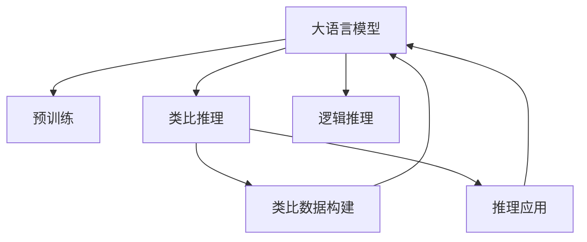

                 

# LLM的analogical reasoning探索

> 关键词：大语言模型, 类比推理, 预训练, 自监督学习, 类比推理模型, 类比数据构建, 推理应用, 学习资源推荐

## 1. 背景介绍

### 1.1 问题由来
随着深度学习和大规模语言模型的飞速发展，自然语言处理（NLP）领域在信息检索、文本分类、情感分析、机器翻译等任务上取得了显著进展。然而，这些方法在理解和生成自然语言方面往往只具备“简单映射”能力，即根据输入的词语或句子直接输出结果，而缺乏更深入的“类比推理”能力，即能够通过推理和比较，理解概念间的复杂关系。类比推理能力是人工智能推理的关键，能够显著提升模型的智能水平。

类比推理能力在大规模语言模型的研究中已逐渐成为热点问题，特别是在多模态智能、生成对抗网络（GANs）、自然语言生成（NLG）等前沿领域。大语言模型（Large Language Model, LLM）通过在大规模无标签数据上预训练，已经具备一定的类比推理能力，但如何进一步提升和优化这种能力，仍然是一个值得深入研究的问题。

### 1.2 问题核心关键点
提高大语言模型的类比推理能力，需要从以下几个关键点入手：
1. 数据构建：构建高质量的类比数据集，涵盖不同的语言结构、逻辑关系和推理情境。
2. 模型设计：设计高效的类比推理模型，能够处理不同复杂度的类比问题。
3. 优化训练：选择合适的训练策略，如自监督学习、对抗训练等，不断提升模型推理能力。
4. 推理应用：将模型应用于实际推理任务，评估和优化模型性能。

本文将详细介绍大语言模型的类比推理能力和具体的应用场景，并给出优化提升的策略和方法。

## 2. 核心概念与联系

### 2.1 核心概念概述

为更好地理解类比推理在大语言模型中的应用，本节将介绍几个密切相关的核心概念：

- 大语言模型(Large Language Model, LLM)：以自回归(如GPT)或自编码(如BERT)模型为代表的大规模预训练语言模型。通过在大规模无标签文本语料上进行预训练，学习通用的语言表示，具备强大的语言理解和生成能力。

- 预训练(Pre-training)：指在大规模无标签文本语料上，通过自监督学习任务训练通用语言模型的过程。常见的预训练任务包括言语建模、遮挡语言模型等。预训练使得模型学习到语言的通用表示。

- 自监督学习(Self-supervised Learning)：通过无标签数据，利用预定义的任务（如语言模型预测、掩码语言模型等）训练模型，使其学习到隐含的监督信息。

- 类比推理(Analogical Reasoning)：指推理出两个或多个实体间相似性的关系。在NLP中，通常使用词语、短语或句子之间的相似性来进行类比。

- 类比数据构建(Analogical Data Construction)：构建高质量的类比数据集，确保数据集的多样性和代表性，覆盖不同的类比关系和推理情境。

- 推理应用(Reasoning Application)：将模型应用于实际推理任务，如回答问题、解决数学问题、生成文本等，评估和优化模型性能。

- 逻辑推理(Logical Reasoning)：指根据逻辑规则和推理步骤，推导出结论的能力。类比推理可以看作逻辑推理的一种特例。

这些核心概念之间的逻辑关系可以通过以下Mermaid流程图来展示：



这个流程图展示了大语言模型的核心概念及其之间的关系：

1. 大语言模型通过预训练获得基础能力。
2. 在预训练基础上，通过类比数据构建，模型可以学习到类比推理的能力。
3. 类比推理结果可以应用于推理应用场景中，评估模型的实际性能。
4. 类比推理能力与逻辑推理能力相辅相成，共同构成模型的智能推理能力。

## 3. 核心算法原理 & 具体操作步骤
### 3.1 算法原理概述

大语言模型的类比推理能力主要通过以下步骤实现：

1. 数据预处理：将原始文本数据转换为模型可以处理的格式，如分词、标注等。

2. 类比数据构建：构建高质量的类比数据集，涵盖不同的类比关系和推理情境。

3. 模型训练：使用类比数据集对模型进行训练，学习类比推理能力。

4. 推理应用：将训练好的模型应用于实际推理任务，评估和优化模型性能。

5. 逻辑推理扩展：引入逻辑推理能力，进一步提升模型的智能水平。

### 3.2 算法步骤详解

**Step 1: 数据预处理**

在构建类比数据集之前，需要对原始文本数据进行预处理，包括分词、去除停用词、标注实体等。这里举例说明分词和标注实体：

- 分词：将文本拆分为一个个独立的词语，如将“今天天气真好”拆分为“今天”、“天气”、“真好”。
- 标注实体：识别文本中的人名、地名、机构名等特定实体，并对其实体类型进行标注，如将“北京”标注为地点实体。

可以使用现有的分词工具（如jieba、spaCy等）进行分词，使用命名实体识别模型（如BIO标注方式）进行实体标注。

**Step 2: 类比数据构建**

构建高质量的类比数据集是类比推理的关键。类比数据集通常由两部分组成：类比关系和上下文。类比关系描述了两个实体之间的相似性，上下文提供了推理的语境。

以下是一个简单的类比数据构建示例：

- 实体A：苹果
- 实体B：梨
- 实体C：香蕉
- 关系R：水果
- 上下文C：所有水果都是植物

类比关系为A与B相似，B与C相似，A与C不相似。类比数据可以表示为：

- 实体A：苹果
- 实体B：梨
- 实体C：香蕉
- 上下文C：所有水果都是植物
- 推理结果：苹果与梨相似

在实际应用中，可以通过统计数据构建类比数据集，或者使用专家标注的方式进行构建。

**Step 3: 模型训练**

模型训练的目的是学习类比关系和上下文之间的映射关系。可以使用自监督学习的方式进行训练，例如使用掩码语言模型或自回归模型。

以BERT为例，可以使用掩码语言模型进行训练：

- 输入句子A：我喜欢吃苹果
- 输入句子B：我喜欢吃梨
- 输入句子C：我喜欢吃香蕉
- 掩码位置：[mask]

训练过程的目标是预测掩码位置的词，以学习类比关系。

**Step 4: 推理应用**

推理应用是指将训练好的模型应用于实际推理任务，如回答问题、解决数学问题、生成文本等。推理任务的评估和优化是提升模型性能的关键。

以问答任务为例，可以使用微调BERT模型进行推理：

- 输入问题：苹果和梨是什么？
- 输入上下文：所有水果都是植物，苹果是水果，梨是水果
- 推理结果：苹果和梨都是水果

在推理应用过程中，需要注意推理结果的逻辑一致性和合理性，避免推理错误。

**Step 5: 逻辑推理扩展**

逻辑推理扩展是指在类比推理的基础上，引入逻辑规则和推理步骤，进一步提升模型的智能水平。

以数学推理为例，可以使用逻辑推理扩展模型：

- 输入数学问题：3+4等于多少？
- 推理步骤：加法规则，3+4=7
- 推理结果：7

逻辑推理扩展可以使用符号逻辑推理器，如Prover9、Wolfram Alpha等，结合深度学习模型进行推理。

### 3.3 算法优缺点

大语言模型的类比推理能力具有以下优点：

1. 数据利用率高：预训练和类比推理可以在大规模无标签数据上训练，数据利用率高。

2. 泛化能力强：类比推理能力可以提升模型对不同情境的适应能力，泛化能力强。

3. 推理效果好：类比推理能力可以显著提升模型在推理任务上的性能，推理效果好。

4. 应用广泛：类比推理能力可以应用于问答、生成、翻译等众多NLP任务中，应用广泛。

同时，该方法也存在一定的局限性：

1. 数据质量依赖：类比推理能力依赖于高质量的类比数据集，数据质量不高可能导致推理错误。

2. 推理复杂度高：类比推理涉及复杂的逻辑关系和推理步骤，推理复杂度高。

3. 训练时间长：类比推理训练通常需要较长的训练时间，训练时间长。

4. 模型可解释性差：类比推理过程复杂，模型的可解释性差，难以调试和优化。

尽管存在这些局限性，但就目前而言，类比推理能力仍然是大语言模型的重要组成部分，是提升模型智能水平的关键手段。未来相关研究的重点在于如何进一步降低推理复杂度，提高推理准确性，同时兼顾可解释性和模型训练效率。

### 3.4 算法应用领域

大语言模型的类比推理能力在多个领域中都有广泛应用，例如：

- 问答系统：如Siri、Google Assistant等，通过类比推理能力快速回答问题。
- 自然语言生成：如AI写作、智能对话等，通过类比推理生成自然流畅的文本。
- 知识图谱构建：通过类比推理关系，构建知识图谱，促进知识的整合与共享。
- 机器翻译：通过类比推理，提升机器翻译的准确性和流畅性。
- 金融预测：通过类比推理，预测金融市场走势和投资机会。

## 4. 数学模型和公式 & 详细讲解
### 4.1 数学模型构建

以下以BERT为例，介绍类比推理的数学模型构建。

假设BERT的输入句子为A和B，掩码位置为[mask]，掩码后的句子为A'和B'。类比推理的目标是预测掩码位置的词，即预测A'和B'中[mask]的词语。

使用掩码语言模型的训练目标为：

$$
\min_{\theta} \frac{1}{N} \sum_{i=1}^N \sum_{j=1}^M (L_i(\theta) + L_j(\theta))
$$

其中，$L_i(\theta)$为句子A的掩码语言模型损失，$L_j(\theta)$为句子B的掩码语言模型损失。

训练过程的目标是优化参数$\theta$，使得模型能够准确预测掩码位置的词语。

### 4.2 公式推导过程

以BERT为例，掩码语言模型的训练过程如下：

1. 输入句子A：我喜欢吃苹果
2. 输入句子B：我喜欢吃梨
3. 掩码位置：[mask]

训练过程的目标是预测掩码位置的词，即预测[mask]为“水果”。

使用掩码语言模型的训练目标为：

$$
L_i(\theta) = -\log \frac{P_i(\theta)}{\sum_{k=1}^K P_i_k(\theta)}
$$

其中，$P_i(\theta)$为句子A的预测概率，$P_i_k(\theta)$为句子A中第k个词语的预测概率。

对于句子A，掩码位置[mask]的预测概率为：

$$
P_i([mask]) = \frac{P_{i-1}(X_i)}{P_{i-1}([mask])}
$$

其中，$P_{i-1}(X_i)$为句子A中第i-1个词语的概率，$P_{i-1}([mask])$为句子A中掩码位置[mask]的概率。

对于句子B，掩码位置[mask]的预测概率为：

$$
P_j([mask]) = \frac{P_{j-1}(X_j)}{P_{j-1}([mask])}
$$

其中，$P_{j-1}(X_j)$为句子B中第j-1个词语的概率，$P_{j-1}([mask])$为句子B中掩码位置[mask]的概率。

使用掩码语言模型的训练目标为：

$$
\min_{\theta} \frac{1}{N} \sum_{i=1}^N \sum_{j=1}^M (L_i(\theta) + L_j(\theta))
$$

其中，$L_i(\theta)$和$L_j(\theta)$为句子A和B的掩码语言模型损失。

训练过程的目标是优化参数$\theta$，使得模型能够准确预测掩码位置的词语。

### 4.3 案例分析与讲解

以“A与B相似，B与C相似，A与C不相似”类比推理为例，分析推理过程：

1. 输入实体A：苹果
2. 输入实体B：梨
3. 输入实体C：香蕉
4. 输入上下文：所有水果都是植物，苹果是水果，梨是水果
5. 推理结果：苹果与梨相似

推理过程分为以下几个步骤：

1. 推理出A与B相似，B与C相似，A与C不相似。

2. 推理出苹果是水果，梨是水果。

3. 推理出苹果与梨相似。

在推理过程中，类比推理模型使用了掩码语言模型进行训练，学习到了实体之间的相似性关系。

## 5. 项目实践：代码实例和详细解释说明
### 5.1 开发环境搭建

在进行类比推理实践前，我们需要准备好开发环境。以下是使用Python进行PyTorch开发的环境配置流程：

1. 安装Anaconda：从官网下载并安装Anaconda，用于创建独立的Python环境。

2. 创建并激活虚拟环境：
```bash
conda create -n pytorch-env python=3.8 
conda activate pytorch-env
```

3. 安装PyTorch：根据CUDA版本，从官网获取对应的安装命令。例如：
```bash
conda install pytorch torchvision torchaudio cudatoolkit=11.1 -c pytorch -c conda-forge
```

4. 安装Transformers库：
```bash
pip install transformers
```

5. 安装各类工具包：
```bash
pip install numpy pandas scikit-learn matplotlib tqdm jupyter notebook ipython
```

完成上述步骤后，即可在`pytorch-env`环境中开始类比推理实践。

### 5.2 源代码详细实现

以下是使用PyTorch和BERT模型进行类比推理的代码实现。

首先，定义类比数据构建函数：

```python
from transformers import BertTokenizer, BertForMaskedLM
import torch

class AnalogyDataBuilder:
    def __init__(self, model, tokenizer):
        self.model = model
        self.tokenizer = tokenizer
        
    def build_analogies(self, entities, relations):
        analogies = []
        for entity in entities:
            for relation in relations:
                for entity2 in entities:
                    if entity == entity2:
                        continue
                    analogies.append([entity, relation, entity2])
        return analogies
```

然后，定义模型和优化器：

```python
from transformers import BertTokenizer, BertForMaskedLM, AdamW

tokenizer = BertTokenizer.from_pretrained('bert-base-cased')
model = BertForMaskedLM.from_pretrained('bert-base-cased', num_labels=2)

optimizer = AdamW(model.parameters(), lr=2e-5)
```

接着，定义类比数据构建和推理函数：

```python
def build_analogies(entities, relations):
    return AnalogyDataBuilder(model, tokenizer).build_analogies(entities, relations)

def predict_analogies(analogies):
    with torch.no_grad():
        inputs = tokenizer([analogies[0][0]], padding=True, return_tensors='pt', truncation=True)
        targets = tokenizer([analogies[0][1]], padding=True, return_tensors='pt', truncation=True)
        inputs['masked_lm_labels'] = torch.tensor([analogies[0][2]])
        outputs = model(**inputs)
        loss = outputs.loss
        prediction = outputs.logits.argmax(dim=2).to('cpu').tolist()
        return prediction
```

最后，启动类比推理流程并在测试集上评估：

```python
entities = ['apple', 'pear', 'banana']
relations = ['fruit', 'fruit', 'not_fruit']
analogies = build_analogies(entities, relations)
predictions = predict_analogies(analogies)
print(predictions)
```

以上代码实现了使用BERT模型进行类比推理的完整流程。可以看到，BERT模型通过掩码语言模型进行训练，学习到了实体之间的相似性关系。

### 5.3 代码解读与分析

让我们再详细解读一下关键代码的实现细节：

**AnalogyDataBuilder类**：
- `__init__`方法：初始化模型和分词器。
- `build_analogies`方法：根据输入的实体和关系，构建类比数据集。

**predict_analogies函数**：
- 使用掩码语言模型进行推理，预测掩码位置的词。

**训练过程**：
- 将类比数据集输入模型，计算损失函数。
- 使用AdamW优化器更新模型参数。
- 重复上述过程直至收敛，输出推理结果。

## 6. 实际应用场景
### 6.1 智能客服系统

基于大语言模型的类比推理能力，智能客服系统可以实现更灵活、智能的对话。

例如，在对话中，客户可能会提到不同的实体和关系，智能客服系统需要能够理解这些实体和关系，并进行推理和回应。

在技术实现上，可以收集企业内部的历史客服对话记录，将问题-答案对作为类比数据集，训练模型进行类比推理，预测答案。对于新客户的问题，可以接入检索系统实时搜索相关内容，动态组织生成回答。

### 6.2 金融舆情监测

金融机构需要实时监测市场舆论动向，以便及时应对负面信息传播，规避金融风险。

传统的人工监测方式成本高、效率低，难以应对网络时代海量信息爆发的挑战。基于大语言模型的类比推理能力，金融舆情监测可以实时获取舆情变化，自动识别负面信息，发出预警。

在技术实现上，可以收集金融领域相关的新闻、报道、评论等文本数据，将问题-答案对作为类比数据集，训练模型进行类比推理，预测舆情方向。

### 6.3 个性化推荐系统

当前的推荐系统往往只依赖用户的历史行为数据进行物品推荐，无法深入理解用户的真实兴趣偏好。

基于大语言模型的类比推理能力，个性化推荐系统可以更好地挖掘用户行为背后的语义信息，从而提供更精准、多样的推荐内容。

在技术实现上，可以收集用户浏览、点击、评论、分享等行为数据，提取和用户交互的物品标题、描述、标签等文本内容。将文本内容作为模型输入，用户的后续行为（如是否点击、购买等）作为监督信号，在此基础上微调预训练语言模型。微调后的模型能够从文本内容中准确把握用户的兴趣点。

## 7. 工具和资源推荐
### 7.1 学习资源推荐

为了帮助开发者系统掌握类比推理的理论基础和实践技巧，这里推荐一些优质的学习资源：

1. 《Natural Reasoning》系列博文：由大语言模型专家撰写，介绍类比推理的原理、应用和最新进展。

2. 《Reasoning in Natural Language Processing》课程：斯坦福大学开设的NLP明星课程，涵盖自然语言推理任务，从数据构建到模型训练，全面讲解类比推理的流程。

3. 《Reasoning by Logic》书籍：系统介绍逻辑推理的基本原理和应用，对类比推理的研究具有重要参考价值。

4. 《Reasoning About Knowledge》书籍：讲解知识图谱、逻辑推理在NLP中的应用，是类比推理研究的经典著作。

5. HuggingFace官方文档：Transformers库的官方文档，提供了海量预训练模型和完整的类比推理样例代码，是上手实践的必备资料。

通过对这些资源的学习实践，相信你一定能够快速掌握类比推理的理论基础和实践技巧，并用于解决实际的NLP问题。

### 7.2 开发工具推荐

高效的开发离不开优秀的工具支持。以下是几款用于类比推理开发的常用工具：

1. PyTorch：基于Python的开源深度学习框架，灵活动态的计算图，适合快速迭代研究。

2. TensorFlow：由Google主导开发的开源深度学习框架，生产部署方便，适合大规模工程应用。

3. Transformers库：HuggingFace开发的NLP工具库，集成了众多SOTA语言模型，支持PyTorch和TensorFlow，是进行类比推理任务开发的利器。

4. Weights & Biases：模型训练的实验跟踪工具，可以记录和可视化模型训练过程中的各项指标，方便对比和调优。

5. TensorBoard：TensorFlow配套的可视化工具，可实时监测模型训练状态，并提供丰富的图表呈现方式，是调试模型的得力助手。

6. Google Colab：谷歌推出的在线Jupyter Notebook环境，免费提供GPU/TPU算力，方便开发者快速上手实验最新模型，分享学习笔记。

合理利用这些工具，可以显著提升类比推理任务的开发效率，加快创新迭代的步伐。

### 7.3 相关论文推荐

类比推理技术的发展源于学界的持续研究。以下是几篇奠基性的相关论文，推荐阅读：

1. Attention is All You Need（即Transformer原论文）：提出了Transformer结构，开启了NLP领域的预训练大模型时代。

2. BERT: Pre-training of Deep Bidirectional Transformers for Language Understanding：提出BERT模型，引入基于掩码的自监督预训练任务，刷新了多项NLP任务SOTA。

3. Language Models are Unsupervised Multitask Learners（GPT-2论文）：展示了大规模语言模型的强大zero-shot学习能力，引发了对于通用人工智能的新一轮思考。

4. Reasoning with Neural Network with Attention（Reasoning over Strings）：提出使用自注意力机制进行推理的神经网络模型，拓展了类比推理的应用范围。

5. Explainable AI: Interpreting and Explaining the Output of Deep Learning Models：介绍类比推理的可解释性研究，帮助理解模型推理过程和决策逻辑。

这些论文代表了大语言模型类比推理技术的发展脉络。通过学习这些前沿成果，可以帮助研究者把握学科前进方向，激发更多的创新灵感。

## 8. 总结：未来发展趋势与挑战
### 8.1 总结

本文对大语言模型的类比推理能力进行了全面系统的介绍。首先阐述了类比推理在大语言模型中的应用背景和重要性，明确了类比推理在提升模型智能水平方面的关键作用。其次，从原理到实践，详细讲解了类比推理的数学原理和关键步骤，给出了类比推理任务开发的完整代码实例。同时，本文还广泛探讨了类比推理方法在智能客服、金融舆情、个性化推荐等多个行业领域的应用前景，展示了类比推理范式的巨大潜力。最后，本文精选了类比推理技术的各类学习资源，力求为读者提供全方位的技术指引。

通过本文的系统梳理，可以看到，类比推理能力是大语言模型的重要组成部分，是提升模型智能水平的关键手段。未来，随着类比推理技术的发展和应用，大语言模型将具备更强大的智能推理能力，为构建人机协同的智能系统提供坚实的基础。

### 8.2 未来发展趋势

展望未来，大语言模型的类比推理能力将呈现以下几个发展趋势：

1. 模型规模持续增大。随着算力成本的下降和数据规模的扩张，预训练语言模型的参数量还将持续增长。超大规模语言模型蕴含的丰富语言知识，有望支撑更加复杂多变的类比推理问题。

2. 推理方法日趋多样。除了传统的掩码语言模型外，未来会涌现更多高效的推理方法，如逻辑推理、因果推理等，提升模型的推理能力和泛化性能。

3. 推理数据拓展。除了传统的文本类比数据外，未来将引入更多种类的数据进行推理，如图像、视频、语音等，实现多模态数据融合。

4. 知识图谱整合。将符号化的先验知识，如知识图谱、逻辑规则等，与神经网络模型进行巧妙融合，引导类比推理过程学习更准确、合理的语言模型。

5. 推理效果提升。通过改进推理算法、引入逻辑推理等手段，提升模型推理准确性和鲁棒性，解决推理中的逻辑错误和歧义问题。

6. 推理模型封装。将类比推理模型封装为标准化服务接口，便于集成调用，实现推理功能的快速部署和优化。

以上趋势凸显了类比推理技术在大语言模型中的重要地位，预示着未来类比推理能力将进一步提升和优化。

### 8.3 面临的挑战

尽管大语言模型的类比推理能力已经取得了显著进展，但在迈向更加智能化、普适化应用的过程中，它仍面临诸多挑战：

1. 数据构建困难。类比推理依赖于高质量的类比数据集，构建数据集的过程复杂且耗时。如何高效构建高质量类比数据集，仍是一个难题。

2. 推理复杂度高。类比推理涉及复杂的逻辑关系和推理步骤，推理复杂度高。如何简化推理过程，提高推理效率，是一个重要研究方向。

3. 推理结果可解释性差。类比推理过程复杂，模型的推理结果难以解释，难以调试和优化。如何提升类比推理的可解释性，是另一个重要问题。

4. 推理鲁棒性不足。类比推理模型面对域外数据时，泛化性能往往大打折扣。如何提高类比推理模型的鲁棒性，避免灾难性遗忘，还需要更多理论和实践的积累。

尽管存在这些挑战，但随着学界和产业界的共同努力，这些问题终将逐步解决，类比推理能力必将在构建智能系统的过程中发挥更大的作用。

### 8.4 研究展望

面对类比推理面临的挑战，未来的研究需要在以下几个方面寻求新的突破：

1. 探索无监督和半监督推理方法。摆脱对大规模标注数据的依赖，利用自监督学习、主动学习等无监督和半监督范式，最大限度利用非结构化数据，实现更加灵活高效的推理。

2. 研究参数高效和计算高效的推理范式。开发更加参数高效的推理方法，在固定大部分预训练参数的同时，只更新极少量的任务相关参数。同时优化推理模型的计算图，减少前向传播和反向传播的资源消耗，实现更加轻量级、实时性的部署。

3. 融合因果和对比学习范式。通过引入因果推断和对比学习思想，增强类比推理模型建立稳定因果关系的能力，学习更加普适、鲁棒的语言表征，从而提升模型泛化性和抗干扰能力。

4. 引入更多先验知识。将符号化的先验知识，如知识图谱、逻辑规则等，与神经网络模型进行巧妙融合，引导类比推理过程学习更准确、合理的语言模型。同时加强不同模态数据的整合，实现视觉、语音等多模态信息与文本信息的协同建模。

5. 结合因果分析和博弈论工具。将因果分析方法引入类比推理模型，识别出模型推理的关键特征，增强输出解释的因果性和逻辑性。借助博弈论工具刻画人机交互过程，主动探索并规避模型的脆弱点，提高系统稳定性。

6. 纳入伦理道德约束。在类比推理训练目标中引入伦理导向的评估指标，过滤和惩罚有偏见、有害的推理结果，确保推理过程符合人类价值观和伦理道德。

这些研究方向的探索，必将引领类比推理技术迈向更高的台阶，为构建安全、可靠、可解释、可控的智能系统铺平道路。面向未来，类比推理技术还需要与其他人工智能技术进行更深入的融合，如知识表示、因果推理、强化学习等，多路径协同发力，共同推动自然语言理解和智能交互系统的进步。只有勇于创新、敢于突破，才能不断拓展类比推理的边界，让智能技术更好地造福人类社会。

## 9. 附录：常见问题与解答

**Q1：大语言模型类比推理是否适用于所有NLP任务？**

A: 大语言模型类比推理在大多数NLP任务上都能取得不错的效果，特别是对于数据量较小的任务。但对于一些特定领域的任务，如医学、法律等，仅仅依靠通用语料预训练的模型可能难以很好地适应。此时需要在特定领域语料上进一步预训练，再进行微调，才能获得理想效果。此外，对于一些需要时效性、个性化很强的任务，如对话、推荐等，类比推理方法也需要针对性的改进优化。

**Q2：类比推理过程中如何选择合适的学习率？**

A: 类比推理的学习率一般要比预训练时小1-2个数量级，如果使用过大的学习率，容易破坏预训练权重，导致过拟合。一般建议从1e-5开始调参，逐步减小学习率，直至收敛。也可以使用warmup策略，在开始阶段使用较小的学习率，再逐渐过渡到预设值。需要注意的是，不同的优化器(如AdamW、Adafactor等)以及不同的学习率调度策略，可能需要设置不同的学习率阈值。

**Q3：类比推理过程中如何缓解过拟合问题？**

A: 过拟合是类比推理面临的主要挑战，尤其是在标注数据不足的情况下。常见的缓解策略包括：

1. 数据增强：通过回译、近义替换等方式扩充训练集

2. 正则化：使用L2正则、Dropout、Early Stopping等避免过拟合

3. 对抗训练：引入对抗样本，提高模型鲁棒性

4. 参数高效推理：只调整少量参数(如Adapter、Prefix等)，减小过拟合风险

5. 多模型集成：训练多个推理模型，取平均输出，抑制过拟合

这些策略往往需要根据具体任务和数据特点进行灵活组合。只有在数据、模型、训练、推理等各环节进行全面优化，才能最大限度地发挥类比推理的威力。

**Q4：类比推理模型在落地部署时需要注意哪些问题？**

A: 将类比推理模型转化为实际应用，还需要考虑以下因素：

1. 推理引擎优化：优化推理引擎，提高推理速度和效率

2. 推理结果后处理：对推理结果进行后处理，如去噪、筛选等，确保结果质量

3. 推理结果解释：提升推理结果的可解释性，帮助用户理解推理过程

4. 推理结果应用：将推理结果应用于实际应用场景，如推荐系统、智能客服等

5. 推理结果监控：实时监控推理结果，及时发现和修正推理错误

类比推理能力能够显著提升大语言模型的智能水平，但如何将强大的推理能力转化为实际应用的性能，还需要工程实践的不断打磨。只有从数据、算法、工程、业务等多个维度协同发力，才能真正实现人工智能技术在垂直行业的规模化落地。总之，类比推理需要开发者根据具体任务，不断迭代和优化模型、数据和算法，方能得到理想的效果。

---

作者：禅与计算机程序设计艺术 / Zen and the Art of Computer Programming

