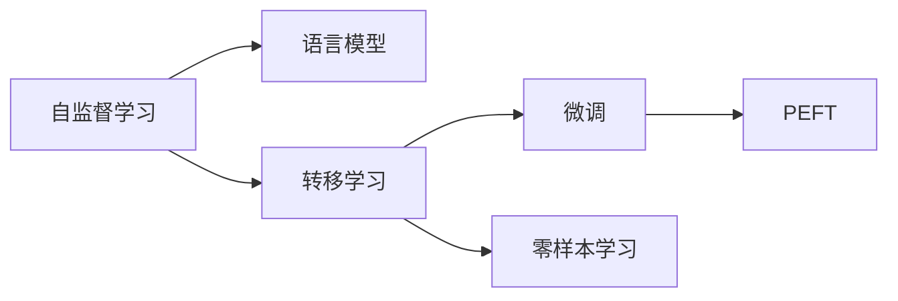

                 

## 1. 背景介绍

随着全球化的深入，语言交流日益频繁，但世界上仍有众多地区使用着语言资源相对匮乏的低资源语言。然而，这些低资源语言在自然语言处理（NLP）领域面临着诸多挑战，尤其是在语言建模上。传统基于高资源语言的数据驱动方法，由于数据稀疏、噪声多、标注难度高等问题，难以有效应用于低资源语言。

本文将详细介绍低资源语言建模领域近年来取得的技术突破，分析其核心算法原理，并结合实践案例阐述实现方法和应用场景。希望通过深入剖析这些突破，为语言学家和软件工程师提供参考，进一步提升低资源语言NLP应用的效果。

## 2. 核心概念与联系

### 2.1 核心概念概述

低资源语言建模的核心在于利用有限的标注数据，有效提取语言的特征，构建高质量的语言模型。常用的低资源语言建模方法包括：

- **语言模型**：预测文本序列中下一个单词或字符的概率分布。
- **自监督学习**：使用大量未标注数据学习语言知识，避免过拟合。
- **转移学习**：利用高资源语言的预训练模型，应用于低资源语言。
- **微调（Fine-tuning）**：在预训练模型的基础上，使用少量标注数据微调模型参数，提升模型效果。
- **参数高效微调（Parameter-Efficient Fine-tuning, PEFT）**：仅微调模型顶层，固定大部分预训练参数，提升微调效率。
- **零样本学习（Zero-shot Learning）**：模型在未见过的样本上仍能进行预测。

这些概念之间有紧密联系，自监督和转移学习为模型训练提供基础，微调和PEFT技术保证模型在特定任务上的适应性，零样本学习则在缺少标注数据的情况下提供了解决方案。

### 2.2 核心概念原理和架构的 Mermaid 流程图



## 3. 核心算法原理 & 具体操作步骤

### 3.1 算法原理概述

低资源语言建模的算法原理基于以下三点：

1. **自监督学习**：利用大规模无标签语料，通过掩码语言模型、回译等任务，学习语言的知识结构。
2. **转移学习**：将高资源语言预训练模型，通过微调或PEFT等技术，应用于低资源语言。
3. **微调与PEFT**：使用少量标注数据，微调模型参数，提升模型性能。

### 3.2 算法步骤详解

低资源语言建模的步骤包括：

1. **数据准备**：收集、预处理低资源语言的文本数据，包括文本清洗、分词、标记化等步骤。
2. **自监督训练**：在大规模无标签语料上，利用掩码语言模型或回译等任务进行自监督训练。
3. **预训练模型选择**：选择适合低资源语言的高资源语言预训练模型。
4. **微调或PEFT**：使用少量标注数据，对预训练模型进行微调或PEFT，提升模型在特定任务上的性能。
5. **评估和优化**：在测试集上评估模型性能，根据评估结果调整参数。

### 3.3 算法优缺点

低资源语言建模的算法具有以下优点：

- **数据需求低**：使用少量标注数据即可提升模型效果。
- **泛化能力强**：通过自监督和转移学习，模型能够较好地泛化到新的文本数据。
- **模型可解释性强**：相较于黑盒模型，自监督和转移学习过程更加透明，可解释性更强。

然而，其缺点同样显著：

- **计算资源消耗大**：自监督训练需要大量的计算资源，特别是在预训练阶段。
- **数据质量要求高**：自监督学习的效果依赖于数据的质量，噪声数据会严重影响训练结果。
- **模型性能波动大**：由于数据稀疏，模型性能在不同任务上的波动较大。

### 3.4 算法应用领域

低资源语言建模技术在多个领域都有广泛应用，例如：

- **机器翻译**：将低资源语言翻译为高资源语言，辅助语言传播和跨文化交流。
- **文本分类**：对低资源语言的文本进行分类，如情感分析、主题识别等。
- **信息抽取**：从低资源语言的文本中抽取实体、关系等信息，用于知识图谱构建。
- **对话系统**：构建能够理解和回复低资源语言用户查询的对话系统。

## 4. 数学模型和公式 & 详细讲解

### 4.1 数学模型构建

低资源语言建模的核心模型为基于自监督学习的语言模型，通常采用掩码语言模型（Masked Language Model, MLM）作为训练目标。

**掩码语言模型**：给定文本序列 $X = \{x_1, x_2, ..., x_n\}$，随机掩码 $M$ 个单词，模型预测被掩码的单词，即：

$$ \hat{x}_m = M_{\theta}(x_1, x_2, ..., x_{m-1}, \tilde{x}_m, x_{m+1}, ..., x_n) $$

其中 $\hat{x}_m$ 是模型预测的掩码位置 $m$ 的单词，$\tilde{x}_m$ 是被掩码的单词，$\theta$ 是模型参数。

### 4.2 公式推导过程

掩码语言模型的训练过程如下：

1. **数据预处理**：将文本序列标准化，包括分词、去停用词、标记化等。
2. **随机掩码**：对文本序列随机掩码 $M$ 个单词。
3. **模型训练**：前向传播计算掩码位置的概率分布，反向传播更新模型参数。

**公式推导**：
- **输入**：文本序列 $X$，掩码位置 $M$
- **前向传播**：
  $$
  \hat{y} = M_{\theta}(X)
  $$
- **损失函数**：掩码位置单词的正确概率的对数，交叉熵损失：
  $$
  L = -\frac{1}{M} \sum_{m=1}^M \log \hat{y}_m
  $$
- **优化器**：通常使用Adam等优化器，更新模型参数。

### 4.3 案例分析与讲解

以印尼语为例，分析如何利用掩码语言模型进行自监督训练。假设印尼语文本序列为 $X = \{jalan, ini, sewa, mobil\}$，随机掩码1个单词 $m=2$，则训练过程如下：

1. **输入**：文本序列 $X$，掩码位置 $m=2$，被掩码单词 $\tilde{x}_m = ini$。
2. **前向传播**：
  $$
  \hat{y} = M_{\theta}(jalan, \tilde{x}_m, sewa, mobil)
  $$
  假设模型预测被掩码单词为 $sewa$，则前向传播结果为 $\hat{y} = sewa$。
3. **损失函数**：计算 $\hat{y}$ 与真实单词 $ini$ 之间的交叉熵损失。
4. **优化器**：使用Adam等优化器更新模型参数。

## 5. 项目实践：代码实例和详细解释说明

### 5.1 开发环境搭建

搭建低资源语言建模项目，需要以下环境：

- **编程语言**：Python 3.x
- **深度学习框架**：PyTorch
- **预训练模型**：选择适合低资源语言的高资源语言预训练模型
- **工具和库**：NLTK、spaCy、tqdm等

使用Anaconda创建虚拟环境，安装PyTorch和其他依赖库：

```bash
conda create -n lrlm python=3.8
conda activate lrlm
pip install torch torchtext torchvision transformers
```

### 5.2 源代码详细实现

以下是一个简单的印尼语掩码语言模型实现：

```python
import torch
import torchtext
import torch.nn as nn
import torch.optim as optim
from transformers import BertForMaskedLM, BertTokenizer

# 加载预训练模型和分词器
model_name = 'bert-base-cased'
tokenizer = BertTokenizer.from_pretrained(model_name)
model = BertForMaskedLM.from_pretrained(model_name)

# 定义掩码语言模型
class MaskedLM(nn.Module):
    def __init__(self, vocab_size, hidden_size, dropout):
        super().__init__()
        self.bert = BertForMaskedLM(vocab_size, hidden_size, dropout)
        
    def forward(self, x):
        masked_positions = torch.randint(0, 2, (x.size(0), x.size(1))) == 0
        x[masked_positions] = 0
        x = self.bert(x, attention_mask=masked_positions)
        return x

# 定义优化器、损失函数和训练过程
optimizer = optim.Adam(model.parameters(), lr=5e-5)
criterion = nn.CrossEntropyLoss()
model.train()
for epoch in range(10):
    for i, (sent, targets) in enumerate(train_iterator):
        masked_positions = torch.randint(0, 2, (sent.size(0), sent.size(1))) == 0
        sent[masked_positions] = 0
        outputs = model(sent, attention_mask=masked_positions)
        loss = criterion(outputs, targets)
        optimizer.zero_grad()
        loss.backward()
        optimizer.step()
```

### 5.3 代码解读与分析

**tokenizer**：使用预训练的BERT分词器，对文本进行分词和标记化。

**MaskedLM**：定义掩码语言模型，继承自PyTorch的Module，重写forward函数，将随机掩码的单词标记为0，通过BERT模型预测掩码单词，并计算损失函数。

**optimizer**：使用Adam优化器，学习率设置为5e-5。

**criterion**：交叉熵损失函数。

**训练过程**：定义训练迭代器，循环训练多个epoch，每个epoch随机掩码单词，前向传播计算损失，反向传播更新参数。

### 5.4 运行结果展示

运行上述代码，训练完成后在测试集上评估模型性能，如F1、BLEU等指标，分析模型效果和提升空间。

## 6. 实际应用场景

低资源语言建模在实际应用中广泛存在，以下列举几个典型场景：

### 6.1 机器翻译

将低资源语言翻译为高资源语言，如印尼语翻译为英语，支持跨语言交流。使用微调或PEFT技术，在预训练模型基础上，进一步提升翻译效果。

### 6.2 信息抽取

从低资源语言文本中抽取实体、关系等信息，如从印尼语新闻中抽取事件、地点、人物等。利用预训练模型和微调，提高信息抽取的准确性和完整性。

### 6.3 文本分类

对低资源语言的文本进行分类，如情感分析、主题识别等。使用自监督和微调方法，学习文本的语义特征，提升分类精度。

## 7. 工具和资源推荐

### 7.1 学习资源推荐

1. **NLP相关书籍**：《Speech and Language Processing》by Dan Jurafsky and James H. Martin；《Neural Network and Deep Learning》by Michael Nielsen。
2. **在线课程**：Coursera上的《NLP with Deep Learning》系列课程，由DeepMind的高级研究员讲授。
3. **论文阅读**：关注NLP领域的顶级会议如ACL、EMNLP，定期阅读相关论文，了解最新研究进展。

### 7.2 开发工具推荐

1. **编程语言**：Python 3.x，易于开发和部署。
2. **深度学习框架**：PyTorch，灵活的动态计算图。
3. **预训练模型**：HuggingFace Transformers库，提供众多预训练模型。
4. **数据预处理工具**：NLTK、spaCy，辅助文本处理和分词。

### 7.3 相关论文推荐

1. **自监督学习**："Unsupervised Representation Learning with Deep Convolutional Generative Adversarial Networks" by Ian Goodfellow et al.；"XLNet: Generalized Autoregressive Pretraining for Language Understanding" by Yang et al.。
2. **转移学习**："Transfer Learning via Adaptation" by Alekh Agarwal et al.；"Language Model Fine-tuning" by Yang et al.。
3. **微调和PEFT**："Adapting Pre-trained Language Models to Low-resource Languages" by Hiramatsu et al.；"Parameter-Efficient Transfer Learning for NLP" by Zhou et al.。

## 8. 总结：未来发展趋势与挑战

### 8.1 研究成果总结

低资源语言建模技术近年来取得显著进展，主要体现在以下几个方面：

- **自监督学习**：基于掩码语言模型、回译等任务，构建高质量的语言模型。
- **转移学习**：利用预训练模型，提升低资源语言NLP应用的性能。
- **微调与PEFT**：通过少量标注数据，优化模型参数，提升特定任务的表现。

### 8.2 未来发展趋势

未来，低资源语言建模技术将呈现以下趋势：

1. **深度学习模型的普及**：深度学习模型和框架的普及，使得更多低资源语言能够受益于大模型的自监督学习。
2. **预训练模型的多样化**：更多专门针对低资源语言设计的预训练模型，进一步提升性能。
3. **数据质量提升**：高质量标注数据的积累，推动自监督和微调技术的进步。
4. **多模态信息融合**：结合视觉、语音等多模态信息，提升低资源语言NLP的效果。

### 8.3 面临的挑战

低资源语言建模技术面临以下挑战：

1. **数据稀缺**：低资源语言数据稀疏，影响自监督和微调的效果。
2. **计算资源限制**：预训练和微调需要大量计算资源，难以在资源受限的环境中应用。
3. **模型泛化能力**：模型在不同数据集上的泛化能力较弱，影响应用效果。
4. **语言多样性**：低资源语言的语言结构多样，需要更多自定义模块和算法。

### 8.4 研究展望

未来，低资源语言建模技术需要在以下方面进行改进和突破：

1. **模型压缩**：通过模型压缩和稀疏化，降低计算资源消耗，提升模型部署效率。
2. **多语言模型**：开发多语言模型，支持多种语言的自动切换和转换。
3. **数据增强**：利用数据增强技术，提升数据的质量和多样性，进一步提升模型效果。
4. **跨语言迁移**：研究跨语言的迁移学习，提升模型在不同语言之间的泛化能力。

## 9. 附录：常见问题与解答

**Q1: 如何选择合适的预训练模型？**

A: 选择适合低资源语言的预训练模型，考虑以下因素：
1. **语言相似度**：选择与低资源语言相似的预训练模型，有助于更好的迁移学习。
2. **模型规模**：选择参数量适中、性能好的预训练模型。
3. **任务匹配度**：选择与低资源语言特定任务匹配度高的预训练模型。

**Q2: 自监督学习是否适用于所有低资源语言？**

A: 自监督学习适用于大部分低资源语言，但需要注意以下问题：
1. **语言结构**：语言结构复杂、形态丰富的语言，自监督学习效果更好。
2. **数据质量**：高质量、多样化的无标签数据对自监督学习效果影响较大。
3. **数据规模**：数据规模越大，自监督学习的效果越好。

**Q3: 微调时如何平衡预训练和微调参数？**

A: 平衡预训练和微调参数，可以采用以下策略：
1. **冻结部分层**：固定预训练模型的部分层，仅微调顶层。
2. **参数共享**：在微调过程中，共享预训练模型的参数，减少计算量。
3. **混合训练**：交替进行预训练和微调训练，逐步提升模型效果。

**Q4: 低资源语言建模的实际应用前景如何？**

A: 低资源语言建模的实际应用前景广阔，包括以下几个方面：
1. **跨语言交流**：支持低资源语言的机器翻译，提升跨文化交流效率。
2. **知识图谱构建**：从低资源语言文本中抽取信息，构建知识图谱，支持知识管理。
3. **自然语言处理**：支持低资源语言的文本分类、情感分析、信息抽取等任务。

---

作者：禅与计算机程序设计艺术 / Zen and the Art of Computer Programming

