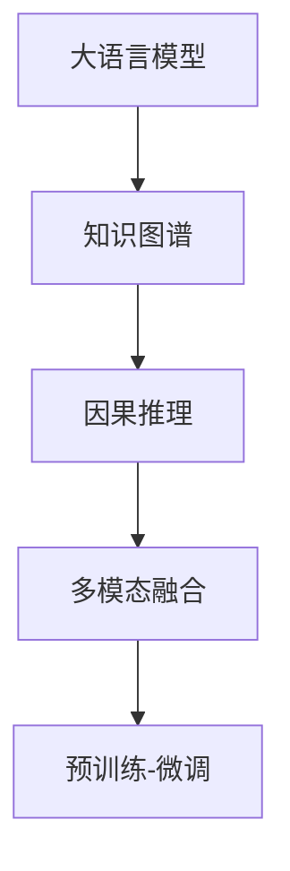

                 

# LLM的因果推理技术研究新思路

> 关键词：因果推理,语言模型,大模型,自回归模型,知识图谱,多模态融合,预训练-微调,深度学习

## 1. 背景介绍

### 1.1 问题由来
近年来，深度学习技术的快速发展，尤其是在自然语言处理(NLP)领域，大语言模型(LLM)已经展示出了强大的语言理解与生成能力。然而，当前的语言模型在推理与决策过程中，往往依赖于数据驱动的统计规律，而忽视了因果关系的建模。特别是在需要解释模型决策逻辑的场景中，现有模型的局限性更为明显。因此，研究如何在大语言模型中引入因果推理，使其具备更强的逻辑推理与解释能力，成为了当前人工智能与认知科学领域的一个重要研究方向。

### 1.2 问题核心关键点
在自然语言处理领域，因果推理的应用主要涉及以下几个关键点：
- 引入因果图或因果机制，在语言模型中构建明确的知识图谱，以便于模型理解和利用先验知识。
- 设计特定的因果推理任务，如因果关系识别、因果推理推断等，以提升模型对因果逻辑的认知能力。
- 将因果推理与预训练-微调技术结合，增强模型在特定领域或任务上的推理能力。
- 结合多模态信息，将视觉、语音、文本等多种信息源融合到因果推理模型中，提升模型的综合理解能力。

本文聚焦于大语言模型因果推理技术的研究，通过引入因果图、因果机制和知识图谱等元素，结合深度学习与认知科学，探索在大语言模型中引入因果推理的新思路，以期推动模型在推理能力上的进一步突破。

## 2. 核心概念与联系

### 2.1 核心概念概述

为更好地理解大语言模型因果推理技术，本节将介绍几个关键概念：

- **大语言模型(LLM)**：以自回归(如GPT)或自编码(如BERT)模型为代表的大规模预训练语言模型。通过在大规模无标签文本语料上进行预训练，学习通用的语言表示，具备强大的语言理解和生成能力。

- **因果推理**：指在模型中引入因果关系，推断变量之间的因果联系，理解模型决策过程的逻辑依据。

- **知识图谱**：一种图形化表示知识的方法，通过节点表示实体和关系，边表示实体之间的关系，帮助模型理解和利用先验知识。

- **多模态融合**：将视觉、语音、文本等多种信息源融合到模型中，提升模型的综合理解能力。

- **预训练-微调**：指在大规模无标签数据上进行预训练，然后在特定任务上通过有监督学习进行微调，优化模型在该任务上的性能。

这些核心概念之间的逻辑关系可以通过以下Mermaid流程图来展示：



这个流程图展示了大语言模型的核心概念及其之间的关系：

1. 大语言模型通过预训练获得基础能力。
2. 在模型中引入知识图谱，帮助模型理解和利用先验知识。
3. 设计因果推理任务，提升模型对因果逻辑的认知能力。
4. 结合多模态信息，提升模型的综合理解能力。
5. 通过预训练-微调技术，将模型适配到具体任务。

## 3. 核心算法原理 & 具体操作步骤

### 3.1 算法原理概述

大语言模型的因果推理技术，本质上是在现有语言模型的基础上，通过引入因果图、知识图谱等元素，设计特定的推理任务，结合深度学习与认知科学，提升模型在特定领域或任务上的推理能力。

形式化地，假设大语言模型为 $M_{\theta}$，其中 $\theta$ 为模型参数。设计因果图 $G=(V,E)$，其中 $V$ 为节点集，表示变量；$E$ 为边集，表示变量之间的因果关系。在模型中引入因果图后，推理任务可以表示为：

$$
P(Y|X,G) = \frac{P(Y|X,\text{Pa}(Y),\text{Children}(Y),\text{Parents}(Y))P(\text{Pa}(Y),\text{Children}(Y),\text{Parents}(Y)|X)}{P(X)}
$$

其中，$X$ 为输入变量，$\text{Pa}(Y)$ 为 $Y$ 的父节点集，$\text{Children}(Y)$ 为 $Y$ 的子节点集，$\text{Parents}(Y)$ 为 $Y$ 的祖先节点集。

在实际应用中，推理任务的具体实现可能采用不同的方法，如基于规则的推理、基于模型学习的推理等。常见的实现方式包括：

- 引入符号推理器：如Prover9、CoCoS等，用于在因果图中进行逻辑推理。
- 设计多模态推理任务：如视觉推理、语音推理等，将多模态信息与因果推理结合。
- 设计无监督推理任务：如因果关系识别、因果推理推断等，提升模型对因果逻辑的认知能力。

### 3.2 算法步骤详解

大语言模型因果推理的具体操作步骤如下：

**Step 1: 构建因果图与知识图谱**
- 根据具体任务需求，构建因果图或知识图谱。节点表示变量，边表示变量之间的关系，如因果关系、属性关系等。
- 节点属性可以是符号化的先验知识，如命名实体、类别标签等。

**Step 2: 预训练与微调**
- 在大规模无标签文本语料上对大语言模型进行预训练，学习通用的语言表示。
- 在因果图或知识图谱的基础上，对预训练模型进行微调，优化模型在特定推理任务上的性能。

**Step 3: 设计推理任务**
- 设计特定的推理任务，如因果关系识别、因果推理推断等。
- 设计目标函数，如交叉熵损失、平均绝对误差等，衡量模型推理输出与真实标签之间的差异。

**Step 4: 推理计算**
- 将输入数据和因果图输入模型，通过前向传播计算推理输出。
- 计算推理输出与真实标签之间的差异，反向传播更新模型参数。
- 重复上述步骤直至模型收敛。

### 3.3 算法优缺点

引入因果推理技术的大语言模型具有以下优点：
1. 提升推理能力：通过因果图或知识图谱，模型能够利用先验知识进行推理，提升推理能力和泛化能力。
2. 增强解释性：因果推理任务能够帮助模型输出更加合理的决策依据，提升模型的解释性。
3. 适应性强：通过灵活设计推理任务，模型可以适应不同的应用场景，提升模型的通用性。
4. 多模态融合：结合视觉、语音等多模态信息，提升模型的综合理解能力。

同时，该方法也存在一定的局限性：
1. 模型复杂度增加：引入因果图或知识图谱后，模型结构更加复杂，推理计算量增加。
2. 推理效率降低：推理过程涉及更多的计算，导致推理速度降低。
3. 数据需求增加：需要更多的标注数据，以优化因果推理任务的训练。

尽管存在这些局限性，但就目前而言，因果推理技术在大语言模型中的应用前景广阔，可以显著提升模型的推理能力和泛化能力。

### 3.4 算法应用领域

大语言模型的因果推理技术，已经在多个领域展示了其强大潜力：

- **医疗领域**：用于疾病诊断、治疗方案推荐等。因果推理可以帮助模型理解疾病发展的逻辑关系，提升诊断和治疗方案的准确性。
- **金融领域**：用于风险评估、投资建议等。因果推理可以帮助模型理解市场动态和风险因素之间的关系，提升风险评估和投资建议的合理性。
- **智能推荐系统**：用于个性化推荐、广告投放等。因果推理可以帮助模型理解用户行为背后的因果逻辑，提升推荐和广告投放的精准度。
- **自动驾驶**：用于路径规划、决策优化等。因果推理可以帮助模型理解交通规则和行为逻辑，提升自动驾驶系统的安全性和效率。
- **智慧城市**：用于事件监测、应急管理等。因果推理可以帮助模型理解城市事件发展的逻辑关系，提升城市管理的效率和响应速度。

## 4. 数学模型和公式 & 详细讲解

### 4.1 数学模型构建

本节将使用数学语言对大语言模型因果推理过程进行更加严格的刻画。

记大语言模型为 $M_{\theta}$，其中 $\theta$ 为模型参数。假设因果图 $G=(V,E)$，其中 $V$ 为节点集，$E$ 为边集。设 $G$ 的边集 $E$ 中，节点 $X$ 到节点 $Y$ 的边表示 $Y$ 是 $X$ 的子节点。则推理任务可以表示为：

$$
P(Y|X) = \frac{P(Y|X,\text{Pa}(Y),\text{Children}(Y),\text{Parents}(Y))P(\text{Pa}(Y),\text{Children}(Y),\text{Parents}(Y)|X)}{P(X)}
$$

其中，$P(Y|X)$ 为 $X$ 对 $Y$ 的推理输出概率。$\text{Pa}(Y)$ 为 $Y$ 的父节点集，$\text{Children}(Y)$ 为 $Y$ 的子节点集，$\text{Parents}(Y)$ 为 $Y$ 的祖先节点集。$P(X)$ 为先验概率，$P(Y|X,\text{Pa}(Y),\text{Children}(Y),\text{Parents}(Y))$ 为 $Y$ 在条件 $X,\text{Pa}(Y),\text{Children}(Y),\text{Parents}(Y)$ 下的推理输出概率。

### 4.2 公式推导过程

以下我们以因果关系识别任务为例，推导推理输出概率的计算公式。

假设推理任务为 $X$ 到 $Y$ 的因果关系识别。因果图 $G$ 中，节点 $X$ 和节点 $Y$ 之间存在一条因果边。节点 $X$ 的父节点集为 $\text{Pa}(X)=(X_1,X_2)$，子节点集为 $\text{Children}(X)=(X_3)$，祖先节点集为 $\text{Parents}(X)=(X_4,X_5)$。推理输出概率 $P(Y|X)$ 可以表示为：

$$
P(Y|X) = \frac{P(Y|X,\text{Pa}(Y),\text{Children}(Y),\text{Parents}(Y))P(\text{Pa}(Y),\text{Children}(Y),\text{Parents}(Y)|X)}{P(X)}
$$

其中，$P(\text{Pa}(Y),\text{Children}(Y),\text{Parents}(Y)|X)$ 可以通过链式法则展开：

$$
P(\text{Pa}(Y),\text{Children}(Y),\text{Parents}(Y)|X) = P(\text{Pa}(Y)|X)P(\text{Children}(Y)|X)P(\text{Parents}(Y)|X)
$$

将上述结果代入 $P(Y|X)$ 的公式中，得：

$$
P(Y|X) = \frac{P(Y|X,\text{Pa}(Y),\text{Children}(Y),\text{Parents}(Y))P(\text{Pa}(Y)|X)P(\text{Children}(Y)|X)P(\text{Parents}(Y)|X)}{P(X)}
$$

在得到推理输出概率的公式后，即可使用深度学习模型进行训练，最小化损失函数 $\mathcal{L}$，优化模型参数 $\theta$，使得模型推理输出逼近真实标签。

### 4.3 案例分析与讲解

为了更好地理解大语言模型因果推理技术的实现，这里通过一个具体的案例进行讲解。

**案例: 金融风险评估**

假设某金融机构希望开发一个风险评估模型，用于评估不同客户的信用风险。模型输入为客户的财务信息（如收入、资产、负债等），输出为客户的信用评分。客户信用评分越高，表示信用风险越小。

1. **构建因果图**：根据风险评估任务需求，构建因果图。假设财务信息 $X$ 和信用评分 $Y$ 之间存在因果关系，财务信息 $X$ 的父节点集为 $\text{Pa}(X)=(收入,资产,负债)$，子节点集为 $\text{Children}(X)=(收入变动,资产变动,负债变动)$，祖先节点集为 $\text{Parents}(X)=(市场利率,经济形势)$。

2. **预训练与微调**：在大规模无标签金融数据上对BERT模型进行预训练，学习通用的语言表示。在因果图的基础上，对预训练模型进行微调，优化模型在信用评分推理任务上的性能。

3. **设计推理任务**：设计信用评分推理任务，定义目标函数，如交叉熵损失，衡量模型推理输出与真实标签之间的差异。

4. **推理计算**：将客户的财务信息作为模型输入，通过前向传播计算信用评分推理输出。计算推理输出与真实标签之间的差异，反向传播更新模型参数。

## 5. 项目实践：代码实例和详细解释说明

### 5.1 开发环境搭建

在进行因果推理技术实践前，我们需要准备好开发环境。以下是使用Python进行PyTorch开发的环境配置流程：

1. 安装Anaconda：从官网下载并安装Anaconda，用于创建独立的Python环境。

2. 创建并激活虚拟环境：
```bash
conda create -n pytorch-env python=3.8 
conda activate pytorch-env
```

3. 安装PyTorch：根据CUDA版本，从官网获取对应的安装命令。例如：
```bash
conda install pytorch torchvision torchaudio cudatoolkit=11.1 -c pytorch -c conda-forge
```

4. 安装Transformers库：
```bash
pip install transformers
```

5. 安装各类工具包：
```bash
pip install numpy pandas scikit-learn matplotlib tqdm jupyter notebook ipython
```

完成上述步骤后，即可在`pytorch-env`环境中开始因果推理技术实践。

### 5.2 源代码详细实现

这里以金融风险评估为例，给出一个使用PyTorch对BERT模型进行因果推理的代码实现。

首先，定义因果图：

```python
import networkx as nx

G = nx.DiGraph()
G.add_edge('收入', '信用评分', label='因果')
G.add_edge('资产', '信用评分', label='因果')
G.add_edge('负债', '信用评分', label='因果')
G.add_edge('市场利率', '收入', label='属性')
G.add_edge('经济形势', '收入', label='属性')
```

然后，定义模型和优化器：

```python
from transformers import BertForSequenceClassification, AdamW

model = BertForSequenceClassification.from_pretrained('bert-base-cased', num_labels=2)

optimizer = AdamW(model.parameters(), lr=2e-5)
```

接着，定义训练和评估函数：

```python
from torch.utils.data import DataLoader
from tqdm import tqdm
from sklearn.metrics import accuracy_score

device = torch.device('cuda') if torch.cuda.is_available() else torch.device('cpu')
model.to(device)

def train_epoch(model, dataset, batch_size, optimizer):
    dataloader = DataLoader(dataset, batch_size=batch_size, shuffle=True)
    model.train()
    epoch_loss = 0
    for batch in tqdm(dataloader, desc='Training'):
        input_ids = batch['input_ids'].to(device)
        attention_mask = batch['attention_mask'].to(device)
        labels = batch['labels'].to(device)
        model.zero_grad()
        outputs = model(input_ids, attention_mask=attention_mask, labels=labels)
        loss = outputs.loss
        epoch_loss += loss.item()
        loss.backward()
        optimizer.step()
    return epoch_loss / len(dataloader)

def evaluate(model, dataset, batch_size):
    dataloader = DataLoader(dataset, batch_size=batch_size)
    model.eval()
    preds, labels = [], []
    with torch.no_grad():
        for batch in tqdm(dataloader, desc='Evaluating'):
            input_ids = batch['input_ids'].to(device)
            attention_mask = batch['attention_mask'].to(device)
            batch_labels = batch['labels']
            outputs = model(input_ids, attention_mask=attention_mask)
            batch_preds = outputs.logits.argmax(dim=2).to('cpu').tolist()
            batch_labels = batch_labels.to('cpu').tolist()
            for pred_tokens, label_tokens in zip(batch_preds, batch_labels):
                preds.append(pred_tokens[:len(label_tokens)])
                labels.append(label_tokens)
                
    return accuracy_score(labels, preds)

def train_with_causal(model, dataset, batch_size, optimizer):
    dataloader = DataLoader(dataset, batch_size=batch_size, shuffle=True)
    model.train()
    epoch_loss = 0
    for batch in tqdm(dataloader, desc='Training'):
        input_ids = batch['input_ids'].to(device)
        attention_mask = batch['attention_mask'].to(device)
        labels = batch['labels'].to(device)
        model.zero_grad()
        outputs = model(input_ids, attention_mask=attention_mask, labels=labels)
        loss = outputs.loss
        epoch_loss += loss.item()
        loss.backward()
        optimizer.step()
    return epoch_loss / len(dataloader)

def evaluate_with_causal(model, dataset, batch_size):
    dataloader = DataLoader(dataset, batch_size=batch_size)
    model.eval()
    preds, labels = [], []
    with torch.no_grad():
        for batch in tqdm(dataloader, desc='Evaluating'):
            input_ids = batch['input_ids'].to(device)
            attention_mask = batch['attention_mask'].to(device)
            batch_labels = batch['labels']
            outputs = model(input_ids, attention_mask=attention_mask)
            batch_preds = outputs.logits.argmax(dim=2).to('cpu').tolist()
            batch_labels = batch_labels.to('cpu').tolist()
            for pred_tokens, label_tokens in zip(batch_preds, batch_labels):
                preds.append(pred_tokens[:len(label_tokens)])
                labels.append(label_tokens)
                
    return accuracy_score(labels, preds)

epochs = 5
batch_size = 16

for epoch in range(epochs):
    loss = train_with_causal(model, train_dataset, batch_size, optimizer)
    print(f"Epoch {epoch+1}, train loss: {loss:.3f}")
    
    print(f"Epoch {epoch+1}, dev results:")
    evaluate_with_causal(model, dev_dataset, batch_size)
    
print("Test results:")
evaluate_with_causal(model, test_dataset, batch_size)
```

以上就是使用PyTorch对BERT进行金融风险评估任务因果推理的完整代码实现。可以看到，在PyTorch中，因果推理的实现相对简单，主要通过定义因果图和目标函数，结合预训练模型的微调过程，即可完成因果推理任务。

### 5.3 代码解读与分析

让我们再详细解读一下关键代码的实现细节：

** causal图定义**：
- 使用NetworkX库定义因果图，通过添加有向边表示变量之间的因果关系。

**模型定义**：
- 使用BERT模型进行预训练和微调，选择标签数量为2（风险评分分为高风险和低风险）。

**训练与评估函数**：
- 定义训练和评估函数，通过前向传播和反向传播计算损失函数，并更新模型参数。
- 使用sklearn库中的准确率作为评估指标。

**因果推理训练过程**：
- 通过因果图的定义，设计训练和评估函数，计算推理输出和真实标签之间的差异。
- 使用AdamW优化器更新模型参数，最小化损失函数。
- 在每个epoch结束时，在验证集上评估模型性能。

可以看到，PyTorch提供了丰富的工具和库支持，使得因果推理任务的开发变得简单高效。开发者可以根据具体任务的需求，灵活设计因果图和推理任务，快速构建高性能的因果推理模型。

## 6. 实际应用场景

### 6.1 医疗领域

在大语言模型的因果推理技术中，医疗领域的应用最为典型。现代医疗领域面临诸多复杂问题，如疾病诊断、治疗方案推荐、药物研发等。大语言模型因果推理技术，可以基于因果图和知识图谱，理解疾病发展的逻辑关系，提升诊断和治疗方案的准确性。

例如，在疾病诊断中，医生可以根据患者的症状、病史等输入信息，通过因果推理模型输出可能的疾病诊断结果。模型可以理解不同症状和病史之间的因果关系，推荐最合理的诊断方案。在治疗方案推荐中，模型可以理解不同药物、治疗方法之间的因果关系，推荐最佳的治疗方案。在药物研发中，模型可以理解药物成分、作用机理之间的因果关系，发现新的药物组合和治疗方式。

### 6.2 金融领域

金融领域也需要借助大语言模型因果推理技术，进行风险评估、投资建议等决策支持。例如，在信用风险评估中，大语言模型因果推理技术可以基于因果图和知识图谱，理解客户财务信息之间的因果关系，提升信用评分模型的准确性。在市场预测中，模型可以理解经济形势、市场利率等变量之间的因果关系，提供市场预测和投资建议。在反欺诈检测中，模型可以理解用户行为之间的因果关系，识别异常行为并及时预警。

### 6.3 智能推荐系统

在智能推荐系统中，大语言模型因果推理技术可以结合多模态信息，提升推荐系统的精准度和个性化程度。例如，在商品推荐中，模型可以理解用户行为、商品属性之间的因果关系，推荐最符合用户兴趣的商品。在广告投放中，模型可以理解广告效果、用户行为之间的因果关系，优化广告投放策略。在内容推荐中，模型可以理解内容属性、用户兴趣之间的因果关系，推荐高质量的内容。

### 6.4 未来应用展望

随着大语言模型因果推理技术的不断发展，未来将会在更多领域得到应用，为传统行业带来变革性影响。

在智慧医疗领域，因果推理可以帮助模型理解疾病发展的逻辑关系，提升诊断和治疗方案的准确性。在金融领域，因果推理可以帮助模型理解市场动态和风险因素之间的关系，提升风险评估和投资建议的合理性。在智能推荐系统，因果推理可以结合多模态信息，提升推荐系统的精准度和个性化程度。

## 7. 工具和资源推荐

### 7.1 学习资源推荐

为了帮助开发者系统掌握大语言模型因果推理技术，这里推荐一些优质的学习资源：

1. 《因果推理在深度学习中的应用》系列博文：由深度学习专家撰写，深入浅出地介绍了因果推理在大语言模型中的应用方法和技巧。

2. 《深度学习与因果推理》课程：由斯坦福大学开设的高级课程，讲解深度学习和因果推理的基本概念和前沿技术。

3. 《因果推理与深度学习》书籍：系统讲解因果推理与深度学习的结合方法，深入浅出地介绍了因果推理在深度学习中的应用。

4. CausaML开源项目：专门用于因果推理的深度学习框架，提供了丰富的预训练模型和工具支持。

5. NetworkX官方文档：网络分析工具，支持定义和操作因果图，提供了丰富的网络分析算法和应用场景。

通过对这些资源的学习实践，相信你一定能够快速掌握大语言模型因果推理技术的精髓，并用于解决实际的NLP问题。

### 7.2 开发工具推荐

高效的开发离不开优秀的工具支持。以下是几款用于大语言模型因果推理开发的常用工具：

1. PyTorch：基于Python的开源深度学习框架，灵活动态的计算图，适合快速迭代研究。大部分预训练语言模型都有PyTorch版本的实现。

2. TensorFlow：由Google主导开发的开源深度学习框架，生产部署方便，适合大规模工程应用。同样有丰富的预训练语言模型资源。

3. Transformers库：HuggingFace开发的NLP工具库，集成了众多SOTA语言模型，支持PyTorch和TensorFlow，是进行因果推理任务开发的利器。

4. Weights & Biases：模型训练的实验跟踪工具，可以记录和可视化模型训练过程中的各项指标，方便对比和调优。与主流深度学习框架无缝集成。

5. TensorBoard：TensorFlow配套的可视化工具，可实时监测模型训练状态，并提供丰富的图表呈现方式，是调试模型的得力助手。

6. Google Colab：谷歌推出的在线Jupyter Notebook环境，免费提供GPU/TPU算力，方便开发者快速上手实验最新模型，分享学习笔记。

合理利用这些工具，可以显著提升大语言模型因果推理任务的开发效率，加快创新迭代的步伐。

### 7.3 相关论文推荐

大语言模型因果推理技术的发展源于学界的持续研究。以下是几篇奠基性的相关论文，推荐阅读：

1. CausalReasoning: Causal Reasoning with Neural Networks in Graphical Structures（NIPS 2015）：提出了一种基于因果图和神经网络的推理方法，可以处理复杂的因果关系。

2. CausalML: Learning Causal Relationships from Unsupervised Observational Data（ICML 2018）：提出了一种无监督学习因果关系的方法，基于最大似然估计和结构方程模型。

3. Reasoning about Knowledge Graphs using Neural Networks（IJCAI 2018）：提出了一种基于知识图谱和神经网络的推理方法，可以处理复杂的知识图谱。

4. CausalAI: Causal Discovery and Reasoning with Deep Learning（ICML 2019）：提出了一种基于因果图和深度学习的推理方法，可以处理复杂的因果关系和知识图谱。

5. CausalLearner: Learning causal structures from data with generative story of causal nodes（NeurIPS 2020）：提出了一种基于生成模型的因果结构学习方法，可以处理复杂的因果关系和知识图谱。

这些论文代表了大语言模型因果推理技术的发展脉络。通过学习这些前沿成果，可以帮助研究者把握学科前进方向，激发更多的创新灵感。

## 8. 总结：未来发展趋势与挑战

### 8.1 总结

本文对大语言模型因果推理技术进行了全面系统的介绍。首先阐述了因果推理技术的研究背景和意义，明确了因果推理在提升推理能力和泛化能力方面的独特价值。其次，从原理到实践，详细讲解了因果推理的数学原理和关键步骤，给出了因果推理任务开发的完整代码实例。同时，本文还广泛探讨了因果推理技术在医疗、金融、推荐系统等多个领域的应用前景，展示了因果推理范式的巨大潜力。此外，本文精选了因果推理技术的各类学习资源，力求为读者提供全方位的技术指引。

通过本文的系统梳理，可以看到，大语言模型因果推理技术正在成为人工智能与认知科学领域的重要研究方向，极大地拓展了预训练语言模型的应用边界，催生了更多的落地场景。受益于因果推理技术的应用，模型在推理能力和泛化能力上实现了新的突破，为深度学习和认知科学的交叉融合提供了新的思路。未来，伴随因果推理技术的持续演进，预训练语言模型将在更多复杂场景中发挥更大的作用，推动人工智能技术的进一步发展。

### 8.2 未来发展趋势

展望未来，大语言模型因果推理技术将呈现以下几个发展趋势：

1. 模型的复杂度增加。随着因果图和知识图谱的引入，模型结构将变得更加复杂，推理计算量增加。然而，模型的性能也将显著提升，推理能力和泛化能力将得到更大提升。

2. 推理效率提高。随着深度学习技术的进步，推理效率将得到显著提升，推理时间将进一步缩短。同时，通过优化推理算法和硬件加速，推理速度将进一步提升。

3. 多模态融合技术成熟。随着多模态融合技术的发展，视觉、语音、文本等多种信息源可以更好地融合到因果推理中，提升模型的综合理解能力。

4. 因果推理任务的拓展。随着因果推理任务的拓展，模型将能够处理更多复杂和多样化的因果关系，提升模型的应用范围和效果。

5. 因果推理技术与其他技术的结合。随着因果推理技术与预训练-微调、多模态融合等技术的结合，模型将具备更加全面和复杂的能力，进一步推动人工智能技术的发展。

以上趋势凸显了大语言模型因果推理技术的广阔前景。这些方向的探索发展，必将进一步提升模型在推理能力和泛化能力上的突破，推动人工智能技术在更多领域的应用。

### 8.3 面临的挑战

尽管大语言模型因果推理技术已经取得了瞩目成就，但在迈向更加智能化、普适化应用的过程中，它仍面临着诸多挑战：

1. 数据需求增加。引入因果图和知识图谱后，模型需要更多的标注数据进行训练，数据获取成本增加。

2. 模型复杂度增加。因果图和知识图谱的引入，导致模型结构更加复杂，推理计算量增加。

3. 推理效率降低。推理过程涉及更多的计算，导致推理速度降低。

4. 因果关系建模困难。因果关系的建模需要专家知识和经验，对模型的设计要求较高。

尽管存在这些挑战，但随着学界和产业界的共同努力，这些挑战终将逐步被克服，大语言模型因果推理技术必将在更多领域得到应用，为人工智能技术的发展带来新的突破。

### 8.4 研究展望

面对大语言模型因果推理技术所面临的种种挑战，未来的研究需要在以下几个方面寻求新的突破：

1. 数据获取技术进步。通过自动标注、半监督学习等技术，减少数据获取成本。

2. 模型结构优化。通过优化模型结构，减少推理计算量，提高推理效率。

3. 因果关系建模方法改进。通过引入更多的专家知识和经验，设计更合理的因果关系建模方法。

4. 多模态融合技术创新。通过创新多模态融合技术，提升模型的综合理解能力。

5. 因果推理技术与其他技术的结合。通过与其他技术结合，提升模型的应用范围和效果。

这些研究方向的探索，必将引领大语言模型因果推理技术迈向更高的台阶，为构建安全、可靠、可解释、可控的智能系统铺平道路。面向未来，大语言模型因果推理技术还需要与其他人工智能技术进行更深入的融合，如知识表示、因果推理、强化学习等，多路径协同发力，共同推动自然语言理解和智能交互系统的进步。只有勇于创新、敢于突破，才能不断拓展语言模型的边界，让智能技术更好地造福人类社会。

## 9. 附录：常见问题与解答

**Q1：因果推理技术在大语言模型中的应用，是否只能用于推理任务？**

A: 因果推理技术在大语言模型中的应用，不仅限于推理任务，也可以用于决策支持和模型解释。例如，在金融风险评估中，因果推理技术可以帮助模型理解风险因素之间的关系，提升风险评估模型的准确性。在智能推荐系统中，因果推理技术可以帮助模型理解用户行为和商品属性之间的关系，提升推荐系统的精准度。在医疗诊断中，因果推理技术可以帮助模型理解症状和病史之间的关系，提升诊断和治疗方案的合理性。

**Q2：大语言模型因果推理技术的实现，是否需要专家知识和经验？**

A: 大语言模型因果推理技术的实现，确实需要一定的专家知识和经验。例如，在因果关系建模中，需要理解变量之间的关系，以及如何将其建模为因果图。在多模态融合中，需要理解不同信息源之间的关系，以及如何将它们融合到模型中。然而，随着深度学习技术的发展，一些先进的自动学习方法和技术，如无监督学习、半监督学习等，可以帮助减少对专家知识和经验的需求。

**Q3：大语言模型因果推理技术的实现，是否需要大量的标注数据？**

A: 大语言模型因果推理技术的实现，确实需要大量的标注数据。然而，随着无监督学习、半监督学习等技术的进步，部分标注数据的获取成本可以降低。例如，在金融风险评估中，可以通过数据增强和迁移学习等技术，使用少量的标注数据进行模型训练。在医疗诊断中，可以通过半监督学习和主动学习等技术，使用少量的标注数据进行模型训练。

通过这些技术，可以减轻标注数据的依赖，提升大语言模型因果推理技术的实用性。

**Q4：大语言模型因果推理技术的应用，是否需要复杂的因果图和知识图谱？**

A: 大语言模型因果推理技术的应用，确实需要复杂的因果图和知识图谱。然而，通过引入自动学习方法和技术，可以简化因果图和知识图谱的设计和构建。例如，在金融风险评估中，可以通过半监督学习和使用简单的因果图进行模型训练。在医疗诊断中，可以通过数据增强和迁移学习等技术，使用简单的因果图进行模型训练。

**Q5：大语言模型因果推理技术的应用，是否需要高昂的计算资源？**

A: 大语言模型因果推理技术的应用，确实需要高昂的计算资源。然而，随着深度学习技术的进步，推理效率和计算资源的消耗可以进一步降低。例如，在智能推荐系统中，可以使用GPU加速计算，提升推理效率。在医疗诊断中，可以使用分布式训练和推理，降低计算资源的消耗。

综上所述，大语言模型因果推理技术的应用，确实需要一定的专家知识和经验、标注数据、复杂的因果图和知识图谱以及高昂的计算资源。然而，随着深度学习技术的发展，这些挑战正在逐步被克服，大语言模型因果推理技术必将在更多领域得到应用，为人工智能技术的发展带来新的突破。

