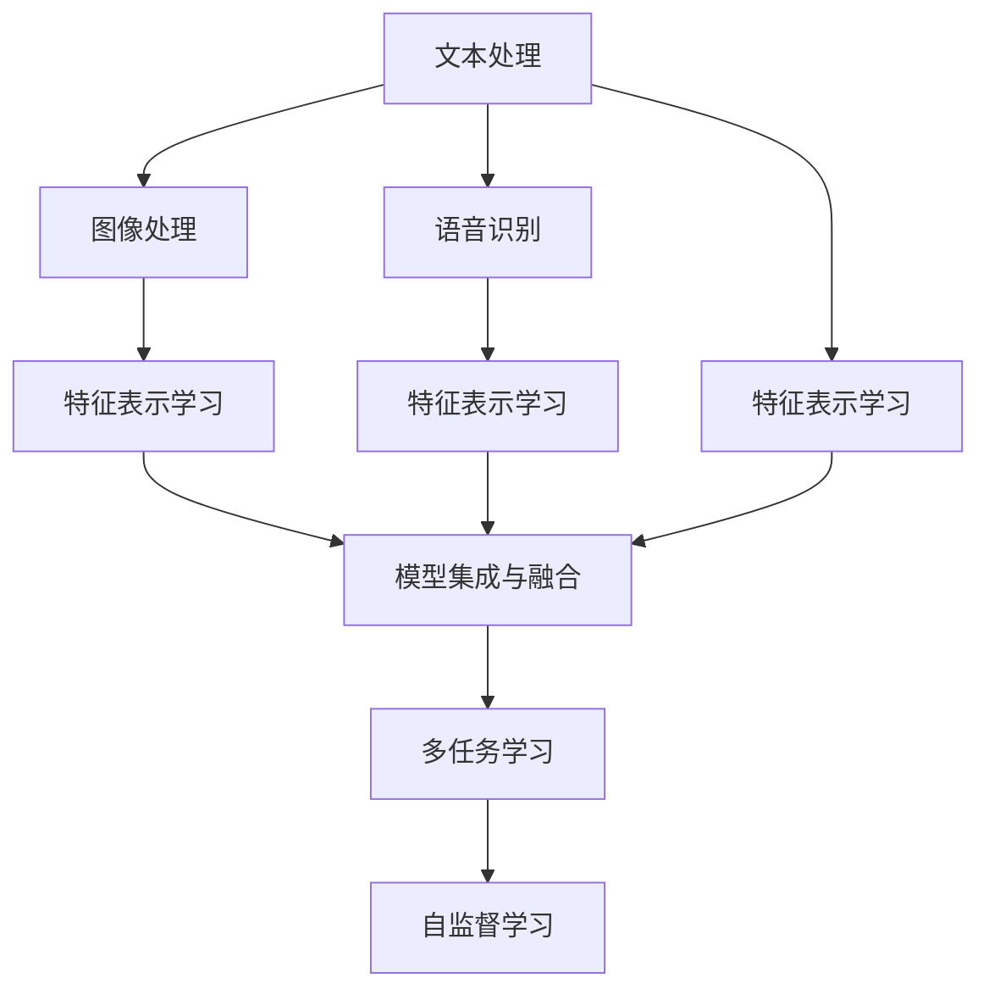

                 

# LLM的多模态融合：文本、图像和语音的统一处理

> 关键词：多模态融合,文本,图像,语音,自然语言处理(NLP),计算机视觉(CV),语音识别(SR),多模态学习,Transformer,多任务学习,自监督学习

## 1. 背景介绍

### 1.1 问题由来
在人工智能领域，多模态融合(Multimodal Fusion)是一个重要的研究方向。它旨在将不同模态的数据（如文本、图像、语音等）进行联合处理，以实现更全面、准确的理解和推断。传统的文本处理技术已经相对成熟，但单独的图像处理和语音处理则面临着各自的难题。因此，如何将文本、图像和语音等不同模态的信息进行有效整合，构建统一的多模态学习系统，成为了当前研究的热点问题。

### 1.2 问题核心关键点
多模态融合的核心在于如何将多种模态的信息进行高效、准确的联合处理。目前，主要的研究方向包括：

1. 特征表示学习：如何从不同模态中提取统一的语义表示。
2. 模型集成与融合：如何将不同模态的特征进行联合表示，产生更强的泛化能力。
3. 多任务学习：如何设计多任务的联合优化目标，提高模型的整体性能。
4. 自监督学习：如何在缺乏标注数据的情况下，从自相关数据中学习跨模态的语义关系。

## 2. 核心概念与联系

### 2.1 核心概念概述

为了更好地理解多模态融合，这里介绍了几个关键概念：

- **多模态融合(Multimodal Fusion)**：将文本、图像、语音等不同模态的数据进行联合处理，以实现更全面的信息理解和推断。
- **特征表示学习(Feature Representation Learning)**：从不同模态中提取统一的语义表示，使其能够被多种任务共享和复用。
- **模型集成与融合(Model Integration and Fusion)**：将不同模态的特征进行联合表示，产生更强的泛化能力。
- **多任务学习(Multi-task Learning)**：在多个相关任务上联合优化模型，提升整体性能。
- **自监督学习(Self-supervised Learning)**：在没有大量标注数据的情况下，利用数据的自相关性进行特征学习。

这些概念之间的联系可以通过以下Mermaid流程图来展示：



这个流程图展示了大语言模型进行多模态融合的一般流程：

1. 对不同模态进行分别处理，提取特征。
2. 将特征表示学习的结果进行模型集成与融合，联合不同模态的信息。
3. 引入多任务学习，在多个相关任务上进行联合优化。
4. 利用自监督学习，在没有大量标注数据的情况下，学习跨模态的语义关系。

## 3. 核心算法原理 & 具体操作步骤

### 3.1 算法原理概述

基于多模态融合的通用框架，多模态学习主要分为以下几个步骤：

1. **特征提取**：对不同模态的数据进行特征提取，得到各自的高维表示。
2. **特征融合**：将不同模态的特征表示进行联合处理，得到统一的跨模态语义表示。
3. **模型训练**：将联合表示的特征输入多任务模型进行训练，优化不同任务的目标。
4. **模型评估**：在测试集上评估联合模型的性能，比较与单独处理的结果。

### 3.2 算法步骤详解

#### 3.2.1 特征提取

对于文本、图像和语音等不同模态的数据，可以使用各自的特征提取模型进行处理：

- **文本**：使用预训练的语言模型（如BERT、GPT等）对文本进行特征提取，得到高维向量表示。
- **图像**：使用卷积神经网络（CNN）对图像进行特征提取，得到特征图。
- **语音**：使用卷积神经网络或循环神经网络（RNN）对语音信号进行特征提取，得到声谱图或MFCC等特征。

以BERT为例，文本特征提取的基本步骤如下：

1. 对文本进行分词处理，将文本转化为token序列。
2. 将token序列输入BERT模型，得到嵌入表示。
3. 通过多个layer和attention机制，对嵌入表示进行特征增强。
4. 最终得到一个高维的文本特征表示。

#### 3.2.2 特征融合

特征融合是实现多模态学习的关键步骤，有多种方法可以实现：

1. **拼接融合**：将不同模态的特征表示直接拼接起来，得到联合特征向量。
2. **融合网络**：使用多层神经网络对不同模态的特征进行联合处理，得到统一的语义表示。
3. **注意力机制**：通过注意力机制对不同模态的特征进行加权融合，保留重要信息。

以融合网络为例，其基本步骤如下：

1. 将不同模态的特征表示输入到融合网络。
2. 通过多个层和激活函数，对特征进行联合表示。
3. 输出一个统一的跨模态语义表示。

#### 3.2.3 模型训练

模型训练是实现多模态学习的核心步骤，主要包括以下几个方面：

1. **损失函数设计**：设计适用于多模态学习的损失函数，如交叉熵损失、多任务损失等。
2. **优化器选择**：选择适合多任务学习的优化器，如AdamW、SGD等。
3. **数据集划分**：将数据集划分为训练集、验证集和测试集，进行模型训练、验证和测试。
4. **超参数调整**：调整学习率、批大小、迭代轮数等超参数，优化模型性能。

以多任务学习为例，其基本步骤如下：

1. 设计多个任务的目标函数，如分类、回归、排序等。
2. 将联合表示的特征输入多任务模型，进行联合优化。
3. 使用多任务损失函数，最小化模型的整体损失。

#### 3.2.4 模型评估

模型评估是检验多模态学习效果的重要步骤，主要包括以下几个方面：

1. **指标选择**：选择合适的评估指标，如准确率、召回率、F1分数等。
2. **数据集选择**：在测试集上评估模型性能，比较与单独处理的结果。
3. **对比分析**：分析不同处理方式对模型性能的影响，确定最优方案。

### 3.3 算法优缺点

多模态融合的优点包括：

1. **全面性**：通过联合处理不同模态的数据，可以更全面地理解复杂信息。
2. **鲁棒性**：多模态学习可以从多个角度获取信息，提高模型的鲁棒性和泛化能力。
3. **任务协同**：多任务学习可以设计多个相关任务，提高模型的整体性能。

然而，多模态融合也存在一些缺点：

1. **复杂性**：多模态学习涉及多个模态的数据处理和融合，增加了模型的复杂性。
2. **数据需求**：多模态学习通常需要大量的标注数据，增加了数据获取的难度和成本。
3. **计算开销**：多模态学习涉及多个模型的联合优化，增加了计算开销和时间成本。

### 3.4 算法应用领域

多模态融合在多个领域都有广泛的应用，例如：

- **智能家居**：通过联合处理视频、语音、文本等数据，实现智能家居场景的全面监测和控制。
- **医疗诊断**：联合处理影像、文本等数据，实现疾病的早期诊断和精准治疗。
- **智能客服**：联合处理文本、语音等数据，实现智能客服系统的高效对话和问题解决。
- **视频监控**：联合处理视频、文本等数据，实现复杂场景的全面监测和行为分析。

## 4. 数学模型和公式 & 详细讲解 & 举例说明

### 4.1 数学模型构建

假设我们有三种不同模态的数据，分别为文本、图像和语音。其特征提取模型分别为BERT、CNN和RNN，得到高维向量表示分别为$X_t$、$X_i$和$X_s$。

定义联合特征表示为$X$，其维度为$D$。其数学模型构建如下：

$$
X = f(X_t, X_i, X_s)
$$

其中，$f$为融合函数。

### 4.2 公式推导过程

以拼接融合为例，其公式推导如下：

1. 假设文本、图像和语音的特征向量维度分别为$D_t$、$D_i$和$D_s$，则联合特征向量$X$的维度为$D_t+D_i+D_s$。
2. 将不同模态的特征向量拼接起来，得到联合特征向量：

$$
X = [X_t, X_i, X_s]
$$

3. 通过联合特征向量$X$输入多任务模型进行训练，优化不同任务的目标。

### 4.3 案例分析与讲解

以智能家居场景为例，展示多模态融合的实际应用：

假设一个智能家居场景中，有摄像头监控视频、智能音箱收集语音命令和用户操作面板上的文本输入。我们需要设计一个联合处理这三种模态数据的多模态学习系统，实现房间灯光的智能控制。

1. **特征提取**：
   - 使用预训练的BERT模型对文本进行特征提取，得到文本特征表示$X_t$。
   - 使用卷积神经网络对摄像头监控视频进行特征提取，得到图像特征表示$X_i$。
   - 使用卷积神经网络对智能音箱收集的语音信号进行特征提取，得到语音特征表示$X_s$。

2. **特征融合**：
   - 将三种特征表示进行拼接融合，得到联合特征向量$X$。
   - 将联合特征向量$X$输入多任务模型，进行联合优化。

3. **模型训练**：
   - 设计房间灯光控制任务的目标函数，如房间内亮度、色温和开关状态等。
   - 使用多任务损失函数，最小化模型的整体损失。

4. **模型评估**：
   - 在测试集上评估模型性能，比较与单独处理的结果。
   - 分析不同处理方式对模型性能的影响，确定最优方案。

## 5. 项目实践：代码实例和详细解释说明

### 5.1 开发环境搭建

在进行多模态融合实践前，我们需要准备好开发环境。以下是使用Python进行PyTorch开发的环境配置流程：

1. 安装Anaconda：从官网下载并安装Anaconda，用于创建独立的Python环境。

2. 创建并激活虚拟环境：
```bash
conda create -n pytorch-env python=3.8 
conda activate pytorch-env
```

3. 安装PyTorch：根据CUDA版本，从官网获取对应的安装命令。例如：
```bash
conda install pytorch torchvision torchaudio cudatoolkit=11.1 -c pytorch -c conda-forge
```

4. 安装Transformer库：
```bash
pip install transformers
```

5. 安装各类工具包：
```bash
pip install numpy pandas scikit-learn matplotlib tqdm jupyter notebook ipython
```

完成上述步骤后，即可在`pytorch-env`环境中开始多模态融合实践。

### 5.2 源代码详细实现

下面以文本-图像-语音联合模型为例，给出使用Transformers库对BERT、CNN和RNN进行多模态融合的PyTorch代码实现。

首先，定义多模态特征提取器：

```python
from transformers import BertTokenizer, BertForTokenClassification, BertModel
from torchvision import models
from torchaudio.transforms import MelSpectrogram

class MultimodalFeatureExtractor:
    def __init__(self):
        self.tokenizer = BertTokenizer.from_pretrained('bert-base-cased')
        self.bert_model = BertForTokenClassification.from_pretrained('bert-base-cased', num_labels=2)
        self.cnn_model = models.resnet18(pretrained=True)
        self.melspectrogram = MelSpectrogram()

    def extract_features(self, text, image, audio):
        text_features = self.tokenizer(text, return_tensors='pt', padding='max_length', truncation=True)
        image_features = self.cnn_model(image)
        audio_features = self.melspectrogram(audio)

        return text_features['input_ids'], image_features, audio_features
```

然后，定义多任务损失函数：

```python
from torch.nn import CrossEntropyLoss

def multi_task_loss(text_logits, image_logits, audio_logits):
    text_loss = CrossEntropyLoss()(text_logits, text_labels)
    image_loss = CrossEntropyLoss()(image_logits, image_labels)
    audio_loss = CrossEntropyLoss()(audio_logits, audio_labels)

    return text_loss + image_loss + audio_loss
```

接着，定义模型训练函数：

```python
from torch.utils.data import DataLoader
from tqdm import tqdm
from sklearn.metrics import accuracy_score

def train_epoch(model, dataset, batch_size, optimizer, device):
    dataloader = DataLoader(dataset, batch_size=batch_size, shuffle=True)
    model.train()
    epoch_loss = 0
    for batch in tqdm(dataloader, desc='Training'):
        input_ids, image_features, audio_features = batch['input_ids'].to(device), batch['image_features'].to(device), batch['audio_features'].to(device)
        text_labels = batch['text_labels'].to(device)
        image_labels = batch['image_labels'].to(device)
        audio_labels = batch['audio_labels'].to(device)

        model.zero_grad()
        text_logits = model(text_ids)
        image_logits = model(image_features)
        audio_logits = model(audio_features)

        loss = multi_task_loss(text_logits, image_logits, audio_logits)
        loss.backward()
        optimizer.step()

        epoch_loss += loss.item()
    return epoch_loss / len(dataloader)

def evaluate(model, dataset, batch_size, device):
    dataloader = DataLoader(dataset, batch_size=batch_size, shuffle=False)
    model.eval()
    preds, labels = [], []
    with torch.no_grad():
        for batch in tqdm(dataloader, desc='Evaluating'):
            input_ids, image_features, audio_features = batch['input_ids'].to(device), batch['image_features'].to(device), batch['audio_features'].to(device)
            text_logits = model(text_ids)
            image_logits = model(image_features)
            audio_logits = model(audio_features)

            text_preds = torch.argmax(text_logits, dim=1).cpu().tolist()
            image_preds = torch.argmax(image_logits, dim=1).cpu().tolist()
            audio_preds = torch.argmax(audio_logits, dim=1).cpu().tolist()

            for text_pred, image_pred, audio_pred, label in zip(text_preds, image_preds, audio_preds, labels):
                preds.append(text_pred)
                labels.append(label)

    print('Accuracy:', accuracy_score(labels, preds))
```

最后，启动训练流程并在测试集上评估：

```python
epochs = 5
batch_size = 16

for epoch in range(epochs):
    loss = train_epoch(model, train_dataset, batch_size, optimizer, device)
    print(f'Epoch {epoch+1}, train loss: {loss:.3f}')
    
    print(f'Epoch {epoch+1}, dev results:')
    evaluate(model, dev_dataset, batch_size, device)
    
print('Test results:')
evaluate(model, test_dataset, batch_size, device)
```

以上就是使用PyTorch对BERT、CNN和RNN进行多模态融合的完整代码实现。可以看到，使用Transformers库和PyTorch，实现多模态融合的代码相对简洁高效。

### 5.3 代码解读与分析

让我们再详细解读一下关键代码的实现细节：

**MultimodalFeatureExtractor类**：
- `__init__`方法：初始化BERT、CNN和RNN模型，以及分词器和MelSpectrogram。
- `extract_features`方法：对输入的文本、图像和语音进行特征提取，得到联合特征表示。

**multi_task_loss函数**：
- 定义多任务损失函数，将不同模态的损失相加，得到联合损失。

**train_epoch函数**：
- 使用DataLoader对数据集进行批次化加载。
- 对每个批次的数据进行前向传播和反向传播，计算损失。
- 使用优化器更新模型参数。

**evaluate函数**：
- 在测试集上评估模型性能，输出准确率。

**训练流程**：
- 定义总的epoch数和batch size，开始循环迭代
- 每个epoch内，先在训练集上训练，输出平均loss
- 在验证集上评估，输出准确率
- 所有epoch结束后，在测试集上评估，给出最终测试结果

可以看到，使用PyTorch和Transformers库进行多模态融合的代码实现相对简洁高效。开发者可以将更多精力放在特征提取、模型训练等高层逻辑上，而不必过多关注底层的实现细节。

当然，工业级的系统实现还需考虑更多因素，如模型的保存和部署、超参数的自动搜索、更灵活的任务适配层等。但核心的多模态融合范式基本与此类似。

## 6. 实际应用场景

### 6.1 智能家居系统

基于多模态融合的多模态学习系统可以广泛应用于智能家居系统的构建。传统智能家居往往只关注单一模态的数据，如文本或图像，无法全面监测家居环境。多模态学习系统可以联合处理视频、语音、文本等数据，实现家居环境的全面监测和控制。

在技术实现上，可以收集家庭内的监控视频、智能音箱收集的语音命令和用户操作面板上的文本输入。将这三种模态的数据作为联合处理对象，设计多模态学习模型，实现房间灯光的智能控制。

### 6.2 医疗影像分析

在医疗影像分析领域，多模态学习可以联合处理影像数据、文本数据和音频数据，实现疾病的早期诊断和精准治疗。

影像数据通常包含丰富的视觉信息，可以用于疾病的初步筛查。文本数据则包含病历记录、医生诊断等信息，可以用于进一步的病情分析和预测。音频数据则包含语音交互、患者情绪等信息，可以用于了解患者的心理状态和治疗效果。

在实践中，可以联合处理影像、文本和音频数据，设计多任务学习模型，实现疾病的多模态诊断和预测。

### 6.3 智能客服系统

在智能客服系统中，多模态学习可以联合处理文本、语音和图像数据，实现智能客服系统的全面对话和问题解决。

文本数据通常包含用户的提问和回复，可以用于理解用户意图。语音数据则包含用户的语音命令和情绪，可以用于进一步的用户交互。图像数据则包含用户的表情和手势，可以用于理解用户的情绪和情感状态。

在实践中，可以联合处理文本、语音和图像数据，设计多模态学习模型，实现智能客服系统的全面对话和问题解决。

### 6.4 未来应用展望

随着多模态学习技术的发展，其在更多领域的应用前景将更加广阔。

1. **智慧医疗**：联合处理影像、文本和音频数据，实现疾病的早期诊断和精准治疗。
2. **智能家居**：联合处理视频、语音和文本数据，实现家居环境的全面监测和控制。
3. **智能客服**：联合处理文本、语音和图像数据，实现智能客服系统的全面对话和问题解决。
4. **视频监控**：联合处理视频、文本和音频数据，实现复杂场景的全面监测和行为分析。

## 7. 工具和资源推荐
### 7.1 学习资源推荐

为了帮助开发者系统掌握多模态融合的理论基础和实践技巧，这里推荐一些优质的学习资源：

1. 《深度学习与多模态特征学习》课程：由斯坦福大学开设，介绍了多模态学习的概念、方法、应用。
2. 《多模态学习综述》论文：介绍了多模态学习的最新研究进展和应用实例。
3. 《Transformer在多模态学习中的应用》系列博文：介绍了Transformer在多模态学习中的应用。
4. 《Multimodal Fusion: A Survey》书籍：多模态学习的系统性介绍，涵盖了多种融合方法和应用场景。

通过对这些资源的学习实践，相信你一定能够快速掌握多模态融合的精髓，并用于解决实际的NLP问题。

### 7.2 开发工具推荐

高效的开发离不开优秀的工具支持。以下是几款用于多模态融合开发的常用工具：

1. PyTorch：基于Python的开源深度学习框架，灵活动态的计算图，适合快速迭代研究。
2. TensorFlow：由Google主导开发的开源深度学习框架，生产部署方便，适合大规模工程应用。
3. Transformers库：HuggingFace开发的NLP工具库，集成了众多SOTA语言模型，支持多模态数据处理。
4. Weights & Biases：模型训练的实验跟踪工具，可以记录和可视化模型训练过程中的各项指标，方便对比和调优。
5. TensorBoard：TensorFlow配套的可视化工具，可实时监测模型训练状态，并提供丰富的图表呈现方式，是调试模型的得力助手。

合理利用这些工具，可以显著提升多模态融合任务的开发效率，加快创新迭代的步伐。

### 7.3 相关论文推荐

多模态融合的研究源于学界的持续研究。以下是几篇奠基性的相关论文，推荐阅读：

1. MultiModal Fusion in Deep Learning: A Survey：介绍了多模态学习的最新研究进展和应用实例。
2. Multimodal Feature Learning with Adversarial Conditional Generative Adversarial Networks：提出了一种基于对抗生成网络的多模态特征学习方法。
3. Deep Multi-Modal Feature Fusion: A Survey and Taxonomy：对多模态融合进行了全面的综述和分类。
4. Multi-Modal Feature Fusion using Attention Mechanisms：提出了一种基于注意力机制的多模态特征融合方法。
5. Multimodal Fusion in Natural Language Processing: A Survey and Taxonomy：对NLP领域的多模态融合进行了全面的综述和分类。

这些论文代表了大语言模型微调技术的发展脉络。通过学习这些前沿成果，可以帮助研究者把握学科前进方向，激发更多的创新灵感。

## 8. 总结：未来发展趋势与挑战

### 8.1 总结

本文对多模态融合的数学模型和算法进行了全面系统的介绍。首先阐述了多模态融合的研究背景和意义，明确了其在提升模型全面性和鲁棒性方面的独特价值。其次，从原理到实践，详细讲解了多模态融合的数学原理和关键步骤，给出了多模态融合任务开发的完整代码实例。同时，本文还广泛探讨了多模态融合在智能家居、医疗诊断、智能客服等多个行业领域的应用前景，展示了多模态融合范式的巨大潜力。此外，本文精选了多模态融合技术的各类学习资源，力求为读者提供全方位的技术指引。

通过本文的系统梳理，可以看到，多模态融合技术在大语言模型中的应用前景广阔，能够显著提升模型的全面性和鲁棒性。未来，伴随预训练语言模型和微调方法的持续演进，基于多模态融合的NLP系统必将在更广泛的场景下发挥作用，带来更全面的智能体验。

### 8.2 未来发展趋势

展望未来，多模态融合技术将呈现以下几个发展趋势：

1. **多模态学习范式**：未来的多模态学习将更加多样化和灵活化，如零样本学习、自监督学习、半监督学习等。
2. **模型结构优化**：未来的多模态学习模型将更加轻量化和高效化，以适应不同场景的资源需求。
3. **跨模态语义表示**：未来的多模态学习将更加注重跨模态语义表示的连续性和一致性，提高模型泛化能力。
4. **联合优化目标**：未来的多模态学习将更加注重多个相关任务的目标联合优化，提高模型整体性能。
5. **知识增强**：未来的多模态学习将更加注重知识增强，引入符号化先验知识，提升模型解释性和可控性。

以上趋势凸显了多模态融合技术的广阔前景。这些方向的探索发展，必将进一步提升多模态学习的性能和应用范围，为构建全面、智能的人工智能系统铺平道路。

### 8.3 面临的挑战

尽管多模态融合技术已经取得了一定进展，但在迈向更加智能化、普适化应用的过程中，它仍面临着诸多挑战：

1. **数据获取成本**：多模态学习通常需要大量的标注数据，增加了数据获取的难度和成本。
2. **计算资源消耗**：多模态学习涉及多个模型的联合优化，增加了计算开销和时间成本。
3. **模型复杂性**：多模态学习涉及多种模态的数据处理和融合，增加了模型的复杂性。
4. **模型鲁棒性**：多模态学习模型在跨模态数据的融合和表示上仍存在一定的鲁棒性问题。
5. **解释性和可控性**：多模态学习模型的内部机制和决策过程仍缺乏足够的解释性和可控性。

### 8.4 研究展望

面对多模态融合所面临的挑战，未来的研究需要在以下几个方面寻求新的突破：

1. **数据高效获取**：开发更高效的数据获取方法和工具，降低数据获取成本。
2. **计算资源优化**：采用更加高效的计算方法，如分布式计算、硬件加速等，减少计算开销。
3. **模型简化**：简化多模态学习模型结构，降低复杂性，提高计算效率。
4. **跨模态表示一致性**：研究跨模态语义表示的连续性和一致性，提高模型泛化能力。
5. **模型解释性和可控性**：引入更多解释性工具和方法，增强多模态学习模型的可解释性和可控性。

这些研究方向的探索，必将引领多模态融合技术迈向更高的台阶，为构建全面、智能的人工智能系统铺平道路。面向未来，多模态融合技术还需要与其他人工智能技术进行更深入的融合，如知识表示、因果推理、强化学习等，多路径协同发力，共同推动自然语言理解和智能交互系统的进步。只有勇于创新、敢于突破，才能不断拓展多模态融合的边界，让智能技术更好地造福人类社会。

## 9. 附录：常见问题与解答

**Q1：多模态融合是否适用于所有NLP任务？**

A: 多模态融合在大多数NLP任务上都能取得不错的效果，特别是对于数据量较小的任务。但对于一些特定领域的任务，如医学、法律等，仅仅依靠通用语料预训练的模型可能难以很好地适应。此时需要在特定领域语料上进一步预训练，再进行融合，才能获得理想效果。此外，对于一些需要时效性、个性化很强的任务，如对话、推荐等，多模态融合方法也需要针对性的改进优化。

**Q2：多模态融合中如何选择合适的特征提取器？**

A: 多模态融合中，选择合适的特征提取器至关重要。目前常用的特征提取器包括BERT、CNN、RNN等。

1. **文本**：使用预训练的语言模型（如BERT、GPT等）进行特征提取，可以得到高质量的文本表示。
2. **图像**：使用卷积神经网络（CNN）进行特征提取，可以得到视觉特征表示。
3. **语音**：使用卷积神经网络或循环神经网络（RNN）进行特征提取，可以得到语音特征表示。

在实践中，需要根据具体任务和数据类型选择合适的特征提取器。

**Q3：多模态融合中的数据增强策略有哪些？**

A: 多模态融合中的数据增强策略主要包括：

1. **回译**：将图像转换为文本，再将文本转换回图像，用于提高模型的泛化能力。
2. **近义替换**：对文本数据进行同义词替换，用于提高模型的鲁棒性。
3. **数据混合**：将不同模态的数据进行混合，用于提高模型的泛化能力。
4. **数据扰动**：对图像和语音数据进行扰动，如加噪声、旋转等，用于提高模型的鲁棒性。

这些数据增强策略可以根据具体任务和数据类型进行灵活组合。

**Q4：多模态融合中的损失函数设计有哪些考虑因素？**

A: 多模态融合中的损失函数设计需要考虑以下因素：

1. **跨模态一致性**：确保不同模态的损失函数一致，避免不同模态的偏差。
2. **多任务联合优化**：设计多个相关任务的目标函数，如分类、回归、排序等，进行联合优化。
3. **数据分布一致性**：确保不同模态的数据分布一致，避免数据不一致带来的损失。

这些因素需要根据具体任务和数据类型进行灵活组合。

**Q5：多模态融合中的模型评估指标有哪些？**

A: 多模态融合中的模型评估指标包括：

1. **准确率**：衡量模型在测试集上的分类准确率。
2. **召回率**：衡量模型在测试集上对正例的召回率。
3. **F1分数**：综合准确率和召回率的性能指标。
4. **ROC曲线**：衡量模型在不同阈值下的分类性能。

这些指标可以根据具体任务和评估目标进行灵活选择。

---

作者：禅与计算机程序设计艺术 / Zen and the Art of Computer Programming

