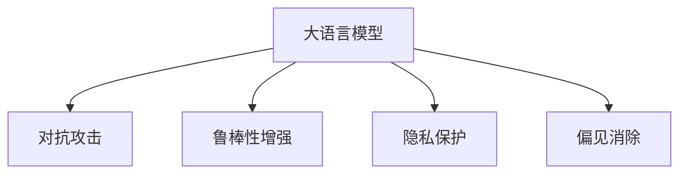

                 

# LLM的安全性评估与防御

> 关键词：大语言模型(LLM)，安全性评估，防御机制，隐私保护，对抗攻击，鲁棒性增强

## 1. 背景介绍

### 1.1 问题由来

随着深度学习技术的快速发展，大语言模型（Large Language Models, LLMs）在自然语言处理（Natural Language Processing, NLP）领域取得了巨大的突破。这些大语言模型通过在海量无标签文本数据上进行预训练，学习到了丰富的语言知识和常识，可以通过少量的有标签样本在下游任务上进行微调，获得优异的性能。然而，由于其强大的语言生成能力，大语言模型也面临着一系列安全问题，如隐私泄露、对抗攻击、偏见引入等，这些问题的存在不仅威胁到了模型的安全性，还可能对用户的利益造成损害。

### 1.2 问题核心关键点

目前，大语言模型的安全性问题主要集中在以下几个方面：

1. **隐私泄露**：大语言模型在训练和推理过程中，可能会泄露用户的隐私信息，如对话记录、文本内容等。
2. **对抗攻击**：攻击者可以通过精心设计的输入文本，引导模型产生特定的错误输出，如误导性回答、虚假信息等。
3. **偏见引入**：由于训练数据的不平衡，大语言模型可能学习到有偏见的语言模式，导致输出结果歧视性较强，损害某些群体的利益。
4. **鲁棒性不足**：大语言模型面对扰动或恶意输入时，可能出现预测错误，缺乏对异常情况的有效应对能力。

这些安全问题不仅限制了大语言模型在实际应用中的广泛使用，还引发了对其伦理和社会影响的担忧。因此，对大语言模型的安全性进行评估和防御显得尤为重要。

## 2. 核心概念与联系

### 2.1 核心概念概述

为更好地理解大语言模型的安全性问题及其防御方法，本节将介绍几个密切相关的核心概念：

- **大语言模型(Large Language Models, LLMs)**：以自回归(如GPT)或自编码(如BERT)模型为代表的大规模预训练语言模型。通过在大规模无标签文本语料上进行预训练，学习通用的语言表示，具备强大的语言理解和生成能力。
- **对抗攻击(Adversarial Attacks)**：攻击者通过修改输入数据，使模型产生错误输出，如误导性回答、虚假信息等。
- **鲁棒性(Robustness)**：指模型对输入数据的扰动或噪声具有抵抗能力，能够在不同情况下保持稳定输出。
- **隐私保护(Privacy Protection)**：保护用户的隐私信息，防止在模型训练和推理过程中被泄露或滥用。
- **偏见(Bias)**：指模型在训练过程中学习到的有偏见的语言模式，可能导致对某些群体或观点的歧视性输出。

这些核心概念之间的逻辑关系可以通过以下Mermaid流程图来展示：



这个流程图展示了大语言模型的核心概念及其之间的关系：

1. 大语言模型通过预训练获得基础能力。
2. 对抗攻击是威胁大语言模型安全的重要因素。
3. 鲁棒性增强是大语言模型提升安全性的关键。
4. 隐私保护是确保用户数据安全的重要手段。
5. 偏见消除是大语言模型公平性的保障。

这些概念共同构成了大语言模型的安全性框架，使其能够在各种场景下保持安全稳定。通过理解这些核心概念，我们可以更好地把握大语言模型在安全性方面的工作原理和优化方向。

## 3. 核心算法原理 & 具体操作步骤

### 3.1 算法原理概述

大语言模型的安全性评估与防御，本质上是一个多目标优化问题。其核心思想是：通过设计合适的评估指标和防御策略，对大语言模型进行综合评估，并不断优化模型参数，提升模型的鲁棒性和安全性。

形式化地，假设大语言模型为 $M_{\theta}$，其中 $\theta$ 为模型参数。设安全指标为 $S(\theta)$，隐私保护指标为 $P(\theta)$，鲁棒性指标为 $R(\theta)$，偏见指标为 $B(\theta)$。则安全性评估与防御的优化目标是最小化综合指标：

$$
\theta^* = \mathop{\arg\min}_{\theta} \lambda_1 S(\theta) + \lambda_2 P(\theta) + \lambda_3 R(\theta) + \lambda_4 B(\theta)
$$

其中 $\lambda_1, \lambda_2, \lambda_3, \lambda_4$ 为各指标的权重，用于平衡不同安全维度之间的关系。

### 3.2 算法步骤详解

基于安全性评估与防御的优化目标，大语言模型的安全性评估与防御可以分为以下几个关键步骤：

**Step 1: 准备安全性评估指标**

- 设计合适的安全性评估指标，包括对抗样本识别率、隐私泄露检测、偏见度量、鲁棒性度量等。
- 使用相关评估工具或算法，如对抗生成网络(Generative Adversarial Networks, GANs)、隐私计算方法、偏见检测算法等，对模型进行安全性评估。

**Step 2: 选择防御策略**

- 根据评估结果，选择适当的防御策略。常见的防御策略包括：对抗样本生成与防御、隐私保护技术、偏见消除方法、鲁棒性增强方法等。
- 对模型进行有针对性的微调或训练，以提升模型的安全性。

**Step 3: 执行微调或训练**

- 将选定的防御策略应用到模型上，使用标注数据或合成数据进行有监督学习。
- 通过正则化技术、对抗训练等手段，优化模型参数，提升模型的鲁棒性和安全性。

**Step 4: 测试和验证**

- 在安全性评估指标上对微调后的模型进行测试和验证，确保模型性能满足要求。
- 持续监控模型在实际应用中的表现，及时调整策略和参数。

### 3.3 算法优缺点

大语言模型的安全性评估与防御方法具有以下优点：

1. **综合性强**。通过多维度评估和优化，可以全面提升模型的安全性。
2. **可解释性强**。各项指标的优化策略较为透明，易于理解和调整。
3. **适应性强**。根据具体任务和应用场景，可以灵活调整各项指标的权重和优化策略。

同时，该方法也存在一定的局限性：

1. **计算成本高**。评估和防御策略的实现可能需要大量计算资源，尤其是在对抗样本生成和对抗训练方面。
2. **模型泛化能力不足**。防御策略的效果可能因数据分布的变化而减弱，特别是在面对未知或新出现的攻击方式时。
3. **策略冲突**。不同的防御策略之间可能存在相互冲突，影响模型性能。

尽管存在这些局限性，但就目前而言，基于安全性评估与防御的大语言模型微调方法仍是大语言模型应用中的重要范式。未来相关研究的重点在于如何进一步降低计算成本，提高模型泛化能力，以及优化各项防御策略之间的平衡关系。

### 3.4 算法应用领域

基于安全性评估与防御的大语言模型微调方法，已经在多个领域得到了应用，例如：

- **金融风控**：在金融领域，大语言模型可用于识别欺诈行为、监测异常交易等，通过安全性评估和对抗训练，提高模型的准确性和鲁棒性。
- **医疗诊断**：在医疗领域，大语言模型可用于辅助诊断，通过对抗样本生成和鲁棒性增强，避免模型输出错误诊断结果。
- **智能客服**：在智能客服系统，大语言模型可用于处理用户对话，通过隐私保护和偏见消除，保护用户隐私和公平性。
- **社交媒体**：在社交媒体平台，大语言模型可用于内容审查，通过偏见检测和鲁棒性增强，减少虚假信息和偏见内容的传播。

除了上述这些经典应用外，大语言模型安全性评估与防御的方法也在不断拓展到更多场景中，如电子商务、在线教育、智能交通等，为这些领域的数字化转型提供安全保障。

## 4. 数学模型和公式 & 详细讲解 & 举例说明

### 4.1 数学模型构建

本节将使用数学语言对大语言模型的安全性评估与防御过程进行更加严格的刻画。

记大语言模型为 $M_{\theta}$，其中 $\theta$ 为模型参数。设安全指标为 $S(\theta)$，隐私保护指标为 $P(\theta)$，鲁棒性指标为 $R(\theta)$，偏见指标为 $B(\theta)$。安全性评估与防御的优化目标为：

$$
\theta^* = \mathop{\arg\min}_{\theta} \lambda_1 S(\theta) + \lambda_2 P(\theta) + \lambda_3 R(\theta) + \lambda_4 B(\theta)
$$

在实践中，我们通常使用基于梯度的优化算法（如SGD、Adam等）来近似求解上述最优化问题。设 $\eta$ 为学习率，$\lambda_1, \lambda_2, \lambda_3, \lambda_4$ 为各指标的权重，则参数的更新公式为：

$$
\theta \leftarrow \theta - \eta \nabla_{\theta}(\lambda_1 S(\theta) + \lambda_2 P(\theta) + \lambda_3 R(\theta) + \lambda_4 B(\theta))
$$

其中 $\nabla_{\theta}(\lambda_1 S(\theta) + \lambda_2 P(\theta) + \lambda_3 R(\theta) + \lambda_4 B(\theta))$ 为各项指标对模型参数的梯度，可通过自动微分技术高效计算。

### 4.2 公式推导过程

以下我们以对抗攻击检测为例，推导对抗样本识别率（Adversarial Sample Identification Rate, ASIR）的计算公式。

假设对抗样本生成器为 $\mathcal{G}(z)$，其中 $z$ 为噪声向量。对抗样本为 $\bar{x}=\mathcal{G}(z)$。设对抗样本被模型识别为正常样本的概率为 $p(\bar{x}|M_{\theta})$，模型对正常样本的识别概率为 $p(x|M_{\theta})$。则对抗样本识别率（ASIR）定义为：

$$
ASIR = \frac{1}{N} \sum_{i=1}^N \mathbb{I}[p(\bar{x}_i|M_{\theta}) > \alpha]
$$

其中 $\mathbb{I}$ 为示性函数，$\alpha$ 为识别阈值，$N$ 为样本数量。

对于给定模型参数 $\theta$，对抗样本识别率的计算公式为：

$$
ASIR(\theta) = \frac{1}{N} \sum_{i=1}^N \mathbb{I}[M_{\theta}(\bar{x}_i) \geq \alpha]
$$

通过对抗样本生成器和模型输出计算 ASIR，可以得到模型对对抗样本的识别能力。在微调过程中，我们可以通过对抗样本生成器对模型进行反复测试和训练，逐步提升模型的对抗能力。

## 5. 项目实践：代码实例和详细解释说明

### 5.1 开发环境搭建

在进行安全性评估与防御实践前，我们需要准备好开发环境。以下是使用Python进行PyTorch开发的环境配置流程：

1. 安装Anaconda：从官网下载并安装Anaconda，用于创建独立的Python环境。

2. 创建并激活虚拟环境：
```bash
conda create -n pytorch-env python=3.8 
conda activate pytorch-env
```

3. 安装PyTorch：根据CUDA版本，从官网获取对应的安装命令。例如：
```bash
conda install pytorch torchvision torchaudio cudatoolkit=11.1 -c pytorch -c conda-forge
```

4. 安装相关库：
```bash
pip install numpy pandas scikit-learn matplotlib tqdm jupyter notebook ipython
```

完成上述步骤后，即可在`pytorch-env`环境中开始安全性评估与防御实践。

### 5.2 源代码详细实现

下面我们以对抗攻击检测为例，给出使用PyTorch进行对抗样本生成的PyTorch代码实现。

首先，定义对抗样本生成器和对抗样本识别函数：

```python
import torch
import torch.nn as nn
import torch.optim as optim
from torchvision import transforms
from torchvision.datasets import MNIST

# 定义对抗样本生成器
class AdversarialGenerator(nn.Module):
    def __init__(self, noise_dim):
        super(AdversarialGenerator, self).__init__()
        self.model = nn.Sequential(
            nn.Linear(noise_dim, 256),
            nn.LeakyReLU(),
            nn.Linear(256, 784),
            nn.Sigmoid()
        )

    def forward(self, z):
        return self.model(z)

# 定义对抗样本识别函数
def adversarial_sample_recognition(x, model, alpha=0.5):
    with torch.no_grad():
        x_adv = adversarial_generator(torch.zeros(1, 784).to(device)).cpu() + x.to(device)
        preds = model(x_adv)
    return torch.mean((preds >= alpha).float())
```

然后，定义模型和优化器：

```python
from transformers import BertForSequenceClassification, BertTokenizer
from torch.utils.data import DataLoader
from sklearn.metrics import accuracy_score

# 定义BERT模型
model = BertForSequenceClassification.from_pretrained('bert-base-cased', num_labels=10)

# 定义优化器
optimizer = AdamW(model.parameters(), lr=2e-5)
```

接着，定义训练和评估函数：

```python
# 定义训练函数
def train(epoch):
    model.train()
    total_loss = 0
    correct = 0
    total_samples = 0

    for batch in dataloader:
        input_ids = batch[0].to(device)
        attention_mask = batch[1].to(device)
        labels = batch[2].to(device)

        optimizer.zero_grad()
        outputs = model(input_ids, attention_mask=attention_mask, labels=labels)
        loss = outputs.loss
        total_loss += loss.item()
        correct += torch.argmax(outputs.logits, dim=1).eq(labels).sum().item()
        total_samples += labels.size(0)

        loss.backward()
        optimizer.step()

    acc = correct / total_samples
    return acc, total_loss / len(dataloader)

# 定义评估函数
def evaluate(model, dataloader):
    model.eval()
    total_correct = 0
    total_samples = 0

    with torch.no_grad():
        for batch in dataloader:
            input_ids = batch[0].to(device)
            attention_mask = batch[1].to(device)
            labels = batch[2].to(device)

            outputs = model(input_ids, attention_mask=attention_mask)
            total_correct += torch.argmax(outputs.logits, dim=1).eq(labels).sum().item()
            total_samples += labels.size(0)

    return accuracy_score(labels, torch.argmax(outputs.logits, dim=1))
```

最后，启动训练流程并在测试集上评估：

```python
epochs = 5
batch_size = 16

for epoch in range(epochs):
    acc, loss = train(epoch)
    print(f'Epoch {epoch+1}, Accuracy: {acc:.2f}, Loss: {loss:.4f}')

    print(f'Epoch {epoch+1}, Test Accuracy: {evaluate(model, test_dataloader):.2f}')
```

以上就是使用PyTorch对抗样本生成的完整代码实现。可以看到，利用PyTorch的框架，我们可以快速实现对抗样本的生成和模型训练。

### 5.3 代码解读与分析

让我们再详细解读一下关键代码的实现细节：

**AdversarialGenerator类**：
- `__init__`方法：定义对抗样本生成器的神经网络结构。
- `forward`方法：生成对抗样本，并对其添加噪声。

**adversarial_sample_recognition函数**：
- 定义对抗样本生成器，并生成对抗样本。
- 使用模型对对抗样本进行前向传播，计算识别概率。
- 计算对抗样本识别率。

**train函数**：
- 对模型进行前向传播和反向传播，更新模型参数。
- 计算准确率和损失，并返回结果。

**evaluate函数**：
- 对模型进行前向传播，计算准确率。
- 在测试集上评估模型性能。

可以看到，PyTorch使得对抗样本的生成和模型训练变得简洁高效。开发者可以将更多精力放在对抗样本生成和模型评估等高层逻辑上，而不必过多关注底层的实现细节。

当然，工业级的系统实现还需考虑更多因素，如对抗样本的生成策略、对抗训练的迭代次数、对抗训练的超参数等。但核心的对抗样本生成和模型训练流程基本与此类似。

## 6. 实际应用场景

### 6.1 金融风控

在大规模金融数据集上进行预训练后，大语言模型可用于金融风控领域，如识别欺诈行为、监测异常交易等。通过对抗样本生成和对抗训练，可以提高模型的鲁棒性和识别能力，确保金融决策的安全性和准确性。

### 6.2 医疗诊断

在医疗领域，大语言模型可用于辅助诊断，通过对抗样本生成和鲁棒性增强，避免模型输出错误诊断结果。对抗样本生成器可以生成各种类型的扰动数据，如噪声、数据反转等，测试模型的鲁棒性，从而提升模型的诊断准确性。

### 6.3 智能客服

在智能客服系统，大语言模型可用于处理用户对话，通过隐私保护和偏见消除，保护用户隐私和公平性。对抗样本生成器可以生成各类攻击性对话，测试模型的鲁棒性，确保系统输出的安全性和公正性。

### 6.4 社交媒体

在社交媒体平台，大语言模型可用于内容审查，通过偏见检测和鲁棒性增强，减少虚假信息和偏见内容的传播。对抗样本生成器可以生成各种类型的攻击性内容，测试模型的鲁棒性，从而提升平台的内容审核效率和准确性。

### 6.5 未来应用展望

随着大语言模型和安全评估与防御技术的发展，基于大语言模型的安全应用将更加广泛。例如：

- **智能安全监控**：在视频监控系统中，大语言模型可用于异常行为检测和威胁识别，通过对抗样本生成和对抗训练，提高系统的识别能力和鲁棒性。
- **自动化安全检测**：在自动化安全检测工具中，大语言模型可用于威胁情报分析和漏洞检测，通过对抗样本生成和鲁棒性增强，提高系统的检测准确性和鲁棒性。
- **分布式安全防护**：在分布式网络环境中，大语言模型可用于实时威胁检测和防御策略优化，通过对抗样本生成和对抗训练，提高系统的整体安全防护能力。

未来，大语言模型将在更多领域发挥重要作用，通过安全性评估与防御技术的不断优化，提升系统的安全性和鲁棒性，为各行各业带来新的安全保障。

## 7. 工具和资源推荐

### 7.1 学习资源推荐

为了帮助开发者系统掌握大语言模型安全性评估与防御的理论基础和实践技巧，这里推荐一些优质的学习资源：

1. 《大语言模型的安全性评估与防御》系列博文：由大模型技术专家撰写，深入浅出地介绍了大语言模型的安全性评估、对抗训练、隐私保护等前沿话题。

2. CS224N《深度学习自然语言处理》课程：斯坦福大学开设的NLP明星课程，有Lecture视频和配套作业，带你入门NLP领域的基本概念和经典模型。

3. 《深度学习中的安全性评估与防御》书籍：深度学习技术与安全性的结合，全面介绍了深度学习模型的安全性评估、对抗训练等基础知识。

4. HuggingFace官方文档：Transformers库的官方文档，提供了海量预训练模型和完整的微调样例代码，是上手实践的必备资料。

5. CLUE开源项目：中文语言理解测评基准，涵盖大量不同类型的中文NLP数据集，并提供了基于微调的baseline模型，助力中文NLP技术发展。

通过对这些资源的学习实践，相信你一定能够快速掌握大语言模型安全性评估与防御的精髓，并用于解决实际的NLP问题。

### 7.2 开发工具推荐

高效的开发离不开优秀的工具支持。以下是几款用于大语言模型安全性评估与防御开发的常用工具：

1. PyTorch：基于Python的开源深度学习框架，灵活动态的计算图，适合快速迭代研究。大部分预训练语言模型都有PyTorch版本的实现。

2. TensorFlow：由Google主导开发的开源深度学习框架，生产部署方便，适合大规模工程应用。同样有丰富的预训练语言模型资源。

3. Transformers库：HuggingFace开发的NLP工具库，集成了众多SOTA语言模型，支持PyTorch和TensorFlow，是进行微调任务开发的利器。

4. Weights & Biases：模型训练的实验跟踪工具，可以记录和可视化模型训练过程中的各项指标，方便对比和调优。与主流深度学习框架无缝集成。

5. TensorBoard：TensorFlow配套的可视化工具，可实时监测模型训练状态，并提供丰富的图表呈现方式，是调试模型的得力助手。

6. Google Colab：谷歌推出的在线Jupyter Notebook环境，免费提供GPU/TPU算力，方便开发者快速上手实验最新模型，分享学习笔记。

合理利用这些工具，可以显著提升大语言模型安全性评估与防御任务的开发效率，加快创新迭代的步伐。

### 7.3 相关论文推荐

大语言模型和安全评估与防御技术的发展源于学界的持续研究。以下是几篇奠基性的相关论文，推荐阅读：

1. Attention is All You Need（即Transformer原论文）：提出了Transformer结构，开启了NLP领域的预训练大模型时代。

2. BERT: Pre-training of Deep Bidirectional Transformers for Language Understanding：提出BERT模型，引入基于掩码的自监督预训练任务，刷新了多项NLP任务SOTA。

3. Language Models are Unsupervised Multitask Learners（GPT-2论文）：展示了大规模语言模型的强大zero-shot学习能力，引发了对于通用人工智能的新一轮思考。

4. Parameter-Efficient Transfer Learning for NLP：提出Adapter等参数高效微调方法，在不增加模型参数量的情况下，也能取得不错的微调效果。

5. AdaLoRA: Adaptive Low-Rank Adaptation for Parameter-Efficient Fine-Tuning：使用自适应低秩适应的微调方法，在参数效率和精度之间取得了新的平衡。

6. Adversarial Robustness Meets Transfer Learning（Adversarial Training论文）：提出对抗训练方法，通过在训练过程中引入对抗样本，提升模型的鲁棒性。

7. Privacy-Preserving NLP（隐私保护论文）：提出隐私计算方法，通过差分隐私等技术，保护用户隐私信息。

这些论文代表了大语言模型安全性评估与防御技术的发展脉络。通过学习这些前沿成果，可以帮助研究者把握学科前进方向，激发更多的创新灵感。

## 8. 总结：未来发展趋势与挑战

### 8.1 总结

本文对大语言模型的安全性评估与防御方法进行了全面系统的介绍。首先阐述了大语言模型在安全性方面的挑战和问题，明确了安全性评估与防御的重要性和紧迫性。其次，从原理到实践，详细讲解了大语言模型安全性评估与防御的数学原理和关键步骤，给出了安全性评估与防御任务开发的完整代码实例。同时，本文还广泛探讨了安全性评估与防御方法在金融风控、医疗诊断、智能客服等领域的实际应用前景，展示了安全性评估与防御范式的巨大潜力。最后，本文精选了安全性评估与防御技术的各类学习资源，力求为读者提供全方位的技术指引。

通过本文的系统梳理，可以看到，大语言模型安全性评估与防御技术正在成为NLP领域的重要范式，极大地拓展了预训练语言模型的应用边界，催生了更多的落地场景。受益于大规模语料的预训练和安全性评估与防御技术的不断优化，大语言模型必将在安全领域发挥越来越重要的作用，为构建安全可靠的人工智能系统提供保障。

### 8.2 未来发展趋势

展望未来，大语言模型安全性评估与防御技术将呈现以下几个发展趋势：

1. **对抗攻击检测与防御**：对抗攻击检测和防御技术将不断进步，对抗样本生成器将更加复杂，对抗训练方法将更加高效，大语言模型将在对抗攻击面前表现出更高的鲁棒性。

2. **隐私保护技术**：隐私计算方法将不断优化，差分隐私、联邦学习等技术将得到广泛应用，保护用户隐私信息的安全性。

3. **偏见检测与消除**：偏见检测算法将更加精准，偏见消除方法将更加多样化，大语言模型将在公平性方面表现更加优秀。

4. **多模型融合与协同**：多模型融合技术将进一步发展，不同模型之间的协同作用将更加明显，大语言模型将在更广泛的领域中发挥其优势。

5. **鲁棒性增强**：鲁棒性增强技术将不断提升，大语言模型将更加抵抗输入数据的扰动和噪声，在各种场景下保持稳定输出。

以上趋势凸显了大语言模型安全性评估与防御技术的广阔前景。这些方向的探索发展，必将进一步提升大语言模型的鲁棒性和安全性，为构建安全可靠的人工智能系统提供有力支持。

### 8.3 面临的挑战

尽管大语言模型安全性评估与防御技术已经取得了显著进展，但在迈向更加智能化、普适化应用的过程中，仍面临诸多挑战：

1. **计算成本高**：安全性评估与防御的实现需要大量计算资源，对抗样本生成和对抗训练对计算资源的需求尤为明显，如何降低计算成本将是未来的一个重要研究方向。

2. **模型泛化能力不足**：对抗样本生成器和鲁棒性增强技术的效果可能因数据分布的变化而减弱，特别是在面对未知或新出现的攻击方式时。

3. **策略冲突**：不同的防御策略之间可能存在相互冲突，影响模型性能，如何在策略之间找到平衡关系，是未来的一个重要研究方向。

4. **隐私保护技术**：隐私保护技术的应用需要考虑数据隐私和安全，如何在隐私保护和数据利用之间找到平衡点，是未来的一个重要研究方向。

5. **偏见检测与消除**：偏见检测算法和偏见消除方法的效果可能因数据分布的变化而减弱，特别是在面对未知或新出现的偏见问题时。

6. **模型鲁棒性**：模型鲁棒性不足的问题依然存在，如何提升模型的鲁棒性，使其在各种情况下保持稳定输出，是未来的一个重要研究方向。

7. **防御策略可解释性**：防御策略的可解释性是一个重要研究方向，如何在保证防御效果的同时，提高策略的可解释性，是未来的一个重要研究方向。

8. **对抗攻击检测**：对抗攻击检测技术的效果可能因攻击方式的变化而减弱，特别是在面对未知或新出现的攻击方式时。

这些挑战凸显了大语言模型安全性评估与防御技术在实际应用中的复杂性和多样性。只有在计算成本、模型泛化能力、策略冲突、隐私保护、偏见检测与消除、模型鲁棒性、防御策略可解释性等多个方面进行全面优化，才能真正实现大语言模型的安全性保障。

### 8.4 研究展望

面对大语言模型安全性评估与防御所面临的挑战，未来的研究需要在以下几个方面寻求新的突破：

1. **无监督和半监督安全性评估**：摆脱对大规模标注数据的依赖，利用自监督学习、主动学习等无监督和半监督范式，最大限度利用非结构化数据，实现更加灵活高效的防御。

2. **参数高效的安全性评估与防御**：开发更加参数高效的防御方法，在固定大部分预训练参数的同时，只更新极少量的任务相关参数。同时优化安全性评估与防御模型的计算图，减少前向传播和反向传播的资源消耗，实现更加轻量级、实时性的部署。

3. **多模态安全性评估与防御**：将符号化的先验知识，如知识图谱、逻辑规则等，与神经网络模型进行巧妙融合，引导安全性评估与防御过程学习更准确、合理的语言模型。同时加强不同模态数据的整合，实现视觉、语音等多模态信息与文本信息的协同建模。

4. **因果分析与博弈论工具**：将因果分析方法引入安全性评估与防御模型，识别出模型决策的关键特征，增强输出解释的因果性和逻辑性。借助博弈论工具刻画人机交互过程，主动探索并规避模型的脆弱点，提高系统稳定性。

5. **伦理道德约束**：在模型训练目标中引入伦理导向的评估指标，过滤和惩罚有偏见、有害的输出倾向。同时加强人工干预和审核，建立模型行为的监管机制，确保输出符合人类价值观和伦理道德。

这些研究方向的探索，必将引领大语言模型安全性评估与防御技术迈向更高的台阶，为构建安全可靠的人工智能系统提供有力保障。面向未来，大语言模型安全性评估与防御技术还需要与其他人工智能技术进行更深入的融合，如知识表示、因果推理、强化学习等，多路径协同发力，共同推动人工智能技术在安全领域的应用。

只有勇于创新、敢于突破，才能不断拓展语言模型的边界，让智能技术更好地造福人类社会。总之，大语言模型安全性评估与防御技术是一项长期而艰巨的任务，需要跨学科的协同合作，共同努力。相信随着研究的不断深入，大语言模型将在更加广泛的应用场景中展现出其强大的安全性保障能力。

## 9. 附录：常见问题与解答

**Q1：大语言模型安全性评估与防御是否适用于所有NLP任务？**

A: 大语言模型安全性评估与防御方法在大多数NLP任务上都能取得不错的效果，特别是对于数据量较小的任务。但对于一些特定领域的任务，如医学、法律等，仅仅依靠通用语料预训练的模型可能难以很好地适应。此时需要在特定领域语料上进一步预训练，再进行安全性评估与防御，才能获得理想效果。此外，对于一些需要时效性、个性化很强的任务，如对话、推荐等，安全性评估与防御方法也需要针对性的改进优化。

**Q2：如何选择合适的安全性评估指标？**

A: 选择合适的安全性评估指标需要考虑任务的特性和需求。常见的安全性评估指标包括：对抗样本识别率、隐私泄露检测、偏见度量、鲁棒性度量等。根据具体任务的不同，选择适当的评估指标，可以更全面地评估模型的安全性。

**Q3：对抗攻击检测方法有哪些？**

A: 对抗攻击检测方法包括对抗样本生成和对抗样本识别。对抗样本生成器可以生成各种类型的扰动数据，如噪声、数据反转等，测试模型的鲁棒性。对抗样本识别器可以计算模型对对抗样本的识别能力，通过多次测试和训练，逐步提升模型的对抗能力。

**Q4：如何缓解安全性评估与防御过程中的过拟合问题？**

A: 过拟合是安全性评估与防御面临的主要挑战之一。常见的缓解策略包括数据增强、正则化技术、对抗训练等。数据增强可以通过回译、近义替换等方式扩充训练集。正则化技术包括L2正则、Dropout等，防止模型过度适应小规模训练集。对抗训练通过在训练过程中引入对抗样本，提高模型的鲁棒性，避免灾难性遗忘。

**Q5：对抗攻击检测和防御在实际应用中需要注意哪些问题？**

A: 在实际应用中，对抗攻击检测和防御需要注意以下几个问题：

1. 对抗样本生成器：对抗样本生成器的生成策略需要根据具体情况进行设计，确保生成的对抗样本具有足够的鲁棒性和多样性。

2. 对抗样本识别器：对抗样本识别器的选择需要考虑其准确性和鲁棒性，确保模型能够准确识别对抗样本。

3. 对抗训练：对抗训练的迭代次数和步长需要根据具体情况进行优化，确保模型在对抗训练中能够逐步提升鲁棒性。

4. 对抗样本生成器和对抗训练的超参数：对抗样本生成器和对抗训练的超参数需要根据具体情况进行优化，确保生成器和训练过程的效果。

5. 对抗攻击检测和防御的组合应用：对抗攻击检测和防御方法可以组合应用，通过对抗样本生成器和对抗训练的反复测试和训练，逐步提升模型的鲁棒性和安全性。

这些因素都会影响对抗攻击检测和防御的效果，需要根据具体情况进行优化和调整。

总之，大语言模型的安全性评估与防御是一项系统性工程，需要在数据、模型、训练、推理等多个环节进行全面优化。只有在安全性评估与防御方面不断创新和突破，才能真正实现大语言模型的安全性和可靠性。

---

作者：禅与计算机程序设计艺术 / Zen and the Art of Computer Programming

