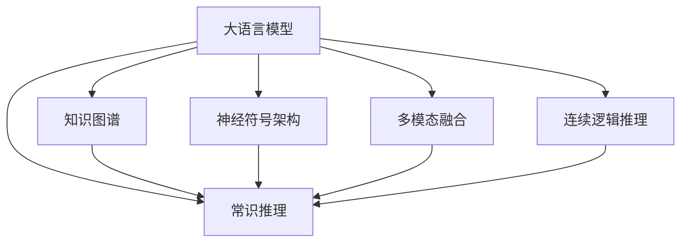

                 

# LLM的常识推理能力构建策略

> 关键词：常识推理,大语言模型(LLM),知识图谱(KG),神经符号架构,多模态融合,连续逻辑推理

## 1. 背景介绍

### 1.1 问题由来

在深度学习技术飞速发展的今天，大语言模型（Large Language Models, LLMs）在自然语言处理（NLP）领域取得了前所未有的突破。这些模型基于大规模无标签文本数据进行自监督预训练，学习到丰富的语言知识和语法结构，可以生成逼真的文本并解答自然语言问题。然而，尽管如此，它们在常识推理能力上仍存在明显不足。

常识推理通常指在处理任务时，通过利用常识知识，而非仅依赖于数据中的直接信息进行推理和决策。例如，在问答系统中，模型需要理解问题并结合常识知识给出恰当的回答。在推荐系统中，模型需要根据用户偏好和产品特点，结合常识知识推荐商品。此外，在智能代理、自动摘要、情感分析等任务中，常识推理能力也是必不可少的。

现实世界中的复杂问题通常不是简单通过已有数据进行学习即可解决，而需要结合常识知识进行推理。因此，提升大语言模型的常识推理能力，使其能更好地理解现实世界，将是大模型应用的重要研究方向。

### 1.2 问题核心关键点

要提升大语言模型的常识推理能力，需要解决以下几个关键问题：

1. **如何获取和融合常识知识**：将常识知识与神经网络模型相结合，增强其推理能力。
2. **如何构建具有常识推理能力的大模型**：设计合适的模型架构，使模型能够高效利用常识知识。
3. **如何评估和优化常识推理能力**：构建评估框架，量化常识推理能力并指导模型的优化。

### 1.3 问题研究意义

提升大语言模型的常识推理能力，对于拓展其应用范围、提高模型性能、加速NLP技术的产业化进程具有重要意义：

1. **增强模型泛化能力**：常识推理能力使得模型能够处理更为复杂和开放性的问题，提升其在多样和变化数据上的泛化能力。
2. **提升任务表现**：常识推理能力有助于模型理解和处理更广泛的任务，提高解决实际问题的准确性和效果。
3. **加速技术落地**：常识推理能力的增强能够更快地将大模型应用于各个领域，缩短技术开发的周期。
4. **促进产业升级**：常识推理能力的提升能推动NLP技术更好地应用于各行各业，为传统行业带来数字化转型的新机遇。

## 2. 核心概念与联系

### 2.1 核心概念概述

为更好地理解大语言模型常识推理能力的构建策略，本节将介绍几个核心概念：

- **大语言模型(LLM)**：以自回归（如GPT系列）或自编码（如BERT系列）模型为代表的大规模预训练语言模型，能够生成逼真的文本，并解答自然语言问题。
- **常识知识**：指人类社会中的常识性事实、概念、规则等，包括物理常识、社会常识、语言常识等。
- **知识图谱(KG)**：一种结构化的语义网络，用于表示实体、属性和实体间的关系。常用于辅助机器学习模型的训练和推理。
- **神经符号架构**：一种结合神经网络和符号计算的模型架构，旨在融合神经网络的灵活性和符号计算的精确性，提升推理能力。
- **多模态融合**：将不同模态的信息进行联合建模，如文本、图像、声音等，以丰富模型的信息表达和推理能力。
- **连续逻辑推理**：一种基于神经网络的逻辑推理方法，利用连续值的向量表示进行逻辑运算和推理。

这些核心概念之间的逻辑关系可以通过以下Mermaid流程图来展示：



这个流程图展示了大语言模型常识推理能力的构建过程中，各个概念之间的联系：

1. 大语言模型通过预训练获得语言知识和能力。
2. 通过融合常识知识、知识图谱、神经符号架构、多模态融合等技术，提升模型的推理能力。
3. 连续逻辑推理技术则进一步增强模型的逻辑推理能力。

## 3. 核心算法原理 & 具体操作步骤

### 3.1 算法原理概述

提升大语言模型的常识推理能力，其核心思想是融合常识知识和神经网络，构建一个具有丰富常识推理能力的大模型。主要分为以下几个步骤：

1. **获取常识知识**：通过知识图谱等形式获取并处理常识知识。
2. **知识融合**：将常识知识与神经网络模型结合，通过编码和解码等机制将其融入模型。
3. **模型构建**：设计合适的模型架构，使得模型能够高效利用常识知识进行推理。
4. **训练优化**：在大量标注数据上对模型进行训练，优化其推理能力。
5. **推理评估**：构建评估框架，量化模型的常识推理能力，并指导模型优化。

### 3.2 算法步骤详解

#### 3.2.1 知识获取

知识图谱是获取常识知识的有效工具。知识图谱通过实体-关系-实体（RDF）三元组的形式，表示实体与实体间的关系，便于机器模型进行推理。构建知识图谱的过程主要包括以下几个步骤：

1. **数据收集**：从各类数据源（如百科全书、新闻、书籍等）中收集实体和关系数据。
2. **数据预处理**：对数据进行清洗、去重、格式化等预处理操作，确保数据的质量。
3. **知识抽取**：利用自然语言处理技术，从文本中抽取实体和关系，构建知识三元组。
4. **图谱构建**：将抽取的知识三元组构建成知识图谱。

#### 3.2.2 知识融合

知识融合是将常识知识与神经网络模型结合的过程。常见的知识融合方法包括：

1. **编码机制**：将常识知识编码为向量形式，与神经网络模型的输出相加或拼接，进行融合。
2. **解码机制**：在神经网络模型的输出层，将常识知识解码后与模型输出进行融合。
3. **混合机制**：结合编码和解码两种机制，进行双向融合。

#### 3.2.3 模型构建

构建具有常识推理能力的大模型需要设计合适的架构。常见的方法包括：

1. **神经符号架构**：结合神经网络和符号计算的模型架构，如神经符号网络（Neural Symbolic Network, NSN）。
2. **图神经网络（GNN）**：用于处理图结构数据的神经网络，如Graph Neural Network（GNN）。
3. **注意力机制**：引入注意力机制，使得模型能够动态地关注关键信息，如Transformer中的自注意力机制。

#### 3.2.4 训练优化

模型构建完成后，需要进行训练优化。训练过程包括：

1. **数据准备**：准备包含常识知识的标注数据集。
2. **损失函数设计**：设计适用于常识推理的损失函数。
3. **优化算法**：选择合适的优化算法，如Adam、SGD等，设置学习率、批大小等参数。
4. **正则化技术**：应用L2正则、Dropout、Early Stopping等技术，避免过拟合。
5. **训练策略**：设计训练策略，如数据增强、对抗训练等。

#### 3.2.5 推理评估

推理评估是检验模型常识推理能力的重要环节。评估框架包括：

1. **评估指标**：定义适用于常识推理的评估指标，如准确率、F1分数等。
2. **评估数据集**：准备包含常识推理任务的评估数据集。
3. **评估方法**：构建评估方法，如自动评估、人工评估等。
4. **评估报告**：输出评估报告，量化常识推理能力。

### 3.3 算法优缺点

提升大语言模型的常识推理能力，具有以下优点：

1. **增强泛化能力**：常识推理能力的增强，使得模型在处理复杂和多样的问题时表现更佳。
2. **提升任务表现**：结合常识知识，模型能更准确地理解和处理任务。
3. **加速技术应用**：常识推理能力的提升，能够更快地将模型应用于各行各业。

同时，该方法也存在一定的局限性：

1. **知识获取难度**：获取和处理常识知识需要大量人工，成本较高。
2. **融合难度**：将常识知识与神经网络模型进行有效融合具有挑战性。
3. **训练复杂度**：融合常识知识后，模型训练变得更加复杂，需要更长时间。

尽管存在这些局限性，但常识推理能力的大幅提升，将为模型的应用带来重大突破。未来相关研究的重点在于如何降低知识获取和融合的难度，提高模型训练效率，同时兼顾模型可解释性和伦理性等因素。

### 3.4 算法应用领域

常识推理能力的提升，将在多个领域得到广泛应用，例如：

- **问答系统**：结合常识知识，模型能够理解自然语言问题并生成准确答案。
- **自然语言生成**：在文本生成任务中，模型能够结合常识知识生成更合理和逼真的文本。
- **推荐系统**：结合用户偏好和产品特点，模型能够更精准地推荐商品。
- **智能代理**：在智能客服、决策支持、知识图谱构建等场景中，常识推理能力使得模型能够更高效地完成任务。

除了上述这些经典领域外，常识推理能力的提升还将拓展到大模型的更多应用场景，为NLP技术带来全新的突破。

## 4. 数学模型和公式 & 详细讲解  
### 4.1 数学模型构建

为了更加严格地刻画提升大语言模型常识推理能力的过程，我们通过数学语言对核心步骤进行详细的阐述。

假设常识知识存储在知识图谱$\mathcal{G}$中，其中每个实体用节点表示，关系用边表示。记大语言模型为$M_{\theta}$，其中$\theta$为模型的参数。假设模型在输入文本$x$上的推理输出为$y$。

定义推理损失函数$\ell$，用于衡量模型推理输出的准确性。设$\ell_{s}$为基于常识知识$s$的推理损失，则综合推理损失为：

$$
\ell_{total} = \sum_{s \in S} \ell_{s}
$$

其中$S$为所有常识知识$s$的集合。

模型的训练目标是最小化综合推理损失$\ell_{total}$，即：

$$
\theta^* = \mathop{\arg\min}_{\theta} \ell_{total}(M_{\theta}, \mathcal{G})
$$

通过最小化推理损失，模型可以逐步学习并利用常识知识，提升其推理能力。

### 4.2 公式推导过程

以下我们以自然语言推理（NLI）任务为例，推导推理损失函数的计算公式。

假设模型在输入$(x, y)$上的推理输出为$y'$。记正确答案为$y$，推理结果为$y'$。定义基于常识知识$s$的推理损失为：

$$
\ell_s = I(y = y')
$$

其中$I$为示性函数，当$y = y'$时取1，否则取0。

综合推理损失$\ell_{total}$定义为：

$$
\ell_{total} = \sum_{s \in S} \ell_s
$$

在训练过程中，模型需要通过反向传播算法计算梯度，更新参数$\theta$，使得$\ell_{total}$最小化。

### 4.3 案例分析与讲解

以问答系统为例，分析提升常识推理能力的具体方法。

在问答系统中，模型需要理解问题并生成准确答案。假设问题为$Q$，答案为$A$。通过知识图谱$\mathcal{G}$，模型能够获取相关的常识知识$s$，如问题的实体、关系等。

假设模型在输入$Q$上的推理输出为$y'$，则推理损失为：

$$
\ell = I(y = y')
$$

如果推理输出$y'$与真实答案$y$相等，则推理损失为0；否则，推理损失为1。

通过训练，模型不断调整参数$\theta$，使得推理损失$\ell$最小化。训练过程中，模型学习并利用常识知识$s$，逐步提升推理能力，生成更准确的回答。

## 5. 项目实践：代码实例和详细解释说明
### 5.1 开发环境搭建

在进行常识推理能力提升的实践前，我们需要准备好开发环境。以下是使用Python进行PyTorch开发的环境配置流程：

1. 安装Anaconda：从官网下载并安装Anaconda，用于创建独立的Python环境。

2. 创建并激活虚拟环境：
```bash
conda create -n pytorch-env python=3.8 
conda activate pytorch-env
```

3. 安装PyTorch：根据CUDA版本，从官网获取对应的安装命令。例如：
```bash
conda install pytorch torchvision torchaudio cudatoolkit=11.1 -c pytorch -c conda-forge
```

4. 安装Transformers库：
```bash
pip install transformers
```

5. 安装各类工具包：
```bash
pip install numpy pandas scikit-learn matplotlib tqdm jupyter notebook ipython
```

完成上述步骤后，即可在`pytorch-env`环境中开始开发实践。

### 5.2 源代码详细实现

下面我们以NLI任务为例，给出使用Transformers库对BERT模型进行常识推理能力提升的PyTorch代码实现。

首先，定义NLI任务的数据处理函数：

```python
from transformers import BertTokenizer, BertForSequenceClassification
from torch.utils.data import Dataset, DataLoader
import torch

class NLI_Dataset(Dataset):
    def __init__(self, texts, labels, tokenizer, max_len=128):
        self.texts = texts
        self.labels = labels
        self.tokenizer = tokenizer
        self.max_len = max_len
        
    def __len__(self):
        return len(self.texts)
    
    def __getitem__(self, item):
        text = self.texts[item]
        label = self.labels[item]
        
        encoding = self.tokenizer(text, return_tensors='pt', max_length=self.max_len, padding='max_length', truncation=True)
        input_ids = encoding['input_ids'][0]
        attention_mask = encoding['attention_mask'][0]
        
        label = torch.tensor(label, dtype=torch.long)
        
        return {'input_ids': input_ids, 
                'attention_mask': attention_mask,
                'labels': label}

# 标签映射
label_map = {'contradiction': 0, 'entailment': 1, 'neutral': 2}

# 创建dataset
tokenizer = BertTokenizer.from_pretrained('bert-base-cased')

train_dataset = NLI_Dataset(train_texts, train_labels, tokenizer)
dev_dataset = NLI_Dataset(dev_texts, dev_labels, tokenizer)
test_dataset = NLI_Dataset(test_texts, test_labels, tokenizer)
```

然后，定义模型和优化器：

```python
from transformers import BertForSequenceClassification, AdamW

model = BertForSequenceClassification.from_pretrained('bert-base-cased', num_labels=len(label_map))

optimizer = AdamW(model.parameters(), lr=2e-5)
```

接着，定义训练和评估函数：

```python
from tqdm import tqdm

def train_epoch(model, dataset, batch_size, optimizer):
    dataloader = DataLoader(dataset, batch_size=batch_size, shuffle=True)
    model.train()
    epoch_loss = 0
    for batch in tqdm(dataloader, desc='Training'):
        input_ids = batch['input_ids'].to(device)
        attention_mask = batch['attention_mask'].to(device)
        labels = batch['labels'].to(device)
        model.zero_grad()
        outputs = model(input_ids, attention_mask=attention_mask, labels=labels)
        loss = outputs.loss
        epoch_loss += loss.item()
        loss.backward()
        optimizer.step()
    return epoch_loss / len(dataloader)

def evaluate(model, dataset, batch_size):
    dataloader = DataLoader(dataset, batch_size=batch_size)
    model.eval()
    preds, labels = [], []
    with torch.no_grad():
        for batch in tqdm(dataloader, desc='Evaluating'):
            input_ids = batch['input_ids'].to(device)
            attention_mask = batch['attention_mask'].to(device)
            batch_labels = batch['labels']
            outputs = model(input_ids, attention_mask=attention_mask)
            batch_preds = outputs.logits.argmax(dim=1).to('cpu').tolist()
            batch_labels = batch_labels.to('cpu').tolist()
            for pred, label in zip(batch_preds, batch_labels):
                preds.append(pred)
                labels.append(label)
                
    print(classification_report(labels, preds))
```

最后，启动训练流程并在测试集上评估：

```python
epochs = 5
batch_size = 16

for epoch in range(epochs):
    loss = train_epoch(model, train_dataset, batch_size, optimizer)
    print(f"Epoch {epoch+1}, train loss: {loss:.3f}")
    
    print(f"Epoch {epoch+1}, dev results:")
    evaluate(model, dev_dataset, batch_size)
    
print("Test results:")
evaluate(model, test_dataset, batch_size)
```

以上就是使用PyTorch对BERT模型进行NLI任务常识推理能力提升的完整代码实现。可以看到，得益于Transformers库的强大封装，我们可以用相对简洁的代码完成BERT模型的加载和微调。

### 5.3 代码解读与分析

让我们再详细解读一下关键代码的实现细节：

**NLI_Dataset类**：
- `__init__`方法：初始化文本、标签、分词器等关键组件。
- `__len__`方法：返回数据集的样本数量。
- `__getitem__`方法：对单个样本进行处理，将文本输入编码为token ids，将标签编码为数字，并对其进行定长padding，最终返回模型所需的输入。

**label_map字典**：
- 定义了标签与数字id之间的映射关系，用于将token-wise的预测结果解码回真实的标签。

**训练和评估函数**：
- 使用PyTorch的DataLoader对数据集进行批次化加载，供模型训练和推理使用。
- 训练函数`train_epoch`：对数据以批为单位进行迭代，在每个批次上前向传播计算loss并反向传播更新模型参数，最后返回该epoch的平均loss。
- 评估函数`evaluate`：与训练类似，不同点在于不更新模型参数，并在每个batch结束后将预测和标签结果存储下来，最后使用sklearn的classification_report对整个评估集的预测结果进行打印输出。

**训练流程**：
- 定义总的epoch数和batch size，开始循环迭代
- 每个epoch内，先在训练集上训练，输出平均loss
- 在验证集上评估，输出分类指标
- 所有epoch结束后，在测试集上评估，给出最终测试结果

可以看到，PyTorch配合Transformers库使得BERT模型常识推理能力的提升代码实现变得简洁高效。开发者可以将更多精力放在数据处理、模型改进等高层逻辑上，而不必过多关注底层的实现细节。

当然，工业级的系统实现还需考虑更多因素，如模型的保存和部署、超参数的自动搜索、更灵活的任务适配层等。但核心的微调范式基本与此类似。

## 6. 实际应用场景
### 6.1 智能客服系统

结合常识知识，基于大语言模型的智能客服系统可以更高效地处理客户咨询，提升客户体验和满意度。在处理客户咨询时，模型能够结合常识知识，理解客户需求并提供精准的解决方案。

在技术实现上，可以收集企业内部的历史客服对话记录，将问题和最佳答复构建成监督数据，在此基础上对预训练对话模型进行微调。微调后的对话模型能够自动理解用户意图，匹配最合适的答复，并在必要时接入知识图谱，提高答复的准确性和多样性。

### 6.2 金融舆情监测

结合常识知识，大语言模型能够更全面地理解市场动态，提升金融舆情监测的准确性。在舆情监测过程中，模型能够结合常识知识，理解新闻报道的含义，预测市场趋势，提前预警异常情况。

在具体应用中，可以构建包含金融知识图谱的微调模型，对实时抓取的新闻进行自然语言处理和推理，判断新闻是否包含负面信息或异常信号，及时进行风险提示。

### 6.3 个性化推荐系统

结合常识知识，基于大语言模型的个性化推荐系统能够更准确地理解用户需求，推荐符合用户兴趣的商品或内容。在推荐过程中，模型能够结合常识知识，理解用户偏好和产品特点，生成更合理的推荐列表。

在技术实现上，可以构建包含用户画像、产品知识图谱的微调模型，对用户行为和产品特征进行推理，生成更个性化的推荐结果。

### 6.4 未来应用展望

随着大语言模型和常识推理能力的不断发展，基于微调范式将在更多领域得到应用，为传统行业带来变革性影响。

在智慧医疗领域，结合常识知识，基于大语言模型的医疗问答、病历分析、药物研发等应用将提升医疗服务的智能化水平，辅助医生诊疗，加速新药开发进程。

在智能教育领域，结合常识知识，基于大语言模型的作业批改、学情分析、知识推荐等应用将提升教育质量和公平性，实现因材施教。

在智慧城市治理中，结合常识知识，基于大语言模型的城市事件监测、舆情分析、应急指挥等应用将提高城市管理的自动化和智能化水平，构建更安全、高效的未来城市。

此外，在企业生产、社会治理、文娱传媒等众多领域，基于大语言模型常识推理能力的提升，将推动NLP技术更好地应用于各行各业，为经济社会发展注入新的动力。

## 7. 工具和资源推荐
### 7.1 学习资源推荐

为了帮助开发者系统掌握大语言模型常识推理能力的构建策略，这里推荐一些优质的学习资源：

1. 《Neural Symbolic Learning》书籍：深入介绍神经符号架构及其在常识推理中的应用。

2. 《Reasoning with Neural Networks》论文：详细讨论神经网络在逻辑推理中的应用，提出多种基于连续逻辑推理的方法。

3. 《Knowledge-Graph-Embedding》书籍：介绍知识图谱及其在NLP中的表示和应用。

4. 《HuggingFace Transformers库官方文档》：提供丰富的预训练模型和微调样例代码，是上手实践的必备资料。

5. CS224N《深度学习自然语言处理》课程：斯坦福大学开设的NLP明星课程，涵盖NLP基础知识和前沿技术。

通过对这些资源的学习实践，相信你一定能够快速掌握大语言模型常识推理能力的构建方法，并用于解决实际的NLP问题。

### 7.2 开发工具推荐

高效的开发离不开优秀的工具支持。以下是几款用于大语言模型常识推理能力提升开发的常用工具：

1. PyTorch：基于Python的开源深度学习框架，灵活动态的计算图，适合快速迭代研究。大部分预训练语言模型都有PyTorch版本的实现。

2. TensorFlow：由Google主导开发的开源深度学习框架，生产部署方便，适合大规模工程应用。同样有丰富的预训练语言模型资源。

3. Transformers库：HuggingFace开发的NLP工具库，集成了众多SOTA语言模型，支持PyTorch和TensorFlow，是进行常识推理能力提升开发的利器。

4. Weights & Biases：模型训练的实验跟踪工具，可以记录和可视化模型训练过程中的各项指标，方便对比和调优。与主流深度学习框架无缝集成。

5. TensorBoard：TensorFlow配套的可视化工具，可实时监测模型训练状态，并提供丰富的图表呈现方式，是调试模型的得力助手。

6. Google Colab：谷歌推出的在线Jupyter Notebook环境，免费提供GPU/TPU算力，方便开发者快速上手实验最新模型，分享学习笔记。

合理利用这些工具，可以显著提升大语言模型常识推理能力提升的开发效率，加快创新迭代的步伐。

### 7.3 相关论文推荐

大语言模型常识推理能力的发展源于学界的持续研究。以下是几篇奠基性的相关论文，推荐阅读：

1. 《Neural Logic Models》论文：提出基于神经网络结构的逻辑推理模型，为后续研究提供基础。

2. 《KoGNN: A Unified Knowledge Graph Neural Network Framework》论文：提出统一的知识图谱神经网络框架，为知识融合提供工具。

3. 《Neural Reasoning》论文：提出基于神经网络的连续逻辑推理方法，为常识推理提供算法基础。

4. 《Reasoning with Multi-modal Neural Networks》论文：讨论多模态融合在常识推理中的应用，为多模态学习提供新思路。

5. 《Deep Learning for Recommendation Systems》书籍：介绍深度学习在推荐系统中的应用，特别是基于常识知识的推荐。

这些论文代表了大语言模型常识推理能力的发展脉络。通过学习这些前沿成果，可以帮助研究者把握学科前进方向，激发更多的创新灵感。

## 8. 总结：未来发展趋势与挑战

### 8.1 总结

本文对提升大语言模型常识推理能力的方法进行了全面系统的介绍。首先阐述了常识推理能力对NLP任务的重要意义，明确了微调在大语言模型中的应用。其次，从原理到实践，详细讲解了常识推理能力构建的过程，包括知识获取、知识融合、模型构建、训练优化等关键步骤，给出了微调任务开发的完整代码实例。同时，本文还广泛探讨了常识推理能力在多个行业领域的应用前景，展示了微调范式的巨大潜力。此外，本文精选了微调技术的各类学习资源，力求为读者提供全方位的技术指引。

通过本文的系统梳理，可以看到，基于常识推理能力的大语言模型在NLP任务中能够取得更加逼真和合理的推理结果，从而提升其应用效果。常识推理能力的增强，使得大语言模型在处理复杂和多样的问题时表现更佳，促进了其在实际应用场景中的落地和普及。

### 8.2 未来发展趋势

展望未来，大语言模型常识推理能力的发展趋势主要包括以下几个方面：

1. **融合更多知识图谱**：结合更多的知识图谱，拓展常识知识的覆盖范围，增强模型的推理能力。

2. **引入多模态信息**：融合多模态信息（如文本、图像、声音等），丰富模型的信息表达和推理能力。

3. **发展连续逻辑推理**：改进连续逻辑推理方法，提升模型的推理精度和泛化能力。

4. **优化知识融合机制**：开发更加高效的融合机制，减少知识与模型的冲突，提升常识推理效果。

5. **引入因果推理**：引入因果推理机制，增强模型的因果关系建模能力，提升推理的稳定性和可信度。

6. **开发更多应用场景**：结合常识推理能力，拓展大语言模型在更多领域的应用，如医疗、教育、金融等。

以上趋势凸显了大语言模型常识推理能力的广阔前景。这些方向的探索发展，将进一步提升模型的推理能力，拓展其应用范围，推动NLP技术的产业化进程。

### 8.3 面临的挑战

尽管大语言模型常识推理能力的发展取得一定成果，但在提升常识推理能力的过程中，仍然面临诸多挑战：

1. **知识获取难度**：获取和处理常识知识需要大量人工，成本较高。如何提高知识获取效率，降低成本，是一个亟需解决的问题。

2. **融合难度**：将常识知识与神经网络模型进行有效融合具有挑战性。如何设计高效的融合机制，减小知识与模型的冲突，是一个亟需研究的方向。

3. **训练复杂度**：融合常识知识后，模型训练变得更加复杂，需要更长时间。如何优化训练过程，提高训练效率，是一个亟需解决的问题。

4. **推理准确性**：常识推理能力的提升，需要确保推理结果的准确性。如何量化和评估推理结果，指导模型优化，是一个亟需解决的问题。

5. **模型可解释性**：提升常识推理能力的同时，如何增强模型的可解释性，使得推理过程透明可理解，是一个亟需解决的问题。

6. **伦理道德约束**：常识推理能力的大幅提升，可能导致模型在处理敏感信息时产生偏见或有害输出。如何设计伦理导向的评估指标，确保模型输出符合伦理道德，是一个亟需解决的问题。

这些挑战凸显了常识推理能力提升的复杂性和多学科融合的需求。需要在知识获取、知识融合、模型构建、训练优化、推理评估等多个环节进行全面优化，才能最大限度地发挥常识推理能力的作用。

### 8.4 研究展望

未来，大语言模型常识推理能力的提升将面临以下研究展望：

1. **知识图谱的多样化**：构建更丰富的知识图谱，涵盖更多的领域和知识点，提高常识推理能力的泛化能力。

2. **知识融合的深度化**：开发更加深度和复杂的知识融合机制，提升常识推理能力的精度和鲁棒性。

3. **多模态推理的广泛化**：探索多模态推理方法，融合更多类型的数据，提升常识推理能力的多样性和复杂性。

4. **逻辑推理的精确化**：发展精确的逻辑推理方法，提高常识推理能力的准确性和可信度。

5. **知识推理的可解释性**：开发可解释的推理方法，使得常识推理过程透明可理解，增强模型的可信度。

6. **伦理道德的规范性**：构建伦理导向的推理评估框架，确保常识推理能力的提升符合伦理道德标准。

这些研究方向将推动大语言模型常识推理能力的进一步发展，为NLP技术带来新的突破。只有勇于创新、敢于突破，才能不断拓展常识推理能力的边界，让人工智能技术更好地造福人类社会。

## 9. 附录：常见问题与解答

**Q1：如何选择合适的常识知识来源？**

A: 选择合适的常识知识来源是常识推理能力提升的关键。以下是几个选择常识知识来源的考虑因素：

1. **权威性**：选择权威和可靠的来源，如百科全书、学术论文、官方数据等。

2. **覆盖范围**：选择涵盖广泛领域的常识知识，如物理常识、社会常识、语言常识等。

3. **时效性**：选择最新和实时的常识知识，确保常识推理能力的准确性和及时性。

4. **质量**：选择质量高、结构化的常识知识，便于机器模型的处理和融合。

5. **多样性**：选择多样化的常识知识来源，丰富模型的知识库。

通过综合考虑上述因素，选择合适的常识知识来源，可以显著提升常识推理能力。

**Q2：在融合常识知识时需要注意哪些问题？**

A: 在融合常识知识时，需要注意以下问题：

1. **知识冲突**：常识知识与神经网络模型之间可能存在冲突，需要设计合适的融合机制，减小冲突。

2. **知识更新**：常识知识需要定期更新，以保持模型的最新状态。

3. **知识泛化**：常识知识需要具备泛化能力，以适应不同领域和场景的应用。

4. **知识表示**：常识知识需要转化为神经网络模型能够处理的形式，如向量表示。

5. **知识融合效率**：常识知识的融合需要高效，减少模型的计算负担。

通过解决上述问题，可以更好地将常识知识与神经网络模型进行融合，提升常识推理能力。

**Q3：在训练常识推理模型时需要注意哪些问题？**

A: 在训练常识推理模型时，需要注意以下问题：

1. **数据质量**：选择高质量、多样化的训练数据，确保模型训练的准确性和泛化能力。

2. **训练策略**：设计合适的训练策略，如数据增强、对抗训练等，提升模型的鲁棒性和泛化能力。

3. **模型复杂度**：控制模型的复杂度，避免过拟合和计算负担过重。

4. **损失函数**：选择适用于常识推理的损失函数，如交叉熵损失、F1分数等。

5. **正则化技术**：应用L2正则、Dropout等正则化技术，避免过拟合。

6. **超参数调优**：优化模型的超参数，如学习率、批大小等，提高模型的训练效率和性能。

通过解决上述问题，可以更好地训练常识推理模型，提升其推理能力。

**Q4：如何评估常识推理能力？**

A: 评估常识推理能力需要构建合适的评估框架，主要包括以下步骤：

1. **定义评估指标**：选择合适的评估指标，如准确率、F1分数、精确率、召回率等，量化常识推理能力。

2. **构建评估数据集**：准备包含常识推理任务的评估数据集，涵盖不同领域和场景的应用。

3. **设计评估方法**：设计评估方法，如自动评估、人工评估等，确保评估结果的准确性和公正性。

4. **输出评估报告**：输出评估报告，包括评估指标、评估结果和可视化图表，帮助开发者理解和优化模型。

通过解决上述问题，可以更好地评估常识推理能力，指导模型的优化和改进。

**Q5：在优化常识推理能力时需要注意哪些问题？**

A: 在优化常识推理能力时，需要注意以下问题：

1. **模型泛化能力**：优化常识推理能力时，需要关注模型的泛化能力，避免过拟合。

2. **推理精度**：优化常识推理能力时，需要确保推理结果的精度，避免错误的推理输出。

3. **推理效率**：优化常识推理能力时，需要提升推理效率，减少计算负担。

4. **可解释性**：优化常识推理能力时，需要增强模型的可解释性，使得推理过程透明可理解。

5. **伦理道德**：优化常识推理能力时，需要考虑伦理道德约束，确保模型输出符合伦理道德标准。

通过解决上述问题，可以更好地优化常识推理能力，提升模型的推理效果和可信度。

---

作者：禅与计算机程序设计艺术 / Zen and the Art of Computer Programming

