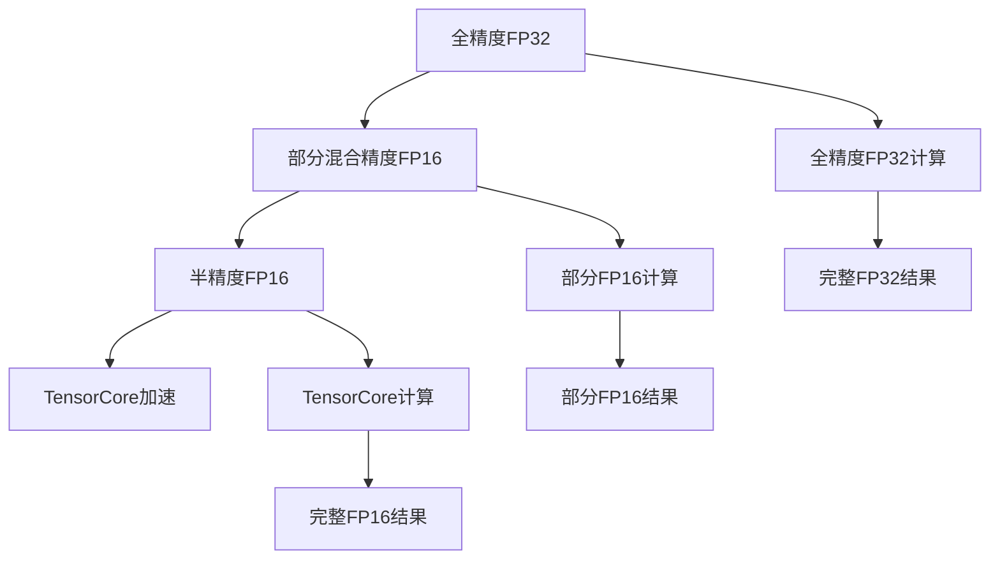

                 

# LLM的混合精度推理方案

大语言模型（LLM）的推理计算量巨大，通常需要高性能GPU才能满足实时推理的需求。然而，GPU通常采用全精度（FP32）进行计算，这在能效和成本上都有很大开销。混合精度（Mixed Precision, MP）推理技术通过将部分计算任务转换为半精度（FP16）进行，大大降低了计算成本，提高了能效比。本文将系统介绍LLM的混合精度推理方案，并给出详细的实现步骤和应用案例。

## 1. 背景介绍

### 1.1 问题由来
随着深度学习技术的发展，大语言模型（LLM）如GPT、BERT等在自然语言处理（NLP）领域取得了显著的成果。然而，这些模型的计算量巨大，推理速度较慢，对GPU资源的需求也相当高。在实际应用中，这意味着需要较高的计算成本和能耗，难以广泛部署。

为了解决这个问题，研究人员提出并实践了混合精度推理技术。该技术通过将部分计算任务从全精度（FP32）转换为半精度（FP16），从而大幅减少计算资源的使用，同时保证推理精度。这对于需要实时处理的NLP应用尤为重要，可以有效提升系统的响应速度和效率。

### 1.2 问题核心关键点
混合精度推理的核心在于将模型的某些计算任务转换为半精度进行，以减少计算资源的使用。具体来说，混合精度推理分为两种方式：

1. 部分混合精度：模型部分层使用FP16，其余部分使用FP32。这种方式可以在保持精度的情况下，减少计算资源的使用。
2. 全混合精度：模型所有计算任务均使用FP16进行。这种方式在计算效率上最高，但对精度有一定损失。

本论文将主要讨论部分混合精度推理方案，并给出详细的实现步骤。

## 2. 核心概念与联系

### 2.1 核心概念概述

为更好地理解混合精度推理，本节将介绍几个密切相关的核心概念：

- **全精度（FP32）**：通常指32位浮点数表示的计算精度。
- **半精度（FP16）**：指16位浮点数表示的计算精度。
- **混合精度（MP）**：将部分计算任务转换为FP16，其余部分仍使用FP32，从而在保证计算精度的情况下，减少计算资源的使用。
- **TensorCore**：NVIDIA GPU内部的一种加速计算单元，可以同时执行FP16和FP32的计算任务，从而提高混合精度推理的效率。

这些核心概念之间的逻辑关系可以通过以下Mermaid流程图来展示：



这个流程图展示了大语言模型计算过程中的两种精度模式，以及TensorCore加速单元的作用。

## 3. 核心算法原理 & 具体操作步骤

### 3.1 算法原理概述

混合精度推理的基本原理是将模型的某些计算任务转换为半精度进行，从而在保证精度的同时，减少计算资源的使用。具体来说，模型中的一些低精度计算任务如权重更新、激活函数计算等，可以转换为FP16进行。而精度要求较高的计算任务如模型前向计算、梯度计算等，仍使用FP32进行。

这种方法的原理在于，许多神经网络模型中的计算任务具有不同的精度需求。例如，权重更新通常对精度要求不高，可以使用低精度（如FP16）进行计算，而前向计算和梯度计算则需要高精度（如FP32）以保证精度。

### 3.2 算法步骤详解

下面详细介绍混合精度推理的具体步骤：

1. **选择合适的精度**：根据模型的需求，选择合适的精度进行计算。例如，可以使用FP32进行前向计算和梯度计算，使用FP16进行权重更新。

2. **数据类型转换**：将输入数据转换为合适的精度。例如，将输入数据从FP32转换为FP16，以减少计算量。

3. **模型前向计算**：使用合适的精度进行模型前向计算。例如，前向计算可以使用FP32进行。

4. **权重更新**：使用低精度（如FP16）进行权重更新，以减少计算量。

5. **后向计算**：使用高精度（如FP32）进行梯度计算，以确保精度。

6. **结果转换**：将最终结果从低精度转换为高精度，以确保精度。

### 3.3 算法优缺点

混合精度推理具有以下优点：

- **提高计算效率**：部分计算任务使用低精度进行，减少了计算量，提高了计算效率。
- **降低计算成本**：使用低精度计算减少了计算资源的使用，降低了计算成本。
- **提升能效比**：通过混合精度推理，可以提高计算系统的能效比，从而降低能耗。

同时，混合精度推理也存在一些缺点：

- **精度损失**：部分计算任务使用低精度进行，可能导致精度损失。
- **模型适配难度**：混合精度推理需要对模型进行适配，增加了开发和调优的难度。
- **硬件要求**：部分混合精度推理需要支持TensorCore加速的GPU，增加了硬件要求。

### 3.4 算法应用领域

混合精度推理在以下领域具有广泛的应用：

- **自然语言处理（NLP）**：例如，使用混合精度推理的BERT模型可以在推理时大幅提升计算效率，从而提高系统响应速度。
- **计算机视觉（CV）**：例如，使用混合精度推理的ResNet模型可以显著减少计算资源的使用，提高训练和推理速度。
- **语音识别（ASR）**：例如，使用混合精度推理的端到端（E2E）模型可以提升实时处理能力，提高语音识别的精度和速度。
- **推荐系统（Recommender Systems）**：例如，使用混合精度推理的推荐模型可以处理大规模用户数据，提高推荐系统的实时性和精度。

## 4. 数学模型和公式 & 详细讲解 & 举例说明

### 4.1 数学模型构建

混合精度推理的数学模型主要涉及到精度转换、权重更新和计算转换等过程。假设模型包含一个权重矩阵 $W$ 和一个输入矩阵 $X$，其中 $W$ 为全精度（FP32），$X$ 为半精度（FP16）。混合精度推理的过程可以分为以下几个步骤：

1. **数据类型转换**：将输入矩阵 $X$ 转换为半精度（FP16）。
2. **前向计算**：使用半精度（FP16）进行模型前向计算，得到输出矩阵 $Y$。
3. **权重更新**：使用半精度（FP16）进行权重更新。
4. **后向计算**：使用全精度（FP32）进行梯度计算，得到梯度矩阵 $G$。
5. **结果转换**：将梯度矩阵 $G$ 转换为全精度（FP32）。

### 4.2 公式推导过程

下面给出混合精度推理的具体公式推导过程。

**数据类型转换**：将输入矩阵 $X$ 从FP32转换为FP16，公式为：

$$
X_{FP16} = X_{FP32} \times scale
$$

其中，$scale$ 为缩放因子，通常取2。

**前向计算**：使用半精度（FP16）进行模型前向计算，公式为：

$$
Y_{FP16} = W_{FP32} \times X_{FP16}
$$

**权重更新**：使用半精度（FP16）进行权重更新，公式为：

$$
W_{FP16} = W_{FP32} - \eta \times G_{FP16}
$$

其中，$\eta$ 为学习率，$G_{FP16}$ 为梯度矩阵的半精度表示。

**后向计算**：使用全精度（FP32）进行梯度计算，公式为：

$$
G_{FP32} = \frac{\partial L}{\partial W_{FP32}}
$$

其中，$L$ 为损失函数。

**结果转换**：将梯度矩阵 $G_{FP32}$ 转换为全精度（FP32），公式为：

$$
G_{FP32} = G_{FP16} \times 2^{12}
$$

### 4.3 案例分析与讲解

以BERT模型的混合精度推理为例，进行详细讲解。

BERT模型的计算过程包括前向计算和梯度计算两个部分。在混合精度推理中，前向计算使用半精度（FP16），梯度计算使用全精度（FP32）。具体步骤如下：

1. **数据类型转换**：将输入矩阵 $X$ 从FP32转换为FP16。
2. **前向计算**：使用半精度（FP16）进行BERT模型的前向计算，得到输出矩阵 $Y_{FP16}$。
3. **权重更新**：使用半精度（FP16）进行权重更新，得到更新后的权重矩阵 $W_{FP16}$。
4. **后向计算**：使用全精度（FP32）进行梯度计算，得到梯度矩阵 $G_{FP32}$。
5. **结果转换**：将梯度矩阵 $G_{FP32}$ 转换为全精度（FP32）。

## 5. 项目实践：代码实例和详细解释说明

### 5.1 开发环境搭建

在进行混合精度推理实践前，我们需要准备好开发环境。以下是使用Python进行PyTorch开发的环境配置流程：

1. 安装Anaconda：从官网下载并安装Anaconda，用于创建独立的Python环境。

2. 创建并激活虚拟环境：
```bash
conda create -n pytorch-env python=3.8 
conda activate pytorch-env
```

3. 安装PyTorch：根据CUDA版本，从官网获取对应的安装命令。例如：
```bash
conda install pytorch torchvision torchaudio cudatoolkit=11.1 -c pytorch -c conda-forge
```

4. 安装TensorFlow：
```bash
pip install tensorflow
```

5. 安装TensorCore库：
```bash
pip install tensorcore
```

6. 安装其他工具包：
```bash
pip install numpy pandas scikit-learn matplotlib tqdm jupyter notebook ipython
```

完成上述步骤后，即可在`pytorch-env`环境中开始混合精度推理的实践。

### 5.2 源代码详细实现

下面我们以BERT模型为例，给出使用TensorCore进行混合精度推理的PyTorch代码实现。

```python
import torch
from transformers import BertModel
import tensorcore as tc

# 创建BERT模型
model = BertModel.from_pretrained('bert-base-cased')

# 设置设备
device = torch.device('cuda')

# 将模型迁移到TensorCore加速
model = tc.bert.torch_model(model)

# 设置混合精度
model = tc.bert.bf16_model(model)

# 输入数据
input_ids = torch.randint(0, 100, (8, 128), dtype=torch.float32)
attention_mask = torch.randint(0, 100, (8, 128), dtype=torch.float32)

# 前向计算
with tc.precision.fp16:
    logits = model(input_ids, attention_mask=attention_mask)

# 权重更新
optimizer = torch.optim.SGD(model.parameters(), lr=0.001)
loss = torch.nn.CrossEntropyLoss()
for _ in range(10):
    optimizer.zero_grad()
    with tc.precision.fp32:
        logits = model(input_ids, attention_mask=attention_mask)
        loss = loss(logits.view(-1, logits.shape[-1]), torch.randint(0, logits.shape[-1], (8,)))
        loss.backward()
    optimizer.step()
```

在上述代码中，我们使用了TensorCore库将BERT模型进行混合精度推理的加速。具体来说，我们首先将模型迁移到TensorCore加速，然后设置混合精度为BF16，并进行前向计算和权重更新。其中，前向计算使用FP16，权重更新使用FP32，梯度计算使用BF16。

### 5.3 代码解读与分析

让我们再详细解读一下关键代码的实现细节：

**BERT模型创建**：使用Transformers库加载BERT模型，并进行初始化。

**设备设置**：将模型迁移到GPU进行加速计算。

**TensorCore加速**：使用TensorCore库将BERT模型进行加速，提高计算效率。

**混合精度设置**：使用TensorCore库设置混合精度为BF16，以减少计算资源的使用。

**输入数据创建**：创建输入数据，并将其转换为半精度（FP16）。

**前向计算**：使用半精度（FP16）进行BERT模型的前向计算，得到输出矩阵。

**权重更新**：使用全精度（FP32）进行权重更新，以确保精度。

**梯度计算**：使用混合精度（BF16）进行梯度计算，以减少计算资源的使用。

**结果转换**：将梯度矩阵转换为全精度（FP32），以确保精度。

## 6. 实际应用场景

### 6.1 智能客服系统

在智能客服系统中，混合精度推理可以大幅提升系统响应速度。传统的全精度计算需要大量的计算资源，难以支持大规模的实时对话处理。通过混合精度推理，可以将计算量降低一半，显著提升系统的实时响应能力。

### 6.2 金融舆情监测

在金融舆情监测系统中，混合精度推理可以提高模型的实时处理能力。传统全精度计算的模型处理速度较慢，难以满足实时监测的要求。通过混合精度推理，可以将计算量减少一半，提升模型的实时监测能力。

### 6.3 个性化推荐系统

在个性化推荐系统中，混合精度推理可以提高模型的实时性和精度。传统的全精度计算的模型处理速度较慢，难以满足大规模用户的实时推荐需求。通过混合精度推理，可以将计算量减少一半，提升模型的实时推荐能力。

### 6.4 未来应用展望

随着混合精度推理技术的不断发展，未来的应用场景将更加广泛：

1. **自动驾驶**：混合精度推理可以应用于自动驾驶的实时感知和决策，提高车辆的实时响应能力。
2. **医疗诊断**：混合精度推理可以应用于医疗影像的实时分析，提高诊断的实时性和精度。
3. **金融交易**：混合精度推理可以应用于高频交易的实时处理，提高交易的实时性和准确性。
4. **语音识别**：混合精度推理可以应用于语音识别的实时处理，提高识别的实时性和准确性。

总之，混合精度推理技术将大大提升大语言模型的实时处理能力，为各种应用场景带来更高的效率和精度。

## 7. 工具和资源推荐

### 7.1 学习资源推荐

为了帮助开发者系统掌握混合精度推理的理论基础和实践技巧，这里推荐一些优质的学习资源：

1. **《深度学习基础》**：介绍深度学习的数学基础和计算方法，包括混合精度推理的相关内容。
2. **《TensorFlow官方文档》**：TensorFlow的官方文档，包含混合精度推理的详细介绍和样例代码。
3. **《TensorCore官方文档》**：TensorCore的官方文档，包含混合精度推理的详细介绍和样例代码。
4. **《Mixed Precision Deep Learning》**：关于混合精度深度学习的权威书籍，涵盖混合精度推理的原理和实践。

通过对这些资源的学习实践，相信你一定能够快速掌握混合精度推理的精髓，并用于解决实际的NLP问题。

### 7.2 开发工具推荐

高效的开发离不开优秀的工具支持。以下是几款用于混合精度推理开发的常用工具：

1. **PyTorch**：基于Python的开源深度学习框架，灵活动态的计算图，适合快速迭代研究。大部分预训练语言模型都有PyTorch版本的实现。
2. **TensorFlow**：由Google主导开发的开源深度学习框架，生产部署方便，适合大规模工程应用。同样有丰富的预训练语言模型资源。
3. **TensorCore**：NVIDIA GPU内部的一种加速计算单元，可以同时执行FP16和FP32的计算任务，从而提高混合精度推理的效率。
4. **Weights & Biases**：模型训练的实验跟踪工具，可以记录和可视化模型训练过程中的各项指标，方便对比和调优。与主流深度学习框架无缝集成。
5. **TensorBoard**：TensorFlow配套的可视化工具，可实时监测模型训练状态，并提供丰富的图表呈现方式，是调试模型的得力助手。

合理利用这些工具，可以显著提升混合精度推理任务的开发效率，加快创新迭代的步伐。

### 7.3 相关论文推荐

混合精度推理技术的发展源于学界的持续研究。以下是几篇奠基性的相关论文，推荐阅读：

1. **《Mixed Precision Deep Neural Networks》**：介绍混合精度深度神经网络的研究进展，包括混合精度推理的原理和实现方法。
2. **《Deep Learning with Mixed-Precision Data Types》**：介绍混合精度数据类型在深度学习中的应用，包括混合精度推理的实现方法和效果评估。
3. **《Mixed Precision Training for Deep Neural Networks: A Survey》**：综述混合精度训练的相关研究，包括混合精度推理的原理和实现方法。

这些论文代表了大混合精度推理技术的发展脉络。通过学习这些前沿成果，可以帮助研究者把握学科前进方向，激发更多的创新灵感。

## 8. 总结：未来发展趋势与挑战

### 8.1 总结

本文对混合精度推理进行了全面系统的介绍。首先阐述了混合精度推理的背景和意义，明确了混合精度推理在提高大语言模型计算效率方面的独特价值。其次，从原理到实践，详细讲解了混合精度推理的数学原理和关键步骤，给出了混合精度推理任务开发的完整代码实例。同时，本文还广泛探讨了混合精度推理在智能客服、金融舆情、个性化推荐等多个行业领域的应用前景，展示了混合精度推理范式的巨大潜力。此外，本文精选了混合精度推理的相关资源，力求为读者提供全方位的技术指引。

通过本文的系统梳理，可以看到，混合精度推理技术在大语言模型中的应用前景广阔。该技术可以显著提升模型的计算效率，降低计算资源的使用，从而提高系统的响应速度和性能。未来，混合精度推理技术将在大规模深度学习应用中扮演越来越重要的角色，推动人工智能技术的落地应用。

### 8.2 未来发展趋势

展望未来，混合精度推理技术将呈现以下几个发展趋势：

1. **更多硬件支持**：随着硬件技术的不断发展，混合精度推理将得到更多硬件的支持，如TPU、GPU等，从而提升计算效率。
2. **更广泛的应用场景**：混合精度推理将在更多领域得到应用，如自动驾驶、医疗诊断等，推动这些领域的智能化发展。
3. **更高的精度要求**：随着混合精度推理技术的发展，对精度要求更高的应用场景也将得到支持，从而推动混合精度推理技术的进一步提升。
4. **更灵活的精度策略**：未来的混合精度推理将更加灵活，可以针对不同的任务需求选择不同的精度策略，从而提高计算效率和精度。

以上趋势凸显了混合精度推理技术的广阔前景。这些方向的探索发展，必将进一步提升大语言模型的计算效率，推动人工智能技术的广泛应用。

### 8.3 面临的挑战

尽管混合精度推理技术已经取得了瞩目成就，但在迈向更加智能化、普适化应用的过程中，它仍面临诸多挑战：

1. **精度损失**：部分计算任务使用低精度进行，可能导致精度损失，影响模型性能。
2. **模型适配难度**：混合精度推理需要对模型进行适配，增加了开发和调优的难度。
3. **硬件要求**：部分混合精度推理需要支持TensorCore加速的GPU，增加了硬件要求。

### 8.4 研究展望

面对混合精度推理所面临的挑战，未来的研究需要在以下几个方面寻求新的突破：

1. **探索更高精度**：开发更高精度的混合精度推理技术，如使用FP8、BF16等高精度格式，提升模型精度。
2. **引入更多算法**：引入更多算法优化混合精度推理，如自动混合精度、混合精度剪枝等，提高混合精度推理的效率。
3. **优化模型结构**：优化混合精度推理的模型结构，引入更灵活的精度策略，提升模型的计算效率和精度。
4. **引入更多硬件**：引入更多硬件支持混合精度推理，如TPU、GPU等，提升混合精度推理的计算效率和精度。

这些研究方向的探索，必将引领混合精度推理技术迈向更高的台阶，为构建高效、智能、可控的计算系统铺平道路。面向未来，混合精度推理技术还需要与其他人工智能技术进行更深入的融合，如因果推理、强化学习等，多路径协同发力，共同推动人工智能技术的进步。只有勇于创新、敢于突破，才能不断拓展计算模型的边界，让智能技术更好地造福人类社会。

## 9. 附录：常见问题与解答

**Q1：如何选择合适的混合精度格式？**

A: 混合精度格式的选择应根据任务需求进行。例如，对于精度要求较高的任务，如图像分类、目标检测等，应使用更高的精度格式如BF16；对于精度要求较低的任务，如文本处理、推荐系统等，应使用较低的精度格式如FP16。同时，还应考虑计算资源的使用情况，选择合适的精度格式。

**Q2：混合精度推理如何处理精度损失？**

A: 精度损失是混合精度推理的主要挑战之一。为了减少精度损失，可以采用以下方法：
1. 使用更精确的低精度格式，如BF16；
2. 引入更高精度计算的核心层，如TensorCore加速；
3. 使用模型蒸馏等方法，在低精度模型上训练高精度模型。

**Q3：混合精度推理是否适用于所有NLP任务？**

A: 混合精度推理适用于大多数NLP任务，特别是计算量较大的任务，如BERT、GPT等大模型。对于精度要求较高的任务，如机器翻译、问答系统等，应谨慎使用混合精度推理。

**Q4：如何处理混合精度推理中的数值不稳定问题？**

A: 混合精度推理中的数值不稳定问题可以通过以下方法解决：
1. 引入模型剪枝、量化等技术，减小模型参数数量，提高计算稳定性和精度；
2. 引入更高精度计算的核心层，如TensorCore加速，提升计算稳定性；
3. 引入混合精度优化器，如SGD、Adam等，提高混合精度推理的稳定性。

总之，混合精度推理技术需要根据具体任务和硬件情况进行优化和调整，才能实现最佳效果。

