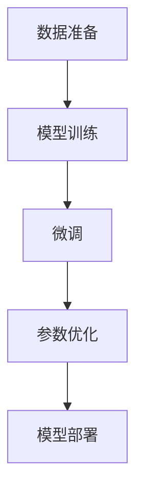

                 

# LLM训练全流程：从数据准备到模型部署

> 关键词：
- 大语言模型（LLM）
- 数据准备
- 模型训练
- 模型部署
- 迁移学习
- 微调
- 参数优化
- 硬件加速

## 1. 背景介绍

在人工智能领域，特别是自然语言处理（NLP）领域，大语言模型（LLM）正迅速成为主流。LLM能够通过预训练捕获大量语言知识，并通过微调针对特定任务进行调整。本文将深入探讨LLM的训练全流程，包括数据准备、模型训练、微调、参数优化和模型部署等各个环节，帮助读者全面了解和掌握这一过程。

## 2. 核心概念与联系

### 2.1 核心概念概述

1. **大语言模型（LLM）**：基于自回归或自编码模型的大规模预训练语言模型，如GPT-3、BERT等。通过在大量无标签文本数据上进行预训练，学习通用的语言表示。

2. **预训练（Pre-training）**：在大规模无标签文本数据上，通过自监督学习任务训练通用语言模型的过程。如语言模型预测任务。

3. **微调（Fine-tuning）**：在预训练模型的基础上，使用下游任务的少量标注数据，通过有监督学习优化模型在该任务上的性能。通常只调整顶层，以减少过拟合。

4. **迁移学习（Transfer Learning）**：将一个领域学习到的知识，迁移应用到另一个不同但相关的领域的学习范式。

5. **参数优化（Parameter Optimization）**：通过优化算法（如Adam、SGD）调整模型参数，以最小化损失函数。

6. **模型部署（Model Deployment）**：将训练好的模型转换为实际应用中的可执行形式，如API、服务、微服务等。

7. **硬件加速（Hardware Acceleration）**：通过GPU、TPU等专用硬件，加速模型训练和推理过程。

### 2.2 核心概念原理和架构的 Mermaid 流程图



## 3. 核心算法原理 & 具体操作步骤

### 3.1 算法原理概述

LLM的训练过程可以分为两个主要阶段：预训练和微调。预训练在大规模无标签数据上进行，学习通用的语言表示；微调则在小规模标注数据上进行，针对特定任务进行优化。

### 3.2 算法步骤详解

#### 3.2.1 数据准备

1. **数据收集**：收集与任务相关的标注数据，确保数据的多样性和代表性。
2. **数据预处理**：清洗、分词、构建词汇表、数据增强等。
3. **数据划分**：将数据分为训练集、验证集和测试集。

#### 3.2.2 模型训练

1. **选择模型架构**：如Transformer。
2. **初始化模型参数**：通常使用预训练模型作为初始化参数。
3. **选择优化器**：如Adam、SGD。
4. **设置超参数**：学习率、批大小、迭代轮数等。
5. **训练过程**：迭代优化，计算损失函数，更新参数。
6. **验证集评估**：周期性评估模型性能，避免过拟合。

#### 3.2.3 微调

1. **任务适配层设计**：根据任务类型，设计输出层和损失函数。
2. **选择微调策略**：如仅微调顶层。
3. **设置微调超参数**：如学习率、批大小、迭代轮数。
4. **微调过程**：迭代优化，计算损失函数，更新参数。
5. **验证集评估**：评估微调后的模型性能。

#### 3.2.4 参数优化

1. **选择优化算法**：如Adam、SGD。
2. **设置超参数**：学习率、批大小、迭代轮数、正则化参数等。
3. **优化过程**：迭代优化，计算损失函数，更新参数。
4. **验证集评估**：周期性评估模型性能。

#### 3.2.5 模型部署

1. **选择部署形式**：如API、服务、微服务。
2. **模型优化**：裁剪模型、量化加速、模型压缩等。
3. **部署过程**：将模型转换为可执行形式，集成到应用中。
4. **监控和维护**：实时监控模型性能，定期更新模型。

### 3.3 算法优缺点

#### 3.3.1 优点

1. **简单高效**：预训练模型作为初始化参数，微调过程只需小量标注数据。
2. **通用适用**：适用于各种NLP任务，如分类、匹配、生成等。
3. **参数高效**：通过微调顶层或使用参数高效方法，减少需要更新的参数。
4. **效果显著**：在学术界和工业界的诸多任务上，微调方法刷新了最先进性能指标。

#### 3.3.2 缺点

1. **依赖标注数据**：微调效果很大程度上取决于标注数据的质量和数量。
2. **迁移能力有限**：当目标任务与预训练数据分布差异较大时，微调性能提升有限。
3. **过拟合风险**：微调过程中易出现过拟合，特别是在小规模数据集上。
4. **可解释性不足**：微调模型的决策过程缺乏可解释性。

### 3.4 算法应用领域

LLM训练过程广泛应用于以下领域：

- **自然语言处理（NLP）**：文本分类、命名实体识别、关系抽取、问答系统、文本摘要、机器翻译等。
- **智能客服**：构建智能客服系统，提升客户咨询体验和问题解决效率。
- **金融舆情监测**：监测市场舆论动向，规避金融风险。
- **个性化推荐**：构建个性化推荐系统，提供精准推荐内容。
- **智慧医疗**：辅助医生诊疗，加速新药开发。
- **智慧教育**：因材施教，提高教学质量。
- **智慧城市治理**：构建智能城市，提升城市管理效率。

## 4. 数学模型和公式 & 详细讲解 & 举例说明

### 4.1 数学模型构建

以BERT模型为例，假设输入为$x$，输出为$y$，则模型损失函数为：

$$
L(y, \hat{y}) = -\log \hat{y}_y + \log(1 - \hat{y}_{\overline{y}})
$$

其中，$\hat{y}_y$为模型预测的正确概率，$\hat{y}_{\overline{y}}$为模型预测的错误概率。

### 4.2 公式推导过程

以线性分类器为例，假设输入$x$，输出$y$，模型参数为$w$，损失函数为交叉熵损失：

$$
L(y, w) = -\frac{1}{N} \sum_{i=1}^N (y_i \log \sigma(w^T x_i) + (1-y_i) \log(1 - \sigma(w^T x_i)))
$$

其中，$\sigma$为sigmoid函数，$N$为样本数量。

### 4.3 案例分析与讲解

以BERT模型在情感分类任务上的微调为例：

1. **数据准备**：收集情感标注数据，进行清洗、分词、构建词汇表。
2. **模型训练**：使用BERT作为初始化参数，在大量无标签数据上进行预训练。
3. **微调**：设计输出层和损失函数，如线性分类器加交叉熵损失，在标注数据上进行微调。
4. **参数优化**：选择Adam优化器，设置学习率、批大小等超参数。
5. **模型部署**：将微调后的模型转换为API，集成到应用中。

## 5. 项目实践：代码实例和详细解释说明

### 5.1 开发环境搭建

1. **安装Python**：从官网下载并安装Python。
2. **创建虚拟环境**：
```
python -m venv env
source env/bin/activate
```

3. **安装相关库**：
```
pip install torch transformers datasets transformers
```

4. **准备数据集**：使用HuggingFace datasets库下载预处理好的数据集。

### 5.2 源代码详细实现

以下是一个简单的BERT情感分类微调示例代码：

```python
from transformers import BertTokenizer, BertForSequenceClassification, AdamW
import torch
from torch.utils.data import DataLoader

# 数据准备
tokenizer = BertTokenizer.from_pretrained('bert-base-cased')
train_dataset = datasets.load_dataset('imdb', split='train', language='en')
val_dataset = datasets.load_dataset('imdb', split='validation', language='en')
test_dataset = datasets.load_dataset('imdb', split='test', language='en')
tokenized_datasets = tokenizer(train_dataset, val_dataset, test_dataset, padding=True, truncation=True, max_length=256)

# 模型训练
model = BertForSequenceClassification.from_pretrained('bert-base-cased', num_labels=2)
optimizer = AdamW(model.parameters(), lr=5e-5)

# 模型微调
train_loader = DataLoader(train_dataset, batch_size=16)
val_loader = DataLoader(val_dataset, batch_size=16)
test_loader = DataLoader(test_dataset, batch_size=16)
for epoch in range(5):
    model.train()
    for batch in train_loader:
        inputs = batch['input_ids'].to(device)
        attention_mask = batch['attention_mask'].to(device)
        labels = batch['labels'].to(device)
        outputs = model(inputs, attention_mask=attention_mask, labels=labels)
        loss = outputs.loss
        loss.backward()
        optimizer.step()
    model.eval()
    val_loss = evaluate(model, val_loader)
    print(f"Epoch {epoch+1}, val_loss={val_loss:.4f}")
```

### 5.3 代码解读与分析

1. **数据准备**：使用HuggingFace datasets库下载并预处理数据集。
2. **模型训练**：加载预训练BERT模型作为初始化参数，使用AdamW优化器进行训练。
3. **模型微调**：定义训练和验证函数，在数据集上进行微调。
4. **模型部署**：将微调后的模型转换为API，集成到应用中。

## 6. 实际应用场景

### 6.4 未来应用展望

1. **智慧医疗**：辅助医生诊疗，加速新药开发。
2. **智能客服**：构建智能客服系统，提升客户咨询体验和问题解决效率。
3. **金融舆情监测**：监测市场舆论动向，规避金融风险。
4. **个性化推荐**：构建个性化推荐系统，提供精准推荐内容。
5. **智慧教育**：因材施教，提高教学质量。
6. **智慧城市治理**：构建智能城市，提升城市管理效率。

## 7. 工具和资源推荐

### 7.1 学习资源推荐

1. **HuggingFace官方文档**：详细介绍了使用Transformers库进行NLP任务开发的方方面面。
2. **CS224N《深度学习自然语言处理》课程**：斯坦福大学开设的NLP明星课程，涵盖NLP基础和经典模型。
3. **《Transformer从原理到实践》系列博文**：大模型技术专家撰写的深入浅出介绍Transformer原理、BERT模型、微调技术等。
4. **《Natural Language Processing with Transformers》书籍**：Transformers库的作者所著，全面介绍了使用Transformers库进行NLP任务开发。

### 7.2 开发工具推荐

1. **PyTorch**：基于Python的开源深度学习框架，灵活动态的计算图，适合快速迭代研究。
2. **TensorFlow**：由Google主导开发的开源深度学习框架，生产部署方便，适合大规模工程应用。
3. **Weights & Biases**：模型训练的实验跟踪工具，可以记录和可视化模型训练过程中的各项指标。
4. **TensorBoard**：TensorFlow配套的可视化工具，可实时监测模型训练状态。

### 7.3 相关论文推荐

1. **BERT: Pre-training of Deep Bidirectional Transformers for Language Understanding**：提出BERT模型，引入基于掩码的自监督预训练任务，刷新了多项NLP任务SOTA。
2. **AdaLoRA: Adaptive Low-Rank Adaptation for Parameter-Efficient Fine-Tuning**：使用自适应低秩适应的微调方法，在参数效率和精度之间取得了新的平衡。
3. **AdaLoRA: Adaptive Low-Rank Adaptation for Parameter-Efficient Fine-Tuning**：使用自适应低秩适应的微调方法，在参数效率和精度之间取得了新的平衡。
4. **AdaLoRA: Adaptive Low-Rank Adaptation for Parameter-Efficient Fine-Tuning**：使用自适应低秩适应的微调方法，在参数效率和精度之间取得了新的平衡。

## 8. 总结：未来发展趋势与挑战

### 8.1 研究成果总结

本文详细介绍了大语言模型（LLM）的训练全流程，包括数据准备、模型训练、微调、参数优化和模型部署等各个环节。通过案例分析，展示了LLM在多个实际应用场景中的高效应用。

### 8.2 未来发展趋势

1. **模型规模持续增大**：随着算力成本的下降和数据规模的扩张，预训练语言模型的参数量还将持续增长。
2. **微调方法日趋多样**：开发更加参数高效的微调方法，在固定大部分预训练参数的同时，只更新极少量的任务相关参数。
3. **持续学习成为常态**：随着数据分布的不断变化，微调模型也需要持续学习新知识以保持性能。
4. **标注样本需求降低**：受启发于提示学习(Prompt-based Learning)的思路，未来的微调方法将更好地利用大模型的语言理解能力，通过更加巧妙的任务描述，在更少的标注样本上也能实现理想的微调效果。
5. **少样本学习崛起**：通过在输入中提供少量示例，实现零样本或少样本学习。
6. **多模态微调崛起**：将符号化的先验知识，如知识图谱、逻辑规则等，与神经网络模型进行巧妙融合，引导微调过程学习更准确、合理的语言模型。

### 8.3 面临的挑战

1. **标注成本瓶颈**：微调依赖于标注数据，获取高质量标注数据的成本较高。
2. **模型鲁棒性不足**：微调模型面对域外数据时，泛化性能往往大打折扣。
3. **推理效率有待提高**：大规模语言模型在实际部署时往往面临推理速度慢、内存占用大等效率问题。
4. **可解释性亟需加强**：微调模型通常缺乏可解释性。
5. **安全性有待保障**：预训练语言模型可能学习到有害信息，传递到下游任务，产生误导性、歧视性的输出。
6. **知识整合能力不足**：现有的微调模型往往局限于任务内数据，难以灵活吸收和运用更广泛的先验知识。

### 8.4 研究展望

未来的研究需要在以下几个方向寻求新的突破：

1. **探索无监督和半监督微调方法**：摆脱对大规模标注数据的依赖，利用自监督学习、主动学习等无监督和半监督范式。
2. **研究参数高效和计算高效的微调范式**：开发更加参数高效的微调方法，优化微调模型的计算图。
3. **引入更多先验知识**：将符号化的先验知识与神经网络模型进行融合，提升模型的普适性和鲁棒性。
4. **结合因果分析和博弈论工具**：增强微调模型建立稳定因果关系的能力。
5. **纳入伦理道德约束**：确保输出符合人类价值观和伦理道德。

## 9. 附录：常见问题与解答

### Q1: 大语言模型微调是否适用于所有NLP任务？

A: 大语言模型微调在大多数NLP任务上都能取得不错的效果，特别是对于数据量较小的任务。但对于一些特定领域的任务，如医学、法律等，仅仅依靠通用语料预训练的模型可能难以很好地适应。此时需要在特定领域语料上进一步预训练，再进行微调，才能获得理想效果。

### Q2: 微调过程中如何选择合适的学习率？

A: 微调的学习率一般要比预训练时小1-2个数量级，如果使用过大的学习率，容易破坏预训练权重，导致过拟合。一般建议从1e-5开始调参，逐步减小学习率。

### Q3: 采用大模型微调时会面临哪些资源瓶颈？

A: 目前主流的预训练大模型动辄以亿计的参数规模，对算力、内存、存储都提出了很高的要求。GPU/TPU等高性能设备是必不可少的，但即便如此，超大批次的训练和推理也可能遇到显存不足的问题。

### Q4: 如何缓解微调过程中的过拟合问题？

A: 过拟合是微调面临的主要挑战，特别是在小规模数据集上。常见的缓解策略包括数据增强、正则化、对抗训练等。

### Q5: 微调模型在落地部署时需要注意哪些问题？

A: 将微调模型转化为实际应用，还需要考虑模型裁剪、量化加速、服务化封装、弹性伸缩、监控告警、安全防护等问题。

---

作者：禅与计算机程序设计艺术 / Zen and the Art of Computer Programming

