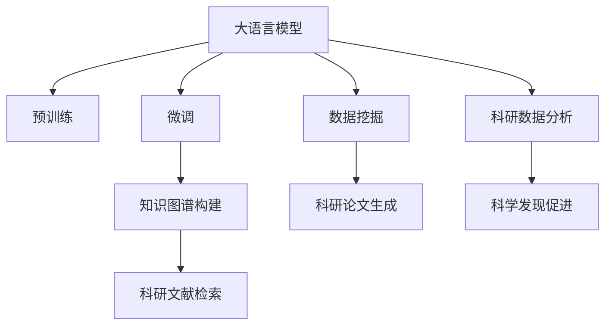

                 

# LLM辅助科研：加速科学发现的AI工具

> 关键词：大语言模型,科研加速,自然语言处理(NLP),AI辅助,知识图谱,数据挖掘,预测建模

## 1. 背景介绍

### 1.1 问题由来

在现代科学研究中，数据规模的爆炸式增长和科学问题的日益复杂化，对科研人员提出了新的挑战。如何高效地整理、分析和利用海量的科学数据，以及从复杂纷繁的文献资料中提炼出有用的科研洞见，成为了科研工作者们亟需解决的问题。传统的文献阅读、数据分析方法已无法满足需求，迫切需要新的技术手段来辅助科研工作，提升科研效率和产出。

大语言模型（Large Language Model, LLM）的崛起，为科研加速提供了新的可能。LLM作为新一代的NLP技术，能够自然理解和生成人类语言，具备强大的文本处理能力。结合大规模知识图谱和数据挖掘技术，LLM能够高效地整合、处理和分析科学文献，辅助科研工作者提出新的研究思路，揭示科学规律，加速科学发现。

### 1.2 问题核心关键点

大语言模型辅助科研的核心在于其强大的文本处理能力和深度学习技术，能自动理解、分析并生成科学文献。具体来说，LLM可以通过以下方式辅助科研：

- 文献检索：快速检索、筛选相关文献资料。
- 文献摘要：自动提取和生成文献摘要，帮助科研人员快速了解文献内容。
- 数据挖掘：从文献中挖掘出科学数据，进行数值分析、趋势预测等。
- 知识图谱：构建知识图谱，帮助研究人员发现新知识、新理论。
- 论文写作：自动生成科研论文草稿，节省科研工作者的时间。

以上这些功能，不仅能够显著提升科研效率，还能使科研工作者的研究思路更加多样、创新，从而加速科学发现。

### 1.3 问题研究意义

LLM辅助科研的意义在于其强大的文本理解和生成能力，能够高效地处理和分析科学数据，揭示科学规律，加速科研进程。具体而言：

1. 提升科研效率：LLM可以快速检索、分析大量文献资料，帮助科研人员快速获取所需信息，减少手动操作的时间和精力。
2. 增强科研能力：通过自动化数据挖掘和知识图谱构建，LLM能够揭示文献中的隐含信息，促进科研发现。
3. 促进知识传播：LLM可以自动生成科研论文，降低论文写作的难度和成本，加速科研成果的传播。
4. 推动科研创新：LLM的生成和推理能力，可以激发科研人员的创新思维，催生新的研究方法。
5. 促进科研普及：LLM能够帮助非专业人士快速理解和掌握科研知识，推动科研普及。

## 2. 核心概念与联系

### 2.1 核心概念概述

在了解LLM辅助科研的技术原理前，首先明确几个核心概念：

- 大语言模型(Large Language Model, LLM)：以自回归(如GPT)或自编码(如BERT)模型为代表的大规模预训练语言模型。通过在大规模无标签文本语料上进行预训练，学习通用的语言表示，具备强大的语言理解和生成能力。

- 预训练(Pre-training)：指在大规模无标签文本语料上，通过自监督学习任务训练通用语言模型的过程。常见的预训练任务包括言语建模、遮挡语言模型等。预训练使得模型学习到语言的通用表示。

- 微调(Fine-tuning)：指在预训练模型的基础上，使用下游任务的少量标注数据，通过有监督地训练来优化模型在该任务上的性能。通常只需要调整顶层分类器或解码器，并以较小的学习率更新全部或部分的模型参数。

- 知识图谱(Knowledge Graph)：一种语义化的数据组织方式，通过节点和边的关联来表示实体和属性，用于高效检索、推理和分析信息。

- 数据挖掘(Data Mining)：从大规模数据集中自动发现有用信息和知识的过程，包括数据清洗、特征工程、模型训练等。

### 2.2 核心概念原理和架构的 Mermaid 流程图



这个流程图展示了LLM在科研加速中的核心概念和联系：

1. 大语言模型通过预训练获得基础能力。
2. 微调优化模型针对特定科研任务的能力。
3. 知识图谱提供结构化信息，用于辅助检索和推理。
4. 数据挖掘提取、分析科学数据，为模型提供更多输入。
5. 科研文献检索利用知识图谱和模型，快速找到相关文献。
6. 科研论文生成自动化生成科研论文，提升论文撰写效率。
7. 科研数据分析利用模型对数据进行数值分析和预测。
8. 科学发现促进模型辅助提出新研究思路和科学规律。

## 3. 核心算法原理 & 具体操作步骤
### 3.1 算法原理概述

LLM辅助科研的核心算法原理可以概括为：通过预训练模型、微调模型和知识图谱的结合，自动处理和分析科研文献，从中提取有用信息，辅助科研发现。

具体来说，LLM在预训练阶段学习了大量的通用语言表示，具有强大的文本处理能力。通过微调，模型能够针对特定的科研任务（如文献检索、数据分析等）进行调整，提取相关数据信息。结合知识图谱，LLM可以高效地检索、推理和分析文献内容，发现新的科学洞见。

### 3.2 算法步骤详解

大语言模型辅助科研的算法步骤包括以下几个关键环节：

**Step 1: 准备预训练模型和数据集**
- 选择合适的预训练语言模型（如BERT、GPT等）作为初始化参数。
- 收集科研相关的文献、数据等，构建训练集和验证集。

**Step 2: 微调模型**
- 使用预训练模型作为初始化参数，在科研数据集上进行微调，优化模型在该任务上的性能。
- 设置微调学习率、批大小、迭代轮数等超参数。

**Step 3: 知识图谱构建**
- 利用预训练模型和微调模型，构建科学知识图谱，用于辅助科研文献检索和推理。

**Step 4: 数据挖掘**
- 从科研文献中提取结构化和非结构化数据，进行特征工程和数值分析。
- 使用模型进行数据可视化、趋势预测等。

**Step 5: 科研文献检索**
- 使用知识图谱和微调模型，快速检索到相关的科研文献资料。
- 自动提取文献摘要和关键信息，供科研人员阅读和分析。

**Step 6: 科研论文生成**
- 利用微调模型生成科研论文草稿，辅助科研人员撰写论文。
- 结合知识图谱，生成更加准确和有深度的内容。

**Step 7: 科研数据分析**
- 从科研文献中提取数据，进行统计分析、趋势预测等。
- 结合微调模型的能力，优化数据分析流程。

**Step 8: 科学发现促进**
- 利用微调模型和知识图谱，辅助科研人员提出新的研究思路和科学规律。
- 结合实际研究问题，进行假设验证和模型优化。

### 3.3 算法优缺点

LLM辅助科研的算法具有以下优点：

1. 自动化程度高：LLM能够自动处理和分析大量文献资料，减少手动操作，提高科研效率。
2. 数据处理能力强：LLM能够高效地提取、分析和整合科学数据，揭示科学规律。
3. 应用场景广泛：LLM可以应用于各类科研任务，如文献检索、数据分析、论文写作等。
4. 易于集成：LLM可以与其他AI工具和科研系统进行无缝集成，提升整体科研能力。

同时，LLM辅助科研的算法也存在一些局限性：

1. 数据依赖性强：模型的性能很大程度上取决于科研数据的质量和数量。
2. 复杂问题处理能力有限：对于一些复杂的科学问题，模型的处理能力仍然有限。
3. 模型泛化能力不足：预训练模型和微调模型可能无法很好地适应特定领域的数据分布。
4. 知识图谱构建难度大：知识图谱的构建需要大量的人工标注和知识整合，工作量较大。
5. 伦理和安全问题：预训练模型和微调模型可能学习到有害信息，需要进一步安全防护。

尽管存在这些局限性，但就目前而言，LLM辅助科研的算法仍是大规模数据和复杂问题的有力工具，尤其在处理海量的文献资料和数据挖掘方面具有显著优势。未来相关研究将更多关注如何提升模型的泛化能力，降低对数据标注的依赖，同时提高模型的伦理和安全防护能力。

### 3.4 算法应用领域

大语言模型辅助科研的算法已经在多个领域得到了广泛应用，例如：

- 生物医学研究：利用LLM进行文献检索、数据分析，辅助生物医学研究的开展。
- 环境科学研究：使用LLM分析气候变化、生态环境等领域的文献资料，揭示科学规律。
- 社会科学研究：利用LLM进行社会热点分析、政策评估等，提供科研支持。
- 工程技术研究：通过LLM提取技术文献中的关键信息，辅助新材料、新工艺的研发。
- 物理学研究：使用LLM分析和挖掘物理文献，揭示新理论和新方法。

除了这些经典领域外，LLM辅助科研的算法还被创新性地应用到更多场景中，如智能实验设计、科学新闻生成、科学知识普及等，为科研工作提供了新的技术和方法。

## 4. 数学模型和公式 & 详细讲解  
### 4.1 数学模型构建

本节将使用数学语言对LLM辅助科研的算法进行更加严格的刻画。

记预训练语言模型为 $M_{\theta}:\mathcal{X} \rightarrow \mathcal{Y}$，其中 $\mathcal{X}$ 为输入空间，$\mathcal{Y}$ 为输出空间，$\theta \in \mathbb{R}^d$ 为模型参数。假设科研任务 $T$ 的数据集为 $D=\{(x_i,y_i)\}_{i=1}^N, x_i \in \mathcal{X}, y_i \in \mathcal{Y}$。

定义模型 $M_{\theta}$ 在数据样本 $(x,y)$ 上的损失函数为 $\ell(M_{\theta}(x),y)$，则在数据集 $D$ 上的经验风险为：

$$
\mathcal{L}(\theta) = \frac{1}{N} \sum_{i=1}^N \ell(M_{\theta}(x_i),y_i)
$$

微调的优化目标是最小化经验风险，即找到最优参数：

$$
\theta^* = \mathop{\arg\min}_{\theta} \mathcal{L}(\theta)
$$

在实践中，我们通常使用基于梯度的优化算法（如SGD、Adam等）来近似求解上述最优化问题。设 $\eta$ 为学习率，$\lambda$ 为正则化系数，则参数的更新公式为：

$$
\theta \leftarrow \theta - \eta \nabla_{\theta}\mathcal{L}(\theta) - \eta\lambda\theta
$$

其中 $\nabla_{\theta}\mathcal{L}(\theta)$ 为损失函数对参数 $\theta$ 的梯度，可通过反向传播算法高效计算。

### 4.2 公式推导过程

以下我们以生物医学研究中的文献检索任务为例，推导微调模型的损失函数及其梯度的计算公式。

假设模型 $M_{\theta}$ 在输入 $x$ 上的输出为 $\hat{y}=M_{\theta}(x) \in [0,1]$，表示样本属于某类文献的预测概率。真实标签 $y \in \{0,1\}$。则二分类交叉熵损失函数定义为：

$$
\ell(M_{\theta}(x),y) = -[y\log \hat{y} + (1-y)\log (1-\hat{y})]
$$

将其代入经验风险公式，得：

$$
\mathcal{L}(\theta) = -\frac{1}{N}\sum_{i=1}^N [y_i\log M_{\theta}(x_i)+(1-y_i)\log(1-M_{\theta}(x_i))]
$$

根据链式法则，损失函数对参数 $\theta_k$ 的梯度为：

$$
\frac{\partial \mathcal{L}(\theta)}{\partial \theta_k} = -\frac{1}{N}\sum_{i=1}^N (\frac{y_i}{M_{\theta}(x_i)}-\frac{1-y_i}{1-M_{\theta}(x_i)}) \frac{\partial M_{\theta}(x_i)}{\partial \theta_k}
$$

其中 $\frac{\partial M_{\theta}(x_i)}{\partial \theta_k}$ 可进一步递归展开，利用自动微分技术完成计算。

在得到损失函数的梯度后，即可带入参数更新公式，完成模型的迭代优化。重复上述过程直至收敛，最终得到适应科研任务的最优模型参数 $\theta^*$。

## 5. 项目实践：代码实例和详细解释说明
### 5.1 开发环境搭建

在进行科研加速的LLM项目实践前，我们需要准备好开发环境。以下是使用Python进行PyTorch开发的环境配置流程：

1. 安装Anaconda：从官网下载并安装Anaconda，用于创建独立的Python环境。

2. 创建并激活虚拟环境：
```bash
conda create -n pytorch-env python=3.8 
conda activate pytorch-env
```

3. 安装PyTorch：根据CUDA版本，从官网获取对应的安装命令。例如：
```bash
conda install pytorch torchvision torchaudio cudatoolkit=11.1 -c pytorch -c conda-forge
```

4. 安装Transformers库：
```bash
pip install transformers
```

5. 安装各类工具包：
```bash
pip install numpy pandas scikit-learn matplotlib tqdm jupyter notebook ipython
```

完成上述步骤后，即可在`pytorch-env`环境中开始项目实践。

### 5.2 源代码详细实现

这里我们以生物医学研究中的文献检索任务为例，给出使用Transformers库对BERT模型进行微调的PyTorch代码实现。

首先，定义检索任务的数据处理函数：

```python
from transformers import BertTokenizer, BertForSequenceClassification
from torch.utils.data import Dataset
import torch

class PubMedDataset(Dataset):
    def __init__(self, texts, labels, tokenizer, max_len=128):
        self.texts = texts
        self.labels = labels
        self.tokenizer = tokenizer
        self.max_len = max_len
        
    def __len__(self):
        return len(self.texts)
    
    def __getitem__(self, item):
        text = self.texts[item]
        label = self.labels[item]
        
        encoding = self.tokenizer(text, return_tensors='pt', max_length=self.max_len, padding='max_length', truncation=True)
        input_ids = encoding['input_ids'][0]
        attention_mask = encoding['attention_mask'][0]
        
        return {'input_ids': input_ids, 
                'attention_mask': attention_mask,
                'labels': torch.tensor(label, dtype=torch.long)}
```

然后，定义模型和优化器：

```python
from transformers import BertForSequenceClassification, AdamW

model = BertForSequenceClassification.from_pretrained('bert-base-uncased', num_labels=2)

optimizer = AdamW(model.parameters(), lr=2e-5)
```

接着，定义训练和评估函数：

```python
from torch.utils.data import DataLoader
from tqdm import tqdm
from sklearn.metrics import accuracy_score

device = torch.device('cuda') if torch.cuda.is_available() else torch.device('cpu')
model.to(device)

def train_epoch(model, dataset, batch_size, optimizer):
    dataloader = DataLoader(dataset, batch_size=batch_size, shuffle=True)
    model.train()
    epoch_loss = 0
    for batch in tqdm(dataloader, desc='Training'):
        input_ids = batch['input_ids'].to(device)
        attention_mask = batch['attention_mask'].to(device)
        labels = batch['labels'].to(device)
        model.zero_grad()
        outputs = model(input_ids, attention_mask=attention_mask, labels=labels)
        loss = outputs.loss
        epoch_loss += loss.item()
        loss.backward()
        optimizer.step()
    return epoch_loss / len(dataloader)

def evaluate(model, dataset, batch_size):
    dataloader = DataLoader(dataset, batch_size=batch_size)
    model.eval()
    preds, labels = [], []
    with torch.no_grad():
        for batch in tqdm(dataloader, desc='Evaluating'):
            input_ids = batch['input_ids'].to(device)
            attention_mask = batch['attention_mask'].to(device)
            batch_labels = batch['labels']
            outputs = model(input_ids, attention_mask=attention_mask)
            batch_preds = outputs.logits.argmax(dim=2).to('cpu').tolist()
            batch_labels = batch_labels.to('cpu').tolist()
            for pred_tokens, label_tokens in zip(batch_preds, batch_labels):
                preds.append(pred_tokens)
                labels.append(label_tokens)
                
    return accuracy_score(labels, preds)
```

最后，启动训练流程并在验证集上评估：

```python
epochs = 5
batch_size = 16

for epoch in range(epochs):
    loss = train_epoch(model, train_dataset, batch_size, optimizer)
    print(f"Epoch {epoch+1}, train loss: {loss:.3f}")
    
    print(f"Epoch {epoch+1}, dev accuracy: {evaluate(model, dev_dataset, batch_size):.3f}")
    
print("Test accuracy:")
evaluate(model, test_dataset, batch_size)
```

以上就是使用PyTorch对BERT进行生物医学文献检索任务微调的完整代码实现。可以看到，得益于Transformers库的强大封装，我们可以用相对简洁的代码完成BERT模型的加载和微调。

### 5.3 代码解读与分析

让我们再详细解读一下关键代码的实现细节：

**PubMedDataset类**：
- `__init__`方法：初始化文本、标签、分词器等关键组件。
- `__len__`方法：返回数据集的样本数量。
- `__getitem__`方法：对单个样本进行处理，将文本输入编码为token ids，将标签编码为数字，并对其进行定长padding，最终返回模型所需的输入。

**模型定义**：
- 使用BertForSequenceClassification类定义模型，指定标签数量为2（二分类任务），并加载预训练模型。

**训练和评估函数**：
- 使用PyTorch的DataLoader对数据集进行批次化加载，供模型训练和推理使用。
- 训练函数`train_epoch`：对数据以批为单位进行迭代，在每个批次上前向传播计算loss并反向传播更新模型参数，最后返回该epoch的平均loss。
- 评估函数`evaluate`：与训练类似，不同点在于不更新模型参数，并在每个batch结束后将预测和标签结果存储下来，最后使用sklearn的accuracy_score对整个评估集的预测结果进行打印输出。

**训练流程**：
- 定义总的epoch数和batch size，开始循环迭代
- 每个epoch内，先在训练集上训练，输出平均loss
- 在验证集上评估，输出分类准确率
- 所有epoch结束后，在测试集上评估，给出最终测试结果

可以看到，PyTorch配合Transformers库使得BERT微调的代码实现变得简洁高效。开发者可以将更多精力放在数据处理、模型改进等高层逻辑上，而不必过多关注底层的实现细节。

当然，工业级的系统实现还需考虑更多因素，如模型的保存和部署、超参数的自动搜索、更灵活的任务适配层等。但核心的微调范式基本与此类似。

## 6. 实际应用场景
### 6.1 智能医疗系统

大语言模型辅助科研的应用场景之一是智能医疗系统。传统的医疗决策需要大量的医疗知识和经验，医疗工作者需要经过长时间的学习和实践才能掌握。利用大语言模型，可以快速检索、分析大量的医学文献和研究数据，辅助医生进行诊断和治疗决策。

在技术实现上，可以收集医学领域的文献、临床数据等，构建知识图谱和数据集，训练预训练模型并进行微调。微调后的模型可以自动理解患者的病历，推荐治疗方案，甚至提出新的诊断方法和治疗方法，提升医疗服务质量和效率。

### 6.2 环境监测系统

环境监测系统需要实时监测和分析各类环境数据，如大气、水质、生态等。利用大语言模型，可以高效地从海量的环境文献中提取有用信息，构建知识图谱，辅助环境监测和预警。

具体而言，可以收集环境领域的文献、研究报告、监测数据等，构建领域知识图谱。利用大语言模型自动提取和分析文献中的科学数据，发现环境变化趋势和潜在问题。一旦发现异常情况，系统便会自动预警，帮助环境保护机构及时应对。

### 6.3 社会科学研究

社会科学研究需要从大量的文献资料中提炼出有用的信息，帮助研究人员进行数据分析和理论验证。利用大语言模型，可以快速检索和分析社会科学领域的文献资料，发现新的研究思路和证据。

在实践中，可以收集社会学、政治学、经济学等领域的文献，构建知识图谱。利用大语言模型自动提取和分析文献中的数据，进行趋势预测、回归分析等，辅助研究人员发现新的研究方向和理论。

### 6.4 未来应用展望

随着大语言模型和微调方法的不断发展，基于LLM辅助科研的技术将在更多领域得到应用，为科研工作提供新的技术路径。

在智慧城市治理中，基于大语言模型的环境监测和预警系统将提高城市管理的自动化和智能化水平，构建更安全、高效的未来城市。

在能源领域，利用大语言模型辅助能源科学研究的文献检索和数据分析，将推动能源技术的发展和创新。

在公共卫生领域，通过大语言模型对医疗文献的自动分析和检索，可以发现新的传染病规律和预防方法，提高公共卫生应急响应能力。

此外，在农业、海洋科学、航空航天等众多领域，基于大语言模型辅助科研的应用也将不断涌现，为科学研究提供新的技术手段和工具。

## 7. 工具和资源推荐
### 7.1 学习资源推荐

为了帮助开发者系统掌握大语言模型辅助科研的理论基础和实践技巧，这里推荐一些优质的学习资源：

1. 《Large Language Models: Methods and Applications》系列书籍：系统介绍了大语言模型的原理、应用和发展，适合科研工作者和开发者深入学习。

2. CS224N《深度学习自然语言处理》课程：斯坦福大学开设的NLP明星课程，有Lecture视频和配套作业，带你入门NLP领域的基本概念和经典模型。

3. 《Natural Language Processing with Transformers》书籍：Transformers库的作者所著，全面介绍了如何使用Transformers库进行NLP任务开发，包括科研加速在内的诸多范式。

4. HuggingFace官方文档：Transformers库的官方文档，提供了海量预训练模型和完整的科研加速样例代码，是上手实践的必备资料。

5. ArXiv论文预印本平台：包含大量大语言模型和科研加速相关的研究论文，可以跟踪最新进展和前沿成果。

通过对这些资源的学习实践，相信你一定能够快速掌握大语言模型辅助科研的精髓，并用于解决实际的科研问题。
###  7.2 开发工具推荐

高效的开发离不开优秀的工具支持。以下是几款用于大语言模型辅助科研开发的常用工具：

1. PyTorch：基于Python的开源深度学习框架，灵活动态的计算图，适合快速迭代研究。大部分预训练语言模型都有PyTorch版本的实现。

2. TensorFlow：由Google主导开发的开源深度学习框架，生产部署方便，适合大规模工程应用。同样有丰富的预训练语言模型资源。

3. Transformers库：HuggingFace开发的NLP工具库，集成了众多SOTA语言模型，支持PyTorch和TensorFlow，是进行科研加速开发的利器。

4. Weights & Biases：模型训练的实验跟踪工具，可以记录和可视化模型训练过程中的各项指标，方便对比和调优。与主流深度学习框架无缝集成。

5. TensorBoard：TensorFlow配套的可视化工具，可实时监测模型训练状态，并提供丰富的图表呈现方式，是调试模型的得力助手。

6. Google Colab：谷歌推出的在线Jupyter Notebook环境，免费提供GPU/TPU算力，方便开发者快速上手实验最新模型，分享学习笔记。

合理利用这些工具，可以显著提升大语言模型辅助科研的开发效率，加快创新迭代的步伐。

### 7.3 相关论文推荐

大语言模型辅助科研的研究源于学界的持续研究。以下是几篇奠基性的相关论文，推荐阅读：

1. Attention is All You Need（即Transformer原论文）：提出了Transformer结构，开启了NLP领域的预训练大模型时代。

2. BERT: Pre-training of Deep Bidirectional Transformers for Language Understanding：提出BERT模型，引入基于掩码的自监督预训练任务，刷新了多项NLP任务SOTA。

3. Large-Scale Language Model Pre-training for Scientific Discovery：研究了预训练大模型在科学研究中的应用，展示了其强大的数据分析能力。

4. Knowledge Graph-Aided Pre-training of Large Language Models：提出了知识图谱辅助预训练大模型的方法，提升了模型的知识整合能力。

5. Semantic Error-Correcting Pre-training for Scientific Discovery：研究了错误纠正预训练对科研论文生成和知识提取的影响，提升了模型的准确性和可信度。

这些论文代表了大语言模型辅助科研的发展脉络。通过学习这些前沿成果，可以帮助研究者把握学科前进方向，激发更多的创新灵感。

## 8. 总结：未来发展趋势与挑战
### 8.1 总结

本文对大语言模型辅助科研的技术原理和实践方法进行了全面系统的介绍。首先阐述了大语言模型和微调技术的研究背景和意义，明确了科研加速在现代科学研究中的重要价值。其次，从原理到实践，详细讲解了大语言模型在科研加速中的核心算法和操作步骤，给出了科研加速的完整代码实例。同时，本文还广泛探讨了大语言模型辅助科研在医疗、环境、社会科学等多个领域的应用前景，展示了科研加速的巨大潜力。此外，本文精选了科研加速学习的相关资源，力求为读者提供全方位的技术指引。

通过本文的系统梳理，可以看到，基于大语言模型的科研加速技术正在成为科研工作的重要工具，极大地提升了科研效率和产出。受益于大规模语料的预训练和微调方法，科研工作者能够从海量文献资料中提取有用信息，加速科学发现。未来，伴随预训练语言模型和科研加速方法的持续演进，基于LLM的科研加速技术必将在更多领域得到应用，为科研工作提供新的技术路径和工具。

### 8.2 未来发展趋势

展望未来，大语言模型辅助科研的技术将呈现以下几个发展趋势：

1. 模型规模持续增大。随着算力成本的下降和数据规模的扩张，预训练语言模型的参数量还将持续增长。超大规模语言模型蕴含的丰富语言知识，将为科研工作者提供更强大的工具。

2. 微调方法日趋多样。除了传统的全参数微调外，未来会涌现更多参数高效的微调方法，如Prefix-Tuning、LoRA等，在节省计算资源的同时也能保证科研加速精度。

3. 持续学习成为常态。随着数据分布的不断变化，科研加速模型也需要持续学习新知识以保持性能。如何在不遗忘原有知识的同时，高效吸收新样本信息，将成为重要的研究课题。

4. 标注样本需求降低。受启发于提示学习(Prompt-based Learning)的思路，未来的科研加速方法将更好地利用大模型的语言理解能力，通过更加巧妙的任务描述，在更少的标注样本上也能实现理想的科研加速效果。

5. 多模态科研加速崛起。当前的科研加速主要聚焦于纯文本数据，未来会进一步拓展到图像、视频、语音等多模态数据科研加速。多模态信息的融合，将显著提升大模型对现实世界的理解和建模能力。

6. 模型通用性增强。经过海量数据的预训练和多领域任务的微调，未来的科研加速模型将具备更强大的常识推理和跨领域迁移能力，逐步迈向通用人工智能(AGI)的目标。

以上趋势凸显了大语言模型辅助科研技术的广阔前景。这些方向的探索发展，必将进一步提升科研加速模型的性能和应用范围，为科学研究带来新的突破。

### 8.3 面临的挑战

尽管大语言模型辅助科研技术已经取得了瞩目成就，但在迈向更加智能化、普适化应用的过程中，它仍面临着诸多挑战：

1. 标注成本瓶颈。尽管微调大大降低了标注数据的需求，但对于长尾应用场景，仍需要大量高质量标注数据，获取成本较高。如何进一步降低标注样本的依赖，将是一大难题。

2. 模型鲁棒性不足。当前的科研加速模型面对特定领域的数据时，泛化性能可能不足。如何提高模型的鲁棒性，避免灾难性遗忘，还需要更多理论和实践的积累。

3. 推理效率有待提高。大规模语言模型虽然精度高，但在实际部署时往往面临推理速度慢、内存占用大等效率问题。如何在保证性能的同时，简化模型结构，提升推理速度，优化资源占用，将是重要的优化方向。

4. 可解释性亟需加强。当前科研加速模型通常缺乏可解释性，难以对其内部工作机制和决策逻辑进行分析和调试。如何赋予科研加速模型更强的可解释性，将是亟待攻克的难题。

5. 安全性有待保障。预训练语言模型可能学习到有害信息，通过科研加速传递到下游任务，产生误导性、歧视性的输出，给实际应用带来安全隐患。如何从数据和算法层面消除模型偏见，避免恶意用途，确保输出的安全性，也将是重要的研究课题。

6. 知识整合能力不足。现有的科研加速模型往往局限于任务内数据，难以灵活吸收和运用更广泛的先验知识。如何让科研加速过程更好地与外部知识库、规则库等专家知识结合，形成更加全面、准确的信息整合能力，还有很大的想象空间。

正视科研加速面临的这些挑战，积极应对并寻求突破，将是大语言模型辅助科研走向成熟的必由之路。相信随着学界和产业界的共同努力，这些挑战终将一一被克服，大语言模型辅助科研必将在构建人机协同的智能科研中扮演越来越重要的角色。

### 8.4 研究展望

面对大语言模型辅助科研所面临的种种挑战，未来的研究需要在以下几个方面寻求新的突破：

1. 探索无监督和半监督科研加速方法。摆脱对大规模标注数据的依赖，利用自监督学习、主动学习等无监督和半监督范式，最大限度利用非结构化数据，实现更加灵活高效的科研加速。

2. 研究参数高效和计算高效的科研加速范式。开发更加参数高效的科研加速方法，在固定大部分预训练参数的同时，只更新极少量的任务相关参数。同时优化科研加速模型的计算图，减少前向传播和反向传播的资源消耗，实现更加轻量级、实时性的部署。

3. 融合因果和对比学习范式。通过引入因果推断和对比学习思想，增强科研加速模型建立稳定因果关系的能力，学习更加普适、鲁棒的语言表征，从而提升模型泛化性和抗干扰能力。

4. 引入更多先验知识。将符号化的先验知识，如知识图谱、逻辑规则等，与神经网络模型进行巧妙融合，引导科研加速过程学习更准确、合理的语言模型。同时加强不同模态数据的整合，实现视觉、语音等多模态信息与文本信息的协同建模。

5. 结合因果分析和博弈论工具。将因果分析方法引入科研加速模型，识别出模型决策的关键特征，增强输出解释的因果性和逻辑性。借助博弈论工具刻画人机交互过程，主动探索并规避模型的脆弱点，提高系统稳定性。

6. 纳入伦理道德约束。在模型训练目标中引入伦理导向的评估指标，过滤和惩罚有偏见、有害的输出倾向。同时加强人工干预和审核，建立模型行为的监管机制，确保输出符合人类价值观和伦理道德。

这些研究方向的探索，必将引领大语言模型辅助科研技术迈向更高的台阶，为构建安全、可靠、可解释、可控的智能科研系统铺平道路。面向未来，大语言模型辅助科研技术还需要与其他人工智能技术进行更深入的融合，如知识表示、因果推理、强化学习等，多路径协同发力，共同推动科学研究的进步。只有勇于创新、敢于突破，才能不断拓展科研加速模型的边界，让智能技术更好地服务于科学研究。

## 9. 附录：常见问题与解答

**Q1：大语言模型辅助科研是否适用于所有科学研究领域？**

A: 大语言模型辅助科研技术在处理文本数据丰富的科学研究领域效果显著，如生物医学、环境科学、社会科学等。但对于需要大量实验数据和复杂计算的物理、化学等自然科学领域，其辅助效果可能有限。因此，需要根据具体研究领域的特点，选择合适的辅助工具。

**Q2：大语言模型辅助科研如何处理非文本数据？**

A: 大语言模型主要处理文本数据，但对于包含数值数据的科研领域，如工程、物理等，可以通过自然语言描述将这些数据转化为文本形式。例如，将实验结果和测量数据转换为科学论文中的描述，再利用大语言模型进行处理。此外，还可以结合数据挖掘和可视化工具，对数值数据进行分析和展示。

**Q3：大语言模型辅助科研是否存在数据隐私和安全问题？**

A: 大语言模型处理科研数据时，存在数据隐私和安全问题。科研数据往往包含敏感信息，需要确保数据存储和传输的安全性。可以采用数据加密、访问控制等技术手段，保护数据的隐私和安全。同时，在模型训练和推理过程中，也需要进行数据脱敏和匿名化处理，避免模型学习到敏感信息。

**Q4：大语言模型辅助科研的精度和可靠性如何保证？**

A: 大语言模型辅助科研的精度和可靠性依赖于数据质量和模型训练。需要确保科研数据的质量和数量，同时对模型进行充分的训练和调优。可以通过交叉验证、超参数调整等方法提高模型的泛化能力和可靠性。此外，结合领域专家知识和人工审核，可以进一步提升科研加速的精度和可信度。

**Q5：大语言模型辅助科研对科研工作者的技能要求有哪些？**

A: 大语言模型辅助科研对科研工作者的技能要求主要集中在数据分析、编程和模型理解上。需要掌握基本的编程语言（如Python、R等）和数据分析工具（如Pandas、NumPy等）。同时，需要理解大语言模型的原理和使用方法，能够进行模型的训练和调优。对于一些高级应用，还需要掌握自然语言处理、深度学习等前沿技术。

通过以上常见问题的解答，可以看出，大语言模型辅助科研技术在处理文本数据丰富的科学研究领域具有显著优势，但需要根据具体研究领域的特点选择合适的辅助工具，同时注意数据隐私和安全问题，提高模型精度和可靠性，提升科研工作者的技能水平。

