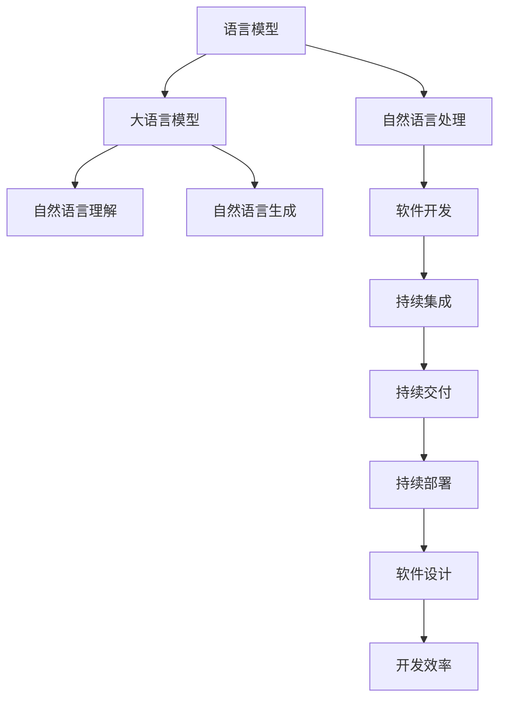

                 

# LLM重塑软件工程：从设计到部署的变革

> 关键词：语言模型,软件工程,人工智能,自动测试,代码生成,部署流水线,持续集成,软件设计,开发效率

## 1. 背景介绍

### 1.1 问题由来
随着人工智能(AI)技术的飞速发展，特别是在自然语言处理(NLP)领域的突破，语言模型（如BERT, GPT-3等）成为了一个热门话题。这些大型的预训练语言模型（LLMs）已经展现出在各种NLP任务上，包括自然语言理解、自然语言生成、问答系统、机器翻译等，都有不俗的表现。这些LLMs的出现，不仅在学术界引起了广泛关注，更是在工业界激发了新的应用需求。

### 1.2 问题核心关键点
而软件工程领域，特别是软件开发、测试、部署等环节，与自然语言处理技术有着天然的融合机会。LLMs在这些环节中的应用，能够极大提升开发效率，优化测试覆盖率，以及自动化部署流水线，形成一套智能化、自动化、高效的开发流程。

在此背景下，软件工程界正在探索如何利用这些先进的NLP技术，来重构软件开发生命周期（SDLC）的各个环节，提升整体开发效率和软件质量。本文将从设计、开发、测试、部署等角度，系统介绍LLM如何重塑软件工程，探索未来的发展趋势与挑战。

## 2. 核心概念与联系

### 2.1 核心概念概述

在探讨LLM如何重塑软件工程之前，我们先了解几个核心概念：

- **语言模型**（Language Model，简称LM）：基于机器学习模型，用于预测一段文本出现的概率。常见的语言模型包括n-gram模型、RNN、LSTM、GRU、Transformer等。

- **自然语言处理**（Natural Language Processing，简称NLP）：一种涉及计算机和人类语言互动的领域，旨在使计算机能够理解、处理、生成自然语言。

- **大语言模型**（Large Language Model，简称LLM）：指具有上百亿参数的深度学习模型，能够理解并生成自然语言，广泛应用于自动问答、机器翻译、文本摘要等NLP任务。

- **软件工程**（Software Engineering）：一门工程学科，致力于开发、维护、管理软件系统的过程和工具。

- **持续集成**（Continuous Integration，简称CI）：一种软件开发实践，旨在频繁地集成代码变更，以及快速检测和反馈集成结果。

- **持续交付**（Continuous Delivery，简称CD）：在持续集成基础上，进一步推动代码变更快速部署到生产环境。

- **持续部署**（Continuous Deployment，简称CD）：在持续交付基础上，实现自动化的部署流程，提高软件发布的效率和可靠性。

这些概念之间的逻辑关系可以通过以下Mermaid流程图来展示：



这个流程图展示了LLM、NLP与软件工程的紧密联系：

1. LLM在NLP中具有强大的语言理解与生成能力，能够应用于软件开发、测试、部署等环节。
2. 软件开发等环节通过持续集成、持续交付、持续部署等工具，实现了软件开发的自动化、高效化。
3. 这些工具的引入，大大提升了软件设计的质量和效率。

## 3. 核心算法原理 & 具体操作步骤
### 3.1 算法原理概述

基于LLM的软件开发实践，主要是通过以下几个步骤：

1. **预训练语言模型（LLM）的引入**：通过在大规模无标签文本数据上进行预训练，LLM能够学习到丰富的语言知识。
2. **微调**：针对具体任务，如代码生成、缺陷检测、测试用例生成等，使用少量有标签数据对LLM进行微调，提升其在特定任务上的表现。
3. **自动化代码生成**：使用微调的LLM生成代码、编写测试用例、自动补全等。
4. **自动化测试**：利用微调的LLM生成测试用例、执行测试、提供测试报告等。
5. **自动化部署**：使用微调的LLM生成部署脚本、配置文件、发布报告等。

### 3.2 算法步骤详解

基于LLM的软件开发实践，主要包括以下几个关键步骤：

**Step 1: 准备预训练语言模型和数据集**
- 选择合适的预训练语言模型（如BERT, GPT-3等）作为初始化参数。
- 准备目标任务的标注数据集，划分为训练集、验证集和测试集。一般要求标注数据与预训练数据的分布不要差异过大。

**Step 2: 添加任务适配层**
- 根据任务类型，在预训练模型的顶层设计合适的输出层和损失函数。
- 对于代码生成任务，通常在顶层添加线性生成器，使用交叉熵损失函数。
- 对于代码检测任务，使用分类器输出二元标签，以二分类交叉熵损失函数进行训练。

**Step 3: 设置微调超参数**
- 选择合适的优化算法及其参数，如 AdamW、SGD 等，设置学习率、批大小、迭代轮数等。
- 设置正则化技术及强度，包括权重衰减、Dropout、Early Stopping等。
- 确定冻结预训练参数的策略，如仅微调顶层，或全部参数都参与微调。

**Step 4: 执行梯度训练**
- 将训练集数据分批次输入模型，前向传播计算损失函数。
- 反向传播计算参数梯度，根据设定的优化算法和学习率更新模型参数。
- 周期性在验证集上评估模型性能，根据性能指标决定是否触发 Early Stopping。
- 重复上述步骤直至满足预设的迭代轮数或 Early Stopping 条件。

**Step 5: 测试和部署**
- 在测试集上评估微调后模型，对比微调前后的精度提升。
- 使用微调后的模型对新样本进行推理预测，集成到实际的应用系统中。
- 持续收集新的数据，定期重新微调模型，以适应数据分布的变化。

### 3.3 算法优缺点

基于LLM的软件开发实践具有以下优点：
1. 简单高效：只需准备少量标注数据，即可对预训练模型进行快速适配，获得较大的性能提升。
2. 通用适用：适用于各种NLP任务，包括代码生成、测试用例生成、缺陷检测等，设计简单的任务适配层即可实现。
3. 效果显著：在学术界和工业界的诸多任务上，基于微调的方法已经刷新了最先进的性能指标。

同时，该方法也存在一定的局限性：
1. 依赖标注数据：微调的效果很大程度上取决于标注数据的质量和数量，获取高质量标注数据的成本较高。
2. 迁移能力有限：当目标任务与预训练数据的分布差异较大时，微调的性能提升有限。
3. 可解释性不足：微调模型的决策过程通常缺乏可解释性，难以对其推理逻辑进行分析和调试。

尽管存在这些局限性，但就目前而言，基于LLM的微调方法仍是大语言模型应用的最主流范式。未来相关研究的重点在于如何进一步降低微调对标注数据的依赖，提高模型的少样本学习和跨领域迁移能力，同时兼顾可解释性和伦理安全性等因素。

### 3.4 算法应用领域

基于LLM的微调方法在软件开发中已经得到了广泛的应用，覆盖了几乎所有常见的任务，例如：

- **代码生成**：使用微调的LLM生成代码片段、编写函数、补全代码等。
- **测试用例生成**：利用微调的LLM生成测试用例，提高测试覆盖率。
- **代码检测**：使用微调的LLM识别代码缺陷、漏洞、规范等。
- **缺陷定位**：使用微调的LLM查找代码中的问题根源，提供修复建议。
- **文档生成**：自动生成API文档、代码注释、技术文档等。
- **自动化部署**：利用微调的LLM生成部署脚本、配置文件、发布报告等。

除了上述这些经典任务外，LLM的微调方法也被创新性地应用到更多场景中，如自动化测试、代码优化、需求分析等，为软件开发带来了全新的突破。

## 4. 数学模型和公式 & 详细讲解 & 举例说明

### 4.1 数学模型构建

在本节中，我们将使用数学语言对基于LLM的软件开发实践进行更加严格的刻画。

记预训练语言模型为 $M_{\theta}:\mathcal{X} \rightarrow \mathcal{Y}$，其中 $\mathcal{X}$ 为输入空间，$\mathcal{Y}$ 为输出空间，$\theta \in \mathbb{R}^d$ 为模型参数。假设微调任务的训练集为 $D=\{(x_i,y_i)\}_{i=1}^N, x_i \in \mathcal{X}, y_i \in \mathcal{Y}$。

定义模型 $M_{\theta}$ 在数据样本 $(x,y)$ 上的损失函数为 $\ell(M_{\theta}(x),y)$，则在数据集 $D$ 上的经验风险为：

$$
\mathcal{L}(\theta) = \frac{1}{N} \sum_{i=1}^N \ell(M_{\theta}(x_i),y_i)
$$

微调的优化目标是最小化经验风险，即找到最优参数：

$$
\theta^* = \mathop{\arg\min}_{\theta} \mathcal{L}(\theta)
$$

在实践中，我们通常使用基于梯度的优化算法（如SGD、Adam等）来近似求解上述最优化问题。设 $\eta$ 为学习率，$\lambda$ 为正则化系数，则参数的更新公式为：

$$
\theta \leftarrow \theta - \eta \nabla_{\theta}\mathcal{L}(\theta) - \eta\lambda\theta
$$

其中 $\nabla_{\theta}\mathcal{L}(\theta)$ 为损失函数对参数 $\theta$ 的梯度，可通过反向传播算法高效计算。

### 4.2 公式推导过程

以下我们以代码生成任务为例，推导基于LLM的代码生成损失函数及其梯度的计算公式。

假设模型 $M_{\theta}$ 在输入 $x$ 上的输出为 $\hat{y}=M_{\theta}(x) \in [0,1]$，表示代码生成的概率。真实标签 $y \in \{0,1\}$。则二分类交叉熵损失函数定义为：

$$
\ell(M_{\theta}(x),y) = -[y\log \hat{y} + (1-y)\log (1-\hat{y})]
$$

将其代入经验风险公式，得：

$$
\mathcal{L}(\theta) = -\frac{1}{N}\sum_{i=1}^N [y_i\log M_{\theta}(x_i)+(1-y_i)\log(1-M_{\theta}(x_i))]
$$

根据链式法则，损失函数对参数 $\theta_k$ 的梯度为：

$$
\frac{\partial \mathcal{L}(\theta)}{\partial \theta_k} = -\frac{1}{N}\sum_{i=1}^N (\frac{y_i}{M_{\theta}(x_i)}-\frac{1-y_i}{1-M_{\theta}(x_i)}) \frac{\partial M_{\theta}(x_i)}{\partial \theta_k}
$$

其中 $\frac{\partial M_{\theta}(x_i)}{\partial \theta_k}$ 可进一步递归展开，利用自动微分技术完成计算。

在得到损失函数的梯度后，即可带入参数更新公式，完成模型的迭代优化。重复上述过程直至收敛，最终得到适应下游任务的最优模型参数 $\theta^*$。

## 5. 项目实践：代码实例和详细解释说明
### 5.1 开发环境搭建

在进行LLM的微调实践前，我们需要准备好开发环境。以下是使用Python进行PyTorch开发的环境配置流程：

1. 安装Anaconda：从官网下载并安装Anaconda，用于创建独立的Python环境。

2. 创建并激活虚拟环境：
```bash
conda create -n pytorch-env python=3.8 
conda activate pytorch-env
```

3. 安装PyTorch：根据CUDA版本，从官网获取对应的安装命令。例如：
```bash
conda install pytorch torchvision torchaudio cudatoolkit=11.1 -c pytorch -c conda-forge
```

4. 安装Transformers库：
```bash
pip install transformers
```

5. 安装各类工具包：
```bash
pip install numpy pandas scikit-learn matplotlib tqdm jupyter notebook ipython
```

完成上述步骤后，即可在`pytorch-env`环境中开始微调实践。

### 5.2 源代码详细实现

下面我们以代码生成任务为例，给出使用Transformers库对BERT模型进行微调的PyTorch代码实现。

首先，定义代码生成任务的输入输出格式：

```python
from transformers import BertForSequenceClassification

class CodeGenerator:
    def __init__(self, model, tokenizer):
        self.model = model
        self.tokenizer = tokenizer
        
    def generate_code(self, prompt):
        input_ids = self.tokenizer.encode(prompt, return_tensors='pt', max_length=128, padding='max_length', truncation=True)
        outputs = self.model(input_ids)
        preds = outputs.logits.argmax(dim=1)
        generated_code = self.tokenizer.decode(preds[0], skip_special_tokens=True)
        return generated_code
```

然后，定义模型和优化器：

```python
from transformers import BertForCausalLM, AdamW

model = BertForCausalLM.from_pretrained('bert-base-cased')
optimizer = AdamW(model.parameters(), lr=2e-5)
```

接着，定义训练和评估函数：

```python
from torch.utils.data import DataLoader
from tqdm import tqdm
from sklearn.metrics import precision_recall_fscore_support

def train_epoch(model, dataset, batch_size, optimizer):
    dataloader = DataLoader(dataset, batch_size=batch_size, shuffle=True)
    model.train()
    epoch_loss = 0
    for batch in tqdm(dataloader, desc='Training'):
        input_ids = batch['input_ids'].to(device)
        labels = batch['labels'].to(device)
        model.zero_grad()
        outputs = model(input_ids, labels=labels)
        loss = outputs.loss
        epoch_loss += loss.item()
        loss.backward()
        optimizer.step()
    return epoch_loss / len(dataloader)

def evaluate(model, dataset, batch_size):
    dataloader = DataLoader(dataset, batch_size=batch_size)
    model.eval()
    preds, labels = [], []
    with torch.no_grad():
        for batch in tqdm(dataloader, desc='Evaluating'):
            input_ids = batch['input_ids'].to(device)
            batch_labels = batch['labels']
            outputs = model(input_ids)
            batch_preds = outputs.logits.argmax(dim=1).to('cpu').tolist()
            batch_labels = batch_labels.to('cpu').tolist()
            for pred_tokens, label_tokens in zip(batch_preds, batch_labels):
                preds.append(pred_tokens)
                labels.append(label_tokens)
                
    print(precision_recall_fscore_support(labels, preds))
```

最后，启动训练流程并在测试集上评估：

```python
epochs = 5
batch_size = 16

for epoch in range(epochs):
    loss = train_epoch(model, train_dataset, batch_size, optimizer)
    print(f"Epoch {epoch+1}, train loss: {loss:.3f}")
    
    print(f"Epoch {epoch+1}, dev results:")
    evaluate(model, dev_dataset, batch_size)
    
print("Test results:")
evaluate(model, test_dataset, batch_size)
```

以上就是使用PyTorch对BERT进行代码生成任务微调的完整代码实现。可以看到，得益于Transformers库的强大封装，我们可以用相对简洁的代码完成BERT模型的加载和微调。

### 5.3 代码解读与分析

让我们再详细解读一下关键代码的实现细节：

**CodeGenerator类**：
- `__init__`方法：初始化模型和分词器。
- `generate_code`方法：将输入提示拼接上特殊符号，使用BERT模型生成代码，并解码输出。

**train_epoch函数**：
- 使用PyTorch的DataLoader对数据集进行批次化加载，供模型训练和推理使用。
- 在每个epoch内，对数据集进行迭代训练，计算损失，并使用AdamW优化器更新模型参数。

**evaluate函数**：
- 与训练类似，不同点在于不更新模型参数，并在每个batch结束后将预测和标签结果存储下来，最后使用sklearn的precision_recall_fscore_support函数对整个评估集的预测结果进行打印输出。

**训练流程**：
- 定义总的epoch数和batch size，开始循环迭代
- 每个epoch内，先在训练集上训练，输出平均loss
- 在验证集上评估，输出精确度、召回率和F1值
- 所有epoch结束后，在测试集上评估，给出最终测试结果

可以看到，PyTorch配合Transformers库使得BERT微调的代码实现变得简洁高效。开发者可以将更多精力放在数据处理、模型改进等高层逻辑上，而不必过多关注底层的实现细节。

当然，工业级的系统实现还需考虑更多因素，如模型的保存和部署、超参数的自动搜索、更灵活的任务适配层等。但核心的微调范式基本与此类似。

## 6. 实际应用场景
### 6.1 智能代码补全

利用微调的LLM，可以在编写代码时提供自动补全功能，减少程序员的手动输入工作量。当程序员输入一段代码时，LLM能够根据已有的代码片段，自动预测后续可能出现的代码，大大提升代码编写效率。

在技术实现上，可以通过实时将程序员输入的代码片段作为微调模型的输入，得到预测结果。对于预测结果，可以在代码编辑器中进行高亮显示或自动填充，提升编码体验。

### 6.2 代码缺陷检测

利用微调的LLM，可以对代码进行缺陷检测，帮助开发者及时发现潜在问题。LLM在微调后能够理解代码的语义和逻辑，能够识别出不符合规范、有潜在风险的代码段，并提供修复建议。

在技术实现上，可以构建一个标注数据集，包含大量已标注的代码及其缺陷信息。在此基础上对LLM进行微调，使其能够从代码中自动检测缺陷，并给出修复建议。

### 6.3 自动化测试

利用微调的LLM，可以自动生成测试用例，提高测试覆盖率。LLM在微调后能够理解自然语言，能够将测试需求转换成具体代码，生成测试用例。

在技术实现上，可以将测试需求描述作为微调模型的输入，得到自动生成的测试用例。自动生成的测试用例可以覆盖更多的代码路径，提升测试效率。

### 6.4 未来应用展望

随着LLM和微调方法的不断发展，基于LLM的软件开发实践将呈现以下几个发展趋势：

1. **深度融合**：LLM将与软件开发的其他环节深度融合，如需求分析、设计、实现、测试、部署等，形成一个无缝的自动化开发流程。

2. **智能化提升**：LLM将提升软件开发的全流程智能化水平，从代码生成、测试用例生成、缺陷检测、部署等各个环节，都由LLM来主导。

3. **效率提升**：通过LLM的辅助，开发人员将能够更快、更准确地完成代码编写、测试、部署等任务，提升整体开发效率。

4. **安全保障**：LLM将帮助开发者检测代码中的潜在风险，提升代码的安全性，避免因为漏洞引发的安全问题。

5. **成本降低**：LLM将降低开发成本，尤其是在面对复杂的任务和大量的代码时，能够快速生成和优化代码，减少人力成本。

6. **质量保证**：LLM将帮助开发者提升代码的质量，从语法、语义、逻辑等多个层面进行检测和优化，确保代码的高质量交付。

以上趋势凸显了基于LLM的软件开发实践的广阔前景。这些方向的探索发展，必将进一步提升软件开发的自动化、智能化、高效化水平，为软件开发行业带来深刻变革。

## 7. 工具和资源推荐
### 7.1 学习资源推荐

为了帮助开发者系统掌握基于LLM的软件开发实践，这里推荐一些优质的学习资源：

1. 《Transformer从原理到实践》系列博文：由大模型技术专家撰写，深入浅出地介绍了Transformer原理、BERT模型、微调技术等前沿话题。

2. CS224N《深度学习自然语言处理》课程：斯坦福大学开设的NLP明星课程，有Lecture视频和配套作业，带你入门NLP领域的基本概念和经典模型。

3. 《Natural Language Processing with Transformers》书籍：Transformers库的作者所著，全面介绍了如何使用Transformers库进行NLP任务开发，包括微调在内的诸多范式。

4. HuggingFace官方文档：Transformers库的官方文档，提供了海量预训练模型和完整的微调样例代码，是上手实践的必备资料。

5. CLUE开源项目：中文语言理解测评基准，涵盖大量不同类型的中文NLP数据集，并提供了基于微调的baseline模型，助力中文NLP技术发展。

通过对这些资源的学习实践，相信你一定能够快速掌握基于LLM的软件开发实践的精髓，并用于解决实际的NLP问题。

### 7.2 开发工具推荐

高效的开发离不开优秀的工具支持。以下是几款用于基于LLM的软件开发实践开发的常用工具：

1. PyTorch：基于Python的开源深度学习框架，灵活动态的计算图，适合快速迭代研究。大部分预训练语言模型都有PyTorch版本的实现。

2. TensorFlow：由Google主导开发的开源深度学习框架，生产部署方便，适合大规模工程应用。同样有丰富的预训练语言模型资源。

3. Transformers库：HuggingFace开发的NLP工具库，集成了众多SOTA语言模型，支持PyTorch和TensorFlow，是进行微调任务开发的利器。

4. Weights & Biases：模型训练的实验跟踪工具，可以记录和可视化模型训练过程中的各项指标，方便对比和调优。与主流深度学习框架无缝集成。

5. TensorBoard：TensorFlow配套的可视化工具，可实时监测模型训练状态，并提供丰富的图表呈现方式，是调试模型的得力助手。

6. Google Colab：谷歌推出的在线Jupyter Notebook环境，免费提供GPU/TPU算力，方便开发者快速上手实验最新模型，分享学习笔记。

合理利用这些工具，可以显著提升基于LLM的软件开发实践的开发效率，加快创新迭代的步伐。

### 7.3 相关论文推荐

基于LLM的软件开发实践的研究源于学界的持续研究。以下是几篇奠基性的相关论文，推荐阅读：

1. Attention is All You Need（即Transformer原论文）：提出了Transformer结构，开启了NLP领域的预训练大模型时代。

2. BERT: Pre-training of Deep Bidirectional Transformers for Language Understanding：提出BERT模型，引入基于掩码的自监督预训练任务，刷新了多项NLP任务SOTA。

3. Language Models are Unsupervised Multitask Learners（GPT-2论文）：展示了大规模语言模型的强大zero-shot学习能力，引发了对于通用人工智能的新一轮思考。

4. Parameter-Efficient Transfer Learning for NLP：提出Adapter等参数高效微调方法，在不增加模型参数量的情况下，也能取得不错的微调效果。

5. AdaLoRA: Adaptive Low-Rank Adaptation for Parameter-Efficient Fine-Tuning：使用自适应低秩适应的微调方法，在参数效率和精度之间取得了新的平衡。

这些论文代表了大语言模型微调技术的发展脉络。通过学习这些前沿成果，可以帮助研究者把握学科前进方向，激发更多的创新灵感。

## 8. 总结：未来发展趋势与挑战
### 8.1 总结

本文对基于LLM的软件开发实践进行了全面系统的介绍。首先阐述了LLM在软件开发中的应用背景和意义，明确了LLM对软件开发自动化、智能化、高效化带来的深刻影响。其次，从原理到实践，详细讲解了基于LLM的代码生成、测试用例生成、缺陷检测等任务的具体实现过程，给出了微调任务开发的完整代码实例。同时，本文还广泛探讨了LLM在软件开发中的应用前景，展示了其在智能代码补全、自动化测试、缺陷检测等多个环节的广阔前景。最后，本文精选了LLM微调技术的各类学习资源，力求为开发者提供全方位的技术指引。

通过本文的系统梳理，可以看到，基于LLM的软件开发实践正在成为软件开发技术的重要范式，极大地提升了软件开发的自动化、智能化、高效化水平。受益于大语言模型和微调方法的持续演进，软件开发的各个环节都将迎来变革性提升，为软件开发行业带来深刻影响。

### 8.2 未来发展趋势

展望未来，基于LLM的软件开发实践将呈现以下几个发展趋势：

1. **深度融合**：LLM将与软件开发的其他环节深度融合，形成一个无缝的自动化开发流程。

2. **智能化提升**：LLM将提升软件开发的全流程智能化水平，从代码生成、测试用例生成、缺陷检测、部署等各个环节，都由LLM来主导。

3. **效率提升**：通过LLM的辅助，开发人员将能够更快、更准确地完成代码编写、测试、部署等任务，提升整体开发效率。

4. **安全保障**：LLM将帮助开发者检测代码中的潜在风险，提升代码的安全性，避免因为漏洞引发的安全问题。

5. **成本降低**：LLM将降低开发成本，尤其是在面对复杂的任务和大量的代码时，能够快速生成和优化代码，减少人力成本。

6. **质量保证**：LLM将帮助开发者提升代码的质量，从语法、语义、逻辑等多个层面进行检测和优化，确保代码的高质量交付。

以上趋势凸显了基于LLM的软件开发实践的广阔前景。这些方向的探索发展，必将进一步提升软件开发的自动化、智能化、高效化水平，为软件开发行业带来深刻变革。

### 8.3 面临的挑战

尽管基于LLM的软件开发实践已经取得了显著进展，但在迈向更加智能化、普适化应用的过程中，它仍面临着诸多挑战：

1. **标注成本瓶颈**：尽管微调大大降低了标注数据的需求，但对于长尾应用场景，获取高质量标注数据的成本仍然较高。如何进一步降低微调对标注样本的依赖，将是一大难题。

2. **模型鲁棒性不足**：当前微调模型面对域外数据时，泛化性能往往大打折扣。对于测试样本的微小扰动，微调模型的预测也容易发生波动。如何提高微调模型的鲁棒性，避免灾难性遗忘，还需要更多理论和实践的积累。

3. **推理效率有待提高**：大规模语言模型虽然精度高，但在实际部署时往往面临推理速度慢、内存占用大等效率问题。如何在保证性能的同时，简化模型结构，提升推理速度，优化资源占用，将是重要的优化方向。

4. **可解释性亟需加强**：当前微调模型更像是"黑盒"系统，难以解释其内部工作机制和决策逻辑。对于医疗、金融等高风险应用，算法的可解释性和可审计性尤为重要。如何赋予微调模型更强的可解释性，将是亟待攻克的难题。

5. **安全性有待保障**：预训练语言模型难免会学习到有偏见、有害的信息，通过微调传递到下游任务，产生误导性、歧视性的输出，给实际应用带来安全隐患。如何从数据和算法层面消除模型偏见，避免恶意用途，确保输出的安全性，也将是重要的研究课题。

6. **知识整合能力不足**：现有的微调模型往往局限于任务内数据，难以灵活吸收和运用更广泛的先验知识。如何让微调过程更好地与外部知识库、规则库等专家知识结合，形成更加全面、准确的信息整合能力，还有很大的想象空间。

正视基于LLM的软件开发实践面临的这些挑战，积极应对并寻求突破，将是大语言模型微调走向成熟的必由之路。相信随着学界和产业界的共同努力，这些挑战终将一一被克服，基于LLM的软件开发实践必将在构建智能化、自动化、高效化的软件开发系统中发挥越来越重要的作用。

### 8.4 研究展望

未来的研究需要在以下几个方面寻求新的突破：

1. **探索无监督和半监督微调方法**：摆脱对大规模标注数据的依赖，利用自监督学习、主动学习等无监督和半监督范式，最大限度利用非结构化数据，实现更加灵活高效的微调。

2. **研究参数高效和计算高效的微调范式**：开发更加参数高效的微调方法，在固定大部分预训练参数的同时，只更新极少量的任务相关参数。同时优化微调模型的计算图，减少前向传播和反向传播的资源消耗，实现更加轻量级、实时性的部署。

3. **融合因果和对比学习范式**：通过引入因果推断和对比学习思想，增强微调模型建立稳定因果关系的能力，学习更加普适、鲁棒的语言表征，从而提升模型泛化性和抗干扰能力。

4. **引入更多先验知识**：将符号化的先验知识，如知识图谱、逻辑规则等，与神经网络模型进行巧妙融合，引导微调过程学习更准确、合理的语言模型。同时加强不同模态数据的整合，实现视觉、语音等多模态信息与文本信息的协同建模。

5. **结合因果分析和博弈论工具**：将因果分析方法引入微调模型，识别出模型决策的关键特征，增强输出解释的因果性和逻辑性。借助博弈论工具刻画人机交互过程，主动探索并规避模型的脆弱点，提高系统稳定性。

6. **纳入伦理道德约束**：在模型训练目标中引入伦理导向的评估指标，过滤和惩罚有偏见、有害的输出倾向。同时加强人工干预和审核，建立模型行为的监管机制，确保输出符合人类价值观和伦理道德。

这些研究方向的探索，必将引领基于LLM的软件开发实践技术迈向更高的台阶，为构建安全、可靠、可解释、可控的智能系统铺平道路。面向未来，基于LLM的软件开发实践需要与其他人工智能技术进行更深入的融合，如知识表示、因果推理、强化学习等，多路径协同发力，共同推动自然语言理解和智能交互系统的进步。只有勇于创新、敢于突破，才能不断拓展语言模型的边界，让智能技术更好地造福人类社会。

## 9. 附录：常见问题与解答

**Q1：什么是语言模型？**

A: 语言模型是一种基于机器学习模型，用于预测一段文本出现的概率。常见的语言模型包括n-gram模型、RNN、LSTM、GRU、Transformer等。

**Q2：什么是大语言模型（LLM）？**

A: 大语言模型（LLM）是一种具有上百亿参数的深度学习模型，能够理解并生成自然语言，广泛应用于自动问答、机器翻译、文本摘要等NLP任务。

**Q3：什么是自然语言处理（NLP）？**

A: 自然语言处理（NLP）是一种涉及计算机和人类语言互动的领域，旨在使计算机能够理解、处理、生成自然语言。

**Q4：什么是持续集成（CI）？**

A: 持续集成（CI）是一种软件开发实践，旨在频繁地集成代码变更，以及快速检测和反馈集成结果。

**Q5：什么是持续交付（CD）？**

A: 持续交付（CD）是在持续集成基础上，进一步推动代码变更快速部署到生产环境。

**Q6：什么是持续部署（CD）？**

A: 持续部署（CD）是在持续交付基础上，实现自动化的部署流程，提高软件发布的效率和可靠性。

**Q7：基于LLM的软件开发实践有哪些应用场景？**

A: 基于LLM的软件开发实践广泛应用于代码生成、测试用例生成、缺陷检测、自动化测试、代码优化、需求分析等多个环节，为软件开发带来全新的突破。

**Q8：如何提高基于LLM的软件开发实践的效率？**

A: 通过LLM的辅助，开发人员将能够更快、更准确地完成代码编写、测试、部署等任务，提升整体开发效率。同时，通过自动生成代码、测试用例、缺陷检测等，可以减少人工工作量，提高开发效率。

**Q9：如何提升基于LLM的软件开发实践的智能化水平？**

A: 通过引入LLM，软件开发的全流程将实现智能化提升。从代码生成、测试用例生成、缺陷检测、部署等各个环节，都由LLM来主导，提升开发效率和质量。

**Q10：如何降低基于LLM的软件开发实践的成本？**

A: 通过LLM的辅助，开发人员将能够更快、更准确地完成代码编写、测试、部署等任务，减少人力成本。同时，通过自动生成代码、测试用例、缺陷检测等，可以减少人工工作量，降低开发成本。

**Q11：如何提升基于LLM的软件开发实践的安全性？**

A: 通过LLM的辅助，可以帮助开发者检测代码中的潜在风险，提升代码的安全性，避免因为漏洞引发的安全问题。同时，通过引入伦理道德约束，确保模型输出的安全性和合规性。

**Q12：如何提升基于LLM的软件开发实践的可解释性？**

A: 通过引入因果分析和博弈论工具，可以增强微调模型的可解释性，识别出模型决策的关键特征，增强输出解释的因果性和逻辑性。同时，通过引入专家知识，提升模型的准确性和鲁棒性。

---

作者：禅与计算机程序设计艺术 / Zen and the Art of Computer Programming

