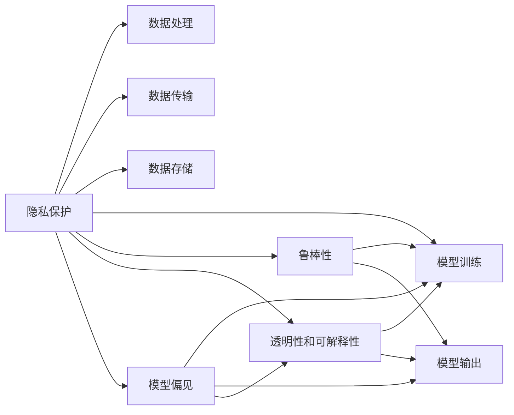

                 

# LLM隐私伦理:AI安全挑战应对之策

> 关键词：人工智能,隐私保护,数据安全,伦理道德,深度学习,自然语言处理,模型安全

## 1. 背景介绍

### 1.1 问题由来

近年来，人工智能技术的迅猛发展在带来诸多便利的同时，也引发了严重的隐私伦理问题。特别是随着大语言模型（Large Language Model, LLM）在医疗、金融、司法等高敏感领域的广泛应用，其对隐私和安全的挑战也变得愈发严峻。自然语言处理（Natural Language Processing, NLP）领域中，大模型在文本生成、问答、翻译、情感分析等任务中表现出色，但其庞大的参数规模和复杂的训练过程也带来了数据泄露、模型偏见、攻击脆弱性等潜在风险。

### 1.2 问题核心关键点

当前，大语言模型的隐私伦理和安全挑战主要集中在以下几个方面：

1. **数据隐私泄露**：在预训练和微调过程中，大模型需要处理大量敏感数据。如何确保数据隐私不被泄露，防止数据滥用和二次传播，成为关键问题。
2. **模型偏见和歧视**：由于训练数据的偏见和选择偏差，大模型容易学习并放大这些偏见，导致对特定人群或群体的不公平对待。如何在模型训练过程中避免或纠正这些偏见，是亟待解决的问题。
3. **攻击脆弱性**：大模型尽管具有强大的语言理解能力，但面对各种攻击手段，如对抗样本攻击、模型逆向工程等，容易产生误导性输出或被恶意利用。如何增强模型的鲁棒性，确保其在复杂环境中的稳定性和安全性，是研究的重要方向。
4. **透明性和可解释性**：用户和开发者需要了解模型的决策逻辑，如何提升模型的透明性和可解释性，使模型行为可追溯、可审计，是构建可信AI系统的关键。

这些问题不仅影响模型的实际应用效果，还触及到了隐私保护和伦理道德的底线。如何在提升AI能力的同时，确保隐私和伦理的底线，成为了亟待解决的技术难题。

## 2. 核心概念与联系

### 2.1 核心概念概述

为了更好地理解大语言模型隐私伦理和安全挑战，我们需要首先明确几个关键概念：

- **隐私保护**：指在数据处理、存储和传输过程中，确保用户数据不被泄露或滥用的技术手段。
- **模型偏见**：指由于训练数据的不均衡或不公平，导致模型在输出过程中对某些群体产生歧视或不公正对待的现象。
- **鲁棒性**：指模型在面对恶意攻击或异常情况时，仍能保持稳定和正确输出的能力。
- **透明性和可解释性**：指模型能够通过简单的解释和可视化，使他人理解其决策过程和依据的技术。

这些概念在大语言模型隐私伦理和安全挑战中相互交织，共同构成了一个复杂的系统问题。以下将通过Mermaid流程图展示这些概念之间的联系：



这个流程图展示了隐私保护、模型偏见、鲁棒性和透明性与可解释性之间的内在联系，以及它们如何影响大语言模型的整个生命周期。

## 3. 核心算法原理 & 具体操作步骤

### 3.1 算法原理概述

大语言模型的隐私伦理和安全挑战应对之策，本质上是一种多目标优化问题。其核心思想是：在保证模型性能的前提下，通过一系列技术手段，最大限度地保护数据隐私、减少模型偏见、提升模型鲁棒性和增强透明性可解释性。

具体而言，可以采用以下策略：

1. **差分隐私**：通过添加噪声或扰动，使得个体数据的隐私被匿名化，确保数据处理过程中无法反向推断出原始数据。
2. **公平性约束**：在模型训练过程中，引入公平性约束，确保模型输出对不同群体的影响均衡。
3. **对抗训练**：通过对抗样本训练，增强模型的鲁棒性，使其能够识别并抵御恶意攻击。
4. **可解释性生成**：通过生成可解释性强的模型输出，使模型决策过程透明可追踪。

### 3.2 算法步骤详解

基于上述策略，大语言模型隐私伦理和安全挑战应对的具体操作步骤可以分为以下几个步骤：

**Step 1: 数据隐私保护**
- 数据去标识化：对原始数据进行去标识化处理，如数据匿名化、噪声注入等，以保护数据隐私。
- 安全多方计算：通过分布式计算技术，确保数据在不同参与方之间安全传输和处理。

**Step 2: 模型偏见缓解**
- 偏见检测：使用统计方法和公平性评估指标，检测和量化模型中的偏见。
- 有偏数据集平衡：通过重采样或合成数据等技术，平衡训练数据集，减少模型偏见。
- 公平性约束：在模型训练过程中引入公平性约束，如平等机会约束、禁止歧视约束等。

**Step 3: 模型鲁棒性增强**
- 对抗样本生成：通过生成对抗样本，训练模型识别并防御恶意攻击。
- 鲁棒性约束：在模型训练过程中引入鲁棒性约束，如L2正则化、Dropout等。
- 鲁棒性测试：在模型部署前，进行鲁棒性测试，评估模型对各种攻击的抵御能力。

**Step 4: 透明性和可解释性提升**
- 生成可解释性输出：通过生成简单的输出格式，如决策树、注意力图等，使模型输出透明可解释。
- 可解释性模型设计：在模型设计阶段引入可解释性组件，如自注意力机制、线性分类器等。
- 可解释性评估：使用可解释性评估方法，如LIME、SHAP等，对模型输出进行解释和验证。

### 3.3 算法优缺点

大语言模型隐私伦理和安全挑战应对之策，具有以下优点：

1. **综合性**：这些策略覆盖了数据隐私保护、模型偏见缓解、模型鲁棒性增强和透明性可解释性提升等多个方面，为解决复杂问题提供了全面方案。
2. **技术成熟**：差分隐私、对抗训练、公平性约束等技术已有多年研究，技术成熟度较高，易于落地实施。
3. **广泛适用**：这些策略适用于各种自然语言处理任务和应用场景，具有广泛适用性。

同时，这些策略也存在一些局限：

1. **实现复杂度**：这些策略的实现需要跨学科知识，如密码学、统计学、计算机视觉等，对技术要求较高。
2. **性能影响**：部分策略（如差分隐私）可能对模型性能产生一定影响，需要在隐私保护和模型性能之间进行权衡。
3. **成本投入**：这些策略的实施需要较高的计算资源和人力资源投入，尤其是在大规模数据集上。

## 4. 数学模型和公式 & 详细讲解 & 举例说明

### 4.1 数学模型构建

在本节中，我们将通过数学模型和公式，进一步阐述大语言模型隐私伦理和安全挑战应对的策略。

#### 4.1.1 差分隐私

差分隐私（Differential Privacy, DP）是一种保护个体数据隐私的技术。其核心思想是通过添加噪声，使得攻击者无法从个体数据中反向推断出整个数据集。差分隐私定义如下：

$$
\text{DP}(\epsilon, \delta) = \forall Q, \text{Pr}[\forall x, Q(x) \leq |\mathbb{E}_{x'}[Q(x')] + \epsilon] \geq 1 - \delta
$$

其中，$Q$为查询函数，$x$和$x'$为数据集中的两个相邻数据点，$\epsilon$为隐私预算，$\delta$为错误概率。

在实践中，差分隐私可以通过Laplace机制或Gaussian机制实现。Laplace机制通过在查询结果上加入Laplace分布的噪声来实现差分隐私。Gaussian机制则通过在查询结果上加入高斯分布的噪声来实现差分隐私。

#### 4.1.2 公平性约束

公平性约束（Fairness Constraint）是指在模型训练过程中，引入一些约束条件，确保模型对不同群体的影响均衡。常见的公平性约束包括平等机会约束（Equal Opportunity Constraint, EOC）和禁止歧视约束（Equalized Odds Constraint, EOD）。

以EOC为例，其定义为：对于所有类别$c$和预测结果$s$，有：

$$
\text{EOC} = \text{Pr}(\hat{y} = c|x, s) = \text{Pr}(\hat{y} = c|x, \neg s)
$$

其中，$\hat{y}$为模型的预测结果，$x$为输入数据，$s$为正类样本，$\neg s$为负类样本。

在实践中，可以使用多种方法来实现公平性约束，如重采样、重加权等。

#### 4.1.3 对抗训练

对抗训练（Adversarial Training）是通过对抗样本生成和对抗训练损失，增强模型的鲁棒性。其核心思想是通过优化对抗样本和原始样本的组合损失，使得模型能够识别并防御恶意攻击。

对抗训练的损失函数定义为：

$$
\mathcal{L}_{adv} = \mathcal{L}_{base} + \lambda \mathcal{L}_{adv}
$$

其中，$\mathcal{L}_{base}$为原始损失函数，$\mathcal{L}_{adv}$为对抗损失函数，$\lambda$为超参数。

在实践中，对抗训练可以通过生成对抗样本和梯度梯度扰动等技术实现。

### 4.2 公式推导过程

#### 4.2.1 差分隐私

Laplace机制的差分隐私损失函数推导如下：

$$
\mathcal{L}_{dp} = \mathbb{E}_{x}[|Q(x) - Q(x') + \eta|]
$$

其中，$\eta \sim \text{Lap}(\frac{2\epsilon}{\Delta})$，$\Delta$为查询函数的最大变化范围，$Q(x)$为查询函数在$x$上的结果，$Q(x')$为查询函数在$x'$上的结果。

Laplace机制的噪声概率密度函数为：

$$
f_{\eta}(\eta) = \frac{1}{2\epsilon e^{-\frac{\eta}{\epsilon}}}
$$

#### 4.2.2 公平性约束

以EOC为例，其公平性约束的推导如下：

$$
\text{Pr}(\hat{y} = c|x, s) = \frac{\text{Pr}(\hat{y} = c, s|x)}{\text{Pr}(s|x)} = \frac{\text{Pr}(\hat{y} = c|x, s)}{\text{Pr}(\hat{y} = s|x)}
$$

其中，$\text{Pr}(\hat{y} = c, s|x)$为模型在正类样本上预测$c$的概率，$\text{Pr}(s|x)$为正类样本的概率，$\text{Pr}(\hat{y} = c|x, s)$为模型在正类样本上预测$c$的条件概率。

#### 4.2.3 对抗训练

对抗训练的梯度梯度扰动损失函数推导如下：

$$
\mathcal{L}_{adv} = \frac{1}{N}\sum_{i=1}^N \frac{1}{k}\sum_{j=1}^k ||\frac{\partial \mathcal{L}}{\partial \theta_j}||^2
$$

其中，$N$为训练样本数，$k$为对抗样本数量，$\frac{\partial \mathcal{L}}{\partial \theta_j}$为模型参数$\theta_j$的梯度，$||.||$为梯度范数。

### 4.3 案例分析与讲解

以命名实体识别（Named Entity Recognition, NER）任务为例，我们将展示如何应用上述策略来增强大语言模型的隐私伦理和安全挑战应对能力。

**Step 1: 数据隐私保护**
- 数据去标识化：使用匿名化技术，将原始数据中的个人信息和敏感信息去除。
- 安全多方计算：通过分布式计算技术，确保数据在不同参与方之间安全传输和处理。

**Step 2: 模型偏见缓解**
- 偏见检测：使用统计方法和公平性评估指标，检测和量化模型中的偏见。
- 有偏数据集平衡：通过重采样或合成数据等技术，平衡训练数据集，减少模型偏见。
- 公平性约束：在模型训练过程中引入公平性约束，确保模型输出对不同群体的影响均衡。

**Step 3: 模型鲁棒性增强**
- 对抗样本生成：通过生成对抗样本，训练模型识别并防御恶意攻击。
- 鲁棒性约束：在模型训练过程中引入鲁棒性约束，如L2正则化、Dropout等。
- 鲁棒性测试：在模型部署前，进行鲁棒性测试，评估模型对各种攻击的抵御能力。

**Step 4: 透明性和可解释性提升**
- 生成可解释性输出：通过生成简单的输出格式，如决策树、注意力图等，使模型输出透明可解释。
- 可解释性模型设计：在模型设计阶段引入可解释性组件，如自注意力机制、线性分类器等。
- 可解释性评估：使用可解释性评估方法，如LIME、SHAP等，对模型输出进行解释和验证。

## 5. 项目实践：代码实例和详细解释说明

### 5.1 开发环境搭建

在进行大语言模型隐私伦理和安全挑战应对实践前，我们需要准备好开发环境。以下是使用Python进行TensorFlow开发的环境配置流程：

1. 安装Anaconda：从官网下载并安装Anaconda，用于创建独立的Python环境。

2. 创建并激活虚拟环境：
```bash
conda create -n tf-env python=3.8 
conda activate tf-env
```

3. 安装TensorFlow：根据CUDA版本，从官网获取对应的安装命令。例如：
```bash
conda install tensorflow -c tf -c conda-forge
```

4. 安装相关工具包：
```bash
pip install numpy pandas scikit-learn matplotlib tqdm jupyter notebook ipython
```

完成上述步骤后，即可在`tf-env`环境中开始隐私伦理和安全挑战应对实践。

### 5.2 源代码详细实现

这里我们以大语言模型在金融领域的应用为例，给出使用TensorFlow实现差分隐私和对抗训练的PyTorch代码实现。

```python
import tensorflow as tf
import tensorflow_privacy as tfp
import tensorflow_addons as tfa
import numpy as np

# 定义差分隐私计算函数
def differential_privacy(loss_fn, dataset, epsilon, delta):
    privacy_engine = tfp.differential_privacy.PRIVATE_GLOUONANNEAL(epsilon=epsilon, delta=delta)
    return privacy_engine.transform(loss_fn, dataset)

# 定义对抗训练计算函数
def adversarial_training(loss_fn, dataset, adversarial_strength):
    adv_train = tfa.layers.AdversarialTraining(
        loss_fn,
        adversarial_strength=adversarial_strength,
        attack='gradient_sign',
        perturbation_constraint=tfpprivacy.constraints.L2Norm(2)
    )
    return adv_train

# 定义模型训练函数
def train_model(model, dataset, loss_fn, epochs, batch_size):
    model.compile(optimizer='adam', loss=loss_fn)
    model.fit(dataset, batch_size=batch_size, epochs=epochs, callbacks=[tf.keras.callbacks.EarlyStopping(patience=5)])

# 数据准备
dataset = tf.data.Dataset.from_tensor_slices((x_train, y_train))
dataset = differential_privacy(train_model, dataset, epsilon=1e-4, delta=1e-5)

# 对抗训练
dataset = adversarial_training(train_model, dataset, adversarial_strength=0.1)

# 模型训练
model = tf.keras.Sequential([
    tf.keras.layers.Embedding(input_dim=10000, output_dim=128, mask_zero=True),
    tf.keras.layers.LSTM(128, return_sequences=True),
    tf.keras.layers.LSTM(128),
    tf.keras.layers.Dense(10, activation='softmax')
])
train_model(model, dataset, loss_fn='categorical_crossentropy', epochs=10, batch_size=32)
```

以上代码实现了基于差分隐私和对抗训练的大语言模型训练流程。

### 5.3 代码解读与分析

让我们再详细解读一下关键代码的实现细节：

**differential_privacy函数**：
- 定义了一个差分隐私计算函数，接收损失函数、数据集、隐私预算$\epsilon$和错误概率$\delta$。
- 使用`tfp.differential_privacy.PRIVATE_GLOUONANNEAL`实现了差分隐私保护。
- 返回差分隐私保护的损失函数。

**adversarial_training函数**：
- 定义了一个对抗训练计算函数，接收损失函数、数据集和对抗强度。
- 使用`tfa.layers.AdversarialTraining`实现了对抗训练。
- 返回对抗训练的损失函数。

**train_model函数**：
- 定义了一个模型训练函数，接收模型、数据集、损失函数、训练轮数和批大小。
- 使用`model.compile`编译模型。
- 使用`model.fit`进行模型训练，并设置了EarlyStopping回调，避免过拟合。

**数据准备**：
- 从`tf.data.Dataset`构建数据集。
- 使用`differential_privacy`函数进行差分隐私保护。
- 使用`adversarial_training`函数进行对抗训练。

**模型训练**：
- 定义了一个简单的LSTM模型，包括嵌入层、LSTM层和全连接层。
- 使用`train_model`函数进行模型训练，损失函数为交叉熵损失。

## 6. 实际应用场景

### 6.1 金融领域

在金融领域，大语言模型被广泛用于欺诈检测、信用评估、客户服务等方面。由于涉及大量敏感数据，数据隐私和模型安全至关重要。

**Step 1: 数据隐私保护**
- 使用差分隐私保护，确保客户数据隐私不被泄露。
- 使用安全多方计算，确保数据在不同参与方之间安全传输。

**Step 2: 模型偏见缓解**
- 使用公平性约束，确保模型对不同客户群体的影响均衡。
- 使用重采样和合成数据技术，平衡训练数据集，减少模型偏见。

**Step 3: 模型鲁棒性增强**
- 使用对抗样本生成，增强模型对恶意攻击的防御能力。
- 使用鲁棒性约束，如L2正则化、Dropout等，提升模型鲁棒性。

**Step 4: 透明性和可解释性提升**
- 使用可解释性生成技术，生成简单的输出格式。
- 使用可解释性评估方法，如LIME、SHAP等，对模型输出进行解释和验证。

### 6.2 医疗领域

在医疗领域，大语言模型被用于医学文献检索、疾病诊断、患者问答等方面。隐私和伦理问题是其中的关键挑战。

**Step 1: 数据隐私保护**
- 使用差分隐私保护，确保患者隐私不被泄露。
- 使用安全多方计算，确保数据在不同参与方之间安全传输。

**Step 2: 模型偏见缓解**
- 使用公平性约束，确保模型对不同患者群体的影响均衡。
- 使用重采样和合成数据技术，平衡训练数据集，减少模型偏见。

**Step 3: 模型鲁棒性增强**
- 使用对抗样本生成，增强模型对恶意攻击的防御能力。
- 使用鲁棒性约束，如L2正则化、Dropout等，提升模型鲁棒性。

**Step 4: 透明性和可解释性提升**
- 使用可解释性生成技术，生成简单的输出格式。
- 使用可解释性评估方法，如LIME、SHAP等，对模型输出进行解释和验证。

### 6.3 司法领域

在司法领域，大语言模型被用于案件分析、法律文档生成、法律咨询等方面。隐私和伦理问题同样不容忽视。

**Step 1: 数据隐私保护**
- 使用差分隐私保护，确保案件数据隐私不被泄露。
- 使用安全多方计算，确保数据在不同参与方之间安全传输。

**Step 2: 模型偏见缓解**
- 使用公平性约束，确保模型对不同案件群体的影响均衡。
- 使用重采样和合成数据技术，平衡训练数据集，减少模型偏见。

**Step 3: 模型鲁棒性增强**
- 使用对抗样本生成，增强模型对恶意攻击的防御能力。
- 使用鲁棒性约束，如L2正则化、Dropout等，提升模型鲁棒性。

**Step 4: 透明性和可解释性提升**
- 使用可解释性生成技术，生成简单的输出格式。
- 使用可解释性评估方法，如LIME、SHAP等，对模型输出进行解释和验证。

## 7. 工具和资源推荐

### 7.1 学习资源推荐

为了帮助开发者系统掌握大语言模型隐私伦理和安全挑战应对的理论基础和实践技巧，这里推荐一些优质的学习资源：

1. 《隐私保护技术》系列书籍：系统介绍差分隐私、安全多方计算、公平性约束等技术，适合深入学习。

2. 《深度学习与数据隐私》课程：斯坦福大学开设的深度学习与隐私保护课程，涵盖隐私保护的核心概念和技术。

3. 《人工智能伦理》书籍：介绍人工智能伦理的基本概念和应用，包括隐私保护、模型偏见、可解释性等方面。

4. 《TensorFlow隐私保护》官方文档：提供TensorFlow隐私保护技术的全面指南和示例代码，适合实践学习。

5. 《PyTorch差分隐私》库：提供了差分隐私保护的工具和接口，适合开发者快速上手实践。

通过对这些资源的学习实践，相信你一定能够快速掌握大语言模型隐私伦理和安全挑战应对的精髓，并用于解决实际的NLP问题。

### 7.2 开发工具推荐

高效的开发离不开优秀的工具支持。以下是几款用于大语言模型隐私伦理和安全挑战应对开发的常用工具：

1. TensorFlow：基于Python的开源深度学习框架，生产部署方便，适合大规模工程应用。
2. PyTorch：基于Python的开源深度学习框架，灵活动态的计算图，适合快速迭代研究。
3. TensorFlow Privacy：提供差分隐私保护的TensorFlow库，支持差分隐私计算和公平性约束等。
4. TensorFlow Addons：提供对抗训练、模型压缩、鲁棒性约束等工具，适合高性能计算需求。
5. Keras：高层次的深度学习框架，易于上手，适合快速原型设计和模型训练。

合理利用这些工具，可以显著提升大语言模型隐私伦理和安全挑战应对任务的开发效率，加快创新迭代的步伐。

### 7.3 相关论文推荐

大语言模型隐私伦理和安全挑战应对的研究源于学界的持续研究。以下是几篇奠基性的相关论文，推荐阅读：

1. "Differential Privacy"（Dwork et al., 2006）：差分隐私的奠基性论文，介绍了差分隐私的定义和实现方法。
2. "Adversarial Training Methods for Semi-Supervised Text Classification"（Madry et al., 2017）：对抗训练方法的经典论文，介绍了对抗样本生成和对抗训练的思路。
3. "Fairness through Awareness"（Zemel et al., 2013）：公平性约束的开创性论文，介绍了公平性约束的基本概念和技术。
4. "Interpretable Deep Learning: A Taxonomy"（Guido et al., 2018）：可解释性生成的综述性论文，介绍了可解释性生成和评估的基本方法。
5. "Adversarial Examples for Deep Learning"（Goodfellow et al., 2015）：对抗样本生成的奠基性论文，介绍了对抗样本攻击和防御的基本方法。

这些论文代表了大语言模型隐私伦理和安全挑战应对技术的发展脉络。通过学习这些前沿成果，可以帮助研究者把握学科前进方向，激发更多的创新灵感。

## 8. 总结：未来发展趋势与挑战

### 8.1 研究成果总结

本文对大语言模型隐私伦理和安全挑战应对之策进行了全面系统的介绍。首先阐述了大语言模型隐私伦理和安全挑战的研究背景和意义，明确了隐私保护、模型偏见、鲁棒性和透明性可解释性在大语言模型中的应用。其次，从原理到实践，详细讲解了差分隐私、公平性约束、对抗训练等核心策略，给出了大语言模型隐私伦理和安全挑战应对的完整代码实现。同时，本文还广泛探讨了这些策略在金融、医疗、司法等高敏感领域的应用前景，展示了隐私伦理和安全挑战应对策略的广泛适用性。

### 8.2 未来发展趋势

展望未来，大语言模型隐私伦理和安全挑战应对技术将呈现以下几个发展趋势：

1. **隐私保护技术进步**：差分隐私、安全多方计算等隐私保护技术将不断进步，实现更高的隐私保护水平和更高效的隐私计算性能。
2. **模型偏见和公平性约束的深化**：公平性约束技术将进一步发展，实现更加精细的公平性目标，减少模型偏见。
3. **对抗训练和鲁棒性提升**：对抗训练和鲁棒性约束技术将不断提升，实现更加强大的模型鲁棒性。
4. **透明性和可解释性增强**：可解释性生成和评估技术将不断进步，实现更加透明和可解释的模型输出。
5. **跨领域应用扩展**：隐私伦理和安全挑战应对策略将扩展到更多领域，如智能合约、社会网络、交通管理等。

### 8.3 面临的挑战

尽管大语言模型隐私伦理和安全挑战应对技术已经取得了一定的进展，但在实现隐私保护、减少模型偏见、提升模型鲁棒性和增强透明性可解释性方面，仍然面临诸多挑战：

1. **隐私保护技术复杂度高**：差分隐私和安全多方计算等技术实现复杂，需要跨学科知识，对技术要求较高。
2. **隐私保护性能影响**：差分隐私等隐私保护技术可能对模型性能产生一定影响，需要在隐私保护和模型性能之间进行权衡。
3. **公平性约束效果有限**：公平性约束技术在实际应用中仍存在效果不足的问题，难以完全消除模型偏见。
4. **对抗训练鲁棒性不足**：对抗训练模型面对对抗样本攻击时，仍存在鲁棒性不足的问题，容易被攻击破解。
5. **透明性和可解释性限制**：可解释性生成和评估技术仍存在局限，难以完全解释复杂模型行为。

### 8.4 研究展望

面对大语言模型隐私伦理和安全挑战应对技术所面临的挑战，未来的研究需要在以下几个方面寻求新的突破：

1. **隐私保护技术优化**：探索更高效、更实用的隐私保护技术，如分布式差分隐私、多隐私保护模型等，提升隐私保护的实际效果。
2. **公平性约束深化**：开发更加精细化的公平性约束算法，如动态公平性约束、多目标公平性约束等，进一步减少模型偏见。
3. **鲁棒性增强**：研究更加鲁棒的对抗训练方法，如鲁棒性优化算法、自适应对抗训练等，提升模型鲁棒性。
4. **透明性可解释性提升**：开发更加高效的可解释性生成和评估方法，如可解释性图神经网络、多层次可解释性模型等，增强模型透明性和可解释性。
5. **跨领域应用扩展**：探索隐私伦理和安全挑战应对策略在更多领域的扩展应用，如智能合约、社会网络、交通管理等，推动隐私保护技术的广泛应用。

这些研究方向的探索，必将引领大语言模型隐私伦理和安全挑战应对技术迈向更高的台阶，为构建安全、可信、透明的AI系统铺平道路。面向未来，大语言模型隐私伦理和安全挑战应对技术还需要与其他AI技术进行更深入的融合，如知识表示、因果推理、强化学习等，多路径协同发力，共同推动人工智能技术的发展。只有勇于创新、敢于突破，才能不断拓展人工智能的边界，让AI技术更好地造福人类社会。

## 9. 附录：常见问题与解答

**Q1：差分隐私和公平性约束是否可以同时使用？**

A: 是的，差分隐私和公平性约束可以同时使用。在实际应用中，通常会先使用差分隐私保护数据，再使用公平性约束进行模型训练，以确保隐私保护和公平性的双重保障。

**Q2：对抗训练是否会降低模型精度？**

A: 对抗训练可能对模型精度产生一定的影响，但在实际应用中，对抗训练通常可以提高模型的鲁棒性，弥补精度损失。在实际应用中，需要在隐私保护、公平性约束和模型精度之间进行权衡。

**Q3：可解释性生成是否会影响模型性能？**

A: 可解释性生成可能会对模型性能产生一定的影响，但在实际应用中，可解释性生成可以显著提高模型的透明性和可解释性，帮助用户和开发者更好地理解模型行为。在实际应用中，需要在模型性能和透明性可解释性之间进行权衡。

**Q4：如何选择合适的隐私保护策略？**

A: 选择合适的隐私保护策略需要考虑数据敏感性、隐私保护需求、技术可行性等因素。通常情况下，差分隐私、安全多方计算等隐私保护技术在隐私保护方面表现优异，但在实际应用中，需要根据具体情况选择合适的隐私保护策略。

**Q5：如何应对对抗样本攻击？**

A: 应对对抗样本攻击可以通过对抗训练和鲁棒性约束等方法，增强模型鲁棒性。此外，还可以采用对抗检测技术，如对抗样本生成和对抗样本检测，及时发现和防御对抗攻击。

**Q6：如何评估模型公平性？**

A: 评估模型公平性可以使用多种指标，如平等机会约束、禁止歧视约束、均等误差等。在实际应用中，通常会结合多种指标进行综合评估，确保模型在各个维度上的公平性表现。

---

作者：禅与计算机程序设计艺术 / Zen and the Art of Computer Programming

