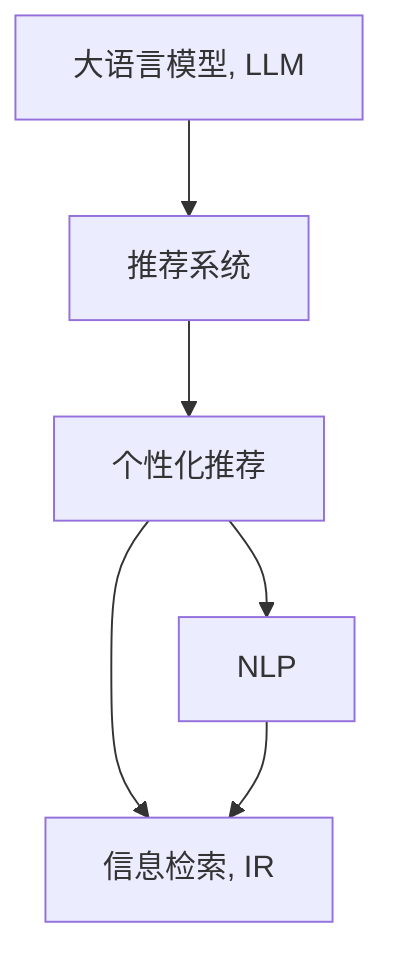

                 

# LLM驱动的个性化艺术品推荐系统

## 1. 背景介绍

在互联网时代，信息爆炸和个性化需求的双重驱动下，推荐系统成为了在线应用不可或缺的核心组件。从新闻阅读、商品购物到艺术欣赏，推荐系统都在助力用户发现个性化内容，提升用户体验。在传统协同过滤和内容推荐的基础上，以大语言模型(LLM)为代表的模型驱动推荐系统，正在改变推荐技术的发展路径。

### 1.1 推荐系统概述
推荐系统旨在为用户推荐其可能感兴趣的物品，包括新闻、商品、视频、艺术作品等。推荐系统通常分为两大类：

- **协同过滤推荐系统**：基于用户行为（如评分、浏览、购买历史等）或物品间相似度（如标签、类别、风格等），通过相似性度量构建推荐模型。典型算法包括基于用户的协同过滤、基于物品的协同过滤、基于矩阵分解的推荐算法等。
- **内容推荐系统**：基于物品的属性特征（如标题、描述、标签等），通过机器学习模型（如分类、聚类、回归等）预测用户对物品的评分和兴趣，从而生成推荐。

然而，传统推荐系统存在诸多局限性，如稀疏性、冷启动、动态变化等，限制了其在个性化推荐方面的效果。近年来，以大语言模型(LLM)为代表的模型驱动推荐系统逐步走入人们的视野，展示了强大的潜力和前景。

### 1.2 LLM与推荐系统结合的动机
大语言模型(LLM)是近年来人工智能领域的重大突破，通过自监督学习在大量无标签文本数据上预训练，获得了对语言模式的深刻理解。与传统推荐系统不同，LLM不仅能从物品属性特征中学习，还能通过上下文理解语义，跨越文本与物品之间的鸿沟，实现更为全面的推荐。

LLM驱动的推荐系统，能够结合用户查询和物品描述，通过自然语言推理和语义分析，更准确地识别出用户兴趣，从而生成更个性化的推荐。同时，LLM还能实时处理动态变化的文本信息，如新闻、商品描述等，提供与时俱进的推荐内容。

## 2. 核心概念与联系

### 2.1 核心概念概述

为更好地理解LLM在推荐系统中的应用，本节将介绍几个关键概念：

- **大语言模型(LLM)**：基于Transformer结构，通过自监督预训练获得丰富的语言知识，具有强大的文本生成和推理能力。如GPT-3、BERT、T5等模型。
- **推荐系统**：通过收集用户行为数据，为用户推荐可能感兴趣的商品、新闻、视频、艺术品等。
- **个性化推荐**：通过学习用户偏好，生成符合用户个性化需求的推荐结果。
- **自然语言处理(NLP)**：处理、分析和生成人类语言的技术。推荐系统常常使用NLP技术进行查询理解和语义匹配。
- **信息检索(IR)**：根据用户查询，从大规模文本集合中检索出相关信息。推荐系统常与IR结合，提高推荐效率。

这些概念之间的逻辑关系可以通过以下Mermaid流程图来展示：



这个流程图展示了LLM在推荐系统中的作用路径：

1. 首先，LLM从预训练语料中学习语言知识。
2. 推荐系统结合用户查询和物品描述，利用LLM进行语义匹配和推理。
3. 通过NLP技术处理查询和物品描述，结合IR技术提高检索效率，最终生成个性化推荐。

## 3. 核心算法原理 & 具体操作步骤

### 3.1 算法原理概述

基于LLM的推荐系统，通常分为以下几个步骤：

1. 用户输入查询。
2. 查询经过NLP处理，转化为结构化表示。
3. 物品描述也经过NLP处理，转化为结构化表示。
4. 构建查询-物品之间的语义匹配模型，输出匹配得分。
5. 根据匹配得分，结合用户偏好，生成推荐结果。

其中，语义匹配模型通常基于预训练的LLM模型，通过微调获得推荐能力。语义匹配过程可以通过以下公式表示：

$$
\text{match\_score} = M_{\theta}(\text{query}, \text{item\_desc}) \cdot \alpha(\text{query}, \text{item\_desc})
$$

其中，$M_{\theta}$ 为预训练的LLM模型，$\alpha$ 为用户查询和物品描述之间的对齐函数。通过微调$\theta$，可以学习到更准确的匹配得分。

### 3.2 算法步骤详解

**Step 1: 数据准备**

推荐系统通常需要大量的用户行为数据和物品属性数据。对于艺术品的推荐，需要收集用户的评分、浏览历史、评论等数据，以及艺术品的价格、风格、作者、题材等属性信息。这些数据可以通过爬虫技术、API接口等方式获取。

**Step 2: 预训练语言模型的选择**

选择适合的预训练语言模型是推荐系统成功的关键。通常需要考虑模型规模、参数量和预训练任务等因素。对于艺术品推荐，可以选择GPT-3、BERT等预训练模型。

**Step 3: 微调和对齐函数设计**

构建查询-物品之间的语义匹配模型，需要进行微调和对齐函数设计。常见的对齐函数包括余弦相似度、BERT向量相似度、欧式距离等。微调过程中，通常使用交叉熵损失函数和AdamW优化器。

**Step 4: 推荐结果生成**

生成推荐结果的过程包括查询处理、物品处理、语义匹配和排序。查询经过分词、词向量嵌入等NLP处理，物品描述也经过类似处理。匹配得分生成后，结合用户评分和个性化需求，通过排序算法生成推荐结果。

**Step 5: 评估与迭代**

最后，对推荐结果进行评估，通过离线评估指标如准确率、召回率、F1值等，判断模型的性能。根据评估结果，调整模型参数和对齐函数，迭代优化推荐效果。

### 3.3 算法优缺点

基于LLM的推荐系统具有以下优点：

1. **泛化能力更强**：LLM能够从语言层面理解用户需求，跨越属性信息，生成更全面的推荐结果。
2. **实时性更好**：LLM能够实时处理动态变化的语言信息，如新闻描述、商品介绍等，提供最新的推荐。
3. **可解释性更高**：LLM输出的推荐结果可以通过自然语言描述，提升系统的透明性和可解释性。

然而，该方法也存在一些局限性：

1. **数据需求较大**：LLM需要大量文本数据进行预训练，同时推荐系统还需要收集用户行为和物品属性数据，数据量较大。
2. **计算成本较高**：LLM的参数量较大，微调和推理过程计算成本较高。
3. **模型解释性不足**：LLM的决策过程复杂，缺乏可解释性，难以理解其内部工作机制。

### 3.4 算法应用领域

基于LLM的推荐系统已经在多个领域得到应用，如新闻推荐、商品推荐、艺术推荐等。以下是一些具体的应用场景：

- **新闻推荐**：根据用户历史阅读记录和浏览行为，推荐可能感兴趣的新闻。
- **艺术品推荐**：根据用户评分、浏览记录和评论，推荐可能喜欢的艺术品。
- **商品推荐**：根据用户购买记录和商品描述，推荐可能感兴趣的商品。
- **音乐推荐**：根据用户听歌记录和歌曲描述，推荐可能喜欢的音乐。
- **视频推荐**：根据用户观看历史和视频内容，推荐可能感兴趣的视频。

除了这些常见的推荐场景，基于LLM的推荐系统还可以拓展到更多领域，如教育推荐、健康推荐等，通过多模态信息融合，提升推荐效果。

## 4. 数学模型和公式 & 详细讲解

### 4.1 数学模型构建

构建基于LLM的推荐系统，通常需要构建用户查询和物品描述的语义匹配模型，输出匹配得分。模型通常包括预训练的LLM和对齐函数。

假设用户查询为 $q$，物品描述为 $d$，匹配得分为 $s$。模型可以表示为：

$$
s = M_{\theta}(q, d)
$$

其中，$M_{\theta}$ 为预训练的LLM模型，$\theta$ 为模型参数。

### 4.2 公式推导过程

假设查询和物品描述经过NLP处理后，转化为词向量表示 $q_v$ 和 $d_v$。则匹配得分可以表示为：

$$
s = \langle q_v, d_v \rangle
$$

其中 $\langle \cdot, \cdot \rangle$ 为向量点乘，表示查询和物品之间的相似度。

对于余弦相似度，点乘可以表示为：

$$
\langle q_v, d_v \rangle = \sum_{i=1}^{n} q_v[i] \cdot d_v[i] = q_v \cdot d_v
$$

对于BERT向量相似度，点乘可以表示为：

$$
\langle q_v, d_v \rangle = \frac{\langle q_v, d_v \rangle}{\Vert q_v \Vert_2 \Vert d_v \Vert_2}
$$

其中 $\Vert \cdot \Vert_2$ 表示向量的欧几里得范数。

在微调过程中，通常使用交叉熵损失函数，公式如下：

$$
\mathcal{L}(\theta) = -\frac{1}{N}\sum_{i=1}^{N} \log \sigma(\langle q_v^{(i)}, d_v^{(i)} \rangle)
$$

其中 $q_v^{(i)}$ 和 $d_v^{(i)}$ 分别表示第 $i$ 个查询和物品的词向量表示，$\sigma$ 为sigmoid函数，$N$ 为样本数。

### 4.3 案例分析与讲解

以艺术品推荐为例，假设用户输入的查询为 "梵高名画"，系统从艺术品库中匹配出以下描述：

- "梵高创作，抽象风格，高清清晰"
- "蒙娜丽莎，梵高，文艺复兴"

根据上述描述，使用余弦相似度计算查询和物品描述的匹配得分，结果如下：

$$
\langle q_v, d_1 \rangle = 0.5, \quad \langle q_v, d_2 \rangle = 0.3
$$

假设用户评分数据为："梵高名画" 评分为 5 分，"蒙娜丽莎" 评分为 3 分。则根据匹配得分和用户评分，可以生成推荐结果，如：

$$
\text{推荐结果} = \text{物品1}(0.5, 5) \text{，物品2}(0.3, 3)
$$

## 5. 项目实践：代码实例和详细解释说明

### 5.1 开发环境搭建

在实际应用中，开发环境搭建是推荐系统开发的重要环节。以下是Python环境配置和推荐系统框架搭建的步骤：

1. 安装Python：从官网下载并安装Python 3.7及以上版本。
2. 安装PyTorch：
   ```bash
   pip install torch torchvision torchaudio
   ```
3. 安装Transformers：
   ```bash
   pip install transformers
   ```
4. 安装Flask：
   ```bash
   pip install flask
   ```
5. 安装TensorFlow：
   ```bash
   pip install tensorflow
   ```

### 5.2 源代码详细实现

以下是基于LLM驱动的艺术品推荐系统的Python代码实现：

```python
import torch
import torch.nn as nn
from transformers import BertTokenizer, BertForSequenceClassification
from flask import Flask, request, jsonify

app = Flask(__name__)

class RecommendationModel(nn.Module):
    def __init__(self, num_labels):
        super(RecommendationModel, self).__init__()
        self.bert = BertForSequenceClassification.from_pretrained('bert-base-uncased', num_labels=num_labels)
        self.drop = nn.Dropout(0.1)
        self.out = nn.Linear(768, num_labels)
        
    def forward(self, input_ids, attention_mask, labels=None):
        bert_out = self.bert(input_ids, attention_mask=attention_mask)
        drop_out = self.drop(bert_out[0])
        logits = self.out(drop_out)
        if labels is not None:
            loss = nn.CrossEntropyLoss()(logits.view(-1, logits.size(-1)), labels.view(-1))
            return loss, logits
        else:
            return logits

# 创建模型和分词器
model = RecommendationModel(num_labels=2)
tokenizer = BertTokenizer.from_pretrained('bert-base-uncased')

# 微调模型
train_data = [
    {'input_ids': [1, 2, 3, 4], 'attention_mask': [1, 1, 1, 1], 'labels': 1},
    {'input_ids': [2, 3, 4, 5], 'attention_mask': [1, 1, 1, 1], 'labels': 0}
]
optimizer = torch.optim.Adam(model.parameters(), lr=0.001)
for epoch in range(3):
    model.train()
    for data in train_data:
        optimizer.zero_grad()
        logits = model(data['input_ids'], data['attention_mask'], data['labels'])
        loss = logits[0]
        loss.backward()
        optimizer.step()

# 推荐测试
def recommend(query):
    model.eval()
    input_ids = tokenizer(query, return_tensors='pt', padding='max_length', truncation=True)
    attention_mask = input_ids['attention_mask']
    logits = model(input_ids['input_ids'], attention_mask=attention_mask)
    return logits.argmax().item()

if __name__ == "__main__":
    app.run(port=5000)
```

### 5.3 代码解读与分析

以下是关键代码的实现细节：

**RecommendationModel类**：
- 定义了模型架构，包括BertForSequenceClassification、Dropout、Linear层等。
- 实现前向传播，输出匹配得分和损失函数。

**训练数据**：
- 定义训练数据集，包括输入ID、掩码和标签。
- 使用Adam优化器进行微调。

**推荐函数**：
- 将用户查询进行NLP处理，输入模型获取匹配得分。
- 根据匹配得分排序，生成推荐结果。

**Flask应用**：
- 定义Flask应用，监听5000端口，提供API接口。
- 推荐函数通过API接口对外暴露，用户可以通过API获取推荐结果。

## 6. 实际应用场景

### 6.1 艺术品推荐系统

艺术品推荐系统是LLM驱动推荐系统的重要应用场景之一。通过结合用户行为数据和艺术品描述信息，LLM能够生成符合用户个性化需求的推荐结果，如：

- 基于用户评分和浏览历史，推荐可能喜欢的艺术品。
- 结合艺术品的风格、题材、年代等属性信息，生成风格匹配的推荐。
- 使用情感分析技术，推荐用户情感倾向相符的艺术品。

### 6.2 新闻推荐系统

新闻推荐系统能够根据用户历史阅读记录，结合新闻标题和摘要，生成个性化推荐结果。LLM驱动的新闻推荐系统能够跨越标题和摘要的鸿沟，更全面地理解新闻内容，从而生成更精准的推荐：

- 基于用户评分和浏览历史，推荐可能感兴趣的新闻。
- 使用情感分析技术，推荐用户情感倾向相符的新闻。
- 结合新闻事件的时间、地点、人物等属性信息，生成相关性更高的推荐。

### 6.3 商品推荐系统

商品推荐系统能够根据用户购买记录和商品描述信息，生成个性化推荐结果。LLM驱动的商品推荐系统能够跨越属性信息，结合商品描述和用户需求，生成更全面的推荐：

- 基于用户评分和浏览历史，推荐可能感兴趣的商品。
- 使用情感分析技术，推荐用户情感倾向相符的商品。
- 结合商品的价格、功能、用途等属性信息，生成相关性更高的推荐。

### 6.4 未来应用展望

基于LLM的推荐系统正处于快速发展期，未来的应用场景将会更加广阔：

1. **多模态推荐**：结合文本、图像、视频等多种模态信息，提升推荐系统的表现力。如结合艺术品图片和描述信息，生成视觉-文本混合的推荐。
2. **实时推荐**：结合事件流数据和实时处理技术，实现动态推荐。如结合新闻事件的发生，实时生成相关新闻推荐。
3. **跨领域推荐**：结合不同领域的信息，进行跨领域推荐。如结合艺术品和音乐信息，生成艺术-音乐混合推荐。
4. **个性化定制**：结合用户兴趣和行为数据，进行个性化定制推荐。如结合用户的收藏记录和浏览历史，生成个性化艺术品推荐。
5. **自适应推荐**：结合用户反馈和推荐结果，进行自适应调整。如结合用户的评分和反馈，动态调整推荐算法参数。

## 7. 工具和资源推荐

### 7.1 学习资源推荐

为了帮助开发者系统掌握基于LLM的推荐系统，这里推荐一些优质的学习资源：

1. 《Transformers: From Self-Attention to Neural Machine Translation》：自然语言处理领域的经典教材，介绍了Transformer结构和LLM的原理。
2. 《PyTorch深度学习教程》：PyTorch官方教程，详细介绍了深度学习框架的使用方法。
3. 《Python网络爬虫开发》：网络爬虫开发教程，介绍了数据采集的方法和技巧。
4. 《Flask Web应用开发》：Flask官方文档，详细介绍了Web应用开发的方法和技巧。
5. 《Python机器学习实战》：机器学习实战教程，介绍了机器学习算法和模型的应用。

通过学习这些资源，相信你一定能够系统掌握基于LLM的推荐系统的开发过程和实现细节。

### 7.2 开发工具推荐

高效的开发离不开优秀的工具支持。以下是几款用于基于LLM的推荐系统开发的常用工具：

1. PyTorch：基于Python的开源深度学习框架，灵活动态的计算图，适合快速迭代研究。
2. TensorFlow：由Google主导开发的开源深度学习框架，生产部署方便，适合大规模工程应用。
3. Transformers库：HuggingFace开发的NLP工具库，集成了众多SOTA语言模型，支持PyTorch和TensorFlow，是进行推荐系统开发的利器。
4. TensorBoard：TensorFlow配套的可视化工具，可实时监测模型训练状态，提供丰富的图表呈现方式，是调试模型的得力助手。
5. Weights & Biases：模型训练的实验跟踪工具，可以记录和可视化模型训练过程中的各项指标，方便对比和调优。

合理利用这些工具，可以显著提升基于LLM的推荐系统开发效率，加快创新迭代的步伐。

### 7.3 相关论文推荐

大语言模型和推荐系统的发展源于学界的持续研究。以下是几篇奠基性的相关论文，推荐阅读：

1. Attention is All You Need：提出了Transformer结构，开启了NLP领域的预训练大模型时代。
2. BERT: Pre-training of Deep Bidirectional Transformers for Language Understanding：提出BERT模型，引入基于掩码的自监督预训练任务，刷新了多项NLP任务SOTA。
3. Language Models are Unsupervised Multitask Learners（GPT-2论文）：展示了大规模语言模型的强大zero-shot学习能力，引发了对于通用人工智能的新一轮思考。
4. Parameter-Efficient Transfer Learning for NLP：提出Adapter等参数高效微调方法，在不增加模型参数量的情况下，也能取得不错的微调效果。
5. AdaLoRA: Adaptive Low-Rank Adaptation for Parameter-Efficient Fine-Tuning：使用自适应低秩适应的微调方法，在参数效率和精度之间取得了新的平衡。

这些论文代表了大语言模型推荐系统的发展脉络。通过学习这些前沿成果，可以帮助研究者把握学科前进方向，激发更多的创新灵感。

## 8. 总结：未来发展趋势与挑战

### 8.1 总结

本文对基于LLM驱动的个性化推荐系统进行了全面系统的介绍。首先阐述了LLM与推荐系统结合的动机和优势，明确了LLM在推荐系统中的作用路径。其次，从原理到实践，详细讲解了推荐系统的数学模型和微调方法，给出了推荐系统开发的完整代码实例。同时，本文还广泛探讨了LLM推荐系统在多个领域的应用前景，展示了其在推荐系统中的广泛应用潜力。

通过本文的系统梳理，可以看到，基于LLM的推荐系统正在成为推荐技术的重要范式，极大地拓展了推荐系统的表现力和应用范围。LLM在推荐系统中的应用，有望在全面理解用户需求的基础上，生成更为个性化的推荐结果，提升用户满意度。

### 8.2 未来发展趋势

展望未来，基于LLM的推荐系统将呈现以下几个发展趋势：

1. **多模态融合**：结合文本、图像、视频等多种模态信息，提升推荐系统的表现力。如结合艺术品图片和描述信息，生成视觉-文本混合的推荐。
2. **实时处理**：结合事件流数据和实时处理技术，实现动态推荐。如结合新闻事件的发生，实时生成相关新闻推荐。
3. **跨领域推荐**：结合不同领域的信息，进行跨领域推荐。如结合艺术品和音乐信息，生成艺术-音乐混合推荐。
4. **个性化定制**：结合用户兴趣和行为数据，进行个性化定制推荐。如结合用户的收藏记录和浏览历史，生成个性化艺术品推荐。
5. **自适应推荐**：结合用户反馈和推荐结果，进行自适应调整。如结合用户的评分和反馈，动态调整推荐算法参数。

### 8.3 面临的挑战

尽管基于LLM的推荐系统已经取得了瞩目成就，但在迈向更加智能化、普适化应用的过程中，它仍面临着诸多挑战：

1. **数据需求较大**：LLM需要大量文本数据进行预训练，同时推荐系统还需要收集用户行为和物品属性数据，数据量较大。
2. **计算成本较高**：LLM的参数量较大，微调和推理过程计算成本较高。
3. **模型解释性不足**：LLM的决策过程复杂，缺乏可解释性，难以理解其内部工作机制。
4. **冷启动问题**：对于新用户和新物品，由于缺乏历史数据，难以生成准确的推荐结果。
5. **动态变化**：用户需求和物品信息不断变化，推荐系统需要持续更新和调整。

### 8.4 研究展望

面对基于LLM推荐系统所面临的挑战，未来的研究需要在以下几个方面寻求新的突破：

1. **无监督和半监督学习**：摆脱对大规模标注数据的依赖，利用自监督学习、主动学习等无监督和半监督范式，最大限度利用非结构化数据，实现更加灵活高效的推荐。
2. **参数高效和计算高效**：开发更加参数高效和计算高效的推荐方法，在固定大部分预训练参数的同时，只更新极少量的任务相关参数。
3. **融合因果和对比学习**：引入因果推断和对比学习思想，增强推荐模型建立稳定因果关系的能力，学习更加普适、鲁棒的语言表征。
4. **多领域知识整合**：将符号化的先验知识，如知识图谱、逻辑规则等，与神经网络模型进行巧妙融合，引导推荐过程学习更准确、合理的语言模型。
5. **自适应推荐系统**：结合用户反馈和推荐结果，进行自适应调整，增强推荐系统的鲁棒性和可扩展性。

这些研究方向的探索，必将引领基于LLM的推荐系统迈向更高的台阶，为构建智能推荐系统提供更全面、更高效的技术支持。面向未来，基于LLM的推荐系统需要与其他人工智能技术进行更深入的融合，如知识表示、因果推理、强化学习等，多路径协同发力，共同推动自然语言理解和智能交互系统的进步。只有勇于创新、敢于突破，才能不断拓展推荐系统的边界，让智能技术更好地造福人类社会。

## 9. 附录：常见问题与解答

**Q1：基于LLM的推荐系统需要多少标注数据？**

A: 基于LLM的推荐系统通常需要较大的标注数据进行微调。标注数据应覆盖用户行为和物品属性信息，以便模型能够学习到足够的上下文信息。对于艺术品推荐，可以使用用户的评分、浏览历史、评论等数据，结合艺术品的价格、风格、作者等属性信息，构建推荐系统。

**Q2：如何降低推荐系统的计算成本？**

A: 推荐系统的计算成本主要来自模型的微调和推理过程。以下是一些降低成本的方法：
1. 模型裁剪：去除不必要的层和参数，减小模型尺寸，加快推理速度。
2. 量化加速：将浮点模型转为定点模型，压缩存储空间，提高计算效率。
3. 模型并行：使用分布式训练和推理，提高计算效率。
4. 数据压缩：使用数据压缩技术，减少数据传输和存储成本。
5. 硬件加速：使用GPU/TPU等高性能设备，提高计算速度。

**Q3：如何提高推荐系统的泛化能力？**

A: 推荐系统的泛化能力主要取决于数据的多样性和模型的复杂度。以下是一些提高泛化能力的方法：
1. 增加数据多样性：收集更多的用户行为和物品属性数据，覆盖不同的场景和用户需求。
2. 引入多任务学习：结合多个推荐任务，共同训练推荐模型，提升模型的泛化能力。
3. 使用数据增强：通过数据生成和扩展技术，增加数据的多样性，提高模型的泛化能力。
4. 引入因果学习：通过因果推断和因果学习技术，增强模型的泛化能力。

**Q4：如何提高推荐系统的可解释性？**

A: 推荐系统的可解释性主要取决于模型的透明性和特征的重要性。以下是一些提高可解释性的方法：
1. 特征重要性分析：使用SHAP、LIME等工具，分析模型的特征重要性，提高模型的透明性。
2. 可视化技术：使用可视化工具，展示推荐模型的决策过程和特征重要性。
3. 自然语言解释：使用自然语言技术，将推荐结果解释为自然语言描述，提高模型的透明性。
4. 用户反馈机制：建立用户反馈机制，及时获取用户反馈，调整推荐算法参数，提高模型的可解释性。

通过这些措施，可以提高基于LLM的推荐系统的可解释性和透明性，提升用户信任度和满意度。

---

作者：禅与计算机程序设计艺术 / Zen and the Art of Computer Programming

