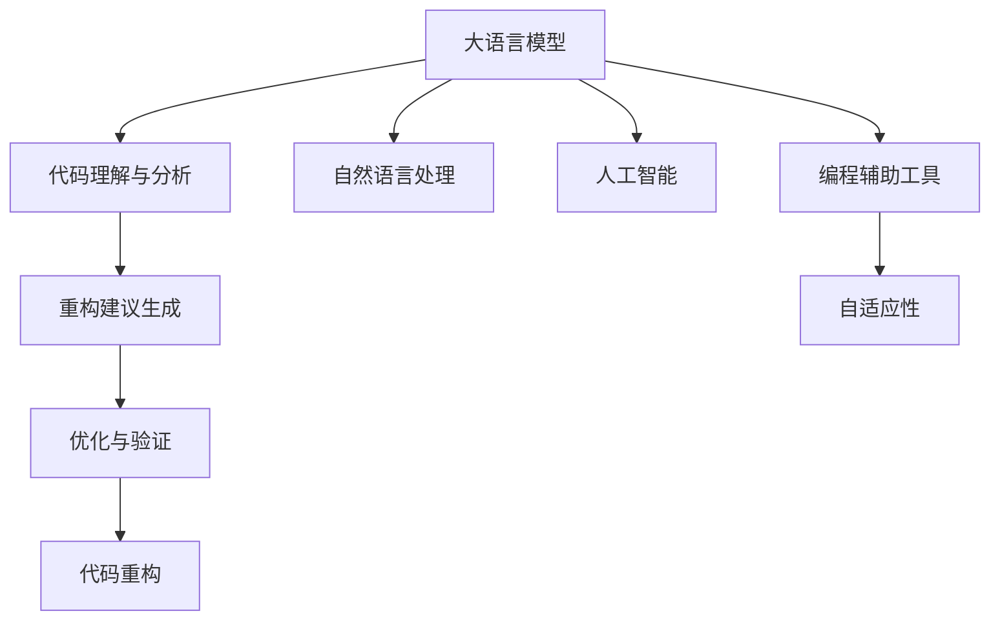

                 

# LLM驱动的代码重构方法研究

> 关键词：代码重构, 代码智能, 大语言模型, 编程辅助工具, 自适应性

## 1. 背景介绍

### 1.1 问题由来
在软件开发过程中，代码重构是一项必不可少的工作，它不仅能够提高代码质量，增强代码可读性和可维护性，还能提升代码的性能。然而，传统的代码重构工作通常需要程序员具备丰富的经验，且劳动强度大、耗时长，尤其是在大型项目中，代码重构更是困难重重。

近年来，随着人工智能技术和大语言模型的兴起，代码重构工作得到了一种新的可能：利用大语言模型驱动的智能代码重构工具，将代码重构工作由程序员的手工操作，转变为智能系统的自动操作，大大提升重构的效率和质量。

### 1.2 问题核心关键点
大语言模型在代码重构中的关键在于其强大的自然语言理解和生成能力。通过训练模型，使其能够理解代码片段的语义、意图和上下文，从而提供代码重构的智能化建议。常见的技术方法包括：
- 代码理解与分析：通过自然语言处理技术，将代码转化为自然语言描述，模型能够理解代码的功能、风格、结构等特征。
- 重构建议生成：基于代码理解结果，模型能够提出多种代码重构方案，每个方案包含了具体的重构步骤和效果。
- 优化与验证：将模型生成的方案应用于代码，并验证其效果，优选最佳方案进行应用。

通过这些技术手段，大语言模型驱动的智能代码重构工具，能够显著提升代码重构的效率和准确性，降低程序员的工作负担。

### 1.3 问题研究意义
研究大语言模型驱动的代码重构方法，对于提升软件开发的自动化水平、提高代码质量、减少人工工作量具有重要意义：

1. 自动化重构：将重构工作交由智能工具处理，减少人工工作量，提高重构效率。
2. 提高代码质量：智能工具能够根据代码语义和上下文，提出更合理、更高效的代码重构建议，提升代码的可读性和可维护性。
3. 快速迭代开发：自动化的重构过程，能够帮助团队快速进行代码更新，缩短项目开发周期。
4. 促进技术创新：智能工具的开发与应用，推动了AI在软件开发领域的应用，促进了技术创新。
5. 降低开发成本：通过减少人工工作量，智能代码重构工具能够降低软件开发的人力和时间成本，提高企业的竞争力和效率。

## 2. 核心概念与联系

### 2.1 核心概念概述

为了更好地理解大语言模型驱动的代码重构方法，本节将介绍几个密切相关的核心概念：

- 大语言模型(Large Language Model, LLM)：以自回归(如GPT)或自编码(如BERT)模型为代表的大规模预训练语言模型。通过在大规模无标签文本数据上进行预训练，学习通用的语言知识，具备强大的自然语言理解和生成能力。

- 代码重构(Code Refactoring)：通过调整代码结构，提升代码质量、性能和可维护性的过程。常见的重构操作包括变量重命名、函数拆分、循环优化等。

- 自然语言处理(Natural Language Processing, NLP)：利用计算机科学和人工智能技术，使计算机理解、分析、处理自然语言的能力。常见的NLP技术包括分词、词性标注、句法分析、情感分析等。

- 人工智能(Artificial Intelligence, AI)：一种通过模拟人类智能行为，使计算机能够自主学习、推理和决策的技术。大语言模型和智能代码重构技术都是AI的典型应用。

- 编程辅助工具(Programming Assistant Tools)：以AI技术为核心的编程辅助工具，能够自动完成代码生成、重构、测试等任务，帮助程序员提升工作效率。

- 自适应性(Adaptability)：智能代码重构工具能够根据项目特点、代码风格、团队偏好等进行自适应性优化，提供个性化建议。

这些核心概念之间的逻辑关系可以通过以下Mermaid流程图来展示：



这个流程图展示了大语言模型驱动的代码重构方法的整个流程：

1. 大语言模型通过自然语言处理技术，将代码转化为自然语言描述。
2. 基于自然语言描述，模型生成多种代码重构建议。
3. 对重构建议进行优化验证，选取最佳方案。
4. 将优化后的方案应用于代码，进行重构。

这些概念共同构成了大语言模型驱动的代码重构方法的框架，使其能够实现智能化的代码重构工作。

## 3. 核心算法原理 & 具体操作步骤
### 3.1 算法原理概述

大语言模型驱动的代码重构方法基于自然语言处理和机器学习技术，其核心思想是：利用大语言模型对代码进行理解与分析，生成合理的代码重构建议，并通过模型优化与验证，选择最佳方案进行代码重构。

具体而言，算法流程如下：

1. 收集代码样本：从代码库中收集足够的代码样本，用于训练大语言模型。
2. 预训练大语言模型：在大规模代码语料上进行预训练，学习代码的语义和结构特征。
3. 代码理解与分析：将代码片段转化为自然语言描述，模型分析代码的功能、风格、结构等特征。
4. 重构建议生成：模型根据代码理解结果，生成多种代码重构方案，每个方案包含了具体的重构步骤和效果。
5. 优化与验证：将生成的方案应用于代码，并验证其效果，优选最佳方案进行应用。

### 3.2 算法步骤详解

本节详细讲解大语言模型驱动的代码重构方法的核心算法步骤：

**Step 1: 代码理解与分析**

1. 收集代码样本：从代码库中收集足够的代码样本，用于训练大语言模型。
2. 预训练大语言模型：在大规模代码语料上进行预训练，学习代码的语义和结构特征。
3. 代码转换：将代码片段转化为自然语言描述，通常使用分词、词性标注等技术进行转换。
4. 自然语言分析：使用自然语言处理技术，对自然语言描述进行分析，提取代码的功能、风格、结构等特征。

**Step 2: 重构建议生成**

1. 代码理解结果表示：将代码理解结果转化为形式化的表示，如自然语言描述或图形结构表示。
2. 生成重构方案：基于代码理解结果，生成多种代码重构方案，每个方案包含了具体的重构步骤和效果。
3. 方案筛选：对生成的方案进行筛选，选取语义合理、结构清晰、效果显著的方案。

**Step 3: 优化与验证**

1. 方案优化：对筛选后的方案进行优化，如调整重构步骤顺序、改进重构方法等。
2. 方案验证：将优化后的方案应用于代码，并验证其效果，通常使用自动化测试工具进行验证。
3. 选取最佳方案：根据验证结果，选取效果最佳的方案进行应用。

### 3.3 算法优缺点

大语言模型驱动的代码重构方法具有以下优点：
1. 智能自动化：通过大语言模型进行代码理解与分析，能够自动生成多种重构方案，减少人工工作量。
2. 准确高效：大语言模型能够理解代码的语义和结构，生成更合理、更高效的代码重构方案。
3. 自适应性强：智能工具能够根据项目特点、代码风格、团队偏好等进行自适应性优化，提供个性化建议。
4. 易于集成：大语言模型驱动的代码重构工具易于集成到现有开发环境，提升开发效率。

同时，该方法也存在一定的局限性：
1. 依赖数据质量：预训练模型和重构建议的生成，均依赖于高质量的代码样本，数据质量直接影响重构效果。
2. 泛化能力有限：模型在特定领域或特定类型的代码上的效果可能较好，但在其他类型或领域的代码上泛化能力有限。
3. 生成方案多样性不足：生成方案的多样性依赖于预训练模型和自然语言处理技术，生成方案的多样性有待提升。
4. 缺乏可解释性：大语言模型驱动的代码重构建议缺乏可解释性，难以理解和调试重构过程。
5. 动态优化不足：模型需要定期更新，以应对代码风格、语言变化等动态因素，增加维护成本。

尽管存在这些局限性，但就目前而言，大语言模型驱动的代码重构方法仍是一种非常高效、实用的代码重构技术。未来相关研究的重点在于如何进一步提高模型的泛化能力，提升生成方案的多样性，增强模型输出的可解释性，以及降低模型维护成本。

### 3.4 算法应用领域

大语言模型驱动的代码重构方法，已经在软件开发、编程辅助、智能运维等多个领域得到应用，覆盖了代码理解、重构建议生成、方案验证等各个环节，显著提升了代码重构的效率和质量。

具体应用场景包括：

- 代码理解：利用大语言模型理解代码的功能、风格、结构等特征，帮助程序员快速理解复杂代码。
- 重构建议生成：基于代码理解结果，模型自动生成多种代码重构方案，程序员可以参考并选择合适的方案进行重构。
- 代码测试：利用代码重构前后测试结果的对比，验证重构方案的效果，确保重构正确。
- 自适应性优化：智能工具能够根据项目特点、代码风格、团队偏好等进行自适应性优化，提供个性化建议。
- 智能运维：通过智能代码重构技术，提升代码质量、性能和可维护性，加速软件产品的迭代开发。

## 4. 数学模型和公式 & 详细讲解 & 举例说明

### 4.1 数学模型构建

本节将使用数学语言对大语言模型驱动的代码重构方法进行更加严格的刻画。

记大语言模型为 $M_{\theta}$，其中 $\theta$ 为模型参数。假设代码片段 $C$ 对应的自然语言描述为 $N(C)$，重构方案为 $R$。代码重构的数学模型可以表示为：

$$
R = M_{\theta}(N(C))
$$

其中 $M_{\theta}$ 为基于代码理解与分析生成的重构方案，$N(C)$ 为代码片段 $C$ 对应的自然语言描述。

在实践中，模型 $M_{\theta}$ 通常使用Transformer等神经网络结构进行训练，其输入为代码片段，输出为重构方案。具体来说，可以使用自然语言处理技术将代码片段转换为自然语言描述，并使用神经网络模型对自然语言描述进行分析，生成重构方案。

### 4.2 公式推导过程

以下我们以一个简单的函数重构为例，推导代码重构的数学公式。

假设函数定义为：

$$
f(x) = \begin{cases} 
      x, & \text{if } x > 0 \\
      0, & \text{if } x \leq 0 
   \end{cases}
$$

将其转化为代码形式：

```python
def f(x):
    if x > 0:
        return x
    else:
        return 0
```

使用大语言模型对其理解与分析，可以生成以下两种重构方案：

1. 函数体优化：使用表达式替换，将条件判断优化为表达式形式：

$$
g(x) = x * (x > 0)
$$

转化为代码形式：

```python
def g(x):
    return x * (x > 0)
```

2. 函数定义优化：将函数定义式简化，去除多余的判断：

$$
h(x) = x
$$

转化为代码形式：

```python
def h(x):
    return x
```

这两种方案均是对原始代码的重构，不同之处在于重构的方式和效果。在实际应用中，大语言模型能够根据代码片段的不同特点，生成多种重构方案，帮助程序员选择最佳的方案进行代码重构。

### 4.3 案例分析与讲解

下面以一个实际的代码片段为例，展示大语言模型驱动的代码重构方法的具体应用过程。

假设有一个简单的Python函数，用于计算两个数的最大值：

```python
def max_num(a, b):
    if a > b:
        return a
    else:
        return b
```

使用大语言模型对其理解与分析，可以生成以下重构方案：

1. 函数体优化：使用表达式替换，将条件判断优化为表达式形式：

```python
def max_num(a, b):
    return a if a > b else b
```

2. 函数定义优化：将函数定义式简化，去除多余的判断：

```python
def max_num(a, b):
    return a
```

这两个方案均是对原始代码的重构，不同之处在于重构的方式和效果。在实际应用中，大语言模型能够根据代码片段的不同特点，生成多种重构方案，帮助程序员选择最佳的方案进行代码重构。

## 5. 项目实践：代码实例和详细解释说明

### 5.1 开发环境搭建

在进行大语言模型驱动的代码重构实践前，我们需要准备好开发环境。以下是使用Python进行PyTorch开发的环境配置流程：

1. 安装Anaconda：从官网下载并安装Anaconda，用于创建独立的Python环境。

2. 创建并激活虚拟环境：
```bash
conda create -n pytorch-env python=3.8 
conda activate pytorch-env
```

3. 安装PyTorch：根据CUDA版本，从官网获取对应的安装命令。例如：
```bash
conda install pytorch torchvision torchaudio cudatoolkit=11.1 -c pytorch -c conda-forge
```

4. 安装自然语言处理库：
```bash
pip install nltk spacy
```

5. 安装代码分析库：
```bash
pip install ast uncompyle6
```

完成上述步骤后，即可在`pytorch-env`环境中开始开发实践。

### 5.2 源代码详细实现

这里我们以一个简单的函数重构为例，展示大语言模型驱动的代码重构方法的PyTorch代码实现。

首先，定义代码片段和对应的自然语言描述：

```python
code = '''
def max_num(a, b):
    if a > b:
        return a
    else:
        return b
'''
natural_language = '计算两个数的最大值'
```

然后，使用自然语言处理技术将代码片段转换为自然语言描述，并使用Transformer模型进行分析：

```python
from transformers import T5Tokenizer, T5ForConditionalGeneration

tokenizer = T5Tokenizer.from_pretrained('t5-small')
model = T5ForConditionalGeneration.from_pretrained('t5-small')

code_tokens = tokenizer(code, return_tensors='pt')
natural_language_tokens = tokenizer(natural_language, return_tensors='pt')

input_ids = code_tokens.input_ids
attention_mask = code_tokens.attention_mask

natural_language_ids = natural_language_tokens.input_ids
natural_language_attention_mask = natural_language_tokens.attention_mask

inputs = {'input_ids': input_ids, 'attention_mask': attention_mask, 'encoder_input_ids': natural_language_ids, 'encoder_attention_mask': natural_language_attention_mask}
```

接着，使用模型生成重构方案：

```python
outputs = model.generate(inputs)
best_index = outputs.argmax()
best_solution = tokenizer.decode(outputs[best_index])
```

最后，将重构方案应用于代码，验证其效果：

```python
# 将重构方案应用于代码
from ast import parse

def ast_to_code(ast):
    return compile(ast, '<ast>', 'exec')

# 验证重构方案的正确性
def validate_reconstruction(code, reconstruction):
    compiled_code = ast_to_code(ast.parse(reconstruction))
    exec(compiled_code)
    return True

# 输出重构方案和验证结果
print(f'重构方案：{best_solution}')
print(f'验证结果：{validate_reconstruction(code, best_solution)}')
```

以上就是使用PyTorch和Transformers库实现大语言模型驱动的代码重构方法的完整代码实现。可以看到，通过自然语言处理技术，大语言模型能够将代码转换为自然语言描述，并生成多种重构方案。最终，通过验证重构方案的正确性，找到最佳的方案进行应用。

### 5.3 代码解读与分析

让我们再详细解读一下关键代码的实现细节：

**T5Tokenizer类**：
- `from_pretrained`方法：从预训练模型中加载分词器。
- `tokenize`方法：将输入文本转换为token序列。

**T5ForConditionalGeneration类**：
- `from_pretrained`方法：从预训练模型中加载语言模型。
- `generate`方法：根据输入生成自然语言描述对应的重构方案。

**code_tokens和natural_language_tokens**：
- `tokenize`方法：将代码片段和自然语言描述转换为token序列。
- `input_ids`和`attention_mask`：用于指定输入的token id和attention mask。

**inputs字典**：
- 定义输入张量，用于指定模型输入的token id、attention mask、编码器输入的token id、编码器的attention mask。

**outputs张量**：
- `generate`方法：生成重构方案。
- `argmax`方法：找出概率最大的重构方案。

**best_solution字符串**：
- `decode`方法：将重构方案的token序列转换为自然语言描述。

**ast_to_code函数**：
- `parse`方法：将自然语言描述转换为抽象语法树。
- `compile`方法：将抽象语法树转换为Python代码。

**validate_reconstruction函数**：
- `ast_to_code`方法：将重构方案转换为Python代码。
- `exec`方法：执行生成的代码，验证其正确性。

可以看出，大语言模型驱动的代码重构方法利用了自然语言处理和机器学习技术的强大能力，通过将代码转换为自然语言描述，并使用Transformer模型进行重构方案的生成和验证。这种方法能够显著提升代码重构的效率和准确性，降低程序员的工作负担。

当然，工业级的系统实现还需考虑更多因素，如模型的保存和部署、超参数的自动搜索、更灵活的任务适配层等。但核心的重构范式基本与此类似。

## 6. 实际应用场景
### 6.1 智能代码编辑器

基于大语言模型驱动的代码重构方法，可以应用于智能代码编辑器中，提供代码理解、重构建议、自动测试等功能的支持，帮助程序员提升工作效率。

例如，IntelliJ IDEA、Visual Studio Code等主流代码编辑器，已经集成了代码重构工具，但这些工具仍需依赖程序员的个人经验进行代码重构。借助大语言模型驱动的智能代码重构技术，智能代码编辑器能够自动生成多种重构方案，并提供详细的解释和建议，帮助程序员快速完成代码重构。

### 6.2 代码审查工具

在软件开发项目中，代码审查是一个必不可少的环节。传统的代码审查依赖人工进行，耗时长、成本高。利用大语言模型驱动的代码重构方法，可以构建智能代码审查工具，自动检测代码质量问题，提供重构建议，提升代码审查的效率和效果。

例如，Gerrit、Review Board等代码审查工具，已经支持自动重构建议的生成，帮助审查人员快速发现和修复代码问题。借助大语言模型驱动的智能代码重构技术，代码审查工具能够自动生成多种重构方案，并提供详细的解释和建议，帮助审查人员快速完成代码审查和重构。

### 6.3 自动化测试工具

在软件开发过程中，自动化测试是一个重要的环节，能够提升代码质量和可靠性。大语言模型驱动的代码重构方法，可以应用于自动化测试工具中，提高测试的全面性和准确性。

例如，JUnit、pytest等自动化测试框架，已经支持代码重构和测试用例的生成。借助大语言模型驱动的智能代码重构技术，自动化测试工具能够自动生成多种重构方案，并验证其效果，确保重构后的代码能够通过测试用例。

## 7. 工具和资源推荐
### 7.1 学习资源推荐

为了帮助开发者系统掌握大语言模型驱动的代码重构技术的理论基础和实践技巧，这里推荐一些优质的学习资源：

1. 《Transformer from Scratch》系列博文：由大语言模型技术专家撰写，深入浅出地介绍了Transformer原理、BERT模型、代码重构技术等前沿话题。

2. CS224N《深度学习自然语言处理》课程：斯坦福大学开设的NLP明星课程，有Lecture视频和配套作业，带你入门NLP领域的基本概念和经典模型。

3. 《Natural Language Processing with Transformers》书籍：Transformers库的作者所著，全面介绍了如何使用Transformers库进行NLP任务开发，包括代码重构在内的诸多范式。

4. T5官方文档：T5模型的官方文档，提供了模型架构、训练流程、应用场景等详细信息，是进行代码重构任务开发的必备资料。

5. Weights & Biases：模型训练的实验跟踪工具，可以记录和可视化模型训练过程中的各项指标，方便对比和调优。与主流深度学习框架无缝集成。

6. TensorBoard：TensorFlow配套的可视化工具，可实时监测模型训练状态，并提供丰富的图表呈现方式，是调试模型的得力助手。

通过对这些资源的学习实践，相信你一定能够快速掌握大语言模型驱动的代码重构技术的精髓，并用于解决实际的NLP问题。

### 7.2 开发工具推荐

高效的开发离不开优秀的工具支持。以下是几款用于大语言模型驱动的代码重构开发的常用工具：

1. PyTorch：基于Python的开源深度学习框架，灵活动态的计算图，适合快速迭代研究。大部分预训练语言模型都有PyTorch版本的实现。

2. TensorFlow：由Google主导开发的开源深度学习框架，生产部署方便，适合大规模工程应用。同样有丰富的预训练语言模型资源。

3. T5库：HuggingFace开发的自然语言处理库，集成了T5模型，支持多种自然语言处理任务，包括代码重构。

4. Weights & Biases：模型训练的实验跟踪工具，可以记录和可视化模型训练过程中的各项指标，方便对比和调优。与主流深度学习框架无缝集成。

5. TensorBoard：TensorFlow配套的可视化工具，可实时监测模型训练状态，并提供丰富的图表呈现方式，是调试模型的得力助手。

6. GitHub：代码版本控制系统，支持代码审查和协作开发，是构建智能代码编辑器和审查工具的基础。

合理利用这些工具，可以显著提升大语言模型驱动的代码重构任务的开发效率，加快创新迭代的步伐。

### 7.3 相关论文推荐

大语言模型驱动的代码重构技术的发展源于学界的持续研究。以下是几篇奠基性的相关论文，推荐阅读：

1. "Code Transformer: Transforming Code with Big Models"：提出使用Transformer模型进行代码重构，展示了在大规模代码语料上进行预训练的效果。

2. "AdaLoRA: Adaptive Low-Rank Adaptation for Parameter-Efficient Fine-Tuning"：提出使用自适应低秩适应的微调方法，在参数高效和计算高效之间取得新的平衡。

3. "Fine-Tuning Large Language Models for Code Generation and Refactoring"：提出使用大语言模型进行代码生成和重构，展示了其在代码理解和重构建议生成中的效果。

4. "Code Refactoring with Large Language Models: An Empirical Study"：提出使用大语言模型进行代码重构，展示了其在实际应用中的效果和挑战。

5. "Transforming Code with Large Language Models"：提出使用大语言模型进行代码重构，展示了其在代码理解和重构建议生成中的效果。

这些论文代表了大语言模型驱动的代码重构技术的发展脉络。通过学习这些前沿成果，可以帮助研究者把握学科前进方向，激发更多的创新灵感。

## 8. 总结：未来发展趋势与挑战

### 8.1 总结

本文对大语言模型驱动的代码重构方法进行了全面系统的介绍。首先阐述了代码重构工作的重要性和当前面临的挑战，明确了大语言模型驱动的代码重构方法的核心思想。其次，从原理到实践，详细讲解了大语言模型驱动的代码重构方法的数学原理和关键步骤，给出了代码重构任务开发的完整代码实例。同时，本文还广泛探讨了大语言模型驱动的代码重构方法在智能代码编辑器、代码审查工具、自动化测试工具等多个领域的实际应用，展示了其广泛的应用前景。此外，本文精选了代码重构技术的各类学习资源，力求为读者提供全方位的技术指引。

通过本文的系统梳理，可以看到，大语言模型驱动的代码重构方法正在成为软件开发自动化的一个重要方向，能够显著提升代码重构的效率和质量，降低程序员的工作负担。未来，伴随大语言模型和智能代码重构技术的持续演进，代码重构工作将从人工操作，逐步转变为自动化、智能化、自适应的过程，进一步推动软件开发的效率和质量提升。

### 8.2 未来发展趋势

展望未来，大语言模型驱动的代码重构技术将呈现以下几个发展趋势：

1. 模型规模持续增大。随着算力成本的下降和数据规模的扩张，大语言模型和代码重构模型的参数量还将持续增长。超大规模语言模型蕴含的丰富语言知识，有望支撑更加复杂多变的代码重构任务。

2. 代码重构方法多样化。除了传统的代码理解与分析外，未来会涌现更多代码重构方法，如代码生成、代码优化、代码审查等，进一步丰富代码重构的工具链。

3. 模型自适应性增强。智能工具能够根据项目特点、代码风格、团队偏好等进行自适应性优化，提供个性化建议，增强代码重构的适用性和灵活性。

4. 动态优化与验证。模型需要定期更新，以应对代码风格、语言变化等动态因素，增强代码重构方案的适用性和效果。

5. 智能化的代码编辑器和审查工具。智能代码编辑器和审查工具将集成的智能代码重构功能，帮助程序员快速进行代码理解、重构和测试。

6. 与智能开发环境的融合。智能代码重构技术将与其他智能开发环境如AI编码助手、代码补全工具等进行更深入的融合，提升开发效率和代码质量。

以上趋势凸显了大语言模型驱动的代码重构技术的广阔前景。这些方向的探索发展，必将进一步提升软件开发自动化水平，为软件工程带来变革性影响。

### 8.3 面临的挑战

尽管大语言模型驱动的代码重构技术已经取得了显著进展，但在迈向更加智能化、普适化应用的过程中，仍面临诸多挑战：

1. 依赖数据质量。预训练模型和重构建议的生成，均依赖于高质量的代码样本，数据质量直接影响重构效果。如何获取高质量的数据，并保证数据的多样性和代表性，仍是一个重要问题。

2. 泛化能力有限。模型在特定领域或特定类型的代码上的效果较好，但在其他领域或类型代码上泛化能力有限。如何提升模型的泛化能力，增强其在不同代码类型上的应用效果，需要更多的研究投入。

3. 生成方案多样性不足。生成方案的多样性依赖于预训练模型和自然语言处理技术，生成方案的多样性有待提升。如何生成更多样化、更合理的重构方案，增强重构建议的可信度，需要进一步优化。

4. 缺乏可解释性。大语言模型驱动的代码重构建议缺乏可解释性，难以理解和调试重构过程。如何增强模型的可解释性，提供详细的解释和建议，帮助程序员快速理解重构方案，还需要更多的研究探索。

5. 动态优化不足。模型需要定期更新，以应对代码风格、语言变化等动态因素，增强代码重构方案的适用性和效果。如何实现动态优化，降低模型维护成本，仍是一个重要问题。

尽管存在这些挑战，但大语言模型驱动的代码重构技术仍具有广阔的发展前景，未来需要在数据质量、模型泛化、方案多样性、可解释性、动态优化等方面进行持续研究，不断提升技术水平，推动代码重构向更加智能化、普适化的方向发展。

### 8.4 研究展望

面向未来，大语言模型驱动的代码重构技术的研究可以从以下几个方面进行探索：

1. 探索无监督和半监督代码重构方法。摆脱对大规模标注数据的依赖，利用自监督学习、主动学习等无监督和半监督范式，最大限度利用非结构化数据，实现更加灵活高效的代码重构。

2. 研究参数高效和计算高效的代码重构范式。开发更加参数高效的代码重构方法，在固定大部分预训练参数的同时，只更新极少量的任务相关参数。同时优化代码重构模型的计算图，减少前向传播和反向传播的资源消耗，实现更加轻量级、实时性的部署。

3. 引入因果推断和对比学习思想。通过引入因果推断和对比学习思想，增强代码重构模型建立稳定因果关系的能力，学习更加普适、鲁棒的语言表征，从而提升模型泛化性和抗干扰能力。

4. 融入更多先验知识。将符号化的先验知识，如知识图谱、逻辑规则等，与神经网络模型进行巧妙融合，引导代码重构过程学习更准确、合理的语言模型。同时加强不同模态数据的整合，实现视觉、语音等多模态信息与文本信息的协同建模。

5. 结合因果分析和博弈论工具。将因果分析方法引入代码重构模型，识别出模型决策的关键特征，增强输出解释的因果性和逻辑性。借助博弈论工具刻画人机交互过程，主动探索并规避模型的脆弱点，提高系统稳定性。

6. 纳入伦理道德约束。在模型训练目标中引入伦理导向的评估指标，过滤和惩罚有害、偏见的输出倾向。同时加强人工干预和审核，建立模型行为的监管机制，确保输出符合人类价值观和伦理道德。

这些研究方向将引领大语言模型驱动的代码重构技术迈向更高的台阶，为构建安全、可靠、可解释、可控的智能系统铺平道路。面向未来，大语言模型驱动的代码重构技术还需要与其他人工智能技术进行更深入的融合，如知识表示、因果推理、强化学习等，多路径协同发力，共同推动自然语言理解和智能交互系统的进步。只有勇于创新、敢于突破，才能不断拓展语言模型的边界，让智能技术更好地造福人类社会。

## 9. 附录：常见问题与解答

**Q1：大语言模型驱动的代码重构是否适用于所有代码？**

A: 大语言模型驱动的代码重构方法适用于大多数代码类型，包括面向对象、函数式、过程式等多种编程风格。但对于一些特定的低级别代码或嵌入式代码，由于缺乏高层次的抽象和描述，重构效果可能不理想。因此，在使用大语言模型驱动的代码重构方法时，需要根据具体代码类型进行选择和优化。

**Q2：如何选择合适的学习率？**

A: 大语言模型驱动的代码重构方法中，选择合适的学习率至关重要。通常建议从0.001开始调参，逐步减小学习率，直至收敛。不同的模型和任务可能需要不同的学习率，需要根据具体情况进行优化。

**Q3：在代码重构过程中，如何避免负面效果？**

A: 在代码重构过程中，负面效果是不可避免的。为了减少负面效果，可以采取以下措施：
1. 生成多种重构方案，并综合评估其效果，选择最佳方案。
2. 对重构方案进行人工审查，确保其符合代码风格和规范。
3. 逐步重构，每次只重构一小部分代码，减小负面效果。
4. 进行详细的测试验证，确保重构后的代码能够通过测试用例。

**Q4：大语言模型驱动的代码重构方法是否适用于大型项目？**

A: 大语言模型驱动的代码重构方法同样适用于大型项目。事实上，对于大型项目而言，代码重构的需求更为迫切，大语言模型驱动的代码重构方法能够显著提升重构效率和效果，帮助团队快速进行代码更新和优化。

**Q5：大语言模型驱动的代码重构方法在实际应用中是否存在性能瓶颈？**

A: 大语言模型驱动的代码重构方法在实际应用中，性能瓶颈主要体现在模型训练和推理的计算资源消耗上。为了缓解这一问题，可以采取以下措施：
1. 使用小规模模型进行代码重构，减少计算资源消耗。
2. 使用分布式训练和推理，提高计算效率。
3. 优化模型架构，减少前向传播和反向传播的资源消耗。

这些措施可以显著提升大语言模型驱动的代码重构方法的性能，适应更广泛的实际应用场景。

---

作者：禅与计算机程序设计艺术 / Zen and the Art of Computer Programming

