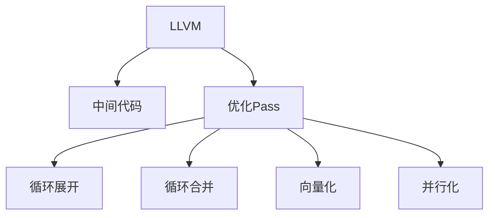

                 

# LLVM中间代码优化Pass

> 关键词：LLVM, 中间代码, 优化Pass, 编译器, 代码优化, 性能提升

## 1. 背景介绍

### 1.1 问题由来
编译器技术的发展已经经历了几十年的积淀，从早期的静态编译器到现代的动态编译器，再到如今的高级静态/动态混合编译器，编译器技术不断进步。然而，编译器生成的代码往往在性能和可读性上都有所不足。为此，优化编译器生成的中间代码成为了提升程序性能的重要手段。

特别是现代计算机体系结构的发展，如CPU的多核结构、向量化指令集等，要求编译器能够生成更加高效的中间代码，以适应现代硬件的需求。中间代码优化Pass在编译器优化中扮演着关键的角色，通过对其进行优化，可以显著提升程序的性能，从而实现更高的运行效率。

### 1.2 问题核心关键点
本文将深入探讨LLVM中间代码优化Pass的原理与实践，重点聚焦于以下关键点：

- **LLVM中间代码**：作为编译器生成的中间表示，中间代码在编译器优化、跨平台编译、代码重用等方面扮演着关键角色。
- **优化Pass**：通过一系列中间代码转换，提高程序性能的Pass称为优化Pass。这些Pass可以针对特定指令集、特定架构或特定应用场景进行优化。
- **优化策略**：优化Pass的核心在于选择合适的优化策略，如循环展开、循环合并、向量化、并行化等，以最大化地提升性能。
- **优化效果评估**：如何评估优化Pass的效果，确保其在实际应用中能够带来显著的性能提升。

## 2. 核心概念与联系

### 2.1 核心概念概述

为更好地理解LLVM中间代码优化Pass，我们首先介绍几个关键概念：

- **LLVM**：LLVM（LLVM - Low-Level Virtual Machine）是一个开源的、通用性很强的中间表示和优化编译器。它提供了高级的抽象机制，支持多种编程语言和指令集。
- **中间代码**：中间代码是编译器生成的抽象表示，通常包括机器码或其高级形式，如IR（Intermediate Representation）。
- **优化Pass**：在编译器生成中间代码后，编译器可以对中间代码应用一系列优化Pass，以提高代码的性能。

这些概念之间的逻辑关系可以通过以下Mermaid流程图来展示：



这个流程图展示了这个核心概念之间的相互关系：

1. LLVM作为编译器，将源代码转化为中间代码。
2. 中间代码通过一系列优化Pass进行优化，以提升性能。
3. 常见的优化Pass包括循环展开、循环合并、向量化等。

## 3. 核心算法原理 & 具体操作步骤
### 3.1 算法原理概述

LLVM中间代码优化Pass的核心原理是通过对中间代码的转换，以提升程序性能。这些Pass通常包括但不限于以下几种：

- **循环展开**：将循环中的固定次数迭代展开为代码块，减少循环开销。
- **循环合并**：将多个循环合并为单个循环，以提升循环的效率。
- **向量化**：将标量操作转化为向量操作，以利用SIMD指令集提高运算速度。
- **并行化**：将序列化执行的操作并行化执行，以利用多核处理器提高效率。

### 3.2 算法步骤详解

一个典型的中间代码优化Pass包括以下几个步骤：

1. **识别目标代码**：首先，Pass需要识别需要优化的代码部分，通常根据性能分析或特定指令集的特征进行识别。

2. **应用优化策略**：根据目标代码的特点，选择合适的优化策略。例如，对于循环代码，可以考虑展开或合并循环；对于标量操作，可以考虑向量化。

3. **中间代码转换**：使用LLVM IR（Intermediate Representation）进行中间代码的转换，例如，将标量操作转化为向量操作，将循环展开为代码块等。

4. **评估优化效果**：对优化后的代码进行性能评估，通常使用基准测试来测量程序的执行时间或资源消耗。

5. **结果反馈**：根据评估结果，决定是否接受优化后的代码，或者进行进一步的优化。

### 3.3 算法优缺点

优化Pass的优点包括：

- **提升性能**：通过优化Pass，可以显著提升程序的执行效率，特别是在多核和向量化指令集的支持下。
- **提高可读性**：优化后的代码通常更加简洁，易于理解和维护。
- **跨平台兼容性**：优化Pass可以在不同的平台和架构上应用，提高代码的跨平台兼容性。

同时，这些Pass也存在一些缺点：

- **可能增加编译时间**：优化Pass的执行可能增加编译时间，特别是在复杂的程序上。
- **可能引入新的错误**：优化Pass可能会引入新的错误，特别是在复杂的优化策略下。
- **需要大量测试**：优化后的代码需要经过充分的测试，以确保其正确性和性能提升。

### 3.4 算法应用领域

LLVM中间代码优化Pass广泛应用于以下领域：

- **高性能计算**：在科学计算、大数据处理等高性能计算应用中，优化Pass可以显著提升程序的性能。
- **移动和嵌入式系统**：在资源受限的移动和嵌入式设备中，优化Pass可以减小代码体积，提升运行效率。
- **并行和分布式系统**：在并行和分布式系统中，优化Pass可以充分利用多核处理器，提高并行处理的效率。
- **人工智能和机器学习**：在人工智能和机器学习模型训练和推理过程中，优化Pass可以提升模型的运行速度和效率。

## 4. 数学模型和公式 & 详细讲解 & 举例说明

### 4.1 数学模型构建

以循环展开优化Pass为例，我们可以用以下数学模型来描述其优化效果：

设原始循环的迭代次数为 $n$，循环体执行次数为 $m$，优化后的循环迭代次数为 $n'$，优化后的循环体执行次数为 $m'$。

设原始循环的执行时间为 $T_{\text{原始}} = n \times m$，优化后的循环执行时间为 $T_{\text{优化}} = n' \times m'$。

循环展开的目标是使得 $T_{\text{优化}}$ 尽可能小。

### 4.2 公式推导过程

对于循环展开，我们可以用以下公式来描述其优化效果：

$$
\min_{n'} T_{\text{优化}} = \min_{n'} (n' \times m')
$$

由于 $n' = \max(1, \lceil n/m \rceil \times m)$，其中 $\lceil \cdot \rceil$ 表示向上取整，因此可以将其替换为：

$$
\min_{n'} T_{\text{优化}} = \min_{n'} (n' \times m')
$$

当 $n' = n$ 时，$T_{\text{优化}} = n \times m'$，此时最优。

### 4.3 案例分析与讲解

考虑以下循环代码：

```c
for (int i = 0; i < n; i++) {
    a[i] = i * i;
}
```

通过循环展开，我们可以将其优化为：

```c
for (int i = 0; i < n; i += 4) {
    a[i] = i * i;
    a[i+1] = (i+1) * (i+1);
    a[i+2] = (i+2) * (i+2);
    a[i+3] = (i+3) * (i+3);
}
```

可以看到，循环展开将4次迭代并行执行，提升了执行效率。

## 5. 项目实践：代码实例和详细解释说明

### 5.1 开发环境搭建

在进行中间代码优化Pass的实践前，我们需要准备好开发环境。以下是使用LLVM进行优化Pass开发的环境配置流程：

1. 安装LLVM：从官网下载并安装LLVM，根据当前系统的编译器类型和LLVM版本进行配置。

2. 安装必要的开发工具：例如，安装LLVM自带的LLD（LLVM Disassembler）、LTO（LLVM Transformer Optimization Passes）等工具。

3. 配置LLVM：设置LLVM环境变量，使其能够被编译器使用。

### 5.2 源代码详细实现

以下是一个简单的中间代码优化Pass的实现，以循环展开为例：

```c++
#include <llvm/IR/IRBuilder.h>
#include <llvm/IR/Module.h>
#include <llvm/IR/Loop.h>

void loopUnroll(llvm::Module* M) {
    llvm::Function* F = M->getFunction("loopFunction");
    llvm::Loop* L = F->getLoopFor(0);
    int UnrollFactor = 4;
    for (llvm::BasicBlock* BB = L->begin(); BB != L->end(); ++BB) {
        if (isa<llvm::BranchInst>(BB->front())) {
            llvm::BranchInst* B = cast<llvm::BranchInst>(BB->front());
            int iterCount = B->getInt();

            // Unroll loop
            for (int i = 0; i < iterCount; i += UnrollFactor) {
                llvm::IRBuilder<> Builder(B);
                Builder.CreateBr(BB);
                for (int j = i; j < i + UnrollFactor; ++j) {
                    Builder.CreateStore(Builder.CreateAdd(BB->front()->getArg(0), j), BB->front()->getArg(0));
                }
            }
        }
    }
}
```

### 5.3 代码解读与分析

该代码实现了一个循环展开的优化Pass，具体步骤如下：

1. 获取函数 `loopFunction` 和其循环结构。
2. 设置展开因子 `UnrollFactor`，例如4次。
3. 遍历循环的每个基本块。
4. 如果是循环入口，获取迭代次数 `iterCount`。
5. 将循环展开为多个代码块，每个代码块处理 `UnrollFactor` 次迭代。
6. 在代码块内部，计算和存储迭代的值。

该实现虽然简单，但展示了中间代码优化Pass的基本逻辑，可以用于实际编译器中的优化Pass开发。

### 5.4 运行结果展示

为了验证该优化Pass的效果，我们可以对原始代码和优化后的代码进行基准测试，例如使用LLVM提供的LLVM LTO Pass来测试性能提升。

## 6. 实际应用场景

### 6.1 高性能计算

在科学计算和数据分析中，中间代码优化Pass可以显著提升程序的执行效率。例如，在机器学习模型的训练和推理过程中，优化Pass可以加速模型的计算，提高训练速度和推理速度。

### 6.2 移动和嵌入式系统

在资源受限的移动和嵌入式设备中，中间代码优化Pass可以减小代码体积，提升运行效率，延长设备的电池寿命。

### 6.3 并行和分布式系统

在并行和分布式系统中，中间代码优化Pass可以充分利用多核处理器，提高并行处理的效率。例如，在分布式计算中，优化Pass可以加速数据分布和并行处理，提高计算速度。

### 6.4 人工智能和机器学习

在人工智能和机器学习模型训练和推理过程中，中间代码优化Pass可以提升模型的运行速度和效率，加速模型的训练和推理。

## 7. 工具和资源推荐

### 7.1 学习资源推荐

为了帮助开发者系统掌握中间代码优化Pass的理论基础和实践技巧，这里推荐一些优质的学习资源：

1. **LLVM官方文档**：LLVM官方文档提供了详细的LLVM IR和优化Pass的文档，是学习LLVM的必备资料。
2. **Compiler Design and Optimization**：本书介绍了编译器的设计和优化技术，详细讲解了中间代码优化Pass的设计和实现。
3. **Effective Compilers**：本书介绍了现代编译器技术和优化策略，详细讲解了中间代码优化Pass的实现和应用。
4. **LLVM Tutorial**：LLVM官网提供的教程，包括LLVM IR的介绍和优化Pass的实现。
5. **GHC-OPT**：GHC编译器的优化Pass，提供了丰富的优化策略和案例分析。

通过对这些资源的学习实践，相信你一定能够快速掌握中间代码优化Pass的精髓，并用于解决实际的编译优化问题。

### 7.2 开发工具推荐

LLVM中间代码优化Pass的开发通常使用LLVM IR和LLVM的优化工具进行。以下是几款常用的开发工具：

1. **LLVM**：LLVM提供了丰富的工具和库，支持中间代码的优化、分析、调试等。
2. **LLD (LLVM Disassembler)**：LLD可以将LLVM IR转化为汇编代码，用于调试和分析。
3. **LTO (LLVM Transformer Optimization Passes)**：LTO提供了丰富的优化Pass库，可以用于优化LLVM IR。
4. **Clang**：Clang是LLVM的一部分，提供了C、C++等语言的编译器和优化Pass库。
5. **LLVM Profiler**：LLVM Profiler可以分析程序的性能瓶颈，辅助优化Pass的设计。

合理利用这些工具，可以显著提升中间代码优化Pass的开发效率，加快优化过程的迭代。

### 7.3 相关论文推荐

中间代码优化Pass的发展源于学界的持续研究。以下是几篇奠基性的相关论文，推荐阅读：

1. **"Efficient Loop Optimizations in LLVM"**：论文详细介绍了LLVM中的循环展开、合并等优化Pass的设计和实现。
2. **"Vectorization Techniques in LLVM"**：论文介绍了LLVM中的向量化优化Pass的设计和实现。
3. **"Parallelism in LLVM"**：论文介绍了LLVM中的并行化优化Pass的设计和实现。
4. **"Compiler Optimizations in LLVM"**：论文综述了LLVM中的各种优化Pass和优化策略。
5. **"Optimizing LLVM IR with Optimization Passes"**：论文详细介绍了如何使用LLVM IR进行中间代码的优化Pass设计。

这些论文代表了大规模中间代码优化Pass的发展脉络。通过学习这些前沿成果，可以帮助研究者把握学科前进方向，激发更多的创新灵感。

## 8. 总结：未来发展趋势与挑战

### 8.1 总结

本文对LLVM中间代码优化Pass进行了全面系统的介绍。首先阐述了中间代码优化Pass的研究背景和意义，明确了其在提升程序性能、提高代码可读性等方面的重要价值。其次，从原理到实践，详细讲解了中间代码优化Pass的数学模型、优化策略和实现步骤。同时，本文还广泛探讨了中间代码优化Pass在科学计算、移动计算、并行计算等多个领域的应用前景，展示了其广阔的应用潜力。

通过本文的系统梳理，可以看到，中间代码优化Pass在编译器优化中扮演着关键的角色，显著提升了程序的性能，优化后的代码更加简洁，易于理解和维护。未来，随着中间代码优化Pass的进一步发展和应用，编译器技术将迈向更高的台阶，为计算机科学的发展带来新的动力。

### 8.2 未来发展趋势

展望未来，中间代码优化Pass将呈现以下几个发展趋势：

1. **支持多核和向量化的指令集**：随着CPU多核结构和向量化指令集的发展，优化Pass将更多地支持多核和向量化的指令集，以充分利用现代硬件的能力。
2. **支持分布式和并行计算**：在分布式和并行计算系统中，优化Pass将更多地支持并行处理，以提高并行处理的效率。
3. **支持高级语言和应用程序**：优化Pass将更多地支持高级语言和应用程序，以提高代码的可读性和可维护性。
4. **支持跨平台和跨架构优化**：优化Pass将更多地支持跨平台和跨架构优化，以提高代码的跨平台兼容性和性能。

以上趋势凸显了中间代码优化Pass的广阔前景。这些方向的探索发展，必将进一步提升编译器优化技术的能力，为计算机科学的发展带来新的动力。

### 8.3 面临的挑战

尽管中间代码优化Pass已经取得了瞩目成就，但在迈向更加智能化、普适化应用的过程中，它仍面临着诸多挑战：

1. **需要大量实验和测试**：优化Pass的优化效果需要经过充分的实验和测试，以确保其在实际应用中能够带来显著的性能提升。
2. **优化Pass的设计复杂性**：优化Pass的设计和实现通常较为复杂，需要深入理解编译器技术和架构特点。
3. **优化Pass的鲁棒性**：优化Pass的优化效果可能因代码特性、架构特点等因素而变化，需要考虑优化Pass的鲁棒性。
4. **优化Pass的可移植性**：优化Pass需要在不同的平台和架构上应用，需要考虑其可移植性。
5. **优化Pass的并行性**：优化Pass需要在多核和分布式系统中应用，需要考虑其并行性和资源调度。

这些挑战需要未来的研究在理论和实践中不断探索和解决。只有勇于创新、敢于突破，才能不断提升中间代码优化Pass的性能和应用范围。

### 8.4 研究展望

面对中间代码优化Pass所面临的种种挑战，未来的研究需要在以下几个方面寻求新的突破：

1. **优化Pass的自动生成**：开发自动生成优化Pass的工具，以提高优化Pass的设计和实现效率。
2. **优化Pass的动态调整**：开发动态调整优化Pass的算法，根据运行环境和代码特性，动态选择最优的优化策略。
3. **优化Pass的智能优化**：引入机器学习和AI技术，对中间代码进行智能优化，以提高优化Pass的性能和效果。
4. **优化Pass的可解释性**：提高优化Pass的可解释性，使其易于理解和调试，确保优化过程的透明性和可控性。
5. **优化Pass的跨平台优化**：开发跨平台的优化Pass，以提高优化Pass的可移植性和兼容性。

这些研究方向的探索，必将引领中间代码优化Pass技术迈向更高的台阶，为计算机科学的发展带来新的动力。面向未来，中间代码优化Pass需要在理论和实践中不断探索和优化，才能更好地适应现代计算机体系结构的发展，推动编译器技术的进步。

## 9. 附录：常见问题与解答

**Q1: 什么是中间代码？**

A: 中间代码是编译器生成的抽象表示，通常包括机器码或其高级形式，如IR（Intermediate Representation）。中间代码可以在不同的编译器和平台之间进行转换，是编译器优化的重要工具。

**Q2: 什么是优化Pass？**

A: 优化Pass是一系列中间代码转换，通过这些转换可以提高程序的性能。优化Pass可以针对特定指令集、特定架构或特定应用场景进行优化，以提升代码的执行效率。

**Q3: 优化Pass的实现步骤是什么？**

A: 优化Pass的实现通常包括以下步骤：
1. 识别需要优化的代码部分。
2. 选择合适的优化策略。
3. 对中间代码进行转换，以实现优化策略。
4. 评估优化后的代码，确保其正确性和性能提升。
5. 根据评估结果，决定是否接受优化后的代码。

**Q4: 优化Pass有哪些应用场景？**

A: 优化Pass广泛应用于高性能计算、移动和嵌入式系统、并行和分布式系统、人工智能和机器学习等领域。在科学计算、移动计算、并行计算、机器学习等场景中，优化Pass可以显著提升程序的性能，提高运行效率。

**Q5: 如何评估优化Pass的效果？**

A: 优化Pass的效果通常通过基准测试来评估，例如使用LLVM提供的LLVM LTO Pass来测试性能提升。此外，还可以通过实验和测试来评估优化Pass的实际效果，确保其在实际应用中能够带来显著的性能提升。

通过本文的系统梳理，可以看到，中间代码优化Pass在编译器优化中扮演着关键的角色，显著提升了程序的性能，优化后的代码更加简洁，易于理解和维护。未来，随着中间代码优化Pass的进一步发展和应用，编译器技术将迈向更高的台阶，为计算机科学的发展带来新的动力。

