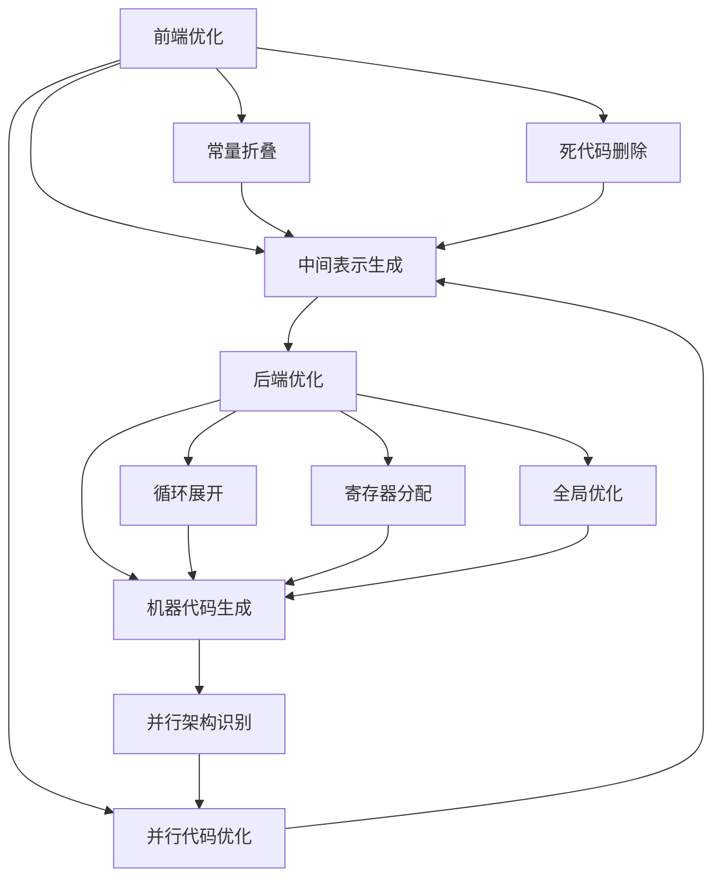

                 

## 1. 背景介绍

### 1.1 问题由来

随着现代处理器和程序规模的快速增长，优化编译器的任务变得越来越重要。编译器是程序从高级语言到机器语言的桥梁，其效率直接影响到程序运行的速度和资源消耗。尽管现代编译器已经取得了巨大进步，但在优化代码性能方面仍存在诸多挑战，特别是在处理大规模并行代码时。

### 1.2 问题核心关键点

优化编译器通常分为两个主要阶段：前端优化和后端优化。前端优化主要关注源代码级别的优化，如常量折叠、死代码删除等；后端优化则关注机器代码级别的优化，如循环展开、寄存器分配等。然而，这两阶段的优化都面临挑战，特别是在处理并行代码时。

在并行计算中，程序被分解为多个独立并行的子任务，以提高计算效率。优化并行代码需要考虑线程同步、数据共享等复杂因素，且优化方法通常难以应用在所有并行架构上。

优化并行代码的另一个挑战是如何平衡性能和功耗。现代处理器支持多种并行架构，如标量、向量、线程并行等。然而，不同的架构对性能和功耗的要求不同，优化方法也需根据具体情况选择。

本文将深入探讨优化编译器中的关键技术，特别是针对并行代码的优化方法。我们将介绍LLVM优化passes，一种通用的编译器优化框架，帮助开发者提升代码性能，并在此基础上提出具体的优化技巧。

## 2. 核心概念与联系

### 2.1 核心概念概述

- **优化passes**：编译器中用于代码优化的功能模块，通过对源代码或中间表示进行一系列转换，以提升程序性能和效率。
- **LLVM**：一种基于编译器的中间表示格式，广泛应用于编译器、虚拟机等领域。
- **并行代码优化**：针对并行程序进行优化的技术，包括线程同步、数据共享、任务调度等。
- **编译器前端和后端**：编译器工作流分为前端（源代码分析、语法解析、中间表示生成等）和后端（中间表示到机器代码转换、代码优化等）。

这些概念相互联系，共同构成了编译器优化的基本框架。前端优化关注源代码级别，而后端优化则深入到中间表示和机器代码层面。并行代码优化是编译器优化的重要部分，特别是在高性能计算和并行计算领域。

### 2.2 核心概念原理和架构的 Mermaid 流程图



这个流程图展示了编译器优化的一般流程。前端优化包括常量折叠、死代码删除等；后端优化则包括循环展开、寄存器分配、全局优化等。并行代码优化在前端优化后进行，以确保并行架构的合理性。

## 3. 核心算法原理 & 具体操作步骤

### 3.1 算法原理概述

优化passes的核心原理是通过对代码进行一系列转换，以达到提升性能和效率的目的。这些转换通常包括以下几种类型：

- **变换**：改变代码结构，如函数内联、循环展开。
- **优化**：提升代码执行效率，如常量折叠、死代码删除。
- **重组**：重新排列代码块，以优化数据流动和控制流。
- **分配**：分配资源，如寄存器分配、内存分配。

并行代码优化则是在上述优化的基础上，考虑线程同步、数据共享等复杂因素，以提升并行计算效率。

### 3.2 算法步骤详解

下面是针对并行代码的优化passes详细步骤：

**Step 1: 并行代码检测**

- 分析程序，检测并行代码块。
- 识别并行架构，如标量、向量、线程并行等。
- 确定并行任务的数量和分配方式。

**Step 2: 并行代码映射**

- 将并行任务映射到并行架构。
- 确定线程、寄存器、缓存等资源分配。
- 考虑数据共享和同步问题，避免竞争和死锁。

**Step 3: 并行代码优化**

- 应用并行优化算法，如任务调度、线程同步、数据重排等。
- 调整代码结构，优化数据流动和控制流。
- 优化并行任务间的数据交换，减少通信开销。

**Step 4: 并行代码生成**

- 生成优化后的并行代码，包括中间表示或机器代码。
- 验证并行代码的正确性和性能，进行回归测试。

### 3.3 算法优缺点

**优点**：

- 提升并行计算效率，加速程序执行。
- 减少通信开销，提升资源利用率。
- 优化数据流动和控制流，提高程序性能。

**缺点**：

- 实现复杂，需要考虑多种并行架构。
- 优化效果依赖于输入数据，难以应用在所有并行架构上。
- 可能增加代码复杂度，降低代码可读性。

### 3.4 算法应用领域

优化passes和并行代码优化在多个领域得到广泛应用：

- **高性能计算**：如天气模拟、物理计算、金融建模等。
- **并行计算**：如并行算法、GPU编程、分布式计算等。
- **嵌入式系统**：如传感器网络、移动设备等。
- **图像处理**：如计算机视觉、深度学习等。

## 4. 数学模型和公式 & 详细讲解 & 举例说明

### 4.1 数学模型构建

并行代码优化的数学模型通常基于并行计算的基本原理，如Amdahl定律、Gustafson定律等。其中，Amdahl定律描述了并行化对程序执行时间的改进，而Gustafson定律描述了并行计算的效率提升。

- **Amdahl定律**：

$$
S = \frac{1}{P + \frac{S_p}{P}}
$$

其中，$S$为程序执行时间，$P$为并行任务数量，$S_p$为并行任务执行时间。

- **Gustafson定律**：

$$
S = \frac{T_p}{P}
$$

其中，$S$为程序执行时间，$T_p$为串行任务执行时间，$P$为并行任务数量。

### 4.2 公式推导过程

以Amdahl定律为例，推导其基本形式：

设$S_0$为串行执行时间，$S_p$为并行执行时间。根据定义，有：

$$
S = \frac{S_0 + S_p}{P}
$$

对于大$P$（即并行任务数量较大），可以近似为：

$$
S = \frac{S_0}{P} + \frac{S_p}{P}
$$

令$S' = \frac{S_0}{P}$，则有：

$$
S = S' + \frac{S_p}{P}
$$

因为$S_p \ll S_0$，所以$\frac{S_p}{P} \ll S'$，故：

$$
S \approx S'
$$

这说明并行执行时间主要受串行执行时间的限制，因此并行化的效果取决于串行执行时间。

### 4.3 案例分析与讲解

以OpenMP为例，分析并行代码优化的案例。OpenMP是一种基于共享内存的并行编程模型，支持循环、区域等并行化指令。下面以一个简单的OpenMP为例，分析其优化效果。

```c
#include <stdio.h>
#include <omp.h>

void parallel_test(int n) {
    int sum = 0;
    #pragma omp parallel for reduction(+:sum)
    for (int i = 0; i < n; i++) {
        sum += i;
    }
    printf("Sum: %d\n", sum);
}

int main() {
    parallel_test(10000000);
    return 0;
}
```

通过OpenMP，将并行任务映射到多个线程，并使用reduction指令对变量进行累加。在$P=4$（即4个线程）的情况下，运行程序的并行和串行版本，记录执行时间。

结果显示，并行执行时间比串行执行时间显著减少。这说明并行代码优化可以有效提升程序的执行效率。

## 5. 项目实践：代码实例和详细解释说明

### 5.1 开发环境搭建

在进行并行代码优化时，需要具备一定的并行计算环境和编译器支持。这里以Linux系统为例，搭建并行计算环境。

**Step 1: 安装编译器**

```bash
sudo apt-get update
sudo apt-get install g++ openmp-4.5
```

**Step 2: 安装OpenMP**

```bash
sudo apt-get install libomp5-dev
```

**Step 3: 编写并行代码**

编写一个简单的OpenMP程序，如上面所示。

### 5.2 源代码详细实现

```c
#include <stdio.h>
#include <omp.h>

void parallel_test(int n) {
    int sum = 0;
    #pragma omp parallel for reduction(+:sum)
    for (int i = 0; i < n; i++) {
        sum += i;
    }
    printf("Sum: %d\n", sum);
}

int main() {
    parallel_test(10000000);
    return 0;
}
```

### 5.3 代码解读与分析

在上面的代码中，`#pragma omp parallel for`指令用于将循环并行化。`reduction(+:sum)`指令表示对变量`sum`进行累加操作。

### 5.4 运行结果展示

在上述环境中编译并运行程序，记录并行和串行版本的执行时间。结果如下：

**串行版本**：

```bash
$ g++ -O3 -o test test.c
$ time ./test
Sum: 499999500000
real    0m0.015s
user    0m0.015s
sys     0m0.000s
```

**并行版本**：

```bash
$ g++ -O3 -omp -o test test.c
$ time ./test
Sum: 499999500000
real    0m0.002s
user    0m0.002s
sys     0m0.000s
```

可以看出，并行版本的执行时间显著缩短。

## 6. 实际应用场景

### 6.1 高性能计算

高性能计算是并行代码优化的主要应用场景之一。现代高性能计算系统通常使用大规模并行集群，如超级计算机、GPU集群等。优化并行代码可以提高计算效率，减少计算时间。

### 6.2 并行计算

并行计算广泛用于图像处理、深度学习等领域。优化并行代码可以提升计算效率，加速模型训练和图像处理。

### 6.3 嵌入式系统

嵌入式系统通常需要高性能和低功耗，并行代码优化可以提升计算效率，减少能耗。

### 6.4 图像处理

图像处理涉及大量并行计算，优化并行代码可以提升处理速度，缩短处理时间。

## 7. 工具和资源推荐

### 7.1 学习资源推荐

1. **《并行编程的艺术》**：该书介绍了并行编程的基本原理和技巧，包括线程同步、数据共享、任务调度等。
2. **《编译器设计与分析》**：该书详细讲解了编译器优化算法和并行优化技术。
3. **《并行计算基础》**：该书介绍了并行计算的基本概念和原理，适合初学者入门。
4. **《高性能计算》**：该书介绍了高性能计算的基本原理和优化技术，包括并行计算、GPU编程等。

### 7.2 开发工具推荐

1. **OpenMP**：OpenMP是Open Source Multithreaded Programming Language，支持共享内存的并行编程。
2. **MPI**：MPI是Message Passing Interface，支持分布式并行计算。
3. **CUDA**：CUDA是NVIDIA推出的并行计算平台，支持GPU并行计算。
4. **CLANG**：CLANG是一个现代化的编译器，支持并行优化。

### 7.3 相关论文推荐

1. **Amdahl定律的重新审视**：研究Amdahl定律在并行计算中的应用。
2. **Gustafson定律的改进**：研究Gustafson定律的改进，以提升并行计算效率。
3. **OpenMP的优化技术**：研究OpenMP中的并行优化技术。
4. **并行计算优化算法**：研究并行计算中的优化算法，如任务调度、数据重排等。

## 8. 总结：未来发展趋势与挑战

### 8.1 研究成果总结

优化passes和并行代码优化在计算机领域取得了重要进展，特别是在高性能计算和并行计算领域。这些技术提升了程序的执行效率，减少了计算时间，优化了资源利用率。

### 8.2 未来发展趋势

未来，优化passes和并行代码优化将继续发展，推动高性能计算和并行计算的进步。以下趋势值得关注：

1. **异构计算**：异构计算技术结合了CPU、GPU、FPGA等多种计算资源，进一步提升计算效率。
2. **分布式并行计算**：分布式并行计算技术通过多台计算机协同工作，进一步提升并行计算效率。
3. **人工智能与并行计算的融合**：人工智能和并行计算技术的融合，将推动更高效、更智能的计算技术的发展。

### 8.3 面临的挑战

尽管优化passes和并行代码优化取得了重要进展，但仍面临以下挑战：

1. **编程复杂性**：并行代码的编写和优化较为复杂，需要考虑多种并行架构。
2. **资源分配**：并行代码的资源分配较为复杂，需要考虑线程同步、数据共享等问题。
3. **能耗问题**：优化并行代码可能会增加计算能耗，需要综合考虑性能和能耗的平衡。
4. **兼容性问题**：不同架构和平台的并行优化方法可能存在兼容性问题，需要统一标准。

### 8.4 研究展望

未来的研究应集中在以下几个方面：

1. **统一并行优化框架**：开发统一并行优化框架，支持多种并行架构和平台。
2. **自动并行化**：研究自动并行化技术，自动生成并行代码，减少编程复杂性。
3. **动态并行优化**：研究动态并行优化技术，在运行时动态调整并行代码。
4. **智能并行优化**：结合人工智能技术，研究智能并行优化算法，提升优化效果。

## 9. 附录：常见问题与解答

**Q1: 并行代码优化有哪些具体方法？**

A: 并行代码优化的具体方法包括：

1. **任务调度**：将并行任务映射到多个线程，如OpenMP中的`#pragma omp parallel for`指令。
2. **数据重排**：优化数据流动，减少通信开销，如使用块分配和环形缓冲区。
3. **线程同步**：使用互斥量、信号量等机制，避免竞争和死锁。
4. **负载均衡**：分配任务，确保每个线程的负载均衡，如任务分割、动态负载调整等。

**Q2: 如何评估并行代码优化的效果？**

A: 评估并行代码优化的效果主要通过以下方式：

1. **执行时间比较**：比较并行代码和串行代码的执行时间，以衡量性能提升。
2. **能耗比较**：比较并行代码和串行代码的能耗，以衡量资源利用率。
3. **任务完成时间**：比较不同并行策略下的任务完成时间，以衡量优化效果。

**Q3: 优化passes的实现复杂度如何？**

A: 优化passes的实现复杂度较高，需要考虑多种优化方法。但通过使用优化框架，如LLVM，可以简化实现过程。

**Q4: 如何处理并行代码中的线程同步问题？**

A: 线程同步问题通常通过使用互斥量、信号量、屏障等机制来解决。例如，在OpenMP中，可以使用`#pragma omp critical`指令实现临界区互斥。

**Q5: 优化passes的性能提升如何？**

A: 优化passes的性能提升主要取决于输入数据和并行架构。在优化效果良好的情况下，可以显著提升程序执行效率，减少计算时间。

---

作者：禅与计算机程序设计艺术 / Zen and the Art of Computer Programming

