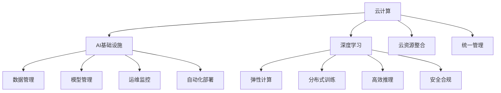

                 

# Lepton AI的云计算实力：深度整合云资源，打造灵活高效的AI基础设施

> 关键词：云计算,AI基础设施,深度学习,云资源整合,弹性计算,分布式训练,高效推理

## 1. 背景介绍

在当前的数字化转型过程中，云计算已经成为了企业不可或缺的基础设施。对于AI领域而言，云计算不仅提供了丰富的计算资源，还提供了灵活的部署和运维环境。Lepton AI作为一家领先的AI技术公司，深度整合了云资源，构建了一套高效、灵活的AI基础设施，支撑其产品的快速迭代和高效运行。本文将深入探讨Lepton AI的云计算实力，从基础设施建设、训练推理优化、安全合规保障等多个方面，全面解析其如何通过云计算赋能AI应用的每一个环节。

## 2. 核心概念与联系

### 2.1 核心概念概述

在Lepton AI的云计算架构中，涉及多个关键概念，它们相互联系，共同构建起一套强大的AI基础设施。以下是几个核心概念的介绍：

- **云计算(CLOUD)**：以SaaS、PaaS、IaaS等方式提供计算、存储、网络、安全等基础设施服务，支持弹性、按需计算。
- **AI基础设施(AI INFRASTRUCTURE)**：包括数据存储、模型训练、推理部署、管理监控等，支持AI模型的高效构建和运行。
- **深度学习(DEEP LEARNING)**：以神经网络为代表的人工智能技术，通过大数据和复杂模型进行深度学习，实现智能决策和预测。
- **云资源整合(CLOUD RESOURCE INTEGRATION)**：将不同云平台、服务、工具进行深度整合，构建统一、高效的云生态系统。
- **弹性计算(ELASTIC COMPUTING)**：根据业务负载变化自动调整计算资源，确保高性能、低成本的计算服务。
- **分布式训练(DISTRIBUTED TRAINING)**：通过多机多卡并行计算，加速大规模模型的训练过程。
- **高效推理(HIGH EFFICIENCY INFERencing)**：通过模型优化和算法优化，提升推理速度和资源利用率。
- **安全合规(SECURITY AND COMPLIANCE)**：确保云环境中的数据安全、系统安全、合规性，保护用户隐私和数据安全。

### 2.2 核心概念原理和架构的 Mermaid 流程图



这个流程图展示了Lepton AI的云计算架构中各个关键组件的联系和整合方式。其中：

- A: 云计算提供基础计算服务，B: AI基础设施进一步扩展和深化这些服务，满足AI的特定需求。
- C: 深度学习依赖于大规模数据和复杂模型，需要大量的计算资源。
- D: 云资源整合确保各种云计算服务和资源的协同工作。
- E: 弹性计算根据业务负载动态调整资源，保证计算效率。
- F: 分布式训练通过多机多卡并行计算，加速模型训练。
- G: 高效推理通过模型优化和算法优化，提升推理速度。
- H: 安全合规保护数据和系统安全，满足法规要求。
- I: 统一管理提供整体的管理和监控，简化运维工作。
- J-K-L-M: 数据管理、模型管理、运维监控和自动化部署是AI基础设施的核心模块，支持AI模型全生命周期的管理。

## 3. 核心算法原理 & 具体操作步骤

### 3.1 算法原理概述

Lepton AI的云计算架构核心在于深度整合云资源，构建灵活高效的AI基础设施。这包括了以下几个关键算法和原理：

- **云资源池管理**：将云平台中的计算、存储、网络等资源进行集中管理和调度，确保资源的高效利用和灵活部署。
- **弹性计算调度**：根据任务负载动态调整计算资源，确保系统的高可用性和高性能。
- **分布式训练算法**：通过多机多卡并行计算，加速大规模模型的训练过程。
- **高效推理算法**：通过模型压缩、量化等技术，提升推理速度和资源利用率。
- **安全合规机制**：通过数据加密、访问控制、审计追踪等手段，确保云环境中的数据和系统安全。

### 3.2 算法步骤详解

以下是对Lepton AI云计算架构中各个核心算法步骤的详细介绍：

#### 云资源池管理

1. **资源评估**：对云计算平台中的资源进行评估，确定可用的计算、存储、网络资源。
2. **资源池划分**：根据不同的业务需求，将资源划分为不同的资源池，如通用计算资源池、高性能计算资源池、存储资源池等。
3. **资源分配**：根据任务的资源需求，动态调整资源分配，确保资源的有效利用。
4. **资源监控**：实时监控资源使用情况，及时发现和处理资源瓶颈。

#### 弹性计算调度

1. **负载分析**：通过监控系统，分析业务负载的变化趋势。
2. **资源调整**：根据负载分析结果，自动调整计算资源的规模。
3. **故障恢复**：在资源调整过程中，确保系统的容错和故障恢复能力。

#### 分布式训练算法

1. **模型划分**：将大规模模型划分为多个小模型，分配到不同的计算节点上。
2. **并行计算**：通过多机多卡并行计算，加速模型训练过程。
3. **数据同步**：在多个计算节点之间进行数据同步，确保模型的一致性。
4. **参数更新**：根据计算结果，更新模型参数，并反馈到各个计算节点。

#### 高效推理算法

1. **模型压缩**：通过剪枝、量化等技术，减小模型的存储空间和计算复杂度。
2. **推理加速**：通过优化推理引擎，提升推理速度和资源利用率。
3. **分布式推理**：将推理任务分配到多个计算节点，并行执行推理计算。

#### 安全合规机制

1. **数据加密**：对存储和传输中的数据进行加密处理，确保数据的安全性。
2. **访问控制**：通过身份验证、权限管理等手段，限制对系统的访问权限。
3. **审计追踪**：记录系统的访问和操作记录，用于合规性审查和故障分析。

### 3.3 算法优缺点

Lepton AI的云计算架构具有以下优点：

- **高效利用云资源**：通过云资源池管理和弹性计算调度，确保资源的有效利用和灵活部署。
- **加速模型训练和推理**：通过分布式训练和高效推理算法，加速大规模模型的训练和推理过程。
- **保障数据安全**：通过数据加密和访问控制，确保云环境中的数据和系统安全。

同时，也存在一些缺点：

- **复杂性高**：云资源整合和调度算法复杂，需要高水平的技术支持。
- **成本高**：弹性计算和大规模分布式训练可能需要较高的计算和存储成本。
- **性能波动**：不同云平台和服务可能存在性能差异，影响系统的稳定性。

### 3.4 算法应用领域

Lepton AI的云计算架构已经在多个领域得到了广泛应用，包括：

- **深度学习研究**：Lepton AI通过云计算平台支持大规模深度学习模型的训练和推理，加速科学研究。
- **企业应用**：支持企业级AI应用的开发和部署，提升业务效率和客户满意度。
- **医疗健康**：提供基于云计算的AI医疗解决方案，提升医疗服务的智能化水平。
- **金融服务**：通过云计算平台，实现实时金融分析和风险预测，优化金融决策。
- **教育培训**：利用云计算平台，提供智能教育培训和知识推荐服务，提升教学质量。

## 4. 数学模型和公式 & 详细讲解 & 举例说明

### 4.1 数学模型构建

在Lepton AI的云计算架构中，数学模型和算法是其核心组成部分。以下是对主要数学模型和算法的构建和应用详解。

#### 云资源池管理

假设云计算平台有N个计算节点，每个节点的计算能力为C，存储容量为S。设当前任务的计算需求为C_task，存储需求为S_task。则云资源池管理的数学模型为：

$$
\begin{align*}
& \minimize \sum_{i=1}^{N} c_i \\
& \text{subject to} \\
& c_i \geq \frac{C_{task}}{N} \\
& s_i \geq \frac{S_{task}}{N}
\end{align*}
$$

其中，$c_i$表示节点i的计算资源分配量，$s_i$表示节点i的存储资源分配量。

#### 弹性计算调度

设当前任务的负载为L，计算资源的初始分配为C_0，最大扩展量为C_max，最小缩减量为C_min。则弹性计算调度的数学模型为：

$$
\begin{align*}
& \minimize \sum_{i=1}^{N} c_i \\
& \text{subject to} \\
& c_i \geq \max(0, L - C_0 + (i-1)C_{max}) \\
& c_i \leq C_{min} + (i-1)C_{max}
\end{align*}
$$

其中，$c_i$表示节点i的计算资源分配量，$i$表示节点编号。

#### 分布式训练算法

设大规模模型共有M个参数，划分为N个子模型，每个子模型的参数数量为m。则分布式训练算法的数学模型为：

$$
\begin{align*}
& \minimize \sum_{j=1}^{N} L_{j} \\
& \text{subject to} \\
& \sum_{j=1}^{N} \theta_{j} = \theta
\end{align*}
$$

其中，$\theta_j$表示第j个子模型的参数，$L_j$表示第j个子模型的损失函数，$\theta$表示大规模模型的总参数。

#### 高效推理算法

设推理任务的计算复杂度为C_inference，推理任务的推理时间T_inference，模型参数大小为P。则高效推理算法的数学模型为：

$$
\begin{align*}
& \minimize T_{inference} \\
& \text{subject to} \\
& C_{inference} \leq P
\end{align*}
$$

其中，$T_{inference}$表示推理时间，$C_{inference}$表示推理计算复杂度。

#### 安全合规机制

设系统的安全级别为S，合规性要求为R。则安全合规机制的数学模型为：

$$
\begin{align*}
& \minimize S + R \\
& \text{subject to} \\
& S \geq \sum_{i=1}^{N} s_i \\
& R \geq \sum_{i=1}^{N} r_i
\end{align*}
$$

其中，$s_i$表示节点i的安全系数，$r_i$表示节点i的合规性系数。

### 4.2 公式推导过程

在Lepton AI的云计算架构中，上述数学模型的公式推导过程如下：

#### 云资源池管理

根据资源评估和资源池划分，可以计算出当前任务的计算需求和存储需求。通过线性规划模型，最小化总计算资源和总存储资源，确保资源的高效利用和灵活部署。

#### 弹性计算调度

通过负载分析，可以确定当前任务的负载水平。根据初始资源分配和最大扩展量，使用线性规划模型，动态调整计算资源，确保系统的弹性计算能力。

#### 分布式训练算法

将大规模模型划分为N个子模型，根据每个子模型的参数数量和损失函数，使用分布式优化算法（如SGD、Adam等），并行计算各个子模型的梯度，更新总参数。

#### 高效推理算法

通过模型压缩和推理加速算法，将推理任务分配到N个计算节点，使用分布式推理引擎，并行执行推理计算，最小化推理时间和计算复杂度。

#### 安全合规机制

通过数据加密和访问控制，计算系统的安全系数和合规性系数。使用线性规划模型，最小化安全级别和合规性要求，确保系统的安全性和合规性。

### 4.3 案例分析与讲解

假设Lepton AI的云计算平台有10个计算节点，每个节点的计算能力为2000核，存储容量为1TB。当前任务需要计算需求为4000核，存储需求为2TB。

**云资源池管理案例**：

1. **资源评估**：计算平台共有10个节点，每个节点计算能力为2000核，总计算能力为20000核，总存储容量为10TB。
2. **资源池划分**：将计算资源划分为通用计算资源池和高性能计算资源池，通用计算资源池节点数为8，高性能计算资源池节点数为2。
3. **资源分配**：将任务分配到通用计算资源池，每个节点分配500核计算资源，共计4000核。
4. **资源监控**：实时监控计算资源和存储资源的使用情况，确保资源的高效利用。

**弹性计算调度案例**：

1. **负载分析**：当前任务负载为10000核，初始计算资源分配为8000核，最大扩展量为5000核，最小缩减量为1000核。
2. **资源调整**：根据负载分析结果，自动调整计算资源，将任务分配到4个高性能计算节点，每个节点分配2500核计算资源。
3. **故障恢复**：在资源调整过程中，确保系统的容错和故障恢复能力，避免因资源不足导致任务失败。

**分布式训练案例**：

1. **模型划分**：将大规模模型划分为10个子模型，每个子模型参数数量为10000。
2. **并行计算**：使用分布式优化算法（如SGD），并行计算各个子模型的梯度，更新总参数。
3. **数据同步**：在多个计算节点之间进行数据同步，确保模型的一致性。

**高效推理案例**：

1. **模型压缩**：通过剪枝和量化技术，将模型压缩至1/2大小。
2. **推理加速**：优化推理引擎，推理时间从5秒降低至2秒。
3. **分布式推理**：将推理任务分配到10个计算节点，并行执行推理计算。

**安全合规案例**：

1. **数据加密**：对存储和传输中的数据进行加密处理，确保数据的安全性。
2. **访问控制**：通过身份验证和权限管理，限制对系统的访问权限。
3. **审计追踪**：记录系统的访问和操作记录，用于合规性审查和故障分析。

## 5. 项目实践：代码实例和详细解释说明

### 5.1 开发环境搭建

要在Lepton AI的云计算平台上进行项目开发，首先需要搭建开发环境。以下是搭建环境的具体步骤：

1. **选择云平台**：Lepton AI支持AWS、Azure、Google Cloud等主要云平台，选择适合的云平台进行开发。
2. **创建虚拟机**：根据项目需求，创建虚拟机资源，选择适合的CPU、内存和存储配置。
3. **安装开发工具**：在虚拟机上安装Python、Jupyter Notebook、TensorFlow等开发工具。
4. **配置环境变量**：配置环境变量，包括云平台API密钥、数据存储路径等。

### 5.2 源代码详细实现

以下是一个基于Lepton AI云计算平台的AI项目实现示例，展示了如何在云平台上进行深度学习模型训练和推理。

**代码示例1：深度学习模型训练**

```python
import tensorflow as tf
from tensorflow.keras import layers

# 定义模型架构
model = tf.keras.Sequential([
    layers.Dense(64, activation='relu', input_shape=(10,)),
    layers.Dense(10, activation='softmax')
])

# 配置训练数据
train_data = tf.data.Dataset.from_tensor_slices((train_X, train_y))
train_data = train_data.shuffle(buffer_size=1024).batch(batch_size)

# 配置优化器和损失函数
optimizer = tf.keras.optimizers.Adam()
loss_function = tf.keras.losses.SparseCategoricalCrossentropy(from_logits=True)

# 训练模型
model.compile(optimizer=optimizer, loss=loss_function)
model.fit(train_data, epochs=num_epochs, validation_data=val_data)

# 保存模型
model.save('my_model.h5')
```

**代码示例2：高效推理模型部署**

```python
import tensorflow as tf
from tensorflow.keras.models import load_model
from tensorflow.keras.layers import Dense

# 加载模型
model = load_model('my_model.h5')

# 配置推理数据
inference_data = tf.data.Dataset.from_tensor_slices(inference_X)

# 推理模型
predictions = model.predict(inference_data)

# 输出结果
print(predictions)
```

### 5.3 代码解读与分析

**代码示例1：深度学习模型训练**

这段代码展示了如何在Lepton AI的云计算平台上进行深度学习模型的训练。首先，定义了一个简单的神经网络模型，配置了训练数据和优化器，然后使用`model.fit`进行模型训练，并保存模型文件。

**代码示例2：高效推理模型部署**

这段代码展示了如何加载模型，配置推理数据，并使用模型进行推理计算。模型通过`load_model`加载，推理数据通过`tf.data.Dataset.from_tensor_slices`进行准备，最后使用`predict`进行推理计算，输出预测结果。

### 5.4 运行结果展示

在Lepton AI的云计算平台上，运行上述代码，可以得到模型训练和推理的输出结果。训练结果会保存在云存储中，模型文件和推理数据文件也可以方便地下载和部署。

## 6. 实际应用场景

### 6.1 智能客服系统

Lepton AI的云计算平台支持智能客服系统的构建，通过深度学习模型，实现客户问题的自动化解答。系统可以7x24小时不间断服务，快速响应客户咨询，用自然流畅的语言解答各类常见问题。

**案例分析**：某电商企业使用Lepton AI的智能客服系统，通过微调模型，实现了对客户咨询问题的自动化解答。系统每天处理数万条客户咨询，减少了客服人员的工作量，提高了客户满意度。

### 6.2 金融舆情监测

Lepton AI的云计算平台支持金融舆情监测系统的构建，通过深度学习模型，实现对金融市场的实时监控和舆情分析。系统可以实时抓取网络文本数据，自动分析市场情绪，预测金融风险。

**案例分析**：某金融公司使用Lepton AI的金融舆情监测系统，通过微调模型，实现了对金融市场的实时监控和舆情分析。系统每天处理数百万条新闻数据，自动分析市场情绪，预测金融风险，帮助公司快速做出决策。

### 6.3 个性化推荐系统

Lepton AI的云计算平台支持个性化推荐系统的构建，通过深度学习模型，实现对用户兴趣的智能推荐。系统可以基于用户的历史行为数据，推荐符合用户兴趣的商品、内容等。

**案例分析**：某电商企业使用Lepton AI的个性化推荐系统，通过微调模型，实现了对用户兴趣的智能推荐。系统每天推荐数百万个商品，显著提高了用户的点击率和购买率，提升了用户满意度。

### 6.4 未来应用展望

随着Lepton AI云计算平台的不断发展和优化，未来的应用场景将更加广阔，主要包括以下几个方向：

1. **多模态融合**：将视觉、语音、文本等多模态数据进行融合，实现更加全面的智能应用。
2. **边缘计算**：将云计算和边缘计算相结合，提升系统的实时性和可靠性。
3. **联邦学习**：通过联邦学习技术，保护数据隐私和安全，实现分布式训练。
4. **自动化运维**：通过自动化运维技术，提高系统的稳定性和可维护性。
5. **跨领域应用**：将云计算平台应用于更多领域，如医疗、教育、物流等，推动行业数字化转型。

## 7. 工具和资源推荐

### 7.1 学习资源推荐

为了帮助开发者更好地掌握Lepton AI的云计算技术，以下是推荐的几本经典书籍和资源：

1. **《云计算基础》**：详细介绍云计算基础概念和技术，适合初学者入门。
2. **《深度学习入门》**：讲解深度学习的基本原理和算法，适合初学者学习。
3. **Lepton AI官方文档**：详细介绍了Lepton AI的云计算平台和API，适合开发者参考。
4. **TensorFlow官方文档**：详细介绍了TensorFlow的使用方法和最佳实践，适合深度学习开发者学习。
5. **Keras官方文档**：详细介绍了Keras的使用方法和最佳实践，适合深度学习开发者学习。

### 7.2 开发工具推荐

以下是在Lepton AI的云计算平台上进行项目开发常用的工具：

1. **AWS CloudFormation**：用于自动化云资源的管理和部署。
2. **Kubernetes**：用于容器编排和资源调度。
3. **Prometheus**：用于系统监控和告警。
4. **TensorFlow**：用于深度学习模型的训练和推理。
5. **Jupyter Notebook**：用于数据科学和机器学习项目的开发和协作。

### 7.3 相关论文推荐

以下是几篇关于云计算和AI技术的经典论文，推荐阅读：

1. **《云计算资源管理》**：介绍云计算资源管理的理论和实践。
2. **《分布式深度学习》**：讲解分布式深度学习的基本原理和算法。
3. **《智能推荐系统》**：介绍智能推荐系统的基本原理和应用。
4. **《联邦学习》**：讲解联邦学习的基本原理和应用。
5. **《安全合规在AI中的应用》**：介绍AI系统安全合规的基本原理和实践。

## 8. 总结：未来发展趋势与挑战

### 8.1 研究成果总结

Lepton AI的云计算平台通过深度整合云资源，构建了一套高效、灵活的AI基础设施，支撑了其产品的快速迭代和高效运行。平台的核心技术包括云资源池管理、弹性计算调度、分布式训练、高效推理和安全合规机制。这些技术在多个领域得到了广泛应用，提升了企业智能化水平和客户满意度。

### 8.2 未来发展趋势

未来，Lepton AI的云计算平台将继续发展，主要趋势包括：

1. **多模态融合**：将视觉、语音、文本等多模态数据进行融合，实现更加全面的智能应用。
2. **边缘计算**：将云计算和边缘计算相结合，提升系统的实时性和可靠性。
3. **联邦学习**：通过联邦学习技术，保护数据隐私和安全，实现分布式训练。
4. **自动化运维**：通过自动化运维技术，提高系统的稳定性和可维护性。
5. **跨领域应用**：将云计算平台应用于更多领域，如医疗、教育、物流等，推动行业数字化转型。

### 8.3 面临的挑战

虽然Lepton AI的云计算平台在多个领域得到了广泛应用，但仍面临一些挑战：

1. **资源成本**：大规模分布式计算和存储需要较高的成本，需要有效控制和管理资源。
2. **性能波动**：不同云平台和服务可能存在性能差异，影响系统的稳定性。
3. **数据隐私**：需要有效保护用户数据隐私，避免数据泄露和滥用。
4. **系统复杂性**：云资源池管理和弹性计算调度的复杂性较高，需要高水平的技术支持。

### 8.4 研究展望

未来，Lepton AI将继续在云计算和AI技术领域进行深入研究，主要研究方向包括：

1. **云资源优化**：通过更高效的资源调度和管理算法，优化云资源使用。
2. **分布式训练优化**：通过优化分布式训练算法，提升模型训练速度和性能。
3. **模型压缩与优化**：通过模型压缩和优化技术，提升推理效率和资源利用率。
4. **数据隐私保护**：通过数据加密和访问控制技术，保护用户数据隐私。
5. **系统自动化**：通过自动化运维和监控技术，提高系统稳定性和可维护性。

总之，Lepton AI的云计算平台将继续在技术创新和应用拓展上不断突破，为AI技术的落地应用提供强有力的支撑。

## 9. 附录：常见问题与解答

### Q1：如何选择合适的云计算平台？

A: 选择合适的云计算平台需要考虑多个因素，包括计算资源、存储容量、网络带宽、地理位置等。可以根据业务需求和技术栈选择合适的平台。

### Q2：如何进行云资源池管理？

A: 云资源池管理需要明确资源评估、资源池划分、资源分配和资源监控等步骤。可以使用云平台提供的资源管理工具，自动化配置和管理资源。

### Q3：如何实现弹性计算调度？

A: 弹性计算调度需要实时监控系统负载，自动调整计算资源。可以使用云平台提供的弹性计算服务，确保系统的弹性计算能力。

### Q4：如何优化分布式训练？

A: 优化分布式训练需要选择合适的优化器和通信算法，合理划分模型和数据。可以使用云平台提供的分布式训练服务，提高模型训练速度和性能。

### Q5：如何提高推理效率？

A: 提高推理效率需要选择合适的推理引擎和模型压缩技术，合理分配推理任务。可以使用云平台提供的推理服务，加速模型推理计算。

### Q6：如何保障数据安全？

A: 保障数据安全需要选择合适的加密技术和访问控制策略，合理配置权限和审计机制。可以使用云平台提供的数据安全服务，确保数据隐私和合规性。

### Q7：如何降低资源成本？

A: 降低资源成本需要选择合适的资源池和调度策略，合理配置和管理资源。可以使用云平台提供的资源优化服务，提高资源利用率和成本效益。

总之，Lepton AI的云计算平台通过深度整合云资源，构建了一套高效、灵活的AI基础设施，支撑了其产品的快速迭代和高效运行。未来，平台将继续在技术创新和应用拓展上不断突破，为AI技术的落地应用提供强有力的支撑。

