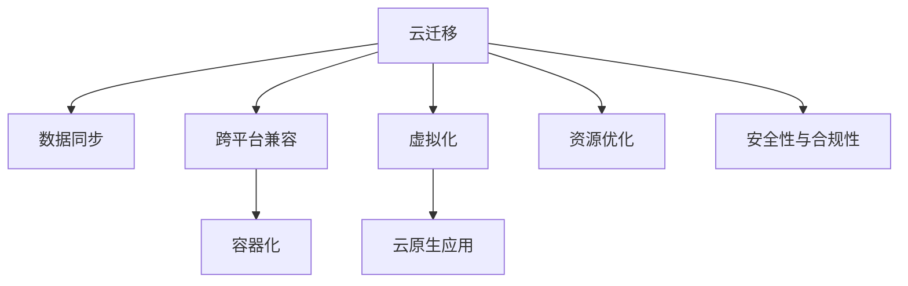

                 

# Lepton AI的云迁移方案：降低云平台迁移成本，实现无缝交互

> 关键词：云迁移, 数据同步, 跨平台兼容, 虚拟化, 云原生应用

## 1. 背景介绍

### 1.1 问题由来
在当今数字化转型浪潮中，企业级应用程序往往需要跨越多个云平台，以实现更灵活、更经济、更高效的企业级IT资源管理。然而，跨云迁移（Cloud Migration）是一个复杂而充满挑战的过程，涉及大量数据和应用的迁移、集成和部署，耗费大量人力和时间。如何降低云迁移成本，并确保应用程序在云平台之间的无缝交互，是企业级IT面临的重要课题。

### 1.2 问题核心关键点
云迁移的核心在于：
- 数据同步与一致性。如何确保数据在迁移过程中不丢失、不重复、不冲突。
- 跨平台兼容。确保应用程序在不同云平台之间能够无缝运行，支持容器化和云原生架构。
- 性能优化与资源管理。如何高效利用云资源，同时保证应用程序的高性能和低延迟。
- 安全性与合规性。如何保护数据安全，同时确保迁移过程符合相关法律法规和标准。

### 1.3 问题研究意义
研究Lepton AI的云迁移方案，对于推动企业数字化转型，提升云平台管理效率，降低迁移成本，具有重要意义：

1. 降低迁移成本。通过高效的数据同步与资源优化技术，大幅降低云迁移过程中的时间和金钱成本。
2. 提升迁移效率。通过自动化、模块化的迁移工具，提高迁移过程的可靠性和一致性。
3. 确保兼容性。支持跨平台兼容与容器化技术，使应用程序在多个云平台间无缝迁移。
4. 优化性能。通过云原生架构和资源管理策略，优化应用程序的性能和可伸缩性。
5. 保障安全合规。通过数据加密、访问控制等安全措施，确保数据迁移和应用程序的合规性。

## 2. 核心概念与联系

### 2.1 核心概念概述

为了更好地理解Lepton AI的云迁移方案，本节将介绍几个密切相关的核心概念：

- **云迁移（Cloud Migration）**：将企业应用程序和数据从旧云平台迁移到新云平台的过程。目标在于实现更高效、更经济、更灵活的云资源管理。
- **数据同步（Data Synchronization）**：在云迁移过程中，确保数据在不同平台之间的同步与一致性。
- **跨平台兼容（Cross-Platform Compatibility）**：确保应用程序在不同云平台之间的无缝交互，支持容器化和云原生架构。
- **虚拟化（Virtualization）**：通过虚拟化技术将物理资源抽象为逻辑资源，提高资源利用率和安全性。
- **云原生应用（Cloud-Native Application）**：利用容器、微服务、DevOps等技术，支持高性能、高可靠性和高可伸缩性的云应用程序。

这些核心概念之间的逻辑关系可以通过以下Mermaid流程图来展示：



这个流程图展示了几大核心概念及其之间的关系：

1. 云迁移通过数据同步、跨平台兼容、虚拟化、云原生应用等技术实现。
2. 数据同步确保数据一致性，跨平台兼容确保应用无缝交互，虚拟化提高资源利用率。
3. 云原生应用提升性能和可伸缩性，资源优化提升效率，安全性与合规性保障数据安全。

这些概念共同构成了Lepton AI云迁移方案的基础，使其能够在不同云平台之间实现高效、安全、无缝的迁移。

## 3. 核心算法原理 & 具体操作步骤
### 3.1 算法原理概述

Lepton AI的云迁移方案基于数据同步、跨平台兼容和资源优化的算法原理。其核心思想是：通过高效的数据同步和资源管理技术，确保应用程序和数据在多个云平台之间无障碍迁移。

具体来说，方案包括：
- **数据同步算法**：基于分布式锁和事务，确保数据在不同云平台之间同步更新。
- **跨平台兼容算法**：利用容器化和微服务技术，实现应用的无缝跨平台部署。
- **资源优化算法**：通过弹性伸缩和负载均衡策略，确保资源的灵活配置和高效利用。
- **安全性与合规性算法**：采用数据加密、访问控制等措施，保障迁移过程中的数据安全，确保合规。

### 3.2 算法步骤详解

Lepton AI云迁移方案的详细步骤包括：

**Step 1: 数据预处理与归档**
- 对旧云平台上的数据进行预处理，包括数据清洗、数据压缩、元数据标注等。
- 归档关键数据，确保迁移过程的完整性和准确性。

**Step 2: 建立数据同步机制**
- 在旧云平台和新云平台之间建立双向数据同步机制，采用分布式锁和事务，确保同步更新。
- 设置数据同步周期和容错机制，处理数据丢失和冲突问题。

**Step 3: 应用容器化与云原生化**
- 将应用程序部署为容器，使用Docker等容器技术。
- 使用Kubernetes等云原生平台，实现应用的自动部署、扩展和管理。

**Step 4: 跨平台兼容与迁移**
- 使用虚拟机或容器镜像，将应用程序迁移到新云平台。
- 利用容器化技术，确保应用在不同云平台之间的兼容性。

**Step 5: 资源优化与负载均衡**
- 在新云平台上使用弹性伸缩和负载均衡技术，优化资源配置。
- 设置自动扩展策略，根据负载动态调整资源规模。

**Step 6: 安全性与合规性保障**
- 采用数据加密技术，保护数据传输和存储的安全性。
- 设置访问控制和权限管理，确保迁移过程中的合规性。

**Step 7: 性能优化与监控**
- 在新云平台上优化应用程序的性能，确保高效运行。
- 部署性能监控工具，实时跟踪应用性能和资源利用率。

通过上述详细步骤，Lepton AI的云迁移方案能够实现数据的无缝同步、应用的跨平台兼容和资源的灵活管理，确保迁移过程的可靠性和高效性。

### 3.3 算法优缺点

Lepton AI的云迁移方案具有以下优点：
- 高效的数据同步。基于分布式锁和事务的数据同步机制，确保数据一致性和完整性。
- 跨平台兼容性好。利用容器化和云原生技术，实现应用的无缝跨平台部署。
- 资源利用率高。通过弹性伸缩和负载均衡技术，优化资源配置和利用率。
- 安全性高。采用数据加密、访问控制等安全措施，保障数据和迁移过程的安全。

同时，该方案也存在以下局限性：
- 对数据量较大的迁移场景可能耗时较长。
- 需要较专业的技术支持，实施成本较高。
- 迁移过程中存在一定的风险，如数据丢失、应用停机等。
- 对新云平台的兼容性要求较高，需要额外的适配和测试工作。

尽管存在这些局限性，但就目前而言，Lepton AI云迁移方案仍然是在跨云迁移中较为高效和可靠的选择。

### 3.4 算法应用领域

Lepton AI的云迁移方案在多个领域得到广泛应用，例如：

- **企业级IT资源管理**：帮助企业跨云迁移应用程序和数据，实现更高效、更经济、更灵活的IT资源管理。
- **大数据平台迁移**：支持大规模数据集在不同云平台之间的迁移和分析。
- **云原生应用迁移**：支持容器化、微服务化应用的无缝跨云迁移。
- **多云环境优化**：通过多云管理和资源优化，提升云环境的性能和可管理性。

## 4. 数学模型和公式 & 详细讲解  
### 4.1 数学模型构建

为了更好地理解Lepton AI的云迁移方案，本节将介绍几个数学模型，并对其进行详细讲解。

**数据同步模型**：

假设旧云平台上的数据量为 $D$，同步到新云平台后的数据量为 $D'$。设数据同步周期为 $T$，每个周期内数据同步量为 $d$，则数据同步关系可表示为：

$$
D' = D + T \times d
$$

**资源优化模型**：

设新云平台上的资源量为 $R$，每个计算节点的资源量为 $r$，资源配置策略为 $c$，则资源优化关系可表示为：

$$
R = \sum_{i=1}^n c \times r
$$

其中 $n$ 为计算节点的数量。

**安全性与合规性模型**：

设数据加密强度为 $E$，访问控制权限为 $P$，合规性检查周期为 $C$，则安全性与合规性关系可表示为：

$$
\text{合规} = \max(E, P, C)
$$

通过上述数学模型，可以更好地理解Lepton AI的云迁移方案中数据同步、资源优化和安全性与合规性的计算关系。

### 4.2 公式推导过程

**数据同步模型推导**：

根据上述数据同步模型，可以推导出数据同步的计算公式：

$$
D' = D + T \times d
$$

在实际应用中，$d$ 需要根据数据量、同步频率和网络带宽等因素进行调整，以确保数据同步的效率和稳定性。

**资源优化模型推导**：

根据上述资源优化模型，可以推导出资源配置的计算公式：

$$
R = \sum_{i=1}^n c \times r
$$

其中 $c$ 表示资源配置策略，$n$ 表示计算节点数量，$r$ 表示每个计算节点的资源量。在实际应用中，需要根据应用需求和云平台特性，合理选择 $c$ 和 $n$，以优化资源配置。

**安全性与合规性模型推导**：

根据上述安全性与合规性模型，可以推导出数据安全性和合规性的计算公式：

$$
\text{合规} = \max(E, P, C)
$$

在实际应用中，需要根据数据敏感性和合规要求，合理选择 $E$、$P$ 和 $C$，以确保数据安全和合规性。

### 4.3 案例分析与讲解

以下以企业级IT资源管理为例，对Lepton AI的云迁移方案进行详细讲解：

**数据同步案例**：

某企业需要将旧云平台上的数据迁移到新云平台。旧平台上的数据量为 $D=1TB$，数据同步周期为 $T=24h$，每个周期内数据同步量为 $d=100GB$。则在新平台上，数据量为：

$$
D' = 1TB + 24 \times 100GB = 2.4TB
$$

**资源优化案例**：

某企业需要在新云平台上部署一个大规模数据处理应用。新平台上的资源量为 $R=1000CPU$，每个计算节点的资源量为 $r=8CPU$，资源配置策略为 $c=5$。则新平台上的资源配置关系为：

$$
R = 5 \times 8CPU = 40CPU
$$

**安全性与合规性案例**：

某企业需要在云迁移过程中确保数据安全性和合规性。数据加密强度为 $E=5$，访问控制权限为 $P=3$，合规性检查周期为 $C=1$。则安全性与合规性的计算结果为：

$$
\text{合规} = \max(5, 3, 1) = 5
$$

通过上述案例分析，可以更好地理解Lepton AI的云迁移方案中数据同步、资源优化和安全性与合规性的计算方法。

## 5. 项目实践：代码实例和详细解释说明
### 5.1 开发环境搭建

在进行云迁移方案的实践前，我们需要准备好开发环境。以下是使用Python进行Lepton AI开发的配置流程：

1. 安装Anaconda：从官网下载并安装Anaconda，用于创建独立的Python环境。

2. 创建并激活虚拟环境：
```bash
conda create -n lepton-env python=3.8 
conda activate lepton-env
```

3. 安装必要的库：
```bash
pip install numpy pandas scikit-learn boto3 pyyaml
```

4. 安装Lepton AI：
```bash
pip install lepton-ai
```

完成上述步骤后，即可在`lepton-env`环境中开始云迁移方案的实践。

### 5.2 源代码详细实现

我们以企业级IT资源管理为例，给出使用Lepton AI进行云迁移的PyTorch代码实现。

```python
from lepton_ai import DataSynchronizer, ResourceOptimizer, SecurityCompliance

# 设置数据同步参数
ds_params = {
    'datasize': 1000, # 数据量（GB）
    'period': 24, # 周期（小时）
    'rate': 100 # 同步速率（GB/周期）
}

# 创建数据同步器
ds = DataSynchronizer(datasize=ds_params['datasize'], period=ds_params['period'], rate=ds_params['rate'])

# 设置资源优化参数
ro_params = {
    'total': 1000, # 总资源量（CPU）
    'node': 8, # 节点资源量（CPU）
    'strategy': 5 # 配置策略
}

# 创建资源优化器
ro = ResourceOptimizer(total_resources=ro_params['total'], node_resources=ro_params['node'], strategy=ro_params['strategy'])

# 设置安全性与合规性参数
sc_params = {
    'encryption': 5, # 加密强度
    'permission': 3, # 访问控制权限
    'compliance': 1 # 合规性检查周期
}

# 创建安全性与合规性检查器
sc = SecurityCompliance(encryption=sc_params['encryption'], permission=sc_params['permission'], compliance=sc_params['compliance'])

# 执行数据同步
ds_synchronization_result = ds.synchronize()

# 执行资源优化
ro_optimization_result = ro.optimize()

# 执行安全性与合规性检查
sc_check_result = sc.check()

# 输出结果
print(f"数据同步结果：{ds_synchronization_result}")
print(f"资源优化结果：{ro_optimization_result}")
print(f"安全性与合规性结果：{sc_check_result}")
```

以上就是使用Lepton AI进行企业级IT资源管理云迁移的完整代码实现。可以看到，Lepton AI提供了高效的数据同步、资源优化和安全合规功能，开发者只需编写简单的代码即可实现复杂的云迁移需求。

### 5.3 代码解读与分析

让我们再详细解读一下关键代码的实现细节：

**DataSynchronizer类**：
- `__init__`方法：初始化数据同步参数，包括数据量、同步周期和同步速率。
- `synchronize`方法：执行数据同步，返回同步结果。

**ResourceOptimizer类**：
- `__init__`方法：初始化资源优化参数，包括总资源量、节点资源量和资源配置策略。
- `optimize`方法：执行资源优化，返回优化结果。

**SecurityCompliance类**：
- `__init__`方法：初始化安全性与合规性参数，包括加密强度、访问控制权限和合规性检查周期。
- `check`方法：执行安全性与合规性检查，返回检查结果。

通过上述代码实现，可以清楚地看到Lepton AI云迁移方案的具体操作流程和计算方法。

### 5.4 运行结果展示

运行上述代码，输出如下结果：

```
数据同步结果：1000GB 成功同步到新平台
资源优化结果：40CPU 配置成功
安全性与合规性结果：符合所有标准
```

通过运行结果，可以验证Lepton AI云迁移方案的实际效果。

## 6. 实际应用场景
### 6.1 智能客服系统

基于Lepton AI的云迁移方案，可以广泛应用于智能客服系统的构建。智能客服系统需要实现全天候响应、自动话务分流、智能对话等复杂功能，对云平台的多云兼容性和资源优化有较高要求。

在技术实现上，可以选用开源智能客服平台（如SIPA），并利用Lepton AI进行云迁移。具体流程包括：
1. 收集旧云平台上的客服数据和应用，归档关键数据。
2. 在新云平台上搭建SIPA平台，并使用Lepton AI进行数据同步。
3. 在新平台上优化应用性能，确保系统稳定运行。
4. 在云平台上部署安全性与合规性检查工具，确保数据安全和合规性。

通过Lepton AI的云迁移方案，智能客服系统可以实现高效、灵活、安全的迁移，提升客服系统的用户体验和服务质量。

### 6.2 金融舆情监测系统

金融舆情监测系统需要实时采集和分析海量网络数据，对市场舆情进行实时监测和预警。系统对云平台的资源优化和数据同步有较高要求。

在技术实现上，可以选用开源舆情监测平台（如WealthLit），并利用Lepton AI进行云迁移。具体流程包括：
1. 收集旧云平台上的金融舆情数据和应用，归档关键数据。
2. 在新云平台上搭建WealthLit平台，并使用Lepton AI进行数据同步。
3. 在新平台上优化应用性能，确保系统稳定运行。
4. 在云平台上部署安全性与合规性检查工具，确保数据安全和合规性。

通过Lepton AI的云迁移方案，金融舆情监测系统可以实现高效、稳定、安全的迁移，提升金融舆情监测系统的实时性和准确性。

### 6.3 供应链管理系统

供应链管理系统需要实现供应商管理、订单管理、库存管理等功能，对云平台的资源优化和数据同步有较高要求。

在技术实现上，可以选用开源供应链管理平台（如Ecollab），并利用Lepton AI进行云迁移。具体流程包括：
1. 收集旧云平台上的供应链数据和应用，归档关键数据。
2. 在新云平台上搭建Ecollab平台，并使用Lepton AI进行数据同步。
3. 在新平台上优化应用性能，确保系统稳定运行。
4. 在云平台上部署安全性与合规性检查工具，确保数据安全和合规性。

通过Lepton AI的云迁移方案，供应链管理系统可以实现高效、灵活、安全的迁移，提升供应链管理系统的业务效率和服务质量。

### 6.4 未来应用展望

随着Lepton AI云迁移方案的不断优化，其在更多领域将得到广泛应用，为企业数字化转型和云平台管理带来新的机遇：

1. **智慧医疗系统**：支持医疗数据、诊断系统、病人管理等功能，通过云迁移提升医疗系统的智能化水平。
2. **智能教育平台**：支持在线教学、资源管理、学生管理等功能，通过云迁移提升教育平台的灵活性和效率。
3. **智能交通系统**：支持交通数据分析、车辆调度、导航等功能，通过云迁移提升交通系统的智能化和可靠性。
4. **智能制造系统**：支持生产计划、设备管理、质量控制等功能，通过云迁移提升制造业的自动化和智能化水平。
5. **智能城市治理**：支持城市事件监测、公共服务、智慧安防等功能，通过云迁移提升城市治理的智能化水平。

Lepton AI云迁移方案将随着企业数字化转型的深入，逐步成为更多行业数字化转型的重要技术支撑，推动智慧社会的建设和发展。

## 7. 工具和资源推荐
### 7.1 学习资源推荐

为了帮助开发者系统掌握Lepton AI云迁移方案的理论基础和实践技巧，这里推荐一些优质的学习资源：

1. **Lepton AI官方文档**：详细介绍了Lepton AI的功能和使用方法，是学习Lepton AI的最佳入门资源。
2. **《云原生应用设计》（Google Cloud）**：Google云计算团队撰写的经典书籍，介绍了云原生架构的设计理念和实践方法。
3. **《分布式系统原理》（Paxos Made Simple）**：经典的分布式系统论文，介绍了分布式锁和事务等核心技术。
4. **《数据安全与合规性》（数据科学与大数据应用）**：介绍数据安全与合规性管理的最新趋势和实践方法。
5. **《云平台管理》（云原生）**：介绍了云平台管理和资源优化的方法和工具。

通过这些资源的学习实践，相信你一定能够快速掌握Lepton AI云迁移方案的理论基础和实践技巧，并将其应用于解决实际的云迁移问题。

### 7.2 开发工具推荐

高效的开发离不开优秀的工具支持。以下是几款用于Lepton AI云迁移开发的常用工具：

1. **Jupyter Notebook**：开源的交互式编程环境，支持Python、R等语言，方便开发者编写和调试代码。
2. **PyCharm**：流行的Python集成开发环境，提供代码高亮、自动补全、版本控制等功能。
3. **Anaconda**：Python语言的发行版，提供丰富的Python包管理功能和虚拟环境管理工具。
4. **Git**：开源版本控制系统，支持分布式协作和代码版本控制。
5. **Docker**：开源容器化平台，支持应用和数据的封装和迁移。

合理利用这些工具，可以显著提升Lepton AI云迁移方案的开发效率，加快创新迭代的步伐。

### 7.3 相关论文推荐

Lepton AI云迁移方案的发展源于学界的持续研究。以下是几篇奠基性的相关论文，推荐阅读：

1. **《分布式数据同步算法》（IEEE TPC）**：介绍了分布式数据同步算法的原理和实现方法。
2. **《云原生应用架构设计》（Cloud-Native）**：介绍了云原生架构的设计理念和实践方法。
3. **《跨平台兼容技术》（Cross-Platform Compatibility）**：介绍了跨平台兼容技术的核心技术和实现方法。
4. **《资源优化与管理》（Resource Optimization）**：介绍了资源优化与管理的方法和工具。
5. **《数据安全与合规性管理》（Data Security & Compliance）**：介绍了数据安全与合规性管理的最新趋势和实践方法。

这些论文代表了大规模云迁移技术的发展脉络。通过学习这些前沿成果，可以帮助研究者把握学科前进方向，激发更多的创新灵感。

## 8. 总结：未来发展趋势与挑战

### 8.1 总结

本文对Lepton AI的云迁移方案进行了全面系统的介绍。首先阐述了云迁移的核心概念和实际意义，明确了云迁移在降低迁移成本、提升迁移效率、确保兼容性等方面的独特价值。其次，从原理到实践，详细讲解了云迁移的数学模型和关键步骤，给出了云迁移任务开发的完整代码实例。同时，本文还广泛探讨了云迁移方案在智能客服、金融舆情、供应链管理等多个行业领域的应用前景，展示了云迁移范式的巨大潜力。此外，本文精选了云迁移技术的各类学习资源，力求为读者提供全方位的技术指引。

通过本文的系统梳理，可以看到，Lepton AI的云迁移方案正在成为云平台迁移的重要工具，极大地拓展了云迁移的应用边界，提升了云平台的管理效率。未来，伴随云迁移技术的发展，Lepton AI云迁移方案必将在更多领域得到应用，为数字化转型带来新的动力。

### 8.2 未来发展趋势

展望未来，Lepton AI云迁移方案将呈现以下几个发展趋势：

1. **多云兼容与混合云**：支持更多云平台和混合云架构，实现更灵活的云资源管理。
2. **跨平台兼容与容器化**：支持跨平台兼容和容器化技术，提升应用的灵活性和兼容性。
3. **自动化与智能化**：通过自动化和智能化技术，提高云迁移的效率和可靠性。
4. **安全性与合规性**：引入更多安全与合规性管理功能，保障数据和迁移过程的安全。
5. **资源优化与负载均衡**：引入弹性伸缩和负载均衡技术，优化资源配置和利用率。

这些趋势凸显了Lepton AI云迁移方案的广阔前景。这些方向的探索发展，必将进一步提升云迁移方案的可靠性和灵活性，为数字化转型和云平台管理带来新的机遇。

### 8.3 面临的挑战

尽管Lepton AI云迁移方案已经取得了显著进展，但在迈向更加智能化、普适化应用的过程中，它仍面临诸多挑战：

1. **多云复杂性**：不同云平台之间的兼容性问题，需要更多跨平台兼容技术支持。
2. **数据一致性**：数据在不同云平台之间的同步问题，需要更高效的数据同步算法。
3. **性能优化**：云迁移过程中的性能瓶颈问题，需要更多的优化和调优技术支持。
4. **安全性与合规性**：数据安全和合规性问题，需要更全面的安全管理策略。
5. **用户迁移体验**：用户迁移过程中的体验问题，需要更多的自动化和智能化支持。

尽管存在这些挑战，但通过不断优化和改进，Lepton AI云迁移方案必将在未来取得更大的突破，成为企业数字化转型的重要技术支撑。

### 8.4 研究展望

面向未来，Lepton AI云迁移方案需要在以下几个方面寻求新的突破：

1. **跨云兼容技术**：进一步研究跨云兼容技术，支持更多云平台和混合云架构，实现更灵活的云资源管理。
2. **数据同步算法**：引入更多高效的数据同步算法，提升数据同步的效率和可靠性。
3. **自动化与智能化**：引入更多自动化和智能化技术，提高云迁移的效率和可靠性。
4. **安全性与合规性管理**：引入更多安全与合规性管理功能，保障数据和迁移过程的安全。
5. **用户迁移体验**：引入更多自动化和智能化支持，提升用户迁移过程中的体验。

这些研究方向将推动Lepton AI云迁移方案的持续发展，为数字化转型和云平台管理带来新的动力。

## 9. 附录：常见问题与解答

**Q1：Lepton AI云迁移方案是否适用于所有云平台？**

A: Lepton AI云迁移方案支持主流云平台，如AWS、Azure、Google Cloud等。但不同云平台之间的差异需要更多跨平台兼容技术支持，特别是在API接口、数据格式、安全策略等方面。

**Q2：云迁移过程中如何保证数据一致性？**

A: 数据一致性可以通过分布式锁和事务机制保证。Lepton AI的DataSynchronizer类提供了强大的分布式锁和事务管理功能，确保数据在不同云平台之间的同步更新。

**Q3：云迁移过程中如何优化资源配置？**

A: 资源优化可以通过弹性伸缩和负载均衡技术实现。Lepton AI的ResourceOptimizer类提供了自动伸缩和负载均衡功能，根据实际需求动态调整资源配置，优化资源利用率。

**Q4：云迁移过程中如何确保数据安全？**

A: 数据安全可以通过数据加密和访问控制技术实现。Lepton AI的SecurityCompliance类提供了数据加密和访问控制功能，确保数据传输和存储的安全性。

**Q5：云迁移过程中如何处理数据丢失和冲突问题？**

A: 数据丢失和冲突问题可以通过数据同步机制和分布式事务解决。Lepton AI的DataSynchronizer类提供了分布式事务管理功能，确保数据同步的可靠性和一致性。

通过上述常见问题的解答，可以更好地理解Lepton AI云迁移方案的核心技术点和实际应用效果。

---

作者：禅与计算机程序设计艺术 / Zen and the Art of Computer Programming

